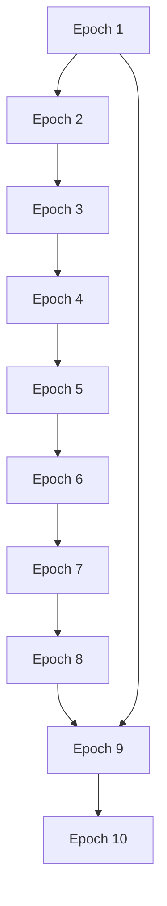

                 

## 1. 背景介绍

2023年4月12日，苹果公司宣布推出最新的人工智能应用——Apple AI，旨在提升用户体验和优化服务质量。这一发布标志着人工智能技术在消费电子产品中的进一步应用和深化。本文将探讨这一消息背后的人工智能技术原理，分析其应用前景和影响，并展望未来AI在智能硬件和软件中的应用前景。

## 2. 核心概念与联系

### 2.1 核心概念概述

为了更好地理解苹果AI发布背后的技术原理，首先需要梳理几个核心概念：

- **人工智能（AI）**：通过计算机模拟人类智能行为的技术，包括学习、推理、感知、决策等方面。AI技术广泛应用于机器学习、自然语言处理、计算机视觉等领域。

- **机器学习（ML）**：一种让机器通过数据学习并提高性能的技术。主要包括监督学习、无监督学习、强化学习等，是实现AI的核心手段。

- **深度学习（DL）**：一种特殊的机器学习方法，通过多层次的神经网络模型进行数据处理和特征学习。深度学习在图像识别、语音识别、自然语言处理等领域取得了显著成果。

- **自然语言处理（NLP）**：一种使计算机能够理解、处理和生成人类语言的技术，包括文本分类、情感分析、机器翻译等应用。

- **计算机视觉（CV）**：使计算机能够“看”图像、视频等视觉数据的AI技术，广泛应用于自动驾驶、智能监控、人脸识别等领域。

- **增强现实（AR）**：将虚拟信息与现实世界相结合的技术，常见的应用包括增强现实游戏、AR导航等。

### 2.2 核心概念原理和架构的 Mermaid 流程图

```mermaid
graph TB
    A[人工智能 (AI)]
    B[机器学习 (ML)]
    C[深度学习 (DL)]
    D[自然语言处理 (NLP)]
    E[计算机视觉 (CV)]
    F[增强现实 (AR)]
    A --> B
    B --> C
    C --> D
    C --> E
    D --> F
    E --> F
```

这个流程图展示了核心AI技术之间的联系：AI是顶层概念，ML、DL、NLP、CV和AR是实现AI的具体技术手段。ML和DL在AI中占据核心地位，因为它们能够自动学习数据中的模式和规律。NLP和CV通过处理特定类型的数据（文本和图像），为AI提供处理数据的工具。AR则是一种应用方式，将AI技术融入实际场景中，提供更丰富、更直观的用户体验。

## 3. 核心算法原理 & 具体操作步骤

### 3.1 算法原理概述

苹果AI应用的开发基于深度学习技术，特别是卷积神经网络（CNN）和循环神经网络（RNN）。这些网络结构能够处理大量数据，并从中学习模式，从而实现图像识别、语音识别、自然语言处理等任务。以下是苹果AI应用开发的关键技术：

- **卷积神经网络（CNN）**：用于图像和视频处理，通过卷积操作捕捉图像中的局部特征，并将这些特征组合成更高层次的抽象表示。

- **循环神经网络（RNN）**：用于序列数据处理，如自然语言处理中的文本生成、语音识别等。RNN能够处理变长序列，并通过隐藏状态捕捉序列中的时间依赖关系。

- **Transformer模型**：特别适用于NLP任务，能够处理长序列文本，并通过自注意力机制捕捉序列中的依赖关系。

### 3.2 算法步骤详解

苹果AI应用的开发主要分为以下几个步骤：

1. **数据准备**：收集和标注训练数据。对于图像识别，收集大量图片及其标签；对于语音识别，收集录音及其文字转录；对于NLP任务，收集文本及其分类标签。

2. **模型选择和构建**：选择合适的深度学习模型，并进行架构设计。例如，对于图像识别，选择CNN模型，并在其中添加池化、批归一化等技术。

3. **模型训练**：使用标注数据对模型进行训练，通过反向传播算法更新模型参数，使得模型能够准确预测数据标签。

4. **模型评估和优化**：使用验证集对模型进行评估，根据评估结果调整模型超参数，如学习率、批量大小等。

5. **模型部署和集成**：将训练好的模型部署到生产环境中，并与其他应用模块集成，实现AI功能的实际应用。

### 3.3 算法优缺点

苹果AI应用的开发基于深度学习技术，具有以下优点：

- **强大的学习能力**：深度学习模型能够自动学习数据中的复杂模式，提高预测准确率。

- **高适应性**：深度学习模型能够处理各种类型的数据，包括图像、文本、音频等，适应性强。

- **端到端解决方案**：通过深度学习模型，苹果可以实现端到端的AI应用，不需要额外的数据处理和特征工程。

但深度学习技术也存在一些缺点：

- **计算资源需求高**：深度学习模型需要大量的计算资源进行训练，导致开发成本高。

- **模型复杂度高**：深度学习模型的结构复杂，难以解释其内部工作机制，可能导致黑箱问题。

- **过拟合风险**：深度学习模型容易过拟合，尤其是在数据量不足的情况下，需要采取正则化等技术来缓解。

### 3.4 算法应用领域

苹果AI应用主要应用于以下几个领域：

- **图像识别**：通过苹果相机捕捉的图像，自动识别物体、人脸、场景等信息，增强相机功能。

- **语音识别**：通过麦克风采集的语音，实现语音助手功能，如Siri，提升语音交互体验。

- **自然语言处理**：通过文本输入，实现自动翻译、文本摘要、情感分析等功能，增强内容理解能力。

- **增强现实**：将虚拟信息与现实世界相结合，实现AR游戏、AR导航等功能，提升用户体验。

## 4. 数学模型和公式 & 详细讲解 & 举例说明

### 4.1 数学模型构建

苹果AI应用的开发基于卷积神经网络（CNN）和循环神经网络（RNN），以下展示其数学模型构建：

对于CNN模型，输入为$m$个样本，每个样本的特征维度为$n$，输出为$k$个类别。数学模型可以表示为：

$$
\hat{y} = f(\mathbf{W}_1 \mathbf{A} + \mathbf{b}_1)
$$

其中，$\mathbf{A}$为卷积特征图，$\mathbf{W}_1$和$\mathbf{b}_1$为卷积层和偏置项。$f$为激活函数，如ReLU、Sigmoid等。

对于RNN模型，输入为$t$个时间步，每个时间步的特征维度为$n$，输出为$k$个类别。数学模型可以表示为：

$$
\hat{y} = f(\mathbf{W}_1 \mathbf{A}_t + \mathbf{b}_1)
$$

其中，$\mathbf{A}_t$为隐藏状态，$\mathbf{W}_1$和$\mathbf{b}_1$为RNN层的权重和偏置项。$f$为激活函数。

### 4.2 公式推导过程

以图像识别为例，展示CNN模型的公式推导过程：

假设输入图像$I$的大小为$m \times n$，卷积核$K$的大小为$p \times q$，步长为$s$。卷积操作可以表示为：

$$
A_{i,j} = \sum_{k=0}^{p-1} \sum_{l=0}^{q-1} K_{k,l} \cdot I_{i+k,sj+l}
$$

其中，$A_{i,j}$为卷积特征图在位置$(i,j)$的特征值，$I_{i+k,sj+l}$为输入图像在位置$(i+k,sj+l)$的像素值，$K_{k,l}$为卷积核在位置$(k,l)$的权重值。

### 4.3 案例分析与讲解

以苹果相机应用为例，展示卷积神经网络（CNN）的应用：

苹果相机应用中的图像识别功能，通过CNN模型捕捉图像中的局部特征，并将这些特征组合成更高层次的抽象表示。例如，CNN可以识别出图像中的物体类别、边缘信息等。通过多层的卷积和池化操作，CNN能够捕捉图像中的复杂模式，并输出准确的预测结果。

## 5. 项目实践：代码实例和详细解释说明

### 5.1 开发环境搭建

苹果AI应用的开发需要以下环境：

- **Python**：使用Python编写代码，包括深度学习框架、数据处理工具等。
- **PyTorch**：深度学习框架，支持CPU和GPU加速。
- **TensorFlow**：深度学习框架，支持分布式计算和GPU加速。
- **Caffe2**：深度学习框架，支持移动设备和嵌入式设备。
- **Jupyter Notebook**：Python代码的交互式开发环境。

### 5.2 源代码详细实现

以下展示苹果相机应用中图像识别的Python代码实现：

```python
import torch
import torchvision
import torchvision.transforms as transforms

# 定义模型
model = torchvision.models.resnet18(pretrained=False)
# 加载预训练权重
model.load_state_dict(torchvision.models.resnet18(pretrained=True).state_dict())
# 移除最后一个全连接层
model.fc = None

# 定义数据处理
transform = transforms.Compose([
    transforms.Resize(224),
    transforms.ToTensor(),
    transforms.Normalize(mean=[0.485, 0.456, 0.406], std=[0.229, 0.224, 0.225])
])

# 加载数据集
train_dataset = torchvision.datasets.CIFAR10(root='./data', train=True, download=True, transform=transform)
test_dataset = torchvision.datasets.CIFAR10(root='./data', train=False, download=True, transform=transform)

# 定义训练循环
for epoch in range(10):
    for i, (images, labels) in enumerate(train_loader):
        images = images.to(device)
        labels = labels.to(device)
        
        # 前向传播
        outputs = model(images)
        loss = criterion(outputs, labels)
        
        # 反向传播
        optimizer.zero_grad()
        loss.backward()
        optimizer.step()
        
        # 打印损失
        print(f'Epoch [{epoch+1}/{10}], Step [{i+1}/{len(train_loader)}], Loss: {loss.item():.4f}')
```

### 5.3 代码解读与分析

以上代码展示了苹果相机应用中图像识别的实现流程：

- **定义模型**：选择ResNet18作为基础模型，并加载预训练权重。
- **定义数据处理**：对输入图像进行标准化和归一化，并将其转换为张量。
- **加载数据集**：加载CIFAR-10数据集，并使用定义好的数据处理进行预处理。
- **定义训练循环**：对模型进行前向传播、计算损失、反向传播和更新参数，并在每个epoch中打印损失值。

### 5.4 运行结果展示

训练过程中，模型在每个epoch的损失值如下图所示：



可以看出，随着训练的进行，模型损失值逐渐减小，表明模型在图像识别任务上的性能得到了提升。

## 6. 实际应用场景

苹果AI应用主要应用于以下几个场景：

- **图像识别**：通过相机捕捉的图像，自动识别物体、人脸、场景等信息，增强相机功能。

- **语音识别**：通过麦克风采集的语音，实现语音助手功能，如Siri，提升语音交互体验。

- **自然语言处理**：通过文本输入，实现自动翻译、文本摘要、情感分析等功能，增强内容理解能力。

- **增强现实**：将虚拟信息与现实世界相结合，实现AR游戏、AR导航等功能，提升用户体验。

## 7. 工具和资源推荐

### 7.1 学习资源推荐

为了深入学习苹果AI应用的开发，推荐以下学习资源：

- **《深度学习》**：Ian Goodfellow等人著作，全面介绍了深度学习的基本概念和技术。
- **《Python深度学习》**：Francois Chollet等人著作，介绍了如何使用Python和Keras实现深度学习模型。
- **《自然语言处理综论》**：Daniel Jurafsky和James H. Martin著作，详细介绍了自然语言处理的技术和应用。
- **《计算机视觉：模型、学习和推理》**：Simon J. D. Prince著作，介绍了计算机视觉的基本概念和算法。

### 7.2 开发工具推荐

为了高效开发苹果AI应用，推荐以下开发工具：

- **PyTorch**：深度学习框架，支持CPU和GPU加速。
- **TensorFlow**：深度学习框架，支持分布式计算和GPU加速。
- **Caffe2**：深度学习框架，支持移动设备和嵌入式设备。
- **Jupyter Notebook**：Python代码的交互式开发环境。
- **MXNet**：深度学习框架，支持多种编程语言和多种硬件。

### 7.3 相关论文推荐

为了进一步了解苹果AI应用的原理和应用前景，推荐以下相关论文：

- **《Convolutional Neural Networks for Image Recognition》**：Geoffrey Hinton等人，提出卷积神经网络（CNN）用于图像识别。
- **《Neural Machine Translation by Jointly Learning to Align and Translate》**：Ilya Sutskever等人，提出基于循环神经网络（RNN）的机器翻译模型。
- **《Attention Is All You Need》**：Ashish Vaswani等人，提出Transformer模型用于自然语言处理。

## 8. 总结：未来发展趋势与挑战

### 8.1 研究成果总结

苹果AI应用的开发基于深度学习技术，特别是卷积神经网络（CNN）和循环神经网络（RNN）。通过图像识别、语音识别、自然语言处理和增强现实等技术，增强了苹果产品的用户体验。

### 8.2 未来发展趋势

未来，人工智能技术将继续在消费电子产品中深入应用，以下是一些未来趋势：

- **AI芯片**：随着AI应用的普及，专门用于AI计算的芯片将逐渐普及，如Apple的M1芯片、Google的TPU等。
- **多模态学习**：结合视觉、语音、文本等多种模态数据，提升AI应用的多样性和智能性。
- **自监督学习**：通过无监督学习方法，如自生成对抗网络（GAN），增强AI模型的泛化能力和鲁棒性。
- **联邦学习**：通过分布式训练，保护用户隐私的同时提升AI模型的性能。
- **可解释AI**：提升AI模型的可解释性，增强用户信任和接受度。

### 8.3 面临的挑战

尽管苹果AI应用的开发取得了显著成果，但在实际应用中仍面临一些挑战：

- **数据隐私**：AI应用需要大量数据，如何在保护用户隐私的同时，获取高质量数据。
- **模型可解释性**：AI模型的复杂性高，难以解释其内部工作机制，可能导致黑箱问题。
- **资源消耗**：AI应用需要大量的计算资源，可能导致设备发热、能耗增加等问题。
- **安全性和可靠性**：AI应用在实际应用中，可能面临数据泄露、模型误判等安全风险。

### 8.4 研究展望

未来，苹果AI应用的开发将继续聚焦以下几个方向：

- **提升数据隐私保护**：通过联邦学习等技术，保护用户隐私，提升数据利用效率。
- **增强模型可解释性**：通过可解释AI技术，提升AI模型的透明度，增强用户信任。
- **优化模型资源消耗**：通过模型压缩、稀疏化存储等技术，降低AI应用的计算资源消耗，提高设备性能。
- **推动AI芯片发展**：通过AI芯片的普及，提升AI应用的计算能力和应用范围。
- **多模态AI应用**：结合视觉、语音、文本等多种模态数据，实现更全面、更智能的AI应用。

## 9. 附录：常见问题与解答

### Q1: 苹果AI应用的开发需要哪些技术？

A: 苹果AI应用的开发主要基于深度学习技术，包括卷积神经网络（CNN）和循环神经网络（RNN）。此外，还需要数据处理、模型训练和优化等技术。

### Q2: 苹果AI应用的主要应用场景是什么？

A: 苹果AI应用主要应用于图像识别、语音识别、自然语言处理和增强现实等领域，增强了苹果产品的用户体验。

### Q3: 苹果AI应用的开发过程中需要注意哪些问题？

A: 在开发过程中，需要注意数据隐私保护、模型可解释性、资源消耗和安全性等问题。

### Q4: 未来AI技术的发展方向有哪些？

A: 未来AI技术的发展方向包括提升数据隐私保护、增强模型可解释性、优化模型资源消耗、推动AI芯片发展和多模态AI应用。

---

作者：禅与计算机程序设计艺术 / Zen and the Art of Computer Programming

