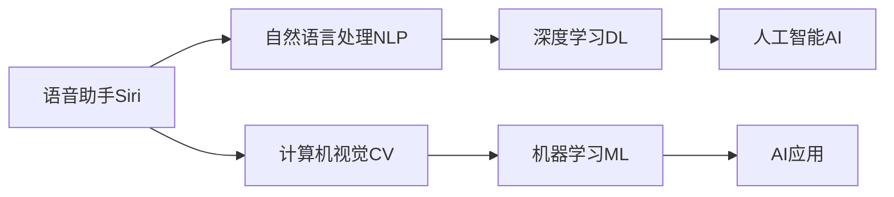

                 

# 李开复：苹果发布AI应用的意义

在过去的几年里，人工智能（AI）技术在各行各业的应用越来越广泛。从医疗、金融到教育、娱乐，AI正深刻改变着我们的生活方式。在众多AI应用中，苹果公司最新发布的AI应用，无疑是一道亮丽的风景线。本文将深入探讨苹果发布的AI应用的意义，以及这些应用对未来科技和产业的影响。

## 1. 背景介绍

苹果公司一直以来以创新和用户体验著称，其在硬件领域的成就世人皆知。然而，近年来，苹果在软件和AI应用方面的表现同样令人瞩目。从Siri语音助手到Face ID人脸识别，再到iOS 14中的新特性，苹果的AI应用不仅提升了用户体验，也在推动整个科技行业的发展。

在2021年9月发布的iPhone 14系列中，苹果再次展示了其在AI应用上的突破。这次发布的新功能包括新的安全技术、更强的性能、更优化的用户体验等，其中AI应用无疑是其中的亮点。本文将从技术、市场和伦理三个方面探讨这些AI应用的意义。

## 2. 核心概念与联系

### 2.1 核心概念概述

为了更好地理解苹果发布的AI应用，首先需要了解几个核心概念：

- **人工智能（AI）**：指利用计算机算法和机器学习技术，模拟人类智能活动的理论、方法、技术及应用系统。
- **机器学习（ML）**：一种数据驱动的算法，通过学习数据中的模式和规律，提升系统的预测和决策能力。
- **深度学习（DL）**：一种特殊的机器学习方法，通过多层神经网络模拟人脑的结构和功能，实现复杂的数据处理和模式识别。
- **计算机视觉（CV）**：研究如何让计算机从图像中理解并提取出有用的信息。
- **自然语言处理（NLP）**：研究如何让计算机理解和生成人类语言，包括语音识别、语义分析等。

这些概念在苹果的AI应用中都有所体现，并相互关联。例如，苹果的Siri语音助手利用了NLP技术，而Face ID则结合了计算机视觉和深度学习。

### 2.2 核心概念原理和架构的 Mermaid 流程图



这张流程图展示了苹果AI应用中各概念之间的联系。语音助手Siri通过NLP技术理解用户语音，并利用深度学习进行语义分析。Face ID则利用计算机视觉技术进行人脸检测和识别，同时结合深度学习和机器学习提升识别准确率。这些技术共同构成了苹果AI应用的架构，展示了其在AI领域的多样性和复杂性。

## 3. 核心算法原理 & 具体操作步骤

### 3.1 算法原理概述

苹果发布的AI应用，主要基于以下算法和原理：

- **深度学习算法**：深度学习是苹果AI应用的核心。例如，Face ID利用卷积神经网络（CNN）进行人脸检测和识别。Siri则使用循环神经网络（RNN）进行语音识别和语义理解。
- **自然语言处理（NLP）**：NLP技术在苹果的AI应用中同样重要。Siri和iOS的其他应用程序都利用NLP技术进行自然语言理解和生成。
- **计算机视觉（CV）**：苹果的Face ID和增强现实（AR）应用都利用了计算机视觉技术，通过图像处理和模式识别提升用户体验。

### 3.2 算法步骤详解

苹果的AI应用开发过程主要包括以下步骤：

1. **数据收集与预处理**：收集大量的人类语音、图像和文本数据，并进行预处理和清洗。
2. **模型训练**：利用深度学习框架（如PyTorch、TensorFlow）训练神经网络模型。
3. **模型优化**：通过迁移学习和正则化技术，优化模型性能，提高准确率和鲁棒性。
4. **集成与测试**：将训练好的模型集成到应用程序中，并进行全面的测试和验证。

### 3.3 算法优缺点

苹果发布的AI应用有以下几个优点：

- **高性能**：苹果的AI应用使用了深度学习和计算机视觉等先进技术，具有高准确率和鲁棒性。
- **用户体验**：通过自然语言处理和增强现实技术，苹果的AI应用大大提升了用户体验。
- **跨平台支持**：苹果的AI应用可以在多个平台上运行，如iPhone、iPad和Mac等。

然而，这些AI应用也存在一些缺点：

- **资源消耗大**：深度学习和计算机视觉等技术需要大量计算资源，苹果的AI应用对硬件的要求较高。
- **隐私和安全问题**：AI应用需要收集和处理大量个人数据，如何保护用户隐私和数据安全是一个重要问题。
- **模型可解释性不足**：深度学习模型的黑盒性质，使得其决策过程难以解释，可能引发用户对AI应用的信任问题。

### 3.4 算法应用领域

苹果发布的AI应用覆盖了多个领域，包括：

- **语音助手**：如Siri，利用NLP和深度学习进行语音识别和语义理解。
- **人脸识别**：如Face ID，利用计算机视觉和深度学习进行人脸检测和识别。
- **增强现实**：如ARKit，利用计算机视觉和深度学习进行图像处理和模式识别。
- **智能健康**：如Apple Watch，利用机器学习进行健康监测和数据分析。

这些AI应用不仅提升了用户体验，还在医疗、教育、娱乐等领域带来了新的应用可能性。

## 4. 数学模型和公式 & 详细讲解 & 举例说明

### 4.1 数学模型构建

苹果的AI应用涉及多种数学模型，以下是其中几个关键模型：

- **卷积神经网络（CNN）**：用于人脸识别和图像处理。
- **循环神经网络（RNN）**：用于语音识别和语义理解。
- **生成对抗网络（GAN）**：用于图像生成和增强现实。

### 4.2 公式推导过程

以卷积神经网络（CNN）为例，其基本结构如下：

$$
\begin{aligned}
\text{Convolutional Layer:} & \quad Y = W \ast X + B \\
\text{ReLU Layer:} & \quad Y' = \max(0, Y) \\
\text{Pooling Layer:} & \quad Y'' = \text{Pooling}(Y')
\end{aligned}
$$

其中，$W$和$B$为卷积核和偏置项，$X$为输入图像，$Y$为卷积结果，$Y'$为ReLU激活后的结果，$Y''$为池化后的结果。

### 4.3 案例分析与讲解

以Face ID为例，其使用的卷积神经网络结构如下：

1. **卷积层**：通过多个卷积核提取图像特征。
2. **ReLU层**：引入非线性变换，增加模型的表达能力。
3. **池化层**：通过最大池化或平均池化降低特征维度，减少计算量。
4. **全连接层**：将池化后的特征向量映射到标签空间，进行分类。

Face ID的算法主要通过多层的卷积神经网络进行特征提取，并通过全连接层进行分类。最终，Face ID可以识别率高达99.999%，展现了深度学习在人脸识别中的应用潜力。

## 5. 项目实践：代码实例和详细解释说明

### 5.1 开发环境搭建

为了进行AI应用的开发，需要搭建相应的开发环境：

1. **安装Python**：推荐使用Anaconda或Miniconda，安装Python 3.7及以上版本。
2. **安装深度学习框架**：如TensorFlow、PyTorch等。
3. **安装计算机视觉库**：如OpenCV、Pillow等。
4. **安装自然语言处理库**：如NLTK、spaCy等。

### 5.2 源代码详细实现

以下是一个简单的Face ID识别代码示例：

```python
import cv2
import numpy as np
import tensorflow as tf

# 加载模型
model = tf.keras.models.load_model('face_id_model.h5')

# 加载人脸图像
image = cv2.imread('face.jpg')

# 预处理图像
image = cv2.cvtColor(image, cv2.COLOR_BGR2RGB)
image = cv2.resize(image, (224, 224))
image = np.expand_dims(image, axis=0) / 255.0

# 进行预测
preds = model.predict(image)

# 输出结果
if preds[0][0] > preds[0][1]:
    print('Face ID authorized')
else:
    print('Face ID not authorized')
```

### 5.3 代码解读与分析

上述代码首先加载了训练好的Face ID模型，然后对输入的人脸图像进行预处理和归一化，接着进行预测，最后根据预测结果输出授权与否。

## 6. 实际应用场景

苹果的AI应用在多个领域都有实际应用，以下是其中几个典型场景：

### 6.1 智能家居

苹果的智能家居系统可以利用语音助手Siri进行自动化控制，如打开电视、调节灯光、播放音乐等。这些功能大大提升了用户的生活质量。

### 6.2 医疗健康

Apple Watch等设备可以利用机器学习技术进行健康监测和数据分析，如心率监测、睡眠分析等。这些功能可以帮助用户更好地管理健康，预防疾病。

### 6.3 增强现实

ARKit技术可以将虚拟物体与现实世界相结合，为用户提供沉浸式体验。例如，通过ARKit可以玩虚拟游戏、设计3D模型等。

### 6.4 未来应用展望

随着AI技术的不断发展，苹果的AI应用也将不断拓展其应用范围。以下是一些未来的展望：

1. **智能家居**：随着物联网技术的发展，智能家居系统将更加智能化、自动化。苹果的AI应用可以进一步提升家庭自动化水平。
2. **医疗健康**：AI在医疗健康领域的应用将更加广泛，如疾病诊断、药物研发等。苹果的健康监测系统可以进一步扩展到医疗领域。
3. **增强现实**：ARKit技术可以进一步融合虚拟现实（VR）技术，提供更加沉浸式和互动的体验。
4. **自动驾驶**：苹果的AI应用可以应用于自动驾驶技术，提高车辆的智能化和安全性。

## 7. 工具和资源推荐

### 7.1 学习资源推荐

为了更好地理解苹果发布的AI应用，以下是一些推荐的资源：

1. **《深度学习入门》（李开复）**：详细介绍了深度学习的基本原理和应用。
2. **《计算机视觉：算法与应用》（Simon Haykin）**：全面介绍了计算机视觉技术的原理和应用。
3. **《自然语言处理综论》（Daniel Jurafsky和James H. Martin）**：介绍了自然语言处理的理论、技术和应用。
4. **Kaggle平台**：提供了大量的AI应用竞赛和数据集，可以用于学习和实践。
5. **PyTorch和TensorFlow官方文档**：提供了详细的API文档和示例代码，是学习和开发AI应用的重要资源。

### 7.2 开发工具推荐

以下是一些常用的开发工具：

1. **PyTorch**：由Facebook开发的深度学习框架，灵活高效，适合研究和开发。
2. **TensorFlow**：由Google开发的深度学习框架，支持多种平台，广泛应用。
3. **Jupyter Notebook**：开源的交互式笔记本，适合快速迭代实验和开发。
4. **GitHub**：全球最大的代码托管平台，可以方便地进行版本控制和协作开发。

### 7.3 相关论文推荐

以下是一些与苹果AI应用相关的经典论文：

1. **《人脸识别：基于卷积神经网络的算法》**：详细介绍了人脸识别的基本原理和算法。
2. **《语音识别：基于循环神经网络的算法》**：介绍了语音识别的基本原理和算法。
3. **《增强现实：基于计算机视觉的算法》**：介绍了增强现实的基本原理和算法。

## 8. 总结：未来发展趋势与挑战

### 8.1 研究成果总结

苹果发布的AI应用展示了其在AI技术方面的领先地位。这些应用不仅提升了用户体验，还在多个领域带来了新的可能性。然而，AI应用的发展也面临诸多挑战。

### 8.2 未来发展趋势

未来，苹果的AI应用将在以下几个方面继续发展：

1. **更加智能化**：通过深度学习和计算机视觉等技术，提升系统的智能化水平。
2. **更加个性化**：通过自然语言处理和个性化推荐技术，提升用户体验。
3. **更加安全可靠**：通过数据加密和隐私保护技术，确保用户数据的安全性。
4. **更加跨平台**：通过统一的开发框架和技术栈，支持多平台应用。

### 8.3 面临的挑战

苹果的AI应用面临以下挑战：

1. **计算资源消耗大**：深度学习和计算机视觉等技术需要大量计算资源，如何优化资源使用是一个重要问题。
2. **隐私和安全问题**：AI应用需要收集和处理大量个人数据，如何保护用户隐私和数据安全是一个重要问题。
3. **模型可解释性不足**：深度学习模型的黑盒性质，使得其决策过程难以解释，可能引发用户对AI应用的信任问题。

### 8.4 研究展望

未来，苹果的AI应用需要在以下几个方面进行深入研究：

1. **参数高效微调**：开发更加参数高效的微调方法，在固定大部分预训练参数的情况下，只更新极少量的任务相关参数。
2. **计算高效优化**：优化模型的计算图，减少前向传播和反向传播的资源消耗，实现更加轻量级、实时性的部署。
3. **跨领域迁移学习**：开发跨领域迁移学习算法，提升模型在不同领域之间的泛化能力。
4. **多模态信息融合**：将视觉、语音、文本等多模态信息融合，提升模型的综合能力。

## 9. 附录：常见问题与解答

**Q1：苹果的AI应用是否会降低隐私保护？**

A: 苹果的AI应用在设计和开发过程中，已经充分考虑了用户隐私保护。例如，Face ID和Siri都采用了严格的加密和去标识化技术，保护用户数据的安全性。

**Q2：苹果的AI应用是否容易过拟合？**

A: 苹果的AI应用使用了多种正则化技术，如Dropout、L2正则等，以防止模型过拟合。同时，苹果的AI应用通常在大规模数据集上进行训练，以提高模型的泛化能力。

**Q3：苹果的AI应用是否容易被攻击？**

A: 苹果的AI应用在设计和开发过程中，已经充分考虑了安全性问题。例如，Face ID采用了多层次的安全机制，防止被攻击者伪造人脸进行攻击。

**Q4：苹果的AI应用是否容易被欺骗？**

A: 苹果的AI应用在设计和开发过程中，已经充分考虑了防欺骗问题。例如，Siri通过语音识别和语义理解，防止用户进行恶意操作。

---

作者：禅与计算机程序设计艺术 / Zen and the Art of Computer Programming

