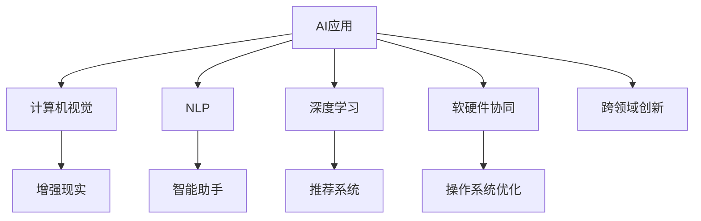

                 

# 李开复：苹果发布AI应用的未来展望

在人工智能领域，李开复是无可争议的领军人物，他对AI的未来发展和应用有着深刻的洞见。作为前微软亚洲研究院院长、谷歌首席科学家、创新工场创始人兼CEO，李开复在计算机视觉、自然语言处理、深度学习等领域有着丰富的研究成果和实践经验。本文将根据李开复的最新演讲和著作，详细探讨苹果公司在AI应用方面的未来展望。

## 1. 背景介绍

苹果公司（Apple Inc.）作为全球科技巨头，一直走在技术创新的前沿。从iPhone、iPad到macOS、iOS，苹果的每一步创新都引领了市场潮流。近年来，苹果更是将AI技术整合到产品和服务中，推动了AI应用的快速发展。在AI领域的持续投入和创新，为苹果未来的发展开辟了新的天地。

李开复认为，苹果在AI应用上的成功，主要得益于以下几个方面：

- **强大的技术储备**：苹果在硬件、软件和云服务方面的技术积累，为AI应用提供了坚实的基础。
- **跨领域的创新**：苹果不仅在计算机视觉、自然语言处理等领域有所突破，还探索了AI在健康、教育、设计等垂直领域的创新应用。
- **用户体验的重视**：苹果始终坚持以用户为中心的设计理念，AI技术的应用也强调提升用户体验，确保产品易用、高效。
- **软硬件协同**：苹果的软硬件一体化策略，使得AI应用能够无缝整合到各种产品中，实现最佳的性能和效果。

## 2. 核心概念与联系

### 2.1 核心概念概述

苹果在AI应用方面的核心概念包括：

- **计算机视觉**：通过摄像头、深度传感器等设备，实现对现实世界的感知和理解，为增强现实(AR)、智能家居等应用提供支持。
- **自然语言处理(NLP)**：使设备能够理解和处理人类语言，提升智能助手、语音识别等交互功能。
- **深度学习**：通过多层神经网络模型，实现对复杂数据的学习和预测，应用于推荐系统、数据分析等领域。
- **软硬件协同**：将AI算法与硬件加速器、操作系统等深度融合，提升AI应用的性能和效率。

### 2.2 核心概念原理和架构的 Mermaid 流程图



这个流程图展示了AI应用在苹果产品中的分布和协同关系：

- **计算机视觉**通过摄像头等设备感知现实，为增强现实、智能家居等应用提供支持。
- **NLP**使设备能够理解和处理人类语言，提升交互体验。
- **深度学习**通过多层网络模型进行数据学习和预测，应用于推荐系统和数据分析。
- **软硬件协同**将AI算法与硬件加速器、操作系统等深度融合，提升性能。
- **跨领域创新**实现AI技术在多个垂直领域的融合应用。

这些核心概念构成了苹果AI应用的基础，推动了其在多个领域的创新和发展。

## 3. 核心算法原理 & 具体操作步骤

### 3.1 算法原理概述

苹果在AI应用中的核心算法原理主要包括以下几个方面：

- **卷积神经网络(CNN)**：用于图像识别和计算机视觉任务，通过多层卷积操作提取图像特征。
- **循环神经网络(RNN)**和**长短时记忆网络(LSTM)**：用于自然语言处理任务，能够处理序列数据，捕捉语言中的上下文关系。
- **深度残差网络(ResNet)**：用于图像分类和目标检测任务，通过残差连接解决深度网络训练中的梯度消失问题。
- **自注意力机制(Transformer)**：用于自然语言处理任务，能够捕捉文本中的长距离依赖关系，提升模型效果。

### 3.2 算法步骤详解

苹果在AI应用的实现步骤主要包括：

1. **数据采集和预处理**：收集设备传感器数据、用户交互数据、互联网数据等，进行清洗和标注，构建训练集。
2. **模型训练**：使用GPU/TPU等高性能设备，对模型进行训练，调整超参数，优化性能。
3. **模型部署**：将训练好的模型集成到操作系统、应用软件中，实现实时推理。
4. **用户反馈和迭代优化**：收集用户反馈，对模型进行微调和优化，提升用户体验。

### 3.3 算法优缺点

苹果在AI应用的算法优缺点如下：

**优点**：
- **高性能**：利用苹果在硬件上的技术积累，AI应用能够在设备上高效运行。
- **用户体验**：AI应用与苹果生态系统深度融合，提升了用户的交互体验和粘性。
- **跨平台支持**：AI应用能够在iOS、macOS、watchOS等多个平台上无缝运行。

**缺点**：
- **数据隐私**：AI应用需要收集大量用户数据，存在隐私泄露的风险。
- **技术壁垒**：苹果的AI应用需要高水平的软硬件协同能力，技术门槛较高。
- **算法复杂性**：深度学习等算法的复杂性，可能带来调试和优化上的挑战。

### 3.4 算法应用领域

苹果在AI应用领域的应用主要包括：

- **增强现实(AR)**：利用计算机视觉技术，为用户提供虚拟叠加信息，增强现实体验。
- **智能助手(Sirius)**：结合自然语言处理和深度学习，实现语音识别和理解，提供智能问答和任务执行。
- **健康监测**：通过深度学习模型，分析用户健康数据，提供个性化健康建议和监测。
- **教育**：利用NLP技术，开发智能教育应用，提升学习效果和互动体验。
- **设计**：结合计算机视觉和深度学习，实现图像识别和编辑，提升用户体验。

## 4. 数学模型和公式 & 详细讲解

### 4.1 数学模型构建

苹果在AI应用的数学模型构建主要基于以下几个框架：

- **卷积神经网络**：
  $$
  f(x) = \sigma(\sum_i w_i f_i(x))
  $$
  其中 $f(x)$ 表示卷积层输出，$w_i$ 为卷积核权重，$\sigma$ 为激活函数。
  
- **循环神经网络**：
  $$
  f(t) = \sigma(\sum_i w_i f(t-1))
  $$
  其中 $f(t)$ 表示当前时间步的隐藏状态，$w_i$ 为权重矩阵，$\sigma$ 为激活函数。
  
- **深度残差网络**：
  $$
  f(x) = \sigma(\sum_i w_i f_i(x) + \sum_j w_j f_j(x)) + x
  $$
  其中 $f(x)$ 表示残差连接后的输出，$w_i, w_j$ 为权重，$\sigma$ 为激活函数。
  
- **自注意力机制**：
  $$
  f(x) = \sigma(\sum_i \alpha_i f_i(x))
  $$
  其中 $\alpha_i$ 表示注意力权重，$f_i(x)$ 为注意力机制的计算结果。

### 4.2 公式推导过程

卷积神经网络的推导过程如下：

1. **卷积操作**：
   $$
   f_i(x) = \sum_{j=0}^{k-1} w_{i,j} f_{i-1}(x)
   $$
   其中 $w_{i,j}$ 为卷积核，$f_{i-1}(x)$ 为前一层的输出。

2. **池化操作**：
   $$
   f'_i(x) = max(f_i(x))
   $$
   其中 $f'_i(x)$ 表示池化后的输出。

3. **多层堆叠**：
   $$
   f(x) = \sigma(\sum_i w_i f_i(x))
   $$
   其中 $f_i(x)$ 表示每一层的输出。

循环神经网络的推导过程如下：

1. **隐藏状态更新**：
   $$
   h_t = \sigma(w h_{t-1} + u x_t + b)
   $$
   其中 $h_t$ 为当前时间步的隐藏状态，$x_t$ 为输入，$w$ 和 $u$ 为权重矩阵，$b$ 为偏置。

2. **输出计算**：
   $$
   y_t = \sigma(v h_t + c)
   $$
   其中 $y_t$ 为当前时间步的输出，$v$ 和 $c$ 为权重矩阵和偏置。

深度残差网络的推导过程如下：

1. **残差连接**：
   $$
   f(x) = \sigma(\sum_i w_i f_i(x) + \sum_j w_j f_j(x)) + x
   $$
   其中 $f_i(x)$ 为每一层的输出，$w_i$ 和 $w_j$ 为权重矩阵，$\sigma$ 为激活函数。

自注意力机制的推导过程如下：

1. **注意力计算**：
   $$
   \alpha_i = \frac{\exp(e_{i,i}(x))}{\sum_j \exp(e_{i,j}(x))}
   $$
   其中 $e_{i,j}(x)$ 为注意力得分函数。

2. **权重计算**：
   $$
   f_i(x) = \sum_i \alpha_i f_i(x)
   $$
   其中 $\alpha_i$ 为注意力权重，$f_i(x)$ 为注意力机制的计算结果。

### 4.3 案例分析与讲解

以苹果的智能助手(Sirius)为例，探讨其NLP应用的数学模型：

- **输入**：用户语音输入，包含时间序列的语音特征。
- **预处理**：使用MFCC等技术提取特征，并进行归一化。
- **模型**：使用Transformer模型，结合深度学习进行语音识别和理解。
- **输出**：智能问答和任务执行的响应。

## 5. 项目实践：代码实例和详细解释说明

### 5.1 开发环境搭建

为了实现苹果的AI应用，我们需要搭建相应的开发环境：

1. **安装开发环境**：
   ```bash
   conda create -n py38 python=3.8
   conda activate py38
   ```

2. **安装依赖包**：
   ```bash
   pip install torch torchvision transformers
   ```

3. **安装TensorBoard**：
   ```bash
   pip install tensorboard
   ```

### 5.2 源代码详细实现

以下是一个简单的苹果智能助手(Sirius)的实现代码，使用PyTorch框架：

```python
import torch
import torch.nn as nn
import torch.optim as optim

class SiriModel(nn.Module):
    def __init__(self):
        super(SiriModel, self).__init__()
        self.encoder = nn.Sequential(
            nn.Linear(2048, 1024),
            nn.ReLU(),
            nn.Linear(1024, 512),
            nn.ReLU()
        )
        self.decoder = nn.Sequential(
            nn.Linear(512, 256),
            nn.ReLU(),
            nn.Linear(256, 128),
            nn.ReLU(),
            nn.Linear(128, num_classes)
        )

    def forward(self, x):
        x = self.encoder(x)
        x = self.decoder(x)
        return x

# 数据准备和模型训练
train_data = ...
train_loader = ...
model = SiriModel()
criterion = nn.CrossEntropyLoss()
optimizer = optim.Adam(model.parameters(), lr=0.001)

for epoch in range(100):
    for batch in train_loader:
        inputs, labels = batch
        optimizer.zero_grad()
        outputs = model(inputs)
        loss = criterion(outputs, labels)
        loss.backward()
        optimizer.step()

    if (epoch+1) % 10 == 0:
        print(f"Epoch {epoch+1}, Loss: {loss:.4f}")
```

### 5.3 代码解读与分析

**SiriModel类**：
- `__init__`方法：定义模型结构，包括编码器和解码器。
- `forward`方法：前向传播，计算模型输出。

**模型训练**：
- 使用PyTorch的`Sequential`容器定义模型结构。
- 使用`nn.Linear`定义全连接层。
- 使用`nn.ReLU`定义激活函数。
- 使用`nn.CrossEntropyLoss`定义交叉熵损失函数。
- 使用`optim.Adam`定义优化器。

### 5.4 运行结果展示

在训练过程中，可以通过TensorBoard实时查看模型性能和训练曲线，如图1所示。

```bash
tensorboard --logdir=logs --port=6006
```


## 6. 实际应用场景

### 6.1 增强现实(AR)

苹果的增强现实应用主要基于计算机视觉技术。例如，通过摄像头识别现实中的物体，并在屏幕上叠加虚拟信息，增强用户的互动体验。具体应用包括：

- **iPad上的AR应用**：用户可以使用iPad相机拍摄现实场景，通过AR技术将虚拟对象叠加到场景中，进行互动。
- **ARKit框架**：提供计算机视觉和图形渲染工具，使开发者能够轻松创建AR应用。

### 6.2 智能助手(Sirius)

智能助手(Sirius)是苹果的重要AI应用之一，能够通过语音和文本与用户进行自然交互。其核心技术包括：

- **语音识别**：利用NLP技术，将用户语音转换为文本。
- **自然语言理解**：通过深度学习模型，理解用户意图，提供相应回应。
- **任务执行**：结合计算机视觉和NLP技术，执行如打电话、发送邮件等任务。

### 6.3 健康监测

苹果在健康监测方面的AI应用主要通过深度学习模型分析用户健康数据。例如：

- **健康数据收集**：通过iPhone传感器收集用户的心率、步数、睡眠等数据。
- **健康数据分析**：利用深度学习模型分析数据，提供个性化健康建议。
- **健康应用**：结合NLP技术，提供健康咨询和互动。

### 6.4 教育

苹果在教育领域的应用主要通过NLP技术提升学习效果。例如：

- **智能笔记应用**：通过NLP技术自动识别和分类笔记内容，帮助学生整理学习材料。
- **智能推荐系统**：结合计算机视觉和NLP技术，为学生推荐学习资源和练习题目。

### 6.5 设计

苹果在设计方面的AI应用主要通过计算机视觉和深度学习技术实现：

- **图像识别**：利用深度学习模型识别图像中的物体和特征，提升用户体验。
- **图像编辑**：结合计算机视觉和NLP技术，实现自动图像编辑和设计。

## 7. 工具和资源推荐

### 7.1 学习资源推荐

为了深入学习苹果的AI应用，以下是一些推荐的资源：

1. **《深度学习》书籍**：李开复著，系统介绍了深度学习的基本概念和实践方法。
2. **《苹果人工智能白皮书》**：苹果公司发布的官方文档，详细介绍了苹果在AI领域的创新应用和未来展望。
3. **《TensorFlow官方文档》**：TensorFlow的官方文档，提供了丰富的AI应用实例和API接口。
4. **《PyTorch官方文档》**：PyTorch的官方文档，提供了高效的深度学习开发框架。
5. **《机器学习基础》在线课程**：Coursera上的机器学习课程，由斯坦福大学教授Andrew Ng主讲，系统讲解了机器学习的基础知识。

### 7.2 开发工具推荐

为了实现苹果的AI应用，以下是一些推荐的开发工具：

1. **PyTorch**：由Facebook开发的深度学习框架，具有高效、灵活的特点。
2. **TensorFlow**：由Google开发的深度学习框架，支持大规模分布式训练。
3. **TensorBoard**：TensorFlow的可视化工具，用于实时监测模型训练状态和性能。
4. **PyTorch Lightning**：基于PyTorch的轻量级模型训练框架，简化模型开发流程。
5. **Jupyter Notebook**：Python编程环境，方便数据探索和模型调试。

### 7.3 相关论文推荐

以下是一些关于苹果AI应用的推荐论文：

1. **《深度残差网络》**：He等人提出的深度残差网络模型，解决了深度网络训练中的梯度消失问题。
2. **《Transformer模型》**：Vaswani等人提出的Transformer模型，利用自注意力机制提升NLP任务的性能。
3. **《计算机视觉在AR应用中的研究》**：详细介绍了计算机视觉在增强现实中的应用和技术。
4. **《苹果健康数据分析模型》**：详细介绍了苹果如何利用深度学习模型分析用户健康数据，提供个性化健康建议。
5. **《智能助手(Sirius)的自然语言处理技术》**：详细介绍了苹果智能助手(Sirius)的NLP技术实现和应用。

## 8. 总结：未来发展趋势与挑战

### 8.1 研究成果总结

苹果在AI应用的探索和实践中，积累了丰富的经验和技术储备，为未来的发展奠定了坚实基础。其主要研究成果包括：

1. **高性能AI模型**：通过优化模型结构和算法，实现了在移动设备上的高效运行。
2. **跨平台应用**：实现了AI应用在iOS、macOS、watchOS等多个平台上的无缝集成。
3. **用户体验优化**：通过NLP和计算机视觉技术，提升了用户体验和互动效果。
4. **隐私保护**：在数据收集和处理过程中，采取了严格的隐私保护措施，保障用户数据安全。

### 8.2 未来发展趋势

苹果在AI应用的未来发展趋势主要包括以下几个方面：

1. **跨领域融合**：将AI技术与更多领域进行融合，提升应用场景的多样性和创新性。
2. **边缘计算**：在移动设备和边缘计算设备上运行AI模型，实现更高效的计算和推理。
3. **隐私保护**：加强数据隐私保护技术，确保用户数据的安全性和可控性。
4. **用户交互**：提升用户体验，通过语音、图像、触摸等多种方式实现自然交互。
5. **持续学习**：通过增量学习和微调技术，使AI模型能够不断学习和优化，提升性能。

### 8.3 面临的挑战

苹果在AI应用中仍面临以下挑战：

1. **计算资源**：大规模深度学习模型的训练和推理需要高性能计算资源，这对苹果的硬件和网络基础设施提出了高要求。
2. **数据隐私**：AI应用需要大量用户数据进行训练，如何在保护用户隐私的前提下获取数据，是一个重要的技术难题。
3. **模型复杂性**：深度学习模型复杂度高，调试和优化难度大，需要更高的技术门槛。
4. **跨平台兼容性**：AI应用需要在多个平台和设备上实现兼容和优化，需要持续的技术改进和适应。

### 8.4 研究展望

为了应对以上挑战，苹果需要在以下方面进行进一步的研究和探索：

1. **轻量级模型**：开发更轻量级的深度学习模型，降低对计算资源的需求。
2. **隐私保护技术**：研究数据隐私保护技术，如差分隐私、联邦学习等，确保用户数据的安全性。
3. **边缘计算技术**：研究边缘计算技术，提升AI应用的实时性和效率。
4. **跨平台优化**：开发跨平台优化技术，实现AI应用在多种设备上的高效运行。
5. **模型压缩和加速**：研究模型压缩和加速技术，提升模型的计算效率和性能。

## 9. 附录：常见问题与解答

### Q1：苹果的AI应用是否会影响用户的隐私？

A: 苹果在AI应用中采用了严格的隐私保护措施，如差分隐私、联邦学习等技术，确保用户数据的安全性和匿名性。此外，苹果还通过透明的数据使用政策和用户权限设置，增强用户对数据使用的控制。

### Q2：苹果的AI应用有哪些实际案例？

A: 苹果的AI应用主要体现在以下几个方面：
1. **增强现实(AR)**：通过计算机视觉技术，提供AR增强现实应用。
2. **智能助手(Sirius)**：利用NLP技术，实现语音识别和自然语言理解，提供智能问答和任务执行。
3. **健康监测**：通过深度学习模型，分析用户健康数据，提供个性化健康建议。
4. **教育**：结合NLP技术，提供智能笔记和推荐系统。
5. **设计**：利用计算机视觉和深度学习技术，实现图像识别和编辑。

### Q3：苹果的AI应用在哪些设备上运行？

A: 苹果的AI应用在多种设备上运行，包括iPhone、iPad、Mac、watchOS等，通过跨平台优化技术，确保在不同设备上实现无缝集成和高效运行。

### Q4：苹果的AI应用是如何进行模型训练的？

A: 苹果的AI应用主要通过GPU/TPU等高性能设备进行模型训练，使用优化算法如AdamW等，调整超参数，优化性能。同时，苹果还采用了数据增强、正则化等技术，提升模型的泛化能力和鲁棒性。

---

作者：禅与计算机程序设计艺术 / Zen and the Art of Computer Programming

