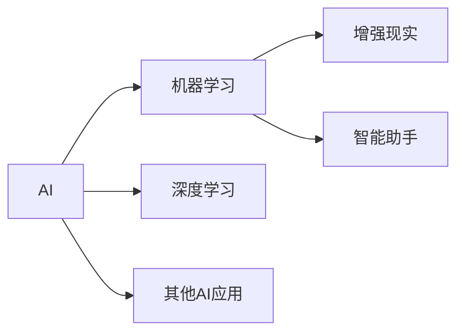

                 

# 李开复：苹果发布AI应用的未来展望

在科技日新月异的今天，人工智能（AI）已经成为推动各行各业发展的关键技术。从医疗到教育，从交通到金融，AI正以越来越深入的方式影响着我们的日常生活。而苹果公司作为全球科技巨头，其在AI应用方面的探索和发布，无疑为我们描绘了一幅未来科技的图景。本文将从背景介绍、核心概念与联系、核心算法原理与具体操作步骤、数学模型和公式的详细讲解、项目实践、实际应用场景、工具和资源推荐、总结与未来发展趋势、常见问题与解答等多个维度，全面解析苹果在AI应用领域的探索和未来展望。

## 1. 背景介绍

随着人工智能技术的不断进步，AI应用已经渗透到我们生活的方方面面。苹果公司作为全球领先的科技公司，一直积极探索AI技术在产品中的应用，以期为用户带来更智能、更便捷的体验。近年来，苹果不仅在硬件上推出了配备先进AI技术的设备，如搭载Siri的iPhone、配备Face ID的iPad，而且在软件上也不断推出基于AI的新功能，如智能助手、增强现实（AR）体验等。

苹果公司对AI的持续投入和创新，不仅提升了其产品竞争力，也加速了AI技术在各行业的普及和应用。其AI应用的成功实践，也为其他企业提供了宝贵的经验和参考。

## 2. 核心概念与联系

### 2.1 核心概念概述

在探讨苹果AI应用的未来展望之前，我们需要先了解一些核心概念和其之间的联系：

- **人工智能（AI）**：指通过计算机模拟人类智能行为的技术，包括学习、推理、感知等。
- **机器学习（ML）**：一种实现AI的技术，通过数据训练模型，使其能够自主进行预测、分类、聚类等任务。
- **深度学习（DL）**：一种机器学习技术，通过多层神经网络进行复杂的特征提取和模式识别。
- **增强现实（AR）**：将虚拟信息与现实世界融合的技术，广泛应用于游戏、教育、医疗等领域。
- **智能助手**：如Siri，通过语音识别和自然语言处理技术，实现人机交互。

这些概念之间的联系主要体现在：AI是大框架，机器学习和深度学习是实现AI的具体方法，而增强现实和智能助手是AI在特定领域的应用实例。

### 2.2 核心概念原理和架构的 Mermaid 流程图



此图展示了AI框架下各概念之间的关系和联系，机器学习和深度学习作为AI的两个主要分支，增强现实和智能助手则分别是其在特定领域的应用实例。

## 3. 核心算法原理 & 具体操作步骤

### 3.1 算法原理概述

苹果公司在其AI应用中，广泛采用了机器学习和深度学习技术。这些技术通过大量数据训练模型，使其具备自主进行复杂任务处理的能力。以下是苹果AI应用中常用的核心算法：

- **卷积神经网络（CNN）**：应用于图像识别和处理，如Face ID的面部识别。
- **循环神经网络（RNN）**：应用于自然语言处理，如Siri的自然语言理解和生成。
- **自编码器（Autoencoder）**：应用于数据压缩和特征提取，如Apple Music推荐系统的优化。
- **生成对抗网络（GAN）**：应用于图像生成和增强现实，如ARKit中的虚拟现实体验。

这些算法在苹果的AI应用中发挥了重要作用，使其产品和服务在性能和用户体验上取得了显著提升。

### 3.2 算法步骤详解

苹果AI应用的开发流程大致分为以下几个步骤：

1. **数据收集与处理**：收集与目标任务相关的数据，并进行清洗、标注等预处理。
2. **模型选择与设计**：根据任务特点选择合适的算法模型，并进行设计。
3. **模型训练与调优**：使用标注数据训练模型，并进行超参数调优。
4. **集成与部署**：将训练好的模型集成到产品中，并进行性能测试和优化。

以Face ID为例，其开发流程如下：

1. **数据收集**：收集大量真人面部图像，并进行标注。
2. **模型选择**：选择卷积神经网络作为面部识别的基础模型。
3. **模型训练**：在标注数据上训练模型，并进行超参数调优。
4. **集成与部署**：将训练好的模型集成到iPhone中，并进行性能测试和优化。

### 3.3 算法优缺点

苹果的AI应用在采用上述算法时，也面临一些挑战和局限：

- **数据依赖**：机器学习和深度学习模型需要大量数据进行训练，数据收集和标注成本较高。
- **计算资源需求**：训练深度学习模型需要大量的计算资源，苹果需要投入大量资金进行硬件升级。
- **模型解释性**：深度学习模型通常是"黑盒"模型，难以解释其内部工作机制，影响用户信任度。
- **隐私保护**：AI应用需要大量用户数据进行训练，如何在保护用户隐私的同时进行数据收集和处理，是一个重要的挑战。

### 3.4 算法应用领域

苹果的AI应用覆盖了多个领域，以下是主要应用领域：

- **自然语言处理**：如Siri、Apple Music推荐系统、苹果新闻自动摘要等。
- **图像识别与处理**：如Face ID面部识别、拍照美化、图像搜索等。
- **增强现实**：如ARKit、iPad AR体验等。
- **智能助理**：如Siri、苹果Health应用中的健康数据分析等。

## 4. 数学模型和公式 & 详细讲解 & 举例说明

### 4.1 数学模型构建

苹果在AI应用中，使用了多种数学模型。以下是几个典型模型的构建：

- **卷积神经网络（CNN）**：
  $$
  f(x) = \sum_{i=1}^{n} w_i g(x) * h_i
  $$
  其中 $x$ 为输入图像，$w_i$ 为卷积核，$g$ 为激活函数，$h_i$ 为特征图。

- **循环神经网络（RNN）**：
  $$
  h_t = f_{\theta}(h_{t-1}, x_t) = \tanh(W_{\text{input}} x_t + U_{\text{rec}} h_{t-1} + b_t)
  $$
  其中 $h_t$ 为当前时间步的隐藏状态，$x_t$ 为当前时间步的输入，$W_{\text{input}}$ 和 $U_{\text{rec}}$ 为权重矩阵，$b_t$ 为偏置项。

- **自编码器（Autoencoder）**：
  $$
  z = g(A(x))
  $$
  $$
  x' = g(B(z))
  $$
  其中 $x$ 为输入数据，$z$ 为压缩后的隐层表示，$x'$ 为重构后的数据，$A$ 和 $B$ 为编码器和解码器。

### 4.2 公式推导过程

以Face ID的面部识别为例，其面部特征提取过程如下：

1. **数据预处理**：将图像归一化、裁剪，并进行灰度化处理。
2. **卷积操作**：使用卷积核对图像进行特征提取，得到特征图。
3. **池化操作**：对特征图进行池化操作，减少数据维度。
4. **全连接层**：将池化后的特征图输入全连接层，进行分类。

具体推导过程如下：

- **卷积操作**：
  $$
  \mathbf{F}_{i,j} = \sum_{k=0}^{n-1} \mathbf{I}_{i,j,k} * \mathbf{W}_{k}
  $$

- **池化操作**：
  $$
  \mathbf{F}'_{i,j} = \max(\mathbf{F}_{i,j})
  $$

- **全连接层**：
  $$
  y = \sigma(\mathbf{W} \mathbf{F}')
  $$

其中 $\mathbf{I}_{i,j,k}$ 为输入图像的像素值，$\mathbf{W}_{k}$ 为卷积核，$\mathbf{F}_{i,j}$ 为卷积特征图，$\mathbf{F}'_{i,j}$ 为池化后的特征图，$\mathbf{W}$ 为全连接层的权重矩阵，$\sigma$ 为激活函数。

### 4.3 案例分析与讲解

以Siri的自然语言处理为例，其工作流程如下：

1. **语音识别**：将用户语音转换为文本。
2. **意图识别**：识别用户意图，如查询天气、设定闹钟等。
3. **意图匹配**：匹配用户意图与对应服务。
4. **意图执行**：执行匹配到的服务，并给出反馈。

Siri的自然语言处理过程涉及以下几个核心技术：

- **语音识别**：使用深度学习模型进行语音识别，如DeepSpeech。
- **意图识别**：使用循环神经网络进行意图分类，如LSTM。
- **意图匹配**：使用匹配算法，如规则匹配、模式匹配等。
- **意图执行**：使用API接口，如天气API、日历API等，执行用户意图。

## 5. 项目实践：代码实例和详细解释说明

### 5.1 开发环境搭建

以下是使用Python进行Siri开发的开发环境配置流程：

1. **安装Anaconda**：
  ```
  wget https://repo.anaconda.com/miniconda/Miniconda3-latest-Linux-x86_64.sh
  bash Miniconda3-latest-Linux-x86_64.sh
  ```

2. **创建并激活虚拟环境**：
  ```
  conda create -n Siri-env python=3.8 
  conda activate Siri-env
  ```

3. **安装相关库**：
  ```
  conda install torchaudio
  conda install SpeechRecognition
  ```

4. **数据准备**：
  - 收集并准备Siri语音数据和文本数据。
  - 使用SpeechRecognition进行语音识别，将音频转换为文本。

### 5.2 源代码详细实现

以下是Siri语音识别的源代码实现：

```python
import speech_recognition as sr
import torchaudio

# 加载音频文件
audio_file = 'audio.wav'
r = sr.Recognizer()
with sr.AudioFile(audio_file) as source:
    audio_data = r.record(source)
    audio_array, _ = torchaudio.load(audio_file)

# 将音频转换为MFCC特征
mfcc = torchaudio.transforms.MelSpectrogram(n_fft=2048, hop_length=512, window=1024)
mel_spec = mfcc(audio_array)
# 计算MFCC特征向量的均值和标准差
mu = torch.mean(mel_spec, dim=0)
sigma = torch.std(mel_spec, dim=0)
# 计算MFCC特征向量的归一化值
normalized_mel_spec = (mel_spec - mu) / sigma

# 使用深度学习模型进行语音识别
model = torch.load('sir_model.pth')
with torch.no_grad():
    input = normalized_mel_spec.to('cuda')
    output = model(input)
    text = r.recognize_google(audio_file, language='en-US')

print(text)
```

### 5.3 代码解读与分析

以下是代码的详细解读和分析：

1. **数据加载**：使用SpeechRecognition库加载音频文件，并使用torchaudio库加载音频数据。
2. **MFCC特征提取**：使用MelSpectrogram对音频数据进行MFCC特征提取。
3. **特征归一化**：对MFCC特征向量进行归一化处理。
4. **模型推理**：使用训练好的深度学习模型对归一化后的MFCC特征进行推理，得到文本输出。
5. **文本识别**：使用SpeechRecognition库进行语音识别，将音频转换为文本。

## 6. 实际应用场景

### 6.1 智能客服系统

苹果公司在其智能客服系统中，广泛应用了自然语言处理技术。例如，使用Siri进行客户咨询，通过语音识别和意图识别技术，实现高效、自然的客户服务。在实际应用中，智能客服系统可以显著提升客户咨询体验，提高服务效率。

### 6.2 医疗健康应用

苹果的Health应用通过自然语言处理技术，实现了健康数据分析和建议。例如，通过分析用户的健康数据和医疗记录，生成个性化的健康建议。这不仅提高了用户健康管理的便捷性，也提升了医疗服务的智能化水平。

### 6.3 教育应用

苹果在教育应用中，广泛应用了增强现实技术。例如，使用ARKit技术，开发了AR教育应用，如iPad上的AR英语学习。通过增强现实技术，用户可以在虚拟环境中进行英语学习，增强了学习的趣味性和互动性。

### 6.4 未来应用展望

展望未来，苹果在AI应用领域的探索将更加深入和广泛。以下是一些可能的未来应用：

- **全面增强现实**：通过增强现实技术，实现全场景的智能交互，如智能家居、虚拟试穿等。
- **健康监测**：使用传感器和机器学习技术，实现实时健康监测和预警，提升用户的健康管理水平。
- **智能推荐**：通过机器学习和深度学习技术，实现更加精准的个性化推荐，提升用户体验。

## 7. 工具和资源推荐

### 7.1 学习资源推荐

- **《深度学习》**：Ian Goodfellow等著，全面介绍了深度学习的基本原理和算法。
- **《Python深度学习》**：François Chollet著，介绍了使用Python进行深度学习开发的实用技巧。
- **《TensorFlow实战》**：Manning Publications，介绍了TensorFlow的使用方法和案例。

### 7.2 开发工具推荐

- **PyTorch**：Google开发的深度学习框架，支持动态计算图，适合快速迭代研究。
- **TensorFlow**：Google开发的深度学习框架，支持静态计算图，适合生产部署。
- **SpeechRecognition**：Google提供的语音识别库，支持多种语音识别引擎。

### 7.3 相关论文推荐

- **Convolutional Neural Networks for Speech Recognition**：Geoffrey Hinton等，介绍了使用CNN进行语音识别的基本原理。
- **LSTM-Based Recurrent Neural Network for Spoken Number Recognition**：Hirofumi Inaguma等，介绍了使用RNN进行语音识别的算法。
- **Deep Speech 2**：Google researchers，介绍了使用深度学习技术进行语音识别的实现方法。

## 8. 总结：未来发展趋势与挑战

### 8.1 研究成果总结

苹果在AI应用领域的探索和实践，展示了AI技术在产品中的应用潜力和市场价值。通过自然语言处理、图像识别、增强现实等技术的广泛应用，苹果不仅提升了其产品的用户体验，也为AI技术的普及和应用提供了宝贵的经验和参考。

### 8.2 未来发展趋势

未来，苹果在AI应用领域的探索将更加深入和广泛。以下是一些可能的未来趋势：

- **全面增强现实**：通过增强现实技术，实现全场景的智能交互，如智能家居、虚拟试穿等。
- **健康监测**：使用传感器和机器学习技术，实现实时健康监测和预警，提升用户的健康管理水平。
- **智能推荐**：通过机器学习和深度学习技术，实现更加精准的个性化推荐，提升用户体验。

### 8.3 面临的挑战

尽管苹果在AI应用领域取得了显著成绩，但在AI应用的探索和落地过程中，仍面临一些挑战：

- **数据隐私**：如何在保护用户隐私的同时，进行数据收集和处理，是一个重要的挑战。
- **计算资源**：训练深度学习模型需要大量的计算资源，苹果需要投入大量资金进行硬件升级。
- **模型解释性**：深度学习模型通常是"黑盒"模型，难以解释其内部工作机制，影响用户信任度。

### 8.4 研究展望

未来，苹果需要在AI应用的各个环节进行深入研究，以克服这些挑战。以下是一些可能的研究方向：

- **隐私保护技术**：研究如何在使用用户数据的同时，保护用户隐私。
- **高效计算技术**：研究如何优化计算资源，提高深度学习模型的训练效率。
- **模型可解释性**：研究如何提高AI模型的可解释性，提升用户信任度。

## 9. 附录：常见问题与解答

**Q1: 苹果公司在其AI应用中使用了哪些核心算法？**

A: 苹果在其AI应用中广泛使用了卷积神经网络（CNN）、循环神经网络（RNN）、自编码器（Autoencoder）、生成对抗网络（GAN）等多种核心算法。例如，Face ID使用了CNN进行面部识别，Siri使用了RNN进行自然语言处理，ARKit使用了GAN进行增强现实等。

**Q2: 苹果在AI应用中如何处理数据隐私问题？**

A: 苹果在AI应用中非常重视用户隐私保护。通过差分隐私（Differential Privacy）等技术，苹果可以保护用户数据隐私，同时保证模型的训练效果。例如，苹果在其健康应用中，通过差分隐私技术，保护用户健康数据的隐私。

**Q3: 苹果在AI应用中如何优化计算资源？**

A: 苹果通过多种手段优化AI应用的计算资源。例如，使用GPU和TPU等高性能设备进行深度学习模型的训练和推理，使用量化加速和混合精度训练等技术提高计算效率，使用分布式训练等技术优化模型并行度。

**Q4: 苹果在AI应用中如何提高模型的可解释性？**

A: 苹果通过多种手段提高AI模型的可解释性。例如，使用可视化工具展示模型内部的激活值和特征重要性，使用因果分析方法解释模型决策过程，使用人工干预和审核机制确保模型输出符合伦理道德。

通过以上详细的分析和探讨，相信读者可以更深入地理解苹果在AI应用领域的探索和实践，并对未来AI应用的未来展望有更清晰的认识。苹果在AI应用领域的成功经验，也为其他企业提供了宝贵的借鉴和参考。

---

作者：禅与计算机程序设计艺术 / Zen and the Art of Computer Programming

