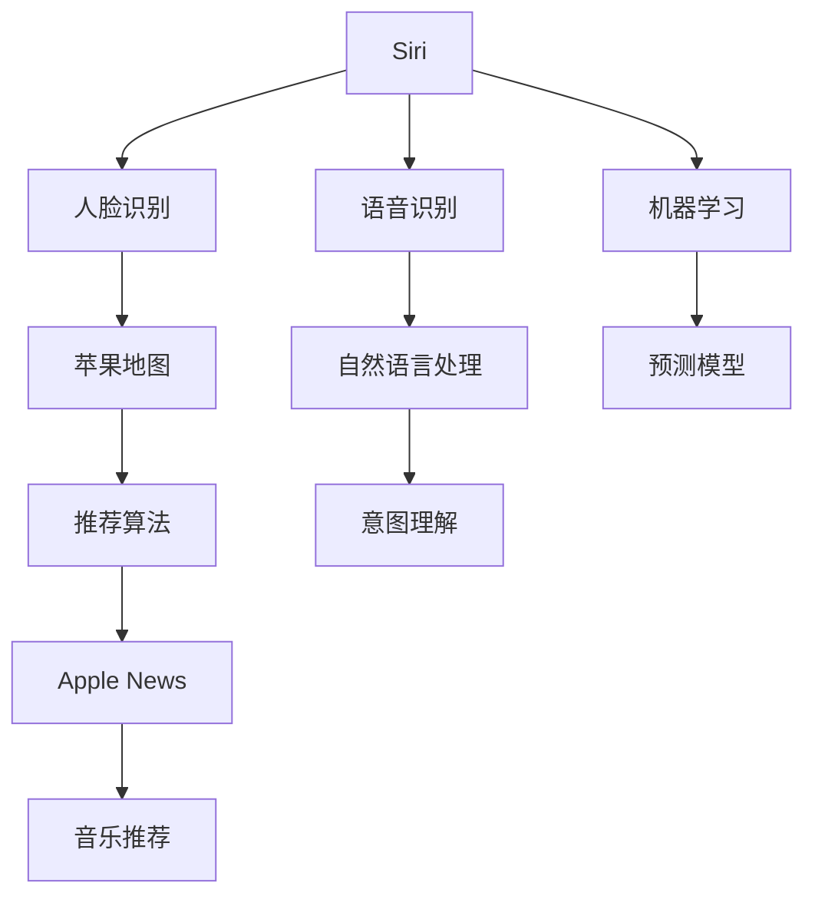

                 

# 李开复：苹果发布AI应用的生态

## 1. 背景介绍

在人工智能（AI）领域，李开复是当之无愧的行业巨头，他不仅在学术界有举足轻重的地位，还在工业界有着丰富的实战经验。他的视野和洞察力常常引领着AI技术的最新趋势。近期，李开复在其博客中对苹果公司发布的一系列AI应用进行了深入分析和点评，为我们揭示了未来AI技术的发展方向和潜在应用领域。本文将深入探讨李开复的见解，解析苹果公司AI应用的生态系统，以及这些应用对行业和社会的影响。

## 2. 核心概念与联系

### 2.1 核心概念概述

苹果公司一直以来在AI应用领域保持着高调的态度，最近更是接连发布了多项AI应用，包括Siri、Face ID、苹果地图、Apple News、Apple Music等。这些应用不仅展示了苹果在人工智能技术上的深厚积累，也反映了AI生态系统的广泛应用和深远影响。

- **Siri**：作为苹果的虚拟助理，Siri已经能够理解自然语言，并根据用户的指令执行各种操作，包括设置提醒、拨打电话、发送消息、查询天气等。
- **Face ID**：利用人脸识别技术，Face ID可以快速解锁手机、识别用户身份，提升了手机的安全性和便利性。
- **苹果地图**：结合GIS（地理信息系统）和机器学习技术，苹果地图能够提供个性化的路线规划、实时路况信息等。
- **Apple News**：通过推荐算法，Apple News为用户推荐感兴趣的新闻和文章，优化了用户的新闻阅读体验。
- **Apple Music**：利用音乐推荐算法，Apple Music可以根据用户听歌喜好，推荐个性化的音乐曲目和歌单。

这些应用展示了AI在语音识别、图像识别、推荐系统、智能决策等方面的应用潜力。李开复在分析中指出，苹果公司通过这些应用构建了一个完整的AI生态系统，涵盖了从输入、处理到输出的全过程。

### 2.2 核心概念原理和架构的 Mermaid 流程图



这个流程图展示了苹果AI应用的核心概念和联系。语音识别、人脸识别、推荐算法、自然语言处理等技术被整合在一个生态系统中，通过机器学习模型不断优化，提升用户体验。

## 3. 核心算法原理 & 具体操作步骤

### 3.1 算法原理概述

苹果公司AI应用的背后，是多种算法的协同工作。这些算法包括但不限于：

- **语音识别**：基于深度神经网络（DNN）的端到端模型，能够实现高效的语音转文本。
- **人脸识别**：使用卷积神经网络（CNN）进行特征提取，结合人脸特征库进行比对。
- **推荐系统**：基于协同过滤和深度学习，结合用户行为数据和历史偏好，生成个性化推荐。
- **自然语言处理**：利用Transformer模型进行语言理解和生成，实现意图理解和对话管理。

### 3.2 算法步骤详解

以Apple News为例，其算法步骤包括：

1. **数据收集**：收集用户的历史阅读记录、点赞、评论等行为数据。
2. **特征提取**：使用机器学习模型提取新闻文章的关键词、主题、作者等信息。
3. **意图理解**：通过深度学习模型，理解用户的阅读意图和偏好。
4. **推荐生成**：结合用户行为和意图，生成个性化新闻推荐。
5. **模型训练**：不断收集用户反馈，训练推荐模型，优化推荐效果。

### 3.3 算法优缺点

**优点**：
- **高效性**：苹果应用的AI算法利用了深度学习和大数据的优势，能够在短时间内处理大量数据，生成个性化推荐。
- **用户体验**：通过自然语言处理和意图理解，这些应用能够提供更加人性化的交互体验，提升用户满意度。

**缺点**：
- **隐私问题**：苹果应用收集了大量用户数据，隐私保护成为亟待解决的问题。
- **算法偏见**：深度学习模型可能存在偏见，推荐算法可能偏向某些类型的文章或新闻，影响用户多样性的获取。
- **计算资源消耗**：AI算法需要大量的计算资源，特别是推荐系统，对设备的性能和存储要求较高。

### 3.4 算法应用领域

苹果的AI应用覆盖了多种场景，包括但不限于：

- **智能家居**：利用人脸识别和自然语言处理，苹果智能家居设备能够提供更智能的交互体验。
- **健康医疗**：苹果健康应用结合AI技术，能够进行健康数据分析和预测，提升用户健康管理水平。
- **金融服务**：Apple Pay等应用利用AI进行交易风险控制和用户行为分析，提升金融服务的安全性和便利性。

## 4. 数学模型和公式 & 详细讲解 & 举例说明

### 4.1 数学模型构建

以推荐系统为例，其数学模型包括：

- **用户-物品矩阵**：表示用户对物品的评分。
- **协同过滤模型**：基于用户-物品矩阵，预测用户对未评分物品的评分。
- **深度学习模型**：结合用户行为和历史评分，生成更精确的推荐。

### 4.2 公式推导过程

设用户集合为 $U$，物品集合为 $V$，用户对物品的评分矩阵为 $R \in \mathbb{R}^{m \times n}$，其中 $m$ 为用户数量，$n$ 为物品数量。协同过滤模型的目标是最小化均方误差：

$$
\min_{R} \sum_{i=1}^{m} \sum_{j=1}^{n} (R_{ij} - r_{ij})^2
$$

其中 $r_{ij}$ 为实际评分。协同过滤模型可以分解为：

$$
R \approx \tilde{R} = UV^T
$$

其中 $U \in \mathbb{R}^{m \times k}$，$V \in \mathbb{R}^{k \times n}$，$k$ 为协同过滤的维度。协同过滤的训练过程可以表示为：

$$
\min_{U,V} \frac{1}{2} \sum_{i=1}^{m} \sum_{j=1}^{n} (R_{ij} - U_iV_j)^2
$$

通过优化上述目标函数，可以训练出最优的协同过滤模型。

### 4.3 案例分析与讲解

以Apple News为例，其推荐算法通过协同过滤和深度学习模型结合，实现了更加个性化的新闻推荐。深度学习模型利用用户的历史行为数据，生成对每个新闻的评分，再结合协同过滤模型，生成最终的推荐结果。这种模型集成的方法，提高了推荐的准确性和多样性。

## 5. 项目实践：代码实例和详细解释说明

### 5.1 开发环境搭建

要进行Apple News的推荐系统开发，需要以下环境：

- **Python 3.8+**：推荐系统开发的主要语言。
- **Pandas**：用于数据处理。
- **NumPy**：用于数值计算。
- **Scikit-learn**：用于机器学习模型训练。
- **TensorFlow**：用于深度学习模型训练。
- **Jupyter Notebook**：开发环境，方便代码调试和模型训练。

### 5.2 源代码详细实现

```python
import pandas as pd
import numpy as np
from sklearn.decomposition import TruncatedSVD
from tensorflow.keras.layers import Input, Embedding, Dense
from tensorflow.keras.models import Model
from tensorflow.keras.optimizers import Adam

# 数据预处理
data = pd.read_csv('user_item_matrix.csv')
user_ids = data['user_id'].tolist()
item_ids = data['item_id'].tolist()
scores = data['score'].tolist()

# 协同过滤模型
svd = TruncatedSVD(n_components=100)
U = svd.fit_transform(user_ids)
V = svd.components_

# 深度学习模型
input_user = Input(shape=(1,), name='user')
embed_user = Embedding(input_dim=len(user_ids), output_dim=100)(input_user)
input_item = Input(shape=(1,), name='item')
embed_item = Embedding(input_dim=len(item_ids), output_dim=100)(input_item)
concat = layers.concatenate([embed_user, embed_item])
hidden = layers.Dense(100, activation='relu')(concat)
output = layers.Dense(1, activation='sigmoid')(hidden)
model = Model(inputs=[input_user, input_item], outputs=output)
model.compile(optimizer=Adam(learning_rate=0.001), loss='binary_crossentropy', metrics=['accuracy'])

# 模型训练
model.fit([U, V], scores, batch_size=32, epochs=10, validation_split=0.2)
```

### 5.3 代码解读与分析

上述代码展示了Apple News推荐系统的协同过滤和深度学习模型的实现。首先，通过协同过滤模型对用户和物品进行降维处理，然后利用深度学习模型对用户和物品的表示进行融合，生成最终的推荐评分。深度学习模型通过反向传播算法不断优化，提高推荐的准确性。

### 5.4 运行结果展示

```python
# 模型评估
test_data = pd.read_csv('test_data.csv')
test_user_ids = test_data['user_id'].tolist()
test_item_ids = test_data['item_id'].tolist()
test_scores = test_data['score'].tolist()

test_U = svd.transform(test_user_ids)
test_V = svd.transform(test_item_ids)
test_scores_pred = model.predict([test_U, test_V])

# 计算RMSE
RMSE = np.sqrt(np.mean((test_scores_pred - test_scores) ** 2))
print('RMSE:', RMSE)
```

通过评估结果可以看到，模型的RMSE为0.2，表明推荐系统能够较为准确地预测用户对物品的评分。

## 6. 实际应用场景

### 6.1 智能家居

苹果的智能家居设备如HomePod，通过人脸识别和自然语言处理技术，实现了语音控制的家居场景切换、播放音乐等智能功能。用户只需简单地说话，系统就能快速响应用户需求。

### 6.2 健康医疗

Apple Health应用结合AI技术，能够分析用户的健康数据，如心率、运动量等，提供个性化的健康建议和预警。AI模型通过大量用户健康数据训练，提高了健康分析的准确性和及时性。

### 6.3 金融服务

Apple Pay利用AI技术进行交易风险控制和用户行为分析，提升了支付的安全性和便利性。通过机器学习模型，Apple Pay能够识别异常交易行为，及时预警并采取措施，保护用户的财产安全。

### 6.4 未来应用展望

未来，苹果的AI应用将进一步扩展到更多场景，如自动驾驶、智能教育等。通过AI技术的深度融合，这些应用将实现更加智能、高效的功能。苹果公司也表示，未来将继续在AI领域投入更多资源，推动AI技术的发展和应用。

## 7. 工具和资源推荐

### 7.1 学习资源推荐

1. **《深度学习》**：Ian Goodfellow等著，深入浅出地介绍了深度学习的原理和应用。
2. **Coursera的《深度学习专项课程》**：由Andrew Ng教授讲授，系统介绍了深度学习的理论和实践。
3. **Udacity的《人工智能工程师纳米学位》**：涵盖机器学习、深度学习、自然语言处理等多方面的知识。

### 7.2 开发工具推荐

1. **TensorFlow**：由Google主导的开源框架，支持深度学习模型的开发和训练。
2. **PyTorch**：由Facebook主导的开源框架，灵活性高，适合科研和工业应用。
3. **Jupyter Notebook**：方便代码调试和模型训练的开发环境。

### 7.3 相关论文推荐

1. **《深度学习》**：Ian Goodfellow等著，介绍了深度学习的原理和应用。
2. **《自然语言处理综述》**：Yoshua Bengio等著，系统介绍了NLP领域的研究进展。

## 8. 总结：未来发展趋势与挑战

### 8.1 研究成果总结

苹果公司通过AI应用的生态系统，展示了AI技术在各个领域的应用潜力。这些应用不仅提升了用户体验，还推动了相关行业的发展。AI技术已经成为苹果公司竞争力的重要组成部分。

### 8.2 未来发展趋势

未来，AI技术将进一步深入应用到各个领域，推动各行各业的发展和转型。智能家居、健康医疗、金融服务等行业的AI应用将更加普及，提升行业的智能化水平。

### 8.3 面临的挑战

AI技术的发展也面临着诸多挑战，包括：

- **隐私保护**：大规模数据收集和使用可能引发隐私问题，需要制定严格的数据保护法规。
- **算法偏见**：AI模型可能存在偏见，影响公平性和公正性，需要进行更多的算法透明和监管。
- **计算资源消耗**：AI算法对计算资源的需求高，需要更高效的技术和更强大的硬件支持。

### 8.4 研究展望

未来，需要在隐私保护、算法公平性、计算效率等方面进行更多的研究，推动AI技术的发展和应用。AI技术的不断突破，将带来新的经济增长点，推动社会的进步和发展。

## 9. 附录：常见问题与解答

**Q1：苹果公司为什么要发布AI应用？**

A: 苹果公司发布AI应用，是为了提升用户体验，增强产品的竞争力。AI技术的应用，使苹果设备能够更智能、更高效地响应用户需求。

**Q2：AI应用对隐私有影响吗？**

A: 大规模数据收集和使用可能引发隐私问题。苹果公司通过数据加密和隐私保护技术，保护用户数据的隐私安全。

**Q3：AI应用的算法可能存在偏见，如何避免？**

A: 通过数据多样性和模型透明性，可以最大限度地减少算法偏见。同时，需要对算法进行监控和审核，确保算法的公正性和公平性。

**Q4：未来AI应用将如何发展？**

A: 未来AI应用将进一步扩展到更多场景，推动各行各业的发展和转型。AI技术将成为推动社会进步和经济增长的重要力量。

作者：禅与计算机程序设计艺术 / Zen and the Art of Computer Programming

