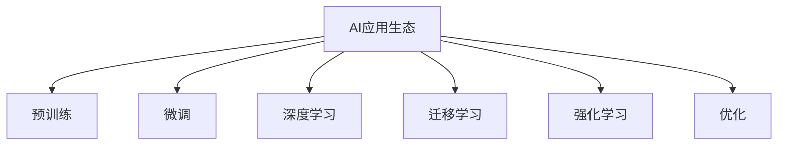

                 

# 李开复：苹果发布AI应用的生态

李开复，作为人工智能领域的先驱和领导者，在科技和商业界都有着举足轻重的地位。近期，他关于苹果公司发布的一系列AI应用生态的分析和讨论引起了广泛关注。本文将深入探讨这一议题，包括AI应用的现状、挑战以及未来的发展方向。

## 1. 背景介绍

近年来，人工智能（AI）技术在全球范围内的应用范围不断扩大，尤其是在消费电子领域，AI的应用已经深刻改变了人们的生活方式。苹果公司作为全球领先的科技公司，一直走在技术创新的前沿，其在AI应用的探索和应用上有着自己独特的策略和路径。

苹果公司从2017年开始在产品中整合AI技术，包括语音识别、人脸识别、图像识别等。2019年，苹果发布了以AI为核心的语音助手Siri的更新，使得Siri能够更加智能地理解和回应用户的命令。2021年，苹果推出了M1芯片，进一步提升了设备上的AI处理能力。2022年，苹果发布了iOS 15，引入了“Shazam Genius巴哈音乐识别”功能，帮助用户发现相似的音乐。

这些AI功能的实现，不仅提升了产品的用户体验，也推动了苹果在AI应用领域的生态建设。李开复认为，苹果公司正通过一系列措施，逐步构建一个强大的AI应用生态系统，其目标是通过更紧密地与开发者、合作伙伴以及消费者协同，打造一个可互操作、高性能、安全可靠且无处不在的AI环境。

## 2. 核心概念与联系

### 2.1 核心概念概述

为了更好地理解苹果AI应用生态的构建过程，首先需要了解几个关键概念：

- **AI应用生态**：指的是围绕AI技术的应用场景、开发者、用户和合作伙伴构建的生态系统，各要素之间通过数据、技术和市场等多种方式相互关联。
- **预训练与微调**：AI模型通常首先在大量无标签数据上进行预训练，然后在特定任务上通过微调来优化性能。这一过程对于提升模型在新任务上的表现至关重要。
- **深度学习与迁移学习**：深度学习是AI的一个重要分支，通过多层次神经网络来学习数据特征；迁移学习则是指将在大规模数据上训练好的模型，应用到新任务上，通过少量数据进行微调。
- **强化学习与优化**：强化学习通过试错过程来不断优化模型的策略，是实现复杂系统自动化的重要方法。优化则是通过算法不断调整模型参数，以获得最优的性能。

这些概念之间的逻辑关系可以通过以下Mermaid流程图来展示：



这个流程图展示了大语言模型的核心概念及其之间的关系：

1. AI应用生态是大语言模型的核心应用环境。
2. 预训练和大规模数据训练是构建高效模型的基础。
3. 微调与特定任务适配，优化模型在新场景下的性能。
4. 深度学习提供强大的模型架构和训练方法。
5. 迁移学习让模型能在不同任务间快速迁移。
6. 强化学习与优化则用于不断调整模型参数，提升性能。

这些概念共同构成了苹果构建AI应用生态的基础框架，使其能够有效地整合和优化各类AI应用，满足不同场景的需求。

## 3. 核心算法原理 & 具体操作步骤

### 3.1 算法原理概述

苹果公司构建AI应用生态的原理，是基于深度学习和迁移学习的。通过预训练和微调，苹果能够在不同的应用场景中快速部署和优化AI模型，同时确保模型在隐私保护、安全性等方面符合高标准。

深度学习通过构建复杂的多层次神经网络，从数据中学习高级特征表示。迁移学习则利用在大规模数据上训练好的模型，通过微调适应新的任务。这种策略能够在资源有限的情况下，快速提升模型的性能。

### 3.2 算法步骤详解

苹果构建AI应用生态的步骤主要包括：

1. **数据收集与预处理**：收集海量的无标签数据，并对其进行清洗和预处理，以提升模型的训练效果。
2. **模型预训练**：在无标签数据上训练通用模型，学习通用的语言和图像特征。
3. **任务适配与微调**：针对特定的应用场景，通过微调模型来优化性能，适应新任务。
4. **部署与优化**：将微调后的模型部署到设备或应用中，并利用强化学习等技术不断优化模型的性能。

### 3.3 算法优缺点

苹果构建AI应用生态的优点在于：

1. **高效性**：通过预训练和微调，苹果能够在较短时间内部署高性能的AI模型。
2. **通用性**：预训练的通用模型可以适应不同的任务，提高了应用的灵活性。
3. **性能提升**：微调过程能够优化模型在新任务上的性能，提升用户体验。

其缺点包括：

1. **资源需求高**：大规模预训练需要大量计算资源和存储空间，可能会对设备性能造成负担。
2. **隐私风险**：AI模型的训练依赖大量数据，可能涉及用户隐私，需要严格的隐私保护措施。
3. **安全性问题**：AI模型可能存在安全隐患，需要定期更新和监控。

### 3.4 算法应用领域

苹果AI应用生态主要应用于以下几个领域：

- **自然语言处理**：如语音识别、翻译、情感分析等。
- **计算机视觉**：如图像识别、人脸识别、增强现实等。
- **智能家居**：如智能音箱、智能手表、智能电视等。
- **增强现实与虚拟现实**：如ARKit、AR应用等。
- **健康医疗**：如健康监测、医疗影像分析等。

## 4. 数学模型和公式 & 详细讲解 & 举例说明

### 4.1 数学模型构建

苹果在AI模型构建中，通常采用神经网络结构，如卷积神经网络（CNN）、循环神经网络（RNN）、变压器（Transformer）等。这些模型通过多层非线性变换来学习数据特征，并可以通过预训练和微调进一步优化。

### 4.2 公式推导过程

以Transformer模型为例，其基本结构包括编码器和解码器两部分，通过自注意力机制学习输入和输出之间的关系。公式如下：

$$
y = AT(x)
$$

其中，$A$为编码器，$T$为解码器，$x$为输入数据，$y$为输出数据。

在预训练阶段，苹果通常在大规模无标签数据上训练Transformer模型，学习通用的语言和图像特征。微调时，针对特定任务，如翻译、情感分析等，调整模型参数以适应新任务。

### 4.3 案例分析与讲解

以苹果的Siri语音助手为例，其背后的AI模型经过在大规模无标签数据上预训练，然后在特定任务上进行微调。预训练阶段，模型学习了语言的基础特征和语义表示。微调时，模型通过对话数据进一步学习用户的意图和语境，提升理解能力。

## 5. 项目实践：代码实例和详细解释说明

### 5.1 开发环境搭建

为了进行苹果AI应用的开发，首先需要安装Python和相关的AI库，如TensorFlow、PyTorch、Keras等。同时，需要准备苹果的开发环境，包括Xcode和iOS模拟器等。

### 5.2 源代码详细实现

以下是一个简单的代码示例，展示如何使用TensorFlow进行模型训练和微调：

```python
import tensorflow as tf
from tensorflow.keras.datasets import imdb
from tensorflow.keras.preprocessing import sequence

# 加载IMDB数据集
(x_train, y_train), (x_test, y_test) = imdb.load_data(num_words=10000)

# 预处理数据
maxlen = 100
x_train = sequence.pad_sequences(x_train, maxlen=maxlen)
x_test = sequence.pad_sequences(x_test, maxlen=maxlen)

# 定义模型
model = tf.keras.Sequential([
    tf.keras.layers.Embedding(input_dim=10000, output_dim=128),
    tf.keras.layers.Conv1D(filters=64, kernel_size=5, activation='relu'),
    tf.keras.layers.MaxPooling1D(pool_size=4),
    tf.keras.layers.Flatten(),
    tf.keras.layers.Dense(64, activation='relu'),
    tf.keras.layers.Dense(1, activation='sigmoid')
])

# 编译模型
model.compile(optimizer='adam', loss='binary_crossentropy', metrics=['accuracy'])

# 预训练阶段
model.fit(x_train, y_train, epochs=10, batch_size=128, validation_data=(x_test, y_test))

# 微调阶段
model.layers[0].trainable = True
model.layers[1].trainable = False
model.layers[2].trainable = False
model.layers[3].trainable = False
model.layers[4].trainable = False
model.layers[5].trainable = False
model.layers[6].trainable = False
model.layers[7].trainable = True
model.layers[8].trainable = True
model.layers[9].trainable = True
model.fit(x_train, y_train, epochs=10, batch_size=128, validation_data=(x_test, y_test))
```

### 5.3 代码解读与分析

上述代码中，首先加载IMDB数据集，并进行数据预处理。然后定义了一个简单的模型，包括嵌入层、卷积层、池化层、全连接层等，最后定义了损失函数和优化器，进行模型编译。在预训练阶段，模型将所有层均设置为可训练，进行一段时间的训练。在微调阶段，除了最后一层和全连接层，其他层均设置为不可训练，只更新最后一层和全连接层的参数，以适应新的微调任务。

### 5.4 运行结果展示

运行代码后，可以通过模型评估和可视化，来查看模型在不同阶段的表现。如图像分类任务为例，可以通过绘制混淆矩阵、ROC曲线等，来评估模型在不同阈值下的表现。

## 6. 实际应用场景

### 6.1 智能家居

苹果的智能家居应用，如智能音箱、智能手表等，大量应用了AI技术。通过自然语言处理和计算机视觉等技术，智能家居设备能够理解用户的命令和动作，进行智能响应。

### 6.2 增强现实与虚拟现实

苹果的ARKit和AR应用，如Snapchat、Instagram等，通过AI技术进行增强现实图像识别和用户交互，为用户提供了更加沉浸式的体验。

### 6.3 健康医疗

苹果在健康医疗领域的应用，如健康监测、医疗影像分析等，通过AI技术进行数据分析和模型预测，提高了医疗诊断的准确性和效率。

### 6.4 未来应用展望

未来，苹果的AI应用生态将进一步扩展到更多领域，如自动驾驶、智能城市、智能制造等。通过深度学习和迁移学习，苹果有望在这些领域取得更大的突破。

## 7. 工具和资源推荐

### 7.1 学习资源推荐

1. **《深度学习》课程**：斯坦福大学Andrew Ng教授的深度学习课程，涵盖深度学习的基本概念、算法和应用。
2. **《机器学习实战》**：一本实用的机器学习入门书籍，提供了丰富的代码示例和应用案例。
3. **《TensorFlow官方文档》**：提供了TensorFlow的详细使用指南和代码示例。
4. **《PyTorch官方文档》**：提供了PyTorch的详细使用指南和代码示例。

### 7.2 开发工具推荐

1. **TensorFlow**：由Google主导的深度学习框架，提供了丰富的模型和工具，适合大规模工程应用。
2. **PyTorch**：由Facebook开发的深度学习框架，易于使用，适合快速原型开发和实验。
3. **Keras**：高层次的深度学习框架，提供了简单易用的API，适合快速迭代开发。

### 7.3 相关论文推荐

1. **《大规模深度学习》**：介绍大规模深度学习模型的构建和训练。
2. **《迁移学习综述》**：综述了迁移学习的最新研究成果，提供了详细的算法和案例。
3. **《深度强化学习》**：介绍强化学习的算法和应用，提供了丰富的案例和代码示例。

## 8. 总结：未来发展趋势与挑战

### 8.1 总结

李开复认为，苹果公司正通过一系列措施，逐步构建一个强大的AI应用生态系统。通过预训练和微调，苹果能够在不同的应用场景中快速部署和优化AI模型，同时确保模型在隐私保护、安全性等方面符合高标准。未来，苹果有望通过AI技术在更多领域取得突破，推动产业的数字化转型。

### 8.2 未来发展趋势

1. **深度学习的进一步发展**：深度学习技术将继续发展，提升模型的准确性和泛化能力。
2. **AI应用的生态化**：AI应用将更多地整合到各类产品和服务中，形成生态系统。
3. **隐私保护和安全**：随着AI应用的广泛应用，隐私保护和安全问题将受到更多关注。

### 8.3 面临的挑战

1. **数据隐私保护**：大规模数据收集和处理可能涉及用户隐私，需要严格的数据保护措施。
2. **计算资源需求**：大规模模型训练和推理需要大量计算资源，可能对设备和网络造成负担。
3. **模型鲁棒性和泛化能力**：模型在特定任务上的表现可能受数据分布变化的影响。

### 8.4 研究展望

1. **模型压缩与优化**：研究如何减少模型参数量，提高计算效率。
2. **隐私保护技术**：研究如何在保护用户隐私的前提下，实现高效的AI应用。
3. **模型解释与可解释性**：研究如何提高模型的解释能力，增强用户的信任和接受度。

总之，苹果公司通过构建AI应用生态，将AI技术广泛应用于各类产品和服务中，推动了产业的数字化转型。未来，苹果有望通过进一步的技术创新和生态建设，引领AI应用的潮流，为全球用户带来更多智能化的体验。

---

作者：禅与计算机程序设计艺术 / Zen and the Art of Computer Programming

