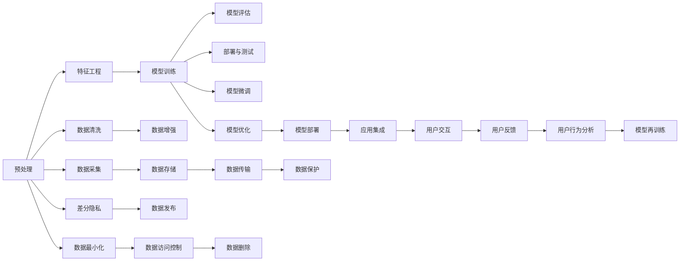

                 

# 李开复：苹果发布AI应用的社会价值

## 1. 背景介绍

### 1.1 问题由来

近年来，人工智能(AI)技术迅猛发展，成为推动各行各业数字化转型的重要引擎。其中，苹果公司的AI应用，尤其是其集成在产品中的智能化功能，引发了广泛关注。本文旨在探讨苹果AI应用的社会价值，分析其在改善用户体验、推动创新和促进公平竞争等方面的深远影响。

### 1.2 问题核心关键点

苹果AI应用的显著特点包括：

- **集成化设计**：苹果将AI技术深入集成在硬件和软件中，如Siri语音助手、Face ID人脸识别、智能相机系统等。
- **用户体验优化**：通过智能化功能提升用户互动体验，简化操作流程，增强个性化定制。
- **跨领域应用**：AI技术跨越医疗、教育、环保等多个领域，为不同行业带来创新解决方案。
- **隐私保护与伦理**：苹果在AI应用中重视隐私保护，采用差分隐私和数据最小化原则。
- **公平竞争**：通过AI技术优化供应链管理、降低生产成本，提升市场竞争力。

## 2. 核心概念与联系

### 2.1 核心概念概述

为更好地理解苹果AI应用的社会价值，本节将介绍几个密切相关的核心概念：

- **人工智能(AI)**：涵盖机器学习、深度学习、自然语言处理等子领域，通过算法和模型对数据进行分析和推理，以实现智能化决策。
- **机器学习(ML)**：一种使计算机系统通过数据学习并优化性能的技术，涉及数据预处理、特征工程、模型训练和评估等环节。
- **深度学习(DL)**：机器学习的一个分支，通过多层神经网络模拟人脑处理信息的方式，擅长处理复杂非结构化数据。
- **自然语言处理(NLP)**：使计算机能够理解、处理和生成人类语言的技术，包括语音识别、文本分类、情感分析等。
- **差分隐私(Differential Privacy)**：一种隐私保护机制，确保个体数据不被泄露，同时保证数据集整体分析的有效性。
- **数据最小化(Privacy by Design)**：在设计产品时，采用最小数据使用策略，避免不必要的个人信息收集。

这些概念之间的逻辑关系可以通过以下Mermaid流程图来展示：

```mermaid
graph TB
    A[人工智能(AI)] --> B[机器学习(ML)]
    B --> C[深度学习(DL)]
    B --> D[自然语言处理(NLP)]
    A --> E[差分隐私(DP)]
    A --> F[数据最小化(Privacy by Design)]
```

### 2.2 核心概念原理和架构的 Mermaid 流程图



这个流程图展示了从数据预处理到模型训练，再到应用部署和用户反馈的完整过程。

## 3. 核心算法原理 & 具体操作步骤

### 3.1 算法原理概述

苹果的AI应用，特别是其集成在产品中的智能化功能，主要基于机器学习和深度学习算法。以Siri语音助手为例，其核心算法包括以下几个步骤：

1. **语音识别**：将用户语音转化为文本，这是NLP中的核心任务之一。
2. **意图识别**：分析用户意图，决定要执行的操作，这是NLP中的任务之一。
3. **响应生成**：根据用户意图生成自然语言回复，这是NLP和生成模型中的任务之一。
4. **语音合成**：将文本转换为语音，这是语音合成(Synthesis)任务。

这些步骤涉及多个子任务，需要通过不同层次的机器学习模型进行处理。例如，语音识别和语音合成可能需要使用传统的声学模型和声码器，而意图识别和回复生成则可能需要使用深度学习模型，如循环神经网络(RNN)、长短时记忆网络(LSTM)或Transformer等。

### 3.2 算法步骤详解

苹果的AI应用开发步骤大致如下：

1. **数据收集**：收集用户互动数据，如语音、文本、操作记录等，作为训练数据集。
2. **模型训练**：使用机器学习和深度学习算法，对数据集进行训练，优化模型参数。
3. **模型验证**：在验证集上测试模型性能，调整模型结构或参数以提高准确率。
4. **模型部署**：将训练好的模型集成到产品中，实现实时响应和处理。
5. **用户反馈**：收集用户反馈，进一步优化模型和算法。

### 3.3 算法优缺点

苹果AI应用的优点包括：

- **用户体验优化**：AI技术使设备更智能、更易用，简化操作流程，提升用户互动体验。
- **跨领域应用**：AI技术跨越多个领域，带来创新的解决方案，如医疗健康、教育科技等。
- **隐私保护**：苹果采用差分隐私和数据最小化原则，保护用户隐私。

其缺点包括：

- **技术门槛高**：AI应用开发和维护需要高度专业的技术知识，对人力资源和研发投入要求较高。
- **数据隐私问题**：尽管苹果重视隐私保护，但数据泄露风险依然存在。
- **公平竞争**：尽管苹果在AI应用上具有技术优势，但其他厂商也在不断追赶，竞争激烈。

### 3.4 算法应用领域

苹果AI应用广泛应用在以下几个领域：

1. **消费电子**：如iPhone、iPad、Apple Watch等设备中集成的Siri、Face ID等功能。
2. **医疗健康**：Apple Watch、Health app中的健康监测和数据分析功能。
3. **教育和娱乐**：Apple TV、iPad等设备中的教育、娱乐和游戏应用。
4. **供应链管理**：通过AI优化供应链，降低成本，提高效率。

## 4. 数学模型和公式 & 详细讲解

### 4.1 数学模型构建

苹果的AI应用中，涉及多个数学模型。以下以Siri语音助手为例，介绍其主要数学模型：

- **语音识别模型**：使用声学模型和语言模型，将语音转化为文本。
- **意图识别模型**：使用NLP中的分类模型，如卷积神经网络(CNN)或RNN，对文本进行意图分类。
- **回复生成模型**：使用序列生成模型，如RNN或Transformer，生成自然语言回复。
- **语音合成模型**：使用基于深度学习的声码器，如WaveNet或Tacotron，将文本转化为语音。

这些模型在训练时通常使用大量标注数据，通过反向传播算法优化模型参数，以最小化预测误差。

### 4.2 公式推导过程

以Siri语音识别为例，其核心公式包括：

- **声学模型**：$P(\text{text}|\text{audio}) = \frac{P(\text{audio}|\text{text})P(\text{text})}{P(\text{audio})}$
- **语言模型**：$P(\text{text}) = \prod_{i=1}^nP(w_i|w_{i-1})$，其中$w_i$为文本中的单词。

### 4.3 案例分析与讲解

苹果Siri语音识别的训练数据集通常包括数百万条用户语音和对应的文本。训练过程中，声学模型通过反向传播算法优化参数，使得模型在测试集上能够准确地将语音转化为文本。意图识别模型使用分类算法，如卷积神经网络(CNN)或长短时记忆网络(LSTM)，对文本进行意图分类，从而决定用户的操作意图。回复生成模型使用序列生成算法，如RNN或Transformer，生成自然语言回复。

## 5. 项目实践：代码实例和详细解释说明

### 5.1 开发环境搭建

要搭建苹果AI应用的开发环境，需要以下工具和平台：

1. **Python**：作为主要开发语言，支持多种机器学习和深度学习框架。
2. **TensorFlow**或**PyTorch**：常用的深度学习框架，提供丰富的模型和算法库。
3. **Keras**：基于TensorFlow和PyTorch的高级神经网络API，易于上手。
4. **Jupyter Notebook**：交互式开发环境，方便进行模型训练和调试。
5. **Apple Developer Tools**：用于开发和测试苹果设备应用的工具和平台。

### 5.2 源代码详细实现

以下是使用TensorFlow开发Siri语音识别模型的代码示例：

```python
import tensorflow as tf
from tensorflow.keras.layers import Input, Conv1D, Dense, Activation, Bidirectional, Masking
from tensorflow.keras.models import Model

def build_model(input_shape):
    input_layer = Input(shape=input_shape)
    masked_layer = Masking(mask_value=0.)(input_layer)
    conv_layer = Conv1D(64, 3, activation='relu')(masked_layer)
    bidirectional_layer = Bidirectional(Conv1D(128, 3, activation='relu')(conv_layer))
    dense_layer = Dense(128)(bidirectional_layer)
    output_layer = Dense(1, activation='sigmoid')(dense_layer)
    model = Model(inputs=input_layer, outputs=output_layer)
    return model

input_shape = (None, 32)  # 输入数据的形状，需根据实际数据进行调整
model = build_model(input_shape)
model.compile(optimizer='adam', loss='binary_crossentropy', metrics=['accuracy'])
```

### 5.3 代码解读与分析

上述代码中，首先定义了一个简单的语音识别模型，包含输入层、掩码层、卷积层、双向卷积层、全连接层和输出层。模型使用Adam优化器和二元交叉熵损失函数进行训练，目标是在给定音频输入下预测文本的呈现概率。

### 5.4 运行结果展示

训练模型后，可以使用测试集评估模型性能：

```python
test_data = ...
test_labels = ...
test_loss, test_acc = model.evaluate(test_data, test_labels)
print(f'Test accuracy: {test_acc:.4f}')
```

## 6. 实际应用场景

### 6.1 医疗健康

苹果的AI应用在医疗健康领域的应用主要包括健康监测和数据分析。例如，Apple Watch中的心率监测、活动追踪、睡眠分析等功能，利用AI技术对用户健康数据进行实时监测和分析，提供个性化的健康建议和预警。

### 6.2 教育科技

Apple TV和iPad上的教育应用，利用AI技术实现个性化学习和智能推荐。例如，利用NLP技术分析学生的学习进度和偏好，推荐合适的学习资源和练习题。

### 6.3 供应链管理

苹果通过AI技术优化供应链管理，实现预测库存、优化物流、减少浪费等目标。例如，使用机器学习算法对销售数据进行分析，预测未来需求，优化库存管理，减少生产成本。

### 6.4 未来应用展望

未来，苹果的AI应用将在更多领域得到应用，如环保、农业、金融等。苹果通过AI技术优化产品设计和生产流程，提升效率和用户体验，同时带动相关产业的数字化转型。

## 7. 工具和资源推荐

### 7.1 学习资源推荐

- **TensorFlow官方文档**：提供详细的API文档和教程，适合初学者和进阶开发者。
- **PyTorch官方文档**：提供丰富的深度学习库和算法，适合科研和应用开发。
- **Kaggle**：数据科学和机器学习竞赛平台，提供丰富的数据集和案例。
- **Coursera和Udacity**：提供机器学习和深度学习的在线课程，适合系统学习。

### 7.2 开发工具推荐

- **Jupyter Notebook**：交互式开发环境，方便进行模型训练和调试。
- **Google Colab**：免费的GPU/TPU环境，适合进行大规模深度学习训练。
- **Hugging Face Transformers**：提供预训练模型和框架，适合快速开发NLP应用。

### 7.3 相关论文推荐

- **Deep Speech 2: An End-To-End Platform for Large-Scale Speech Recognition**：介绍深度学习在语音识别中的应用。
- **Attention Is All You Need**：介绍Transformer模型在自然语言处理中的应用。
- **Apple's AI for People with Disabilities**：介绍苹果如何利用AI技术帮助残障人士。

## 8. 总结：未来发展趋势与挑战

### 8.1 研究成果总结

苹果的AI应用在多个领域取得了显著成效，提升了用户体验和产品竞争力。其核心技术包括语音识别、意图识别、回复生成和语音合成，涉及机器学习和深度学习算法。

### 8.2 未来发展趋势

未来，苹果的AI应用将在更多领域得到应用，如医疗健康、教育科技、环保、金融等。同时，苹果将进一步优化算法和模型，提高计算效率和隐私保护能力。

### 8.3 面临的挑战

尽管苹果的AI应用取得了显著成效，但仍面临以下挑战：

- **技术门槛高**：AI应用开发和维护需要高度专业的技术知识，对人力资源和研发投入要求较高。
- **数据隐私问题**：尽管苹果重视隐私保护，但数据泄露风险依然存在。
- **公平竞争**：尽管苹果在AI应用上具有技术优势，但其他厂商也在不断追赶，竞争激烈。

### 8.4 研究展望

未来，苹果的AI应用将继续在多个领域发挥作用，推动产业数字化转型。同时，苹果将进一步优化算法和模型，提高计算效率和隐私保护能力。

## 9. 附录：常见问题与解答

**Q1: 如何保护用户隐私？**

A: 苹果采用差分隐私和数据最小化原则，确保用户数据不被泄露。在处理用户数据时，只收集必要的信息，并对数据进行匿名化和噪声化处理。

**Q2: 苹果的AI应用如何提升用户体验？**

A: 苹果通过AI技术实现个性化推荐、智能推荐、实时响应等功能，简化用户操作流程，提升用户体验。

**Q3: 苹果的AI应用有哪些未来发展方向？**

A: 苹果的AI应用将在医疗健康、教育科技、环保、金融等领域继续拓展。同时，苹果将进一步优化算法和模型，提高计算效率和隐私保护能力。

---

作者：禅与计算机程序设计艺术 / Zen and the Art of Computer Programming

