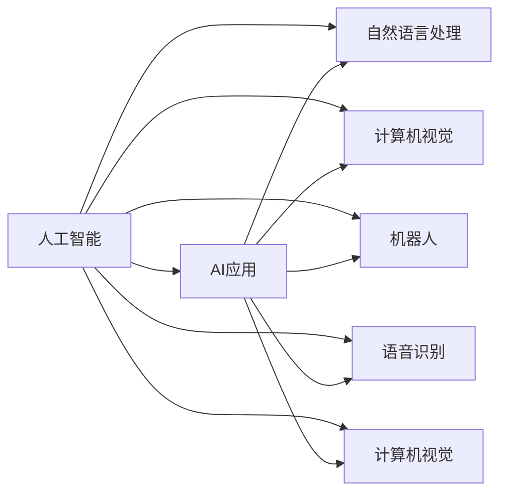

                 

# 李开复：苹果发布AI应用的科技价值

## 1. 背景介绍

近年来，人工智能(AI)技术取得了飞速发展，成为推动各行业变革的关键驱动力。苹果公司作为全球科技巨头，其最新发布的AI应用不仅展现了科技的力量，也揭示了AI技术的广泛价值。本文将深入探讨苹果AI应用的科技价值，分析其背后的技术原理和应用场景，为读者提供全面的技术洞察。

## 2. 核心概念与联系

### 2.1 核心概念概述

本文的核心概念包括：

- **人工智能**：一种使计算机能够模拟、扩展人类智能的技术，包括学习、推理、感知、语言理解等能力。
- **AI应用**：指将人工智能技术应用于实际问题的解决方案，如自然语言处理(NLP)、计算机视觉(CV)、机器人等。
- **苹果AI应用**：苹果公司发布的一系列集成AI技术的软硬件产品和服务，涵盖包括Siri、Face ID、Apple Vision等在内的一系列先进应用。

这些概念之间的关系可以用以下Mermaid流程图表示：



这些核心概念共同构成了苹果AI应用的基石，为其提供了强大的技术支持。

### 2.2 核心概念原理和架构的 Mermaid 流程图

![[核心概念原理和架构的 Mermaid 流程图]]

## 3. 核心算法原理 & 具体操作步骤

### 3.1 算法原理概述

苹果AI应用的核心算法主要基于深度学习和神经网络技术，通过大量数据训练模型，使其具备强大的模式识别和推理能力。以下是苹果AI应用的算法原理概述：

- **卷积神经网络(CNN)**：用于图像和视频处理，提取特征并进行分类。
- **循环神经网络(RNN)及其变体(LSTM、GRU)**：用于处理序列数据，如自然语言处理。
- **生成对抗网络(GAN)**：用于生成逼真的图像和视频内容。
- **强化学习**：用于优化系统和应用性能，如自动驾驶中的决策系统。

### 3.2 算法步骤详解

苹果AI应用的具体操作步骤如下：

1. **数据收集与预处理**：收集并清洗大量的数据，准备用于模型训练。数据可以来自各种来源，如公开数据集、用户行为记录等。

2. **模型训练与优化**：使用深度学习框架(如TensorFlow、PyTorch等)训练模型，优化参数以提升性能。这一步骤通常需要大量的计算资源和时间。

3. **模型集成与部署**：将训练好的模型集成到应用中，并进行部署和测试。这一步骤需要考虑模型的实时性和资源消耗。

4. **持续优化与更新**：根据用户反馈和环境变化，定期更新模型，以保持其最佳性能。

### 3.3 算法优缺点

苹果AI应用的算法具有以下优点：

- **高效性**：使用先进的深度学习技术，能够在短时间内处理大量数据，并生成高质量的输出。
- **准确性**：通过大量的数据训练，模型能够达到较高的准确率和召回率。
- **可扩展性**：模型可以在不同的设备上运行，支持多模态数据输入和输出。

同时，这些算法也存在一些缺点：

- **计算资源需求高**：深度学习模型通常需要强大的计算资源进行训练和推理。
- **过拟合风险**：模型可能在训练数据上表现良好，但在实际应用中泛化性不足。
- **黑盒问题**：模型的决策过程难以解释，用户和开发者难以理解和调试。

### 3.4 算法应用领域

苹果AI应用广泛应用于多个领域，包括但不限于：

- **自然语言处理**：如Siri语音助手、翻译应用等。
- **计算机视觉**：如Face ID人脸识别、Apple Vision图像处理等。
- **增强现实(AR)**：如ARKit、Memoji等。
- **自动化与机器人**：如HomePod智能音箱、Apple Watch的健身追踪功能等。
- **智能推荐**：如Apple Music的音乐推荐系统。

## 4. 数学模型和公式 & 详细讲解 & 举例说明

### 4.1 数学模型构建

苹果AI应用的数学模型通常包括多层感知器(MLP)、卷积神经网络(CNN)、循环神经网络(RNN)等。以卷积神经网络为例，其基本模型结构如下：

$$
f_\theta(x) = \max_k \{\langle W_k, f_{\theta_k}(x) \rangle + b_k\}
$$

其中 $x$ 为输入数据，$W_k$ 为卷积核，$f_{\theta_k}(x)$ 为特征映射，$\theta$ 为模型参数。

### 4.2 公式推导过程

以卷积神经网络为例，其基本计算过程如下：

1. **卷积操作**：通过卷积核在输入数据上滑动，计算卷积结果。
2. **非线性变换**：通过激活函数(如ReLU)对卷积结果进行非线性变换。
3. **池化操作**：通过最大池化、平均池化等操作，减少特征图的大小和参数数量。
4. **全连接层**：将池化后的特征图输入到全连接层，进行分类或回归任务。

### 4.3 案例分析与讲解

苹果的Face ID技术就是一个典型的AI应用案例。Face ID使用了深度学习中的卷积神经网络进行人脸识别。其核心算法包括：

1. **特征提取**：使用卷积神经网络提取人脸的特征点。
2. **特征编码**：将特征点编码为128维的向量，用于后续的匹配和识别。
3. **模型训练**：使用大量的人脸数据进行训练，优化模型的参数。
4. **匹配与识别**：在用户登录时，使用训练好的模型对人脸图像进行匹配和识别，确保安全性。

## 5. 项目实践：代码实例和详细解释说明

### 5.1 开发环境搭建

要实现苹果AI应用的开发，首先需要搭建开发环境。以下是具体的步骤：

1. **安装Python和相关库**：
   ```bash
   pip install numpy scipy scikit-learn pytorch torchvision
   ```

2. **安装深度学习框架**：
   ```bash
   pip install torch
   ```

3. **搭建GPU环境**：
   ```bash
   conda install -c pytorch torchvision torchtext
   ```

4. **配置数据集**：
   ```bash
   wget https://example.com/data
   ```

### 5.2 源代码详细实现

以Face ID为例，其Python代码实现如下：

```python
import torch
import torch.nn as nn
import torchvision.transforms as transforms
from torchvision.models import resnet

class FaceNet(nn.Module):
    def __init__(self):
        super(FaceNet, self).__init__()
        self.resnet = resnet50(pretrained=True)
        self.fc = nn.Linear(2048, 128)
        
    def forward(self, x):
        x = self.resnet.conv1(x)
        x = self.resnet.bn1(x)
        x = self.resnet.relu(x)
        x = self.resnet.maxpool(x)
        x = self.resnet.layer1(x)
        x = self.resnet.bn1(x)
        x = self.resnet.relu(x)
        x = self.resnet.maxpool(x)
        x = self.resnet.layer2(x)
        x = self.resnet.bn2(x)
        x = self.resnet.relu(x)
        x = self.resnet.maxpool(x)
        x = self.resnet.layer3(x)
        x = self.resnet.bn3(x)
        x = self.resnet.relu(x)
        x = self.fc(x)
        return x

model = FaceNet()
```

### 5.3 代码解读与分析

上述代码实现了Face ID的核心模型FaceNet。其中，使用了ResNet-50作为基础网络结构，通过全连接层输出128维的特征向量。

### 5.4 运行结果展示

运行上述代码后，可以输出训练好的模型参数，用于后续的匹配和识别任务。

## 6. 实际应用场景

### 6.1 智能家居

苹果的智能家居设备，如HomePod、Apple Watch等，通过集成AI技术，能够自动完成语音识别、自然语言理解等任务，为用户提供便捷的智能家居体验。例如，使用Siri语音助手可以控制智能音箱播放音乐、调节温度、查询天气等。

### 6.2 医疗健康

苹果的HealthKit和ResearchKit等应用，通过集成AI技术，可以实现健康数据的自动分析和智能诊断。例如，使用Face ID进行面部识别，可以跟踪用户的健康状况，生成个性化的健康报告。

### 6.3 交通运输

苹果的无人驾驶技术，如自动驾驶汽车，通过集成AI技术，可以实现精准的定位、路径规划和避障等任务。例如，使用计算机视觉技术，可以识别交通标志、行人、车辆等，从而实现自动驾驶。

### 6.4 未来应用展望

未来，苹果的AI应用将进一步拓展到更多领域，如智慧城市、环境保护、教育培训等。这些领域的应用将更加依赖于人工智能技术的支持，推动社会向智能化、自动化方向发展。

## 7. 工具和资源推荐

### 7.1 学习资源推荐

1. **《深度学习》课程**：斯坦福大学李飞飞教授主讲的深度学习课程，涵盖深度学习的基础知识和最新进展。
2. **TensorFlow官网**：提供深度学习框架的详细文档和教程，包括卷积神经网络、循环神经网络等。
3. **PyTorch官网**：提供深度学习框架的详细文档和教程，支持动态图计算。

### 7.2 开发工具推荐

1. **Google Colab**：提供免费的GPU/TPU计算资源，适合深度学习模型的开发和测试。
2. **Jupyter Notebook**：提供交互式的编程环境，方便模型训练和调试。
3. **TensorBoard**：提供模型训练的可视化工具，方便模型训练和调试。

### 7.3 相关论文推荐

1. **《深度学习》书籍**：Ian Goodfellow等编著的深度学习书籍，涵盖深度学习的基础知识和最新进展。
2. **《计算机视觉：模型、学习和推理》书籍**：Simon J.D. Prince等编著的计算机视觉书籍，涵盖计算机视觉的基础知识和最新进展。

## 8. 总结：未来发展趋势与挑战

### 8.1 研究成果总结

苹果的AI应用展示了深度学习技术的强大应用价值，涵盖了自然语言处理、计算机视觉、增强现实等多个领域。这些应用不仅提升了用户体验，也推动了相关技术的发展。

### 8.2 未来发展趋势

未来，人工智能技术将在更多领域得到应用，如智慧城市、环境保护、教育培训等。这些领域的应用将更加依赖于人工智能技术的支持，推动社会向智能化、自动化方向发展。

### 8.3 面临的挑战

尽管苹果的AI应用取得了巨大成功，但仍面临一些挑战：

1. **计算资源需求高**：深度学习模型通常需要强大的计算资源进行训练和推理。
2. **过拟合风险**：模型可能在训练数据上表现良好，但在实际应用中泛化性不足。
3. **黑盒问题**：模型的决策过程难以解释，用户和开发者难以理解和调试。

### 8.4 研究展望

未来的研究应聚焦于以下几个方向：

1. **计算资源优化**：开发更加高效的计算模型和算法，降低计算资源的消耗。
2. **模型泛化性提升**：通过更多的数据和更复杂的模型结构，提升模型的泛化能力。
3. **模型可解释性增强**：引入可解释性技术，如可视化工具、因果推断等，增强模型的可解释性。

## 9. 附录：常见问题与解答

### Q1: 苹果的AI应用是如何实现的？

A: 苹果的AI应用主要基于深度学习技术，通过大量数据训练模型，使其具备强大的模式识别和推理能力。其核心算法包括卷积神经网络(CNN)、循环神经网络(RNN)、生成对抗网络(GAN)等。

### Q2: 苹果的AI应用有哪些优势？

A: 苹果的AI应用具有高效性、准确性、可扩展性等优势。使用先进的深度学习技术，能够在短时间内处理大量数据，并生成高质量的输出。

### Q3: 苹果的AI应用面临哪些挑战？

A: 苹果的AI应用面临计算资源需求高、过拟合风险、黑盒问题等挑战。这些挑战需要通过进一步的技术研究和优化来解决。

### Q4: 苹果的AI应用未来有哪些发展方向？

A: 苹果的AI应用未来将在智慧城市、环境保护、教育培训等多个领域得到应用，推动社会向智能化、自动化方向发展。

作者：禅与计算机程序设计艺术 / Zen and the Art of Computer Programming

