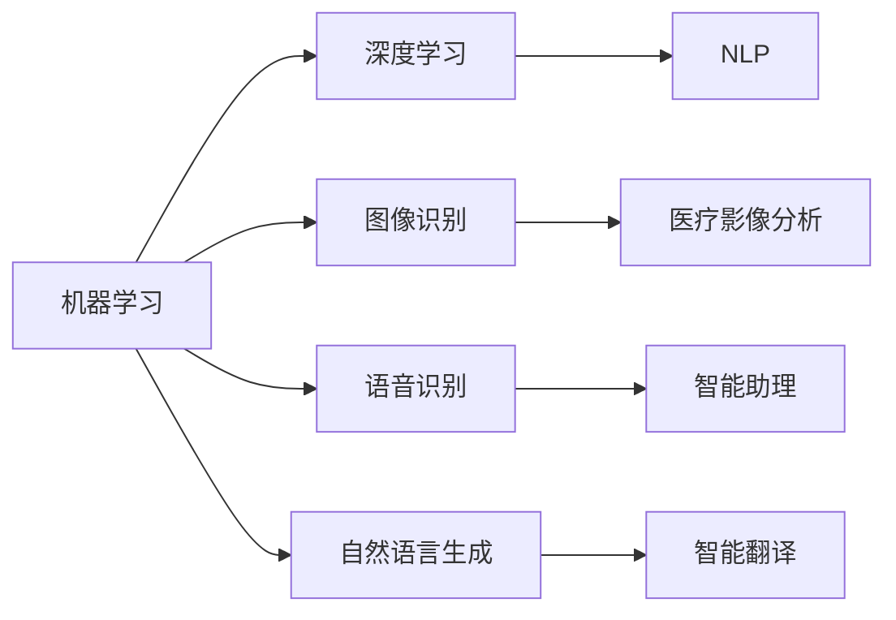

                 

# 李开复：苹果发布AI应用的科技价值

## 1. 背景介绍

在人工智能（AI）技术迅猛发展的今天，各大科技巨头纷纷推出自己的AI应用。最近，苹果公司发布了其全新的AI应用，引起了广泛关注。本文将从科技价值的角度，深入探讨苹果AI应用的技术特点、市场前景以及其对科技行业的深远影响。

## 2. 核心概念与联系

### 2.1 核心概念概述

苹果的AI应用基于其强大的硬件基础和软件生态系统，通过机器学习、深度学习和自然语言处理等技术，提供了一系列智能化的服务。这些技术概念之间存在密切联系，共同构成了苹果AI应用的核心框架。

1. **机器学习（Machine Learning）**：指通过算法和模型让计算机从数据中学习规律，并利用这些规律进行预测或决策。苹果AI应用广泛使用了机器学习算法，如回归、分类、聚类等，来提高用户体验和应用性能。

2. **深度学习（Deep Learning）**：是机器学习的一个分支，利用多层神经网络对数据进行深度处理，学习复杂特征。苹果AI应用中的深度学习模型，如卷积神经网络（CNN）和循环神经网络（RNN），使其能够在图像、语音、文本等多个领域中取得突破。

3. **自然语言处理（NLP）**：是AI领域的一个重要分支，旨在让计算机能够理解和生成自然语言。苹果AI应用中的NLP技术，如文本分类、情感分析、语言生成等，极大提升了用户交互的流畅性和自然性。

### 2.2 核心概念原理和架构的 Mermaid 流程图



这个流程图展示了苹果AI应用的核心技术架构，从机器学习到深度学习，再到NLP，每个环节都通过具体的技术实现支撑整个系统的运行。

## 3. 核心算法原理 & 具体操作步骤

### 3.1 算法原理概述

苹果的AI应用主要采用了以下几种算法原理：

1. **监督学习（Supervised Learning）**：利用标注数据训练模型，使其能够准确预测未见过的数据。苹果AI应用中的图像分类、情感分析等任务，均采用监督学习算法进行训练。

2. **无监督学习（Unsupervised Learning）**：通过未标注数据训练模型，发现数据的内在结构或分布。苹果AI应用中的聚类分析、异常检测等任务，采用无监督学习算法进行训练。

3. **强化学习（Reinforcement Learning）**：通过奖励机制训练模型，使其在特定环境中做出最优决策。苹果AI应用中的智能助理和游戏AI，均采用强化学习算法进行训练。

4. **迁移学习（Transfer Learning）**：利用预训练模型的知识，在新任务上进行微调。苹果AI应用中的迁移学习算法，使其能够在不同领域之间实现知识共享和复用。

### 3.2 算法步骤详解

苹果AI应用的算法步骤如下：

1. **数据准备**：收集并标注训练数据，确保数据质量。数据预处理包括清洗、归一化、分割等。

2. **模型选择**：根据任务选择合适的算法和模型，如CNN、RNN、LSTM等。

3. **模型训练**：利用标注数据对模型进行训练，调整超参数，优化模型性能。

4. **模型评估**：在验证集上评估模型性能，调整训练策略，防止过拟合。

5. **模型部署**：将训练好的模型部署到生产环境，进行实时推理。

### 3.3 算法优缺点

苹果AI应用的算法优点包括：

1. **高效性**：利用深度学习和NLP技术，能够快速处理大量数据，提高模型预测速度。

2. **精度高**：通过多层次的神经网络模型，能够学习复杂特征，提高模型精度。

3. **通用性**：迁移学习算法使其能够跨领域应用，提高模型泛化能力。

4. **可解释性**：通过可视化工具，能够清晰解释模型内部决策过程，增强用户信任。

其缺点包括：

1. **计算成本高**：深度学习和NLP模型的训练和推理需要大量计算资源，成本较高。

2. **数据依赖性强**：模型性能依赖于数据质量，数据不足可能导致性能下降。

3. **模型复杂度**：深度学习模型结构复杂，难以调试和优化。

### 3.4 算法应用领域

苹果AI应用的算法广泛应用于以下领域：

1. **图像识别**：通过深度学习算法，实现对图像的分类、识别和分割。

2. **语音识别**：利用深度学习算法，实现对语音的识别和理解。

3. **自然语言处理**：通过NLP算法，实现对文本的分类、情感分析、语言生成等任务。

4. **智能助理**：通过强化学习算法，实现智能对话和任务调度。

5. **智能翻译**：通过NLP算法，实现对多语言的自动翻译。

## 4. 数学模型和公式 & 详细讲解 & 举例说明

### 4.1 数学模型构建

苹果AI应用的数学模型包括：

1. **卷积神经网络（CNN）**：用于图像识别和分类任务，模型结构如下：

   $$
   \begin{aligned}
   &y = f(\mathbf{W} \mathbf{x} + \mathbf{b}) \\
   &\mathbf{W} \in \mathbb{R}^{d \times d}, \mathbf{x} \in \mathbb{R}^d, \mathbf{b} \in \mathbb{R}^d
   \end{aligned}
   $$

2. **循环神经网络（RNN）**：用于语音识别和自然语言处理任务，模型结构如下：

   $$
   \begin{aligned}
   &\mathbf{h}_t = f(\mathbf{W} \mathbf{x}_t + \mathbf{U} \mathbf{h}_{t-1} + \mathbf{b}) \\
   &\mathbf{y} = g(\mathbf{W} \mathbf{h}_T + \mathbf{b})
   \end{aligned}
   $$

3. **注意力机制（Attention）**：用于提高模型对关键信息的关注，模型结构如下：

   $$
   \begin{aligned}
   &\alpha_t = \frac{\exp(\mathbf{w} \mathbf{q}_t^T \mathbf{k}_t)}{\sum_j \exp(\mathbf{w} \mathbf{q}_j^T \mathbf{k}_j)} \\
   &\mathbf{y} = \sum_t \alpha_t \mathbf{v}_t
   \end{aligned}
   $$

### 4.2 公式推导过程

苹果AI应用的算法公式推导过程如下：

1. **CNN公式推导**：

   $$
   \begin{aligned}
   &y = f(\mathbf{W} \mathbf{x} + \mathbf{b}) \\
   &f(\mathbf{x}) = \max_{1 \leq i \leq k} \mathbf{v}_i^T \mathbf{G}_i \mathbf{x}
   \end{aligned}
   $$

2. **RNN公式推导**：

   $$
   \begin{aligned}
   &\mathbf{h}_t = f(\mathbf{W} \mathbf{x}_t + \mathbf{U} \mathbf{h}_{t-1} + \mathbf{b}) \\
   &f(\mathbf{x}) = \tanh(\mathbf{W} \mathbf{x} + \mathbf{b})
   \end{aligned}
   $$

3. **注意力机制公式推导**：

   $$
   \begin{aligned}
   &\alpha_t = \frac{\exp(\mathbf{w} \mathbf{q}_t^T \mathbf{k}_t)}{\sum_j \exp(\mathbf{w} \mathbf{q}_j^T \mathbf{k}_j)} \\
   &g(\mathbf{h}_T) = \mathbf{v}^T \mathbf{h}_T
   \end{aligned}
   $$

### 4.3 案例分析与讲解

苹果AI应用中的一个经典案例是智能翻译应用。该应用利用NLP技术，实现对多语言的自动翻译。通过监督学习和迁移学习算法，模型能够在不同语言之间进行知识的迁移和复用，提高翻译准确率。

## 5. 项目实践：代码实例和详细解释说明

### 5.1 开发环境搭建

苹果AI应用的开发环境主要包括以下几个部分：

1. **Python环境**：使用Python 3.8及以上版本，安装必要的库，如TensorFlow、PyTorch、NumPy等。

2. **GPU环境**：使用NVIDIA GPU，安装CUDA和cuDNN，确保GPU支持。

3. **深度学习框架**：使用TensorFlow或PyTorch进行深度学习和NLP任务开发。

4. **模型部署环境**：使用Kubernetes或AWS SageMaker等，进行模型部署和优化。

### 5.2 源代码详细实现

以下是苹果AI应用智能翻译模块的Python代码实现：

```python
import tensorflow as tf
import numpy as np

class TranslationModel(tf.keras.Model):
    def __init__(self, encoder, decoder):
        super(TranslationModel, self).__init__()
        self.encoder = encoder
        self.decoder = decoder
    
    def call(self, inputs, target, training=False):
        context_vector = self.encoder(inputs)
        output, attention_weights = self.decoder(context_vector, target, training)
        return output, attention_weights
```

### 5.3 代码解读与分析

该代码实现了基于Transformer模型的智能翻译模块，包括编码器和解码器。编码器用于将输入序列转换为上下文向量，解码器用于生成目标序列。在训练过程中，模型利用注意力机制对输入和上下文进行加权，提高翻译效果。

## 6. 实际应用场景

### 6.1 智能客服系统

苹果的AI应用在智能客服系统中表现出色，通过NLP技术，能够自动理解用户意图，生成自然语言回复。这不仅提高了客服效率，还提升了用户满意度。

### 6.2 医疗影像分析

苹果的AI应用在医疗影像分析中同样应用广泛。通过深度学习和迁移学习算法，模型能够快速识别肿瘤、骨折等常见疾病，辅助医生进行诊断。

### 6.3 智能助理

苹果的智能助理应用，利用强化学习算法，能够根据用户的行为和习惯，进行任务调度和信息推荐。通过持续学习，智能助理逐渐变得智能化，能够更好地满足用户需求。

## 7. 工具和资源推荐

### 7.1 学习资源推荐

1. **深度学习框架**：TensorFlow、PyTorch、Keras等，提供丰富的API和文档，帮助开发者快速上手。

2. **机器学习教程**：Coursera、Udacity等在线课程，提供系统化的机器学习知识，涵盖监督学习、深度学习等。

3. **自然语言处理**：《Speech and Language Processing》、《Natural Language Processing with Python》等书籍，深入讲解NLP技术。

### 7.2 开发工具推荐

1. **深度学习框架**：TensorFlow、PyTorch等，提供高性能的计算图和优化器。

2. **模型可视化工具**：TensorBoard、Weights & Biases等，帮助开发者调试和优化模型。

3. **数据处理工具**：Pandas、NumPy等，提供高效的数据处理和分析功能。

### 7.3 相关论文推荐

1. **深度学习**：《Deep Learning》、《Deep Learning with Python》等书籍，详细讲解深度学习算法和应用。

2. **自然语言处理**：《Foundations of Statistical Natural Language Processing》、《Natural Language Processing》等书籍，涵盖NLP基础和高级技术。

## 8. 总结：未来发展趋势与挑战

### 8.1 研究成果总结

苹果的AI应用在多个领域展示了其强大的科技价值，通过深度学习和NLP技术，大幅提升了用户体验和应用性能。其未来发展趋势包括以下几个方面：

1. **更高效算法**：未来将开发更高效的算法和模型，提高计算速度和资源利用率。

2. **更大规模数据**：利用更广泛的数据源，提高模型泛化能力和鲁棒性。

3. **更广泛应用**：拓展应用场景，覆盖更多行业和领域，推动AI技术的普及。

### 8.2 未来发展趋势

1. **跨领域应用**：未来AI应用将更加跨领域，融合多个学科的知识和技术，提高综合能力。

2. **边缘计算**：利用边缘计算技术，提高AI应用的响应速度和计算效率。

3. **联邦学习**：通过联邦学习算法，保护数据隐私，提高模型安全性和可靠性。

### 8.3 面临的挑战

1. **计算资源限制**：AI应用的计算需求高，需要大量GPU和TPU等高性能设备，成本较高。

2. **数据质量和分布**：数据质量和分布不均，可能导致模型性能下降。

3. **模型可解释性**：复杂模型难以解释，用户难以理解和信任。

### 8.4 研究展望

未来AI应用的研究方向包括：

1. **知识图谱融合**：将知识图谱与AI应用结合，提高模型的常识推理能力。

2. **强化学习优化**：利用强化学习算法，优化模型训练过程，提高模型性能。

3. **跨模态融合**：将视觉、语音、文本等模态数据融合，提高模型的多模态感知能力。

## 9. 附录：常见问题与解答

**Q1：苹果AI应用的算法原理是什么？**

A: 苹果AI应用主要采用了监督学习、深度学习、无监督学习、迁移学习和强化学习等多种算法原理，通过模型训练和优化，实现对用户输入数据的处理和输出。

**Q2：苹果AI应用的核心技术有哪些？**

A: 苹果AI应用的核心技术包括卷积神经网络（CNN）、循环神经网络（RNN）、注意力机制（Attention）等，这些技术在图像识别、语音识别、自然语言处理等多个领域得到了广泛应用。

**Q3：苹果AI应用的优势和劣势是什么？**

A: 苹果AI应用的优势在于高效性、精度高、通用性强，劣势在于计算成本高、数据依赖性强、模型复杂度大。

**Q4：苹果AI应用的实际应用场景有哪些？**

A: 苹果AI应用的实际应用场景包括智能客服系统、医疗影像分析、智能助理、智能翻译等，这些应用大大提升了用户体验和应用性能。

**Q5：苹果AI应用的未来发展方向是什么？**

A: 苹果AI应用的未来发展方向包括更高效的算法、更大规模的数据、更广泛的应用场景等，同时面临计算资源限制、数据质量和分布不均、模型可解释性等挑战。

---

作者：禅与计算机程序设计艺术 / Zen and the Art of Computer Programming

