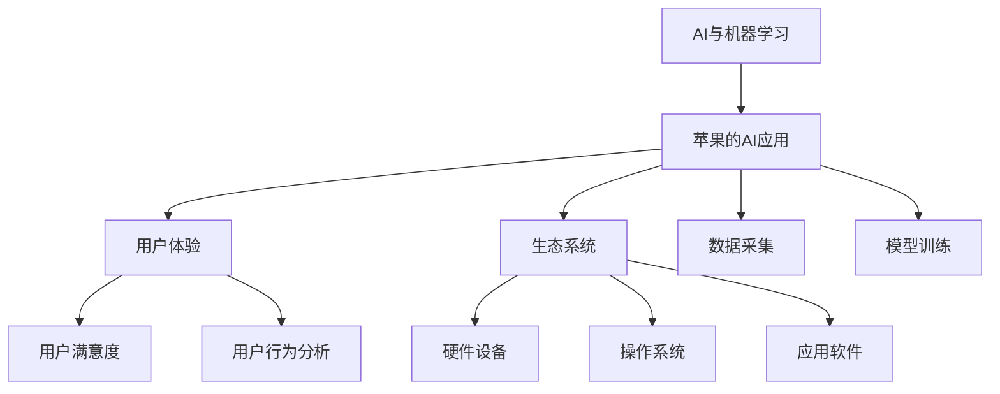

                 

# 李开复：苹果发布AI应用的科技价值

在人工智能(AI)和机器学习领域，李开复博士无疑是其中一个最具影响力的声音之一。作为前微软亚洲研究院院长、前谷歌首席科学家、现任创新工场的CEO，李博士在AI领域有着深厚的研究背景和丰富的实践经验。他的观点和见解往往能引领科技界的发展方向，尤其是在AI与产业结合的实际应用方面，他的思考尤为深刻。

## 1. 背景介绍

### 1.1 科技与产业的深度融合

近年来，科技与产业的融合速度正在加快，AI技术在各行各业的应用日益广泛。以苹果公司为例，自2017年发布首款集成了AI技术的手机iPhone X以来，其AI应用已经涵盖相机、语音助手、智能推荐等多个方面。这些AI功能的成功应用不仅提升了用户体验，还推动了苹果生态系统的深度集成。

### 1.2 AI技术在苹果生态系统中的应用

苹果的AI应用不仅仅是iPhone X的Face ID解锁功能，更是构建了一个以AI为中心的生态系统。通过AI技术，苹果能够在智能推荐、语音控制、图像识别等方面提供强大的支持，构建一个无缝且高效的用户体验环境。

## 2. 核心概念与联系

### 2.1 核心概念概述

- **AI与机器学习**：指的是使用算法和统计模型，使计算机能够从数据中学习并作出决策的技术。
- **苹果的AI应用**：指的是苹果公司在其产品和服务中应用AI技术的能力，涵盖了从硬件到软件，从图像识别到自然语言处理等多个方面。
- **用户体验**：指的是用户在使用产品时的感受和满意度，是评价AI应用成功与否的关键指标。
- **生态系统**：指的是苹果通过AI技术构建的产品和服务网络，包括硬件设备、操作系统、应用软件等，形成了以AI为中心的闭环系统。

### 2.2 核心概念原理和架构的 Mermaid 流程图



此流程图展示了AI与机器学习如何通过苹果的AI应用提升用户体验和构建生态系统。首先，AI技术从数据采集中学习，通过模型训练生成预测和推荐模型，最终在用户体验中体现其价值。

## 3. 核心算法原理 & 具体操作步骤

### 3.1 算法原理概述

苹果的AI应用主要基于机器学习算法，包括但不限于神经网络、深度学习、增强学习等。这些算法通过大量标注数据进行训练，学习到数据的规律和模式，进而进行预测和推荐。例如，苹果的智能推荐系统通过分析用户的行为数据，预测用户可能感兴趣的商品和服务，从而提供个性化的推荐。

### 3.2 算法步骤详解

- **数据采集**：苹果通过其各类产品和服务，如iPhone、Apple Watch、iCloud等，收集用户的各种行为数据，包括但不限于用户点击、浏览、购买、位置等信息。
- **模型训练**：收集到的数据会被送入机器学习模型中进行训练，生成预测和推荐模型。这些模型可以是监督学习模型，如分类器、回归器等；也可以是无监督学习模型，如聚类、关联规则等。
- **模型部署**：训练好的模型会被部署到相应的应用中，用于实时处理用户的请求。苹果通常使用云端计算资源来实现这一点，以确保响应速度和处理能力。
- **用户体验优化**：通过分析用户的使用反馈，不断优化模型参数和算法，提升用户体验。苹果采用A/B测试等方法，实时监控用户满意度，并根据反馈进行调整。

### 3.3 算法优缺点

苹果的AI应用在提升用户体验和构建生态系统方面有着显著的优势，但也存在一些挑战：

- **优点**：
  - **用户体验提升**：AI技术能够提供个性化和实时的服务，提升用户的满意度和粘性。
  - **生态系统增强**：AI技术帮助构建了一个无缝且高效的产品和服务网络，促进了苹果的生态系统发展。
  - **创新驱动**：AI技术的应用催生了新的服务和产品，推动了苹果的创新。

- **缺点**：
  - **数据隐私问题**：大量数据的收集和处理可能引发隐私和安全问题。
  - **计算资源消耗**：AI应用需要大量的计算资源，可能对苹果的硬件性能提出更高的要求。
  - **算法透明性**：AI算法的黑箱性质可能导致用户对其决策过程缺乏信任。

### 3.4 算法应用领域

苹果的AI应用涵盖了多个领域，包括但不限于：

- **图像识别**：如人脸识别、物体检测等，应用于Face ID解锁、拍照滤镜等功能。
- **自然语言处理**：如语音识别、智能推荐等，应用于Siri语音助手、消息推荐等功能。
- **推荐系统**：如商品推荐、内容推荐等，应用于App Store、iCloud等平台。
- **用户行为分析**：如点击流分析、位置分析等，应用于个性化广告、智能推荐等。

## 4. 数学模型和公式 & 详细讲解

### 4.1 数学模型构建

苹果的AI应用通常基于以下数学模型：

- **线性回归模型**：用于预测连续型变量的值，如价格、评分等。
- **决策树模型**：用于分类任务，如判断用户是否点击广告等。
- **深度神经网络模型**：用于复杂的非线性关系，如图像识别、语音识别等。

### 4.2 公式推导过程

以线性回归模型为例，其公式推导过程如下：

设有一个样本集 $(x_1, y_1), (x_2, y_2), \ldots, (x_n, y_n)$，其中 $x_i$ 为输入变量，$y_i$ 为输出变量。假设模型为线性关系 $y = \beta_0 + \beta_1 x_1 + \ldots + \beta_p x_p + \epsilon$，其中 $\beta_0, \beta_1, \ldots, \beta_p$ 为模型参数，$\epsilon$ 为误差项。

通过最小二乘法求解，得到最优参数 $\beta_0, \beta_1, \ldots, \beta_p$ 的公式为：

$$
\hat{\beta} = \arg\min_{\beta} \sum_{i=1}^n (y_i - \hat{y}_i)^2
$$

其中 $\hat{y}_i = \beta_0 + \beta_1 x_{1i} + \ldots + \beta_p x_{pi}$。

### 4.3 案例分析与讲解

以苹果的智能推荐系统为例，该系统通过收集用户的行为数据，使用线性回归模型预测用户可能感兴趣的商品和服务。具体步骤如下：

1. **数据采集**：收集用户在不同平台上的点击、浏览、购买等行为数据。
2. **特征提取**：从行为数据中提取特征，如商品类别、价格、用户浏览时间等。
3. **模型训练**：使用线性回归模型对特征进行训练，生成预测模型。
4. **推荐生成**：对于新的用户请求，使用训练好的模型预测其可能感兴趣的商品和服务，并展示推荐结果。

## 5. 项目实践：代码实例和详细解释说明

### 5.1 开发环境搭建

- **编程语言**：Python
- **框架**：TensorFlow、Keras、Scikit-learn
- **环境搭建**：安装Anaconda，创建虚拟环境，安装相关依赖库。

### 5.2 源代码详细实现

```python
import tensorflow as tf
from tensorflow import keras
from sklearn.model_selection import train_test_split

# 数据预处理
def load_data():
    # 加载用户行为数据
    # 数据格式为：[x1, x2, ..., xn, y1, y2, ..., yn]
    # 其中 x 为特征，y 为标签
    data = ...
    labels = ...
    return data, labels

# 模型构建
def build_model(input_shape):
    model = keras.Sequential([
        keras.layers.Dense(64, activation='relu', input_shape=input_shape),
        keras.layers.Dense(32, activation='relu'),
        keras.layers.Dense(1, activation='sigmoid')
    ])
    return model

# 模型训练
def train_model(model, data, labels, epochs, batch_size):
    model.compile(optimizer='adam', loss='binary_crossentropy', metrics=['accuracy'])
    model.fit(data, labels, epochs=epochs, batch_size=batch_size)

# 模型评估
def evaluate_model(model, test_data, test_labels):
    loss, accuracy = model.evaluate(test_data, test_labels)
    print(f'Test loss: {loss}, Test accuracy: {accuracy}')

# 加载数据
data, labels = load_data()

# 数据划分
train_data, test_data, train_labels, test_labels = train_test_split(data, labels, test_size=0.2)

# 构建模型
input_shape = data.shape[1:]
model = build_model(input_shape)

# 训练模型
train_model(model, train_data, train_labels, epochs=10, batch_size=64)

# 评估模型
evaluate_model(model, test_data, test_labels)
```

### 5.3 代码解读与分析

上述代码展示了如何使用TensorFlow和Keras构建和训练线性回归模型，实现智能推荐系统的基本功能。主要步骤如下：

1. **数据预处理**：加载用户行为数据，进行数据划分和特征提取。
2. **模型构建**：使用Keras构建一个包含两个全连接层的神经网络模型，输入层为特征数据，输出层为预测结果。
3. **模型训练**：使用Adam优化器和二元交叉熵损失函数训练模型，调整模型参数。
4. **模型评估**：使用测试集评估模型性能，输出准确率和损失值。

## 6. 实际应用场景

### 6.1 智能推荐

苹果的智能推荐系统在App Store和iCloud中得到了广泛应用。通过分析用户的行为数据，推荐系统能够实时预测用户可能感兴趣的应用和服务，提升用户体验。例如，用户在App Store中浏览了一个游戏类别，系统会根据其浏览历史、评分记录、好友推荐等信息，预测其可能感兴趣的其他游戏，并进行展示。

### 6.2 图像识别

苹果的图像识别技术在Face ID解锁、拍照滤镜等应用中得到了广泛应用。通过深度神经网络，苹果的Face ID解锁功能能够高精度识别用户的面部特征，确保安全性和隐私保护。同时，拍照滤镜等功能也能够根据用户的喜好和场景自动调整，提升用户体验。

### 6.3 自然语言处理

苹果的Siri语音助手是基于自然语言处理技术的智能应用，能够理解用户的语音指令并作出相应反应。通过深度学习模型，Siri能够识别多种语言和方言，支持语音识别、语音合成、自然语言理解等功能，极大地提升了用户的交互体验。

### 6.4 未来应用展望

未来，苹果的AI应用将继续在多个领域拓展，可能包括但不限于：

- **增强现实**：通过图像识别和语音识别技术，构建更智能、更自然的AR体验。
- **智能家居**：通过AI技术，实现智能家居设备的互联互通和自动化控制。
- **医疗健康**：通过深度学习模型，分析用户的健康数据，提供个性化的健康建议和医疗服务。

## 7. 工具和资源推荐

### 7.1 学习资源推荐

1. **《深度学习》书籍**：Ian Goodfellow、Yoshua Bengio和Aaron Courville合著的经典教材，涵盖了深度学习的基础理论和实践技术。
2. **Coursera《深度学习专项课程》**：由Andrew Ng教授主讲的深度学习课程，适合初学者和进阶者。
3. **Kaggle**：数据科学竞赛平台，提供大量数据集和开源代码，用于实践和竞赛。
4. **GitHub**：开源代码托管平台，提供了大量高质量的机器学习和AI项目代码，供学习和借鉴。

### 7.2 开发工具推荐

1. **TensorFlow**：由Google开发的深度学习框架，支持多种编程语言和平台，提供了丰富的API和工具。
2. **Keras**：基于TensorFlow的高层次API，简单易用，适合快速原型开发。
3. **PyTorch**：Facebook开发的深度学习框架，灵活性强，支持动态图和静态图。
4. **Jupyter Notebook**：交互式编程环境，支持Python、R等语言，适合数据科学和机器学习开发。

### 7.3 相关论文推荐

1. **"Deep Learning" by Ian Goodfellow, Yoshua Bengio, and Aaron Courville**：深度学习的经典教材，介绍了深度学习的基本理论和应用。
2. **"Attention is All You Need" by Ashish Vaswani et al.**：Transformer架构的奠基性论文，推动了自然语言处理领域的革命。
3. **"ImageNet Classification with Deep Convolutional Neural Networks" by Alex Krizhevsky, Ilya Sutskever, and Geoffrey Hinton**：深度卷积神经网络在图像识别中的应用，是深度学习领域的里程碑。
4. **"Human-level Control through Deep Reinforcement Learning" by Volodymyr Mnih et al.**：深度强化学习在AI游戏和自动驾驶中的应用，展示了AI技术的强大潜力。

## 8. 总结：未来发展趋势与挑战

### 8.1 研究成果总结

通过研究苹果的AI应用，我们可以看到AI技术在提升用户体验和构建生态系统方面的巨大潜力。苹果的成功案例表明，AI应用不仅能够提升产品的竞争力，还能带动整个生态系统的繁荣发展。

### 8.2 未来发展趋势

未来，AI技术将继续在多个领域深入应用，带来更加智能、高效和个性化的体验。以下是一些可能的发展趋势：

- **AI与物联网结合**：通过AI技术，实现物联网设备的智能互联和自动化控制。
- **AI与区块链结合**：通过AI技术，实现智能合约和去中心化应用，提升区块链系统的效率和安全性。
- **AI与边缘计算结合**：通过AI技术，实现边缘设备的智能推理和决策，降低云端的计算负担。

### 8.3 面临的挑战

尽管AI技术在多个领域得到了广泛应用，但在实际部署和应用过程中，仍面临一些挑战：

- **数据隐私和安全**：大量数据的收集和处理可能导致隐私泄露和数据安全问题。
- **计算资源消耗**：AI应用需要大量的计算资源，可能对硬件性能提出更高的要求。
- **算法透明性和公平性**：AI算法的黑箱性质可能导致用户对其决策过程缺乏信任，同时可能存在算法偏见和歧视问题。

### 8.4 研究展望

为了应对这些挑战，未来的研究需要在以下几个方面进行突破：

- **隐私保护**：开发隐私保护技术，如联邦学习、差分隐私等，保护用户数据隐私。
- **计算优化**：优化计算资源使用，如模型压缩、混合精度训练等，提高AI应用的效率。
- **算法透明性**：开发可解释性AI模型，增强用户对AI决策的理解和信任。
- **公平性保证**：设计公平性评估指标，避免算法偏见和歧视，确保AI应用的社会价值。

## 9. 附录：常见问题与解答

**Q1: 为什么苹果的AI应用能够取得如此成功？**

A: 苹果的AI应用能够成功的原因在于其强大的数据采集和处理能力，以及高效的算法和模型训练。苹果通过其各类产品和服务收集大量的用户数据，并利用先进的机器学习技术，构建了高效且精准的推荐系统和智能应用。

**Q2: 如何保护用户数据隐私？**

A: 保护用户数据隐私是AI应用的重要任务。苹果采用了多种技术手段，如数据匿名化、差分隐私、联邦学习等，确保用户数据的安全性和隐私保护。

**Q3: AI技术的应用有哪些潜在风险？**

A: AI技术的应用存在一些潜在风险，如算法偏见、数据隐私、计算资源消耗等。为应对这些风险，需要开发公平性评估指标、隐私保护技术和计算优化技术，确保AI应用的伦理和社会价值。

---

作者：禅与计算机程序设计艺术 / Zen and the Art of Computer Programming

