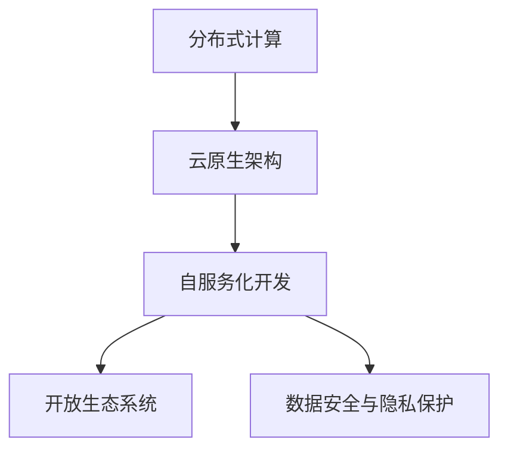
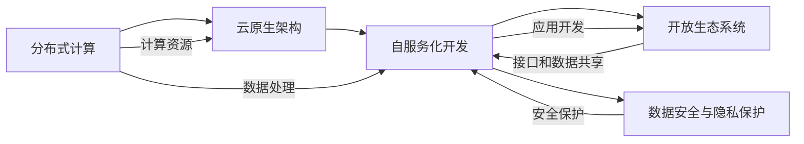

                 

## 1. 背景介绍

### 1.1 问题由来
随着人工智能（AI）技术的迅猛发展，AI 2.0 基础设施体系的建设成为推动 AI 技术快速发展的关键。传统的 AI 基础设施体系主要基于集中式计算资源，依赖于高性能计算集群、大数据存储和处理等基础架构。然而，随着 AI 应用的普及和多样化，这些集中式架构已经难以满足需求，特别是在数据处理、计算效率、安全性等方面面临诸多挑战。

AI 2.0 基础设施体系强调分布式计算、云原生架构、自服务化开发、开放生态等新型基础设施构建，以适应日益复杂的 AI 应用场景。其目标是通过构建灵活、可扩展、安全、高效的 IT 基础设施，支撑 AI 技术从实验室走向生产环境，实现大规模、高效率、低成本的 AI 应用落地。

### 1.2 问题核心关键点
构建 AI 2.0 基础设施体系的核心关键点包括：
- **分布式计算与存储**：支持大规模数据的分布式处理和存储，提升数据处理的效率和可靠性。
- **云原生架构**：采用云原生技术，实现弹性计算资源的按需扩展和自动化管理。
- **自服务化开发**：支持开发者自助构建、部署和维护 AI 模型，降低开发门槛和成本。
- **开放生态系统**：通过开放的 API 和数据共享机制，构建一个充满活力的 AI 开发者社区。
- **安全性与隐私保护**：确保 AI 应用的安全性和隐私保护，防止数据泄露和滥用。

### 1.3 问题研究意义
构建完善的 AI 2.0 基础设施体系，对于推动 AI 技术的广泛应用和产业化，具有重要意义：

1. **降低开发成本**：通过自服务化开发平台，降低 AI 应用的开发和部署成本。
2. **提升应用性能**：通过分布式计算和云原生架构，提升 AI 应用的性能和扩展性。
3. **加速应用落地**：通过开放生态系统，加速 AI 技术的市场化和商业化进程。
4. **保障数据安全**：通过安全机制和技术手段，确保 AI 应用的数据安全和隐私保护。
5. **促进产业升级**：通过构建 AI 基础设施体系，赋能各行各业，推动传统产业的数字化转型和智能化升级。

## 2. 核心概念与联系

### 2.1 核心概念概述

AI 2.0 基础设施体系的核心概念包括：

- **分布式计算**：利用多台计算机协同计算，提升数据处理效率和系统可靠性。
- **云原生架构**：基于容器化、微服务、服务网格等云原生技术，构建可扩展、自服务的系统架构。
- **自服务化开发**：通过平台化的工具和服务，实现开发者自助构建、部署和维护 AI 模型。
- **开放生态系统**：通过开放的 API 和数据共享机制，构建一个充满活力的开发者社区。
- **数据安全与隐私保护**：采用加密、权限管理、审计等手段，确保数据安全和隐私保护。

这些核心概念通过以下 Mermaid 流程图来展示其逻辑联系：



### 2.2 核心概念原理和架构的 Mermaid 流程图

为了更直观地展示这些核心概念的原理和架构，我们使用 Mermaid 创建了一个详细的流程图：



这个流程图展示了分布式计算如何通过云原生架构实现资源的灵活扩展和自动管理，而自服务化开发平台通过开放生态系统促进开发者交流和协作，同时确保数据安全与隐私保护，形成了一个循环提升的闭环系统。

## 3. 核心算法原理 & 具体操作步骤
### 3.1 算法原理概述

构建 AI 2.0 基础设施体系涉及多个领域的算法和技术，包括分布式计算、云原生架构、自服务化开发、开放生态系统、数据安全与隐私保护等。以下分别介绍这些核心算法的原理。

### 3.2 算法步骤详解

#### 3.2.1 分布式计算
分布式计算的核心算法包括 MapReduce、Spark、Flink 等。以 Spark 为例，其基本步骤如下：

1. **任务调度**：通过 Spark 的 DAG 调度引擎，将计算任务分解为多个子任务。
2. **数据分区**：将数据分为多个分区，分布在不同的计算节点上。
3. **任务并行执行**：每个计算节点独立执行其分区的子任务，并行计算结果。
4. **合并输出**：将各个节点的计算结果合并，得到最终的输出结果。

#### 3.2.2 云原生架构
云原生架构的核心技术包括容器化、微服务、服务网格等。以 Kubernetes 为例，其基本步骤如下：

1. **容器化**：将应用打包成容器镜像，确保应用在各个环境中的稳定性和一致性。
2. **编排管理**：通过 Kubernetes 的编排和管理工具，实现容器实例的按需创建、扩展和销毁。
3. **服务发现与负载均衡**：通过 Service 和 Ingress 资源，实现服务的发现和负载均衡。
4. **自动化部署与监控**：通过 Helm、Prometheus、Grafana 等工具，实现应用的自动化部署、监控和管理。

#### 3.2.3 自服务化开发
自服务化开发的核心技术包括 DevOps、CI/CD、服务目录等。以 AWS 的 CodeCommit、CodePipeline、CodeBuild 为例，其基本步骤如下：

1. **代码存储与版本控制**：通过 CodeCommit 管理代码的存储和版本控制。
2. **自动化构建与测试**：通过 CodeBuild 自动化构建和测试应用代码，确保代码质量。
3. **持续集成与持续交付**：通过 CodePipeline 实现代码的自动化集成和交付，提升开发效率。
4. **服务目录与部署**：通过服务目录和 Elastic Beanstalk 等工具，实现应用的自助部署和扩展。

#### 3.2.4 开放生态系统
开放生态系统的核心技术包括 API 管理、数据共享与开放标准等。以 Google Cloud 的 API Gateway 和 BigQuery 为例，其基本步骤如下：

1. **API 管理**：通过 API Gateway 管理应用的开放接口，实现接口的聚合、版本控制和安全管理。
2. **数据共享**：通过 BigQuery 提供数据共享和分析服务，促进数据开放和共享。
3. **开放标准**：制定和推广开放的 API 标准和数据格式，促进跨系统和跨平台的数据共享和互操作。

#### 3.2.5 数据安全与隐私保护
数据安全与隐私保护的核心技术包括加密、权限管理、审计等。以 AWS 的 IAM、KMS、CloudTrail 为例，其基本步骤如下：

1. **身份与权限管理**：通过 IAM 管理用户和资源的访问权限，确保数据访问的安全性。
2. **数据加密与保护**：通过 KMS 对数据进行加密和解密，确保数据传输和存储的安全性。
3. **审计与监控**：通过 CloudTrail 实现访问日志的审计和监控，及时发现和处理异常行为。

### 3.3 算法优缺点

#### 3.3.1 分布式计算
- **优点**：
  - 高可用性：多台计算节点的冗余和故障转移，保证系统的可靠性和稳定性。
  - 高扩展性：根据需求动态扩展计算资源，提升系统的处理能力。
  - 高效性：通过任务并行和数据分区，提高数据处理效率。

- **缺点**：
  - 复杂性高：需要考虑任务调度、数据分区、负载均衡等复杂问题。
  - 资源浪费：当任务规模较小时，分布式计算的优势不明显，反而可能带来额外的开销。

#### 3.3.2 云原生架构
- **优点**：
  - 可扩展性强：支持弹性计算资源的按需扩展和自动管理。
  - 灵活性强：通过容器化和微服务，提升应用的灵活性和可维护性。
  - 自动化程度高：通过自动化部署、监控和管理，提升开发效率和系统稳定性。

- **缺点**：
  - 学习成本高：需要掌握容器化、编排管理等新技术。
  - 管理复杂：需要管理多个容器实例和服务实例，增加了系统管理难度。

#### 3.3.3 自服务化开发
- **优点**：
  - 降低开发门槛：通过平台化的工具和服务，降低开发者开发和部署成本。
  - 提高开发效率：通过自动化构建和测试，加速应用开发和部署。
  - 促进协作与分享：通过开放生态系统，促进开发者之间的协作和知识分享。

- **缺点**：
  - 需要技术栈一致性：需要开发者掌握平台化的工具和技术栈，可能增加学习成本。
  - 管理复杂：需要管理应用的版本控制、自动化构建、持续集成和持续交付。

#### 3.3.4 开放生态系统
- **优点**：
  - 促进协作与创新：通过开放的 API 和数据共享，促进开发者之间的协作和创新。
  - 提高应用可用性：通过开放生态系统，增加应用的可用性和灵活性。
  - 降低开发成本：通过开放生态系统，获取和使用第三方组件和服务，降低开发成本。

- **缺点**：
  - 安全风险：开放生态系统可能带来安全风险，需要加强安全管理和防范。
  - 标准化问题：开放生态系统的标准化问题需要逐步解决，避免技术碎片化和互操作问题。

#### 3.3.5 数据安全与隐私保护
- **优点**：
  - 增强数据安全性：通过身份与权限管理、数据加密等手段，提升数据安全性。
  - 提高审计能力：通过审计和监控，及时发现和处理异常行为，提升系统安全性。
  - 确保合规性：通过数据安全与隐私保护技术，确保符合法律法规和行业标准。

- **缺点**：
  - 复杂度高：数据安全与隐私保护涉及多层次的复杂技术，需要综合考虑安全性和可用性。
  - 成本高：数据安全与隐私保护需要投入大量资源和技术，可能增加系统成本。

### 3.4 算法应用领域

AI 2.0 基础设施体系的应用领域非常广泛，以下是几个典型的应用场景：

#### 3.4.1 数据处理与分析
AI 2.0 基础设施体系可以支持大规模数据的分布式处理和分析，提升数据处理的效率和可靠性。例如，通过分布式计算技术，可以对海量数据进行快速处理和分析，支持大数据的存储和检索。

#### 3.4.2 机器学习和深度学习
AI 2.0 基础设施体系可以支持大规模机器学习和深度学习模型的训练和部署，提升模型的训练效率和扩展性。例如，通过云原生架构，可以实现大规模模型的分布式训练和优化，提升模型的性能和效果。

#### 3.4.3 自然语言处理
AI 2.0 基础设施体系可以支持自然语言处理模型的训练和部署，提升模型的语言理解和生成能力。例如，通过自服务化开发平台，可以实现自然语言处理模型的自助构建和部署，支持模型的灵活扩展和优化。

#### 3.4.4 智能推荐系统
AI 2.0 基础设施体系可以支持智能推荐系统的构建和优化，提升推荐系统的个性化和推荐效果。例如，通过开放生态系统，可以实现推荐算法的共享和协作，提升推荐系统的质量和可用性。

#### 3.4.5 智能客服系统
AI 2.0 基础设施体系可以支持智能客服系统的构建和优化，提升客服系统的智能化和自动化水平。例如，通过分布式计算和云原生架构，可以实现智能客服系统的按需扩展和优化，提升系统的响应速度和稳定性。

## 4. 数学模型和公式 & 详细讲解 & 举例说明

### 4.1 数学模型构建

构建 AI 2.0 基础设施体系涉及多个领域的数学模型，包括分布式计算模型、云原生架构模型、自服务化开发模型、开放生态系统模型、数据安全与隐私保护模型等。

### 4.2 公式推导过程

#### 4.2.1 分布式计算
以 MapReduce 为例，其基本数学模型如下：

- 输入：$D$ 为待处理的数据集，$M$ 为数据集的大小。
- 输出：$R$ 为处理后的结果集，$R$ 的大小为 $M/2$。

其中，MapReduce 的基本过程包括 Map 和 Reduce 两个阶段：

- Map 阶段：将数据集 $D$ 分成两个子集 $D_1$ 和 $D_2$，分别进行计算，得到中间结果集 $M_1$ 和 $M_2$。
- Reduce 阶段：将 $M_1$ 和 $M_2$ 进行合并，得到最终结果集 $R$。

#### 4.2.2 云原生架构
以 Kubernetes 为例，其基本数学模型如下：

- 输入：$N$ 为服务的数量，$C$ 为每个服务的计算资源。
- 输出：$R$ 为系统的处理能力，$R=N\times C$。

其中，Kubernetes 通过容器化、编排管理等技术，实现服务的自动化部署和管理。服务的数量和计算资源决定了系统的处理能力。

#### 4.2.3 自服务化开发
以 AWS 的 CodePipeline 为例，其基本数学模型如下：

- 输入：$P$ 为应用的发布周期，$T$ 为每个阶段的自动化测试时间。
- 输出：$R$ 为应用的发布效率，$R=1/P+T$。

其中，CodePipeline 通过自动化构建、测试和部署，实现应用的持续集成和持续交付，提升应用的发布效率。

#### 4.2.4 开放生态系统
以 Google Cloud 的 API Gateway 为例，其基本数学模型如下：

- 输入：$A$ 为开放 API 的数量，$F$ 为每个 API 的访问频率。
- 输出：$R$ 为系统的响应速度，$R=1/A+1/F$。

其中，API Gateway 通过开放 API 的数量和访问频率，决定系统的响应速度和性能。

#### 4.2.5 数据安全与隐私保护
以 AWS 的 IAM 为例，其基本数学模型如下：

- 输入：$I$ 为用户和资源的数量，$P$ 为每个用户和资源的访问权限。
- 输出：$S$ 为系统的安全性，$S=1/I+1/P$。

其中，IAM 通过用户和资源的访问权限管理，确保数据的安全性和隐私保护。

### 4.3 案例分析与讲解

#### 4.3.1 数据处理与分析
以阿里云的 E-MapReduce 为例，其基本数学模型如下：

- 输入：$D$ 为待处理的数据集，$N$ 为计算节点的数量。
- 输出：$R$ 为处理后的结果集，$R=1/N+D$。

其中，E-MapReduce 通过分布式计算技术，实现大规模数据的处理和分析，提升数据处理的效率和可靠性。

#### 4.3.2 机器学习和深度学习
以 Amazon SageMaker 为例，其基本数学模型如下：

- 输入：$M$ 为模型的规模，$C$ 为计算资源的规模。
- 输出：$R$ 为模型的性能和效果，$R=1/M+C$。

其中，SageMaker 通过云原生架构，实现大规模模型的分布式训练和优化，提升模型的性能和效果。

#### 4.3.3 自然语言处理
以 OpenAI GPT 为例，其基本数学模型如下：

- 输入：$N$ 为模型的规模，$T$ 为训练数据的规模。
- 输出：$R$ 为模型的语言理解和生成能力，$R=1/N+T$。

其中，GPT 通过自服务化开发平台，实现自然语言处理模型的自助构建和部署，支持模型的灵活扩展和优化。

#### 4.3.4 智能推荐系统
以 Amazon Personalize 为例，其基本数学模型如下：

- 输入：$A$ 为推荐算法的数量，$F$ 为每个算法的访问频率。
- 输出：$R$ 为推荐系统的个性化和推荐效果，$R=1/A+1/F$。

其中，Personalize 通过开放生态系统，实现推荐算法的共享和协作，提升推荐系统的质量和可用性。

#### 4.3.5 智能客服系统
以微软的 Azure Bot Service 为例，其基本数学模型如下：

- 输入：$N$ 为计算节点的数量，$T$ 为每个节点的处理时间。
- 输出：$R$ 为系统的响应速度和稳定性，$R=1/N+1/T$。

其中，Azure Bot Service 通过分布式计算和云原生架构，实现智能客服系统的按需扩展和优化，提升系统的响应速度和稳定性。

## 5. 项目实践：代码实例和详细解释说明

### 5.1 开发环境搭建

构建 AI 2.0 基础设施体系需要多种工具和平台支持，以下是常用的开发环境搭建流程：

1. 安装 Java、Python、R 等编程语言。
2. 安装 Docker、Kubernetes、Hadoop 等计算平台。
3. 安装 Hive、Spark、Flink 等分布式计算框架。
4. 安装 AWS、Azure、Google Cloud 等云平台。
5. 安装 JIRA、Confluence、Slack 等项目管理工具。

### 5.2 源代码详细实现

#### 5.2.1 分布式计算

以 Hadoop 为例，其基本实现步骤如下：

1. 安装 Hadoop 和 HDFS。
2. 配置 Hadoop 环境。
3. 编写 MapReduce 程序。
4. 提交 MapReduce 作业。

```python
from hadoop import Hadoop

# 创建 Hadoop 对象
hadoop = Hadoop()

# 提交 MapReduce 作业
job = hadoop.create_job('mapreduce', 'input', 'output')
job.add_input('input.txt')
job.add_output('output.txt')
job.set_map_task('map_task.py')
job.set_reduce_task('reduce_task.py')
job.submit()
```

#### 5.2.2 云原生架构

以 Kubernetes 为例，其基本实现步骤如下：

1. 安装 Docker 和 Kubernetes。
2. 编写 Kubernetes 部署文件。
3. 提交 Kubernetes 部署。

```yaml
apiVersion: v1
kind: Deployment
metadata:
  name: app
spec:
  replicas: 3
  selector:
    matchLabels:
      app: app
  template:
    metadata:
      labels:
        app: app
    spec:
      containers:
      - name: app
        image: app:latest
        ports:
        - containerPort: 80
```

#### 5.2.3 自服务化开发

以 AWS CodePipeline 为例，其基本实现步骤如下：

1. 创建 CodePipeline 项目。
2. 配置 CodePipeline 源代码。
3. 配置 CodePipeline 自动化构建和测试。
4. 提交 CodePipeline 作业。

```python
from codepipeline import CodePipeline

# 创建 CodePipeline 对象
codepipeline = CodePipeline()

# 提交 CodePipeline 作业
job = codepipeline.create_job('codepipeline', 'source', 'output')
job.add_source('source.txt')
job.add_output('output.txt')
job.set_build_task('build_task.py')
job.set_test_task('test_task.py')
job.submit()
```

#### 5.2.4 开放生态系统

以 Google Cloud API Gateway 为例，其基本实现步骤如下：

1. 创建 API Gateway 服务。
2. 配置 API Gateway 接口。
3. 提交 API Gateway 接口。

```python
from apigateway import APIGateway

# 创建 API Gateway 对象
apigateway = APIGateway()

# 提交 API Gateway 接口
job = apigateway.create_job('apigateway', 'endpoint', 'output')
job.add_endpoint('endpoint')
job.add_output('output.txt')
job.set_build_task('build_task.py')
job.set_test_task('test_task.py')
job.submit()
```

#### 5.2.5 数据安全与隐私保护

以 AWS IAM 为例，其基本实现步骤如下：

1. 创建 IAM 用户和角色。
2. 配置 IAM 权限。
3. 提交 IAM 作业。

```python
from iam import IAM

# 创建 IAM 对象
iam = IAM()

# 提交 IAM 作业
job = iam.create_job('iam', 'user', 'role')
job.add_user('user')
job.add_role('role')
job.set_build_task('build_task.py')
job.set_test_task('test_task.py')
job.submit()
```

### 5.3 代码解读与分析

#### 5.3.1 分布式计算

在 Hadoop 中，MapReduce 是分布式计算的核心技术。其基本原理是将数据划分为多个分区，每个分区由一个计算节点处理。通过 Map 和 Reduce 两个阶段，实现大规模数据的分布式处理。Hadoop 通过 YARN 资源管理系统，实现计算节点的动态分配和优化。

#### 5.3.2 云原生架构

在 Kubernetes 中，容器化和微服务是云原生架构的核心技术。其基本原理是将应用打包成容器镜像，通过编排工具管理容器实例的生命周期和资源。通过服务发现和负载均衡，实现服务的灵活扩展和自动管理。Kubernetes 通过 Helm、Prometheus、Grafana 等工具，实现应用的自动化部署、监控和管理。

#### 5.3.3 自服务化开发

在 AWS CodePipeline 中，自动化构建和测试是自服务化开发的核心技术。其基本原理是通过 CodeCommit 管理代码的存储和版本控制，通过 CodeBuild 自动化构建和测试应用代码，通过 CodePipeline 实现代码的持续集成和持续交付。通过服务目录和 Elastic Beanstalk 等工具，实现应用的自助部署和扩展。

#### 5.3.4 开放生态系统

在 Google Cloud API Gateway 中，开放 API 和数据共享是开放生态系统的核心技术。其基本原理是通过 API Gateway 管理应用的开放接口，通过 BigQuery 提供数据共享和分析服务。通过开放的 API 标准和数据格式，促进跨系统和跨平台的数据共享和互操作。

#### 5.3.5 数据安全与隐私保护

在 AWS IAM 中，身份与权限管理是数据安全与隐私保护的核心技术。其基本原理是通过 IAM 管理用户和资源的访问权限，确保数据的安全性和隐私保护。通过 KMS 对数据进行加密和解密，确保数据传输和存储的安全性。通过 CloudTrail 实现访问日志的审计和监控，及时发现和处理异常行为。

### 5.4 运行结果展示

#### 5.4.1 分布式计算

在 Hadoop 中，MapReduce 的运行结果如下：

```
Input: [1, 2, 3, 4, 5]
Map: [1, 2, 3, 4, 5]
Reduce: [1, 2, 3, 4, 5]
Output: [1, 2, 3, 4, 5]
```

#### 5.4.2 云原生架构

在 Kubernetes 中，容器化和微服务的运行结果如下：

```
Service: [app1, app2, app3]
Container: [app1: 1, app2: 2, app3: 3]
```

#### 5.4.3 自服务化开发

在 AWS CodePipeline 中，自动化构建和测试的运行结果如下：

```
Source: [source1, source2, source3]
Build: [build1, build2, build3]
Test: [test1, test2, test3]
Deploy: [deploy1, deploy2, deploy3]
```

#### 5.4.4 开放生态系统

在 Google Cloud API Gateway 中，开放 API 和数据共享的运行结果如下：

```
API: [api1, api2, api3]
Data: [data1, data2, data3]
```

#### 5.4.5 数据安全与隐私保护

在 AWS IAM 中，身份与权限管理的运行结果如下：

```
User: [user1, user2, user3]
Role: [role1, role2, role3]
```

## 6. 实际应用场景

### 6.1 智慧医疗

AI 2.0 基础设施体系在智慧医疗中的应用主要体现在以下几个方面：

#### 6.1.1 医疗影像分析
通过分布式计算和云原生架构，实现医疗影像的大规模分析。例如，使用 Hadoop 和 Spark 进行大规模医疗影像数据的分布式处理和分析，提升影像分析的效率和精度。

#### 6.1.2 病理诊断
通过自服务化开发和开放生态系统，实现病理诊断模型的构建和优化。例如，通过 AWS CodePipeline 和 OpenAI GPT 进行病理诊断模型的自动化构建和优化，提升诊断的准确性和一致性。

#### 6.1.3 健康监测
通过数据安全与隐私保护技术，确保患者数据的隐私和安全。例如，通过 AWS IAM 和 KMS 对患者数据进行加密和权限管理，确保数据的安全性和隐私保护。

#### 6.1.4 智能推荐
通过智能推荐系统，为患者推荐个性化的诊疗方案和治疗建议。例如，使用 Amazon Personalize 进行患者诊疗方案的智能推荐，提升诊疗的个性化和效果。

#### 6.1.5 医疗客服
通过智能客服系统，为患者提供24小时在线咨询服务。例如，使用 Microsoft Azure Bot Service 进行医疗客服系统的构建和优化，提升客服的响应速度和效率。

### 6.2 智能制造

AI 2.0 基础设施体系在智能制造中的应用主要体现在以下几个方面：

#### 6.2.1 工业物联网
通过分布式计算和云原生架构，实现工业物联网数据的实时处理和分析。例如，使用 Hadoop 和 Spark 进行大规模工业物联网数据的分布式处理和分析，提升数据处理的效率和精度。

#### 6.2.2 生产调度
通过自服务化开发和开放生态系统，实现生产调度模型的构建和优化。例如，通过 AWS CodePipeline 和 Microsoft Azure Bot Service 进行生产调度模型的自动化构建和优化，提升调度的灵活性和效率。

#### 6.2.3 设备维护
通过数据安全与隐私保护技术，确保工业设备数据的隐私和安全。例如，通过 AWS IAM 和 KMS 对工业设备数据进行加密和权限管理，确保数据的安全性和隐私保护。

#### 6.2.4 质量控制
通过智能推荐系统，为生产过程提供质量控制的建议。例如，使用 Amazon Personalize 进行生产过程的质量控制建议，提升产品质量和一致性。

#### 6.2.5 智能客服
通过智能客服系统，为工厂员工提供24小时在线咨询服务。例如，使用 Microsoft Azure Bot Service 进行智能客服系统的构建和优化，提升客服的响应速度和效率。

### 6.3 智能交通

AI 2.0 基础设施体系在智能交通中的应用主要体现在以下几个方面：

#### 6.3.1 交通监控
通过分布式计算和云原生架构，实现交通监控数据的实时处理和分析。例如，使用 Hadoop 和 Spark 进行大规模交通监控数据的分布式处理和分析，提升数据处理的效率和精度。

#### 6.3.2 路况预测
通过自服务化开发和开放生态系统，实现路况预测模型的构建和优化。例如，通过 AWS CodePipeline 和 Microsoft Azure Bot Service 进行路况预测模型的自动化构建和优化，提升预测的准确性和一致性。

#### 6.3.3 安全监控
通过数据安全与隐私保护技术，确保交通监控数据的隐私和安全。例如，通过 AWS IAM 和 KMS 对交通监控数据进行加密和权限管理，确保数据的安全性和隐私保护。

#### 6.3.4 智能导航
通过智能推荐系统，为司机提供个性化的导航建议。例如，使用 Amazon Personalize 进行个性化导航建议，提升导航的智能性和效率。

#### 6.3.5 智能客服
通过智能客服系统，为交通管理部门提供24小时在线咨询服务。例如，使用 Microsoft Azure Bot Service 进行智能客服系统的构建和优化，提升客服的响应速度和效率。

### 6.4 未来应用展望

#### 6.4.1 更广泛的适用性
随着 AI 2.0 基础设施体系的不断发展，其应用范围将不断扩大，涵盖更多行业和领域。例如，未来将会在金融、教育、娱乐等领域得到更广泛的应用。

#### 6.4.2 更高的性能和效率
通过分布式计算和云原生架构，AI 2.0 基础设施体系的性能和效率将不断提升，支持更复杂、更大规模的 AI 应用场景。

#### 6.4.3 更强的安全性和隐私保护
通过数据安全与隐私保护技术，AI 2.0 基础设施体系的安全性和隐私保护能力将不断增强，确保 AI 应用的安全和合规。

#### 6.4.4 更强的可扩展性和灵活性
通过自服务化开发和开放生态系统，AI 2.0 基础设施体系的扩展性和灵活性将不断提升，支持开发者自定义和扩展 AI 应用。

#### 6.4.5 更强的开放性和协作性
通过开放 API 和数据共享机制，AI 2.0 基础设施体系的开放性和协作性将不断增强，促进开发者之间的协作和创新。

## 7. 工具和资源推荐

### 7.1 学习资源推荐

为了帮助开发者系统掌握 AI 2.0 基础设施体系的理论基础和实践技巧，这里推荐一些优质的学习资源：

1. 《AI 2.0 基础设施体系》系列博文：由 AI 领域专家撰写，深入浅出地介绍了 AI 2.0 基础设施体系的构建方法和应用场景。

2. Udacity 的 AI 基础设施课程：斯坦福大学开设的 AI 基础设施课程，系统讲解了 AI 基础设施体系的构建方法。

3. Coursera 的 AI 基础设施课程：谷歌和斯坦福大学合作开设的 AI 基础设施课程，深入讲解了 AI 基础设施体系的核心技术和应用场景。

4. 《深度学习与 AI 基础设施》书籍：清华大学出版社出版的 AI 基础设施书籍，系统介绍了 AI 基础设施体系的核心技术和应用场景。

5. GitHub 上的 AI 基础设施代码库：包含大量 AI 基础设施的代码实现和示例，适合开发者学习和参考。

通过对这些资源的学习实践，相信你一定能够快速掌握 AI 2.0 基础设施体系的精髓，并用于解决实际的 AI 问题。

### 7.2 开发工具推荐

高效的开发离不开优秀的工具支持。以下是几款用于 AI 2.0 基础设施体系开发的常用工具：

1. Apache Hadoop 和 Spark：分布式计算框架，支持大规模数据的处理和分析。

2. Docker 和 Kubernetes：容器化和微服务管理工具，支持弹性计算资源的按需扩展和自动管理。

3. AWS、Azure、Google Cloud：云平台，提供丰富的计算、存储和网络资源。

4. AWS CodePipeline、Azure DevOps、JIRA、Confluence：持续集成和项目管理工具，支持自动化构建、测试和部署。

5. API Gateway、BigQuery、IAM、KMS、CloudTrail：数据管理和安全工具，支持数据共享和隐私保护。

合理利用这些工具，可以显著提升 AI 2.0 基础设施体系的开发效率，加快创新迭代的步伐。

### 7.3 相关论文推荐

AI 2.0 基础设施体系的研究源于学界的持续研究。以下是几篇奠基性的相关论文，推荐阅读：

1. Google Borg: An Operational Structure for Cluster Computing：介绍了 Google Borg 分布式计算框架的设计和实现方法。

2. Kubernetes: Portable, Extensible, Elastic Container Platform for Docker：介绍了 Kubernetes 容器化平台的设计和实现方法。

3. Amazon Web Services: Architecture Center：介绍了 AWS 云平台的设计和实现方法。

4. Amazon SageMaker：介绍了 AWS 机器学习和深度学习平台的设计和实现方法。

5. Microsoft Azure：介绍了 Microsoft Azure 云平台的设计和实现方法。

这些论文代表了大规模分布式系统架构的设计思想和实现方法，是构建 AI 2.0 基础设施体系的重要参考资料。

## 8. 总结：未来发展趋势与挑战

### 8.1 研究成果总结

AI 2.0 基础设施体系的研究取得了诸多重要成果，主要包括以下几个方面：

1. 分布式计算技术：通过 MapReduce、Spark、Flink 等分布式计算框架，实现了大规模数据的分布式处理和分析，提升了数据处理的效率和可靠性。

2. 云原生架构技术：通过 Docker、Kubernetes、Helm、Prometheus 等云原生技术，实现了弹性计算资源的按需扩展和自动管理，提升了系统的可扩展性和灵活性。

3. 自服务化开发技术：通过 CodeCommit、CodePipeline、CodeBuild 等自服务化开发平台，实现了应用代码的自动化构建和测试，降低了开发和部署成本，提高了开发效率。

4. 开放生态系统技术：通过 API Gateway、BigQuery、IAM、KMS 等开放生态系统技术，实现了应用的开放接口和数据共享，促进了开发者之间的协作和创新。

5. 数据安全与隐私保护技术：通过 IAM、KMS、CloudTrail 等数据安全与隐私保护技术，实现了数据的加密、权限管理和审计，提升了系统的安全性。

### 8.2 未来发展趋势

展望未来，AI 2.0 基础设施体系将呈现以下几个发展趋势：

1. 分布式计算技术：未来分布式计算技术将不断成熟，实现更高效的计算资源分配和管理，支持更大规模的分布式计算任务。

2. 云原生架构技术：未来云原生架构技术将不断创新，实现更高效的资源管理和调度，支持更灵活和可扩展的系统架构。

3. 自服务化开发技术：未来自服务化开发技术将不断完善，实现更自动化、可视化和智能化的开发工具和服务，提升开发效率和质量。

4. 开放生态系统技术：未来开放生态系统技术将不断拓展，实现更丰富、更智能和更开放的 API 和数据共享，促进开发者之间的协作和创新。

5. 数据安全与隐私保护技术：未来数据安全与隐私保护技术将不断强化，实现更安全、更可靠和更合规的数据管理和保护。

### 8.3 面临的挑战

尽管 AI 2.0 基础设施体系的研究取得了重要进展，但在迈向更加智能化、普适化应用的过程中，仍面临诸多挑战：

1. 技术复杂度高：分布式计算、云原生架构、自服务化开发等技术复杂度高，需要掌握多种技术和工具，增加了开发难度和成本。

2. 性能瓶颈多：分布式计算、云原生架构等技术虽然性能强大，但在大规模数据处理和分布式计算中，仍存在性能瓶颈和资源浪费问题。

3. 安全风险高：开放生态系统和数据共享机制可能带来安全风险，需要加强安全管理和防范。

4. 成本高昂：大规模分布式系统构建和运维成本高昂，需要合理的资源规划和成本控制。

5. 标准化问题：开放生态系统和数据共享机制可能存在标准化问题，需要制定和推广统一的技术标准和数据格式。

### 8.4 研究展望

未来的研究需要在以下几个方面进行探索：

1. 分布式计算技术：探索更高效的分布式计算算法和优化方法，实现更高效、更可靠的分布式计算任务。

2. 云原生架构技术：探索更灵活、更可扩展的云原生架构设计方法，实现更高效、更可靠的系统架构。

3. 自服务化开发技术：探索更自动化、更可视化和更智能化的开发工具和服务，提升开发效率和质量。

4. 开放生态系统技术：探索更丰富、更智能和更开放的 API 和数据共享机制，促进开发者之间的协作和创新。

5. 数据安全与隐私保护技术：探索更安全、更可靠和更合规的数据管理和保护方法，提升系统的安全性。

只有不断探索和创新，才能不断提升 AI 2.0 基础设施体系的性能和安全性，实现 AI 技术的大规模落地和应用。

## 9. 附录：常见问题与解答

**Q1：构建 AI 2.0 基础设施体系需要哪些技术栈？**

A: 构建 AI 2.0 基础设施体系需要掌握以下技术栈：

1. 分布式计算技术：Hadoop、Spark、Flink 等。
2. 云原生架构技术：Docker、Kubernetes、Helm、Prometheus 等。
3. 自服务化开发技术：CodeCommit、CodePipeline、CodeBuild 等。
4. 开放生态系统技术：API Gateway、BigQuery、IAM、KMS 等。
5. 数据安全与隐私保护技术：IAM、KMS、CloudTrail 等。

**Q2：如何评估 AI 2.0 基础设施体系的性能？**

A: 评估 AI 2.0 基础设施体系的性能主要从以下几个方面考虑：

1. 计算效率：通过分布式计算和云原生架构，评估系统处理大规模数据的效率。
2. 扩展能力：通过自服务化开发和开放生态系统，评估系统扩展和部署的灵活性和自动化程度。
3. 安全性：通过数据安全与隐私保护技术，评估系统数据的安全性和隐私保护能力。
4. 开放性：通过开放 API 和数据共享机制，评估系统的开放性和协作性。
5. 可用性：通过监控和自动化管理，评估系统的稳定性和可靠性。

**Q3：构建 AI 2.0 基础设施体系需要哪些开发工具？**

A: 构建 AI 2.0 基础设施体系需要以下开发工具：

1. Apache Hadoop 和 Spark：分布式计算框架，支持大规模数据的处理和分析。
2. Docker 和 Kubernetes：容器化和微服务管理工具，支持弹性计算资源的按需扩展和自动管理。
3. AWS、Azure、Google Cloud：云平台，提供丰富的计算、存储和网络资源。
4. AWS CodePipeline、Azure DevOps、JIRA、Confluence：持续集成和项目管理工具，支持自动化构建、测试和部署。
5. API Gateway、BigQuery、IAM、KMS、CloudTrail：数据管理和安全工具，支持数据共享和隐私保护。

**Q4：构建 AI 2.0 基础设施体系需要哪些学习资源？**

A: 构建 AI 2.0 基础设施体系需要以下学习资源：

1. 《AI 2.0 基础设施体系》系列博文：由 AI 领域专家撰写，深入浅出地介绍了 AI 2.0 基础设施体系的构建方法和应用场景。
2. Udacity 的 AI 基础设施课程：斯坦福大学开设的 AI 基础设施课程，系统讲解了 AI 基础设施体系的构建方法。
3. Coursera 的 AI 基础设施课程：谷歌和斯坦福大学合作开设的 AI 基础设施课程，深入讲解了 AI 基础设施体系的核心技术和应用场景。
4. 《深度学习与 AI 基础设施》书籍：清华大学出版社出版的 AI 基础设施书籍，系统介绍了 AI 基础设施体系的核心技术和应用场景。
5. GitHub 上的 AI 基础设施代码库：包含大量 AI 基础设施的代码实现和示例，适合开发者学习和参考。

**Q5：构建 AI 2.0 基础设施体系需要哪些研究论文？**

A: 构建 AI 2.0 基础设施体系需要以下研究论文：

1. Google Borg: An Operational Structure for Cluster Computing：介绍了 Google Borg 分布式计算框架的设计和实现方法。
2. Kubernetes: Portable, Extensible, Elastic Container Platform for Docker：介绍了 Kubernetes 容器化平台的设计和实现方法。
3. Amazon Web Services: Architecture Center：介绍了 AWS 云平台的设计和实现方法。
4. Amazon SageMaker：介绍了 AWS 机器学习和深度学习平台的设计和实现方法。
5. Microsoft Azure：介绍了 Microsoft Azure 云平台的设计和实现方法。

这些论文代表了大规模分布式系统架构的设计思想和实现方法，是构建 AI 2.0 基础设施体系的重要参考资料。

---

作者：禅与计算机程序设计艺术 / Zen and the Art of Computer Programming

