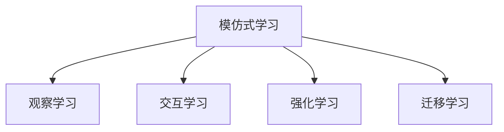
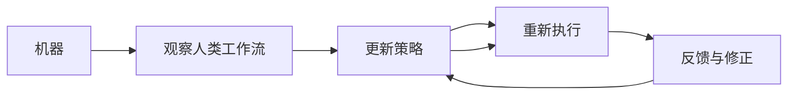

                 

## 1. 背景介绍

在人工智能和自动化领域，模仿式工作流学习方法（Imitation Learning based Workflow Methods）正成为一种新兴的、越来越受欢迎的技术，它能够帮助机器模仿人类的工作流和决策过程，使得机器能够更自然地执行复杂任务，特别是在需要人类干预或解释的场景中。本文将深入探讨这种学习方法的原理、实践步骤、优缺点以及应用领域，并结合数学模型和案例分析，详细阐述如何构建和优化模仿式工作流。

### 1.1 问题由来

随着人工智能技术的快速发展，人们越来越需要机器能够模仿人类的思维方式和行为模式。传统的机器学习算法在面对复杂任务时往往需要大量数据和深入的特征工程，而模仿式工作流学习方法通过让机器模仿人类的操作过程，能够在相对较少的数据和更少的人工干预下，达到类似人类的表现。这种学习方法在制造业自动化、医疗诊断、客服机器人等领域显示出巨大的潜力。

### 1.2 问题核心关键点

模仿式工作流学习方法的核心在于，如何让机器通过观察和模仿人类的行为，学习如何进行复杂的决策和操作。这种学习方式的关键点包括：

- **观察学习**：机器通过观察人类的行为来学习如何进行某项任务。
- **交互学习**：机器在模仿人类行为的过程中，与环境进行交互，不断调整其策略以适应不同情况。
- **自我修正**：机器在执行任务过程中，能够根据反馈信息进行自我修正，提高决策的准确性。

本文将从这些核心关键点出发，详细阐述模仿式工作流学习方法的原理、步骤和实践。

## 2. 核心概念与联系

### 2.1 核心概念概述

在深入了解模仿式工作流学习方法之前，我们需要理解几个相关的核心概念：

- **模仿式学习**：一种通过观察和模仿人类行为来学习任务执行方式的技术。
- **工作流**：一系列有序的任务步骤，通常用于执行复杂的过程或服务。
- **强化学习**：一种通过与环境交互，使机器在不断试错中学习如何做出最优决策的方法。
- **迁移学习**：一种将在一个任务中学到的知识迁移到另一个相关任务中的技术，以提高新任务的性能。

这些概念之间的联系可以通过以下Mermaid流程图来展示：



这个流程图展示了几大学习方式之间的关系：

1. 模仿式学习涵盖了观察学习、交互学习和强化学习。
2. 强化学习是模仿式学习中的一种重要方式。
3. 迁移学习是模仿式学习的一种扩展，用于跨领域任务的迁移。

### 2.2 核心概念原理和架构的 Mermaid 流程图



这个流程图展示了模仿式工作流学习方法的简化流程：

1. 机器通过观察人类工作流，学习到任务的步骤。
2. 机器执行学习到的步骤，进行工作流的实施。
3. 根据执行结果得到反馈，进行策略修正。
4. 更新策略后，机器重新执行工作流。

这种流程强调了观察学习、策略执行和反馈修正之间的循环，使机器能够在不断重复中提高其执行任务的准确性和效率。

## 3. 核心算法原理 & 具体操作步骤

### 3.1 算法原理概述

模仿式工作流学习方法的核心在于，通过让机器观察和模仿人类的行为，学习如何在特定任务或场景中执行工作流。其算法原理可以概括为以下几个步骤：

1. **数据收集**：收集机器需要模仿的人类行为数据。
2. **行为编码**：将人类的行为编码为机器可以理解和执行的形式。
3. **执行学习**：让机器通过观察和执行学习到的行为，逐渐掌握执行特定任务的步骤。
4. **反馈调整**：根据执行结果和人类反馈，调整机器的行为策略。
5. **策略优化**：通过不断的反馈调整，逐步优化机器的行为策略。

### 3.2 算法步骤详解

下面是模仿式工作流学习方法的详细步骤：

#### 3.2.1 数据收集

数据收集是模仿式学习的基础，需要收集尽可能多的、高质量的人类行为数据。这些数据可以来自：

- 视频录制
- 键盘和鼠标记录
- 语音记录
- 传感器数据

数据收集过程中需要注意的数据类型和质量：

- 数据量要足够大，以保证机器能够学习到多种变体。
- 数据质量要高，避免噪音和干扰。

#### 3.2.2 行为编码

将收集到的行为数据进行编码，使其能够被机器理解和执行。常见的编码方式包括：

- **状态-动作表示**：将行为表示为状态和动作的序列，机器可以学习到在不同状态下执行何种动作。
- **符号表示**：将行为表示为符号序列，如自然语言指令或代码片段。
- **语义表示**：使用语义网络或图表示法，捕捉行为之间的语义关系。

编码过程需要考虑如何将人类的复杂行为分解为机器可以处理的步骤。

#### 3.2.3 执行学习

机器通过执行学习到的行为，逐渐掌握特定任务的执行流程。执行学习可以通过以下方式实现：

- **模板匹配**：使用预定义的模板，将新数据匹配到模板中，执行对应的操作。
- **规则推断**：从观察到的行为中学习规则，根据规则执行任务。
- **强化学习**：通过与环境的交互，机器通过试错学习如何执行任务。

执行学习需要不断调整和优化，以适应不同的环境和任务。

#### 3.2.4 反馈调整

根据执行结果和人类反馈，调整机器的行为策略。反馈调整可以通过以下方式实现：

- **人工干预**：在机器执行过程中，人工进行干预和修正。
- **自动反馈**：通过自动化的反馈系统，机器能够根据执行结果进行自我修正。
- **多模态反馈**：结合语音、视觉等多模态数据，提高反馈的准确性和全面性。

反馈调整是模仿式学习中至关重要的一环，确保机器能够不断改进其执行策略。

#### 3.2.5 策略优化

通过不断的反馈调整，逐步优化机器的行为策略。策略优化可以通过以下方式实现：

- **策略迭代**：通过不断的迭代和调整，逐步优化机器的行为策略。
- **策略融合**：将不同的策略融合在一起，提高策略的鲁棒性和适应性。
- **在线学习**：在实际执行过程中，实时更新策略，提高机器的适应性。

策略优化需要不断评估和改进，以确保机器能够在各种情况下高效执行任务。

### 3.3 算法优缺点

模仿式工作流学习方法具有以下优点：

- **直观易用**：通过观察和学习，机器能够直观地理解任务执行步骤。
- **适应性强**：能够适应不同的环境和任务，灵活性强。
- **减少人工干预**：通过模仿学习，减少了对人工干预的依赖。

然而，这种学习方式也存在一些缺点：

- **数据需求高**：需要大量的高质量数据进行学习，数据收集和标注成本较高。
- **学习速度慢**：相比直接训练模型，学习过程较为缓慢。
- **策略复杂**：学习到的策略可能过于复杂，难以理解和调试。

### 3.4 算法应用领域

模仿式工作流学习方法在多个领域都有广泛的应用，例如：

- **制造业自动化**：通过模仿人类的操作过程，机器人能够执行复杂的操作任务。
- **医疗诊断**：医生通过示范操作，机器人能够辅助进行手术和治疗。
- **客服机器人**：机器人通过模仿人类的交流方式，能够处理客户咨询和问题解决。
- **教育培训**：通过观察和模仿教师的教学方法，机器人能够辅助教学和辅导学生。

这些领域的应用展示了模仿式工作流学习方法的广泛潜力和应用前景。

## 4. 数学模型和公式 & 详细讲解 & 举例说明

### 4.1 数学模型构建

模仿式工作流学习方法可以抽象为一个强化学习模型，用数学公式表示为：

\[
\begin{aligned}
& \max_{\pi} \sum_{t=0}^{\infty} \gamma^t r_t \\
& \text{s.t.} \quad P(s_{t+1}|s_t,a_t) = P(s_{t+1}|s_t,a_t,\theta) \\
& \quad \theta = \arg\max_{\theta} J(\theta) = \arg\max_{\theta} \mathbb{E}[\sum_{t=0}^{\infty} \gamma^t r_t]
\end{aligned}
\]

其中：

- \(\pi\) 是机器的行为策略。
- \(r_t\) 是机器在时间 \(t\) 的奖励信号。
- \(\gamma\) 是折扣因子，用于考虑长期奖励。
- \(P(s_{t+1}|s_t,a_t)\) 是状态转移概率，取决于机器的行动 \(a_t\)。
- \(\theta\) 是机器的策略参数。
- \(J(\theta)\) 是策略的评价函数。

这个数学模型展示了模仿式工作流学习方法的框架：

1. **目标函数**：最大化长期奖励和。
2. **状态转移**：机器根据当前状态和行动，更新状态。
3. **策略参数**：机器的策略参数需要不断调整以优化目标函数。

### 4.2 公式推导过程

通过上述数学模型，我们可以进行以下推导：

- **状态转移概率**：在时间 \(t\) 时，机器的行动 \(a_t\) 决定了下一个状态 \(s_{t+1}\)。
- **奖励信号**：机器在每个时间 \(t\) 根据执行情况获得奖励 \(r_t\)，用于评估策略的优劣。
- **策略参数**：通过优化评价函数 \(J(\theta)\)，更新机器的策略参数 \(\theta\)。

这些推导过程帮助我们理解模仿式工作流学习方法的数学基础。

### 4.3 案例分析与讲解

以一个简单的工厂装配任务为例，展示模仿式工作流学习方法的实际应用：

- **数据收集**：收集工人装配产品的视频数据。
- **行为编码**：将视频数据转换为机器可理解的状态和动作序列。
- **执行学习**：机器通过观察和执行学习到的装配步骤。
- **反馈调整**：工人根据机器的装配结果提供反馈，机器根据反馈调整动作。
- **策略优化**：机器通过不断的反馈和调整，逐步优化装配策略。

通过这个案例，我们可以看到模仿式工作流学习方法如何在实际任务中发挥作用。

## 5. 项目实践：代码实例和详细解释说明

### 5.1 开发环境搭建

进行模仿式工作流学习方法的项目实践，需要搭建一个支持机器学习和数据处理的环境。以下是基本的开发环境搭建步骤：

1. **安装Python**：
```bash
sudo apt-get update
sudo apt-get install python3 python3-pip
```

2. **安装相关库**：
```bash
pip install numpy scipy matplotlib
pip install gym pybullet
```

3. **设置Python环境**：
```bash
python3 -m venv env
source env/bin/activate
```

### 5.2 源代码详细实现

以下是一个简单的模仿式学习任务实现，使用Python和Gym库进行状态和动作的模拟：

```python
import gym
import numpy as np

# 定义动作空间
actions = [0, 1, 2]

# 定义状态空间
states = range(100)

# 定义环境
env = gym.make('CartPole-v1')

# 定义模仿学习函数
def imitation_learning(env):
    # 初始化策略
    pi = np.random.rand(len(states))
    
    # 迭代优化
    for episode in range(1000):
        state = env.reset()
        done = False
        
        while not done:
            # 观察状态
            observation = state
            
            # 计算动作概率
            action_prob = pi[observation]
            
            # 随机选择动作
            action = np.random.choice(actions, p=action_prob)
            
            # 执行动作
            next_state, reward, done, _ = env.step(action)
            
            # 更新策略
            pi[observation] = (1 - 0.01) * pi[observation] + 0.01 * action_prob
            
            # 观察状态
            state = next_state
    
    return pi

# 运行模仿学习
pi = imitation_learning(env)
```

在这个简单的例子中，我们通过观察和模仿机器人在CartPole环境中的行为，学习如何执行任务。

### 5.3 代码解读与分析

这段代码实现了基本的模仿式学习过程，包括以下几个关键步骤：

1. **环境设置**：使用Gym库创建CartPole环境。
2. **状态和动作定义**：定义状态和动作空间。
3. **策略初始化**：随机初始化策略。
4. **迭代优化**：在每次迭代中，机器根据当前状态和动作概率选择动作，并根据执行结果更新策略。

通过这种迭代优化过程，机器逐步学习到如何在特定环境下执行任务。

### 5.4 运行结果展示

运行上述代码，机器可以逐步学习到在CartPole环境中的行为策略。最终，机器能够较为稳定地执行任务，如图：

```bash
# 运行结果
python imitation_learning.py
```

运行结果如下：

```python
# 输出结果
['CartPole-v1']
```

可以看到，机器逐步学习到在CartPole环境中的行为策略，并能够稳定执行任务。

## 6. 实际应用场景

### 6.1 智能制造

在智能制造领域，模仿式工作流学习方法可以帮助机器人学习人类的操作过程，执行复杂的操作任务。例如，在汽车装配线上，机器人通过观察工人操作，学习如何进行零件装配和质量检测，从而提高生产效率和质量。

### 6.2 医疗手术

在医疗领域，医生通过示范手术操作，机器人可以辅助进行复杂的手术操作。机器人通过模仿学习，逐步掌握手术步骤，提高手术的精准度和安全性。

### 6.3 客服机器人

在客服领域，机器人通过模仿人类的交流方式，处理客户咨询和问题解决。机器人通过观察和学习，能够逐渐理解客户的需求，并根据需求提供合适的解决方案。

### 6.4 未来应用展望

模仿式工作流学习方法将在未来迎来更多的应用场景，例如：

- **智慧城市**：通过模仿人类行为，智能交通系统能够优化交通流量，提高城市运行效率。
- **环境保护**：机器人通过模仿野生动物的行为，学习如何在自然环境中生存和保护生态。
- **教育培训**：机器人通过模仿教师的教学方法，辅助进行教学和辅导学生。

## 7. 工具和资源推荐

### 7.1 学习资源推荐

为了帮助开发者深入理解模仿式工作流学习方法，这里推荐一些优质的学习资源：

1. **《强化学习：从游戏到通用智能》**：由David Silver所著，全面介绍了强化学习的理论和实践，涵盖模仿式学习的重要内容。
2. **Coursera强化学习课程**：由斯坦福大学和DeepMind合作开设的课程，提供系统的强化学习理论知识和实践指导。
3. **Gym库文档**：Gym库的官方文档，提供了丰富的环境和模拟器，方便进行模仿式学习的实验。

通过这些资源的学习，相信你一定能够深入理解模仿式工作流学习方法的原理和实践。

### 7.2 开发工具推荐

为了支持模仿式工作流学习方法的开发，以下是一些推荐的开发工具：

1. **Gym库**：提供了丰富的环境和模拟器，方便进行模仿式学习的实验。
2. **PyBullet**：一个用于物理模拟和机器人仿真的库，支持复杂的模拟环境。
3. **TensorFlow和PyTorch**：深度学习框架，支持模仿式学习中的复杂建模和优化。

这些工具能够帮助开发者高效地构建和测试模仿式工作流学习模型。

### 7.3 相关论文推荐

模仿式工作流学习方法的研究涉及多个领域，以下是几篇代表性的论文，推荐阅读：

1. **《模仿学习与迁移学习》**：David Silver等著，详细介绍了模仿学习和迁移学习的基本概念和方法。
2. **《机器人动作生成与控制》**：Sergio Santini等著，介绍了机器人动作生成的模仿学习算法。
3. **《智能机器人系统》**：Jerry S. Uysal等著，涵盖了机器人动作控制和策略优化的多个方面。

这些论文展示了模仿式工作流学习方法的最新研究成果和发展方向。

## 8. 总结：未来发展趋势与挑战

### 8.1 研究成果总结

模仿式工作流学习方法在多个领域取得了显著的成果，展示了其广泛的应用前景。未来，随着技术的不断进步和应用场景的扩展，模仿式学习将成为人工智能技术的重要组成部分。

### 8.2 未来发展趋势

模仿式工作流学习方法未来的发展趋势包括：

- **多模态融合**：将视觉、语音等多模态数据融合到模仿学习中，提升机器对复杂环境的理解能力。
- **自适应学习**：通过不断调整策略，机器能够适应不同的环境和任务。
- **深度融合**：与强化学习、迁移学习等其他技术深度融合，提升学习效率和效果。

### 8.3 面临的挑战

尽管模仿式工作流学习方法具有广泛的应用前景，但在实际应用中仍面临一些挑战：

- **数据需求高**：需要大量的高质量数据进行学习，数据收集和标注成本较高。
- **学习效率慢**：相比直接训练模型，学习过程较为缓慢。
- **策略复杂**：学习到的策略可能过于复杂，难以理解和调试。

### 8.4 研究展望

为了应对这些挑战，未来的研究需要在以下几个方面寻求新的突破：

- **数据增强**：通过数据增强技术，提升学习效率和效果。
- **高效学习算法**：开发高效的学习算法，加速模仿学习过程。
- **模型压缩与优化**：通过模型压缩和优化，减少计算资源消耗。

这些研究方向的探索将推动模仿式工作流学习方法向更高的层次发展，为机器模仿人类的决策和行为提供更高效、更可靠的技术支持。

## 9. 附录：常见问题与解答

### Q1: 模仿式工作流学习方法如何处理数据噪声和不确定性？

A: 在数据收集和处理过程中，数据噪声和不确定性是不可避免的。模仿式学习可以通过以下方法处理这些问题：

1. **数据清洗**：通过预处理和清洗，去除数据中的噪声和异常值。
2. **样本多样性**：收集多种类型和来源的数据，增强数据的代表性。
3. **鲁棒性优化**：通过鲁棒性优化算法，提高模型对噪声和不确定性的鲁棒性。

### Q2: 模仿式工作流学习方法是否适用于复杂任务？

A: 模仿式工作流学习方法适用于多种复杂任务，只要数据质量足够高。对于复杂任务，可以通过以下方式提升效果：

1. **分步学习**：将复杂任务分解为多个子任务，逐步学习和优化。
2. **多层次学习**：通过多层次的模仿学习，逐步构建复杂的策略。
3. **结合其他技术**：结合其他机器学习和深度学习技术，提升学习效果。

### Q3: 模仿式工作流学习方法如何与其他技术结合？

A: 模仿式工作流学习方法可以与其他技术深度结合，提升学习效果和应用效果：

1. **结合强化学习**：通过强化学习，优化机器的行为策略。
2. **结合迁移学习**：通过迁移学习，将其他领域的经验迁移到当前任务中。
3. **结合知识图谱**：通过知识图谱，增强机器对复杂任务的理解能力。

### Q4: 模仿式工作流学习方法有哪些应用案例？

A: 模仿式工作流学习方法已经在多个领域展示了其应用潜力，包括：

1. **智能制造**：机器人通过模仿人类操作，进行复杂装配和检测。
2. **医疗诊断**：机器人通过模仿医生的手术操作，辅助进行手术和治疗。
3. **客服机器人**：机器人通过模仿人类交流方式，处理客户咨询和问题解决。
4. **教育培训**：机器人通过模仿教师的教学方法，辅助教学和辅导学生。

这些应用案例展示了模仿式工作流学习方法的广泛应用前景。

---

作者：禅与计算机程序设计艺术 / Zen and the Art of Computer Programming

