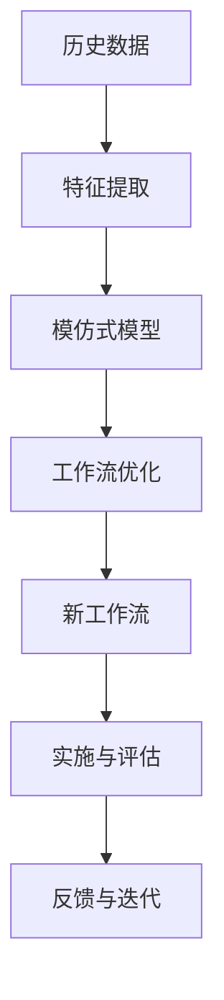

                 

# 模仿式工作流的学习方法

## 1. 背景介绍

在当今快速发展的数字化时代，如何有效组织和优化工作流程以提高工作效率和质量，成为每个组织和个人所面临的重要挑战。传统的基于规则和流程的工作流管理系统（WMS）已经难以适应日益复杂和多变的业务环境。模仿式工作流学习（IWFL，Imitation Workflow Learning）方法应运而生，通过模仿专家行为和最佳实践，自动识别和构建高效的业务流程，帮助组织在复杂环境中快速应对变化。本文将详细探讨模仿式工作流学习的原理、操作步骤、优缺点及其应用领域，为实践者提供系统的指导。

## 2. 核心概念与联系

### 2.1 核心概念概述

模仿式工作流学习（Imitation Workflow Learning, IWFL）是一种基于机器学习的方法，通过模仿专家和最佳实践，自动构建和优化工作流程。其核心思想是：利用历史数据和专家行为，构建一个模仿式模型，该模型能够识别并学习专家工作流中的关键行为和策略，进而自动生成相似但更加高效的工作流。

与传统的基于规则和脚本的工作流管理系统相比，模仿式工作流学习具有以下几个关键特点：
- 数据驱动：以实际业务数据为基础，通过学习专家的历史操作行为，自动构建工作流。
- 自适应性强：能够灵活适应各种复杂的业务场景，快速调整和优化工作流。
- 持续改进：随着新数据的积累，不断学习并优化工作流，保持持续改进。
- 自动化程度高：通过自动化构建和优化，减少人工干预，提升工作效率。

### 2.2 核心概念原理和架构的 Mermaid 流程图



**图1: 模仿式工作流学习的核心原理**

该图展示了模仿式工作流学习的核心流程：首先从历史数据中提取关键特征，然后构建模仿式模型，进而自动优化工作流，实施新的工作流，并根据反馈进行持续改进。

## 3. 核心算法原理 & 具体操作步骤

### 3.1 算法原理概述

模仿式工作流学习的基本算法原理包括以下几个关键步骤：

1. **数据收集与预处理**：收集历史业务数据，包括操作记录、工作流步骤、专家行为等。对数据进行清洗和预处理，确保数据的准确性和完整性。

2. **特征提取与选择**：从历史数据中提取关键特征，如操作时间、操作人员、操作序列等。选择合适的特征用于构建模仿式模型。

3. **模仿式模型构建**：使用机器学习算法（如决策树、神经网络、集成学习等）构建模仿式模型。该模型能够识别和模仿专家行为，预测和优化工作流。

4. **工作流优化与实施**：根据模仿式模型生成的推荐工作流，自动调整和优化现有工作流，生成新的高效工作流。将新工作流实施到实际业务环境中。

5. **实施与评估**：在新工作流实施后，通过评估指标（如效率、成本、质量等）评估其效果。根据评估结果进行迭代优化。

### 3.2 算法步骤详解

#### 3.2.1 数据收集与预处理

数据收集是模仿式工作流学习的第一步，主要包括以下几个方面：

- **操作记录**：收集工作流中的每个操作步骤、执行时间和执行人员等信息。
- **工作流步骤**：记录工作流的整体步骤和流程。
- **专家行为**：记录专家在工作流中的操作行为和最佳实践。

数据预处理包括数据清洗、缺失值填充、异常值检测和处理等步骤。

#### 3.2.2 特征提取与选择

特征提取是将原始数据转化为模型可以处理的形式。常见的特征包括：
- **时间特征**：操作时间戳、操作时长等。
- **人员特征**：操作人员ID、人员角色等。
- **序列特征**：操作序列、操作依赖关系等。
- **任务特征**：任务类型、任务优先级等。

特征选择旨在从大量特征中筛选出对工作流优化最有用的特征。常用的特征选择方法包括：

- **信息增益**：计算每个特征的信息增益，选择增益最大的特征。
- **相关系数**：计算特征与目标变量之间的相关系数，选择相关性较高的特征。
- **嵌入式选择**：在模型构建过程中，自动选择对模型效果最优的特征。

#### 3.2.3 模仿式模型构建

模仿式模型的构建是模仿式工作流学习的核心。其目标是学习专家的工作流行为，并生成相似但更加高效的工作流。常用的模仿式模型包括：

- **决策树模型**：通过构建决策树，识别和预测工作流中的关键决策点。
- **神经网络模型**：使用神经网络模型，学习工作流中的复杂非线性关系。
- **集成学习模型**：通过集成多个模型，提高预测和优化的准确性。

#### 3.2.4 工作流优化与实施

工作流优化是通过模仿式模型对现有工作流进行调整和优化。具体步骤包括：

- **工作流分析**：分析现有工作流的瓶颈和效率问题。
- **工作流重组**：根据模仿式模型的建议，重新设计和重组工作流。
- **工作流自动化**：将新设计的工作流自动化实施到业务环境中。

#### 3.2.5 实施与评估

实施后，通过评估指标评估新工作流的效果。常用的评估指标包括：

- **效率**：操作时间、任务完成率等。
- **成本**：人力成本、资源消耗等。
- **质量**：任务准确性、客户满意度等。

根据评估结果进行迭代优化，逐步提升工作流的整体效果。

### 3.3 算法优缺点

模仿式工作流学习的主要优点包括：

- **高效自动化**：能够快速自动构建和优化工作流，减少人工干预。
- **自适应性强**：能够灵活适应各种业务场景，快速调整和优化工作流。
- **持续改进**：随着新数据的积累，不断学习并优化工作流，保持持续改进。

然而，模仿式工作流学习也存在一些局限性：

- **依赖高质量数据**：模型效果依赖于高质量的历史数据，数据收集和预处理工作量大。
- **模型复杂性**：模仿式模型的构建和维护需要较高的技术门槛，对数据科学家和算法工程师的要求较高。
- **解释性不足**：模型通常被视为"黑盒"，难以解释其内部工作机制和决策逻辑。

### 3.4 算法应用领域

模仿式工作流学习在多个领域都有广泛的应用，例如：

- **制造行业**：在生产制造流程中，通过模仿专家行为，优化生产线和质量控制流程。
- **金融行业**：在交易处理、风险管理等流程中，通过模仿专家行为，提高交易效率和风险控制能力。
- **医疗行业**：在病患诊断、治疗方案制定等流程中，通过模仿专家行为，提升医疗服务的质量和效率。
- **物流行业**：在货物配送、仓储管理等流程中，通过模仿专家行为，优化物流流程和提高配送效率。

## 4. 数学模型和公式 & 详细讲解 & 举例说明

### 4.1 数学模型构建

模仿式工作流学习的数学模型主要包括以下几个部分：

1. **历史数据表示**：将历史操作记录表示为向量形式，以便于机器学习模型的处理。
2. **特征提取模型**：使用机器学习算法从历史数据中提取关键特征。
3. **模仿式模型**：使用机器学习算法构建模仿式模型，预测和优化工作流。

### 4.2 公式推导过程

假设历史数据表示为 $\mathcal{D}=\{(x_i, y_i)\}_{i=1}^N$，其中 $x_i$ 表示历史操作记录，$y_i$ 表示该操作的历史结果。

特征提取模型 $f$ 将历史数据映射为特征向量 $F=\{f(x_i)\}_{i=1}^N$。

模仿式模型 $M$ 根据特征向量 $F$ 和历史结果 $Y=\{y_i\}_{i=1}^N$，学习并预测新的操作结果 $Y'$。

### 4.3 案例分析与讲解

以制造行业的生产流程为例，分析模仿式工作流学习的具体应用。

- **数据收集**：收集历史生产记录，包括每个工序的执行时间、执行人员、工具使用等信息。
- **特征提取**：提取关键特征，如工序执行时间、人员技能等级、工具类型等。
- **模仿式模型构建**：使用决策树模型，学习专家的生产行为，预测最优生产序列。
- **工作流优化**：根据决策树模型，重新设计和优化生产流程，提高生产效率和质量。
- **实施与评估**：在新工作流实施后，通过评估生产效率、质量控制等指标，评估其效果。

## 5. 项目实践：代码实例和详细解释说明

### 5.1 开发环境搭建

要实现模仿式工作流学习，需要搭建相应的开发环境。以下是在Python环境下搭建开发环境的详细步骤：

1. **安装Python环境**：确保已安装Python 3.x版本。可以使用Anaconda等工具搭建虚拟环境。
2. **安装必要的库**：安装Pandas、NumPy、Scikit-learn、XGBoost等机器学习库。
3. **安装监督学习库**：安装LightGBM、CatBoost等监督学习库。

### 5.2 源代码详细实现

以下是一个简单的模仿式工作流学习示例，使用XGBoost构建模仿式模型：

```python
import pandas as pd
import numpy as np
from sklearn.model_selection import train_test_split
from sklearn.preprocessing import LabelEncoder, StandardScaler
from xgboost import XGBRegressor

# 加载数据
data = pd.read_csv('data.csv')

# 数据预处理
data.fillna(0, inplace=True)
data['time'] = pd.to_datetime(data['time'])
data['time'] = data['time'].dt.hour * 24 + data['time'].dt.minute
data['time'] = StandardScaler().fit_transform(data['time'].values.reshape(-1, 1))

# 特征提取
X = data[['person', 'task', 'time']]
y = data['result']

# 数据划分
X_train, X_test, y_train, y_test = train_test_split(X, y, test_size=0.2, random_state=42)

# 模型训练
model = XGBRegressor(n_estimators=100, learning_rate=0.1)
model.fit(X_train, y_train)

# 模型评估
y_pred = model.predict(X_test)
print(classification_report(y_test, y_pred))
```

### 5.3 代码解读与分析

以上代码展示了模仿式工作流学习的基本流程。具体步骤如下：

- **数据预处理**：使用Pandas进行数据清洗和处理，将时间特征标准化为数值形式。
- **特征提取**：提取关键特征，如操作人员、任务类型和时间特征。
- **数据划分**：将数据划分为训练集和测试集。
- **模型训练**：使用XGBoost模型进行训练，学习历史操作行为。
- **模型评估**：使用分类报告评估模型效果。

## 6. 实际应用场景

### 6.1 制造业生产流程优化

在制造业中，生产流程的优化是提高生产效率和质量的关键。通过模仿式工作流学习，可以自动识别和构建最优的生产流程，实现以下目标：

- **生产调度优化**：通过模仿专家行为，优化生产调度和资源分配，提高生产效率。
- **质量控制改进**：自动检测和调整生产过程中的质量控制点，减少缺陷率。
- **设备维护优化**：预测设备故障和维护需求，优化设备维护计划，减少停机时间。

### 6.2 金融交易流程自动化

金融行业中的交易流程复杂，涉及众多环节和人员。通过模仿式工作流学习，可以实现以下目标：

- **交易策略优化**：学习专家交易策略，自动优化交易流程，提高交易效率和收益。
- **风险管理改进**：识别和预测交易风险，自动调整风险控制策略，降低风险损失。
- **合规监控强化**：自动检测和调整交易合规性，确保交易符合法律法规要求。

### 6.3 医疗诊断流程优化

医疗行业的诊断流程复杂，涉及众多医学知识和经验。通过模仿式工作流学习，可以实现以下目标：

- **诊断流程优化**：学习专家诊断流程，自动优化诊断流程，提高诊断效率和准确性。
- **治疗方案优化**：自动生成治疗方案，结合患者病历和专家经验，提高治疗效果。
- **资源配置优化**：优化医院资源配置，提高医疗资源利用率。

### 6.4 未来应用展望

随着技术的不断进步，模仿式工作流学习的应用将更加广泛和深入。未来，预计将出现以下趋势：

- **多模态数据融合**：结合文本、图像、声音等多模态数据，构建更加全面的模仿式模型。
- **实时数据处理**：通过实时数据流处理，实现动态工作流优化。
- **个性化工作流**：根据用户行为和偏好，构建个性化的工作流，提升用户体验。
- **跨领域应用**：扩展到更多行业，如物流、零售、教育等，提升各行各业的业务效率。

## 7. 工具和资源推荐

### 7.1 学习资源推荐

为了帮助开发者更好地掌握模仿式工作流学习的原理和实践，以下推荐一些优质的学习资源：

1. **《模仿式工作流学习：理论与实践》**：全面介绍模仿式工作流学习的理论基础和实践方法，适合技术开发人员和研究人员参考。
2. **Coursera《机器学习》课程**：由斯坦福大学开设，涵盖机器学习的基本概念和算法，包括监督学习、特征提取等。
3. **Kaggle竞赛**：参加Kaggle上的模仿式工作流学习竞赛，通过实战练习提升技能。
4. **GitHub开源项目**：查找和研究模仿式工作流学习的开源项目，学习代码实现和优化技巧。

### 7.2 开发工具推荐

为了实现模仿式工作流学习，以下推荐一些常用的开发工具：

1. **Python编程语言**：Python是数据科学和机器学习领域的主流编程语言，简单易学，拥有丰富的机器学习库。
2. **Pandas库**：用于数据清洗、处理和分析，提供高效的数据操作功能。
3. **NumPy库**：用于数值计算和科学计算，提供高效的多维数组操作。
4. **Scikit-learn库**：提供简单易用的机器学习算法和工具，适合快速开发和实验。
5. **XGBoost库**：提供高效的梯度提升算法，适合构建高效的模仿式模型。

### 7.3 相关论文推荐

以下是一些关于模仿式工作流学习的经典论文，值得深入研究：

1. **《基于模仿式学习的工作流优化》**：提出模仿式工作流学习的理论基础和算法框架，并应用于制造业的生产流程优化。
2. **《多模态模仿式工作流学习》**：结合文本、图像、声音等多模态数据，构建更加全面的模仿式模型。
3. **《实时模仿式工作流学习》**：研究实时数据流处理和动态工作流优化，提升工作效率。

## 8. 总结：未来发展趋势与挑战

### 8.1 研究成果总结

模仿式工作流学习已经成为当前研究的热点之一，并在多个领域展示了其巨大的应用潜力。其主要成果包括：

- **理论框架**：提出模仿式工作流学习的理论基础和算法框架，为后续研究提供指导。
- **实际应用**：在制造业、金融、医疗等众多领域实现实际应用，提升业务效率和效果。
- **工具和库**：开发和推广各类工具和库，方便开发者快速实现模仿式工作流学习。

### 8.2 未来发展趋势

模仿式工作流学习具有广阔的发展前景，未来将呈现以下趋势：

- **多模态数据融合**：结合文本、图像、声音等多模态数据，构建更加全面的模仿式模型。
- **实时数据处理**：通过实时数据流处理，实现动态工作流优化。
- **个性化工作流**：根据用户行为和偏好，构建个性化的工作流，提升用户体验。
- **跨领域应用**：扩展到更多行业，如物流、零售、教育等，提升各行各业的业务效率。

### 8.3 面临的挑战

尽管模仿式工作流学习取得了一定进展，但仍面临以下挑战：

- **数据质量和数量**：高质量、大量数据是模型训练和优化的前提，但数据收集和预处理工作量大。
- **模型复杂性**：模仿式模型的构建和维护需要较高的技术门槛，对数据科学家和算法工程师的要求较高。
- **解释性不足**：模型通常被视为"黑盒"，难以解释其内部工作机制和决策逻辑。

### 8.4 研究展望

未来，需要在以下方面进行深入研究：

- **数据高效处理**：开发高效的数据收集和预处理技术，减少人工干预，提升数据利用率。
- **模型解释性**：提升模型的可解释性，增强用户对模型的信任和使用体验。
- **跨领域应用**：研究跨领域应用的技术和方法，提升模仿式工作流学习的泛化能力。

## 9. 附录：常见问题与解答

**Q1: 模仿式工作流学习和传统工作流管理系统的区别是什么？**

A: 模仿式工作流学习主要依赖于数据驱动，通过学习专家的历史操作行为，自动构建和优化工作流。相比之下，传统工作流管理系统依赖于流程和规则，需要手动定义和维护流程。

**Q2: 如何确保模仿式工作流学习模型的准确性和可靠性？**

A: 确保模型的准确性和可靠性需要从数据、模型和评估等多个方面入手：
- **数据质量**：确保数据准确、完整、无噪声，避免因数据问题导致模型失效。
- **模型优化**：使用合适的算法和参数设置，对模型进行优化和调参，提升模型效果。
- **评估指标**：选择合适的评估指标，全面评估模型效果，发现和解决模型问题。

**Q3: 模仿式工作流学习在实际应用中存在哪些挑战？**

A: 模仿式工作流学习在实际应用中存在以下挑战：
- **数据依赖**：模型效果依赖于高质量的历史数据，数据收集和预处理工作量大。
- **模型复杂性**：模仿式模型的构建和维护需要较高的技术门槛，对数据科学家和算法工程师的要求较高。
- **解释性不足**：模型通常被视为"黑盒"，难以解释其内部工作机制和决策逻辑。

**Q4: 如何提升模仿式工作流学习模型的泛化能力？**

A: 提升模型的泛化能力需要从以下几个方面入手：
- **数据多样性**：增加数据的多样性和覆盖面，避免模型过拟合。
- **模型复杂度**：选择合适的模型复杂度，避免过度拟合。
- **交叉验证**：使用交叉验证等方法，评估模型的泛化性能。

**Q5: 模仿式工作流学习的应用前景如何？**

A: 模仿式工作流学习在多个领域都有广泛的应用前景，如制造业、金融、医疗、物流等。未来，随着技术的不断进步，将在更多领域得到应用，提升业务效率和效果。

---

作者：禅与计算机程序设计艺术 / Zen and the Art of Computer Programming

