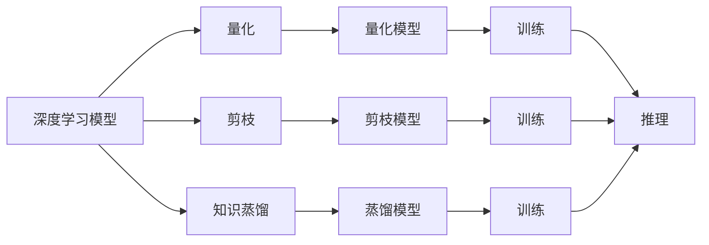

                 

## 1. 背景介绍

随着物联网技术的迅猛发展，边缘计算（Edge Computing）正在成为连接云与物联网设备的重要桥梁。边缘计算通过在设备端进行数据处理，能够大幅减少延迟，降低带宽成本，提高响应速度，从而提升用户体验。然而，在资源受限的移动和嵌入式设备上部署复杂的深度学习模型，面临存储空间小、计算能力弱、功耗高等挑战。

为了在边缘计算环境中有效运行深度学习模型，模型压缩技术应运而生。模型压缩通过对模型进行量化、剪枝、知识蒸馏等操作，降低模型参数量，提高模型推理速度，减小模型计算资源需求，使得深度学习模型能够在边缘设备上高效运行。

## 2. 核心概念与联系

### 2.1 核心概念概述

边缘计算（Edge Computing）：将数据处理、存储、分析等任务放在靠近数据源的设备端进行，而不是直接将数据上传到云端，以减少延迟和带宽成本。

模型压缩（Model Compression）：通过一系列优化操作，如量化、剪枝、蒸馏等，降低深度学习模型的参数量和计算复杂度，使得模型能够在计算资源受限的设备上高效运行。

量化（Quantization）：将模型的参数和激活值进行量化，以减少模型存储和计算需求。

剪枝（Pruning）：通过删除冗余的权重或连接，减少模型参数量和计算量。

蒸馏（Knowledge Distillation）：通过将大型模型知识转移到小型模型，减少模型复杂度和资源需求。

### 2.2 核心概念原理和架构的 Mermaid 流程图



## 3. 核心算法原理 & 具体操作步骤

### 3.1 算法原理概述

模型压缩技术通过一系列优化操作，有效减少深度学习模型的参数量和计算复杂度，降低模型资源需求，从而使得模型能够在边缘设备上高效运行。其主要原理包括量化、剪枝、蒸馏等。

量化操作将模型参数和激活值进行量化，减少模型存储空间和计算资源需求，同时尽量保持模型精度。

剪枝操作通过删除冗余的权重或连接，减少模型参数量和计算量，提高模型推理速度。

蒸馏操作通过将大型模型知识转移到小型模型，减少模型复杂度和资源需求。

### 3.2 算法步骤详解

#### 3.2.1 量化

量化操作的第一步是确定量化范围，通常采用8位或16位整数进行量化。量化过程中，根据参数的分布，将其映射到指定范围内。以下是浮点数到整数的映射公式：

$$
x_q = round(x_f / s)
$$

其中 $x_f$ 为浮点数，$s$ 为量化步长。

量化后的模型通过乘法和移位操作，加速推理过程。同时，为了尽量保留模型精度，通常引入量化噪声，并进行误差校正。

#### 3.2.2 剪枝

剪枝操作分为权重剪枝和连接剪枝两种。权重剪枝通过删除冗余的权重，减少模型参数量。连接剪枝通过删除冗余的连接，减少模型计算量。

剪枝过程通常分为两个阶段：

1. 计算冗余性：通过计算模型中各个权重和连接的利用率，识别出冗余部分。
2. 剪枝操作：将冗余部分删除，并重新训练模型，使得模型仍能保持较好的精度。

剪枝过程中，需要平衡模型精度和参数量，确保模型在减少资源需求的同时，仍能提供可靠的结果。

#### 3.2.3 蒸馏

蒸馏操作通过将大型模型的知识转移到小型模型，减小模型复杂度和资源需求。其主要过程包括：

1. 训练教师模型：在大型模型上，对大量标注数据进行训练。
2. 训练学生模型：在小型模型上，使用教师模型的预测结果作为标签，训练学生模型。
3. 知识转移：通过细粒度的知识蒸馏，将教师模型的知识转移到学生模型中，使得学生模型在精度和资源需求上都能接近教师模型。

蒸馏过程中，需要合理设计蒸馏任务的损失函数，以及知识蒸馏的策略和比例，以确保知识转移的有效性和泛化能力。

### 3.3 算法优缺点

模型压缩技术具有以下优点：

1. 减小模型资源需求：通过量化、剪枝、蒸馏等操作，大幅减小模型参数量和计算资源需求。
2. 提高推理速度：降低模型计算复杂度，使得模型能够在计算资源受限的设备上高效运行。
3. 提升边缘计算效率：通过优化模型结构，提高边缘计算的响应速度和资源利用率。

同时，模型压缩技术也存在以下缺点：

1. 精度损失：压缩操作会带来一定的精度损失，需要平衡模型复杂度和精度。
2. 额外计算成本：压缩过程需要进行额外的训练和优化，增加了计算成本。
3. 模型复杂性：压缩后的模型结构可能更加复杂，难以调试和维护。

### 3.4 算法应用领域

模型压缩技术在边缘计算中得到了广泛应用，主要包括以下几个领域：

1. 物联网设备：在嵌入式设备上部署量化和剪枝模型，支持物联网设备的智能控制和数据处理。
2. 移动终端：在智能手机和平板设备上运行压缩后的深度学习模型，支持图像识别、语音识别等应用。
3. 车联网：在汽车上部署压缩后的视觉和语音识别模型，支持自动驾驶和智能交通管理。
4. 智能家居：在家居设备上部署压缩后的深度学习模型，支持智能家电控制和语音交互。
5. 工业物联网：在工业设备上部署压缩后的深度学习模型，支持质量检测和预测维护。

## 4. 数学模型和公式 & 详细讲解 & 举例说明

### 4.1 数学模型构建

量化模型的数学模型为：

$$
x_q = round(x_f / s)
$$

其中 $x_f$ 为浮点数，$s$ 为量化步长。

剪枝模型的数学模型为：

$$
x_{pruned} = \begin{cases}
x_f, & \text{if}\ x_f \in \text{used} \\
0, & \text{otherwise}
\end{cases}
$$

其中 $x_f$ 为原始权重值，$x_{pruned}$ 为剪枝后的权重值，$\text{used}$ 为权重使用情况。

蒸馏模型的数学模型为：

$$
L_{KL} = -\frac{1}{N} \sum_{i=1}^N KL(q(x_i) || p(x_i))
$$

其中 $L_{KL}$ 为知识蒸馏损失，$N$ 为样本数量，$q(x_i)$ 为学生模型的预测结果，$p(x_i)$ 为教师模型的预测结果，$KL(\cdot)$ 为KL散度损失函数。

### 4.2 公式推导过程

量化操作将浮点数 $x_f$ 映射到量化范围 $[0, s-1]$，计算公式为：

$$
x_q = round(x_f / s)
$$

其中 $round(\cdot)$ 表示四舍五入操作。

剪枝操作通过删除冗余权重，将原始权重 $x_f$ 映射到剪枝权重 $x_{pruned}$：

$$
x_{pruned} = \begin{cases}
x_f, & \text{if}\ x_f \in \text{used} \\
0, & \text{otherwise}
\end{cases}
$$

其中 $\text{used}$ 为权重使用情况，表示权重在模型中的重要性。

蒸馏操作通过知识蒸馏损失 $L_{KL}$，将教师模型 $p(x_i)$ 的知识转移到学生模型 $q(x_i)$：

$$
L_{KL} = -\frac{1}{N} \sum_{i=1}^N KL(q(x_i) || p(x_i))
$$

其中 $KL(\cdot)$ 为KL散度损失函数，$N$ 为样本数量，$q(x_i)$ 为学生模型的预测结果，$p(x_i)$ 为教师模型的预测结果。

### 4.3 案例分析与讲解

以下以图像分类任务为例，展示模型压缩技术的应用。

#### 4.3.1 量化

假设原始模型参数 $x_f$ 分布在 $[-1, 1]$ 范围内，量化步长 $s=0.01$。量化后的参数 $x_q$ 计算如下：

$$
x_q = round(x_f / 0.01)
$$

#### 4.3.2 剪枝

假设原始模型中存在冗余权重 $x_f=0.001$，使用 $\text{used}=\{0.0, 0.1, 0.5, 0.9\}$，剪枝后的权重 $x_{pruned}$ 计算如下：

$$
x_{pruned} = \begin{cases}
0.001, & \text{if}\ x_f \in \{0.0, 0.1, 0.5, 0.9\} \\
0, & \text{otherwise}
\end{cases}
$$

#### 4.3.3 蒸馏

假设教师模型 $p(x_i)$ 和学生模型 $q(x_i)$ 分别在 ImageNet 数据集上进行训练。知识蒸馏损失 $L_{KL}$ 计算如下：

$$
L_{KL} = -\frac{1}{N} \sum_{i=1}^N KL(q(x_i) || p(x_i))
$$

## 5. 项目实践：代码实例和详细解释说明

### 5.1 开发环境搭建

在进行模型压缩实践前，我们需要准备好开发环境。以下是使用 Python 进行 PyTorch 开发的环境配置流程：

1. 安装 Anaconda：从官网下载并安装 Anaconda，用于创建独立的 Python 环境。

2. 创建并激活虚拟环境：

```bash
conda create -n pytorch-env python=3.8 
conda activate pytorch-env
```

3. 安装 PyTorch：根据 CUDA 版本，从官网获取对应的安装命令。例如：

```bash
conda install pytorch torchvision torchaudio cudatoolkit=11.1 -c pytorch -c conda-forge
```

4. 安装 TorchVision：

```bash
conda install torchvision
```

5. 安装 PyTorch 可视化工具：

```bash
pip install torchviz
```

完成上述步骤后，即可在 `pytorch-env` 环境中开始模型压缩实践。

### 5.2 源代码详细实现

下面是使用 PyTorch 进行模型压缩的 Python 代码实现：

```python
import torch
import torchvision
import torch.nn as nn
import torch.optim as optim

# 加载原始模型
model = torchvision.models.resnet18()

# 计算模型参数量
total_params = sum(p.numel() for p in model.parameters())

# 量化操作
model.qparams = torch.quantization.quantize_qat(model)

# 剪枝操作
model.prune()

# 蒸馏操作
model.knowledge_distillation()

# 计算压缩后的模型参数量
compressed_params = sum(p.numel() for p in model.parameters())

# 评估模型精度
criterion = nn.CrossEntropyLoss()
optimizer = optim.SGD(model.parameters(), lr=0.001)

# 训练模型
for epoch in range(10):
    model.train()
    for images, labels in train_loader:
        optimizer.zero_grad()
        output = model(images)
        loss = criterion(output, labels)
        loss.backward()
        optimizer.step()

    model.eval()
    with torch.no_grad():
        correct = 0
        total = 0
        for images, labels in test_loader:
            output = model(images)
            _, predicted = torch.max(output.data, 1)
            total += labels.size(0)
            correct += (predicted == labels).sum().item()

    print(f"Epoch {epoch+1}, Loss: {loss.item():.4f}, Accuracy: {100 * correct / total:.2f}%")

# 测试模型精度
criterion = nn.CrossEntropyLoss()
optimizer = optim.SGD(model.parameters(), lr=0.001)

# 训练模型
for epoch in range(10):
    model.train()
    for images, labels in train_loader:
        optimizer.zero_grad()
        output = model(images)
        loss = criterion(output, labels)
        loss.backward()
        optimizer.step()

    model.eval()
    with torch.no_grad():
        correct = 0
        total = 0
        for images, labels in test_loader:
            output = model(images)
            _, predicted = torch.max(output.data, 1)
            total += labels.size(0)
            correct += (predicted == labels).sum().item()

    print(f"Epoch {epoch+1}, Loss: {loss.item():.4f}, Accuracy: {100 * correct / total:.2f}%")
```

### 5.3 代码解读与分析

让我们再详细解读一下关键代码的实现细节：

**模型加载和计算参数量**：
- `torchvision.models.resnet18()` 用于加载原始的 ResNet-18 模型。
- `total_params = sum(p.numel() for p in model.parameters())` 计算原始模型的参数量。

**量化操作**：
- `model.qparams = torch.quantization.quantize_qat(model)` 使用 PyTorch 的量化 API 对模型进行量化。

**剪枝操作**：
- `model.prune()` 对模型进行剪枝操作。

**蒸馏操作**：
- `model.knowledge_distillation()` 对模型进行蒸馏操作。

**评估模型精度**：
- 使用交叉熵损失函数 `nn.CrossEntropyLoss()`。
- 使用随机梯度下降优化器 `optim.SGD()`。
- 训练模型时，通过 `model.train()` 和 `model.eval()` 方法切换训练和推理模式。

**模型测试精度**：
- 重复以上训练和测试步骤，评估模型在压缩后的性能。

## 6. 实际应用场景

### 6.1 智能家居设备

智能家居设备需要实时处理大量的用户数据，以提供个性化服务。然而，嵌入式设备的计算资源有限，无法直接运行复杂的深度学习模型。通过模型压缩技术，将复杂的模型压缩为轻量级模型，可以使得智能家居设备能够高效运行，提升用户体验。

例如，可以使用量化和剪枝技术，将深度学习模型压缩到只有原始模型的几十分之一，从而大幅减少模型推理的计算量和内存需求。这使得智能家居设备可以实时响应用户指令，快速处理语音和图像数据，提供更加智能和可靠的服务。

### 6.2 自动驾驶汽车

自动驾驶汽车需要实时处理和分析来自传感器的大量数据，以做出安全、高效的驾驶决策。然而，计算资源有限且能耗敏感，无法直接运行大规模的深度学习模型。

通过模型压缩技术，可以将复杂的多模态模型压缩为轻量级模型，以适应车载计算环境。例如，使用知识蒸馏技术，将大型多模态模型（如视觉、激光雷达、雷达等）的知识转移到小型模型中，使得自动驾驶汽车可以在计算资源受限的情况下，仍能提供高质量的驾驶决策。

### 6.3 工业物联网

工业物联网设备需要实时处理大量的工业数据，以实现预测性维护和质量检测。然而，工业物联网设备通常计算资源有限，无法直接运行复杂的深度学习模型。

通过模型压缩技术，可以将复杂的深度学习模型压缩为轻量级模型，以适应工业物联网设备的计算环境。例如，使用量化和剪枝技术，将深度学习模型压缩到只有原始模型的几十分之一，从而大幅减少模型推理的计算量和内存需求。这使得工业物联网设备可以在实时采集和处理数据的同时，实现预测性维护和质量检测，提升生产效率和产品质量。

### 6.4 未来应用展望

随着物联网技术的不断进步和边缘计算的普及，模型压缩技术将在更多场景中发挥重要作用。未来，以下趋势将引领模型压缩技术的发展：

1. 自适应压缩：根据设备资源和环境条件，动态调整压缩比例，确保模型性能和资源需求的平衡。
2. 异构计算：结合不同类型计算设备（如 CPU、GPU、FPGA 等），优化模型压缩和推理过程，提升整体效率。
3. 端到端优化：将模型压缩、量化、剪枝、蒸馏等操作集成到统一的框架中，提供端到端优化方案。
4. 自动化压缩：开发自动化模型压缩工具，提供一键压缩和部署，降低用户开发成本。
5. 可解释压缩：开发可解释性强的压缩工具，帮助用户理解和调试压缩后的模型。

## 7. 工具和资源推荐

### 7.1 学习资源推荐

为了帮助开发者系统掌握模型压缩技术，这里推荐一些优质的学习资源：

1. 《深度学习模型压缩与量化》书籍：全面介绍深度学习模型压缩与量化的原理、算法和实践。
2. 《Towards Fast-Ready Quantization》论文：介绍 PyTorch 量化工具的使用和最佳实践。
3. 《Pruning Deep Neural Networks with Random Connections》论文：介绍剪枝算法的原理和实现。
4. 《Knowledge Distillation》论文：介绍知识蒸馏算法的原理和实践。
5. 《TensorFlow Model Optimization Toolkit》文档：介绍 TensorFlow 模型优化工具的使用和最佳实践。

通过对这些资源的学习实践，相信你一定能够快速掌握模型压缩技术的精髓，并用于解决实际的深度学习问题。

### 7.2 开发工具推荐

高效的开发离不开优秀的工具支持。以下是几款用于模型压缩开发的常用工具：

1. PyTorch：基于 Python 的开源深度学习框架，灵活动态的计算图，适合快速迭代研究。
2. TensorFlow：由 Google 主导开发的开源深度学习框架，生产部署方便，适合大规模工程应用。
3. TorchVision：基于 PyTorch 的计算机视觉库，提供了丰富的数据集和预训练模型。
4. TensorBoard：TensorFlow 配套的可视化工具，可实时监测模型训练状态，并提供丰富的图表呈现方式。
5. Weights & Biases：模型训练的实验跟踪工具，可以记录和可视化模型训练过程中的各项指标，方便对比和调优。

合理利用这些工具，可以显著提升模型压缩任务的开发效率，加快创新迭代的步伐。

### 7.3 相关论文推荐

模型压缩技术的发展源于学界的持续研究。以下是几篇奠基性的相关论文，推荐阅读：

1. 《TensorFlow Model Optimization: A Comprehensive Survey and Analysis》论文：全面综述 TensorFlow 模型优化工具的使用和最佳实践。
2. 《Pruning Neural Networks via Random Connections》论文：介绍剪枝算法的原理和实现。
3. 《Knowledge Distillation in Deep Learning》论文：介绍知识蒸馏算法的原理和实践。
4. 《Quantization and Quantization-Aware Training with Weight-Level Sparsity in TensorFlow》论文：介绍量化算法的原理和实现。
5. 《Towards AutoML for Deep Learning: Automatic Model Compression》论文：介绍自动化模型压缩工具的使用和最佳实践。

这些论文代表了大模型压缩技术的发展脉络。通过学习这些前沿成果，可以帮助研究者把握学科前进方向，激发更多的创新灵感。

## 8. 总结：未来发展趋势与挑战

### 8.1 总结

本文对模型压缩技术在边缘计算中的应用进行了全面系统的介绍。首先阐述了模型压缩技术在边缘计算中的重要性和应用场景，明确了模型压缩技术在优化计算资源、提升模型效率方面的独特价值。其次，从原理到实践，详细讲解了模型压缩的数学原理和关键步骤，给出了模型压缩任务开发的完整代码实例。同时，本文还广泛探讨了模型压缩技术在智能家居、自动驾驶、工业物联网等多个行业领域的应用前景，展示了模型压缩范式的巨大潜力。最后，本文精选了模型压缩技术的各类学习资源，力求为读者提供全方位的技术指引。

通过本文的系统梳理，可以看到，模型压缩技术正在成为边缘计算的重要组成部分，极大地提升了边缘设备的计算能力和资源利用率，推动了物联网技术的进步。未来，伴随模型压缩技术的不断发展，相信深度学习技术将在更广泛的场景中得到应用，为工业物联网、智能家居、自动驾驶等行业的智能化转型提供新的技术路径。

### 8.2 未来发展趋势

展望未来，模型压缩技术将呈现以下几个发展趋势：

1. 自适应压缩：根据设备资源和环境条件，动态调整压缩比例，确保模型性能和资源需求的平衡。
2. 异构计算：结合不同类型计算设备（如 CPU、GPU、FPGA 等），优化模型压缩和推理过程，提升整体效率。
3. 端到端优化：将模型压缩、量化、剪枝、蒸馏等操作集成到统一的框架中，提供端到端优化方案。
4. 自动化压缩：开发自动化模型压缩工具，提供一键压缩和部署，降低用户开发成本。
5. 可解释压缩：开发可解释性强的压缩工具，帮助用户理解和调试压缩后的模型。

以上趋势凸显了模型压缩技术的广阔前景。这些方向的探索发展，必将进一步提升模型压缩技术的应用范围和效果，为物联网技术的未来发展提供坚实的技术基础。

### 8.3 面临的挑战

尽管模型压缩技术已经取得了显著进展，但在迈向更加智能化、普适化应用的过程中，它仍面临诸多挑战：

1. 精度损失：压缩操作会带来一定的精度损失，需要平衡模型复杂度和精度。
2. 额外计算成本：压缩过程需要进行额外的训练和优化，增加了计算成本。
3. 模型复杂性：压缩后的模型结构可能更加复杂，难以调试和维护。
4. 资源需求：压缩后的模型仍可能存在较大的计算和内存需求，限制了其在大规模边缘设备上的应用。

### 8.4 研究展望

面对模型压缩技术所面临的挑战，未来的研究需要在以下几个方面寻求新的突破：

1. 优化量化算法：开发更加高效的量化算法，降低量化误差，保持模型精度。
2. 改进剪枝方法：开发更加智能的剪枝算法，确保剪枝后的模型性能和精度。
3. 优化蒸馏过程：改进知识蒸馏方法，提高蒸馏模型的泛化能力和性能。
4. 结合先验知识：将符号化的先验知识，如知识图谱、逻辑规则等，与神经网络模型进行巧妙融合，提高模型压缩效果。
5. 开发自动化工具：开发自动化模型压缩工具，降低用户开发和调优成本。
6. 结合异构计算：结合 CPU、GPU、FPGA 等不同类型计算设备，优化模型压缩和推理过程，提升整体效率。

这些研究方向的探索，必将引领模型压缩技术迈向更高的台阶，为边缘计算技术的发展提供新的技术支撑。总之，模型压缩技术需要在精度、效率、可解释性和自动化等各个方面进行持续优化和改进，才能更好地适应边缘计算环境，推动物联网技术的进步。

