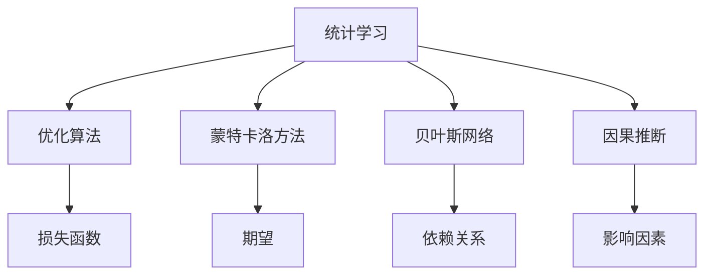

                 

# 模型思维在决策分析中的运用

> 关键词：模型思维，决策分析，统计学习，优化算法，蒙特卡洛方法，贝叶斯网络，因果推断

## 1. 背景介绍

在当今信息爆炸的时代，面对海量数据和复杂问题，模型思维已成为决策分析的核心手段。无论是金融风险评估、市场营销策略制定，还是智能推荐系统设计，模型都扮演着重要的角色。通过构建科学合理的模型，可以对决策过程进行量化和优化，提升决策的准确性和效率。

### 1.1 问题由来
随着数据科学和人工智能技术的迅猛发展，模型的应用场景日益广泛。然而，构建和应用模型并非易事，需要综合运用数学、统计学、计算机科学等多学科知识。模型思维的背后，是一套完整的理论体系和方法论，涵盖了数据收集、数据处理、模型构建、模型训练、模型评估等各个环节。

### 1.2 问题核心关键点
模型思维的核心关键点在于：通过构建科学合理的模型，量化决策过程中各种不确定因素，从而在有限信息下做出最优决策。这一过程包括以下几个步骤：
1. **数据收集**：收集相关领域的大量数据，为模型训练提供基础。
2. **特征选择**：从数据中提取有意义的特征，减少噪声干扰。
3. **模型选择**：根据问题特点，选择适合的模型类型。
4. **模型训练**：使用训练数据对模型进行训练，调整模型参数。
5. **模型评估**：评估模型在测试数据上的表现，确保模型泛化能力。
6. **决策应用**：将模型应用于实际决策过程中，实现量化评估。

## 2. 核心概念与联系

### 2.1 核心概念概述

为更好地理解模型思维在决策分析中的应用，本节将介绍几个密切相关的核心概念：

- **统计学习**：利用统计学方法，从数据中学习出能够对新数据进行预测或分类的模型。
- **优化算法**：通过数学优化方法，寻找损失函数最小化的参数组合。
- **蒙特卡洛方法**：利用随机抽样，计算复杂问题的统计解，如期望、方差等。
- **贝叶斯网络**：一种有向无环图模型，用于表示变量之间的依赖关系。
- **因果推断**：通过数据探究因果关系，识别影响决策的关键因素。

这些核心概念之间的逻辑关系可以通过以下Mermaid流程图来展示：



这个流程图展示了一系列模型思维的关键组件及其之间的关系：

1. **统计学习**是模型构建的基础，通过学习数据中的规律，构建模型。
2. **优化算法**是模型训练的核心，通过最小化损失函数，调整模型参数。
3. **蒙特卡洛方法**和**贝叶斯网络**提供了解决复杂问题的工具，如随机抽样和变量依赖关系的表示。
4. **因果推断**揭示了决策中的因果关系，识别关键影响因素。

这些概念共同构成了模型思维的理论基础，为决策分析提供了科学的方法论。

## 3. 核心算法原理 & 具体操作步骤
### 3.1 算法原理概述

模型思维在决策分析中的应用，核心在于通过构建和优化模型，量化决策过程中各种不确定因素，从而在有限信息下做出最优决策。

形式化地，设决策问题为 $P$，其状态空间为 $S$，决策空间为 $A$，奖赏函数为 $R$。目标是在给定历史信息 $H$ 下，选择策略 $a$ 使得期望累积奖赏最大。则决策问题可以表示为：

$$
\max_{a} \mathbb{E}[\sum_{t=0}^{\infty} R(st,at) | s_0=S]
$$

其中，$st$ 表示时刻 $t$ 的状态，$at$ 表示时刻 $t$ 的行动。

为了解决这一问题，统计学习提供了一系列模型，如线性回归、逻辑回归、决策树、支持向量机等，可以用于对状态和行动进行预测。优化算法，如梯度下降、牛顿法、遗传算法等，可以用于最小化损失函数，调整模型参数。蒙特卡洛方法和贝叶斯网络提供了解决复杂问题的工具，如随机抽样和变量依赖关系的表示。因果推断揭示了决策中的因果关系，识别关键影响因素。

### 3.2 算法步骤详解

模型思维在决策分析中的应用，主要包括以下几个步骤：

**Step 1: 数据收集和预处理**
- 收集相关领域的大量数据，包括历史决策记录、客户行为数据、市场环境数据等。
- 对数据进行清洗和预处理，如去除噪声、处理缺失值、归一化等。

**Step 2: 特征选择**
- 从数据中提取有意义的特征，如客户基本信息、行为特征、市场趋势等。
- 使用特征选择方法，如方差分析、相关性分析、主成分分析等，筛选出最有价值的特征。

**Step 3: 模型选择**
- 根据问题特点，选择合适的模型类型，如回归模型、分类模型、聚类模型等。
- 考虑模型复杂度和泛化能力，选择合适的超参数。

**Step 4: 模型训练**
- 使用训练数据对模型进行训练，调整模型参数。
- 使用优化算法，如梯度下降、牛顿法等，最小化损失函数。

**Step 5: 模型评估**
- 在测试数据上评估模型的泛化能力，如使用准确率、召回率、F1值等指标。
- 进行交叉验证，确保模型在不同数据集上的表现一致。

**Step 6: 决策应用**
- 将模型应用于实际决策过程中，进行量化评估。
- 根据模型预测结果，制定决策方案。

以上是模型思维在决策分析中的一般流程。在实际应用中，还需要根据具体问题进行优化设计，如改进模型训练方法、引入更多先验知识、优化模型参数等，以进一步提升决策效果。

### 3.3 算法优缺点

模型思维在决策分析中具有以下优点：
1. 量化决策过程。通过构建和优化模型，将决策过程量化为数学表达式，便于理解和优化。
2. 提升决策准确性。模型可以捕捉数据中的规律，提供更准确的决策支持。
3. 自动化决策制定。模型能够自动学习决策模式，减少人工干预，提高决策效率。
4. 可解释性强。模型训练过程透明，可以解释决策过程的逻辑。

同时，模型思维也存在以下局限性：
1. 依赖数据质量。模型性能很大程度上取决于数据的质量和数量，低质量数据可能导致模型泛化能力不足。
2. 模型假设限制。模型假设可能与实际问题不符，导致决策误差。
3. 复杂度较高。构建和优化模型需要大量的计算资源和专业知识。
4. 过拟合风险。在复杂问题上，模型容易过拟合训练数据，导致泛化能力差。

尽管存在这些局限性，但就目前而言，模型思维仍是决策分析中最主流的方法之一。未来相关研究的重点在于如何进一步降低模型对数据的依赖，提高模型的泛化能力和鲁棒性，同时兼顾可解释性和决策效率。

### 3.4 算法应用领域

模型思维在决策分析中的应用，已经广泛应用于金融风险管理、市场营销策略、智能推荐系统、供应链优化等多个领域。

1. **金融风险管理**：利用统计学习模型，如逻辑回归、随机森林等，对贷款、投资等决策进行量化评估。
2. **市场营销策略**：通过回归模型和聚类分析，挖掘客户行为模式，制定个性化的营销策略。
3. **智能推荐系统**：利用协同过滤、深度学习等模型，对用户行为进行预测，实现个性化推荐。
4. **供应链优化**：使用优化算法，如遗传算法、蚁群算法等，对供应链中的物流、库存等问题进行优化。

除了上述这些经典应用外，模型思维还在更多场景中得到了创新性的应用，如医疗诊断、智能客服、城市交通管理等，为决策分析提供了新的思路。

## 4. 数学模型和公式 & 详细讲解  
### 4.1 数学模型构建

本节将使用数学语言对模型思维在决策分析中的应用进行更加严格的刻画。

设决策问题为 $P$，其状态空间为 $S$，决策空间为 $A$，奖赏函数为 $R$。定义决策策略为 $\pi: S \rightarrow A$，则决策问题可以表示为：

$$
\max_{\pi} \mathbb{E}[\sum_{t=0}^{\infty} R(st,at) | s_0=S]
$$

其中，$st$ 表示时刻 $t$ 的状态，$at$ 表示时刻 $t$ 的行动。

假设模型为 $\hat{y}=f(x;\theta)$，其中 $x$ 为输入特征向量，$\theta$ 为模型参数。定义损失函数为 $L(\hat{y},y)$，其中 $y$ 为真实标签。则模型训练的目标是：

$$
\min_{\theta} L(\hat{y},y)
$$

其中，$L$ 可以是交叉熵损失、均方误差损失等。

在模型训练过程中，常用的优化算法包括梯度下降、牛顿法、Adam等。以梯度下降为例，其更新公式为：

$$
\theta \leftarrow \theta - \eta \nabla_{\theta}L(\hat{y},y)
$$

其中，$\eta$ 为学习率，$\nabla_{\theta}L$ 为损失函数对模型参数的梯度，可通过反向传播算法高效计算。

### 4.2 公式推导过程

以下我们以线性回归模型为例，推导其训练过程。

假设模型为 $\hat{y}=\theta_0 + \theta_1 x_1 + \theta_2 x_2$，其中 $x_1, x_2$ 为输入特征向量，$\theta_0, \theta_1, \theta_2$ 为模型参数。定义损失函数为均方误差损失：

$$
L(y,\hat{y})=\frac{1}{n}\sum_{i=1}^n(y_i - \hat{y}_i)^2
$$

其中 $y_i$ 为真实标签，$\hat{y}_i$ 为模型预测值。则梯度下降更新公式为：

$$
\theta_0 \leftarrow \theta_0 - \eta \frac{2}{n}\sum_{i=1}^n(y_i - \hat{y}_i)
$$

$$
\theta_1 \leftarrow \theta_1 - \eta \frac{2}{n}\sum_{i=1}^n(x_{1,i} - \hat{x}_{1,i})y_i
$$

$$
\theta_2 \leftarrow \theta_2 - \eta \frac{2}{n}\sum_{i=1}^n(x_{2,i} - \hat{x}_{2,i})y_i
$$

其中 $\eta$ 为学习率，$n$ 为样本数。

在得到损失函数的梯度后，即可带入梯度下降公式，完成模型的迭代优化。重复上述过程直至收敛，最终得到适应决策问题最优的模型参数 $\theta^*$。

## 5. 项目实践：代码实例和详细解释说明
### 5.1 开发环境搭建

在进行决策分析模型实践前，我们需要准备好开发环境。以下是使用Python进行模型构建的环境配置流程：

1. 安装Anaconda：从官网下载并安装Anaconda，用于创建独立的Python环境。

2. 创建并激活虚拟环境：
```bash
conda create -n model-env python=3.8 
conda activate model-env
```

3. 安装Python相关包：
```bash
pip install numpy pandas scikit-learn matplotlib scikit-optimize
```

4. 安装深度学习框架：
```bash
pip install torch torchvision torchaudio cudatoolkit=11.1 -c pytorch -c conda-forge
```

5. 安装TensorFlow：
```bash
pip install tensorflow
```

完成上述步骤后，即可在`model-env`环境中开始模型构建和训练。

### 5.2 源代码详细实现

这里我们以线性回归模型为例，使用TensorFlow进行模型训练的代码实现。

```python
import tensorflow as tf
import numpy as np
import pandas as pd

# 创建训练数据
X = np.random.randn(100, 2)
y = 2 * X[:, 0] + 3 * X[:, 1] + np.random.randn(100) * 0.2
X = pd.DataFrame(X, columns=['x1', 'x2'])
y = pd.Series(y, index=X.index)

# 定义模型
model = tf.keras.Sequential([
    tf.keras.layers.Dense(1, input_shape=[2])
])

# 定义损失函数
loss_fn = tf.keras.losses.MeanSquaredError()

# 定义优化器
optimizer = tf.keras.optimizers.SGD(learning_rate=0.01)

# 训练模型
epochs = 100
for epoch in range(epochs):
    with tf.GradientTape() as tape:
        y_pred = model(X)
        loss = loss_fn(y_pred, y)
    gradients = tape.gradient(loss, model.trainable_variables)
    optimizer.apply_gradients(zip(gradients, model.trainable_variables))
    print(f'Epoch {epoch+1}, loss: {loss:.4f}')

# 测试模型
test_X = np.random.randn(10, 2)
test_y = 2 * test_X[:, 0] + 3 * test_X[:, 1] + np.random.randn(10) * 0.2
test_X = pd.DataFrame(test_X, columns=['x1', 'x2'])
test_y = pd.Series(test_y, index=test_X.index)
y_pred = model(test_X)

print(f'Test loss: {loss_fn(y_pred, test_y).numpy():.4f}')
print(f'Test prediction: {y_pred.numpy():.4f}')
```

以上代码展示了使用TensorFlow进行线性回归模型训练和测试的过程。可以看到，TensorFlow的模型构建和训练过程非常简单，利用高阶API可以快速完成模型的构建和训练。

### 5.3 代码解读与分析

让我们再详细解读一下关键代码的实现细节：

**数据准备**：
- 使用numpy生成随机数据，模拟真实决策问题中的输入特征和真实标签。
- 将数据转化为Pandas DataFrame格式，方便后续操作。

**模型构建**：
- 使用TensorFlow的Sequential API，构建一个包含一个全连接层的神经网络模型。
- 使用`Dense`层定义模型的输出，参数为1，表示回归问题。

**损失函数和优化器**：
- 使用`MeanSquaredError`损失函数，定义模型的训练目标。
- 使用`SGD`优化器，设置学习率为0.01。

**训练过程**：
- 使用`GradientTape`记录梯度，计算损失函数。
- 通过`apply_gradients`方法更新模型参数。
- 在每个epoch结束时，输出当前损失。

**测试过程**：
- 生成新的测试数据，用于评估模型性能。
- 使用模型进行预测，并计算测试集上的损失。
- 输出测试集上的损失和预测结果。

通过上述代码，我们可以清晰地看到线性回归模型的训练和测试过程。TensorFlow的高阶API大大简化了模型构建和训练的代码量，使得模型开发更加高效便捷。

## 6. 实际应用场景
### 6.1 智能推荐系统

智能推荐系统是模型思维在决策分析中的典型应用之一。通过收集用户行为数据，利用机器学习模型，推荐用户可能感兴趣的商品或内容。推荐系统的关键在于用户行为建模和商品/内容画像的构建。

在技术实现上，可以采用协同过滤、深度学习等方法，构建用户行为预测模型和商品/内容画像。利用历史行为数据训练模型，对用户未交互的商品或内容进行预测，从而实现个性化推荐。推荐系统通过不断的学习和调整，能够提供更精准、更个性化的推荐结果，提升用户体验。

### 6.2 金融风险管理

金融风险管理是模型思维在决策分析中的重要应用领域。金融机构面临的风险包括信用风险、市场风险、操作风险等。利用统计学习模型，如逻辑回归、随机森林等，可以对贷款、投资等决策进行量化评估。模型可以捕捉数据中的规律，提供更准确的决策支持。

在实践中，可以收集金融历史数据，包括贷款申请记录、市场趋势、经济指标等。利用模型对风险进行预测和评估，识别高风险客户和交易，提前采取风险控制措施。此外，还可以利用机器学习模型，如时间序列预测模型，对市场波动进行预测，制定更合理的投资策略。

### 6.3 市场营销策略

市场营销策略制定也是模型思维在决策分析中的重要应用。通过收集客户行为数据，利用机器学习模型，挖掘客户行为模式，制定个性化的营销策略。

在技术实现上，可以采用聚类分析、回归模型等方法，对客户进行分组。利用历史营销数据训练模型，对不同客户群体进行预测，制定针对性的营销方案。市场营销策略通过不断的学习和调整，能够提供更精准、更有效的营销效果，提升客户满意度。

### 6.4 未来应用展望

随着模型思维的不断演进，未来在决策分析中的应用将更加广泛和深入。

1. **医疗诊断**：利用机器学习模型，对医疗数据进行分析和预测，提高疾病诊断的准确性。
2. **智能客服**：利用自然语言处理和机器学习技术，构建智能客服系统，提升客户服务质量。
3. **城市交通管理**：利用机器学习模型，对交通数据进行分析和预测，优化交通管理决策。
4. **智能制造**：利用机器学习模型，对制造过程进行监控和优化，提升生产效率和产品质量。

此外，在更多场景中，模型思维也将得到创新性的应用，如社会舆情监测、智能合约设计、智能合约执行等，为决策分析提供新的思路。

## 7. 工具和资源推荐
### 7.1 学习资源推荐

为了帮助开发者系统掌握模型思维的理论基础和实践技巧，这里推荐一些优质的学习资源：

1. **《机器学习》课程**：斯坦福大学开设的机器学习课程，讲解了机器学习的基本概念和经典算法，是入门机器学习领域的必选资源。
2. **TensorFlow官方文档**：TensorFlow的官方文档，提供了详尽的API和使用方法，是开发TensorFlow模型的重要参考资料。
3. **《深度学习》书籍**：Ian Goodfellow等人所著，全面介绍了深度学习的基本原理和应用，是深入理解深度学习模型的经典教材。
4. **《统计学习方法》书籍**：李航等人所著，介绍了统计学习的基本理论和常用方法，是入门统计学习领域的必选资源。
5. **Kaggle竞赛平台**：Kaggle是一个数据科学竞赛平台，提供了大量的数据集和竞赛，是学习和实践机器学习模型的绝佳场所。

通过对这些资源的学习实践，相信你一定能够快速掌握模型思维的理论基础，并用于解决实际的决策分析问题。

### 7.2 开发工具推荐

高效的开发离不开优秀的工具支持。以下是几款用于模型思维开发常用的工具：

1. **TensorFlow**：由Google主导开发的深度学习框架，支持分布式计算，提供高阶API和低阶API，适合大规模工程应用。
2. **PyTorch**：由Facebook主导开发的深度学习框架，灵活高效，适合研究和实验。
3. **Scikit-learn**：Python中的机器学习库，包含各种常用算法和工具，是机器学习开发的常用工具。
4. **Jupyter Notebook**：交互式开发环境，支持Python、R等多种语言，是模型开发和学习的常用工具。
5. **Tableau**：数据可视化工具，可以将模型预测结果直观展示，便于分析和决策。

合理利用这些工具，可以显著提升模型思维在决策分析中的应用效率，加快创新迭代的步伐。

### 7.3 相关论文推荐

模型思维在决策分析中的应用，源于学界的持续研究。以下是几篇奠基性的相关论文，推荐阅读：

1. **A Tutorial on Support Vector Regression**：Wang等人所著，介绍了支持向量回归的基本原理和应用。
2. **The Elements of Statistical Learning**：Hastie等人所著，介绍了统计学习的基本理论和常用方法。
3. **Deep Learning**：Goodfellow等人所著，介绍了深度学习的基本原理和应用。
4. **An Introduction to Statistical Learning**：Gareth等人所著，介绍了统计学习的基本理论和常用方法。
5. **Causal Inference in Statistics, Social, and Biomedical Sciences**：Rubin所著，介绍了因果推断的基本原理和应用。

这些论文代表了大模型思维的发展脉络。通过学习这些前沿成果，可以帮助研究者把握学科前进方向，激发更多的创新灵感。

## 8. 总结：未来发展趋势与挑战
### 8.1 总结

本文对模型思维在决策分析中的应用进行了全面系统的介绍。首先阐述了模型思维的研究背景和意义，明确了模型思维在量化决策过程中的重要作用。其次，从原理到实践，详细讲解了模型构建、优化和应用的全过程，给出了模型思维任务开发的完整代码实例。同时，本文还广泛探讨了模型思维在智能推荐、金融风险管理、市场营销等诸多领域的应用前景，展示了模型思维的巨大潜力。

通过本文的系统梳理，可以看到，模型思维在决策分析中的广泛应用，为决策过程的量化提供了科学的方法论。未来，伴随模型思维的不断演进，相信决策分析技术将在更多领域得到应用，为人类决策提供更精准、更高效的支持。

### 8.2 未来发展趋势

展望未来，模型思维在决策分析中的应用将呈现以下几个发展趋势：

1. **深度学习技术进一步普及**。随着深度学习技术的不断发展，模型性能将不断提升，决策分析的应用领域也将更加广泛。
2. **多模态融合技术进步**。未来的模型思维将能够处理视觉、语音、文本等多种数据模态，提供更全面、更精准的决策支持。
3. **因果推断技术的成熟**。通过引入因果推断技术，模型将能够更好地理解决策中的因果关系，提高决策的准确性。
4. **自动化决策系统的普及**。未来的模型思维将与自动化决策系统深度结合，减少人工干预，提高决策效率。
5. **可解释性和透明度的提升**。未来的模型思维将提供更强的可解释性和透明度，帮助决策者理解模型的决策过程。

以上趋势凸显了模型思维在决策分析中的广阔前景。这些方向的探索发展，必将进一步提升决策分析技术的性能和应用范围，为人类决策提供更可靠、更智能的支持。

### 8.3 面临的挑战

尽管模型思维在决策分析中的应用已经取得了瞩目成就，但在迈向更加智能化、普适化应用的过程中，它仍面临着诸多挑战：

1. **数据质量问题**。模型性能很大程度上取决于数据的质量和数量，低质量数据可能导致模型泛化能力不足。
2. **模型复杂性**。构建和优化模型需要大量的计算资源和专业知识，模型复杂性高，实现难度大。
3. **解释性问题**。模型思维的"黑盒"特性，使得决策者难以理解模型的决策过程，模型的可解释性和透明度需要进一步提升。
4. **安全性问题**。模型可能学习到有害信息，通过决策过程传递，造成误导性或歧视性的输出，需要保障模型输出的安全性。
5. **公平性问题**。模型可能存在偏见，导致决策结果不公平，需要引入公平性约束，确保模型输出的公正性。

正视模型思维面临的这些挑战，积极应对并寻求突破，将是大模型思维走向成熟的必由之路。相信随着学界和产业界的共同努力，这些挑战终将一一被克服，模型思维必将在构建人机协同的智能决策中扮演越来越重要的角色。

### 8.4 研究展望

面对模型思维面临的种种挑战，未来的研究需要在以下几个方面寻求新的突破：

1. **高效模型的开发**。开发更加高效、易用的模型，降低模型开发和优化的复杂度。
2. **多模态融合**。引入多模态数据融合技术，提升模型对复杂问题的处理能力。
3. **因果推断**。引入因果推断技术，增强模型对因果关系的理解，提升决策的准确性。
4. **自动化决策**。开发自动决策系统，减少人工干预，提升决策效率。
5. **公平性和安全性**。引入公平性和安全性约束，确保模型输出的公正性和安全性。
6. **可解释性**。提升模型的可解释性和透明度，帮助决策者理解模型的决策过程。

这些研究方向的探索，必将引领模型思维在决策分析中迈向更高的台阶，为构建可靠、智能的决策系统铺平道路。面向未来，模型思维需要与其他人工智能技术进行更深入的融合，如知识表示、因果推理、强化学习等，多路径协同发力，共同推动决策分析技术的进步。

## 9. 附录：常见问题与解答

**Q1：什么是模型思维？**

A: 模型思维是一种基于数学、统计学和计算技术的方法论，通过构建和优化模型，量化决策过程中的不确定因素，从而在有限信息下做出最优决策。

**Q2：模型思维有哪些优点？**

A: 模型思维具有以下几个优点：
1. 量化决策过程。通过构建和优化模型，将决策过程量化为数学表达式，便于理解和优化。
2. 提升决策准确性。模型可以捕捉数据中的规律，提供更准确的决策支持。
3. 自动化决策制定。模型能够自动学习决策模式，减少人工干预，提高决策效率。
4. 可解释性强。模型训练过程透明，可以解释决策过程的逻辑。

**Q3：模型思维有哪些局限性？**

A: 模型思维存在以下几个局限性：
1. 依赖数据质量。模型性能很大程度上取决于数据的质量和数量，低质量数据可能导致模型泛化能力不足。
2. 模型复杂性。构建和优化模型需要大量的计算资源和专业知识，模型复杂性高，实现难度大。
3. 解释性问题。模型思维的"黑盒"特性，使得决策者难以理解模型的决策过程，模型的可解释性和透明度需要进一步提升。
4. 安全性问题。模型可能学习到有害信息，通过决策过程传递，造成误导性或歧视性的输出，需要保障模型输出的安全性。
5. 公平性问题。模型可能存在偏见，导致决策结果不公平，需要引入公平性约束，确保模型输出的公正性。

正视模型思维面临的这些挑战，积极应对并寻求突破，将是大模型思维走向成熟的必由之路。相信随着学界和产业界的共同努力，这些挑战终将一一被克服，模型思维必将在构建人机协同的智能决策中扮演越来越重要的角色。

---

作者：禅与计算机程序设计艺术 / Zen and the Art of Computer Programming

