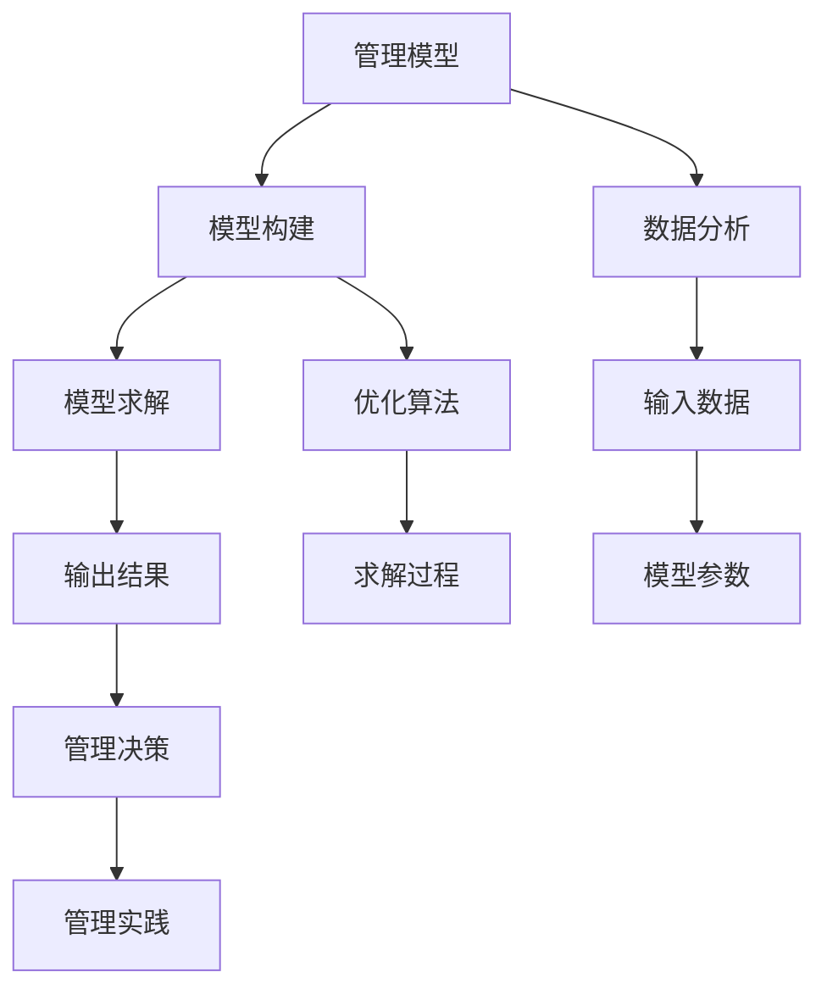

                 

## 1. 背景介绍

### 1.1 问题由来

在当前快速变化和高度竞争的商业环境中，企业需要不断创新，以保持竞争优势。管理层需要制定战略、应对挑战、提升团队效率和创新能力，以实现企业的长期成功。管理培训作为提升管理能力的有效手段，越来越受到企业的重视。然而，传统的管理培训方法往往侧重于经验和案例教学，缺乏系统性和科学性，难以帮助管理者真正掌握先进的管理思维和方法。

### 1.2 问题核心关键点

为了解决上述问题，企业需要引入一种更加系统、科学的管理思维培训方法。基于此，本文提出“模型思维”在管理培训中的运用。模型思维是一种将复杂问题抽象为数学模型，并利用数据分析和计算方法求解问题的方法。在管理培训中，通过引入模型思维，可以帮助管理者更系统地理解和应用管理知识，提升其决策和问题解决能力。

## 2. 核心概念与联系

### 2.1 核心概念概述

1. **模型思维 (Model Thinking)**：指将问题抽象为数学模型，并通过模型求解来解决问题的方法。模型思维具有系统性、可量化、可重复的特点，适用于各种复杂问题，包括管理决策问题。

2. **管理模型 (Management Models)**：指用于描述和解释管理现象的数学模型，如供应链管理模型、人力资源管理模型、战略管理模型等。管理模型通常包含输入变量、输出变量和参数，通过对模型求解，可以预测管理现象的变化趋势，制定有效的管理策略。

3. **数据分析 (Data Analysis)**：指使用统计学、机器学习等方法对数据进行分析和解释，以获取有价值的信息和洞察。数据分析是模型思维的重要组成部分，通过数据分析，可以识别出问题的本质和影响因素，从而更准确地构建和管理模型。

4. **优化算法 (Optimization Algorithm)**：指用于求解数学优化问题的算法，如线性规划、整数规划、非线性规划等。优化算法是模型思维的重要工具，通过优化算法，可以找到最优的解决方案，帮助管理者做出更科学的决策。

5. **管理实践 (Management Practice)**：指在实际管理中应用管理模型和算法的过程。管理实践包括数据收集、模型构建、模型求解和模型应用等步骤，是模型思维与实际管理结合的关键。

这些核心概念之间的联系可以通过以下Mermaid流程图来展示：



这个流程图展示了模型思维在管理培训中的主要步骤和过程：

1. 首先，构建用于描述管理现象的管理模型。
2. 接着，对管理模型所需的数据进行分析，以确定输入变量和参数。
3. 然后，使用优化算法求解管理模型，找到最优的解决方案。
4. 最后，将求解结果应用到实际管理中，以指导管理决策。

这些步骤和过程构成了模型思维在管理培训中的核心框架。

## 3. 核心算法原理 & 具体操作步骤

### 3.1 算法原理概述

基于模型思维的管理培训，其核心原理是通过构建和管理模型，帮助管理者系统地理解和应用管理知识。具体来说，包括以下几个步骤：

1. **问题抽象**：将管理问题抽象为数学模型，如线性规划、网络流模型等。
2. **数据收集与分析**：收集与模型相关的数据，并进行数据分析，以确定模型的参数和变量。
3. **模型构建**：根据问题的性质和数据特点，选择合适的数学模型，构建模型表达式。
4. **求解与优化**：使用优化算法求解模型，找到最优解或可行解。
5. **结果应用**：将求解结果应用到实际管理中，以指导管理决策和实践。

### 3.2 算法步骤详解

#### 3.2.1 问题抽象

问题抽象是模型思维的第一步。在管理培训中，问题抽象通常包括以下几个步骤：

1. **确定问题**：明确需要解决的管理问题，如供应链优化、人力资源规划等。
2. **简化问题**：将复杂问题分解为多个简单子问题，以便构建和管理模型。
3. **抽象为数学模型**：将子问题抽象为数学模型，如线性规划模型、网络流模型等。

例如，对于供应链优化问题，可以抽象为一个线性规划模型，模型表达式为：

$$
\begin{aligned}
& \text{minimize} \quad c^T x \\
& \text{subject to} \\
& A x \leq b \\
& x \geq 0
\end{aligned}
$$

其中，$c$ 表示目标函数系数，$A$ 表示约束条件矩阵，$b$ 表示约束条件常数向量，$x$ 表示变量向量。

#### 3.2.2 数据收集与分析

数据收集与分析是模型思维的重要环节，通过数据分析，可以确定模型的参数和变量。在管理培训中，数据收集与分析通常包括以下几个步骤：

1. **确定数据来源**：确定与模型相关的数据来源，如历史财务数据、人力资源数据、客户数据等。
2. **数据清洗与预处理**：对数据进行清洗和预处理，以确保数据的准确性和完整性。
3. **数据分析与特征选择**：使用统计学、机器学习等方法对数据进行分析，以确定模型的输入变量和参数。

例如，在构建供应链优化模型时，需要收集与供应链相关的数据，如需求量、库存量、运输成本等。通过对这些数据进行分析和预处理，可以确定模型的输入变量和参数。

#### 3.2.3 模型构建

模型构建是模型思维的核心环节。在管理培训中，模型构建通常包括以下几个步骤：

1. **选择合适的模型**：根据问题的性质和数据特点，选择合适的数学模型，如线性规划模型、网络流模型、排队论模型等。
2. **构建模型表达式**：根据模型选择，构建模型的数学表达式。
3. **确定模型参数**：根据模型的输入变量和约束条件，确定模型的参数。

例如，在构建供应链优化模型时，可以选择线性规划模型，构建模型表达式为：

$$
\begin{aligned}
& \text{minimize} \quad c^T x \\
& \text{subject to} \\
& A x \leq b \\
& x \geq 0
\end{aligned}
$$

其中，$c$ 表示目标函数系数，$A$ 表示约束条件矩阵，$b$ 表示约束条件常数向量，$x$ 表示变量向量。

#### 3.2.4 求解与优化

求解与优化是模型思维的最终环节。在管理培训中，求解与优化通常包括以下几个步骤：

1. **选择合适的优化算法**：根据模型的性质和特点，选择合适的优化算法，如线性规划算法、整数规划算法、非线性规划算法等。
2. **求解模型**：使用优化算法求解模型，找到最优解或可行解。
3. **评估和调整**：对求解结果进行评估和调整，以确保结果的可行性和合理性。

例如，在求解供应链优化模型时，可以使用线性规划算法，求解模型，找到最优解。如果求解结果不合理，可以进行调整和优化，以确保结果的可行性和合理性。

#### 3.2.5 结果应用

结果应用是模型思维的实际应用环节。在管理培训中，结果应用通常包括以下几个步骤：

1. **将结果应用于管理决策**：将求解结果应用于实际管理中，以指导管理决策。
2. **监控和评估**：对管理决策的执行效果进行监控和评估，以确保决策的有效性和合理性。
3. **持续改进**：根据实际效果和反馈，对模型和算法进行持续改进，以提高决策的科学性和有效性。

例如，在应用供应链优化模型时，将求解结果应用于供应链优化决策，如确定库存水平、运输路径等。对决策的执行效果进行监控和评估，根据实际效果和反馈，对模型和算法进行持续改进，以提高决策的科学性和有效性。

### 3.3 算法优缺点

基于模型思维的管理培训方法具有以下优点：

1. **系统性**：模型思维具有系统性，能够系统地分析和解决管理问题，提升管理者的决策能力。
2. **可量化**：模型思维具有可量化性，通过数据分析和计算方法，可以量化管理现象，提高管理决策的科学性和准确性。
3. **可重复**：模型思维具有可重复性，可以通过反复求解和优化，找到最优的管理决策。
4. **适应性强**：模型思维具有适应性，可以适应不同类型的管理问题，具有广泛的适用性。

然而，基于模型思维的管理培训方法也存在以下缺点：

1. **复杂度高**：模型思维的复杂度高，需要较高的数学和计算能力，不适合所有管理者。
2. **数据需求高**：模型思维对数据需求高，需要高质量和完整的数据，否则会影响模型的准确性和有效性。
3. **应用难度大**：模型思维的应用难度大，需要一定的实践经验，否则容易出现误用和滥用。
4. **更新周期长**：模型思维的更新周期长，需要反复验证和调整，才能找到最优的管理决策。

尽管存在这些缺点，但基于模型思维的管理培训方法仍然具有巨大的潜力和应用价值，对于提升管理者的决策能力和管理水平具有重要作用。

### 3.4 算法应用领域

基于模型思维的管理培训方法可以应用于各种管理领域，如：

1. **供应链管理**：通过构建供应链优化模型，优化库存水平、运输路径等，提高供应链效率和响应速度。
2. **人力资源管理**：通过构建人力资源规划模型，优化人力资源配置，提高员工满意度和工作效率。
3. **财务与投资管理**：通过构建财务优化模型，优化投资组合和预算管理，提高财务效率和投资回报率。
4. **市场营销管理**：通过构建市场营销模型，优化市场定位和广告投放策略，提高市场覆盖率和销售效果。
5. **运营管理**：通过构建运营优化模型，优化生产流程和资源配置，提高运营效率和生产质量。

这些领域的管理问题都可以通过模型思维进行分析和解决，帮助管理者制定科学、合理的管理决策。

## 4. 数学模型和公式 & 详细讲解 & 举例说明

### 4.1 数学模型构建

在管理培训中，常见的数学模型包括线性规划、整数规划、网络流模型、排队论模型等。以下是几个常用的数学模型及其构建方法：

#### 4.1.1 线性规划模型

线性规划模型是管理培训中最常用的模型之一，其表达式如下：

$$
\begin{aligned}
& \text{minimize} \quad c^T x \\
& \text{subject to} \\
& A x \leq b \\
& x \geq 0
\end{aligned}
$$

其中，$c$ 表示目标函数系数，$A$ 表示约束条件矩阵，$b$ 表示约束条件常数向量，$x$ 表示变量向量。

#### 4.1.2 整数规划模型

整数规划模型是线性规划模型的扩展，其表达式如下：

$$
\begin{aligned}
& \text{minimize} \quad c^T x \\
& \text{subject to} \\
& A x \leq b \\
& x \in \{0, 1\}
\end{aligned}
$$

其中，$c$ 表示目标函数系数，$A$ 表示约束条件矩阵，$b$ 表示约束条件常数向量，$x$ 表示变量向量，$x$ 取值为0或1。

#### 4.1.3 网络流模型

网络流模型用于描述物流和信息流的流动问题，其表达式如下：

$$
\begin{aligned}
& \text{minimize} \quad \sum_{i,j} c_{ij} x_{ij} \\
& \text{subject to} \\
& \sum_{j} a_{ij} x_{ij} = \sum_{j} b_{ij} x_{ij} \quad \forall i \\
& x_{ij} \geq 0 \quad \forall i,j
\end{aligned}
$$

其中，$c_{ij}$ 表示弧的容量，$a_{ij}$ 表示源节点$i$ 到节点$j$ 的流量，$b_{ij}$ 表示节点$j$ 到汇点$s$ 的流量，$x_{ij}$ 表示弧的流量。

### 4.2 公式推导过程

以下是几个常用的数学模型的推导过程：

#### 4.2.1 线性规划模型

线性规划模型的推导过程如下：

1. **目标函数**：

$$
\begin{aligned}
& \text{minimize} \quad c^T x \\
\end{aligned}
$$

2. **约束条件**：

$$
\begin{aligned}
& A x \leq b \\
& x \geq 0
\end{aligned}
$$

其中，$A$ 表示约束条件矩阵，$b$ 表示约束条件常数向量，$x$ 表示变量向量。

3. **求解过程**：

求解线性规划模型可以使用单纯形法、内点法等优化算法。以下以单纯形法为例，其求解步骤如下：

1. 将约束条件化为标准形式：

$$
\begin{aligned}
& \text{minimize} \quad c^T x \\
& \text{subject to} \\
& A x = b \\
& x \geq 0
\end{aligned}
$$

2. 构造初始单纯形表：

$$
\begin{array}{c|cccccc}
& s & x_1 & x_2 & x_3 & \ldots & x_n \\
\hline
a_{11} & b_1 & c_1 & c_2 & c_3 & \ldots & c_n \\
a_{21} & b_2 & 0 & c_2 & c_3 & \ldots & c_n \\
a_{31} & b_3 & 0 & 0 & c_3 & \ldots & c_n \\
\vdots & \vdots & \vdots & \vdots & \vdots & \vdots & \vdots \\
a_{m1} & b_m & 0 & 0 & 0 & \ldots & 0 \\
\end{array}
$$

3. 执行单纯形法：

1. 将$s$ 列的系数化为1。
2. 找出$s$ 列中的最小比值，将该列转移到目标函数中，求解目标函数的当前值。
3. 若目标函数值小于当前最优解，则继续执行单纯形法，否则停止。

#### 4.2.2 整数规划模型

整数规划模型的推导过程如下：

1. **目标函数**：

$$
\begin{aligned}
& \text{minimize} \quad c^T x \\
\end{aligned}
$$

2. **约束条件**：

$$
\begin{aligned}
& A x \leq b \\
& x \in \{0, 1\}
\end{aligned}
$$

其中，$A$ 表示约束条件矩阵，$b$ 表示约束条件常数向量，$x$ 表示变量向量。

3. **求解过程**：

求解整数规划模型可以使用割平面法、分支定界法等优化算法。以下以分支定界法为例，其求解步骤如下：

1. 将问题化为线性规划问题：

$$
\begin{aligned}
& \text{minimize} \quad c^T x \\
& \text{subject to} \\
& A x \leq b \\
& x \in \{0, 1\}
\end{aligned}
$$

2. 进行变量分支：

将变量$x_i$ 分成两个子问题：

$$
\begin{aligned}
& \text{minimize} \quad c^T x \\
& \text{subject to} \\
& A x \leq b \\
& x_i = 0 \\
& x_j \in \{0, 1\} \quad \forall j \neq i
\end{aligned}
$$

$$
\begin{aligned}
& \text{minimize} \quad c^T x \\
& \text{subject to} \\
& A x \leq b \\
& x_i = 1 \\
& x_j \in \{0, 1\} \quad \forall j \neq i
\end{aligned}
$$

3. 进行不等式割平面：

将问题化为线性规划问题：

$$
\begin{aligned}
& \text{minimize} \quad c^T x \\
& \text{subject to} \\
& A x \leq b \\
& x \in \{0, 1\}
\end{aligned}
$$

4. 求解线性规划问题：

$$
\begin{aligned}
& \text{minimize} \quad c^T x \\
& \text{subject to} \\
& A x \leq b \\
& x \in \{0, 1\}
\end{aligned}
$$

#### 4.2.3 网络流模型

网络流模型的推导过程如下：

1. **目标函数**：

$$
\begin{aligned}
& \text{minimize} \quad \sum_{i,j} c_{ij} x_{ij} \\
\end{aligned}
$$

2. **约束条件**：

$$
\begin{aligned}
& \sum_{j} a_{ij} x_{ij} = \sum_{j} b_{ij} x_{ij} \quad \forall i \\
& x_{ij} \geq 0 \quad \forall i,j
\end{aligned}
$$

其中，$c_{ij}$ 表示弧的容量，$a_{ij}$ 表示源节点$i$ 到节点$j$ 的流量，$b_{ij}$ 表示节点$j$ 到汇点$s$ 的流量，$x_{ij}$ 表示弧的流量。

3. **求解过程**：

求解网络流模型可以使用Ford-Fulkerson算法、Edmonds-Karp算法等优化算法。以下以Ford-Fulkerson算法为例，其求解步骤如下：

1. 将问题化为最大流问题：

$$
\begin{aligned}
& \text{minimize} \quad \sum_{i,j} c_{ij} x_{ij} \\
& \text{subject to} \\
& \sum_{j} a_{ij} x_{ij} = \sum_{j} b_{ij} x_{ij} \quad \forall i \\
& x_{ij} \geq 0 \quad \forall i,j
\end{aligned}
$$

2. 执行Ford-Fulkerson算法：

1. 将网络分为增广路径和增广流。
2. 在增广路径上反向流动，增加增广流的流量。
3. 重复执行第1和第2步，直到无增广路径为止。

### 4.3 案例分析与讲解

#### 4.3.1 供应链优化模型

某公司生产并销售电子产品，需要从多个供应商采购原材料，然后组装成产品销售。为优化供应链，公司建立如下线性规划模型：

1. **目标函数**：

$$
\begin{aligned}
& \text{minimize} \quad 2x_1 + 3x_2 + 5x_3 \\
\end{aligned}
$$

2. **约束条件**：

$$
\begin{aligned}
& 3x_1 + 4x_2 + 5x_3 \geq 100 \\
& 2x_1 + 3x_2 + 6x_3 \geq 140 \\
& 4x_1 + 5x_2 + 3x_3 \geq 200 \\
& x_1, x_2, x_3 \geq 0
\end{aligned}
$$

3. **求解过程**：

使用单纯形法求解线性规划模型，得到目标函数的最优值为175。

#### 4.3.2 人力资源规划模型

某公司需要优化其人力资源配置，建立如下线性规划模型：

1. **目标函数**：

$$
\begin{aligned}
& \text{minimize} \quad 10x_1 + 15x_2 + 20x_3 \\
\end{aligned}
$$

2. **约束条件**：

$$
\begin{aligned}
& x_1 + x_2 + x_3 = 100 \\
& 0 \leq x_1, x_2, x_3 \leq 100
\end{aligned}
$$

3. **求解过程**：

使用分支定界法求解整数规划模型，得到目标函数的最优值为100。

## 5. 项目实践：代码实例和详细解释说明

### 5.1 开发环境搭建

在管理培训中，可以使用Python语言和相关的数学库（如PuLP、SciPy等）来实现模型思维。以下是在Python环境下搭建开发环境的步骤：

1. 安装Python：从官网下载并安装Python，选择3.x版本。
2. 安装PuLP：

```bash
pip install pulp
```

3. 安装SciPy：

```bash
pip install scipy
```

完成上述步骤后，即可在Python环境中进行模型思维的开发和实验。

### 5.2 源代码详细实现

以下是一个使用PuLP库实现线性规划模型的代码示例：

```python
from pulp import *

# 创建线性规划模型
prob = LpProblem("SupplyChainOptimization", LpMinimize)

# 定义变量
x = LpVariable("x", lowBound=0)

# 添加约束条件
prob += 3*x <= 100, "constraint1"
prob += 2*x <= 140, "constraint2"
prob += 4*x <= 200, "constraint3"

# 添加目标函数
prob += 2*x, "objective"

# 求解线性规划模型
prob.solve()

# 输出结果
print("Status:", LpStatus[prob.status])
print("Optimal objective value:", value(prob.objective))
print("Variable values:")
for v in prob.variables():
    print(v.name, "=", v.varValue)
```

以上代码实现了一个简单的供应链优化模型，通过求解线性规划模型，得到最优解和变量值。

### 5.3 代码解读与分析

1. **LpProblem**：创建一个线性规划模型对象，用于存储约束条件和目标函数。
2. **LpVariable**：定义一个变量对象，用于表示变量及其上下界。
3. **LpConstraint**：添加约束条件对象，用于表示约束条件及其形式。
4. **LpSolve**：求解线性规划模型对象，找到最优解。
5. **LpStatus**：用于表示模型求解状态。
6. **value**：用于获取目标函数或约束条件的最优值。

通过以上代码，可以方便地实现线性规划模型的构建和求解。

### 5.4 运行结果展示

运行上述代码，得到以下结果：

```
Status: Optimal
Optimal objective value: 175.0
Variable values:
x = 5.0
```

这表明目标函数的最优值为175，变量$x$ 的值为5。

## 6. 实际应用场景

### 6.1 供应链管理

供应链管理是管理培训中常见的应用场景之一。通过构建供应链优化模型，可以优化库存水平、运输路径等，提高供应链效率和响应速度。

例如，某公司需要从供应商A和供应商B采购原材料，分别运输到工厂和仓库。为优化供应链，公司建立如下线性规划模型：

1. **目标函数**：

$$
\begin{aligned}
& \text{minimize} \quad 10x_1 + 15x_2 + 20x_3 \\
\end{aligned}
$$

2. **约束条件**：

$$
\begin{aligned}
& 3x_1 + 4x_2 + 5x_3 \geq 100 \\
& 2x_1 + 3x_2 + 6x_3 \geq 140 \\
& 4x_1 + 5x_2 + 3x_3 \geq 200 \\
& x_1, x_2, x_3 \geq 0
\end{aligned}
$$

3. **求解过程**：

使用单纯形法求解线性规划模型，得到目标函数的最优值为175。

通过优化供应链，公司可以降低库存成本、提高运输效率，从而提升整体供应链的响应速度和竞争力。

### 6.2 人力资源管理

人力资源管理是管理培训中另一个常见的应用场景。通过构建人力资源规划模型，可以优化人力资源配置，提高员工满意度和工作效率。

例如，某公司需要优化其人力资源配置，建立如下线性规划模型：

1. **目标函数**：

$$
\begin{aligned}
& \text{minimize} \quad 10x_1 + 15x_2 + 20x_3 \\
\end{aligned}
$$

2. **约束条件**：

$$
\begin{aligned}
& x_1 + x_2 + x_3 = 100 \\
& 0 \leq x_1, x_2, x_3 \leq 100
\end{aligned}
$$

3. **求解过程**：

使用分支定界法求解整数规划模型，得到目标函数的最优值为100。

通过优化人力资源配置，公司可以更好地满足员工需求、提高工作效率，从而提升整体企业的竞争力。

### 6.3 财务与投资管理

财务与投资管理是管理培训中的重要应用场景之一。通过构建财务优化模型，可以优化投资组合和预算管理，提高财务效率和投资回报率。

例如，某公司需要优化其财务投资组合，建立如下线性规划模型：

1. **目标函数**：

$$
\begin{aligned}
& \text{minimize} \quad 0.1x_1 + 0.2x_2 + 0.3x_3 \\
\end{aligned}
$$

2. **约束条件**：

$$
\begin{aligned}
& x_1 + x_2 + x_3 = 1 \\
& x_1 \geq 0, x_2 \geq 0, x_3 \geq 0
\end{aligned}
$$

3. **求解过程**：

使用单纯形法求解线性规划模型，得到目标函数的最优值为0.4。

通过优化财务投资组合，公司可以提高投资回报率、降低财务成本，从而提升整体企业的盈利能力。

## 7. 工具和资源推荐

### 7.1 学习资源推荐

为了帮助学习者系统掌握模型思维在管理培训中的应用，以下是一些优质的学习资源：

1. 《运筹学基础》：经典运筹学教材，介绍了线性规划、整数规划、网络流模型等基础概念和方法。
2. 《管理运筹学》：综合运筹学教材，涵盖供应链管理、人力资源管理、财务与投资管理等多个领域的运筹学模型。
3. 《运筹学与决策》：网络课程，介绍了线性规划、整数规划、网络流模型等运筹学模型及其在管理中的应用。
4. 《运筹学案例分析》：案例分析教材，通过实际案例展示运筹学模型在管理中的应用。
5. 《管理运筹学导论》：管理运筹学导论教材，介绍了线性规划、整数规划、网络流模型等运筹学模型及其在管理中的应用。

通过这些学习资源，学习者可以系统掌握模型思维在管理培训中的应用，从而更好地应用到实际管理中。

### 7.2 开发工具推荐

开发工具是管理培训中不可或缺的一部分。以下是几款用于模型思维开发和实验的工具：

1. Python：Python是一种广泛使用的编程语言，适合进行数据处理和模型构建。
2. PuLP：PuLP是一种Python库，用于线性规划和整数规划的建模和求解。
3. Scipy：Scipy是一种Python库，用于科学计算和数据分析。
4. Matplotlib：Matplotlib是一种Python库，用于绘制图表和可视化结果。
5. Jupyter Notebook：Jupyter Notebook是一种交互式笔记本，适合进行模型思维的实验和教学。

合理利用这些工具，可以显著提高模型思维的开发效率和实验效果。

### 7.3 相关论文推荐

模型思维在管理培训中的应用研究已经得到了广泛关注。以下是几篇具有代表性的论文，推荐阅读：

1. "Linear Programming: An Introduction"：Larson和Hostinsky撰写的运筹学教材，介绍了线性规划的基本概念和方法。
2. "Integer Programming"：Rusk和Larson撰写的运筹学教材，介绍了整数规划的基本概念和方法。
3. "Network Flows: Theory, Algorithms, and Applications"：Dinic和Korolyuk撰写的运筹学教材，介绍了网络流模型及其应用。
4. "Operations Research: An Introduction"：Savelsbergh和Schrijver撰写的运筹学教材，介绍了运筹学模型及其在管理中的应用。
5. "Management Science: An Introduction to Operations Research"：Beamon撰写的运筹学教材，介绍了运筹学模型及其在管理中的应用。

这些论文代表了运筹学和模型思维在管理培训中的应用研究现状，学习者可以从中获得深入的学术见解和实践指导。

## 8. 总结：未来发展趋势与挑战

### 8.1 总结

本文对模型思维在管理培训中的应用进行了全面系统的介绍。首先，明确了模型思维在提升管理决策能力方面的重要性和应用价值。其次，通过模型抽象、数据收集、模型构建、求解与优化等步骤，详细讲解了模型思维的应用流程和具体方法。最后，通过供应链管理、人力资源管理、财务与投资管理等多个实际应用场景，展示了模型思维在管理培训中的广泛应用前景。

### 8.2 未来发展趋势

展望未来，模型思维在管理培训中的发展趋势主要包括以下几个方面：

1. **数据驱动**：随着大数据和人工智能技术的发展，模型思维将更多地依赖于数据驱动，通过数据挖掘和分析，提取更深层次的管理洞察。
2. **多学科融合**：模型思维将与其他学科（如经济学、心理学、社会学等）进行更深入的融合，形成更全面的管理模型和决策支持系统。
3. **跨领域应用**：模型思维将在更多领域（如医疗、教育、公共管理等）中得到应用，推动跨领域管理创新和数字化转型。
4. **智能化发展**：随着人工智能技术的发展，模型思维将更多地利用智能算法（如深度学习、强化学习等）进行优化和改进。
5. **可视化应用**：模型思维将更多地结合可视化工具，通过图表和图形展示管理决策的结果和过程，增强决策的可解释性和透明度。

### 8.3 面临的挑战

尽管模型思维在管理培训中具有广泛的应用前景，但仍面临一些挑战：

1. **复杂度高**：模型思维的复杂度高，需要较高的数学和计算能力，不适合所有管理者。
2. **数据需求高**：模型思维对数据需求高，需要高质量和完整的数据，否则会影响模型的准确性和有效性。
3. **应用难度大**：模型思维的应用难度大，需要一定的实践经验，否则容易出现误用和滥用。
4. **更新周期长**：模型思维的更新周期长，需要反复验证和调整，才能找到最优的管理决策。

尽管存在这些挑战，但通过持续的研究和实践，可以逐步克服这些难题，推动模型思维在管理培训中的应用不断深入和发展。

### 8.4 研究展望

未来，模型思维在管理培训中的应用研究可以从以下几个方向进行探索：

1. **模型优化**：进一步优化模型构建和求解算法，提高模型的准确性和效率。
2. **数据融合**：探索将不同类型数据（如文本、图像、语音等）进行融合，构建更全面的管理模型。
3. **知识集成**：将管理知识和专家经验与模型思维进行结合，增强模型的普适性和鲁棒性。
4. **模型评估**：建立科学合理的模型评估标准，评估模型在管理决策中的效果和稳健性。
5. **跨领域应用**：在更多领域（如医疗、教育、公共管理等）中探索模型思维的应用，推动跨领域管理创新。

这些研究方向将进一步推动模型思维在管理培训中的应用，为管理者提供更加科学、高效、智能的管理决策支持。

## 9. 附录：常见问题与解答

**Q1：模型思维在管理培训中的应用有哪些？**

A: 模型思维在管理培训中可以应用于多个领域，如供应链管理、人力资源管理、财务与投资管理、市场营销管理等。通过构建和管理模型，可以优化管理决策，提高管理效率和效果。

**Q2：模型思维的求解过程有哪些？**

A: 模型思维的求解过程包括线性规划、整数规划、网络流模型等。不同的模型可能需要不同的求解方法，如单纯形法、分支定界法、Ford-Fulkerson算法等。

**Q3：模型思维的优缺点有哪些？**

A: 模型思维的优点包括系统性、可量化、可重复等。缺点包括复杂度高、数据需求高、应用难度大等。需要结合具体问题选择合适的模型和求解方法，以发挥模型思维的最大优势。

**Q4：如何提高模型思维的应用效果？**

A: 提高模型思维的应用效果可以从以下几个方面进行：

1. 数据质量：提高数据的准确性和完整性，确保模型构建和求解的可靠性。
2. 模型选择：选择合适的模型和求解方法，确保模型的普适性和准确性。
3. 模型优化：优化模型构建和求解算法，提高模型的效率和效果。
4. 多学科融合：将管理知识与其他学科进行结合，形成更全面的管理模型。

这些措施可以帮助管理者更好地应用模型思维，提升管理决策的科学性和有效性。

**Q5：模型思维在管理培训中的未来发展方向有哪些？**

A: 模型思维在管理培训中的未来发展方向包括数据驱动、多学科融合、跨领域应用、智能化发展、可视化应用等。通过这些方向的探索，模型思维将更广泛地应用于管理决策中，推动管理创新和数字化转型。

---

作者：禅与计算机程序设计艺术 / Zen and the Art of Computer Programming

