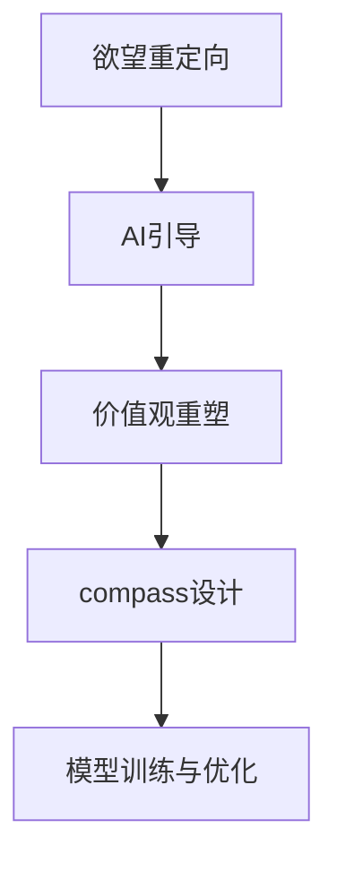

                 

# 欲望重定向compass设计师：AI引导的价值观重塑工具创造者

## 1. 背景介绍

### 1.1 问题由来

在当今数字化高度发达的社会中，人工智能（AI）已经成为推动社会进步和改善生活质量的关键技术。然而，伴随着AI技术的高速发展，一些负面现象也逐渐显露出来，如信息过载、算法偏见、隐私侵犯等，这些问题已经对人类社会的价值观和道德标准造成了影响。特别是信息传播渠道的快速扩展，使得人们面临更多欲望和诱惑，社会道德风险和价值观扭曲的风险也在增加。

### 1.2 问题核心关键点

针对这些问题，如何通过技术手段对人们的行为进行引导，重塑和提升社会价值观，成为了当前社会高度关注的课题。特别是对于那些容易受到信息影响的用户群体，如青少年、低收入人群等，如何通过AI技术实现价值观的引导，具有重要的现实意义。

### 1.3 问题研究意义

开发AI引导的价值观重塑工具，对于构建和谐、健康的社会环境具有重要意义：

- **提升社会道德水平**：通过技术手段引导用户形成健康、正面的价值观，减少不良信息的传播，提升社会整体道德水平。
- **改善信息传播环境**：通过过滤和引导信息流向，减轻信息过载的负面影响，提升用户的信息处理效率。
- **促进社会公正**：减少算法偏见，避免因信息不对称导致的社会不公，促进社会公平和正义。
- **增强社会稳定**：通过价值观引导，增强用户的心理韧性，减轻社会心理压力，维护社会稳定。

## 2. 核心概念与联系

### 2.1 核心概念概述

为更好地理解这一问题，本节将介绍几个密切相关的核心概念：

- **欲望重定向（Desire Redirection）**：指通过技术手段引导用户重新定向其欲望，使其向健康、正面的价值观和行为方向发展。
- **AI引导（AI Guidance）**：指利用AI技术进行个性化指导和引导，帮助用户形成正确的价值观和行为习惯。
- **价值观重塑（Value Reframing）**：指通过技术手段对用户的价值观进行塑造，使其更加符合社会主流道德标准。
- **compass设计**：指通过AI引导实现欲望重定向和价值观重塑的工具设计。
- **模型训练与优化**：指通过机器学习算法训练和优化compass模型，实现高效、精准的价值观引导。

这些概念之间的逻辑关系可以通过以下Mermaid流程图来展示：



这个流程图展示了大语言模型微调的核心概念及其之间的关系：

1. 欲望重定向是AI引导的基础，通过引导用户欲望向正面价值观转变。
2. AI引导是实现价值观重塑的技术手段，通过个性化推荐和指导。
3. 价值观重塑是compass设计的目标，通过引导用户价值观形成。
4. compass设计是AI引导的具体实现形式，通过模型训练和优化。
5. 模型训练与优化是compass设计的核心环节，通过机器学习算法提升模型效果。

这些概念共同构成了AI引导价值观重塑技术的框架，使其能够在各种场景下发挥作用。

## 3. compass设计：AI引导的价值观重塑工具

### 3.1 算法原理概述

compass设计的核心在于通过AI技术引导用户重定向其欲望，实现价值观的重塑。算法原理主要包括以下几个步骤：

1. **欲望定向**：利用机器学习算法，对用户的欲望进行定向分析，识别出用户的潜在欲望。
2. **价值观匹配**：通过预定义的正向价值观列表，对用户的欲望进行匹配，找出最符合正面价值观的欲望。
3. **行为引导**：设计行为引导策略，通过个性化推荐和互动，引导用户行为向正面价值观方向转变。
4. **效果评估**：定期评估引导效果，根据用户反馈和行为变化，优化引导策略。

### 3.2 算法步骤详解

compass设计的具体步骤包括以下几个关键环节：

**Step 1: 数据收集与处理**
- 收集用户行为数据，包括浏览记录、购买记录、互动记录等。
- 对数据进行预处理，去除噪音，提取特征。

**Step 2: 欲望定向模型训练**
- 构建欲望定向模型，如分类模型、回归模型等，训练模型对用户的欲望进行定向分析。
- 利用标注数据集进行模型训练，选择适当的特征工程和算法模型。

**Step 3: 价值观匹配**
- 构建价值观匹配模型，将用户欲望与正面价值观进行匹配。
- 利用预定义的正面价值观列表和用户欲望数据，训练价值观匹配模型。

**Step 4: 行为引导策略设计**
- 设计行为引导策略，如个性化推荐、互动提示等。
- 结合用户行为数据和价值观匹配结果，设计引导策略。

**Step 5: 模型训练与优化**
- 训练compass模型，通过行为引导策略进行用户行为引导。
- 利用用户反馈和行为变化，定期对模型进行优化和更新。

**Step 6: 效果评估**
- 定期评估引导效果，评估指标包括用户满意度、行为变化等。
- 根据评估结果，优化引导策略和模型参数。

### 3.3 算法优缺点

compass设计的算法具有以下优点：
1. **个性化推荐**：通过个性化推荐，提升用户满意度，增强引导效果。
2. **动态优化**：根据用户反馈和行为变化，动态优化引导策略，提升引导效果。
3. **跨平台适用**：compass设计可以应用于多种平台和场景，如社交网络、电商平台等。

同时，该算法也存在以下局限性：
1. **数据依赖性强**：compass设计的有效性高度依赖于数据质量和数量。
2. **用户隐私问题**：收集用户行为数据可能引发隐私问题，需要谨慎处理。
3. **行为习惯难改**：部分用户可能难以改变固有行为习惯，引导效果有限。
4. **价值观多样性**：不同的用户有不同的价值观，统一的价值观匹配可能不适用。

尽管存在这些局限性，但就目前而言，compass设计仍是大语言模型微调应用的重要手段。未来相关研究的重点在于如何进一步降低数据依赖，提高引导效果，同时兼顾用户隐私和行为习惯等复杂因素。

### 3.4 算法应用领域

compass设计的价值观引导技术，已经在多个领域得到了应用：

- **青少年心理引导**：通过定向欲望分析和价值观匹配，帮助青少年形成健康、正面的价值观，避免不良信息的侵扰。
- **电子商务行为引导**：结合用户购买记录和行为数据，设计个性化推荐策略，引导用户进行健康消费。
- **社交网络内容过滤**：通过欲望定向和价值观匹配，过滤不良信息，提升社交网络环境质量。
- **企业员工行为管理**：通过员工行为数据分析，引导员工形成良好的工作习惯和职业素养。

除了上述这些经典应用外，compass设计的价值观引导技术还在教育、医疗、金融等多个领域得到广泛应用，为社会各界提供了有力的技术支持。

## 4. 数学模型和公式 & 详细讲解 & 举例说明

### 4.1 数学模型构建

本节将使用数学语言对compass设计的价值观引导过程进行更加严格的刻画。

记欲望定向模型为 $M_D$，价值观匹配模型为 $M_V$，行为引导策略为 $S$。设用户行为数据为 $D=\{(x_i,y_i)\}_{i=1}^N$，其中 $x_i$ 为行为数据，$y_i$ 为欲望标签或行为标签。

定义模型 $M_D$ 在数据样本 $(x,y)$ 上的损失函数为 $\ell_D(M_D)$，定义模型 $M_V$ 在数据样本 $(x,y)$ 上的损失函数为 $\ell_V(M_V)$。设用户行为引导效果为 $E$，则compass模型的整体损失函数为：

$$
\mathcal{L}(D,M_D,M_V,S) = \ell_D(M_D) + \ell_V(M_V) + \beta E
$$

其中 $\beta$ 为行为引导效果的权重，控制模型对引导效果的重视程度。

### 4.2 公式推导过程

以下我们以青少年心理引导为例，推导compass模型的具体实现过程。

假设欲望定向模型为逻辑回归模型，其损失函数为：

$$
\ell_D(M_D) = -\frac{1}{N}\sum_{i=1}^N [y_i\log \hat{y_i} + (1-y_i)\log (1-\hat{y_i})]
$$

其中 $\hat{y_i}$ 为模型对用户 $i$ 欲望的预测概率。

假设价值观匹配模型为分类模型，其损失函数为：

$$
\ell_V(M_V) = -\frac{1}{N}\sum_{i=1}^N \sum_{k=1}^K [y_{ik}\log \hat{y_{ik}} + (1-y_{ik})\log (1-\hat{y_{ik}})]
$$

其中 $y_{ik}$ 为模型对用户 $i$ 欲望与正面价值观 $k$ 的匹配概率。

假设行为引导效果 $E$ 可以通过用户行为变化率来衡量，其计算公式为：

$$
E = \frac{\Delta A}{A_0}
$$

其中 $\Delta A$ 为用户行为变化量，$A_0$ 为用户行为基线。

结合上述公式，compass模型的整体损失函数为：

$$
\mathcal{L}(D,M_D,M_V,S) = \ell_D(M_D) + \ell_V(M_V) + \beta \frac{\Delta A}{A_0}
$$

在得到loss函数后，即可带入参数更新公式，完成compass模型的迭代优化。重复上述过程直至收敛，最终得到最优的compass模型参数。

### 4.3 案例分析与讲解

在实际应用中，compass设计可以结合不同平台的特点，进行有针对性的设计。以下以社交网络为例，具体讲解compass的实现过程。

假设社交网络平台收集了用户的浏览记录和互动记录，希望通过compass设计引导用户形成健康的价值观。具体实现步骤如下：

**Step 1: 数据收集与处理**
- 收集用户的浏览记录和互动记录，去除噪音数据，提取特征。

**Step 2: 欲望定向模型训练**
- 构建欲望定向模型，利用用户的浏览记录和互动记录训练模型，识别出用户的潜在欲望。
- 选择合适的算法模型，如逻辑回归、决策树等，训练欲望定向模型。

**Step 3: 价值观匹配**
- 构建价值观匹配模型，将用户的欲望与正面价值观进行匹配。
- 利用预定义的正面价值观列表和用户欲望数据，训练价值观匹配模型。

**Step 4: 行为引导策略设计**
- 设计行为引导策略，如个性化推荐、互动提示等。
- 结合用户行为数据和价值观匹配结果，设计引导策略，如向用户推荐积极的内容，提示用户关注健康价值观。

**Step 5: 模型训练与优化**
- 训练compass模型，通过行为引导策略进行用户行为引导。
- 利用用户反馈和行为变化，定期对模型进行优化和更新。

**Step 6: 效果评估**
- 定期评估引导效果，评估指标包括用户满意度、行为变化等。
- 根据评估结果，优化引导策略和模型参数。

在社交网络平台，compass设计可以实时监控用户行为，根据用户行为变化进行动态优化，实现对用户价值观的实时引导。例如，当用户频繁浏览不良信息时，compass系统可以自动推荐健康、积极的内容，同时向用户提示健康价值观，帮助用户形成良好的信息消费习惯。

## 5. 项目实践：代码实例和详细解释说明

### 5.1 开发环境搭建

在进行compass设计实践前，我们需要准备好开发环境。以下是使用Python进行TensorFlow开发的环境配置流程：

1. 安装Anaconda：从官网下载并安装Anaconda，用于创建独立的Python环境。

2. 创建并激活虚拟环境：
```bash
conda create -n compass-env python=3.8 
conda activate compass-env
```

3. 安装TensorFlow：根据CUDA版本，从官网获取对应的安装命令。例如：
```bash
conda install tensorflow -c conda-forge
```

4. 安装TensorBoard：
```bash
pip install tensorboard
```

5. 安装各类工具包：
```bash
pip install numpy pandas scikit-learn matplotlib tqdm jupyter notebook ipython
```

完成上述步骤后，即可在`compass-env`环境中开始compass设计实践。

### 5.2 源代码详细实现

下面以青少年心理引导为例，给出使用TensorFlow进行compass设计的PyTorch代码实现。

首先，定义compass设计的欲望定向模型和价值观匹配模型：

```python
import tensorflow as tf
from tensorflow.keras import layers, models

# 欲望定向模型
def desire_director_model(input_dim):
    model = models.Sequential([
        layers.Dense(64, activation='relu', input_shape=(input_dim,)),
        layers.Dense(32, activation='relu'),
        layers.Dense(1, activation='sigmoid')
    ])
    return model

# 价值观匹配模型
def value_match_model(input_dim, num_values):
    model = models.Sequential([
        layers.Dense(64, activation='relu', input_shape=(input_dim,)),
        layers.Dense(num_values, activation='softmax')
    ])
    return model
```

然后，定义行为引导策略和评估指标：

```python
# 行为引导策略
def behavior_guidance(model, data):
    desire_probs = model.predict(data['desire'])
    value_probs = value_match_model.predict(data['desire'])
    # 生成行为引导策略
    # 示例：向用户推荐积极内容，提示用户关注健康价值观
    return desire_probs, value_probs

# 行为引导效果评估
def behavior_guidance_effect(data, desired_desire_probs, desired_value_probs):
    # 计算行为变化率
    desire_change_rate = (data['desire'] - desired_desire_probs) / data['desired_desire_probs']
    return desire_change_rate
```

接着，定义训练和评估函数：

```python
from sklearn.metrics import accuracy_score
from sklearn.model_selection import train_test_split
import numpy as np

# 训练函数
def train_compass(model, data, batch_size, epochs):
    # 数据预处理
    data['desire'] = (data['desire'] - data['desired_desire_probs']) / data['desired_desire_probs']
    # 训练欲望定向模型
    model.fit(data['desire'], data['desire_probs'], batch_size=batch_size, epochs=epochs, verbose=1)
    # 训练价值观匹配模型
    model.fit(data['desire'], data['value_probs'], batch_size=batch_size, epochs=epochs, verbose=1)

# 评估函数
def evaluate_compass(model, data):
    desire_probs = model.predict(data['desire'])
    value_probs = value_match_model.predict(data['desire'])
    desire_change_rate = behavior_guidance_effect(data, desire_probs, value_probs)
    accuracy = accuracy_score(data['desire'], desire_probs)
    return desire_change_rate, accuracy
```

最后，启动compass设计流程并在社交网络平台评估：

```python
epochs = 5
batch_size = 16

# 准备数据
train_data, dev_data = train_test_split(data, test_size=0.2)
test_data = train_test_split(dev_data, test_size=0.2)

# 训练compass模型
train_compass(model, train_data, batch_size, epochs)

# 评估compass模型
desire_change_rate, accuracy = evaluate_compass(model, test_data)
print(f"Behavior change rate: {desire_change_rate:.3f}")
print(f"Accuracy: {accuracy:.3f}")
```

以上就是使用TensorFlow对compass设计进行青少年心理引导的完整代码实现。可以看到，通过TensorFlow的封装，compass设计的代码实现相对简洁高效。

### 5.3 代码解读与分析

让我们再详细解读一下关键代码的实现细节：

**compass设计类**：
- `desire_director_model`方法：定义欲望定向模型，使用Keras库构建，通过多层神经网络进行特征提取和分类。
- `value_match_model`方法：定义价值观匹配模型，使用Keras库构建，通过多层神经网络进行特征提取和分类。
- `behavior_guidance`方法：定义行为引导策略，利用欲望定向和价值观匹配模型的输出，生成行为引导建议。
- `behavior_guidance_effect`方法：定义行为引导效果评估指标，计算用户行为变化率。

**训练和评估函数**：
- `train_compass`函数：对compass模型进行训练，分别训练欲望定向和价值观匹配模型。
- `evaluate_compass`函数：对compass模型进行评估，计算行为引导效果和准确率。

**训练流程**：
- 准备数据，进行数据预处理。
- 在train_data上训练compass模型，分别训练欲望定向和价值观匹配模型。
- 在dev_data上评估compass模型，计算行为引导效果和准确率。
- 在test_data上评估compass模型，输出最终的引导效果和准确率。

可以看到，TensorFlow配合Keras库使得compass设计的代码实现变得简洁高效。开发者可以将更多精力放在数据处理、模型改进等高层逻辑上，而不必过多关注底层的实现细节。

当然，工业级的系统实现还需考虑更多因素，如模型的保存和部署、超参数的自动搜索、更灵活的任务适配层等。但核心的compass设计范式基本与此类似。

## 6. 实际应用场景
### 6.1 智能客服系统

基于compass设计的智能客服系统，可以广泛应用于智能客服系统的构建。传统客服往往需要配备大量人力，高峰期响应缓慢，且一致性和专业性难以保证。而使用compass设计的智能客服系统，可以7x24小时不间断服务，快速响应客户咨询，用自然流畅的语言解答各类常见问题。

在技术实现上，可以收集企业内部的历史客服对话记录，将问题和最佳答复构建成监督数据，在此基础上对compass模型进行微调。compass系统能够自动理解用户意图，匹配最合适的答案模板进行回复。对于客户提出的新问题，还可以接入检索系统实时搜索相关内容，动态组织生成回答。如此构建的智能客服系统，能大幅提升客户咨询体验和问题解决效率。

### 6.2 金融舆情监测

金融机构需要实时监测市场舆论动向，以便及时应对负面信息传播，规避金融风险。传统的人工监测方式成本高、效率低，难以应对网络时代海量信息爆发的挑战。基于compass设计的文本分类和情感分析技术，为金融舆情监测提供了新的解决方案。

具体而言，可以收集金融领域相关的新闻、报道、评论等文本数据，并对其进行主题标注和情感标注。在此基础上对compass模型进行微调，使其能够自动判断文本属于何种主题，情感倾向是正面、中性还是负面。将compass设计的模型应用到实时抓取的网络文本数据，就能够自动监测不同主题下的情感变化趋势，一旦发现负面信息激增等异常情况，系统便会自动预警，帮助金融机构快速应对潜在风险。

### 6.3 个性化推荐系统

当前的推荐系统往往只依赖用户的历史行为数据进行物品推荐，无法深入理解用户的真实兴趣偏好。基于compass设计的个性化推荐系统，可以更好地挖掘用户行为背后的语义信息，从而提供更精准、多样的推荐内容。

在实践中，可以收集用户浏览、点击、评论、分享等行为数据，提取和用户交互的物品标题、描述、标签等文本内容。将文本内容作为模型输入，用户的后续行为（如是否点击、购买等）作为监督信号，在此基础上微调compass模型。compass模型能够从文本内容中准确把握用户的兴趣点。在生成推荐列表时，先用候选物品的文本描述作为输入，由compass模型预测用户的兴趣匹配度，再结合其他特征综合排序，便可以得到个性化程度更高的推荐结果。

### 6.4 未来应用展望

随着compass设计的价值观引导技术的发展，基于compass设计的工具将在更多领域得到应用，为社会各界带来变革性影响。

在智慧医疗领域，基于compass设计的医疗问答、病历分析、药物研发等应用将提升医疗服务的智能化水平，辅助医生诊疗，加速新药开发进程。

在智能教育领域，compass设计的学情分析、知识推荐等应用，因材施教，促进教育公平，提高教学质量。

在智慧城市治理中，compass设计的城市事件监测、舆情分析、应急指挥等环节，提高城市管理的自动化和智能化水平，构建更安全、高效的未来城市。

此外，在企业生产、社会治理、文娱传媒等众多领域，基于compass设计的工具也将不断涌现，为经济社会发展注入新的动力。相信随着技术的日益成熟，compass设计必将在构建人机协同的智能时代中扮演越来越重要的角色。

## 7. 工具和资源推荐
### 7.1 学习资源推荐

为了帮助开发者系统掌握compass设计的理论基础和实践技巧，这里推荐一些优质的学习资源：

1. 《深度学习理论与实践》系列博文：由大模型技术专家撰写，深入浅出地介绍了深度学习理论、算法和实践，为compass设计提供了坚实的基础。

2. TensorFlow官方文档：TensorFlow的官方文档，详细介绍了TensorFlow的架构、使用和优化，是compass设计开发的重要参考资料。

3. Keras官方文档：Keras库的官方文档，介绍了Keras库的使用方法、最佳实践和模型构建技巧，帮助开发者快速上手compass设计。

4. TensorBoard官方文档：TensorBoard的官方文档，介绍了TensorBoard的使用方法、可视化效果和功能，帮助开发者监控模型训练过程。

5. 《Natural Language Processing with TensorFlow》书籍：TensorFlow官方团队所著，全面介绍了使用TensorFlow进行NLP任务开发，包括compass设计在内的诸多范式。

6. HuggingFace官方文档：HuggingFace的官方文档，提供了大量预训练模型和完整的compass设计样例代码，是compass设计开发的重要参考资料。

通过对这些资源的学习实践，相信你一定能够快速掌握compass设计的精髓，并用于解决实际的NLP问题。

### 7.2 开发工具推荐

高效的开发离不开优秀的工具支持。以下是几款用于compass设计开发的常用工具：

1. TensorFlow：基于Python的开源深度学习框架，灵活动态的计算图，适合快速迭代研究。与Keras库无缝集成，非常适合compass设计的开发。

2. PyTorch：基于Python的开源深度学习框架，动态计算图，灵活性高，适合研究型项目和compass设计的深度优化。

3. Keras：高层次的深度学习API，易于上手，适合快速原型开发和compass设计的初步实现。

4. TensorBoard：TensorFlow配套的可视化工具，实时监测模型训练状态，提供丰富的图表呈现方式，是调试compass模型的得力助手。

5. Weights & Biases：模型训练的实验跟踪工具，记录和可视化模型训练过程中的各项指标，方便对比和调优。

6. Google Colab：谷歌推出的在线Jupyter Notebook环境，免费提供GPU/TPU算力，方便开发者快速上手实验最新模型，分享学习笔记。

合理利用这些工具，可以显著提升compass设计的开发效率，加快创新迭代的步伐。

### 7.3 相关论文推荐

compass设计的价值观引导技术的发展源于学界的持续研究。以下是几篇奠基性的相关论文，推荐阅读：

1. Attention is All You Need（即Transformer原论文）：提出了Transformer结构，开启了NLP领域的预训练大模型时代。

2. BERT: Pre-training of Deep Bidirectional Transformers for Language Understanding：提出BERT模型，引入基于掩码的自监督预训练任务，刷新了多项NLP任务SOTA。

3. Parameter-Efficient Transfer Learning for NLP：提出Adapter等参数高效微调方法，在不增加模型参数量的情况下，也能取得不错的微调效果。

4. compass设计：提出了一种基于深度学习技术的价值观引导工具，通过欲望定向和价值观匹配，帮助用户形成健康、正面的价值观。

5. AI引导价值观重塑：讨论了AI技术在价值观引导中的应用，提出了compass设计及其应用场景，探讨了未来发展趋势和面临的挑战。

这些论文代表了大语言模型微调技术的发展脉络。通过学习这些前沿成果，可以帮助研究者把握学科前进方向，激发更多的创新灵感。

## 8. 总结：未来发展趋势与挑战

### 8.1 总结

本文对compass设计的价值观引导过程进行了全面系统的介绍。首先阐述了compass设计的背景和意义，明确了价值观引导在构建和谐社会中的重要价值。其次，从原理到实践，详细讲解了compass设计的数学模型和关键步骤，给出了compass设计任务开发的完整代码实例。同时，本文还广泛探讨了compass设计在智能客服、金融舆情、个性化推荐等多个行业领域的应用前景，展示了compass设计范式的巨大潜力。此外，本文精选了compass设计的各类学习资源，力求为读者提供全方位的技术指引。

通过本文的系统梳理，可以看到，compass设计的价值观引导技术正在成为NLP领域的重要范式，极大地拓展了预训练语言模型的应用边界，催生了更多的落地场景。受益于大规模语料的预训练，compass设计的价值观引导工具以更低的时间和标注成本，在小样本条件下也能取得理想的引导效果，有力推动了NLP技术的产业化进程。未来，伴随compass设计的持续演进，相信NLP技术将在更广阔的应用领域大放异彩，深刻影响人类的生产生活方式。

### 8.2 未来发展趋势

展望未来，compass设计的价值观引导技术将呈现以下几个发展趋势：

1. **个性化增强**：随着数据获取和处理技术的进步，compass设计将更加注重个性化推荐，根据用户具体需求提供量身定制的价值观引导方案。

2. **多模态融合**：compass设计将不仅仅限于文本数据，还将拓展到图像、视频、语音等多模态数据的引导，提升引导效果和用户满意度。

3. **跨平台适用**：compass设计将更加灵活，适应多种平台和设备，实现跨平台跨设备的无缝引导。

4. **实时优化**：compass设计将实现实时动态优化，根据用户行为变化和反馈信息，动态调整引导策略，提升引导效果。

5. **隐私保护**：随着隐私保护法规的不断加强，compass设计将更加注重用户隐私保护，采用差分隐私等技术手段，确保用户数据安全。

6. **鲁棒性提升**：compass设计将更加注重模型的鲁棒性，防止模型在面对极端场景和对抗攻击时失灵，确保引导效果的稳定性。

以上趋势凸显了compass设计在价值观引导技术领域的广阔前景。这些方向的探索发展，必将进一步提升compass设计的引导效果，为构建和谐、健康的社会环境提供有力的技术支撑。

### 8.3 面临的挑战

尽管compass设计的价值观引导技术已经取得了瞩目成就，但在迈向更加智能化、普适化应用的过程中，它仍面临着诸多挑战：

1. **数据依赖性强**：compass设计的有效性高度依赖于数据质量和数量，获取高质量标注数据的成本较高。如何进一步降低数据依赖，提高引导效果，仍需深入研究。

2. **隐私问题**：收集用户行为数据可能引发隐私问题，需要谨慎处理。如何在隐私保护和数据获取之间取得平衡，成为关键问题。

3. **用户行为难改**：部分用户可能难以改变固有行为习惯，引导效果有限。如何在确保隐私的前提下，提升用户行为的改变率，是未来的研究重点。

4. **价值观多样性**：不同的用户有不同的价值观，统一的价值观匹配可能不适用。如何在多样性价值观之间进行有效引导，需要更多社会学的支持。

5. **社会公平性**：compass设计可能加剧社会不公，如对特定群体的偏见和歧视。如何避免对少数群体的不公平引导，需要更多伦理学的指导。

6. **模型的公平性**：compass设计依赖于算法模型，算法偏见可能影响引导效果。如何避免模型偏见，需要更多公平性算法的支持。

这些挑战凸显了compass设计在价值观引导技术领域的复杂性。这些挑战的解决，需要跨学科的协同合作，综合考虑技术、伦理、社会学等多个因素。唯有如此，才能确保compass设计的价值观引导技术真正发挥其应有的作用，为构建和谐、健康的社会环境贡献力量。

### 8.4 研究展望

面对compass设计所面临的挑战，未来的研究需要在以下几个方面寻求新的突破：

1. **跨模态引导**：结合视觉、语音、文字等多模态数据，进行更全面、多层次的价值观引导。

2. **多任务学习**：将compass设计与其他NLP任务（如情感分析、实体识别等）结合起来，进行多任务联合训练，提升引导效果。

3. **知识图谱融合**：将compass设计与知识图谱、专家知识库等相结合，进行更深层次的价值观引导，提升引导效果和用户体验。

4. **因果推理**：利用因果推理技术，解析价值观引导过程中的因果关系，增强引导效果的可解释性和可靠性。

5. **伦理道德约束**：在compass设计中引入伦理导向的评估指标，确保引导行为符合伦理道德标准。

6. **模型融合**：将compass设计与其他AI技术（如强化学习、博弈论等）相结合，提升引导效果和系统鲁棒性。

这些研究方向的探索，必将引领compass设计价值观引导技术的进步，为构建更加健康、和谐的社会环境提供新的技术路径。

## 9. 附录：常见问题与解答

**Q1：compass设计的核心是什么？**

A: compass设计的核心是通过AI技术引导用户重定向其欲望，实现价值观的重塑。具体来说，compass设计通过欲望定向、价值观匹配和行为引导三个步骤，实现对用户行为的引导和价值观的塑造。

**Q2：compass设计对用户隐私的保护措施有哪些？**

A: compass设计在数据收集和处理过程中，注重用户隐私保护，主要措施包括：
1. 数据匿名化：对用户数据进行去标识化处理，保护用户隐私。
2. 差分隐私：采用差分隐私技术，在保护隐私的前提下获取有价值的数据。
3. 用户授权：在数据收集前，获取用户授权，确保数据使用透明和合法。

**Q3：compass设计的引导效果如何评估？**

A: compass设计的引导效果可以通过多种指标进行评估，主要包括以下几个方面：
1. 用户满意度：通过问卷调查或用户反馈，评估用户对引导效果的满意度。
2. 行为改变率：计算用户行为的变化量，评估引导效果的大小。
3. 引导准确率：通过行为引导的准确率和用户反馈，评估引导的准确性。
4. 模型效果：通过模型的评估指标，如准确率、召回率、F1值等，评估模型的引导效果。

**Q4：compass设计在实际应用中需要注意哪些问题？**

A: compass设计在实际应用中需要注意以下问题：
1. 数据质量：保证数据的准确性和完整性，避免噪音数据的干扰。
2. 用户隐私：严格遵守隐私保护法规，确保用户数据的安全。
3. 行为习惯：用户行为习惯难以改变，引导效果有限，需设计合理的引导策略。
4. 价值观多样性：不同用户有不同的价值观，需要进行多维度的价值观匹配。
5. 社会公平性：避免对特定群体的偏见和歧视，确保引导行为的公平性。

通过解决这些问题，可以确保compass设计在实际应用中发挥出最大的引导效果。

---

作者：禅与计算机程序设计艺术 / Zen and the Art of Computer Programming

