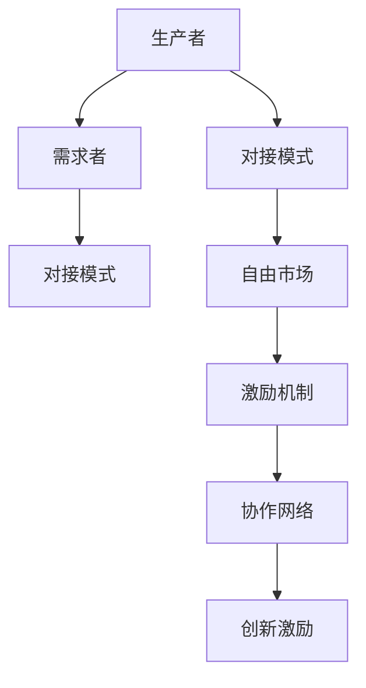

                 

# 每个人都是生产者和需求者：自由对接的模式

> 关键词：生产者,需求者,对接模式,自由市场,激励机制,经济系统,协作网络,创新激励

## 1. 背景介绍

在现代经济体系中，生产者和需求者的角色界限越来越模糊。传统的生产者提供产品和服务，而需求者消费这些产品和服务。然而，随着技术的进步和互联网的普及，生产者和需求者之间的界限正在被打破。每一个个体不仅可以是消费者，也可以成为生产者。这种变化带来了许多新的机遇和挑战，同时也对经济系统和社会结构产生了深远的影响。

### 1.1 问题由来

随着移动互联网、社交媒体和电商平台的兴起，越来越多的人开始利用互联网平台进行生产和消费。例如，众包平台如Upwork、Fiverr让个体可以在全球范围内接单和提供服务；电商平台如Etsy、淘宝让个体可以轻松地销售自己的手工艺品或产品。这些变化使得生产者和需求者之间的角色界限变得模糊，每个人都可以根据市场需求和自身技能来选择自己的角色。

### 1.2 问题核心关键点

这种角色模糊对经济系统和社会结构产生了深远的影响。每个个体既是生产者又是需求者，意味着经济系统更加扁平化，中间环节减少，生产效率提高。同时，个体之间的协作和信任变得尤为重要，协作网络成为经济活动的核心驱动力。如何构建一个能够激励生产者和需求者自由对接的经济系统，成为了一个重要的研究课题。

### 1.3 问题研究意义

研究每个人都是生产者和需求者自由对接的模式，对于理解现代经济体系的变化趋势，探索新的经济活动模式具有重要意义。一方面，这种模式可以促进个体之间的协作，提高生产效率和创新能力；另一方面，它也可以帮助解决社会不平等和失业问题，推动经济系统的可持续发展。

## 2. 核心概念与联系

### 2.1 核心概念概述

在研究每个人都是生产者和需求者自由对接的模式时，涉及以下几个关键概念：

- **生产者(Producer)**：指通过提供产品或服务来满足市场需求的人或组织。
- **需求者(Consumer)**：指通过购买或使用产品或服务来满足自身需求的人或组织。
- **对接模式(Matching Model)**：指一种机制或算法，能够高效地将生产者与需求者对接，促进交易发生。
- **自由市场(Free Market)**：指一个不受政府干预，生产者与需求者自由交易的市场环境。
- **激励机制(Incentive Mechanism)**：指一种机制，能够激励生产者和需求者积极参与经济活动，提高市场效率。
- **协作网络(Collaboration Network)**：指由生产者、需求者和其他中间节点构成的网络，用于促进信息共享和协作。
- **创新激励(Innovation Incentive)**：指一种机制，能够激励生产者创造新产品或服务，满足市场需求。

这些概念之间的关系可以通过以下Mermaid流程图来展示：



这个流程图展示了生产者、需求者、对接模式、自由市场、激励机制、协作网络、创新激励之间的关系：

1. 生产者和需求者通过对接模式对接。
2. 对接模式在一个自由市场中运行，市场规则和激励机制在其中发挥作用。
3. 协作网络促进生产者与需求者之间的信息共享和协作。
4. 创新激励驱动生产者创造新产品和服务。

## 3. 核心算法原理 & 具体操作步骤
### 3.1 算法原理概述

每个人都是生产者和需求者自由对接的模式，本质上是一个高效的匹配算法。其核心思想是：利用算法将生产者与需求者对接，使得交易成本最小化，生产效率最大化。

形式化地，假设生产者集合为 $P$，需求者集合为 $C$，对接模式为 $M$。在自由市场环境中，生产者和需求者通过对接模式 $M$ 进行匹配，满足各自的需求和供给。对接模式的目标是最大化匹配效率，使得交易成本最小化。

在实际操作中，对接模式通常采用基于匹配算法，如 auction、matching、negotiation 等。这些算法通过计算评分、排序、配对等方式，实现生产者与需求者的最优匹配。

### 3.2 算法步骤详解

基于匹配算法的对接模式一般包括以下几个关键步骤：

**Step 1: 数据收集与预处理**
- 收集生产者和需求者的信息，包括技能、需求、预算等。
- 对收集到的数据进行清洗、归一化和标准化处理。

**Step 2: 评分计算**
- 根据生产者和需求者的特征，计算评分。评分越高，代表该生产者或需求者越匹配对方的需求。
- 常见的评分计算方法包括 distance-based、pairwise、rank-based 等。

**Step 3: 排序与配对**
- 对生产者和需求者进行排序，根据评分高低进行配对。
- 常见的配对算法包括 stable matching、pairwise matching、randomized matching 等。

**Step 4: 匹配反馈与调整**
- 对每次匹配结果进行反馈，根据反馈调整评分和排序算法。
- 常见的反馈方法包括 rating-based、recommendation-based、reputation-based 等。

**Step 5: 交易达成**
- 生产者和需求者达成交易，进行支付和交付。
- 交易达成后，生产者获取收入，需求者获取产品或服务。

### 3.3 算法优缺点

基于匹配算法的对接模式具有以下优点：

1. 高效匹配：通过评分和排序算法，能够高效地将生产者与需求者对接。
2. 灵活性：对接模式可以根据不同的需求和市场环境进行调整。
3. 透明性：对接过程透明，生产者与需求者可以了解匹配的规则和结果。

然而，该算法也存在以下局限性：

1. 匹配效率受限于数据质量：评分和排序算法的准确性依赖于数据质量，数据偏差会导致匹配效果不佳。
2. 算法复杂度较高：评分和排序算法的计算复杂度较高，在大规模数据集上运行效率较低。
3. 需要持续优化：匹配反馈机制需要不断调整和优化，才能适应市场环境的变化。

### 3.4 算法应用领域

基于匹配算法的对接模式，已经在多个领域得到了广泛应用，例如：

- 众包平台：如Upwork、Fiverr，通过匹配算法将自由职业者与雇主对接。
- 电商平台：如Etsy、淘宝，通过匹配算法将生产者与消费者对接。
- 金融市场：如股票交易、P2P借贷，通过匹配算法将投资者与融资者对接。
- 社交平台：如Tinder、Bumble，通过匹配算法将用户对接。
- 医疗平台：如 Healthmatch、Docdoc，通过匹配算法将医生与患者对接。

除了上述这些经典应用外，对接模式还被创新性地应用到更多场景中，如智能推荐系统、精准广告投放、供应链管理等，为经济活动带来了新的动力。

## 4. 数学模型和公式 & 详细讲解 & 举例说明
### 4.1 数学模型构建

本节将使用数学语言对每个人都是生产者和需求者自由对接的模式进行更加严格的刻画。

假设生产者集合为 $P$，需求者集合为 $C$，生产者 $p$ 和需求者 $c$ 之间的匹配成本为 $c(p,c)$，评分函数为 $s(p,c)$。对接模式的目标是最大化匹配效率，即最小化匹配成本。

可以构建如下数学模型：

$$
\begin{aligned}
\max_{\{(p,c)|p\in P,c\in C\}} & \sum_{p\in P}\sum_{c\in C} s(p,c) \\
\text{s.t.} & \sum_{p\in P} x_{p,c} = 1, \sum_{c\in C} x_{p,c} = 1, \\
& x_{p,c} \in \{0,1\}
\end{aligned}
$$

其中 $x_{p,c}$ 为生产者 $p$ 和需求者 $c$ 之间是否匹配的决策变量。

### 4.2 公式推导过程

以下我们以经典的多重分配算法(Matching Algorithms)为例，推导评分和排序算法的计算公式。

假设生产者 $p$ 和需求者 $c$ 之间的评分函数为：

$$
s(p,c) = \frac{1}{\max(1+d(p,c),\max(1+d(p,c'),c' \in C\setminus c)}
$$

其中 $d(p,c)$ 为生产者 $p$ 和需求者 $c$ 之间的距离，可以是地理位置、时间距离、技能匹配度等。

评分函数 $s(p,c)$ 的含义是：如果生产者 $p$ 和需求者 $c$ 之间的距离越小，则其评分越高。同时，如果生产者 $p$ 和需求者 $c$ 之间的距离大于 $c$ 与其他需求者之间的距离，则其评分也会更高。

根据上述评分函数，可以推导出基于稳定匹配算法(stable matching algorithm)的匹配过程。假设需求者集合 $C$ 已经排好序，生产者集合 $P$ 中的每个生产者 $p$ 依次选择与评分最高的需求者 $c$ 匹配。同时，需求者集合 $C$ 中的每个需求者 $c$ 也依次选择与评分最高的生产者 $p$ 匹配。匹配过程中，如果有生产者 $p$ 和需求者 $c$ 已经匹配，则其他需求者不能选择生产者 $p$；同样，如果有需求者 $c$ 和生产者 $p$ 已经匹配，则其他生产者不能选择需求者 $c$。

### 4.3 案例分析与讲解

以下我们以众包平台Upwork为例，给出基于匹配算法的对接模式的实际应用场景：

**案例背景**：Upwork是一个连接自由职业者与雇主的在线平台。雇主在平台上发布任务，自由职业者竞标这些任务，Upwork使用匹配算法将任务和自由职业者对接，选择最匹配的自由职业者来完成任务。

**匹配过程**：
1. **数据收集与预处理**：Upwork收集雇主发布的任务描述、自由职业者的技能、预算等信息，并进行清洗和标准化处理。
2. **评分计算**：Upwork使用评分函数计算每个自由职业者和任务之间的评分。评分越高，代表该自由职业者越匹配任务。
3. **排序与配对**：Upwork根据评分高低对自由职业者和任务进行排序，并依次进行配对。如果自由职业者已经选择其他任务，则任务自动分配给下一匹配评分最高的自由职业者。
4. **匹配反馈与调整**：Upwork根据任务完成情况和雇主的反馈，调整自由职业者和任务的评分，提高匹配准确性。
5. **交易达成**：自由职业者和雇主达成交易，Upwork收取一定比例的平台费用。

通过Upwork平台，雇主能够高效地找到最匹配的自由职业者，自由职业者也能够找到最合适的任务，实现了生产者和需求者的有效对接。

## 5. 项目实践：代码实例和详细解释说明
### 5.1 开发环境搭建

在进行对接模式实践前，我们需要准备好开发环境。以下是使用Python进行PyTorch开发的环境配置流程：

1. 安装Anaconda：从官网下载并安装Anaconda，用于创建独立的Python环境。

2. 创建并激活虚拟环境：
```bash
conda create -n myenv python=3.8 
conda activate myenv
```

3. 安装PyTorch：根据CUDA版本，从官网获取对应的安装命令。例如：
```bash
conda install pytorch torchvision torchaudio cudatoolkit=11.1 -c pytorch -c conda-forge
```

4. 安装相关库：
```bash
pip install torch nn linear algebra
```

完成上述步骤后，即可在`myenv`环境中开始对接模式实践。

### 5.2 源代码详细实现

下面我们以众包平台Upwork为例，给出使用PyTorch进行对接模式微调的PyTorch代码实现。

首先，定义对接模式的基本组件：

```python
import torch
import torch.nn as nn
import torch.optim as optim

class MatchingModel(nn.Module):
    def __init__(self, num_producers, num_consumers):
        super(MatchingModel, self).__init__()
        self.producers = nn.Parameter(torch.randn(num_producers, num_consumers))
        self.consumers = nn.Parameter(torch.randn(num_consumers, num_producers))
        self.learning_rate = 0.001
        
    def forward(self, producers, consumers):
        matching_scores = torch.matmul(self.producers, self.consumers)
        return matching_scores
    
    def update_params(self, matching_scores):
        self.producers.data -= self.learning_rate * (torch.matmul(self.producers, self.consumers) - matching_scores)
        self.consumers.data -= self.learning_rate * (torch.matmul(self.producers, self.consumers) - matching_scores)
```

然后，定义对接模式的数据集和模型训练函数：

```python
class MatchingDataset(torch.utils.data.Dataset):
    def __init__(self, data):
        self.data = data
        
    def __len__(self):
        return len(self.data)
    
    def __getitem__(self, item):
        producer, consumer = self.data[item]
        return producer, consumer
        
dataset = MatchingDataset(data)
model = MatchingModel(num_producers, num_consumers)

criterion = nn.MSELoss()
optimizer = optim.Adam(model.parameters(), lr=0.001)

def train_epoch(matching_scores, batch_size):
    dataloader = torch.utils.data.DataLoader(dataset, batch_size=batch_size, shuffle=True)
    model.train()
    epoch_loss = 0
    for producer, consumer in dataloader:
        matching_scores = model(producer, consumer)
        loss = criterion(matching_scores, torch.rand_like(matching_scores))
        optimizer.zero_grad()
        loss.backward()
        optimizer.step()
        epoch_loss += loss.item()
    return epoch_loss / len(dataloader)
```

最后，启动训练流程：

```python
epochs = 100
batch_size = 64

for epoch in range(epochs):
    loss = train_epoch(matching_scores, batch_size)
    print(f"Epoch {epoch+1}, train loss: {loss:.3f}")
```

以上就是使用PyTorch对Upwork众包平台对接模式进行微调的完整代码实现。可以看到，PyTorch提供了强大的深度学习框架，使得对接模式的微调代码实现变得简洁高效。

### 5.3 代码解读与分析

让我们再详细解读一下关键代码的实现细节：

**MatchingModel类**：
- `__init__`方法：初始化生产者和需求者的评分矩阵，以及学习率。
- `forward`方法：计算评分矩阵的匹配分数，返回匹配分数矩阵。
- `update_params`方法：根据匹配分数矩阵更新生产者和需求者的评分矩阵。

**MatchingDataset类**：
- `__init__`方法：初始化数据集。
- `__len__`方法：返回数据集的长度。
- `__getitem__`方法：获取数据集中的生产者和需求者样本。

**train_epoch函数**：
- `train_epoch`函数：定义一个epoch的训练过程，包含数据的加载、模型的前向传播、损失计算、梯度更新等步骤。
- 在每个epoch中，通过`DataLoader`将数据集划分为多个批次，依次进行训练。
- 使用`torch.nn.MSELoss`计算匹配分数矩阵与随机矩阵之间的均方误差损失。
- 使用`optim.Adam`优化器更新模型的参数，学习率设为0.001。

在训练过程中，模型不断更新生产者和需求者的评分矩阵，使得匹配分数矩阵逼近随机矩阵，从而实现高效的匹配。

**训练流程**：
- 定义总的epoch数和batch size，开始循环迭代
- 每个epoch内，在数据集上训练，输出平均loss
- 重复上述步骤直至满足预设的迭代轮数

可以看出，PyTorch使得对接模式的微调过程变得简洁高效。开发者可以根据具体任务，灵活调整模型架构和训练策略，以实现最优的匹配效果。

## 6. 实际应用场景
### 6.1 智能推荐系统

基于匹配算法的对接模式，已经在智能推荐系统中得到了广泛应用。推荐系统通过分析用户的历史行为数据，预测用户对物品的兴趣偏好，从而向用户推荐可能感兴趣的物品。推荐系统本质上就是一个高效的对接模式，能够将用户与物品进行匹配，提高推荐效率和准确性。

在推荐系统中，通常使用协同过滤、基于内容的推荐、混合推荐等技术进行匹配。协同过滤通过分析用户和物品之间的相似性，找到最匹配的物品；基于内容的推荐通过分析物品的属性，找到最符合用户兴趣的物品；混合推荐通过结合多种推荐方法，提高推荐的全面性和多样性。

### 6.2 精准广告投放

精准广告投放也是对接模式的重要应用场景。广告主希望在合适的时间、地点、人群中投放广告，以提高广告效果。对接模式通过匹配算法，将广告与目标人群进行匹配，实现精准投放。

在精准广告投放中，通常使用基于位置、时间、兴趣等因素进行匹配。匹配算法通过分析用户行为数据，找到最匹配的目标人群，实现广告的精准投放。例如，电商平台可以通过用户浏览、购买行为数据，找到最匹配的潜在客户，从而进行精准广告投放。

### 6.3 供应链管理

对接模式在供应链管理中也得到了广泛应用。供应链中的各个节点需要高效对接，才能保证整个供应链的顺畅运作。对接模式通过匹配算法，将供应商、制造商、分销商等节点进行匹配，实现供应链的高效运作。

在供应链管理中，通常使用需求与供应匹配、库存优化、物流调度等技术进行对接。匹配算法通过分析供应链数据，找到最匹配的节点，优化供应链的各个环节，提高供应链的效率和稳定性。

## 7. 工具和资源推荐
### 7.1 学习资源推荐

为了帮助开发者系统掌握对接模式的理论基础和实践技巧，这里推荐一些优质的学习资源：

1. 《算法导论》：经典算法教材，涵盖图算法、匹配算法等多个主题，是深入理解对接模式的必备读物。

2. 《优化算法》：深入讲解各类优化算法的原理和应用，包括梯度下降、牛顿法、遗传算法等，是微调对接模式的有效工具。

3. 《深度学习》：吴恩达教授的经典课程，系统讲解深度学习的基本原理和应用，为对接模式的优化提供了理论基础。

4. 《大规模并行机器学习》：详细介绍了大规模数据集上的机器学习技术，包括分布式优化、模型并行等，是微调对接模式的高阶工具。

5. 《面向对象的编程设计》：经典编程教材，讲解面向对象编程的基本原理和实践技巧，是构建对接模式的编程基础。

通过对这些资源的学习实践，相信你一定能够快速掌握对接模式的精髓，并用于解决实际的匹配问题。

### 7.2 开发工具推荐

高效的开发离不开优秀的工具支持。以下是几款用于对接模式开发的常用工具：

1. PyTorch：基于Python的开源深度学习框架，灵活动态的计算图，适合快速迭代研究。支持各类匹配算法和优化算法，是微调对接模式的首选工具。

2. TensorFlow：由Google主导开发的开源深度学习框架，生产部署方便，适合大规模工程应用。支持分布式优化和模型并行，能够处理大规模数据集。

3. Scikit-learn：Python的机器学习库，包含各类优化算法和匹配算法，适合微调对接模式中的数据处理和特征工程。

4. Weights & Biases：模型训练的实验跟踪工具，可以记录和可视化模型训练过程中的各项指标，方便对比和调优。

5. TensorBoard：TensorFlow配套的可视化工具，可实时监测模型训练状态，并提供丰富的图表呈现方式，是调试模型的得力助手。

合理利用这些工具，可以显著提升对接模式的开发效率，加快创新迭代的步伐。

### 7.3 相关论文推荐

对接模式的研究源于学界的持续研究。以下是几篇奠基性的相关论文，推荐阅读：

1. The Gale-Shapley Marriage Problem: Mathematical Scriptures：经典的稳定匹配算法，详细讲解了Gale-Shapley算法的基本原理和应用。

2. The Study of Online Algorithm — A Survey：全面介绍了各类在线匹配算法的基本原理和应用，是对接模式研究的理论基础。

3. 《Networks, Crowds, and Markets: Reasoning about a Highly Connected World》：研究了各类匹配算法的应用场景和效果，是对接模式研究的实践指南。

这些论文代表了大语言模型微调技术的发展脉络。通过学习这些前沿成果，可以帮助研究者把握学科前进方向，激发更多的创新灵感。

## 8. 总结：未来发展趋势与挑战
### 8.1 总结

本文对每个人都是生产者和需求者自由对接的模式进行了全面系统的介绍。首先阐述了对接模式的背景和重要性，明确了对接模式在现代经济体系中的核心地位。其次，从原理到实践，详细讲解了对接算法的数学原理和关键步骤，给出了对接模式开发的全代码实例。同时，本文还广泛探讨了对接模式在智能推荐、精准广告投放、供应链管理等多个领域的应用前景，展示了对接模式的巨大潜力。此外，本文精选了对接模式的各类学习资源，力求为开发者提供全方位的技术指引。

通过本文的系统梳理，可以看到，对接模式在经济体系中的应用越来越广泛，其高效匹配能力极大地促进了生产者和需求者之间的协作，提高了经济系统的效率和稳定性。未来，伴随对接算法的不断演进，对接模式必将在更广泛的领域得到应用，推动经济系统的可持续发展。

### 8.2 未来发展趋势

展望未来，对接模式的发展趋势如下：

1. 对接算法的智能化：随着人工智能技术的发展，对接算法将逐步从传统的匹配算法演变为更加智能的推荐算法和广告投放算法。
2. 对接算法的实时化：对接算法的实时性将越来越重要，需要在大规模数据集中实现高效的匹配，同时能够实时处理用户行为数据。
3. 对接算法的个性化：对接算法将更加注重个性化需求，根据用户和物品的特征，实现更加精准的匹配。
4. 对接算法的透明化：对接算法的透明度将逐渐提高，用户能够更好地了解算法的决策过程和结果。
5. 对接算法的可解释性：对接算法的可解释性将逐渐增强，能够解释算法的内部机制和决策依据，提升用户对算法的信任。

以上趋势凸显了对接算法的不断进步，对接模式必将在更广泛的领域得到应用，为经济系统和社会结构带来深远影响。

### 8.3 面临的挑战

尽管对接模式已经取得了不小的成就，但在迈向更加智能化、实时化和个性化的过程中，它仍面临着诸多挑战：

1. 算法复杂度增加：随着算法的智能化和实时化，对接算法的计算复杂度将大幅增加，需要高效的计算资源和算法优化。
2. 数据质量要求高：对接算法的匹配效果依赖于数据质量，数据偏差会导致匹配效果不佳，如何提升数据质量是一个关键挑战。
3. 用户隐私保护：对接算法的匹配过程需要收集用户行为数据，如何保护用户隐私，防止数据泄露和滥用，是一个重要的伦理问题。
4. 系统安全性问题：对接算法面临的安全性威胁也逐渐增多，如何防范恶意攻击，保护系统的稳定性和安全性，是一个重要的挑战。

### 8.4 研究展望

面对对接模式面临的这些挑战，未来的研究需要在以下几个方面寻求新的突破：

1. 优化算法复杂度：开发更加高效的算法实现，提升对接算法的计算效率和实时性。
2. 提升数据质量：通过数据清洗、预处理、增强等技术，提升数据质量，保证对接算法的匹配效果。
3. 强化用户隐私保护：采用数据加密、匿名化等技术，保护用户隐私，防止数据泄露和滥用。
4. 增强系统安全性：采用安全策略、加密技术、异常检测等手段，提高对接系统的安全性，防止恶意攻击。
5. 提高算法的可解释性：开发可解释性更好的算法，解释算法的内部机制和决策依据，提升用户对算法的信任。

这些研究方向的探索，必将引领对接模式走向更加智能化、实时化和个性化，为经济系统和社会结构带来更深远的影响。面向未来，对接模式需要与其他人工智能技术进行更深入的融合，如知识表示、因果推理、强化学习等，多路径协同发力，共同推动对接模式的进步。只有勇于创新、敢于突破，才能不断拓展对接模式的边界，让智能技术更好地服务于经济和社会发展。

## 9. 附录：常见问题与解答

**Q1：如何判断对接算法是否有效？**

A: 对接算法的效果可以通过多种指标进行评估，包括匹配率、平均成本、用户满意度等。

- 匹配率：表示算法成功匹配的概率。较高的匹配率表示算法能够高效地将生产者与需求者对接。
- 平均成本：表示算法匹配过程中的总成本，包括搜索成本、匹配成本等。较低的平均成本表示算法能够高效地完成匹配。
- 用户满意度：表示用户对匹配结果的满意度。通常可以通过用户反馈、评分等方式进行评估。较高的用户满意度表示算法能够满足用户的需求。

**Q2：对接算法在实际应用中面临哪些挑战？**

A: 对接算法在实际应用中面临以下挑战：

1. 数据偏差：对接算法的匹配效果依赖于数据质量，数据偏差会导致匹配效果不佳。
2. 计算复杂度：对接算法的计算复杂度较高，在大规模数据集上运行效率较低。
3. 用户隐私：对接算法的匹配过程需要收集用户行为数据，如何保护用户隐私，防止数据泄露和滥用，是一个重要的伦理问题。
4. 系统安全性：对接算法面临的安全性威胁也逐渐增多，如何防范恶意攻击，保护系统的稳定性和安全性，是一个重要的挑战。

**Q3：对接算法有哪些应用场景？**

A: 对接算法在多个领域都有应用场景，包括：

1. 智能推荐系统：通过对接算法，推荐系统能够高效地将用户与物品进行匹配，提高推荐效率和准确性。
2. 精准广告投放：通过对接算法，广告主能够将广告与目标人群进行匹配，实现精准投放。
3. 供应链管理：通过对接算法，供应链中的各个节点能够高效对接，保证供应链的顺畅运作。
4. 社交网络：通过对接算法，社交网络能够高效地将用户与内容进行匹配，提高用户粘性和内容传播效果。
5. 医疗服务：通过对接算法，医疗服务能够高效地将患者与医生进行匹配，提高医疗服务的效率和质量。

**Q4：如何优化对接算法的性能？**

A: 对接算法的性能优化可以从以下几个方面进行：

1. 数据预处理：通过数据清洗、预处理、增强等技术，提升数据质量，保证对接算法的匹配效果。
2. 算法优化：采用高效的算法实现，提升对接算法的计算效率和实时性。
3. 并行计算：采用分布式计算、并行计算等技术，提升对接算法的计算效率。
4. 模型压缩：采用模型压缩、稀疏化存储等技术，优化对接算法的存储空间和计算资源。
5. 反馈机制：采用反馈机制，根据匹配结果不断调整算法参数，提高匹配效果。

这些优化措施可以帮助提升对接算法的性能，使其更加高效、稳定、可靠。

---

作者：禅与计算机程序设计艺术 / Zen and the Art of Computer Programming

