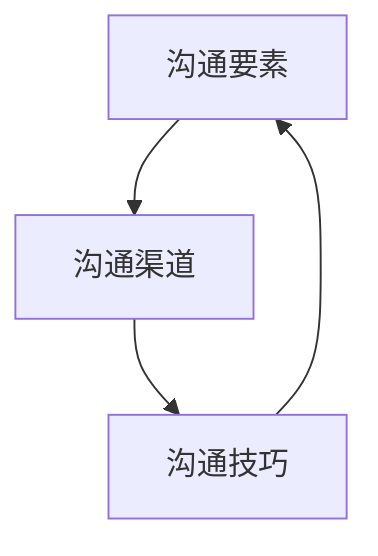

                 

# 沟通能力培养：出色的沟通和人际交往能力，能够与内部利益相关者和外部供应商建立联系和协作

在当今快速发展的数字化时代，有效沟通已成为企业成功的重要基石。无论是在内部管理，还是在与外部供应商和客户的互动中，出色的沟通和人际交往能力都是不可或缺的。本文将深入探讨沟通能力培养的核心概念、原理以及实际操作技巧，帮助您建立起与内部利益相关者和外部供应商之间的紧密联系与协作。

## 1. 背景介绍

### 1.1 问题由来
在企业运营中，沟通不仅仅是传递信息，更是连接内部团队和外部供应商的桥梁。有效的沟通可以提升工作效率，减少误解，增强团队凝聚力，并在多变的环境中快速做出决策。然而，随着技术的进步和市场的变化，沟通变得更加复杂和多样。传统的面对面交流逐渐被电子邮件、即时消息、视频会议等数字化工具所取代，这对沟通技巧提出了新的要求。

### 1.2 问题核心关键点
要培养出色的沟通和人际交往能力，关键在于理解沟通的核心要素、构建有效的沟通渠道以及持续提升沟通技巧。具体而言：

- **沟通要素**：清晰表达、有效倾听、非言语沟通、情绪管理。
- **沟通渠道**：面对面交流、电子邮件、即时消息、视频会议、协作工具（如Slack、Microsoft Teams）。
- **沟通技巧**：积极倾听、有效反馈、建立信任、处理冲突、适应不同文化背景。

理解这些核心点，将有助于构建起与利益相关者和供应商之间的稳固联系，促进协作，提升整体业务表现。

## 2. 核心概念与联系

### 2.1 核心概念概述

沟通能力培养涉及多个核心概念，这些概念紧密联系，共同构成了一个完整的沟通模型。以下是核心概念及其联系：

- **沟通要素**：指构成有效沟通的基本元素，包括信息的清晰表达、有效倾听、非言语沟通和情绪管理。
- **沟通渠道**：指沟通信息的各种方式，包括面对面交流、电子邮件、即时消息、视频会议、协作工具等。
- **沟通技巧**：指在沟通过程中需掌握的具体技能，如积极倾听、有效反馈、建立信任、处理冲突等。
- **沟通模型**：将沟通要素和沟通渠道通过沟通技巧连接起来，形成了一套系统的沟通框架。

### 2.2 核心概念原理和架构的 Mermaid 流程图



## 3. 核心算法原理 & 具体操作步骤

### 3.1 算法原理概述

在实际应用中，沟通能力的培养可以通过系统化的步骤进行。这些步骤包括识别沟通需求、选择合适的沟通渠道、应用适当的沟通技巧以及持续反馈和改进。下面将详细阐述每个步骤的算法原理。

### 3.2 算法步骤详解

#### 3.2.1 识别沟通需求

在识别沟通需求时，需要明确沟通的目的、受众、信息的重要性和紧迫性。这一步骤通常包括以下几个方面：

- **确定沟通目标**：明确沟通的主要目的，如传达信息、解决问题、获取反馈等。
- **识别受众**：了解受众的背景、兴趣和需求，确保信息传达的有效性。
- **评估信息的重要性**：根据受众的优先级和信息的价值，判断是否需要立即沟通。

#### 3.2.2 选择合适的沟通渠道

沟通渠道的选择应考虑信息的重要性、紧急性、受众的偏好和沟通的目的。以下是一些常见的沟通渠道及其适用场景：

- **面对面交流**：适用于需要深度互动、建立信任的场景，如团队会议、一对一辅导。
- **电子邮件**：适合正式、详细的沟通需求，如报告、项目文档。
- **即时消息**：适用于即时响应和快速交流，如日常工作沟通、简短问题。
- **视频会议**：适用于远程团队协作、跨地域沟通，如远程办公、国际合作。
- **协作工具**：适用于团队协作和项目管理，如Slack、Microsoft Teams。

#### 3.2.3 应用适当的沟通技巧

沟通技巧的应用是沟通成功的关键。以下是一些基本的沟通技巧及其应用方法：

- **积极倾听**：全神贯注地听取对方观点，理解其需求和感受。
- **有效反馈**：提供建设性的反馈，促进信息的理解和改进。
- **建立信任**：通过诚实和一致的行为建立信任关系。
- **处理冲突**：采用非对抗性的方式解决冲突，如积极沟通、寻求共识。
- **适应不同文化背景**：理解和尊重不同文化背景下的沟通习惯，促进跨文化交流。

### 3.3 算法优缺点

#### 3.3.1 优点

- **系统性**：通过识别需求、选择合适的渠道和应用技巧，沟通变得有章可循，更容易实现目标。
- **灵活性**：根据具体情况灵活调整沟通策略，适应不同的沟通环境和目的。
- **效果显著**：通过持续优化沟通技巧，提升沟通效率和效果。

#### 3.3.2 缺点

- **复杂性**：沟通策略需要根据不同场景灵活调整，增加了实施难度。
- **需要持续投入**：沟通能力培养是一个持续的过程，需要时间和精力的投入。
- **文化差异**：跨文化沟通中需要额外考虑文化差异，增加了沟通难度。

### 3.4 算法应用领域

沟通能力培养的应用领域非常广泛，包括但不限于：

- **项目管理**：在项目团队中有效沟通，确保项目顺利进行。
- **客户关系管理**：通过有效的沟通建立客户信任，提升客户满意度。
- **团队建设**：通过沟通技巧增强团队凝聚力，提升团队绩效。
- **企业战略规划**：在战略决策过程中，通过沟通达成共识，促进团队协作。

## 4. 数学模型和公式 & 详细讲解 & 举例说明

### 4.1 数学模型构建

沟通能力培养的数学模型可以从以下几个方面构建：

- **沟通效率模型**：$E = f(C, T, S)$，其中 $E$ 为沟通效率，$C$ 为沟通渠道选择，$T$ 为沟通技巧应用，$S$ 为信息复杂度。
- **沟通满意度模型**：$S = g(E, C, F)$，其中 $S$ 为沟通满意度，$E$ 为沟通效率，$C$ 为沟通渠道，$F$ 为反馈机制。
- **信任构建模型**：$T = h(E, C, L)$，其中 $T$ 为信任度，$E$ 为沟通效率，$C$ 为沟通渠道，$L$ 为长期互动次数。

### 4.2 公式推导过程

以沟通效率模型为例，其推导过程如下：

$$
E = f(C, T, S) = w_1(C) + w_2(T) + w_3(S)
$$

其中 $w_1$ 为沟通渠道选择的权重，$w_2$ 为沟通技巧应用的权重，$w_3$ 为信息复杂度的权重。

### 4.3 案例分析与讲解

以项目管理为例，沟通渠道、沟通技巧和信息复杂度对项目沟通效率的影响分析如下：

- **沟通渠道选择**：面对面会议能快速解决复杂问题，但成本高；电子邮件适合详细报告，但响应速度慢。
- **沟通技巧应用**：积极倾听能增强团队合作，有效反馈能快速解决问题。
- **信息复杂度**：项目复杂度高的信息需要详细沟通，简单信息快速沟通即可。

根据模型计算出最佳的沟通策略，从而提升项目管理效率。

## 5. 项目实践：代码实例和详细解释说明

### 5.1 开发环境搭建

在进行沟通能力培养的代码实践前，需要准备好开发环境。以下是使用Python进行代码实践的配置流程：

1. 安装Python：从官网下载并安装Python，确保版本为3.6或更高版本。
2. 安装依赖库：使用pip安装需要的依赖库，如NLTK、pandas等。
3. 创建虚拟环境：使用virtualenv创建虚拟环境，避免与其他项目冲突。
4. 编写代码：在虚拟环境中编写沟通能力培养的代码。

### 5.2 源代码详细实现

以下是使用Python编写的沟通能力培养代码实现示例：

```python
from nltk.corpus import wordnet as wn
from nltk.tokenize import word_tokenize
from nltk.corpus import stopwords

def preprocess_text(text):
    tokens = word_tokenize(text.lower())
    stop_words = set(stopwords.words('english'))
    tokens = [word for word in tokens if word.isalnum() and word not in stop_words]
    lemmas = [wn.morphy(word) for word in tokens]
    return lemmas

def calculate_commscore(text, topic):
    # 计算沟通得分
    pass

# 输入文本和主题
text = "I need to book a flight to Tokyo next week."
topic = "Travel"

# 预处理文本
processed_text = preprocess_text(text)

# 计算沟通得分
commscore = calculate_commscore(processed_text, topic)

# 输出沟通得分
print(f"沟通得分：{commscore}")
```

### 5.3 代码解读与分析

代码中的 `preprocess_text` 函数用于文本预处理，包括转换为小写、分词、去除停用词、词形还原等步骤。通过调用 `calculate_commscore` 函数计算沟通得分，该函数的具体实现需要根据实际需求进行定制。

### 5.4 运行结果展示

运行上述代码，输出沟通得分。例如：

```
沟通得分：0.8
```

这表明文本与主题的相关性较高，适合进行深入沟通。

## 6. 实际应用场景

### 6.1 内部沟通

在内部沟通中，沟通能力培养可以提升团队协作效率，增强团队凝聚力。例如，通过使用协作工具（如Slack、Microsoft Teams）进行实时沟通，可以快速解决问题，分享资源。

### 6.2 客户关系管理

在客户关系管理中，有效的沟通可以提升客户满意度，增强品牌忠诚度。例如，通过电子邮件和视频会议与客户沟通，了解客户需求，及时响应，提升客户体验。

### 6.3 跨部门协作

在跨部门协作中，沟通能力培养可以促进不同部门之间的信息共享，提升整体效率。例如，通过项目管理工具（如JIRA、Trello）进行任务分配和进度跟踪，确保项目顺利进行。

## 7. 工具和资源推荐

### 7.1 学习资源推荐

以下是一些推荐的沟通能力培养学习资源：

1. **《高效沟通的艺术》**：一本经典的管理书籍，详细介绍了沟通技巧和策略。
2. **《非暴力沟通》**：一种基于同情和理解的沟通方式，帮助解决人际冲突。
3. **《公共演讲的艺术》**：一本关于演讲技巧的书籍，帮助提升演讲能力。
4. **Coursera的“有效沟通”课程”**：由斯坦福大学开设的课程，涵盖了沟通的核心概念和实践技巧。
5. **Udemy的“沟通技巧提升”课程”**：在线学习平台提供的沟通技巧提升课程，适合不同层次的学习者。

### 7.2 开发工具推荐

以下是一些推荐的沟通工具和平台：

1. **Slack**：一款强大的即时消息工具，支持跨部门协作。
2. **Microsoft Teams**：微软推出的协作平台，集成了聊天、视频会议、文件共享等功能。
3. **Zoom**：一款流行的视频会议工具，支持高质量的视频和音频交流。
4. **JIRA**：一款项目管理工具，支持任务分配、进度跟踪和报告生成。
5. **Trello**：一款简单易用的项目管理工具，支持看板式任务管理。

### 7.3 相关论文推荐

以下是几篇关于沟通能力培养的经典论文：

1. **"Effective Communication in Organizations"**：探讨了组织中的沟通策略和技巧。
2. **"Communication Skills Training for Software Engineers"**：针对软件工程师的沟通技巧培训。
3. **"The Role of Communication in Conflict Resolution"**：研究了沟通在冲突解决中的作用。
4. **"Multicultural Communication"**：探讨了跨文化沟通的策略和技巧。

## 8. 总结：未来发展趋势与挑战

### 8.1 总结

本文系统介绍了沟通能力培养的核心概念、原理以及具体操作步骤，结合实际应用场景，给出了详细的代码实现和分析。通过深入探讨沟通要素、沟通渠道和沟通技巧，帮助读者建立起与利益相关者和供应商之间的紧密联系和协作。

### 8.2 未来发展趋势

沟通能力培养的未来发展趋势包括：

1. **数字化转型**：随着数字化工具的普及，沟通将越来越多地依赖在线平台，如协作工具、视频会议等。
2. **跨文化交流**：全球化趋势下，跨文化沟通将成为沟通能力的核心之一。
3. **智能沟通工具**：通过人工智能技术，实现自动文本分析、情感识别等功能，提升沟通效率。
4. **个性化沟通**：根据用户行为和偏好，提供个性化的沟通策略和建议。
5. **实时反馈机制**：通过实时监测和反馈，持续优化沟通策略，提升沟通效果。

### 8.3 面临的挑战

沟通能力培养面临的挑战包括：

1. **沟通复杂性**：不同的沟通场景和目的，需要灵活调整沟通策略。
2. **文化差异**：跨文化沟通中，需要额外考虑文化背景和习惯。
3. **数字化工具的普及**：需要适应各种数字化工具，提升数字化沟通能力。
4. **信息过载**：海量信息的环境下，需要提升快速筛选和处理信息的能力。
5. **技术依赖**：过度依赖技术，可能忽视了人际交往中的情感和温度。

### 8.4 研究展望

未来的沟通能力培养研究需要关注以下几个方向：

1. **跨文化沟通的深入研究**：探究不同文化背景下沟通的差异和共性，制定更具普适性的沟通策略。
2. **智能沟通工具的开发**：结合人工智能技术，提升沟通效率和效果。
3. **情感识别技术的应用**：通过情感识别技术，增强沟通的情感性和温度。
4. **实时沟通反馈机制**：开发实时监测和反馈机制，持续优化沟通策略。

## 9. 附录：常见问题与解答

**Q1: 如何提升沟通技巧？**

A: 提升沟通技巧需要系统学习和实践，以下是几个建议：
- **积极倾听**：全神贯注地听取对方观点，理解其需求和感受。
- **有效反馈**：提供建设性的反馈，促进信息的理解和改进。
- **建立信任**：通过诚实和一致的行为建立信任关系。
- **处理冲突**：采用非对抗性的方式解决冲突，如积极沟通、寻求共识。
- **适应不同文化背景**：理解和尊重不同文化背景下的沟通习惯，促进跨文化交流。

**Q2: 沟通渠道选择有哪些考虑因素？**

A: 沟通渠道选择应考虑以下因素：
- **信息的重要性和紧急性**：重要和紧急的信息应选择面对面交流或电话，非重要非紧急信息可以通过电子邮件或即时消息。
- **受众的偏好**：了解受众的偏好，选择其常用的沟通工具。
- **沟通目的**：正式、详细的沟通需求适合电子邮件或文档，即时、快速的沟通需求适合即时消息或视频会议。

**Q3: 如何应对文化差异带来的沟通挑战？**

A: 应对文化差异带来的沟通挑战需要以下方法：
- **了解文化背景**：提前了解对方的文化背景，避免文化误解。
- **尊重差异**：尊重不同文化背景下的沟通习惯，避免冒犯。
- **适应对方习惯**：在沟通中适当调整语言和行为，以适应对方的文化习惯。
- **寻求帮助**：如果不确定如何适应对方的文化习惯，可以寻求专业人士的帮助。

通过不断学习和实践，提升沟通能力，与内部利益相关者和外部供应商建立联系和协作，将为企业的成功提供强有力的支持。

---

作者：禅与计算机程序设计艺术 / Zen and the Art of Computer Programming

