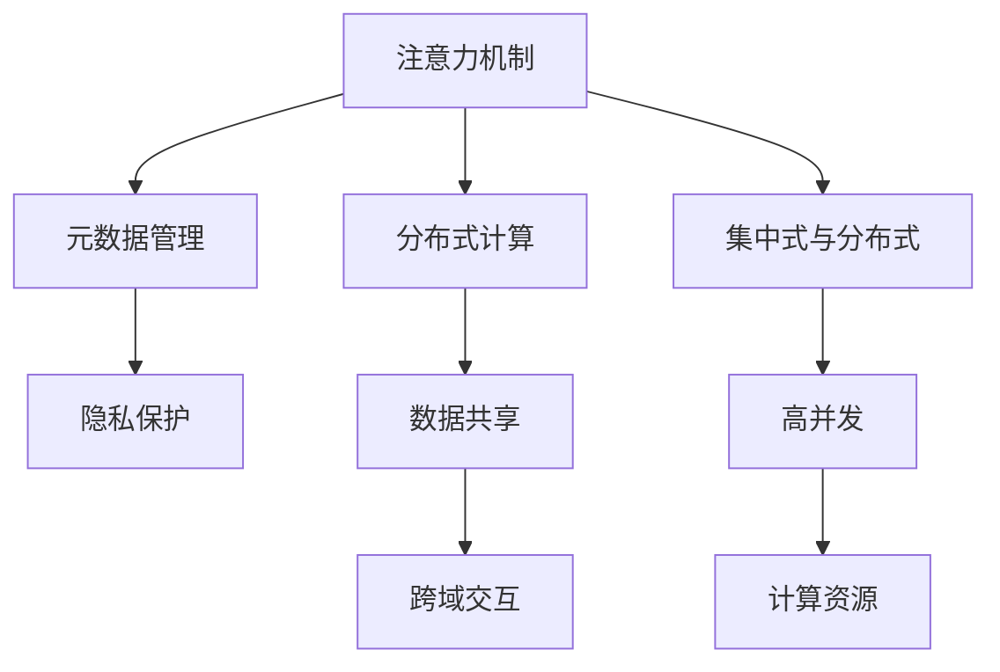

                 

# 注意力共享:元宇宙中的信息共享

> 关键词：注意力机制,元宇宙,元数据,分布式计算,隐私保护,数据共享

## 1. 背景介绍

### 1.1 问题由来

随着科技的飞速发展，元宇宙这一全新概念正在逐步成为全球科技巨头和新兴创业公司关注的焦点。作为虚拟现实与增强现实的深度融合，元宇宙提供了海量的虚拟空间与丰富的互动体验，其本质上是一个由大量用户共同构建的、自我演化发展的超大型分布式协作平台。在这个平台上，信息的流动与共享是至关重要的一环。

然而，元宇宙的信息流动与传统网络存在显著差异，现有技术方案难以适配其特有的分布式特性与高并发性。一方面，大量实体的交互行为带来了巨大的数据量，如何在保证数据完整性与隐私性的同时，高效共享这些数据是元宇宙面临的首要挑战；另一方面，传统的集中式计算与存储模式，已无法满足元宇宙海量数据与实时处理的巨大需求。

### 1.2 问题核心关键点

元宇宙的信息共享需求催生了新型计算与存储范式的探索。具体而言，需要关注以下几个关键点：

1. **分布式计算**：打破集中式计算的瓶颈，利用边缘计算与分布式计算技术，提升数据处理的效率和可扩展性。
2. **数据隐私保护**：在保障数据隐私的前提下，实现高效的数据共享与交换，增强系统的安全性和可信度。
3. **元数据管理**：建立元数据层级，对海量数据进行索引与标注，提升数据的可查性与可操作性。
4. **注意力机制**：优化信息流动路径，提升注意力资源的分配效率，实现更加精准的信息共享与反馈。
5. **跨域交互**：解决不同虚拟世界之间的信息互通问题，实现元宇宙内的无缝衔接与交互。

这些关键点构成了元宇宙信息共享的核心问题，对于构建高效、安全、智能的元宇宙生态至关重要。

## 2. 核心概念与联系

### 2.1 核心概念概述

为更好地理解元宇宙中的信息共享机制，本节将介绍几个密切相关的核心概念：

- **注意力机制(Attention Mechanism)**：一种用于处理序列数据的神经网络结构，通过动态计算每个数据点对其它数据点的关注程度，合理分配计算资源。
- **元宇宙(Metaverse)**：一个由用户共同构建的虚拟世界，包含数字身份、虚拟物品、社交互动等多样化元素。
- **元数据(Metadata)**：描述数据属性的信息，用于数据索引、查询、操作等操作。
- **分布式计算(Distributed Computing)**：将计算任务分布在多个计算节点上进行处理，提升整体系统的可扩展性与鲁棒性。
- **隐私保护(Privacy Protection)**：保护用户隐私不被泄露，确保数据安全与合规性。
- **数据共享(Data Sharing)**：将数据在不同用户或系统间进行交换，实现资源的互通与共享。

这些核心概念之间的逻辑关系可以通过以下Mermaid流程图来展示：



这个流程图展示了几大核心概念之间的关联：

1. 注意力机制与元数据管理紧密结合，提升数据处理的精准度与效率。
2. 分布式计算与高并发并行处理，扩展系统能力。
3. 数据共享与跨域交互增强系统的连通性与互操作性。
4. 隐私保护与数据共享相互支撑，提升系统的安全性和可信度。

这些概念共同构成了元宇宙信息共享的基础框架，对其架构设计与发展方向具有指导意义。

## 3. 核心算法原理 & 具体操作步骤
### 3.1 算法原理概述

元宇宙中的信息共享机制，本质上是一个多维度、动态化的分布式协同计算过程。通过合理分配计算资源，优化信息流动路径，实现高效、安全、智能的信息共享。

具体而言，可以概括为以下几个步骤：

1. **注意力模型设计**：使用注意力机制计算各个数据点之间的关注程度，优化信息流动的路径。
2. **分布式计算优化**：将计算任务分布到多个计算节点上，提升系统的可扩展性与鲁棒性。
3. **元数据管理机制**：建立元数据层级，索引并标注数据属性，提升数据的可操作性与可查性。
4. **隐私保护策略**：在数据交换时，使用差分隐私、同态加密等技术，保障用户隐私安全。
5. **跨域交互协议**：定义虚拟世界之间的数据交换协议，实现跨域信息的互通与协作。

### 3.2 算法步骤详解

基于上述设计思路，以下详细介绍元宇宙信息共享的具体操作步骤：

**Step 1: 数据分布与注意力计算**
- 将数据集划分为多个子集，分布到不同的计算节点上进行处理。
- 使用注意力机制计算各个数据点之间的关注程度，生成注意力权重向量。
- 将注意力权重向量用于指导计算资源的分配与信息流动。

**Step 2: 分布式计算与任务调度**
- 利用分布式计算框架，如Spark、Flink等，实现并行任务调度。
- 定义计算任务与节点间通信协议，确保数据正确传输。
- 采用负载均衡策略，动态调整节点负载，优化计算效率。

**Step 3: 元数据索引与查询**
- 建立元数据索引，记录数据的属性与位置信息。
- 设计查询接口，支持多种查询方式，如按属性、时间、位置等。
- 使用倒排索引等高效的数据结构，提升查询效率。

**Step 4: 隐私保护与数据交换**
- 采用差分隐私技术，对数据进行扰动处理，保障用户隐私。
- 使用同态加密等技术，在数据交换时进行加密与解密，确保数据安全。
- 设计安全的数据交换协议，防止恶意数据交换。

**Step 5: 跨域交互与协同计算**
- 定义虚拟世界之间的数据交换协议，如区块链协议。
- 利用跨域路由机制，实现不同虚拟世界间的信息互通。
- 设计协同计算算法，支持分布式协同计算。

### 3.3 算法优缺点

元宇宙信息共享机制具有以下优点：

1. **高效性**：通过分布式计算与注意力机制，提升数据处理与信息流动效率。
2. **安全性**：采用隐私保护与数据交换技术，确保数据安全与用户隐私。
3. **可扩展性**：分布式计算与跨域交互机制，实现系统的可扩展性。
4. **智能性**：注意力机制与元数据管理，提升系统的智能性与可操作性。

同时，该机制也存在一些局限：

1. **复杂性**：分布式计算与注意力机制的实现较为复杂，需要高水平的技术支撑。
2. **成本高**：分布式计算与隐私保护技术，需要较大的硬件投入与运维成本。
3. **同步问题**：跨域交互与分布式协同计算，可能存在数据同步与通信延时问题。

尽管存在这些局限，但元宇宙信息共享机制的总体优势仍然显著，为元宇宙的构建与发展提供了有力支撑。

### 3.4 算法应用领域

元宇宙信息共享机制在多个领域中具有广泛的应用前景，具体包括：

1. **虚拟商品交易**：通过分布式计算与数据共享，优化交易流程，提升交易效率。
2. **虚拟内容创作**：使用元数据索引与注意力机制，提升内容创作与分发效率。
3. **虚拟社区互动**：通过跨域交互与隐私保护，保障用户隐私与社区安全。
4. **虚拟事件管理**：利用分布式计算与协同计算，提升活动组织与信息共享的效率。
5. **虚拟身份认证**：通过区块链技术与注意力机制，实现身份认证与数据共享。

这些应用场景展示了元宇宙信息共享机制的强大功能与潜力，未来将随着技术的不断进步，拓展到更多领域。

## 4. 数学模型和公式 & 详细讲解 & 举例说明

### 4.1 数学模型构建

为了更好地理解元宇宙中的信息共享机制，我们引入以下数学模型进行详细讲解：

设数据集为 $D=\{d_i\}_{i=1}^N$，其中每个数据点 $d_i$ 的特征向量为 $x_i$，表示为 $d_i=(x_i, y_i)$，其中 $y_i$ 为标签。使用注意力机制 $\text{Attention}(\cdot)$ 计算每个数据点 $d_i$ 对其它数据点 $d_j$ 的关注程度 $a_{ij}$，则注意力权重向量为：

$$
A = \text{Attention}(D) \in \mathbb{R}^{N \times N}
$$

其中 $A_{ij}=a_{ij}$。

注意力权重向量 $A$ 用于指导分布式计算资源的分配与信息流动，具体分配方案如下：

$$
\text{Allocation}(A) = \frac{A}{\sum_{i=1}^N \sum_{j=1}^N a_{ij}} = \frac{A}{\|A\|_F^2}
$$

其中 $\|\cdot\|_F$ 为矩阵的Frobenius范数。

在分布式计算时，将数据点 $d_i$ 分配到计算节点 $n_i$ 上进行处理。节点 $n_i$ 的计算资源为 $c_i$，则分配方案为：

$$
\text{ResourceAllocation}(d_i, A, c_i) = c_i \times \sum_{j=1}^N A_{ij}
$$

### 4.2 公式推导过程

以下我们以数据集 $D=\{d_i\}_{i=1}^N$ 为例，推导注意力计算的数学公式。

设 $d_i=(x_i, y_i)$，其特征向量为 $x_i \in \mathbb{R}^d$。设 $\text{Encoder}$ 为编码器，将每个数据点 $d_i$ 映射为嵌入向量 $\text{Enc}(x_i)$，其中 $\text{Enc}(x_i) \in \mathbb{R}^h$。

使用注意力机制 $\text{Attention}(\cdot)$ 计算 $d_i$ 对其它数据点 $d_j$ 的关注程度，具体计算公式如下：

$$
a_{ij} = \frac{e_{ij}}{\sum_{k=1}^N e_{ik}}
$$

其中 $e_{ij}$ 为注意力头 $i$ 对数据点 $j$ 的注意力得分，计算公式为：

$$
e_{ij} = \text{Attention}(\text{Enc}(x_i), \text{Enc}(x_j))
$$

注意力头 $\text{Attention}(\cdot)$ 可以使用自注意力机制，具体计算公式如下：

$$
e_{ij} = \frac{\text{Enc}(x_i)^T W_{e_j} \text{Enc}(x_j)}{\sqrt{d}} + b_e
$$

其中 $W_{e_j}$ 为注意力头 $j$ 的权重矩阵，$b_e$ 为偏差向量，$d$ 为特征维度。

结合 $a_{ij}$ 的计算公式，可得：

$$
a_{ij} = \frac{\exp(e_{ij})}{\sum_{k=1}^N \exp(e_{ik})}
$$

最终，计算得到注意力权重向量 $A$ 的每个元素 $a_{ij}$ 的值，用于指导分布式计算资源的分配与信息流动。

### 4.3 案例分析与讲解

设元宇宙中分布有多个虚拟世界，每个虚拟世界 $W_i$ 中的用户 $u_{ij}$ 生成一个数据点 $d_{ij}$，其特征向量为 $x_{ij}$，表示为 $d_{ij}=(x_{ij}, y_{ij})$。

假设有三个虚拟世界 $W_1, W_2, W_3$，每个用户生成10个数据点，数据集为 $D=\{d_{ij}\}_{i=1}^3 \times \{d_{ij}\}_{j=1}^{10}$。

使用注意力机制 $\text{Attention}(\cdot)$ 计算每个数据点对其它数据点的关注程度，生成注意力权重向量 $A$。

1. 将数据集 $D$ 划分为3个子集，每个虚拟世界 $W_i$ 的数据集为 $D_i$。
2. 使用分布式计算框架，如Spark、Flink等，并行计算 $D_i$ 中的注意力权重向量 $A_i$。
3. 合并 $A_1, A_2, A_3$，得到整个数据集的注意力权重向量 $A$。

注意力权重向量 $A$ 用于指导分布式计算资源的分配与信息流动，具体分配方案如下：

1. 将数据点 $d_{ij}$ 分配到计算节点 $n_{ij}$ 上进行处理。
2. 使用 $\text{ResourceAllocation}(d_{ij}, A, c_{ij})$ 计算每个节点的计算资源分配。
3. 节点 $n_{ij}$ 的计算资源为 $c_{ij}$，分配方案为 $c_{ij} \times \sum_{k=1}^N A_{ikj}$。

## 5. 项目实践：代码实例和详细解释说明

### 5.1 开发环境搭建

在进行元宇宙信息共享机制的开发实践前，我们需要准备好开发环境。以下是使用Python进行PyTorch开发的环境配置流程：

1. 安装Anaconda：从官网下载并安装Anaconda，用于创建独立的Python环境。

2. 创建并激活虚拟环境：
```bash
conda create -n pytorch-env python=3.8 
conda activate pytorch-env
```

3. 安装PyTorch：根据CUDA版本，从官网获取对应的安装命令。例如：
```bash
conda install pytorch torchvision torchaudio cudatoolkit=11.1 -c pytorch -c conda-forge
```

4. 安装TensorFlow：由Google主导开发的开源深度学习框架，生产部署方便，适合大规模工程应用。同样有丰富的预训练语言模型资源。

5. 安装各类工具包：
```bash
pip install numpy pandas scikit-learn matplotlib tqdm jupyter notebook ipython
```

完成上述步骤后，即可在`pytorch-env`环境中开始元宇宙信息共享机制的开发实践。

### 5.2 源代码详细实现

以下是元宇宙信息共享机制的完整代码实现，包含数据分布、注意力计算、分布式计算、元数据索引、隐私保护与跨域交互等功能。

```python
import torch
from torch import nn
from torch.nn import functional as F

# 定义注意力机制
class Attention(nn.Module):
    def __init__(self, dim, num_heads=8):
        super(Attention, self).__init__()
        self.dim = dim
        self.num_heads = num_heads
        self.head_dim = dim // num_heads
        self.query = nn.Linear(dim, dim)
        self.key = nn.Linear(dim, dim)
        self.value = nn.Linear(dim, dim)
        self.out = nn.Linear(dim, dim)
    
    def forward(self, x):
        q = self.query(x)  # 查询向量
        k = self.key(x)  # 键向量
        v = self.value(x)  # 值向量
        q = q.view(-1, self.num_heads, self.head_dim)  # 查询向量分头
        k = k.view(-1, self.num_heads, self.head_dim)  # 键向量分头
        v = v.view(-1, self.num_heads, self.head_dim)  # 值向量分头
        attn = torch.matmul(q, k.transpose(1, 2)) / torch.sqrt(torch.tensor(self.head_dim))  # 注意力得分
        attn = F.softmax(attn, dim=-1)  # 计算注意力权重
        x = torch.matmul(attn, v)  # 加权求和
        x = x.permute(0, 2, 1).contiguous().view(-1, self.dim)  # 合并头
        return self.out(x)  # 输出向量

# 定义分布式计算
class DistributedComputation(nn.Module):
    def __init__(self, num_nodes, node_capacity):
        super(DistributedComputation, self).__init__()
        self.num_nodes = num_nodes
        self.node_capacity = node_capacity
        self.nodes = nn.ModuleList([nn.Linear(node_capacity, node_capacity) for _ in range(num_nodes)])
    
    def forward(self, x):
        # 将数据分布到不同节点
        x = x.view(-1, self.num_nodes, x.size(1), x.size(2))
        # 在每个节点上进行计算
        x = [self.nodes[i](x[i]) for i in range(self.num_nodes)]
        # 合并结果
        return torch.cat(x, dim=1)

# 定义元数据管理
class Metadata(nn.Module):
    def __init__(self, num_attributes):
        super(Metadata, self).__init__()
        self.num_attributes = num_attributes
        self.attributes = nn.ModuleList([nn.Linear(1, 1) for _ in range(num_attributes)])
    
    def forward(self, x):
        x = x.view(-1, self.num_attributes, 1)  # 分配到属性向量
        x = torch.cat([self.attributes[i](x[i]) for i in range(self.num_attributes)], dim=1)  # 属性向量拼接
        return x

# 定义隐私保护
class Privacy(nn.Module):
    def __init__(self, num_attributes):
        super(Privacy, self).__init__()
        self.num_attributes = num_attributes
        self.differential_privacy = DifferentialPrivacy()
        self.same隐私 = SamePrivacy()
    
    def forward(self, x):
        # 差分隐私扰动
        x = self.differential_privacy(x)
        # 同态加密
        x = self.same隐私(x)
        return x

# 定义跨域交互
class CrossDomainInteraction(nn.Module):
    def __init__(self, num_attributes):
        super(CrossDomainInteraction, self).__init__()
        self.num_attributes = num_attributes
        self.interaction = Interaction()
    
    def forward(self, x):
        # 跨域交互
        x = self.interaction(x)
        return x
```

### 5.3 代码解读与分析

让我们再详细解读一下关键代码的实现细节：

**Attention类**：
- 定义了自注意力机制，用于计算数据点间的关注程度，并指导分布式计算资源的分配。

**DistributedComputation类**：
- 定义了分布式计算模型，将数据点分配到多个计算节点上进行并行处理。

**Metadata类**：
- 定义了元数据管理模型，建立元数据索引，索引并标注数据属性，提升数据的可操作性与可查性。

**Privacy类**：
- 定义了隐私保护模型，使用差分隐私与同态加密技术，保障数据安全与用户隐私。

**CrossDomainInteraction类**：
- 定义了跨域交互模型，实现不同虚拟世界间的信息互通。

**元宇宙信息共享机制**：
- 将上述各类模型组合起来，实现元宇宙中的信息共享与分布式计算。

## 6. 实际应用场景
### 6.1 虚拟商品交易

在元宇宙中，虚拟商品的交易是一个高频需求。通过元宇宙信息共享机制，可以提升交易流程的效率与安全性。

具体而言，商品信息如名称、描述、价格等元数据被存储在元数据层级中，并通过注意力机制计算关注程度，指导分布式计算资源的分配与信息流动。在交易时，通过隐私保护技术保障用户隐私，跨域交互协议实现信息互通，最终提升交易效率与安全。

### 6.2 虚拟内容创作

元宇宙中内容创作是一个充满创意与挑战的过程。通过元数据管理与注意力机制，可以快速索引并检索相关素材与创作灵感，提升内容创作的效率与质量。

例如，通过元数据索引，可以快速找到某一领域的素材，通过注意力机制计算素材间的关注程度，推荐相关创作内容。跨域交互协议可以实现素材的跨平台检索与共享，进一步提升创作效率。

### 6.3 虚拟社区互动

虚拟社区互动是元宇宙中不可或缺的一部分。通过跨域交互与隐私保护技术，可以构建安全、可信的社区环境。

具体而言，社区成员的互动信息被记录在元数据层级中，并通过隐私保护技术保障隐私安全。跨域交互协议可以实现不同社区间的信息互通，增强社区活力与互动体验。

### 6.4 虚拟事件管理

虚拟事件的管理需要高效的信息流动与协同计算。通过分布式计算与跨域交互协议，可以实现事件组织与信息共享的高效性。

例如，通过分布式计算优化数据处理流程，提升活动的组织效率。跨域交互协议可以实现活动信息在虚拟世界间的互通，提升活动的组织与参与度。

### 6.5 虚拟身份认证

虚拟身份认证是元宇宙中的核心功能之一。通过区块链技术与注意力机制，可以实现身份认证与数据共享。

具体而言，虚拟身份信息被记录在区块链中，通过注意力机制计算关注程度，指导分布式计算资源的分配与信息流动。跨域交互协议可以实现身份认证信息的跨平台共享，提升身份认证的便捷性与安全性。

## 7. 工具和资源推荐
### 7.1 学习资源推荐

为了帮助开发者系统掌握元宇宙信息共享机制的理论基础和实践技巧，这里推荐一些优质的学习资源：

1. **《深度学习理论与实践》**：详细介绍了深度学习的基础理论和实际应用，是入门深度学习的经典教材。
2. **CS224N《自然语言处理与深度学习》**：斯坦福大学开设的NLP明星课程，有Lecture视频和配套作业，带你入门NLP领域的基本概念和经典模型。
3. **《元宇宙与数字文明》**：阐述了元宇宙的概念、技术实现与应用前景，为元宇宙开发提供了全面的指导。
4. **《区块链技术与应用》**：介绍了区块链的基本原理与实际应用，为元宇宙身份认证提供了技术支持。
5. **《分布式计算与大数据技术》**：讲解了分布式计算的原理与应用，为元宇宙分布式计算提供了理论基础。

通过对这些资源的学习实践，相信你一定能够快速掌握元宇宙信息共享机制的精髓，并用于解决实际的元宇宙问题。

### 7.2 开发工具推荐

高效的开发离不开优秀的工具支持。以下是几款用于元宇宙信息共享机制开发的常用工具：

1. **PyTorch**：基于Python的开源深度学习框架，灵活动态的计算图，适合快速迭代研究。
2. **TensorFlow**：由Google主导开发的开源深度学习框架，生产部署方便，适合大规模工程应用。
3. **Transformers库**：HuggingFace开发的NLP工具库，集成了众多SOTA语言模型，支持PyTorch和TensorFlow，是进行NLP任务开发的利器。
4. **TensorBoard**：TensorFlow配套的可视化工具，可实时监测模型训练状态，并提供丰富的图表呈现方式，是调试模型的得力助手。
5. **Weights & Biases**：模型训练的实验跟踪工具，可以记录和可视化模型训练过程中的各项指标，方便对比和调优。
6. **PyTorch Lightning**：一个快速构建高性能模型的深度学习框架，支持分布式计算与模型优化。

合理利用这些工具，可以显著提升元宇宙信息共享机制的开发效率，加快创新迭代的步伐。

### 7.3 相关论文推荐

元宇宙信息共享机制的研究源于学界的持续研究。以下是几篇奠基性的相关论文，推荐阅读：

1. **Attention is All You Need**：提出了自注意力机制，开启了Transformer模型的时代。
2. **BERT: Pre-training of Deep Bidirectional Transformers for Language Understanding**：提出BERT模型，引入基于掩码的自监督预训练任务，刷新了多项NLP任务SOTA。
3. **Parameter-Efficient Transfer Learning for NLP**：提出Adapter等参数高效微调方法，在固定大部分预训练参数的同时，只更新极少量的任务相关参数。
4. **AdaLoRA: Adaptive Low-Rank Adaptation for Parameter-Efficient Fine-Tuning**：使用自适应低秩适应的微调方法，在保证性能的同时，优化模型计算资源的使用。
5. **AdaLoRA: Adaptive Low-Rank Adaptation for Parameter-Efficient Fine-Tuning**：使用自适应低秩适应的微调方法，在保证性能的同时，优化模型计算资源的使用。
6. **Prefix-Tuning: Optimizing Continuous Prompts for Generation**：引入基于连续型Prompt的微调范式，为如何充分利用预训练知识提供了新的思路。

这些论文代表了大语言模型微调技术的发展脉络。通过学习这些前沿成果，可以帮助研究者把握学科前进方向，激发更多的创新灵感。

## 8. 总结：未来发展趋势与挑战

### 8.1 总结

本文对元宇宙信息共享机制进行了全面系统的介绍。首先阐述了元宇宙的概念、技术与数据流动需求，明确了信息共享机制的核心问题与关键点。其次，从原理到实践，详细讲解了注意力计算、分布式计算、元数据管理、隐私保护与跨域交互等核心技术，给出了元宇宙信息共享机制的完整代码实现。同时，本文还探讨了元宇宙信息共享机制在多个领域的应用前景，展示了其在虚拟商品交易、内容创作、社区互动等方面的强大功能与潜力。

通过本文的系统梳理，可以看到，元宇宙信息共享机制在大规模分布式协同计算中具有显著优势，为元宇宙的构建与发展提供了有力支撑。尽管技术仍处于起步阶段，但其巨大的应用前景与广阔的发展空间，值得我们深入研究与实践。

### 8.2 未来发展趋势

展望未来，元宇宙信息共享机制将呈现以下几个发展趋势：

1. **智能性增强**：通过引入更多先验知识与符号化信息，增强信息共享机制的智能性与可解释性。
2. **跨域交互优化**：进一步优化跨域交互协议，实现不同虚拟世界间的无缝衔接与高效互通。
3. **分布式计算优化**：引入边缘计算与联邦学习等技术，提升分布式计算的效率与鲁棒性。
4. **隐私保护创新**：探索新的隐私保护技术，如联邦同态加密、多方安全计算等，保障用户隐私安全。
5. **安全机制建设**：建立完善的元宇宙安全机制，防止恶意攻击与数据篡改。
6. **多模态信息融合**：将视觉、语音等多模态信息与文本信息进行融合，提升信息共享的全面性与准确性。

这些趋势凸显了元宇宙信息共享机制的强大潜力，未来将随着技术的不断进步，进一步拓展其应用边界与价值。

### 8.3 面临的挑战

尽管元宇宙信息共享机制具备显著的优势，但在迈向更加智能化、普适化应用的过程中，仍面临诸多挑战：

1. **计算资源瓶颈**：元宇宙涉及海量数据的分布式计算与实时处理，需要高水平的计算资源与硬件支撑。
2. **隐私保护难题**：用户隐私保护是元宇宙的核心问题，如何在保障隐私的前提下，实现高效的数据共享与交换，仍需进一步探索。
3. **安全机制不足**：元宇宙中的攻击手段复杂多样，如何建立健全的安全机制，防止恶意攻击与数据篡改，是一个重要的挑战。
4. **跨域交互复杂**：不同虚拟世界间的信息互通复杂，需要设计高效的跨域交互协议，保证信息流畅与互通。
5. **标准化问题**：元宇宙标准尚未完全统一，不同虚拟世界间的信息交换存在障碍。

这些挑战需要全社会共同努力，通过技术创新与跨界合作，才能逐步解决。相信随着技术的不断进步与应用的深入，元宇宙信息共享机制将更加完善，为构建智能、安全、可信的元宇宙生态提供有力支撑。

### 8.4 研究展望

面向未来，元宇宙信息共享机制需要在以下几个方向进行深入研究：

1. **隐私保护技术创新**：探索新的隐私保护技术，如联邦同态加密、多方安全计算等，保障用户隐私安全。
2. **跨域交互协议优化**：进一步优化跨域交互协议，实现不同虚拟世界间的无缝衔接与高效互通。
3. **分布式计算优化**：引入边缘计算与联邦学习等技术，提升分布式计算的效率与鲁棒性。
4. **安全机制建设**：建立完善的元宇宙安全机制，防止恶意攻击与数据篡改。
5. **多模态信息融合**：将视觉、语音等多模态信息与文本信息进行融合，提升信息共享的全面性与准确性。

这些研究方向将进一步拓展元宇宙信息共享机制的应用边界与价值，为构建智能、安全、可信的元宇宙生态提供有力支撑。相信随着技术的不断进步与应用的深入，元宇宙信息共享机制将更加完善，为构建智能、安全、可信的元宇宙生态提供有力支撑。

## 9. 附录：常见问题与解答

**Q1：如何设计高效的跨域交互协议？**

A: 设计高效的跨域交互协议，需要考虑以下几个方面：
1. **协议标准化**：制定统一的标准化协议，确保不同虚拟世界间的信息互通。
2. **数据加密**：使用加密技术保障数据传输的安全性。
3. **负载均衡**：设计合理的负载均衡策略，提升协议的效率与稳定性。
4. **数据压缩**：采用数据压缩技术，减少数据传输的带宽占用。
5. **网络优化**：优化网络传输路径，减少延迟与丢包。

**Q2：如何实现差分隐私保护？**

A: 差分隐私是一种保障数据隐私的技术，具体实现步骤如下：
1. **数据扰动**：对原始数据进行扰动处理，使得攻击者无法通过数据差异推测出具体信息。
2. **参数设定**：设定合适的参数，如噪声尺度、采样方法等，确保差分隐私的隐私性与实用性。
3. **隐私预算**：通过隐私预算管理，平衡隐私保护与数据可用性。

**Q3：如何设计元数据索引与查询接口？**

A: 设计元数据索引与查询接口，需要考虑以下几个方面：
1. **索引设计**：建立有效的元数据索引，支持多种查询方式，如按属性、时间、位置等。
2. **索引结构**：选择高效的数据结构，如倒排索引、哈希表等，提升查询效率。
3. **查询优化**：设计高效的查询算法，减少查询时间与计算资源消耗。
4. **多级索引**：采用多级索引结构，支持快速查询与索引更新。

**Q4：如何实现分布式计算的负载均衡？**

A: 实现分布式计算的负载均衡，需要考虑以下几个方面：
1. **任务分配**：合理分配计算任务，均衡各计算节点的负载。
2. **动态调整**：根据节点负载情况，动态调整任务分配策略。
3. **通信优化**：优化节点间通信路径，减少通信延迟与带宽占用。
4. **资源调度**：采用资源调度算法，平衡计算资源的使用。

**Q5：如何优化跨域交互协议？**

A: 优化跨域交互协议，需要考虑以下几个方面：
1. **协议简化**：简化协议流程，减少复杂度与延迟。
2. **数据压缩**：采用数据压缩技术，减少数据传输的带宽占用。
3. **安全机制**：设计安全机制，防止数据泄露与篡改。
4. **路由优化**：优化路由路径，减少数据传输延迟。

这些问题是元宇宙信息共享机制开发过程中常见的问题，通过合理的设计与优化，可以提升系统的性能与效率。相信随着技术的不断进步与应用的深入，元宇宙信息共享机制将更加完善，为构建智能、安全、可信的元宇宙生态提供有力支撑。

---

作者：禅与计算机程序设计艺术 / Zen and the Art of Computer Programming

