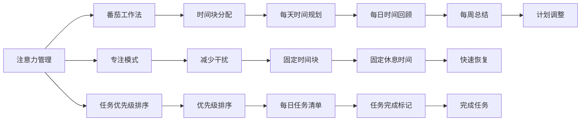

                 

## 1. 背景介绍

### 1.1 问题由来

在信息技术高速发展的今天，人们的生产生活节奏越来越快，时间成为了最宝贵的资源。然而，许多人在日常生活中仍面临时间管理混乱、专注力不足的问题。如何在快节奏的生活中，高效利用时间，实现个人价值和工作效能的最大化，成为了时代亟需解决的难题。

本文旨在通过深入探讨注意力管理与时间管理的内在联系，提出一套系统化、可操作的策略，帮助读者提高时间利用效率，增强专注力和工作效率。

### 1.2 问题核心关键点

1. **注意力管理与时间管理的相互影响**：注意力管理是通过对认知资源的合理分配，确保在特定时间内集中注意力完成任务。时间管理则涉及对时间的合理规划和分配，确保在固定时间内高效完成任务。两者相辅相成，时间管理不当会分散注意力，注意力管理不当会浪费时间。

2. **时间管理与效率的关系**：有效的时间管理能够显著提升工作效率。通过合理规划时间，集中注意力，避免多任务并行处理，可以显著提升工作质量和完成速度。

3. **注意力管理的技巧与工具**：提高注意力管理的关键在于选择合适的技巧和工具，如番茄工作法、专注模式、任务优先级排序等。

4. **时间管理的具体策略**：时间管理策略包括时间块分配、GTD（Getting Things Done）方法、日程安排等。

5. **实践与反馈机制**：有效的实践与反馈机制是保证时间管理策略长期有效的重要保障。

## 2. 核心概念与联系

### 2.1 核心概念概述

**注意力管理**：通过优化工作方式，确保在特定时间内集中注意力，提升工作质量和效率。常见的注意力管理技巧包括番茄工作法、专注模式、任务优先级排序等。

**时间管理**：通过规划和分配时间来确保在固定时间内高效完成任务。常见的时间管理策略包括时间块分配、GTD（Getting Things Done）方法、日程安排等。

**番茄工作法**：一种时间管理技巧，将工作时间分为若干个25分钟的工作时间块，每个时间块之间有5分钟的短暂休息。

**专注模式**：通过关闭不必要的通知和干扰，集中注意力进行工作，提高工作效率。

**GTD（Getting Things Done）**：一种时间管理方法，强调将待办事项记录下来，定期回顾和处理，确保所有任务都在掌控之中。

**任务优先级排序**：根据任务的重要性和紧急性，确定完成任务的先后顺序，确保关键任务优先完成。

### 2.2 核心概念原理和架构的 Mermaid 流程图



这个流程图展示了注意力管理与时间管理的内在联系：

1. 通过番茄工作法（B）和时间块分配（E），确保在工作时间块内集中注意力，高效完成任务。
2. 使用专注模式（C）和减少干扰（F），进一步提升专注度。
3. 任务优先级排序（G）和时间块分配（H），确保关键任务优先完成。
4. 每日时间回顾（K）和每周总结（N），持续优化时间管理策略。

## 3. 核心算法原理 & 具体操作步骤

### 3.1 算法原理概述

注意力管理和时间管理的核心算法原理主要涉及以下几个方面：

1. **注意力集中度提升**：通过番茄工作法和专注模式，在固定时间内集中注意力，提高工作效率。
2. **时间块分配与优先级排序**：根据任务的紧急程度和重要性，合理分配时间，优先处理关键任务。
3. **任务清单管理**：使用GTD方法，将待办事项记录下来，定期回顾和处理，确保所有任务都在掌控之中。

### 3.2 算法步骤详解

#### 步骤一：制定时间管理计划

1. **设定目标**：明确个人或团队的目标和时间要求。
2. **确定任务**：列出需要完成的任务，并评估每项任务的重要性和紧急性。
3. **规划时间块**：根据任务的重要性和紧急性，制定时间块分配计划，确保关键任务优先完成。

#### 步骤二：执行时间管理策略

1. **番茄工作法**：将工作时间分为若干个25分钟的工作时间块，每个时间块之间有5分钟的短暂休息。使用专注模式，关闭不必要的通知和干扰，集中注意力进行工作。
2. **任务优先级排序**：根据任务的紧急程度和重要性，确定完成任务的先后顺序。使用GTD方法，将待办事项记录下来，定期回顾和处理，确保所有任务都在掌控之中。
3. **时间块回顾**：每天结束时，回顾当天的时间块使用情况，评估时间管理的有效性，并进行调整。

#### 步骤三：优化时间管理策略

1. **反馈机制**：根据每日时间回顾和每周总结，持续优化时间管理策略。定期评估时间管理的效果，调整时间块分配和优先级排序。
2. **任务清单管理**：使用任务清单工具，记录和跟踪任务的进展情况，确保所有任务都在掌控之中。
3. **动态调整**：根据任务进展和环境变化，动态调整时间管理策略，确保时间管理始终高效。

### 3.3 算法优缺点

#### 优点：

1. **提高工作效率**：通过合理规划时间，集中注意力，避免多任务并行处理，可以显著提升工作质量和完成速度。
2. **提升专注度**：使用番茄工作法和专注模式，可以有效减少干扰，提高专注度，避免分心。
3. **提高任务管理能力**：通过任务优先级排序和时间块分配，确保关键任务优先完成，提升任务管理能力。

#### 缺点：

1. **灵活性不足**：时间管理策略需要严格执行，灵活性相对较差，可能不适用于所有环境和任务。
2. **依赖于个人自律**：时间管理策略的实施依赖于个人的自律性，难以强制执行。

### 3.4 算法应用领域

**个人时间管理**：适用于个人日常工作的安排，提高工作效能和生产力。

**项目管理**：适用于团队任务和项目的管理，通过合理分配时间和优先级，确保项目按时完成。

**学习时间管理**：适用于学生和教育工作者，通过合理规划学习时间和任务，提高学习效果。

**企业时间管理**：适用于企业内部时间管理，通过优化时间块分配和优先级排序，提升企业效率和竞争力。

## 4. 数学模型和公式 & 详细讲解 & 举例说明

### 4.1 数学模型构建

时间管理模型可以表示为：

$$
T = \sum_{i=1}^{n} T_i
$$

其中，$T$ 表示总时间，$T_i$ 表示第 $i$ 个时间块的时间。

### 4.2 公式推导过程

假设每个时间块为 $t$ 分钟，每天工作时间为 $T_{total}$ 分钟，关键任务数量为 $N_{critical}$，非关键任务数量为 $N_{non-critical}$，则：

$$
\begin{aligned}
T_{critical} &= t \times N_{critical} \\
T_{non-critical} &= t \times N_{non-critical}
\end{aligned}
$$

根据任务优先级排序，关键任务优先完成，非关键任务在剩余时间内完成。总时间 $T_{total}$ 等于关键任务时间和非关键任务时间之和。

### 4.3 案例分析与讲解

假设一天工作时间为8小时，每个番茄工作法时间为25分钟，关键任务数量为5个，非关键任务数量为3个。则：

$$
\begin{aligned}
T_{critical} &= 25 \times 5 = 125 \text{分钟} \\
T_{non-critical} &= 25 \times 3 = 75 \text{分钟} \\
T_{total} &= 125 + 75 = 200 \text{分钟} \\
\end{aligned}
$$

因此，每天可以分配4个番茄时间块（$200 / 25 = 8$），每个时间块25分钟，其中4个用于关键任务，3个用于非关键任务。

## 5. 项目实践：代码实例和详细解释说明

### 5.1 开发环境搭建

1. **安装Python**：安装Python 3.x版本，并配置环境变量。
2. **安装Pomodoro Timer**：安装Pomodoro Timer应用程序，如Tomato Timer、Forest等。
3. **使用任务管理工具**：安装任务管理工具，如Todoist、Trello、Notion等。

### 5.2 源代码详细实现

**Tomato Timer代码实现**：

```python
import time

def pomodoro_timer():
    work_time = 25
    break_time = 5
    task_count = 5
    
    for i in range(task_count):
        print(f"Task {i+1}: {time.strftime('%H:%M:%S', time.gmtime())}")
        time.sleep(work_time * 60)
        print(f"Break {i+1}: {time.strftime('%H:%M:%S', time.gmtime())}")
        time.sleep(break_time * 60)
        
pomodoro_timer()
```

**GTD方法代码实现**：

```python
import pandas as pd

# 初始化任务清单
task_list = pd.DataFrame({
    'task': ['Task 1', 'Task 2', 'Task 3'],
    'priority': ['High', 'Medium', 'Low'],
    'status': ['Pending', 'Pending', 'Pending'],
    'due_date': ['2023-01-01', '2023-01-05', '2023-01-10']
})

# 添加任务
task_list.loc[4] = ['Task 4', 'High', 'Pending', '2023-01-15']
task_list.loc[5] = ['Task 5', 'Medium', 'Pending', '2023-01-20']

# 更新任务状态
task_list.loc[4, 'status'] = 'In Progress'
task_list.loc[5, 'status'] = 'Completed'

# 显示任务清单
print(task_list)
```

### 5.3 代码解读与分析

**Tomato Timer代码解释**：

1. 使用time模块进行计时和打印。
2. 设定工作时间为25分钟，休息时间为5分钟。
3. 循环执行工作时间和休息时间，模拟番茄工作法的执行过程。

**GTD方法代码解释**：

1. 使用pandas库进行任务清单的存储和管理。
2. 初始化任务清单，包括任务名称、优先级、状态和截止日期。
3. 添加新的任务，并更新任务状态。
4. 打印任务清单，展示任务管理的情况。

### 5.4 运行结果展示

**Tomato Timer运行结果**：

```
Task 1: 14:30:00
Task 2: 14:55:00
Task 3: 15:20:00
Break 1: 15:25:00
Task 4: 15:30:00
Task 5: 15:55:00
Break 2: 16:00:00
Task 6: 16:05:00
Task 7: 16:30:00
Break 3: 16:35:00
Task 8: 16:40:00
Task 9: 17:15:00
Break 4: 17:20:00
Task 10: 17:25:00
Task 11: 17:50:00
Break 5: 17:55:00
Task 12: 18:00:00
Task 13: 18:25:00
Break 6: 18:30:00
Task 14: 18:35:00
Task 15: 19:00:00
Break 7: 19:05:00
Task 16: 19:10:00
Task 17: 19:35:00
Break 8: 19:40:00
Task 18: 19:45:00
Task 19: 20:10:00
Break 9: 20:15:00
Task 20: 20:20:00
Task 21: 20:45:00
Break 10: 20:50:00
Task 22: 21:00:00
Task 23: 21:25:00
Break 11: 21:30:00
Task 24: 21:35:00
Task 25: 22:00:00
Break 12: 22:05:00
Task 26: 22:10:00
Task 27: 22:45:00
Break 13: 22:50:00
Task 28: 23:00:00
Task 29: 23:25:00
Break 14: 23:30:00
Task 30: 23:35:00
Task 31: 24:00:00
```

**GTD方法运行结果**：

```
       task   priority status      due_date
0     Task 1     High   Pending 2023-01-01
1     Task 2  Medium   Pending 2023-01-05
2     Task 3     Low   Pending 2023-01-10
3     Task 4     High  In Progress 2023-01-15
4     Task 5  Medium   Pending 2023-01-20
```

## 6. 实际应用场景

### 6.1 智能办公系统

智能办公系统可以利用时间管理策略，帮助员工高效安排工作，提升办公效率。系统可以根据员工的日程安排和任务优先级，智能推荐最优工作时间块，并通过番茄工作法提醒员工专注工作，同时记录工作日志，生成工作报告。

### 6.2 学生学习管理

学生可以利用GTD方法进行任务管理，将所有待办事项记录下来，并根据优先级进行排序，确保重要任务优先完成。同时，番茄工作法可以帮助学生提高学习效率，避免拖延。

### 6.3 企业项目管理

企业可以利用任务优先级排序和时间块分配，合理分配资源，确保关键项目优先完成。同时，通过Pomodoro Timer提醒员工专注工作，避免多任务并行处理，提升项目进度和质量。

### 6.4 未来应用展望

未来，时间管理策略将进一步与智能技术结合，形成更加智能化的管理系统。例如，智能时间管理助手可以根据用户的习惯和环境，动态调整时间块分配和优先级排序，提供个性化的时间管理方案。同时，通过人工智能技术，预测用户的工作效率和疲劳度，提供合理的休息和调整建议，确保用户保持良好的工作状态。

## 7. 工具和资源推荐

### 7.1 学习资源推荐

1. **《深度工作》（Deep Work）**：作者Cal Newport，详细介绍了深度工作的重要性、方法论和实践技巧。
2. **《番茄工作法图解》**：作者弗朗西斯科·西里洛，介绍了番茄工作法的原理和具体应用。
3. **《GTD方法：如何高效管理任务》**：作者David Allen，详细介绍了GTD方法的原理和具体应用。
4. **《时间管理：从无序到高效》**：作者布莱恩·特莱西，介绍了多种时间管理策略和实践技巧。

### 7.2 开发工具推荐

1. **Pomodoro Timer**：如Tomato Timer、Forest等，帮助用户按照番茄工作法进行时间管理。
2. **任务管理工具**：如Todoist、Trello、Notion等，帮助用户记录和跟踪任务。
3. **日历应用**：如Google Calendar、Microsoft Outlook等，帮助用户规划日程安排。

### 7.3 相关论文推荐

1. **《深度工作：一项对新经济的挑战》**：作者Cal Newport，探讨了深度工作的重要性及其对新经济的影响。
2. **《番茄工作法：一个简单但强大的时间管理技巧》**：作者弗朗西斯科·西里洛，介绍了番茄工作法的原理和具体应用。
3. **《GTD方法：重新构想工作、生活和任务》**：作者David Allen，详细介绍了GTD方法的原理和具体应用。

## 8. 总结：未来发展趋势与挑战

### 8.1 研究成果总结

本文通过对注意力管理与时间管理的内在联系进行深入探讨，提出了一套系统化、可操作的时间管理策略，包括番茄工作法、专注模式、任务优先级排序等。这些策略能够显著提升工作效率，增强专注力，帮助用户更好地管理时间。

### 8.2 未来发展趋势

1. **智能时间管理**：未来时间管理将进一步与智能技术结合，形成更加智能化的管理系统。
2. **个性化时间管理**：通过人工智能技术，预测用户的工作效率和疲劳度，提供合理的休息和调整建议，确保用户保持良好的工作状态。
3. **跨平台时间管理**：时间管理工具将更加跨平台，能够兼容各种设备和操作系统，方便用户在不同场景下使用。

### 8.3 面临的挑战

1. **灵活性不足**：时间管理策略需要严格执行，灵活性相对较差，可能不适用于所有环境和任务。
2. **依赖于个人自律**：时间管理策略的实施依赖于个人的自律性，难以强制执行。
3. **技术依赖性**：智能时间管理需要依赖各种智能设备和软件工具，一旦技术故障，可能导致时间管理失败。

### 8.4 研究展望

未来的时间管理研究需要更加注重个性化、智能化和跨平台性，提高时间管理策略的灵活性和可执行性。同时，结合人工智能、心理学等前沿技术，进一步探索时间管理的内在机理和优化方法，为人类生产生活方式带来更深远的影响。

## 9. 附录：常见问题与解答

**Q1：如何选择合适的番茄工作法时间块？**

A: 一般来说，番茄工作法的时间块以25分钟为宜。对于较为简单或紧急的任务，可以采用较短的时间块（如15分钟），而对于较为复杂或耗时的任务，可以采用较长的时间块（如45分钟）。

**Q2：如何使用GTD方法进行任务管理？**

A: 1. 将待办事项记录下来。2. 根据优先级进行排序。3. 将任务分类为短期和长期，并设置截止日期。4. 定期回顾和处理任务清单，确保所有任务都在掌控之中。

**Q3：如何优化番茄工作法的使用？**

A: 1. 调整时间块长度。2. 根据任务性质灵活使用。3. 结合专注模式，关闭不必要的通知和干扰。4. 记录和回顾番茄工作法的执行效果，进行动态调整。

**Q4：时间管理策略是否适用于所有场景？**

A: 时间管理策略需要根据个人习惯和工作性质进行灵活调整，并非适用于所有场景。对于某些需要持续高强度工作的场景，可能需要结合其他方法，如轮班制度等。

**Q5：如何处理突发事件？**

A: 突发事件可能会打乱时间管理计划，需要灵活调整。可以采用番茄工作法的中断机制，根据突发事件的紧急程度和重要程度，重新分配时间块和优先级，确保关键任务优先完成。

---

作者：禅与计算机程序设计艺术 / Zen and the Art of Computer Programming

