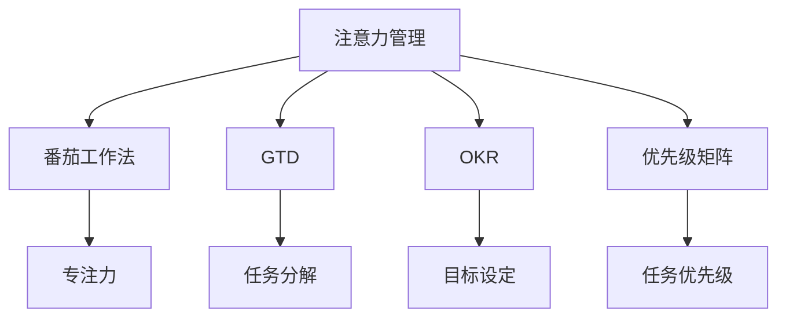

                 

# 注意力管理与时间管理策略：通过时间管理增强专注力和效率

> 关键词：注意力管理,时间管理,专注力,效率,优先级,决策模型,项目管理

## 1. 背景介绍

### 1.1 问题由来
在信息化时代，大量的信息涌入我们的工作和生活。如何在海量信息中找到关键点，提升工作和生活的效率，成为每个现代人面临的挑战。虽然技术在不断进步，但效率的提升往往需要依赖于良好的自我管理，尤其是注意力和时间管理。

注意力管理和时间管理，是现代工作和生活管理的两大支柱。在过去几十年里，随着计算技术的发展，人们探索出许多辅助管理注意力和时间的工具和方法。但这些工具和方法，往往需要用户具备较高的自我觉察能力和使用技巧，才能真正发挥其作用。因此，探索科学、系统、高效的方法来管理注意力和时间，对提高个人及组织的工作效率具有重要意义。

### 1.2 问题核心关键点
注意力管理和时间管理，是两大关键主题。通过科学的方法，使人们能够在海量的信息中找到价值，从而提升效率。具体来说，管理注意力的时间管理，可以分为以下几个核心关键点：

- **优先级划分**：确定哪些任务最重要，需要投入更多时间和精力。
- **时间分配**：合理规划每天的时间，分配到不同的任务中。
- **决策模型**：建立决策模型，帮助快速做出任务优先级的决定。
- **项目管理**：通过有效的项目管理工具，追踪和优化任务进度。
- **工具推荐**：推荐一些科学、高效的时间管理工具。

## 2. 核心概念与联系

### 2.1 核心概念概述

在探讨注意力管理与时间管理策略时，需要了解几个核心概念：

- **注意力管理**：通过各种手段，提升对工作和生活关键任务的关注和处理效率，减少分心和浪费时间的行为。
- **时间管理**：对时间进行科学合理的分配和管理，提升个人和团队的工作效率。
- **番茄工作法**：一种常用的时间管理方法，通过设定短暂的专注时间与休息时间，提升专注力和工作效率。
- **GTD（Getting Things Done）**：一种经典的时间管理方法，强调将任务分解和整理，减少心理负担。
- **OKR（Objectives and Key Results）**：一种目标管理工具，通过设定具体可衡量的目标和关键结果，指导任务优先级和执行过程。
- **优先级矩阵**：一种工具，帮助用户根据任务的重要性和紧急性进行优先级排序。

这些核心概念之间的逻辑关系可以通过以下Mermaid流程图来展示：



这个流程图展示了几大核心概念之间的联系：

1. 注意力管理通过各种方法提升专注力，如番茄工作法、GTD等。
2. 时间管理通过科学分配时间，提升效率，如GTD、OKR等。
3. 优先级矩阵帮助用户确定任务的优先级。
4. 番茄工作法通过时间分割提升专注力。
5. GTD和OKR通过目标设定和任务分解，提升任务管理效率。

## 3. 核心算法原理 & 具体操作步骤
### 3.1 算法原理概述

注意力管理和时间管理的核心算法原理，可以追溯到人类认知行为学和心理学领域。以下是几种经典的时间管理方法的原理概述：

- **番茄工作法**：将时间分为25分钟的专注工作和5分钟的短暂休息，通过周期性切换提升专注力和工作效率。
- **GTD（Getting Things Done）**：通过将任务分为多个层级，从"未来/可能"到"正在进行"，逐步落实到行动中，减少心理负担。
- **OKR**：通过设定具体可衡量的目标（Objectives）和关键结果（Key Results），帮助团队和个人明确任务优先级和执行路径。
- **优先级矩阵**：根据任务的紧急性和重要性，将任务分为四象限，帮助用户决定哪些任务需要立即完成，哪些可以延后。

### 3.2 算法步骤详解

以下是几种经典的时间管理方法的具体操作步骤：

**3.2.1 番茄工作法**
1. 选择一个任务，设定25分钟的专注时间，并关闭所有干扰源。
2. 在25分钟结束时，记录任务进度，进行5分钟的短暂休息。
3. 每完成4个番茄时间段后，进行一次较长的休息（15-30分钟）。
4. 重复上述步骤，直至任务完成。

**3.2.2 GTD（Getting Things Done）**
1. 收集所有待办事项，不论是实际工作还是生活琐事，都记录下来。
2. 将任务按照“未来/可能”、“正在进行”、“等待”、“已完成”等不同层级进行分类。
3. 根据任务层级，逐步落实到具体的行动计划中。
4. 定期回顾和调整任务列表，确保任务按优先级执行。

**3.2.3 OKR**
1. 设定总体目标（Objective），明确具体的可衡量指标。
2. 设定关键结果（Key Result），具体描述如何达成总体目标。
3. 定期回顾和评估关键结果的完成情况。
4. 根据评估结果调整目标和关键结果，确保目标达成。

**3.2.4 优先级矩阵**
1. 列出所有待办事项。
2. 根据任务的紧急性和重要性，将任务分为四象限：紧急且重要、紧急但不重要、重要但不紧急、不紧急且不重要。
3. 优先处理紧急且重要的任务，其次处理重要但不紧急的任务。
4. 对于不紧急且不重要的任务，可以考虑延迟或忽略。

### 3.3 算法优缺点

这些时间管理方法的优缺点如下：

**3.3.1 番茄工作法**
优点：
- 简单易行，易于上手。
- 通过短时间专注和休息，提升专注力和工作效率。
- 有助于打破长时间工作导致的疲劳和注意力分散。

缺点：
- 固定的时间分割可能不适用于所有任务，部分任务可能无法在25分钟内完成。
- 频繁的中断可能影响工作流的连贯性。
- 需要用户具备较强的自我管理能力，才能坚持下去。

**3.3.2 GTD（Getting Things Done）**
优点：
- 系统化地管理任务，减少心理负担。
- 通过任务分解和分类，逐步落实到具体行动中。
- 有助于明确长期目标和短期任务，保持工作和生活平衡。

缺点：
- 任务分类复杂，需要较多时间进行整理。
- 对任务描述要求较高，可能需要用户具备良好的组织能力。
- 需要用户定期回顾和调整任务列表，较为耗时。

**3.3.3 OKR**
优点：
- 目标明确，可衡量性强。
- 有助于团队和个人明确方向和路径。
- 定期评估和调整目标，确保目标达成。

缺点：
- 目标设定和评估需要较强的战略思维和数据分析能力。
- 对于不具战略性的日常任务，OKR可能过于复杂。
- 需要定期进行评估和调整，较耗时间。

**3.3.4 优先级矩阵**
优点：
- 简单易用，直观明了。
- 通过四象限分类，明确任务优先级。
- 有助于提升任务处理效率。

缺点：
- 分类较为粗略，部分任务可能无法准确归类。
- 对于紧急但重要程度较低或重要但不紧急程度较高的任务，处理起来较为困难。
- 需要用户不断进行任务评估和调整。

### 3.4 算法应用领域

这些时间管理方法在多个领域都有广泛应用：

- **个人时间管理**：无论是工作还是生活，时间管理都是提升效率的关键。通过科学管理时间，可以减少分心和浪费时间，提升个人工作效率和生活质量。
- **项目管理**：项目管理中，时间管理是确保项目按时交付的关键。通过合理的任务分配和优先级排序，可以优化项目进度，提高项目成功率。
- **企业决策**：OKR和GTD等方法，有助于企业明确目标和任务优先级，提升决策效率和执行力。
- **个人学习**：学习过程中，时间管理同样重要。通过科学规划学习时间，可以提升学习效率，更快达到学习目标。
- **健康管理**：时间管理同样适用于健康管理，通过科学分配时间，保持规律的作息，提升身体健康和生活质量。

## 4. 数学模型和公式 & 详细讲解 & 举例说明

### 4.1 数学模型构建

为了更精确地描述时间管理方法的工作原理，可以使用数学模型来构建和分析。

假设有一个任务集合 $T=\{t_1, t_2, ..., t_n\}$，每个任务需要的时间为 $t_i$。我们将时间管理方法定义为 $M$，对每个任务 $t_i$ 分配的时间为 $a_i$，总时间为 $T$。则时间管理的数学模型可以表示为：

$$
M = \max\limits_{a_1, a_2, ..., a_n} \{a_1 + a_2 + ... + a_n = T\} \text{ subject to constraints }
$$

其中，约束条件包括：
- $0 \leq a_i \leq t_i$
- $a_i \geq 0$
- $a_i$ 表示对任务 $t_i$ 分配的时间，$T$ 表示总时间。

### 4.2 公式推导过程

我们以OKR方法为例，进行具体的公式推导：

假设总体目标 $O$ 为提升产品质量，具体可衡量的指标为产品满意度 $K_1$ 和客户满意度 $K_2$。则OKR的数学模型可以表示为：

$$
\max O \text{ subject to } K_1 = K_{1min} \times c_1, K_2 = K_{2min} \times c_2
$$

其中，$K_{1min}$ 和 $K_{2min}$ 为产品满意度和客户满意度的最小值，$c_1$ 和 $c_2$ 为对应的系数。

根据以上模型，可以进行以下步骤：
1. 设定总体目标 $O$，并明确具体可衡量的指标 $K_1$ 和 $K_2$。
2. 设定 $K_1$ 和 $K_2$ 的最小值 $K_{1min}$ 和 $K_{2min}$。
3. 通过设定系数 $c_1$ 和 $c_2$，计算出具体的关键结果 $K_1$ 和 $K_2$ 的完成情况。
4. 根据 $K_1$ 和 $K_2$ 的完成情况，调整目标和关键结果，确保总体目标 $O$ 的达成。

### 4.3 案例分析与讲解

假设某团队需要提升产品满意度 $K_1$ 和客户满意度 $K_2$，设定最小值 $K_{1min} = 0.8$，$K_{2min} = 0.9$。假设产品满意度的系数 $c_1 = 0.6$，客户满意度的系数 $c_2 = 0.7$。

1. 设定总体目标 $O$ 为提升产品质量。
2. 设定 $K_1$ 和 $K_2$ 的最小值 $K_{1min} = 0.8$，$K_{2min} = 0.9$。
3. 计算出具体的关键结果 $K_1 = 0.8 \times 0.6 = 0.48$，$K_2 = 0.9 \times 0.7 = 0.63$。
4. 根据 $K_1$ 和 $K_2$ 的完成情况，调整目标和关键结果，确保总体目标 $O$ 的达成。

假设实际计算中，$K_1$ 的完成情况为0.5，$K_2$ 的完成情况为0.6，则需要进行调整：

1. 分析发现产品满意度未达标，需增加投入。
2. 设定新的关键结果 $K_1 = 0.9$。
3. 调整总体目标 $O$，增加对产品满意度的重视，同时确保客户满意度的达成。

## 5. 项目实践：代码实例和详细解释说明

### 5.1 开发环境搭建

在进行时间管理实践前，我们需要准备好开发环境。以下是使用Python进行OKR管理系统的环境配置流程：

1. 安装Anaconda：从官网下载并安装Anaconda，用于创建独立的Python环境。

2. 创建并激活虚拟环境：
```bash
conda create -n okr-env python=3.8 
conda activate okr-env
```

3. 安装必要的Python包：
```bash
pip install pandas numpy matplotlib jupyter notebook
```

4. 安装OKR相关库：
```bash
pip install pykt
```

5. 安装项目需要的其他工具包：
```bash
pip install tqdm
```

完成上述步骤后，即可在`okr-env`环境中开始OKR系统的开发。

### 5.2 源代码详细实现

以下是一个简单的OKR管理系统示例，通过Python实现：

```python
import pandas as pd
from pykt import KT, OKR

# 定义OKR类
class MyOKR(OKR):
    def __init__(self):
        super().__init__()
    
    def set_objective(self, objective):
        self.objective = objective
    
    def set_key_results(self, key_results):
        self.key_results = key_results
    
    def evaluate(self):
        self.evaluate_key_results()
        if self.key_results:
            self.objective = self.key_results[0]['value']
        else:
            self.objective = None
    
    def print_status(self):
        print(f"Objective: {self.objective}, Key Results: {self.key_results}")

# 创建OKR实例
my_okr = MyOKR()

# 设定总体目标和关键结果
my_okr.set_objective("提升产品质量")
my_okr.set_key_results([
    {"metric": "产品满意度", "value": 0.5, "coefficient": 0.6},
    {"metric": "客户满意度", "value": 0.6, "coefficient": 0.7}
])

# 评估OKR状态
my_okr.evaluate()

# 输出状态
my_okr.print_status()
```

### 5.3 代码解读与分析

让我们再详细解读一下关键代码的实现细节：

**MyOKR类**：
- `set_objective`方法：设定总体目标。
- `set_key_results`方法：设定关键结果。
- `evaluate`方法：评估关键结果的完成情况，更新总体目标。
- `print_status`方法：输出OKR的状态。

**OKR实例创建与设定**：
- 创建一个MyOKR实例。
- 设定总体目标为“提升产品质量”。
- 设定关键结果，包括产品满意度和客户满意度，及其对应的系数。

**OKR评估**：
- 通过`evaluate`方法评估关键结果的完成情况，并更新总体目标。
- 输出OKR的状态，包括总体目标和关键结果。

## 6. 实际应用场景

### 6.1 项目管理

在项目管理中，OKR和GTD等方法具有广泛应用。通过科学规划项目目标和任务优先级，可以有效提升项目进度和执行效率。

**案例**：
某软件开发团队需要开发一个新产品。团队设定总体目标为“新产品按时发布”，具体可衡量的指标为“功能完成率”和“代码质量”。设定最小值分别为0.9和0.85。

1. 设定总体目标和关键结果：
   - 总体目标：新产品按时发布
   - 关键结果：功能完成率 = 0.9 * 0.6，代码质量 = 0.85 * 0.7

2. 根据关键结果评估和调整：
   - 假设实际完成情况为功能完成率0.8，代码质量0.85。
   - 分析发现代码质量未达标，需增加投入。
   - 设定新的关键结果：代码质量 = 0.9。
   - 调整总体目标，增加对代码质量的重视。

3. 最终评估和调整：
   - 最终功能完成率0.8，代码质量0.9。
   - 调整总体目标，确保新产品按时发布。

### 6.2 个人时间管理

个人时间管理中，番茄工作法、GTD等方法同样适用。通过科学管理时间和任务，提升个人工作效率和生活质量。

**案例**：
某产品经理需要完成一份项目报告。设定任务为“撰写项目报告”，预计总时间为8小时。

1. 设定任务时间和分配：
   - 任务时间：8小时
   - 番茄时间段：25分钟专注 + 5分钟休息，共16个时间段
   - 休息时间段：2个完整的番茄时间段休息（15-30分钟）

2. 执行番茄工作法：
   - 在每个番茄时间段内专注工作25分钟，休息5分钟。
   - 完成16个番茄时间段后，进行2次较长的休息。
   - 记录每个番茄时间段的任务进度，确保在总时间内完成报告。

3. 最终评估和调整：
   - 完成报告后，评估总体任务完成情况，进行复盘和总结。
   - 根据任务完成情况，调整工作方法和时间管理策略。

## 7. 工具和资源推荐

### 7.1 学习资源推荐

为了帮助开发者系统掌握时间管理理论基础和实践技巧，这里推荐一些优质的学习资源：

1. **《深度工作：如何有效管理你的时间和注意力》**：作者为Cal Newport，深入浅出地介绍了深度工作的原理和实践方法，帮助读者提升专注力和效率。
2. **《自控力》**：作者为Carol Dweck，详细介绍了自控力在工作和生活中的应用，帮助读者建立良好的时间管理习惯。
3. **Coursera的《时间管理技巧》课程》**：斯坦福大学教授讲授的时间管理课程，涵盖了多种时间管理方法的原理和实践技巧。
4. **TED演讲《如何在忙碌的生活中找到意义和效率》**：演讲嘉宾为Peter Bregman，通过分享自己的时间管理经验，提供了实用的时间管理建议。
5. **《GTD：风靡全球的时间管理方法》**：作者为David Allen，详细介绍了GTD方法的具体实施步骤和注意事项。

通过这些学习资源，相信你一定能够系统掌握时间管理的方法和技巧，并在实际工作中取得更好的效果。

### 7.2 开发工具推荐

高效的时间管理离不开优秀的工具支持。以下是几款用于时间管理开发的常用工具：

1. **Trello**：一款流行的项目管理工具，支持任务列表、任务卡片和任务标签，帮助用户更好地管理任务优先级。
2. **Asana**：另一款流行的项目管理工具，支持甘特图、看板和日历等功能，帮助用户规划和管理项目进度。
3. **Notion**：一款多功能笔记应用，支持文本、表格、甘特图、日历等功能，适用于个人和团队的时间管理。
4. **Todoist**：一款简单易用的任务管理工具，支持任务清单、任务优先级和任务评论等功能，适合个人使用。
5. **RescueTime**：一款时间跟踪工具，能够自动记录用户在电脑和手机上的应用时间，帮助用户分析和优化时间利用效率。

合理利用这些工具，可以显著提升时间管理的效率和效果，帮助用户更好地平衡工作和生活。

### 7.3 相关论文推荐

时间管理研究涉及多个学科，以下是几篇奠基性的相关论文，推荐阅读：

1. **《目标管理：一套目标设定和追踪系统》**：作者为Edward A. Locke，介绍了目标管理（MBO）的原理和实施方法，为OKR方法提供了理论基础。
2. **《注意力：认知控制的选择和执行》**：作者为Donald E. Broadbent，详细介绍了注意力控制的工作机制和应用策略。
3. **《番茄工作法：用番茄钟提升工作效率》**：作者为Francesco Cirillo，介绍了番茄工作法的原理和实践方法，帮助读者提升专注力和工作效率。
4. **《GTD：快速提升个人效率和生产力的秘密》**：作者为David Allen，详细介绍了GTD方法的原理和具体实施步骤。
5. **《自控力：如何有效管理时间和注意力》**：作者为W. James，详细介绍了自控力在工作和生活中的应用，帮助读者建立良好的时间管理习惯。

这些论文代表了大时间管理的研究进展，通过学习这些前沿成果，可以帮助研究者把握学科前进方向，激发更多的创新灵感。

## 8. 总结：未来发展趋势与挑战

### 8.1 总结

本文对注意力管理与时间管理策略进行了全面系统的介绍。首先阐述了注意力管理和时间管理的研究背景和意义，明确了时间管理在提升个人和组织工作效率中的重要作用。其次，从原理到实践，详细讲解了时间管理方法的数学模型和操作步骤，给出了时间管理任务开发的完整代码实例。同时，本文还广泛探讨了时间管理方法在项目管理、个人时间管理等多个领域的应用前景，展示了时间管理范式的巨大潜力。此外，本文精选了时间管理技术的各类学习资源，力求为读者提供全方位的技术指引。

通过本文的系统梳理，可以看到，时间管理技术正在成为个人和组织管理的重要工具，显著提升工作效率和生活质量。时间管理方法的不断演进，为提升个人和团队的生产力提供了新的途径。未来，伴随技术的日益成熟，时间管理技术必将更加智能化、科学化，进一步推动生产力的提升。

### 8.2 未来发展趋势

展望未来，时间管理技术将呈现以下几个发展趋势：

1. **智能化时间管理**：通过AI技术辅助时间管理，帮助用户自动优化任务优先级和时间分配，提升效率。
2. **自适应时间管理**：根据用户的行为习惯和心理状态，动态调整时间管理策略，提升用户满意度和使用体验。
3. **多模态时间管理**：结合语音、视觉等多种输入方式，提升时间管理的便捷性和效率。
4. **跨平台时间管理**：通过跨设备、跨平台同步，提升时间管理的连贯性和一致性。
5. **个性化时间管理**：根据用户偏好和习惯，定制化时间管理方案，提升个性化和定制化程度。
6. **社区化时间管理**：通过社交网络分享和协作，提升时间管理的效果和动力。

以上趋势凸显了时间管理技术的广阔前景。这些方向的探索发展，将进一步提升时间管理的智能化和个性化，为个人和组织提供更加便捷、高效的时间管理工具。

### 8.3 面临的挑战

尽管时间管理技术已经取得了一定进展，但在迈向更加智能化、普适化应用的过程中，仍面临诸多挑战：

1. **用户适应性**：用户需要适应新技术和工具，对不同时间管理方法的接受度不一。
2. **数据隐私**：智能时间管理工具需要收集用户数据，如何保护用户隐私成为关键问题。
3. **系统复杂性**：多种时间管理方法结合使用时，系统复杂度增加，需要更高效的算法支持。
4. **算法公平性**：时间管理算法需要考虑不同人群的需求，避免算法偏见和歧视。
5. **适应性和灵活性**：时间管理工具需要灵活应对不同任务和场景，提升适应性和扩展性。
6. **长期稳定性**：时间管理工具需要具备长期稳定性和可靠性的保障，避免频繁更新和迭代。

正视时间管理面临的这些挑战，积极应对并寻求突破，将是大时间管理技术走向成熟的必由之路。相信随着学界和产业界的共同努力，这些挑战终将一一被克服，时间管理技术必将在构建智能高效的工作和生活管理中扮演越来越重要的角色。

### 8.4 研究展望

面对时间管理面临的挑战，未来的研究需要在以下几个方面寻求新的突破：

1. **跨学科融合**：结合认知心理学、行为科学等多个学科，深入研究时间管理的原理和应用。
2. **智能算法开发**：开发高效的时间管理算法，提升系统复杂度和数据处理能力。
3. **隐私保护技术**：研究数据隐私保护技术，确保用户数据的安全和匿名性。
4. **用户友好性**：开发更加智能化、易用的时间管理工具，提升用户接受度和使用体验。
5. **跨平台协作**：开发跨平台协作工具，提升时间管理的连贯性和一致性。
6. **多模态交互**：结合语音、视觉等多种输入方式，提升时间管理的便捷性和效率。

这些研究方向将推动时间管理技术迈向更高的台阶，为构建智能高效的工作和生活管理提供新的思路和方法。

## 9. 附录：常见问题与解答

**Q1：番茄工作法是否适合所有任务？**

A: 番茄工作法适用于需要长时间专注的任务，如编程、写作、研究等。对于需要频繁沟通和协作的任务，如团队会议、客户沟通等，可能不太适用。

**Q2：GTD和OKR哪种方法更适合我？**

A: GTD适用于日常任务管理，将任务分解和整理，减少心理负担。OKR适用于目标设定和项目管理，明确方向和路径。根据个人的任务类型和目标设定，选择最适合的方法。

**Q3：时间管理工具是否需要付费？**

A: 大部分时间管理工具都有免费版本，能够满足基本需求。付费版本提供更多功能和定制化选项，适合有更高需求的用户。选择适合自己需求和预算的工具。

**Q4：如何选择合适的任务优先级？**

A: 任务优先级选择需要考虑任务的紧急性和重要性。紧急且重要的任务需要优先处理，重要但不紧急的任务可以安排时间处理，不紧急且不重要的任务可以延后或忽略。

**Q5：时间管理工具如何帮助提升效率？**

A: 时间管理工具通过科学规划任务优先级和时间分配，减少时间浪费，提高工作效率。同时，通过数据跟踪和分析，帮助用户优化时间利用效率。

---

作者：禅与计算机程序设计艺术 / Zen and the Art of Computer Programming

