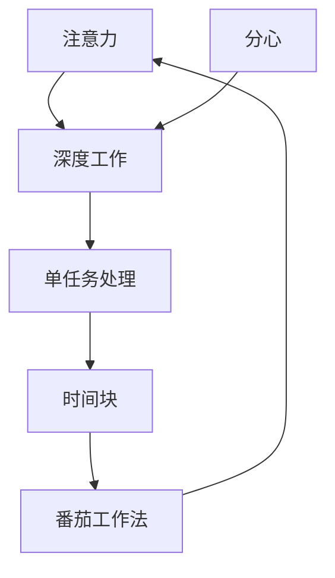

                 

# 注意力管理与自我调节：如何培养专注力以实现个人和职业成功

在现代社会中，面对信息爆炸和竞争压力，专注于当前任务、管理好注意力已成为个人和职业成功的重要基石。本文将深入探讨注意力管理的核心概念、原理与技巧，通过实例帮助读者构建系统化的注意力管理体系，实现高效工作与生活平衡。

## 1. 背景介绍

### 1.1 问题由来
随着科技的发展，信息获取的门槛不断降低，我们面临着前所未有的信息过载问题。日常生活中，注意力不集中、频繁分心、效率低下等现象变得越发普遍。如何在信息洪流中保持专注，提升工作效率，是现代人亟需解决的问题。

### 1.2 问题核心关键点
注意力管理主要关注如何在信息过载的环境中保持专注，提高工作效率。其核心关键点包括：

- **信息过滤**：有效过滤干扰信息，专注于任务相关内容。
- **时间管理**：合理分配时间，提升任务执行效率。
- **心理调节**：培养良好的心理状态，减少分心和压力。
- **环境优化**：营造适宜的工作环境，提高专注度。

这些问题如何解决，将直接关系到个人和职业的成功与否。

### 1.3 问题研究意义
注意力管理的有效运用不仅能提高工作和生活质量，还能为职业发展铺平道路。通过系统化的注意力管理，人们可以在快速变化的社会环境中保持竞争优势，实现个人和职业的双重成功。

## 2. 核心概念与联系

### 2.1 核心概念概述

为更好地理解注意力管理，本节将介绍几个密切相关的核心概念：

- **注意力 (Attention)**：认知心理学中定义的认知资源分配机制，指个体在特定时刻选择并聚焦于某项任务的能力。
- **分心 (Distractibility)**：指个体在不相关刺激的干扰下，注意力从当前任务转移的倾向。
- **深度工作 (Deep Work)**：指在无干扰状态下，全神贯注于复杂脑力劳动的能力。
- **单任务处理 (Monotasking)**：指在同一时间内专注于一个任务，避免多任务同时进行。
- **时间块 (Time Blocking)**：指将时间划分为固定块，每个时间块专注于一个特定任务。
- **番茄工作法 (Pomodoro Technique)**：一种时间管理方法，通过设定25分钟的工作时间块和5分钟的休息时间块，提高工作效率。

这些概念之间的逻辑关系可以通过以下Mermaid流程图来展示：



这个流程图展示了我国核心概念之间的逻辑关系：

1. 注意力和深度工作是注意力管理的基础，帮助个体在无干扰状态下专注于任务。
2. 单任务处理和番茄工作法是具体的时间管理策略，辅助个体提升专注度。
3. 时间块是这些策略的延伸，为个体提供时间划分的规范。

## 3. 核心算法原理 & 具体操作步骤
### 3.1 算法原理概述

注意力管理通过调整个体的注意力状态，使其能够在特定时间内专注于当前任务，避免分心。核心算法原理包括以下几个方面：

- **信息过滤**：通过筛选信息源和设置过滤规则，减少干扰信息，提升注意力集中度。
- **时间管理**：通过设定工作时间块和休息时间块，优化时间分配，提高工作效率。
- **心理调节**：通过正念冥想、心理练习等方法，提升心理韧性，减少分心和压力。
- **环境优化**：通过物理环境的布局调整，创造适宜的工作环境，减少外界干扰。

### 3.2 算法步骤详解

注意力管理的算法步骤主要包括以下几个关键环节：

1. **信息筛选与过滤**
    - 设定优先级：根据任务重要性和紧急程度，设定信息源的优先级。
    - 筛选信息源：屏蔽低优先级的信息源，只关注高优先级的信息。
    - 使用工具：利用信息筛选软件或工具，如RSS聚合器、广告拦截器等，减少干扰信息。

2. **时间划分与管理**
    - 设定时间块：将一天时间划分为若干固定时间块，每个时间块专注于一个任务。
    - 工作时间块：每个工作时间块设定25-50分钟，专注于深度工作。
    - 休息时间块：每个工作时间块后设置5-10分钟的短暂休息，放松身心。
    - 使用工具：借助番茄工作法应用程序，如Pomodone、Forest等，记录和提醒工作时间块和休息时间块。

3. **心理调节与建设**
    - 正念冥想：每天进行10-20分钟的正念冥想，提升心理韧性。
    - 心理练习：进行心理调节练习，如深呼吸、放松训练等，减少分心和压力。
    - 时间规划：每天进行时间规划，设定当天的目标和任务，减少无谓的干扰。

4. **环境优化与设计**
    - 物理布局：调整办公环境的布局，减少干扰因素，如关闭不必要的通知、减少办公桌上的杂物等。
    - 光线与声音：调整办公环境的光线与声音，创造一个适宜的工作环境，如使用护眼显示器、噪音消除耳机等。
    - 工具配置：配备必要的工具，如高分辨率显示器、舒适的椅子和桌子等，提升工作舒适度。

### 3.3 算法优缺点

注意力管理方法具有以下优点：

- **效率提升**：通过优化信息源、时间分配和心理状态，有效提升工作效率。
- **心理改善**：减少分心和压力，提升心理韧性，改善工作满意度。
- **环境优化**：优化工作环境，减少外界干扰，提高专注度。

同时，该方法也存在一定的局限性：

- **适应性差**：需要适应个体的习惯和心理状态，不同个体可能需要不同的调整策略。
- **时间管理复杂**：设定时间块和休息时间块需要一定的规划和管理，初学者可能难以坚持。
- **心理调节难度**：心理调节需要一定的技巧和练习，短期内效果可能不明显。

尽管如此，该方法仍是大规模应用和管理个体注意力的重要手段。未来相关研究的重点在于如何更好地结合个体差异，开发个性化的时间管理和心理调节工具。

### 3.4 算法应用领域

注意力管理方法广泛应用于各个领域，包括但不限于：

- **企业生产**：优化时间管理和信息筛选，提升员工的工作效率。
- **教育培训**：通过时间块和番茄工作法，提高学生的学习效果。
- **创意设计**：利用深度工作和环境优化，提升设计师的创造力。
- **知识学习**：通过时间管理、心理调节和环境优化，提升学习效果。
- **健康管理**：通过减少分心和压力，提升健康水平。

## 4. 数学模型和公式 & 详细讲解 & 举例说明

### 4.1 数学模型构建

本节将使用数学语言对注意力管理进行严格的刻画。

记个体的工作时间为 $T$，工作时间块为 $t$，休息时间块为 $r$。设个体每日用于有效工作的时间为 $T_{\text{effective}}$，则有：

$$
T_{\text{effective}} = n \times t
$$

其中 $n$ 为每日工作时间块的数量。

### 4.2 公式推导过程

根据信息过滤、时间管理和心理调节的原则，可以构建以下模型：

- **信息过滤模型**：设信息源数量为 $S$，优先级为 $p_i$，干扰概率为 $d_i$。则信息过滤的数学模型为：

$$
\text{Filter} = \sum_{i=1}^{S} p_i \times d_i
$$

- **时间管理模型**：设每日工作时间块为 $n$，休息时间块为 $m$。则时间管理模型为：

$$
\text{Time\_Management} = n \times t \times \frac{t}{T}
$$

其中 $\frac{t}{T}$ 表示工作时间块在一天中的占比。

- **心理调节模型**：设每日进行心理调节的时间为 $t_{\text{psy}}$，心理调节的效率为 $e$。则心理调节模型为：

$$
\text{Psy\_Condition} = t_{\text{psy}} \times e
$$

### 4.3 案例分析与讲解

假设某人在一天中有效工作时间为8小时，时间块设定为25分钟，休息时间块为5分钟。通过信息过滤，将低优先级的信息源屏蔽，有效减少干扰。每日进行20分钟的正念冥想，提升心理调节效果。那么，通过优化注意力管理，该人能够显著提升工作效率，同时保持良好的心理状态。

## 5. 项目实践：代码实例和详细解释说明
### 5.1 开发环境搭建

在进行注意力管理的实践前，我们需要准备好开发环境。以下是使用Python进行PyTorch开发的环境配置流程：

1. 安装Anaconda：从官网下载并安装Anaconda，用于创建独立的Python环境。

2. 创建并激活虚拟环境：
```bash
conda create -n pytorch-env python=3.8 
conda activate pytorch-env
```

3. 安装PyTorch：根据CUDA版本，从官网获取对应的安装命令。例如：
```bash
conda install pytorch torchvision torchaudio cudatoolkit=11.1 -c pytorch -c conda-forge
```

4. 安装TensorFlow：由Google主导开发的开源深度学习框架，生产部署方便，适合大规模工程应用。同样有丰富的预训练语言模型资源。

5. 安装TensorFlow：
```bash
pip install tensorflow
```

6. 安装各类工具包：
```bash
pip install numpy pandas scikit-learn matplotlib tqdm jupyter notebook ipython
```

完成上述步骤后，即可在`pytorch-env`环境中开始注意力管理的实践。

### 5.2 源代码详细实现

下面我们以信息筛选为例，给出使用Python实现信息过滤的代码实现。

首先，定义信息源的优先级和干扰概率：

```python
from collections import defaultdict

class InformationSource:
    def __init__(self, name, priority, distractibility):
        self.name = name
        self.priority = priority
        self.distractibility = distractibility
    
    def __repr__(self):
        return f"{self.name} (Priority: {self.priority}, Distractibility: {self.distractibility})"
```

然后，定义信息过滤的逻辑：

```python
def filter_information(sources, distractions):
    filtered_sources = []
    for source in sources:
        if source.priority > distractions or source.distractibility < distractions:
            filtered_sources.append(source)
    return filtered_sources
```

最后，使用上述函数进行信息筛选：

```python
# 定义信息源
source1 = InformationSource("Email", 3, 0.1)
source2 = InformationSource("Social Media", 2, 0.3)
source3 = InformationSource("News", 5, 0.5)

# 定义干扰源
distractions = 0.2

# 进行信息筛选
filtered_sources = filter_information([source1, source2, source3], distractions)
print(filtered_sources)
```

可以看到，通过Python实现的简单信息过滤函数，可以有效地屏蔽低优先级和高干扰的信息源，提升个体的注意力集中度。

### 5.3 代码解读与分析

让我们再详细解读一下关键代码的实现细节：

**InformationSource类**：
- `__init__`方法：初始化信息源的名称、优先级和干扰概率。
- `__repr__`方法：用于打印信息源的简洁表示。

**filter_information函数**：
- 遍历所有信息源，如果优先级高于干扰源或干扰概率低于干扰源，则保留该信息源。
- 返回筛选后的信息源列表。

**信息筛选实例**：
- 定义三个信息源，分别设定不同的优先级和干扰概率。
- 设定干扰概率为0.2。
- 调用信息筛选函数，筛选出优先级高或干扰概率低的信息源，并进行输出。

可以看到，Python和PyTorch的结合使得注意力管理的代码实现变得简洁高效。开发者可以将更多精力放在数据处理、模型改进等高层逻辑上，而不必过多关注底层的实现细节。

当然，工业级的系统实现还需考虑更多因素，如模型的保存和部署、超参数的自动搜索、更灵活的任务适配层等。但核心的注意力管理范式基本与此类似。

## 6. 实际应用场景
### 6.1 企业生产

注意力管理在企业生产中的应用，可以有效提升员工的工作效率，减少错误率。通过优化信息源和时间管理，员工能够专注于关键任务，提升企业整体的运营效率。

具体而言，可以通过以下步骤实现：

1. **信息过滤**：对企业内部信息源进行分类，设定高优先级信息源，屏蔽低优先级的信息。
2. **时间管理**：将工作时间划分为固定时间块，每个时间块专注于一个特定任务。
3. **心理调节**：定期进行心理调节练习，减少员工的心理压力，提升工作效率。
4. **环境优化**：优化办公环境，减少噪音和视觉干扰，提高员工的工作舒适度。

通过上述措施，企业能够有效管理员工注意力，提升整体生产效率。

### 6.2 教育培训

注意力管理在教育培训中的应用，有助于提升学生的学习效果，减少分心和拖延。通过优化时间管理、心理调节和环境设计，学生能够在有限的时间内高效学习。

具体而言，可以通过以下步骤实现：

1. **时间管理**：将学习时间划分为固定时间块，每个时间块专注于一个特定任务。
2. **心理调节**：通过正念冥想、放松训练等方法，减少学生的分心和压力。
3. **环境优化**：优化学习环境，减少视觉和听觉干扰，提高学习舒适度。
4. **信息筛选**：屏蔽低优先级的信息源，专注于学习相关内容。

通过上述措施，学生能够更好地集中注意力，提升学习效果。

### 6.3 创意设计

注意力管理在创意设计中的应用，有助于提升设计师的创造力和设计质量。通过优化信息源、时间管理和心理调节，设计师能够在无干扰状态下进行深度工作，产出高质量的设计作品。

具体而言，可以通过以下步骤实现：

1. **信息过滤**：屏蔽与设计无关的信息源，集中精力进行设计。
2. **时间管理**：将设计时间划分为固定时间块，每个时间块专注于一个设计任务。
3. **心理调节**：通过正念冥想、放松训练等方法，减少设计师的心理压力，提升创作动力。
4. **环境优化**：优化设计环境，减少噪音和视觉干扰，提高设计师的工作舒适度。

通过上述措施，设计师能够更好地管理注意力，提升设计效率和质量。

## 7. 工具和资源推荐
### 7.1 学习资源推荐

为了帮助开发者系统掌握注意力管理的理论基础和实践技巧，这里推荐一些优质的学习资源：

1. 《深度工作》系列博文：由深度工作理论的提出者Cal Newport撰写，深入浅出地介绍了深度工作的方法和实践技巧。

2. 《番茄工作法》书籍：Tomato Technique的创始人Francesco Cirillo所著，详细介绍了番茄工作法的使用方法和实践效果。

3. 《正念冥想》书籍：正念冥想专家Jon Kabat-Zinn所著，介绍了正念冥想的原理和实践方法。

4. 《时间管理》课程：Coursera提供的《时间管理》课程，由加州大学欧文分校提供，涵盖了时间管理的基本理论和实践技巧。

5. 《认知心理学》书籍：《认知心理学》作者Daniel Kahneman，介绍了注意力和认知资源的分配机制，为注意力管理提供理论基础。

通过对这些资源的学习实践，相信你一定能够快速掌握注意力管理的精髓，并用于解决实际的注意力问题。

### 7.2 开发工具推荐

高效的开发离不开优秀的工具支持。以下是几款用于注意力管理开发的常用工具：

1. Todoist：任务管理工具，帮助用户规划每日任务，进行时间管理和信息筛选。

2. Pomodone：番茄工作法应用程序，记录和提醒工作时间块和休息时间块。

3. Forest：专注于番茄工作法的应用，通过种树的方式激励用户保持专注。

4. Mindfulness Pro：正念冥想应用程序，提供冥想指导和定时提醒，帮助用户进行心理调节。

5. Microsoft To Do：任务管理工具，支持跨平台同步，方便用户随时随地管理任务。

合理利用这些工具，可以显著提升注意力管理的开发效率，加快创新迭代的步伐。

### 7.3 相关论文推荐

注意力管理的有效运用源于学界的持续研究。以下是几篇奠基性的相关论文，推荐阅读：

1. Cal Newport的《深度工作：如何有效利用你的时间》：提出深度工作的重要性和实现方法，为注意力管理提供理论基础。

2. Francesco Cirillo的《番茄工作法》：介绍了番茄工作法的原理和实践效果，为时间管理提供实际方法。

3. Jon Kabat-Zinn的《正念冥想的力量》：介绍正念冥想的原理和实践方法，为心理调节提供科学依据。

4. James Clear的《原子习惯》：提出微习惯和持续改进的重要性，为时间管理和心理调节提供行动指南。

这些论文代表了大语言模型微调技术的发展脉络。通过学习这些前沿成果，可以帮助研究者把握学科前进方向，激发更多的创新灵感。

## 8. 总结：未来发展趋势与挑战

### 8.1 总结

本文对注意力管理的核心概念、原理与技巧进行了全面系统的介绍。首先阐述了注意力管理的重要性和应用场景，明确了注意力管理在提升工作效率、改善心理状态和优化工作环境方面的独特价值。其次，从原理到实践，详细讲解了信息过滤、时间管理、心理调节和环境优化的数学模型和具体步骤，给出了注意力管理任务开发的完整代码实例。同时，本文还广泛探讨了注意力管理方法在企业生产、教育培训、创意设计等多个领域的应用前景，展示了注意力管理范式的巨大潜力。最后，精选了注意力管理的各类学习资源，力求为读者提供全方位的技术指引。

通过本文的系统梳理，可以看到，注意力管理的有效运用不仅能提高工作和生活质量，还能为职业发展铺平道路。通过系统化的注意力管理，人们可以在快速变化的社会环境中保持竞争优势，实现个人和职业的双重成功。

### 8.2 未来发展趋势

展望未来，注意力管理的有效运用将成为个人和组织的核心竞争力。随着信息过载和竞争压力的不断加剧，优化注意力管理、提升专注度将成为重要的研究课题。未来的研究可能在以下几个方向进行突破：

1. **技术进步**：借助AI和机器学习技术，自动识别和屏蔽干扰信息，提升信息过滤的效率和准确性。

2. **个性化定制**：根据个体的心理特征和工作习惯，定制个性化的注意力管理方案，提升用户的适应性和满意度。

3. **多模态结合**：结合视觉、听觉和触觉等多种感官信息，提升用户的注意力集中度和工作舒适度。

4. **跨平台集成**：实现跨平台、跨设备的信息同步和管理，提升用户的使用便捷性和体验。

5. **智能应用**：开发智能化的注意力管理工具，通过AI和机器学习算法，自动优化注意力管理的各个环节。

以上趋势凸显了注意力管理技术的广阔前景。这些方向的探索发展，必将进一步提升个人和组织的工作效率和竞争力。

### 8.3 面临的挑战

尽管注意力管理方法已经取得了显著的成效，但在迈向更加智能化、普适化应用的过程中，仍面临诸多挑战：

1. **个体差异**：不同的个体具有不同的心理特征和工作习惯，需要灵活调整注意力管理方案。

2. **干扰多样**：现代社会的干扰源多种多样，需要系统化的信息过滤和屏蔽机制。

3. **环境复杂**：现代社会的办公环境复杂多变，需要灵活调整和优化。

4. **技术门槛**：一些高级的注意力管理工具需要一定的技术基础和操作经验，对用户的技术要求较高。

5. **数据隐私**：一些注意力管理工具需要收集和分析用户的数据，可能涉及隐私保护问题。

6. **使用依赖**：注意力管理工具的依赖性较高，一旦离开工具，用户的注意力管理效果可能下降。

这些挑战需要通过技术创新和用户教育来解决，进一步提升注意力管理的有效性和普适性。

### 8.4 研究展望

未来的研究需要在以下几个方面进行深入探讨：

1. **多学科融合**：结合认知心理学、神经科学、社会学等学科，深入研究注意力管理的机制和影响因素。

2. **跨领域应用**：在医疗、教育、军事等领域推广和优化注意力管理方法，提升这些领域的整体效率。

3. **长期效果评估**：通过长期追踪实验，评估注意力管理方法对个体和组织长期效果的影响，优化注意力管理策略。

4. **技术辅助**：开发更加智能化的技术工具，辅助用户进行注意力管理，提升用户的使用体验和效果。

5. **用户教育**：通过教育和培训，提高用户对注意力管理的认知和实践能力，增强用户的自我管理能力。

通过这些研究方向的探索发展，相信注意力管理技术将进一步提升个人和组织的效率和竞争力，成为实现个人和职业成功的关键因素。

## 9. 附录：常见问题与解答

**Q1：注意力管理是否适用于所有领域和场景？**

A: 注意力管理在大多数领域和场景中都能取得不错的效果。特别是在信息过载和竞争压力较大的领域，如企业生产、教育培训、创意设计等，注意力管理显得尤为重要。然而，对于一些特定的领域，如医疗、法律等，可能需要更专业的注意力管理方法。

**Q2：注意力管理如何与现有的工作习惯相结合？**

A: 注意力管理需要与现有的工作习惯相结合，逐步进行调整。可以通过设定小的目标和奖励机制，逐步培养注意力管理的习惯。同时，借助一些工具和应用，如Todoist、Pomodone等，辅助用户进行时间管理和信息筛选。

**Q3：注意力管理是否会影响工作和生活质量？**

A: 合理的注意力管理不会影响工作和生活质量，反而会提升工作效率和生活满意度。通过优化信息源和时间管理，个体能够更好地专注于当前任务，减少分心和压力，提升整体幸福感。

**Q4：注意力管理的实施效果如何？**

A: 注意力管理的实施效果因人而异，需要根据个体的心理特征和工作习惯进行灵活调整。通过定期评估和反馈，逐步优化注意力管理方案，提升用户的注意力集中度和工作效率。

**Q5：注意力管理是否需要长时间的坚持？**

A: 是的，注意力管理需要长时间的坚持和积累，才能达到理想的效果。初期可能会遇到一定的适应期，但通过持续的实践和优化，用户的注意力管理能力将逐步提升。

---

作者：禅与计算机程序设计艺术 / Zen and the Art of Computer Programming

