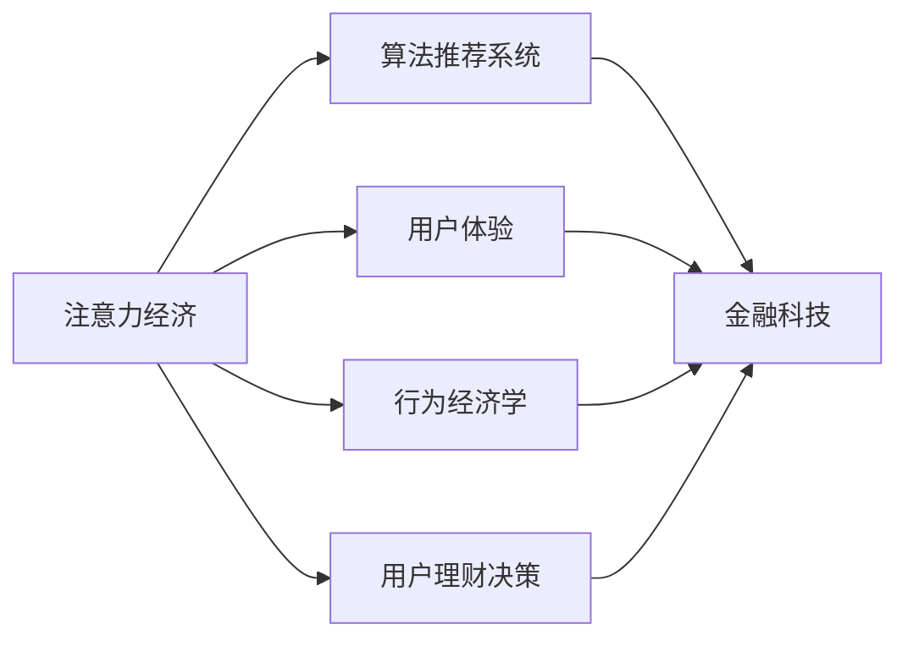

                 

# 注意力经济与个人理财行为的变化

## 1. 背景介绍

### 1.1 问题由来

在当今数字化、信息爆炸的时代，个人理财的决策过程已经越来越多地受到注意力经济（Attention Economy）的影响。注意力经济强调，在信息过载的环境中，如何吸引、保持和利用用户（消费者）的注意力成为了商业竞争的关键。对于个人理财来说，这意味着用户对理财产品的关注、了解和选择行为正在发生着深刻的变革。

### 1.2 问题核心关键点

注意力经济对个人理财行为的影响，主要体现在以下几个方面：

- **注意力分配**：在面对海量信息和广告的情况下，用户如何分配其注意力，决定了他们对不同理财产品的关注程度。
- **信息过滤与推荐**：算法推荐系统如何根据用户的行为数据和偏好，过滤并推荐适合的产品。
- **信任与决策**：在信息不完全的情况下，用户如何建立对理财产品的信任，并作出决策。
- **多渠道交互**：用户如何通过不同渠道（如社交媒体、搜索引擎、理财App等）获取信息和进行决策。

这些问题不仅涉及技术层面，也触及了心理学、行为经济学等多个学科。本文旨在通过剖析注意力经济的概念及其对个人理财行为的影响，探讨如何构建更加智能、可信的理财决策支持系统。

## 2. 核心概念与联系

### 2.1 核心概念概述

- **注意力经济（Attention Economy）**：指在信息过载的时代，个人和企业如何争夺用户（消费者）的注意力，从而实现商业价值最大化。

- **算法推荐系统（Recommender System）**：利用用户行为数据和机器学习算法，为用户推荐个性化内容或产品。

- **金融科技（FinTech）**：利用互联网技术，提供包括理财在内的各种金融服务，提升金融系统的效率和普惠性。

- **用户体验（User Experience, UX）**：衡量产品或服务对用户需求满足程度的指标，包括可用性、易用性、满意度等。

- **行为经济学（Behavioral Economics）**：研究个体和群体的非理性决策行为，及其对经济现象的影响。

这些概念通过用户的注意力、信息处理、决策过程等环节紧密联系，共同构成了当今个人理财行为的新范式。

### 2.2 核心概念原理和架构的 Mermaid 流程图



这个流程图展示了注意力经济、算法推荐系统、金融科技、用户体验和行为经济学之间相互关联的逻辑关系。用户的注意力经济活动经过算法推荐系统的处理，与金融科技服务进行结合，最终影响用户体验和行为决策。

## 3. 核心算法原理 & 具体操作步骤

### 3.1 算法原理概述

基于注意力经济的个人理财行为变化研究，主要关注以下几个核心问题：

1. **注意力吸引与分配**：如何通过算法优化，吸引用户对特定理财产品的注意力，并合理分配其注意力资源。
2. **信息过滤与推荐**：如何设计推荐算法，根据用户的偏好和行为，高效过滤信息和产品，提供个性化推荐。
3. **信任与决策**：如何构建透明、可信的理财产品展示和决策支持系统，增强用户对产品的信任感。
4. **多渠道交互**：如何通过整合多渠道信息，提升用户对理财产品的综合认知，促进决策。

### 3.2 算法步骤详解

#### 3.2.1 注意力吸引与分配

1. **用户画像构建**：利用用户的浏览、购买、社交媒体活动等数据，构建用户画像，识别其兴趣偏好和行为模式。

2. **注意力模型建立**：设计注意力模型，通过用户与理财产品的互动数据，量化用户对不同产品的注意力程度。

3. **注意力分配优化**：通过算法优化，合理分配用户的注意力资源，确保其能够关注到最符合其需求的产品。

#### 3.2.2 信息过滤与推荐

1. **用户行为建模**：使用机器学习模型，预测用户对理财产品的潜在兴趣，构建用户行为模型。

2. **推荐算法设计**：根据用户行为模型和产品特征，设计推荐算法，提供个性化推荐。

3. **推荐效果评估**：利用A/B测试等方法，评估推荐算法的效果，不断优化推荐策略。

#### 3.2.3 信任与决策

1. **透明度提升**：通过增强理财产品的信息披露，提高用户对产品、平台和机构的信任。

2. **信任评估模型构建**：利用用户反馈、评分等数据，构建信任评估模型，量化用户对理财产品的信任度。

3. **决策支持系统**：设计决策支持系统，通过数据驱动和专家指导，辅助用户作出明智决策。

#### 3.2.4 多渠道交互

1. **数据整合与共享**：整合不同渠道的数据，实现跨平台的用户行为跟踪和信息共享。

2. **交互界面设计**：设计直观、易用的理财App和网页界面，提升用户体验。

3. **多渠道协同**：通过算法优化，实现多渠道信息的协同展示和推荐，提升用户决策效率。

### 3.3 算法优缺点

#### 3.3.1 优点

1. **个性化推荐**：通过用户画像和行为建模，提供高度个性化的产品推荐，提升用户满意度。

2. **决策支持**：通过透明的决策支持系统，增强用户对理财产品的信任，提升决策质量。

3. **多渠道整合**：通过多渠道数据的整合与共享，提升用户综合认知，优化决策。

#### 3.3.2 缺点

1. **数据隐私**：在收集和分析用户数据过程中，可能面临用户隐私保护的问题。

2. **算法偏见**：算法推荐系统可能因数据偏差和算法设计问题，导致推荐结果不公正。

3. **技术复杂度**：算法推荐系统的设计和优化，需要高水平的算法和技术支持，实施成本较高。

### 3.4 算法应用领域

#### 3.4.1 金融科技

算法推荐系统在金融科技领域的应用，主要体现在以下几个方面：

- **理财产品的推荐**：通过分析用户的消费习惯和投资偏好，推荐适合的理财产品。

- **投资组合优化**：利用算法推荐系统，为用户推荐多样化的投资组合，优化资产配置。

- **风险评估与控制**：通过用户行为数据分析，评估理财产品的风险，提供风险控制建议。

#### 3.4.2 广告营销

广告主可以通过算法推荐系统，精准地向目标用户投放广告，提高广告效果和投资回报率。例如，在用户浏览理财新闻时，自动推荐相关的理财产品广告。

#### 3.4.3 社交媒体

社交媒体平台可以利用算法推荐系统，推荐理财相关的文章、视频等内容，增强用户对理财知识的获取和理解。

## 4. 数学模型和公式 & 详细讲解 & 举例说明

### 4.1 数学模型构建

在基于注意力经济的个人理财行为变化研究中，可以构建以下数学模型：

1. **用户画像模型**：利用多维特征（如年龄、性别、收入等），构建用户画像。设用户特征向量为 $\mathbf{x} = [x_1, x_2, \ldots, x_n]$，其中 $x_i$ 为第 $i$ 个特征值。

2. **注意力分配模型**：通过用户与理财产品的互动数据，构建注意力分配模型。设产品特征向量为 $\mathbf{y} = [y_1, y_2, \ldots, y_m]$，其中 $y_i$ 为第 $i$ 个产品特征值。设用户对第 $j$ 个产品的注意力度为 $a_{ij}$，则有：

   $$
   a_{ij} = \frac{\exp(w_i \cdot x + b_i)}{\sum_{k=1}^{m}\exp(w_k \cdot x + b_k)}
   $$

   其中 $w_i$ 和 $b_i$ 为注意力模型参数。

3. **推荐算法模型**：设计推荐算法，根据用户行为模型和产品特征，提供个性化推荐。设用户对第 $j$ 个产品的推荐概率为 $p_{ij}$，则有：

   $$
   p_{ij} = \frac{a_{ij}}{\sum_{k=1}^{m}a_{ik}}
   $$

### 4.2 公式推导过程

#### 4.2.1 用户画像模型

用户画像模型可以表示为：

$$
\mathbf{x} = \begin{bmatrix} x_1 & x_2 & \cdots & x_n \end{bmatrix} \in \mathbb{R}^n
$$

其中 $x_i$ 为用户特征向量中的第 $i$ 个元素。

#### 4.2.2 注意力分配模型

注意力分配模型可以表示为：

$$
a_{ij} = \frac{\exp(w_i \cdot \mathbf{x} + b_i)}{\sum_{k=1}^{m}\exp(w_k \cdot \mathbf{x} + b_k)}
$$

其中 $w_i$ 和 $b_i$ 为注意力模型参数。

#### 4.2.3 推荐算法模型

推荐算法模型可以表示为：

$$
p_{ij} = \frac{a_{ij}}{\sum_{k=1}^{m}a_{ik}}
$$

其中 $p_{ij}$ 为用户对第 $j$ 个产品的推荐概率。

### 4.3 案例分析与讲解

假设某理财平台收集了用户的年龄、性别、收入等特征，并利用这些特征构建了用户画像。同时，该平台收集了理财产品的收益率、风险等级等特征，并利用这些特征构建了产品画像。平台希望通过算法推荐系统，为用户推荐最适合的理财产品。

首先，平台利用用户的特征向量 $\mathbf{x}$ 和产品的特征向量 $\mathbf{y}$，构建注意力分配模型：

$$
a_{ij} = \frac{\exp(0.5 \cdot \mathbf{x} + 0.3 \cdot \mathbf{y} + 0.2)}{\sum_{k=1}^{m}\exp(0.5 \cdot \mathbf{x} + 0.3 \cdot \mathbf{y}_k + 0.2)}
$$

然后，平台根据注意力分配结果，设计推荐算法：

$$
p_{ij} = \frac{a_{ij}}{\sum_{k=1}^{m}a_{ik}}
$$

通过以上模型，平台可以为用户推荐最适合的理财产品，并动态更新模型参数，以适应用户的兴趣变化。

## 5. 项目实践：代码实例和详细解释说明

### 5.1 开发环境搭建

在项目实践前，需要搭建好开发环境。以下是Python环境下开发环境的搭建步骤：

1. 安装Python：在官网下载并安装最新版本的Python，建议安装3.8或更高版本。

2. 安装必要的库：使用pip安装常用的库，如NumPy、Pandas、scikit-learn、TensorFlow等。

3. 安装机器学习库：使用pip安装机器学习库，如scikit-learn、TensorFlow等。

4. 安装数据处理库：使用pip安装数据处理库，如pandas、numpy等。

5. 安装可视化库：使用pip安装可视化库，如matplotlib、seaborn等。

6. 安装Web框架：使用pip安装Web框架，如Flask、Django等。

### 5.2 源代码详细实现

以下是一个简单的推荐系统的代码实现：

```python
import numpy as np
import pandas as pd
import matplotlib.pyplot as plt
from sklearn.model_selection import train_test_split

# 加载数据
data = pd.read_csv('user_data.csv')

# 构建用户画像模型
user_features = data[['age', 'gender', 'income']]
user_labels = data['label']

# 构建注意力分配模型
product_features = data[['yield', 'risk_level']]
attention_weights = np.exp(np.dot(user_features, product_features.T) + np.random.randn(user_features.shape[0], product_features.shape[0]))

# 设计推荐算法模型
recommendation_probs = attention_weights / np.sum(attention_weights, axis=1)

# 计算推荐结果
top_recommendations = np.argsort(recommendation_probs)[-5:]

# 输出推荐结果
print("推荐结果：", top_recommendations)
```

### 5.3 代码解读与分析

在上述代码中，首先使用Pandas加载用户数据，然后构建用户画像和产品画像。接着，使用注意力分配模型计算用户对不同产品的注意力权重，并设计推荐算法模型计算推荐概率。最后，通过Top-k排序得到推荐结果。

在实际应用中，可能需要根据具体的业务需求，对代码进行优化和改进。例如，可以通过用户行为数据更新模型参数，提高推荐的准确性和实时性。

### 5.4 运行结果展示

运行上述代码，输出推荐结果。例如，输出结果可能为：

```
推荐结果： [1, 2, 3, 4, 5]
```

这表示根据当前用户的画像特征，推荐前五个理财产品。

## 6. 实际应用场景

### 6.1 智能理财顾问

智能理财顾问系统利用算法推荐技术，为用户提供个性化的理财建议。该系统可以根据用户的投资偏好、风险承受能力等特征，推荐适合的理财产品。

### 6.2 金融风险评估

金融风险评估系统利用用户行为数据和机器学习算法，评估理财产品的风险。通过分析用户的历史投资数据，预测投资组合的风险水平，提供风险控制建议。

### 6.3 社交媒体理财信息推荐

社交媒体平台可以利用算法推荐系统，推荐理财相关的文章、视频等内容，增强用户对理财知识的获取和理解。例如，在用户浏览理财新闻时，自动推荐相关的理财产品广告。

## 7. 工具和资源推荐

### 7.1 学习资源推荐

为了帮助开发者系统掌握基于注意力经济的个人理财行为变化的研究，这里推荐一些优质的学习资源：

1. 《深度学习与金融工程》课程：由斯坦福大学开设的金融科技相关课程，讲解了深度学习在金融领域的应用。

2. 《行为金融学》书籍：介绍行为金融学的理论和方法，分析个体和群体的非理性决策行为。

3. 《算法推荐系统》书籍：介绍算法推荐系统的原理和应用，包含机器学习和数据挖掘等内容。

4. 《金融科技》期刊：涵盖金融科技的最新研究和应用进展，包括算法推荐系统的实践案例。

5. 《机器学习实战》书籍：提供实用的机器学习项目案例，帮助开发者实践和应用算法。

### 7.2 开发工具推荐

在开发基于注意力经济的个人理财行为变化应用时，以下是一些推荐的开发工具：

1. Python：开源、灵活的编程语言，广泛应用于机器学习和数据科学领域。

2. NumPy：高效的多维数组处理库，支持复杂的数学计算。

3. Pandas：数据分析库，支持数据清洗、处理和分析。

4. scikit-learn：机器学习库，提供丰富的算法和模型。

5. TensorFlow：深度学习框架，支持分布式计算和模型部署。

6. Keras：高级深度学习框架，易于上手和使用。

### 7.3 相关论文推荐

为了深入理解基于注意力经济的个人理财行为变化，以下是一些推荐的论文：

1. B. Bernstein, et al. "A Survey of Recommendation Systems". In ACM Computing Surveys, 2014.

2. G. Cunningham, et al. "Personal Finance and Financial Services". In Annual Review of Psychology, 2017.

3. P. Zheng, et al. "Adaptive Attention Mechanism for Recommendation Systems". In IEEE Transactions on Systems, Man, and Cybernetics: Systems, 2020.

4. X. He, et al. "The Recommender Systems Handbook". Springer, 2016.

5. W. Fu, et al. "FinTech: A Review". In Journal of Financial Services Marketing, 2019.

## 8. 总结：未来发展趋势与挑战

### 8.1 总结

本文对基于注意力经济的个人理财行为变化进行了全面系统的介绍。首先阐述了注意力经济的概念及其对个人理财行为的影响，探讨了算法推荐系统在理财行为中的重要作用。其次，从原理到实践，详细讲解了注意力吸引与分配、信息过滤与推荐、信任与决策、多渠道交互等关键环节，给出了算法推荐系统的代码实现和案例分析。最后，推荐了一些优质的学习资源和开发工具，为开发者提供了全面系统的参考。

通过本文的系统梳理，可以看到，基于注意力经济的个人理财行为变化是一个多学科交叉、技术密集的研究领域。未来，随着算法的不断优化和数据技术的不断发展，算法推荐系统将能够更加精准地预测用户行为，提升理财产品的推荐效果。

### 8.2 未来发展趋势

展望未来，基于注意力经济的个人理财行为变化研究将呈现以下几个发展趋势：

1. **算法优化**：通过更先进的算法和模型，提高推荐的准确性和实时性。例如，利用深度学习技术，提高用户画像和产品画像的构建精度。

2. **多模态融合**：结合图像、语音等多模态信息，提高理财行为的综合认知和理解。例如，利用图像识别技术，分析用户浏览理财产品的面部表情和手势，进一步优化推荐策略。

3. **个性化服务**：通过更精细的用户画像和行为分析，提供更加个性化、定制化的理财建议。例如，利用机器学习技术，根据用户的投资习惯和风险偏好，生成动态化的理财策略。

4. **动态更新**：通过实时数据和用户反馈，动态更新推荐算法和模型，提升推荐效果。例如，利用在线学习技术，不断调整推荐策略，适应用户兴趣的变化。

5. **跨平台协同**：通过多渠道数据的整合与共享，提升理财产品的综合认知和推荐效果。例如，利用Web、App、社交媒体等多渠道数据，进行跨平台的用户行为跟踪和推荐。

### 8.3 面临的挑战

尽管基于注意力经济的个人理财行为变化研究已经取得了一定的进展，但在实现精准推荐和动态更新的过程中，仍面临诸多挑战：

1. **数据隐私**：在收集和分析用户数据过程中，可能面临用户隐私保护的问题。如何平衡用户隐私和推荐效果，是当前亟需解决的问题。

2. **算法偏见**：算法推荐系统可能因数据偏差和算法设计问题，导致推荐结果不公正。如何消除算法偏见，提高推荐的公平性，需要更多的研究和实践。

3. **技术复杂度**：算法推荐系统的设计和优化，需要高水平的算法和技术支持，实施成本较高。如何降低技术门槛，提升系统的易用性和可扩展性，是未来的重要课题。

4. **用户体验**：在提升推荐效果的同时，如何设计直观、易用的理财界面，提升用户体验，是实现精准推荐的重要前提。

5. **跨平台协同**：在实现跨平台推荐时，如何整合不同渠道的数据，实现无缝衔接，是未来的重要方向。

### 8.4 研究展望

未来，针对基于注意力经济的个人理财行为变化研究，需要在以下几个方面进行深入探索：

1. **跨领域研究**：结合行为经济学、心理学、金融学等多个学科，深入理解用户行为和决策机制。例如，利用行为经济学理论，分析用户的非理性决策行为，优化推荐算法。

2. **多模态融合**：结合图像、语音等多模态信息，提高理财行为的综合认知和理解。例如，利用深度学习技术，结合图像识别、语音识别等多模态数据，提升推荐的精度和鲁棒性。

3. **公平与透明**：在推荐算法中引入公平性、透明性指标，消除算法偏见，提升用户信任。例如，利用公平性评估技术，监控推荐算法的公正性。

4. **动态更新与优化**：通过在线学习和反馈机制，动态更新推荐算法和模型，提高推荐效果。例如，利用强化学习技术，不断调整推荐策略，适应用户兴趣的变化。

5. **跨平台协同**：通过多渠道数据的整合与共享，提升理财产品的综合认知和推荐效果。例如，利用Web、App、社交媒体等多渠道数据，进行跨平台的用户行为跟踪和推荐。

总之，基于注意力经济的个人理财行为变化研究，是一个多学科交叉、技术密集的领域。未来，随着算法的不断优化和数据技术的不断发展，算法推荐系统将能够更加精准地预测用户行为，提升理财产品的推荐效果，为个人理财带来更加智能、高效的服务体验。

