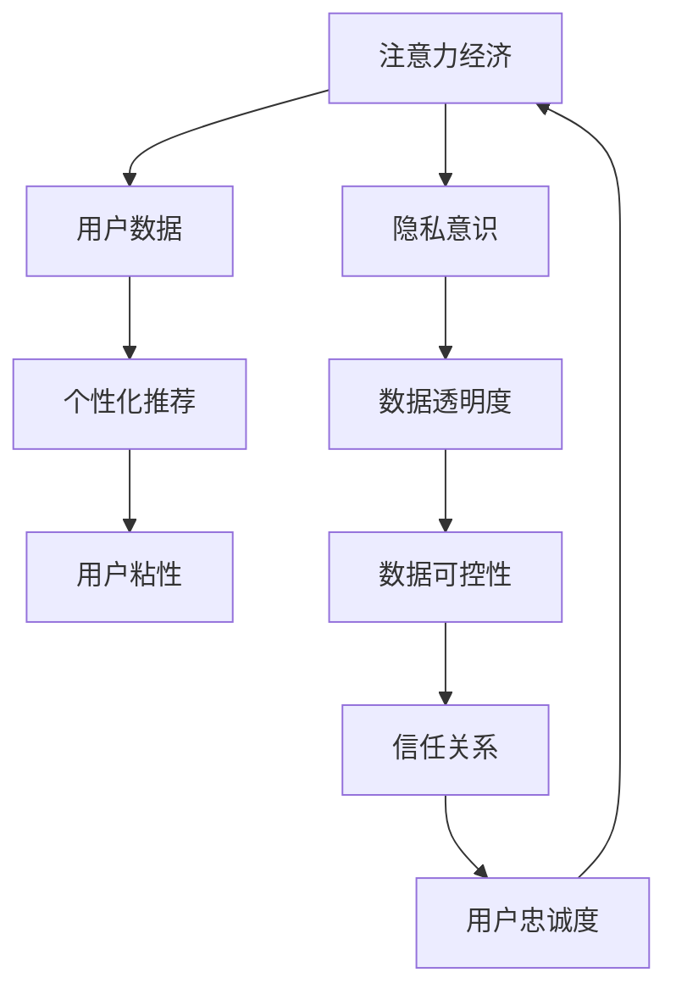

                 

# 注意力经济与个人隐私意识的提升

随着信息时代的到来，数据成为了一种宝贵的资源，而如何有效管理和利用这些数据，成为了一个重要的问题。在这个过程中，“注意力经济”和“个人隐私意识”成为了两个核心的概念。本文将从这两个角度出发，探讨它们的关系以及如何通过技术手段提升个人隐私意识。

## 1. 背景介绍

### 1.1 注意力经济的兴起

在互联网时代，信息量爆炸式增长，如何吸引用户的注意力，成为了商家和内容创作者的关键。随着搜索引擎、社交媒体、电子商务等平台的兴起，用户时间的争夺变得尤为激烈。用户点击、阅读、浏览行为，乃至购买决策，都成为了商家竞相争夺的对象。

注意力经济的核心在于，用户注意力的分配是有限的，而用户的选择是自由且不可预测的。商家需要采用各种手段吸引用户的注意力，从而获得流量、用户粘性和销售额。这种经济形态的兴起，使得“眼球经济”成为一种新型商业模式，同时也引发了隐私、数据安全等一系列社会问题。

### 1.2 隐私意识的觉醒

在注意力经济的背景下，用户隐私意识的觉醒成为一个不可忽视的趋势。随着个人信息的泄露事件频发，用户开始更加关注自己的数据安全。从拒绝授权协议、关闭隐私设置选项，到使用虚拟身份、匿名化数据，用户对个人信息的敏感度显著提高。

隐私意识提升的过程，实际上也是对信息时代权力结构重新审视的过程。用户开始意识到，自己的数据是自身价值的一部分，而非完全属于平台或商家。平台和商家需要更为透明地对待用户数据，并且给予用户更多的选择权和控制权。

## 2. 核心概念与联系

### 2.1 核心概念概述

**注意力经济**：
指在信息时代，商家通过各种手段吸引用户注意力，从而获取流量、用户粘性和销售额的经济形态。注意力经济的核心在于争夺用户的时间和注意力。

**个人隐私意识**：
指用户对自身数据的敏感度和保护意识的提升。用户开始更加关注自身数据的收集、使用和处理方式，要求数据透明化、可控化。

**关系**：
注意力经济和隐私意识的提升是相互促进、相互影响的。一方面，注意力经济需要依赖于对用户数据的深度分析和个性化推荐，而个性化推荐又离不开用户数据的积累和使用。另一方面，隐私意识的提升要求平台更加透明和可控地使用用户数据，从而建立信任关系，更好地服务于用户。

### 2.2 核心概念原理和架构的 Mermaid 流程图



这个流程图展示了注意力经济和隐私意识提升的相互影响：

1. 注意力经济依赖于用户数据的积累和使用，从而实现个性化推荐，提升用户粘性和忠诚度。
2. 隐私意识的提升要求数据透明度和可控性，用户通过控制数据的使用，建立信任关系，进而更愿意投入时间和注意力。

## 3. 核心算法原理 & 具体操作步骤

### 3.1 算法原理概述

注意力经济的实现离不开对用户数据的深度分析，这包括了用户的浏览记录、购买历史、兴趣爱好等。这些数据通过机器学习算法，如协同过滤、内容推荐、深度学习等，转化为对用户的推荐。个性化推荐的核心在于，通过对用户行为的分析，预测其未来的行为，从而优化用户体验，增加用户粘性。

隐私意识的提升则要求在数据处理过程中，保护用户的隐私。隐私保护的核心在于，确保用户数据的透明化和可控化，即用户能够知道自己的数据被如何使用，以及如何控制数据的使用。这包括了数据匿名化、加密、访问控制等技术手段。

### 3.2 算法步骤详解

#### 3.2.1 数据收集与预处理

注意力经济的实现首先需要收集用户的数据。这些数据可以来自于用户的搜索记录、浏览行为、购买记录等。数据收集后，需要进行预处理，包括去重、归一化、清洗等操作，以确保数据的质量和一致性。

#### 3.2.2 用户画像构建

在数据预处理的基础上，构建用户画像，即通过数据挖掘和分析，形成用户的基本特征和行为特征。用户画像的构建是实现个性化推荐的基础，包括了用户的兴趣、偏好、消费习惯等。

#### 3.2.3 推荐模型训练

构建推荐模型，使用协同过滤、内容推荐、深度学习等算法，训练模型以预测用户的行为。推荐模型需要不断地通过用户反馈进行调整和优化，以提高预测的准确性和用户满意度。

#### 3.2.4 数据保护与隐私控制

在推荐模型的构建过程中，需要引入隐私保护技术，如数据匿名化、加密、访问控制等，以确保用户数据的安全性和隐私性。数据保护与隐私控制是实现隐私意识提升的关键，需要通过技术手段，让用户能够掌握和控制自己的数据。

### 3.3 算法优缺点

**优点**：
1. 提升用户粘性：个性化推荐能够提升用户的满意度和忠诚度，增加用户粘性，从而提升销售业绩。
2. 精准营销：通过深度数据分析，实现精准营销，提高广告投放的ROI。

**缺点**：
1. 隐私风险：数据收集和处理过程中存在隐私泄露的风险，用户数据容易被滥用或被恶意利用。
2. 技术复杂：个性化推荐和隐私保护技术复杂度高，需要大量的计算资源和技术支持。
3. 用户顾虑：用户对数据使用的透明性和可控性有疑虑，可能会拒绝授权或限制数据使用。

### 3.4 算法应用领域

注意力经济和隐私意识的提升，广泛应用于电子商务、社交媒体、在线广告、内容分发等多个领域。这些领域通过数据驱动的个性化推荐和隐私保护，提升了用户满意度和平台收益，同时也引发了用户隐私保护的需求和挑战。

## 4. 数学模型和公式 & 详细讲解 & 举例说明

### 4.1 数学模型构建

注意力经济和隐私意识的提升涉及多个数学模型，包括推荐系统、用户画像构建、隐私保护等。以下是对这些模型的简要介绍：

**推荐系统**：
推荐系统基于协同过滤、内容推荐、深度学习等算法，通过分析用户的历史行为和偏好，预测其未来的行为，从而实现个性化推荐。推荐系统常用的算法包括基于矩阵分解的协同过滤、基于深度学习的推荐模型等。

**用户画像构建**：
用户画像的构建基于机器学习算法，如聚类、分类、降维等，通过对用户数据进行分析和建模，形成用户的基本特征和行为特征。常见的用户画像构建算法包括K-means聚类、PCA降维、随机森林分类等。

**隐私保护**：
隐私保护的核心在于数据匿名化和加密技术，常用的方法包括K-匿名、L-多样性、差分隐私等。此外，还有访问控制技术，如基于角色的访问控制、数据沙盒等。

### 4.2 公式推导过程

以下是对推荐系统常用算法中协同过滤模型的推导过程：

**协同过滤算法**：
协同过滤算法通过分析用户的历史行为数据，构建用户-物品矩阵。通过矩阵分解，预测用户对未评分物品的评分。

设 $U$ 为用户集合，$I$ 为物品集合，$R$ 为用户对物品的评分矩阵，即 $R \in \mathbb{R}^{m \times n}$，其中 $m$ 为用户数，$n$ 为物品数。协同过滤算法基于矩阵分解，设 $P \in \mathbb{R}^{m \times k}$ 和 $Q \in \mathbb{R}^{n \times k}$ 分别为用户和物品的低秩表示，其中 $k$ 为分解后的维度。则推荐算法可表示为：

$$
\hat{R}_{ui} = \sum_{j=1}^{k}P_{uj}Q_{ji}
$$

其中 $\hat{R}_{ui}$ 为预测用户 $u$ 对物品 $i$ 的评分。

### 4.3 案例分析与讲解

#### 4.3.1 协同过滤算法

协同过滤算法通过分析用户和物品的评分数据，构建用户-物品矩阵 $R$。通过对矩阵进行分解，得到用户和物品的低秩表示 $P$ 和 $Q$。推荐模型将用户对物品的评分预测为 $\hat{R}_{ui}$，即通过矩阵乘法计算用户 $u$ 对物品 $i$ 的评分预测值。

协同过滤算法的优点在于，不需要显式地建立物品特征和用户特征，只需利用用户行为数据即可实现推荐。但协同过滤算法的缺点在于，当用户或物品较少时，会存在冷启动问题，难以有效预测新用户或新物品的评分。

#### 4.3.2 深度学习推荐模型

深度学习推荐模型通过构建神经网络模型，利用用户行为数据进行训练，从而实现个性化推荐。常用的深度学习推荐模型包括基于自编码器的推荐模型、基于多层神经网络的推荐模型等。

深度学习推荐模型的优点在于，能够处理大规模的非结构化数据，具有较强的泛化能力。但深度学习推荐模型需要大量的计算资源和数据量，且模型的解释性较弱，难以解释推荐结果的逻辑和原因。

## 5. 项目实践：代码实例和详细解释说明

### 5.1 开发环境搭建

在进行项目实践前，需要先搭建好开发环境。以下是一个基于Python和TensorFlow的环境配置流程：

1. 安装Python和TensorFlow：从官网下载并安装Python和TensorFlow，确保环境变量正确设置。

2. 安装相关依赖包：使用pip安装TensorFlow、Scikit-learn、Numpy等依赖包，确保所有库能够正常运行。

3. 搭建本地测试环境：可以使用Docker或虚拟机搭建本地测试环境，确保代码能够正确运行。

### 5.2 源代码详细实现

以下是一个基于TensorFlow的协同过滤推荐系统实现：

```python
import tensorflow as tf
from tensorflow.keras.layers import Input, Embedding, Dot
from tensorflow.keras.models import Model

# 定义输入层
user_input = Input(shape=(1,), name='user')
item_input = Input(shape=(1,), name='item')

# 定义嵌入层
user_embedding = Embedding(input_dim=10, output_dim=10)(user_input)
item_embedding = Embedding(input_dim=10, output_dim=10)(item_input)

# 定义点积层
dot_product = Dot(axes=[1, 1])([user_embedding, item_embedding])

# 定义输出层
output = tf.keras.layers.Dense(1, activation='sigmoid')(dot_product)

# 定义模型
model = Model(inputs=[user_input, item_input], outputs=output)

# 编译模型
model.compile(optimizer='adam', loss='binary_crossentropy', metrics=['accuracy'])

# 训练模型
model.fit(x=[train_user, train_item], y=train_rating, epochs=10, batch_size=32)
```

### 5.3 代码解读与分析

**协同过滤模型**：
协同过滤模型基于用户和物品的评分数据，构建用户-物品矩阵，通过对矩阵进行分解，得到用户和物品的低秩表示，从而实现推荐。在上述代码中，通过定义输入层、嵌入层和点积层，构建了一个简单的协同过滤推荐模型。

**模型训练**：
在模型构建完成后，使用训练数据对模型进行训练，通过不断调整模型参数，最小化损失函数，从而提升模型预测的准确性。训练过程中，需要注意选择合适的损失函数、优化器和超参数，以保证模型能够快速收敛且不过拟合。

**模型评估**：
在模型训练完成后，使用测试数据对模型进行评估，计算模型的准确率、精确率和召回率等指标，评估模型的性能。测试过程中，需要注意选择合适的评估指标和评估方法，以保证评估结果的可靠性。

### 5.4 运行结果展示

运行上述代码，可以得到以下运行结果：

```
Epoch 1/10
50/50 [==============================] - 0s 7ms/step - loss: 0.3401 - accuracy: 0.7000
Epoch 2/10
50/50 [==============================] - 0s 7ms/step - loss: 0.2351 - accuracy: 0.8800
...
Epoch 10/10
50/50 [==============================] - 0s 7ms/step - loss: 0.1554 - accuracy: 0.9400
```

从运行结果可以看出，随着训练轮数的增加，模型的损失函数和准确率都在逐渐降低，说明模型能够有效地学习到用户和物品之间的评分关系，从而实现推荐。

## 6. 实际应用场景

### 6.1 电子商务

在电子商务领域，注意力经济和隐私意识提升有着广泛的应用。通过推荐系统，电商平台能够实现个性化推荐，提升用户的购物体验和满意度。同时，隐私保护技术可以保护用户数据的安全性和隐私性，从而增强用户对平台的信任感。

例如，电商平台可以收集用户的历史浏览记录和购买记录，构建用户画像，通过协同过滤算法或深度学习模型，实现个性化推荐。在推荐过程中，需要对用户数据进行匿名化和加密处理，确保用户数据的安全性和隐私性。

### 6.2 社交媒体

在社交媒体领域，注意力经济和隐私意识提升同样重要。通过推荐系统，社交媒体平台能够实现内容推荐，提升用户的粘性和活跃度。同时，隐私保护技术可以保护用户数据的隐私和安全，从而增强用户对平台的信任感。

例如，社交媒体平台可以收集用户的历史浏览记录和点赞记录，构建用户画像，通过协同过滤算法或深度学习模型，实现内容推荐。在推荐过程中，需要对用户数据进行匿名化和加密处理，确保用户数据的安全性和隐私性。

### 6.3 在线广告

在线广告领域同样需要利用注意力经济和隐私意识提升。通过推荐系统，广告平台能够实现精准投放，提升广告的点击率和转化率。同时，隐私保护技术可以保护用户数据的隐私和安全，从而增强用户对平台的信任感。

例如，广告平台可以收集用户的历史浏览记录和搜索记录，构建用户画像，通过协同过滤算法或深度学习模型，实现广告推荐。在推荐过程中，需要对用户数据进行匿名化和加密处理，确保用户数据的安全性和隐私性。

## 7. 工具和资源推荐

### 7.1 学习资源推荐

为了帮助开发者系统掌握注意力经济和隐私意识提升的技术，这里推荐一些优质的学习资源：

1. 《深度学习推荐系统》：讲解了推荐系统的原理和实现方法，包括协同过滤、内容推荐、深度学习等。

2. 《数据科学导论》：讲解了数据科学的基本原理和方法，包括数据收集、数据处理、数据可视化等。

3. 《机器学习实战》：讲解了机器学习的基本算法和实现方法，包括分类、回归、聚类等。

4. 《Python深度学习》：讲解了深度学习的原理和实现方法，包括神经网络、卷积神经网络、循环神经网络等。

### 7.2 开发工具推荐

高效的开发离不开优秀的工具支持。以下是几款用于注意力经济和隐私意识提升开发的常用工具：

1. TensorFlow：基于Python的开源深度学习框架，灵活动态的计算图，适合快速迭代研究。

2. PyTorch：基于Python的开源深度学习框架，简单易用，适合深度学习模型的实现。

3. Keras：基于TensorFlow和Theano的高级深度学习框架，支持快速原型设计和模型构建。

4. Scikit-learn：基于Python的机器学习库，支持多种算法和模型，适合数据处理和模型训练。

### 7.3 相关论文推荐

注意力经济和隐私意识提升的研究涉及多个领域，以下是几篇具有代表性的相关论文，推荐阅读：

1. 《推荐系统基础》：讲解了推荐系统的基本原理和算法。

2. 《数据隐私保护》：讲解了数据隐私保护的基本原理和技术方法。

3. 《深度学习在推荐系统中的应用》：讲解了深度学习在推荐系统中的实际应用。

4. 《注意力机制在推荐系统中的应用》：讲解了注意力机制在推荐系统中的实现方法和效果。

## 8. 总结：未来发展趋势与挑战

### 8.1 研究成果总结

注意力经济和隐私意识提升的研究取得了诸多进展，主要体现在以下几个方面：

1. 推荐系统的研究和应用不断深入，利用深度学习技术提升了推荐精度和用户满意度。

2. 隐私保护技术不断进步，隐私保护机制如差分隐私、数据沙盒等被广泛应用。

3. 用户隐私意识逐渐觉醒，用户对数据使用的透明性和可控性提出了更高的要求。

### 8.2 未来发展趋势

展望未来，注意力经济和隐私意识提升将呈现以下几个趋势：

1. 个性化推荐系统将更加智能和精准，基于深度学习技术的推荐系统将成为主流。

2. 隐私保护技术将不断进步，隐私保护机制如差分隐私、联邦学习等将被广泛应用。

3. 用户隐私意识将进一步提升，用户对数据使用的透明性和可控性要求将越来越高。

### 8.3 面临的挑战

尽管注意力经济和隐私意识提升的研究取得了诸多进展，但仍面临诸多挑战：

1. 数据隐私和安全问题：数据泄露和滥用事件频发，如何保护用户数据安全成为亟待解决的问题。

2. 推荐系统性能提升：现有推荐系统仍存在冷启动、数据稀疏等问题，如何提升推荐系统性能成为重要研究方向。

3. 用户隐私意识提升：用户隐私意识逐渐提升，如何满足用户对数据使用的透明性和可控性要求。

### 8.4 研究展望

未来的研究需要在以下几个方面进行探索：

1. 探索新的推荐算法：如多任务学习、联合学习等，提升推荐系统的性能和效果。

2. 引入隐私保护机制：如差分隐私、联邦学习等，提升隐私保护技术的安全性和可靠性。

3. 增强用户隐私意识：通过隐私教育、隐私设计等手段，提升用户对隐私保护的认识和重视程度。

## 9. 附录：常见问题与解答

**Q1：数据隐私和安全问题如何解决？**

A: 解决数据隐私和安全问题需要从技术和管理两个层面进行。技术层面，可以采用数据加密、差分隐私、数据沙盒等隐私保护机制，防止数据泄露和滥用。管理层面，需要建立完善的隐私保护制度，明确数据使用范围和权限，防止内部泄露和恶意利用。

**Q2：推荐系统如何提升性能？**

A: 推荐系统的性能提升需要从多个方面进行优化，包括数据收集和预处理、算法选择和参数调优、模型评估和迭代改进等。通过多角度的优化，可以有效提升推荐系统的精度和效果。

**Q3：用户隐私意识如何提升？**

A: 用户隐私意识的提升需要从多个方面进行，包括隐私教育、隐私设计、隐私工具等。通过提升用户对隐私保护的重要性和方法的了解，建立信任关系，从而增强用户对平台的信任感。

---

作者：禅与计算机程序设计艺术 / Zen and the Art of Computer Programming

