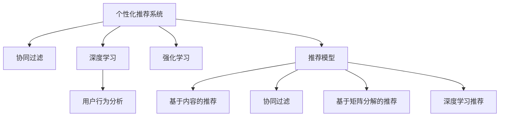

                 

# 注意力经济与个性化推荐算法：为受众提供定制、有针对性的内容

> 关键词：注意力经济,个性化推荐算法,推荐系统,用户行为分析,协同过滤,深度学习,强化学习,数据挖掘,推荐模型

## 1. 背景介绍

### 1.1 问题由来

在信息爆炸的时代，互联网用户每天都会接触到海量的信息，如何从庞杂的信息海洋中筛选出有价值的内容，是每一个互联网从业者面临的重大挑战。传统的内容推荐方式，如基于标签的推荐、基于内容的推荐等，往往不能有效适应用户的个性化需求。而个性化推荐系统则通过分析用户的历史行为，智能推荐用户可能感兴趣的内容，大幅提升了用户的信息消费体验。

随着个性化推荐系统的广泛应用，推荐效果逐渐成为平台的核心竞争力之一。优质的推荐算法不仅能带来良好的用户体验，还能显著提升平台的流量、用户粘性和收益。因此，如何设计高效、精准的个性化推荐算法，成为了各大互联网公司研究的热点话题。

### 1.2 问题核心关键点

个性化推荐系统通过收集用户的行为数据，分析用户的兴趣和需求，并利用数据挖掘、机器学习等技术，预测用户对特定内容的兴趣程度，从而提供有针对性的推荐内容。核心问题包括以下几个方面：

1. **用户行为数据的收集与处理**：如何高效、准确地获取用户的历史行为数据，并进行预处理和特征提取，是推荐系统设计的第一步。

2. **用户兴趣模型的建立**：如何通过机器学习模型，准确预测用户对内容的兴趣程度，是推荐系统的核心算法。

3. **推荐结果的排序与展示**：如何根据用户的兴趣程度和推荐策略，对推荐结果进行排序，并通过高效的展示机制，提高用户的点击率。

4. **系统的可扩展性与鲁棒性**：如何构建可扩展的推荐系统架构，确保在大量用户、多类型数据下的高效运行。

## 2. 核心概念与联系

### 2.1 核心概念概述

为更好地理解个性化推荐算法的原理和实现，本节将介绍几个密切相关的核心概念：

- **个性化推荐系统**：基于用户的历史行为数据和兴趣偏好，智能推荐用户可能感兴趣的内容的系统。
- **协同过滤**：通过分析用户之间相似性，推荐用户历史未访问过的内容。
- **深度学习**：利用深度神经网络进行特征学习和兴趣建模，实现高效、精准的推荐。
- **强化学习**：通过模拟用户点击行为，不断调整推荐策略，提升点击率和用户满意度。
- **推荐模型**：包括基于内容的推荐、协同过滤、基于矩阵分解的推荐、深度学习推荐等。
- **用户行为分析**：通过日志、点击、浏览等行为数据，分析用户兴趣和行为模式，指导推荐算法的设计。

这些核心概念之间的逻辑关系可以通过以下Mermaid流程图来展示：



这个流程图展示了个性化推荐系统的核心概念及其之间的关系：

1. 个性化推荐系统通过协同过滤、深度学习、强化学习等多种推荐模型，实现内容推荐。
2. 用户行为分析为推荐算法提供用户兴趣和行为模式。
3. 不同的推荐模型各有优缺点，可结合使用，提升推荐效果。

## 3. 核心算法原理 & 具体操作步骤
### 3.1 算法原理概述

个性化推荐算法的核心思想是通过用户的历史行为数据，分析用户的兴趣偏好，并预测用户对新内容的兴趣程度。推荐过程包括数据收集、特征提取、模型训练、推荐排序等多个步骤。其原理可概括如下：

1. **数据收集**：收集用户的行为数据，如点击、浏览、评分等，作为推荐算法的输入。
2. **特征提取**：将原始行为数据转换为模型的特征表示，方便模型学习和预测。
3. **模型训练**：利用机器学习算法，建立用户兴趣模型，对用户行为进行预测。
4. **推荐排序**：根据用户兴趣和内容特征，对推荐结果进行排序，提升用户满意度。

### 3.2 算法步骤详解

基于协同过滤的个性化推荐算法主要包括以下几个关键步骤：

**Step 1: 数据收集与预处理**

收集用户的行为数据，包括点击、浏览、评分等。常用的数据源包括网站日志、移动应用数据、社交网络数据等。对原始数据进行预处理，去除噪声和缺失值，并进行特征提取。常用的特征包括用户ID、物品ID、时间戳、点击次数、评分等。

**Step 2: 协同过滤模型训练**

利用协同过滤算法，建立用户和物品的相似度矩阵，识别用户兴趣。常用的协同过滤算法包括基于用户的协同过滤、基于物品的协同过滤、混合协同过滤等。

**Step 3: 用户兴趣预测**

通过协同过滤模型，预测用户对未访问过的物品的评分或兴趣程度。利用预测结果对物品进行排序，筛选出高兴趣的物品作为推荐结果。

**Step 4: 推荐结果展示**

根据用户的兴趣和行为模式，将推荐结果展示在合适的位置，提高用户的点击率和满意度。常用的展示策略包括热力图展示、轮播展示、横向展示等。

### 3.3 算法优缺点

基于协同过滤的个性化推荐算法具有以下优点：

1. **简单高效**：协同过滤算法不需要额外的特征工程，可以基于用户行为数据直接进行建模。
2. **鲁棒性好**：协同过滤算法对数据稀疏性有一定的容忍度，适用于用户行为稀疏的情况下。
3. **可解释性强**：协同过滤算法基于用户行为和物品相似度，能够提供较好的推荐解释。

同时，该算法也存在一定的局限性：

1. **数据稀疏性问题**：当用户行为数据稀疏时，协同过滤的效果会显著下降。
2. **冷启动问题**：对于新用户或新物品，协同过滤算法难以进行准确推荐。
3. **相似性度量问题**：如何设计合适的相似度度量方式，对协同过滤的性能至关重要。
4. **扩展性问题**：随着用户和物品数量的增加，协同过滤算法需要维护大量的相似度矩阵，存在计算复杂度高的问题。

### 3.4 算法应用领域

基于协同过滤的个性化推荐算法已经在多个领域得到了广泛应用，例如：

- 电商平台：推荐用户可能感兴趣的商品，提高销售额和用户粘性。
- 视频网站：推荐用户可能感兴趣的视频内容，提高用户留存率和点击率。
- 新闻平台：推荐用户可能感兴趣的新闻文章，提高用户阅读时间和点击率。
- 社交网络：推荐用户可能感兴趣的朋友或帖子，提升用户互动和活跃度。

除了上述这些经典应用外，协同过滤算法还被创新性地应用于音乐、图书、旅游等多个领域，为不同类型的平台带来了新的商业价值。

## 4. 数学模型和公式 & 详细讲解 & 举例说明

### 4.1 数学模型构建

本节将使用数学语言对基于协同过滤的个性化推荐算法进行更加严格的刻画。

假设用户集合为 $U$，物品集合为 $I$，历史行为数据矩阵为 $R \in \mathbb{R}^{m \times n}$，其中 $m$ 为用户的数量，$n$ 为物品的数量。用户对物品的评分向量为 $u \in \mathbb{R}^n$，物品的评分向量为 $i \in \mathbb{R}^m$。

定义用户 $u$ 对物品 $i$ 的评分预测值为 $\hat{r}_{ui}$，评分预测函数为 $f: \mathbb{R}^{m} \times \mathbb{R}^n \rightarrow \mathbb{R}$。则协同过滤模型的目标是最小化预测误差，即：

$$
\mathcal{L} = \sum_{(u,i)\in R} (r_{ui} - \hat{r}_{ui})^2
$$

其中 $r_{ui}$ 为用户的实际评分，$\hat{r}_{ui}$ 为预测评分。通过最小化上述目标函数，可以学习出最佳的评分预测函数 $f$。

### 4.2 公式推导过程

假设评分预测函数 $f$ 为线性函数：

$$
\hat{r}_{ui} = w^T (u + i)
$$

其中 $w$ 为预测函数的权重向量。通过梯度下降算法，更新权重 $w$，使得预测误差最小化：

$$
w \leftarrow w - \eta \nabla_{w}\mathcal{L}
$$

其中 $\eta$ 为学习率，$\nabla_{w}\mathcal{L}$ 为损失函数对权重 $w$ 的梯度。

### 4.3 案例分析与讲解

以基于用户的协同过滤为例，其原理如下：

1. **计算用户和物品的相似度**：计算用户 $u$ 和物品 $i$ 之间的相似度 $s_{ui}$，常用的相似度度量方式包括余弦相似度、皮尔逊相关系数、余弦距离等。
2. **计算物品的预测评分**：根据相似度 $s_{ui}$ 和用户 $u$ 的历史评分 $r_{ui}$，预测物品 $i$ 的评分 $\hat{r}_{ui}$。
3. **推荐结果排序**：对所有物品的预测评分进行排序，将评分较高的物品推荐给用户。

具体实现中，可以使用矩阵分解技术，将原始的评分矩阵 $R$ 分解为用户矩阵 $U$ 和物品矩阵 $I$ 的乘积，即：

$$
R \approx U \times I
$$

其中 $U \in \mathbb{R}^{m \times k}$，$I \in \mathbb{R}^{n \times k}$，$k$ 为分解的维度。通过最大化 $R$ 和 $U \times I$ 的相关系数，可以学习出最佳的 $U$ 和 $I$。

## 5. 项目实践：代码实例和详细解释说明
### 5.1 开发环境搭建

在进行个性化推荐系统开发前，我们需要准备好开发环境。以下是使用Python进行PyTorch开发的环境配置流程：

1. 安装Anaconda：从官网下载并安装Anaconda，用于创建独立的Python环境。

2. 创建并激活虚拟环境：
```bash
conda create -n pytorch-env python=3.8 
conda activate pytorch-env
```

3. 安装PyTorch：根据CUDA版本，从官网获取对应的安装命令。例如：
```bash
conda install pytorch torchvision torchaudio cudatoolkit=11.1 -c pytorch -c conda-forge
```

4. 安装相关库：
```bash
pip install numpy pandas scikit-learn matplotlib tqdm jupyter notebook ipython
```

完成上述步骤后，即可在`pytorch-env`环境中开始开发。

### 5.2 源代码详细实现

这里我们以电商平台的个性化推荐系统为例，给出使用PyTorch进行协同过滤的代码实现。

首先，定义评分预测函数：

```python
import torch
import torch.nn as nn

class RMSEstimator(nn.Module):
    def __init__(self, num_users, num_items, embed_dim):
        super(RMSEstimator, self).__init__()
        self.user_embed = nn.Embedding(num_users, embed_dim)
        self.item_embed = nn.Embedding(num_items, embed_dim)
        self.fc = nn.Linear(2*embed_dim, 1)
        
    def forward(self, user_id, item_id):
        user = self.user_embed(user_id)
        item = self.item_embed(item_id)
        scores = self.fc(torch.cat([user, item], dim=1))
        return scores
```

然后，定义训练和评估函数：

```python
from sklearn.metrics import mean_squared_error

def train_epoch(model, optimizer, data_loader):
    model.train()
    epoch_loss = 0
    for batch in data_loader:
        user_id, item_id, label = batch
        scores = model(user_id, item_id)
        loss = mean_squared_error(scores, label)
        optimizer.zero_grad()
        loss.backward()
        optimizer.step()
        epoch_loss += loss.item()
    return epoch_loss / len(data_loader)

def evaluate(model, data_loader):
    model.eval()
    mse = 0
    for batch in data_loader:
        user_id, item_id, label = batch
        scores = model(user_id, item_id)
        mse += mean_squared_error(scores, label)
    return mse / len(data_loader)
```

最后，启动训练流程并在测试集上评估：

```python
epochs = 10
batch_size = 32
learning_rate = 0.01

# 准备数据
train_loader = ...
dev_loader = ...
test_loader = ...

# 定义模型和优化器
model = RMSEstimator(num_users, num_items, embed_dim)
optimizer = torch.optim.Adam(model.parameters(), lr=learning_rate)

# 训练模型
for epoch in range(epochs):
    loss = train_epoch(model, optimizer, train_loader)
    print(f"Epoch {epoch+1}, train loss: {loss:.3f}")
    
    print(f"Epoch {epoch+1}, dev results:")
    mse = evaluate(model, dev_loader)
    print(f"Dev MSE: {mse:.3f}")
    
print("Test results:")
mse = evaluate(model, test_loader)
print(f"Test MSE: {mse:.3f}")
```

以上就是使用PyTorch进行协同过滤的代码实现。可以看到，使用PyTorch可以方便地定义评分预测函数、训练函数和评估函数，大大简化了模型训练的流程。

### 5.3 代码解读与分析

让我们再详细解读一下关键代码的实现细节：

**RMSEstimator类**：
- `__init__`方法：初始化用户和物品的嵌入向量，以及全连接层。
- `forward`方法：前向传播计算预测评分，输入为user_id和item_id。

**train_epoch函数**：
- 将模型设置为训练模式。
- 循环遍历数据批，计算预测评分和真实标签的均方误差。
- 反向传播更新模型参数，计算当前epoch的平均损失。

**evaluate函数**：
- 将模型设置为评估模式。
- 循环遍历数据批，计算预测评分和真实标签的均方误差。
- 返回所有批次的均方误差平均值。

**训练流程**：
- 定义总的epoch数和批大小。
- 循环epoch，每次在训练集上进行训练，输出当前epoch的平均损失。
- 在验证集上评估，输出验证集均方误差。
- 在测试集上评估，输出测试集均方误差。

可以看到，PyTorch提供了完整的框架，使得协同过滤的代码实现变得简洁高效。开发者可以将更多精力放在数据处理、模型改进等高层逻辑上，而不必过多关注底层的实现细节。

当然，工业级的系统实现还需考虑更多因素，如模型的保存和部署、超参数的自动搜索、更灵活的任务适配层等。但核心的协同过滤范式基本与此类似。

## 6. 实际应用场景
### 6.1 电商平台推荐

基于协同过滤的个性化推荐系统可以广泛应用于电商平台推荐。通过分析用户的历史浏览、购买、收藏等行为数据，推荐用户可能感兴趣的商品，提高用户的购物体验和销售额。

在技术实现上，可以收集用户的商品浏览记录，将浏览行为转化为评分向量，利用协同过滤算法对商品进行推荐。推荐结果可以通过图片展示、文字推荐等形式，根据用户的点击反馈不断优化推荐策略，提升用户满意度。

### 6.2 视频网站推荐

视频网站的推荐系统同样可以利用协同过滤算法，推荐用户可能感兴趣的视频内容。通过分析用户的历史播放记录、点赞、收藏等行为数据，预测用户对不同视频的兴趣程度，进行推荐排序。推荐结果可以通过视频缩略图、标题、简介等形式，提升用户的观看体验。

### 6.3 新闻平台推荐

新闻平台可以利用协同过滤算法，推荐用户可能感兴趣的新闻内容。通过分析用户的阅读历史、点赞、评论等行为数据，预测用户对不同新闻的兴趣程度，进行推荐排序。推荐结果可以通过新闻标题、摘要、图片等形式，提高用户的阅读时间和点击率。

### 6.4 未来应用展望

随着协同过滤算法的不断发展，基于协同过滤的推荐系统将在更多领域得到应用，为各行业带来变革性影响。

在智慧医疗领域，推荐系统可以根据患者的历史治疗记录，推荐最合适的治疗方案。在智能教育领域，推荐系统可以根据学生的学习历史，推荐最适合的学习资料和课程。在金融理财领域，推荐系统可以根据用户的投资历史，推荐最适合的投资产品。

此外，在更多领域，如社交网络、旅游、娱乐等，基于协同过滤的推荐系统也将不断涌现，为各行业带来新的商业价值和用户体验提升。相信随着协同过滤算法的持续演进，推荐系统将在更广阔的应用领域大放异彩，为各行各业提供更加精准、个性化的推荐服务。

## 7. 工具和资源推荐
### 7.1 学习资源推荐

为了帮助开发者系统掌握协同过滤的原理和实践技巧，这里推荐一些优质的学习资源：

1. 《推荐系统实战》系列书籍：详细介绍了推荐系统的理论基础和实践技巧，是推荐系统学习的经典入门读物。

2. CS224N《深度学习自然语言处理》课程：斯坦福大学开设的NLP明星课程，有Lecture视频和配套作业，带你入门推荐系统的核心概念。

3. 《协同过滤推荐系统》论文：介绍了协同过滤算法的基本原理和算法实现，是协同过滤学习的必读论文。

4. KDD Cup 2016 dataset：推荐系统学习的经典数据集，提供了大规模的推荐数据和标签，适合协同过滤算法的实验和研究。

5. ALS算法介绍：介绍了交替最小二乘算法（Alternating Least Squares, ALS）的原理和实现，是协同过滤算法的重要组成部分。

通过对这些资源的学习实践，相信你一定能够快速掌握协同过滤的精髓，并用于解决实际的推荐问题。
###  7.2 开发工具推荐

高效的开发离不开优秀的工具支持。以下是几款用于协同过滤推荐系统开发的常用工具：

1. PyTorch：基于Python的开源深度学习框架，灵活动态的计算图，适合快速迭代研究。大部分推荐系统都有PyTorch版本的实现。

2. TensorFlow：由Google主导开发的开源深度学习框架，生产部署方便，适合大规模工程应用。同样有丰富的推荐系统资源。

3. Surprise：Scikit-learn支持的推荐系统库，包含多种协同过滤算法实现，适合学术研究和工业应用。

4. AltRank：一种基于梯度下降的协同过滤算法，适用于大规模数据集。

5. TrustRank：一种基于图模型的协同过滤算法，通过引入节点信任度，提高推荐效果。

6. KNN推荐：一种基于用户相似性的协同过滤算法，适用于小规模数据集。

合理利用这些工具，可以显著提升协同过滤推荐系统的开发效率，加快创新迭代的步伐。

### 7.3 相关论文推荐

协同过滤推荐系统的研究起源于学界的持续研究。以下是几篇奠基性的相关论文，推荐阅读：

1. TrustRank: Fusion of Matrix and Trust-based Collaborative Filtering for Recommendation Systems：提出TrustRank算法，结合用户相似度和节点信任度，提高推荐效果。

2. Alternating Least Squares for Collaborative Filtering（ALS）：介绍交替最小二乘算法，是协同过滤算法的重要组成部分。

3. Beyond Recommendation: A Model-Based Perspective on Recommender Systems：从模型角度综述推荐系统的发展历程和未来趋势，是推荐系统学习的经典论文。

4. Efficient Matrix Factorization for Mining Massive Datasets：介绍基于矩阵分解的协同过滤算法，适用于大规模数据集。

5. Scalable Collaborative Filtering for Online Retail Environments：介绍可扩展的在线推荐算法，适用于高并发的电商推荐系统。

这些论文代表了大语言模型微调技术的发展脉络。通过学习这些前沿成果，可以帮助研究者把握学科前进方向，激发更多的创新灵感。

## 8. 总结：未来发展趋势与挑战

### 8.1 总结

本文对基于协同过滤的个性化推荐算法进行了全面系统的介绍。首先阐述了个性化推荐系统的研究背景和意义，明确了协同过滤算法在推荐系统中的重要地位。其次，从原理到实践，详细讲解了协同过滤算法的数学模型和关键步骤，给出了推荐系统开发的完整代码实例。同时，本文还广泛探讨了协同过滤算法在电商、视频、新闻等多个行业领域的应用前景，展示了协同过滤算法的巨大潜力。此外，本文精选了协同过滤算法的各类学习资源，力求为读者提供全方位的技术指引。

通过本文的系统梳理，可以看到，基于协同过滤的个性化推荐算法在推荐系统设计中扮演了重要角色。协同过滤算法通过用户行为数据，建立用户和物品的相似度，预测用户对新物品的兴趣程度，从而实现个性化的推荐服务。未来，伴随推荐算法的不断发展，推荐系统必将在更多领域得到应用，为各行各业带来新的商业价值和用户体验提升。

### 8.2 未来发展趋势

展望未来，协同过滤推荐系统将呈现以下几个发展趋势：

1. **可扩展性增强**：随着推荐系统服务用户数量和推荐数据量的增长，算法需要在更大规模的数据集上进行训练和预测，提高系统的可扩展性。

2. **鲁棒性提升**：面对复杂的用户行为数据和多维度的推荐场景，推荐算法需要具备更高的鲁棒性和适应性，以应对数据的不确定性和噪声。

3. **多模态融合**：传统的协同过滤算法往往只能处理文本或图片数据，未来需要拓展到音频、视频等多模态数据的融合，提高推荐模型的全面性。

4. **实时推荐**：在直播、新闻推荐等场景中，需要实时动态生成推荐结果，提高用户的即时反馈和满意度。

5. **混合推荐**：将协同过滤算法与其他推荐算法（如基于内容的推荐、深度学习推荐等）进行融合，实现更加多样化的推荐服务。

6. **用户行为预测**：利用深度学习等算法，对用户行为进行预测和建模，提升推荐算法的精准度和稳定性。

以上趋势凸显了协同过滤推荐系统的广阔前景。这些方向的探索发展，必将进一步提升推荐系统的性能和应用范围，为各行各业带来新的商业价值和用户体验提升。

### 8.3 面临的挑战

尽管协同过滤推荐系统已经取得了瞩目成就，但在迈向更加智能化、普适化应用的过程中，它仍面临着诸多挑战：

1. **数据稀疏性问题**：协同过滤算法对数据稀疏性有一定的容忍度，但在用户行为数据稀疏的情况下，效果会显著下降。

2. **冷启动问题**：对于新用户或新物品，协同过滤算法难以进行准确推荐。

3. **推荐结果多样性问题**：协同过滤算法往往只能推荐少数高兴趣的物品，难以处理长尾物品的推荐。

4. **推荐效果稳定性和一致性**：如何保证推荐结果的一致性和稳定性，避免推荐算法的随机性和不稳定。

5. **推荐系统安全性问题**：推荐系统容易受到恶意数据攻击，如恶意点击、恶意推荐等，需要设计安全机制进行防护。

6. **推荐系统隐私问题**：推荐系统需要收集大量的用户行为数据，如何保护用户隐私，避免数据泄露和滥用，也是亟待解决的问题。

正视协同过滤推荐系统面临的这些挑战，积极应对并寻求突破，将是大规模推荐系统迈向成熟的必由之路。相信随着学界和产业界的共同努力，这些挑战终将一一被克服，协同过滤推荐系统必将在构建人机协同的智能时代中扮演越来越重要的角色。

### 8.4 未来突破

面对协同过滤推荐系统所面临的种种挑战，未来的研究需要在以下几个方面寻求新的突破：

1. **多模态推荐**：将协同过滤算法与其他推荐算法（如基于内容的推荐、深度学习推荐等）进行融合，实现更加多样化的推荐服务。

2. **混合推荐**：将协同过滤算法与基于矩阵分解、深度学习等算法进行融合，实现更加精准和鲁棒的推荐效果。

3. **实时推荐**：利用流式学习等算法，对用户行为数据进行实时分析和推荐，提高推荐系统的实时性和用户体验。

4. **用户行为预测**：利用深度学习等算法，对用户行为进行预测和建模，提升推荐算法的精准度和稳定性。

5. **推荐系统安全性**：设计推荐系统的安全机制，防止恶意点击、恶意推荐等攻击，保障系统的安全性和可靠性。

6. **推荐系统隐私保护**：设计隐私保护算法，如差分隐私、联邦学习等，保护用户隐私，避免数据泄露和滥用。

这些研究方向的探索，必将引领协同过滤推荐系统技术迈向更高的台阶，为构建安全、可靠、可解释、可控的智能系统铺平道路。面向未来，协同过滤推荐系统还需要与其他人工智能技术进行更深入的融合，如知识表示、因果推理、强化学习等，多路径协同发力，共同推动推荐系统的进步。只有勇于创新、敢于突破，才能不断拓展推荐系统的边界，让智能技术更好地造福人类社会。

## 9. 附录：常见问题与解答

**Q1：协同过滤算法的训练数据要求有哪些？**

A: 协同过滤算法需要大量的用户行为数据，包括点击、浏览、评分等。数据的质量和数量对推荐效果至关重要。数据稀疏性问题会显著影响推荐效果，因此需要尽可能收集完整、丰富的行为数据。

**Q2：协同过滤算法如何处理数据稀疏性问题？**

A: 协同过滤算法对数据稀疏性有一定的容忍度，但在用户行为数据稀疏的情况下，效果会显著下降。常见的处理方式包括：

1. **填充数据**：对稀疏的评分矩阵进行填充，填补缺失值。
2. **降低维度**：通过奇异值分解（SVD）等方法，降低矩阵的维度，减少计算复杂度。
3. **稀疏矩阵分解**：使用稀疏矩阵分解技术，处理大规模稀疏矩阵，提高计算效率。

**Q3：协同过滤算法如何处理冷启动问题？**

A: 冷启动问题是指对于新用户或新物品，协同过滤算法难以进行准确推荐。常见的处理方式包括：

1. **物品推荐**：对于新物品，可以利用其他物品的评分数据进行推荐，提高推荐准确性。
2. **模型初始化**：利用用户和物品的特征向量进行模型初始化，提高模型的初始化效果。
3. **用户行为预测**：利用深度学习等算法，对用户行为进行预测和建模，提升推荐算法的精准度。

**Q4：协同过滤算法的推荐结果多样性问题如何解决？**

A: 推荐结果多样性问题是指协同过滤算法往往只能推荐少数高兴趣的物品，难以处理长尾物品的推荐。常见的解决方式包括：

1. **基于物品的协同过滤**：相对于基于用户的协同过滤，基于物品的协同过滤更加注重物品之间的相似性，有助于推荐长尾物品。
2. **混合推荐**：将协同过滤算法与其他推荐算法（如基于内容的推荐、深度学习推荐等）进行融合，实现更加多样化的推荐服务。
3. **多样性约束**：在推荐结果排序时，加入多样性约束，避免推荐结果过于集中。

**Q5：协同过滤算法的推荐效果稳定性和一致性如何保障？**

A: 推荐效果稳定性和一致性是指推荐结果的一致性和稳定性，避免推荐算法的随机性和不稳定。常见的保障方式包括：

1. **离线评估**：在训练完成后，对推荐系统进行离线评估，检验推荐效果的一致性。
2. **在线A/B测试**：通过在线A/B测试，对比不同算法的推荐效果，优化推荐策略。
3. **流式学习**：利用流式学习算法，实时更新推荐模型，保持推荐效果的一致性和稳定性。

总之，协同过滤推荐系统需要在数据、算法、工程、业务等多个维度协同发力，才能真正实现智能化、普适化的推荐服务。只有不断优化算法、提高数据质量、保障系统安全，才能不断提升推荐系统的性能和用户体验。

---

作者：禅与计算机程序设计艺术 / Zen and the Art of Computer Programming

