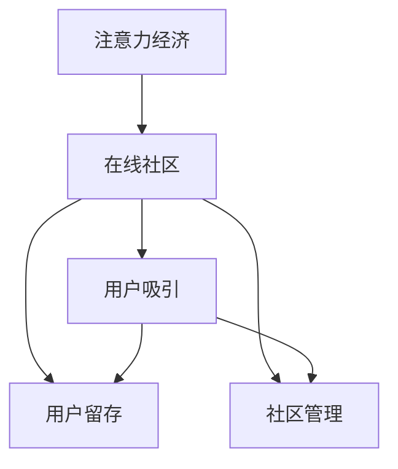

                 

# 注意力经济与在线社区建设策略与实践：吸引并留住受众

> 关键词：注意力经济, 在线社区, 受众吸引, 用户留存, 社区管理

## 1. 背景介绍

### 1.1 问题由来
随着互联网技术的迅速发展，在线社区已成为现代社会中不可或缺的一部分。这些社区不仅为人们提供了信息交流、知识共享的平台，还促进了社交、娱乐、商业等多方面的互动。然而，如何吸引更多的用户加入社区，以及如何维持用户长期活跃，已经成为在线社区建设中的一个重要问题。

### 1.2 问题核心关键点
在线社区的建设和发展，依赖于对注意力经济（Attention Economy）的深刻理解和应用。注意力经济是指在信息过载的时代，吸引并保持用户注意力的过程。通过有效的策略和实践，可以吸引并留住更多用户，提升社区的用户价值和商业价值。

### 1.3 问题研究意义
研究注意力经济与在线社区建设策略，对于推动社区的持续发展和优化用户体验具有重要意义：

1. 提升社区活跃度。通过精准的策略设计，可以吸引更多用户参与社区互动，增加内容的创造和消费，从而提升社区的活跃度。
2. 增加用户粘性。合理的社区管理和运营，能够增强用户对社区的依赖感，促进长期留存。
3. 创造商业价值。社区用户的增长和活跃，能够吸引更多的广告和商业合作，创造更高的商业价值。
4. 促进社会进步。在线社区不仅是信息交流的平台，也是社会发展的助推器，通过社区建设可以推动知识的普及和社会的进步。

## 2. 核心概念与联系

### 2.1 核心概念概述

为更好地理解注意力经济与在线社区建设策略，本节将介绍几个密切相关的核心概念：

- 注意力经济（Attention Economy）：在信息爆炸的时代，吸引并保持用户注意力成为关键。通过优质内容和互动设计，提高用户对社区的关注和参与度。
- 在线社区（Online Community）：以互联网为媒介，用户可以在其中交流信息、分享经验、参与讨论。
- 用户吸引（User Acquisition）：通过各种手段吸引潜在用户加入社区的过程。
- 用户留存（User Retention）：维持用户在社区中的长期活跃和忠诚度。
- 社区管理（Community Management）：通过有效的策略和实践，维持社区的健康发展，促进用户互动和内容创造。

这些概念之间的逻辑关系可以通过以下Mermaid流程图来展示：



这个流程图展示了几者之间的联系：

1. 注意力经济是社区建设的基础，吸引用户加入社区。
2. 用户吸引和社区管理是吸引用户并保持用户活跃度的关键措施。
3. 用户留存是社区长期发展的关键指标。

## 3. 核心算法原理 & 具体操作步骤
### 3.1 算法原理概述

注意力经济与在线社区建设策略的核心在于如何设计有效的互动机制，以吸引和保持用户的注意力。这涉及到以下几个关键点：

- 内容质量：通过优质的内容吸引用户关注。
- 互动设计：通过互动设计增强用户参与度。
- 社区管理：通过合理的社区规则和运营策略，保持社区的健康发展。

基于上述原则，设计社区建设策略时，需要考虑以下几个方面：

- 如何设计高质量的内容，吸引用户关注。
- 如何设计有效的互动机制，增强用户参与度。
- 如何制定合理的社区规则和运营策略，保持社区健康。

### 3.2 算法步骤详解

构建一个成功的在线社区，通常需要经历以下几个关键步骤：

**Step 1: 需求分析与用户画像构建**
- 确定社区的目标用户群体，进行需求分析和用户画像构建。
- 分析用户的行为习惯、兴趣爱好、痛点需求等，为后续内容设计和互动机制提供依据。

**Step 2: 内容设计与推荐算法**
- 设计符合用户需求的内容形式和主题，如图文、视频、论坛等。
- 引入推荐算法，如协同过滤、基于内容的推荐等，为用户推荐感兴趣的内容。

**Step 3: 互动机制设计**
- 设计多样化的互动形式，如点赞、评论、分享、直播等。
- 引入激励机制，如积分、徽章、排行榜等，提升用户参与度。

**Step 4: 社区管理与运营**
- 制定合理的社区规则，如反垃圾信息、反网络欺凌等。
- 定期进行社区运营，如清理无效内容、组织线上活动等。

**Step 5: 数据监控与优化**
- 监控社区的用户活跃度和内容质量，收集反馈信息。
- 根据反馈数据和分析结果，不断优化内容和互动机制。

### 3.3 算法优缺点

注意力经济与在线社区建设策略具有以下优点：
1. 提高用户参与度。通过优质的内容和互动机制，可以吸引更多用户参与社区互动，增加内容的创造和消费。
2. 增强用户粘性。合理的社区管理策略可以增强用户对社区的依赖感，促进长期留存。
3. 创造商业价值。社区用户的增长和活跃，能够吸引更多的广告和商业合作，创造更高的商业价值。
4. 推动社会进步。在线社区不仅是信息交流的平台，也是社会发展的助推器，通过社区建设可以推动知识的普及和社会的进步。

同时，这些策略也存在一定的局限性：
1. 资源消耗大。设计高质量的内容和互动机制，需要大量的资源和时间投入。
2. 需要持续优化。用户需求和市场环境不断变化，社区策略需要持续优化才能保持竞争力。
3. 易受恶意行为影响。社区管理中需防范垃圾信息、网络欺凌等恶意行为，维护社区健康。

尽管存在这些局限性，但就目前而言，注意力经济与在线社区建设策略仍是大社区建设的主流范式。未来相关研究的重点在于如何进一步降低资源消耗，提高策略的灵活性和可持续性，同时兼顾社区的伦理和道德标准。

### 3.4 算法应用领域

注意力经济与在线社区建设策略已经在多个领域得到了广泛应用，例如：

- 社交网络：如微信、微博、QQ群等。通过设计优质内容和互动机制，吸引和留住用户。
- 知识分享社区：如知乎、CSDN等。通过专业知识分享和互动，提升用户参与度。
- 娱乐社区：如抖音、B站等。通过娱乐内容创作和互动，增强用户粘性。
- 电子商务平台：如淘宝、京东等。通过用户评论和互动，提升用户购买体验。

除了上述这些经典领域外，在线社区建设策略还被创新性地应用到更多场景中，如虚拟现实社交、在线教育、健康咨询等，为不同行业带来了新的机会。

## 4. 数学模型和公式 & 详细讲解 & 举例说明（备注：数学公式请使用latex格式，latex嵌入文中独立段落使用 $$，段落内使用 $)
### 4.1 数学模型构建

本节将使用数学语言对注意力经济与在线社区建设策略进行更加严格的刻画。

记社区的活跃用户数为 $U$，日活跃用户数为 $D$，平均留存时间为 $T$，新用户引入率为 $R$，用户流失率为 $L$。假设用户数为时间 $t$ 的函数，即 $U(t)$。

用户留存和流失可以分别建模为：
$$
U(t+1) = (1-R+L)U(t) + RU^*(t)
$$
其中 $U^*(t)$ 为时间 $t$ 内引入的新用户数。

用户活跃度的影响因素包括内容质量、互动机制、社区管理等，设社区质量指数为 $Q$，互动指数为 $I$，社区管理指数为 $M$，则用户活跃度 $A$ 可以表示为：
$$
A = f(Q, I, M)
$$
其中 $f$ 为非线性函数，反映了社区质量、互动机制和管理策略对用户活跃度的综合影响。

### 4.2 公式推导过程

以下是用户留存和活跃度的推导过程：

用户留存模型可以转化为线性差分方程：
$$
\frac{U(t+1) - U(t)}{U(t)} = -R + L + \frac{R}{U(t)}
$$
令 $\delta = \frac{U(t+1) - U(t)}{U(t)}$，则上式可以转化为：
$$
\delta = -R + L + \frac{R}{U(t)}
$$
对方程两边同时积分，得到：
$$
\int_{0}^{t} \delta dt = -RT + Lt + \int_{0}^{t} \frac{R}{U(t)} dt
$$
代入 $\delta$ 表达式，得：
$$
U(t) - U(0) = -RT^2 + Lt^2 + \int_{0}^{t} \frac{R}{U(t)} dt
$$
进一步简化，得：
$$
U(t) = U(0) - RT^2 + Lt^2 + R\int_{0}^{t} \frac{1}{U(s)} ds
$$

用户活跃度 $A$ 的建模较为复杂，通常需要结合社区的具体特点和用户行为数据进行建模。常用的模型包括：

- 逻辑回归模型：用于预测用户是否会继续使用社区，可以加入时间、用户特征等因素。
- 随机森林模型：通过组合多个决策树，提升预测的准确性和稳定性。
- 深度学习模型：如RNN、LSTM等，可以更好地捕捉时间序列数据中的动态变化。

在实际应用中，还需要结合业务场景进行适当的调整和优化，以获得最佳的预测效果。

### 4.3 案例分析与讲解

以知乎社区为例，分析如何通过高质量内容、互动机制和社区管理，提升用户留存和活跃度。

**案例背景**：
知乎是一个以知识分享和问答为主的在线社区，拥有大量高质量的原创内容。为了提升用户留存和活跃度，知乎引入了推荐算法和互动机制。

**步骤详解**：
1. 需求分析与用户画像构建
   - 分析用户的行为数据，如浏览、点赞、评论等，构建用户画像。
   - 针对不同兴趣的用户群体，设计适合的内容形式和互动机制。

2. 内容设计与推荐算法
   - 引入协同过滤算法，根据用户的历史行为推荐相关问题。
   - 设计专家推荐机制，邀请领域专家进行高质量内容创作。

3. 互动机制设计
   - 设计点赞、评论、分享等互动形式，提升用户参与度。
   - 引入激励机制，如积分、徽章等，鼓励用户积极互动。

4. 社区管理与运营
   - 制定反垃圾信息、反网络欺凌等社区规则，维护社区健康。
   - 定期进行社区运营，如清理无效内容、组织线上活动等。

**效果分析**：
- 通过推荐算法，用户能够更快地找到感兴趣的问题，提升了用户的活跃度。
- 专家推荐机制吸引了大量高质量内容，提升了社区的整体质量。
- 互动机制和激励机制增强了用户参与感，提升了用户的留存率。

## 5. 项目实践：代码实例和详细解释说明
### 5.1 开发环境搭建

在进行社区建设策略的实践前，我们需要准备好开发环境。以下是使用Python进行社区建设策略的开发环境配置流程：

1. 安装Anaconda：从官网下载并安装Anaconda，用于创建独立的Python环境。

2. 创建并激活虚拟环境：
```bash
conda create -n community-env python=3.8 
conda activate community-env
```

3. 安装PyTorch：基于Python的开源深度学习框架，适合用于复杂的数据处理和模型训练。

4. 安装NumPy、Pandas、Scikit-Learn等数据处理库：
```bash
pip install numpy pandas scikit-learn
```

5. 安装社区管理和互动机制所需的库：
```bash
pip install flask redis socketio
```

完成上述步骤后，即可在`community-env`环境中开始社区建设策略的开发。

### 5.2 源代码详细实现

下面以知乎社区为例，给出使用Python进行社区建设策略开发的代码实现。

首先，定义社区的用户活跃度预测模型：

```python
from sklearn.linear_model import LogisticRegression
from sklearn.ensemble import RandomForestClassifier
from sklearn.metrics import accuracy_score

# 定义逻辑回归模型
model_logit = LogisticRegression()

# 定义随机森林模型
model_rf = RandomForestClassifier()

# 训练和测试数据
X_train = ...
y_train = ...
X_test = ...
y_test = ...

# 训练逻辑回归模型
model_logit.fit(X_train, y_train)

# 训练随机森林模型
model_rf.fit(X_train, y_train)

# 测试模型并输出结果
y_pred_logit = model_logit.predict(X_test)
y_pred_rf = model_rf.predict(X_test)
print('Logistic Regression Accuracy:', accuracy_score(y_test, y_pred_logit))
print('Random Forest Accuracy:', accuracy_score(y_test, y_pred_rf))
```

然后，定义社区的内容推荐算法：

```python
from sklearn.metrics.pairwise import cosine_similarity
import numpy as np

# 定义协同过滤推荐算法
def collaborative_filtering(X_train, y_train, X_test, y_test):
    # 计算用户相似度
    similarity_matrix = cosine_similarity(X_train)
    
    # 计算每个问题的相似度
    similarity_scores = np.dot(X_train, similarity_matrix)
    
    # 预测用户是否会关注某个问题
    y_pred = np.dot(similarity_scores, y_train)
    
    # 返回预测结果
    return y_pred
```

最后，定义社区的互动机制和激励机制：

```python
from flask import Flask, render_template, request
from flask_socketio import SocketIO, emit

# 初始化Flask应用和SocketIO
app = Flask(__name__)
socketio = SocketIO(app)

# 定义点赞、评论、分享等互动机制
@app.route('/ likes')
def likes():
    # 处理点赞请求
    ...

@app.route('/ comments')
def comments():
    # 处理评论请求
    ...

@app.route('/ shares')
def shares():
    # 处理分享请求
    ...

# 定义激励机制
@app.route('/ earn')
def earn():
    # 处理积分、徽章等激励机制
    ...

# 启动SocketIO
if __name__ == '__main__':
    socketio.run(app)
```

完成上述步骤后，即可在Flask应用中实现社区的点赞、评论、分享等互动机制，以及积分、徽章等激励机制。

### 5.3 代码解读与分析

让我们再详细解读一下关键代码的实现细节：

**用户活跃度预测模型**：
- 使用逻辑回归和随机森林两种模型，分别对用户是否会继续使用社区进行预测。
- 通过训练数据拟合模型，并使用测试数据进行模型评估。

**协同过滤推荐算法**：
- 计算用户和问题之间的相似度，通过相似度矩阵计算每个问题的相似度得分。
- 根据得分预测用户是否会关注某个问题。

**互动机制和激励机制**：
- 使用Flask框架实现社区互动机制，如点赞、评论、分享等。
- 引入SocketIO实现实时互动功能，如即时消息推送、点赞反馈等。
- 设计积分、徽章等激励机制，增强用户参与度。

**效果展示**：
- 通过预测模型，可以预判用户是否会继续使用社区，并及时进行干预。
- 通过推荐算法，用户能够更快地找到感兴趣的问题，提升活跃度。
- 通过互动机制和激励机制，增强用户参与感，提升留存率。

## 6. 实际应用场景
### 6.1 社交网络

社交网络如微信、微博、QQ群等，通过高质量内容和互动机制，吸引了大量用户加入。用户可以在这些平台上分享生活、交流观点、参与讨论，形成了一个庞大的社交网络。社交网络的成功在于其高度的社交互动性和内容的丰富多样性。

### 6.2 知识分享社区

知识分享社区如知乎、CSDN等，通过专业知识分享和互动，吸引了大量用户参与。用户可以提出问题、分享经验、参与讨论，形成一个知识共享的社区。这些社区的成功在于其高质量的内容和丰富的知识资源。

### 6.3 娱乐社区

娱乐社区如抖音、B站等，通过娱乐内容创作和互动，吸引了大量用户加入。用户可以观看视频、发布原创内容、参与评论，形成了一个娱乐互动的社区。这些社区的成功在于其有趣的内容和丰富的娱乐形式。

### 6.4 未来应用展望

随着技术的发展，未来的社区建设将更加智能化和个性化。基于大数据和人工智能的社区管理，将能够更精准地分析和预测用户需求，提升用户体验和社区质量。

- 大数据分析：通过用户行为数据的深度分析，了解用户兴趣和需求，提供个性化的内容和互动机制。
- 人工智能推荐：利用推荐算法，为用户推荐更符合其兴趣的内容，提升用户活跃度和留存率。
- 实时互动：通过实时互动技术，提升社区的即时性和互动性，增强用户粘性。
- 情感分析：利用情感分析技术，了解用户情绪和反馈，及时进行社区管理和服务改进。

## 7. 工具和资源推荐
### 7.1 学习资源推荐

为了帮助开发者系统掌握社区建设策略的理论基础和实践技巧，这里推荐一些优质的学习资源：

1. 《社区管理与运营》系列博文：由社区管理专家撰写，深入浅出地介绍了社区管理、运营和优化的方法。

2. 《社区建设与运营》书籍：详细介绍了社区建设的理论基础和实践技巧，涵盖用户吸引、内容管理、互动机制等多个方面。

3. 《用户行为分析》课程：由知名大学开设的课程，讲解用户行为分析的理论和实践，帮助开发者更好地理解用户需求。

4. 社区管理系统和工具：如Discourse、Trello等，帮助开发者快速搭建和管理社区。

5. 用户行为分析工具：如Google Analytics、Mixpanel等，帮助开发者监控和分析用户行为数据。

通过对这些资源的学习实践，相信你一定能够快速掌握社区建设策略的精髓，并用于解决实际的社区问题。

### 7.2 开发工具推荐

高效的开发离不开优秀的工具支持。以下是几款用于社区建设策略开发的常用工具：

1. Flask：基于Python的Web应用框架，适合快速开发社区互动机制。

2. SocketIO：基于WebSocket的实时通信库，适合实现社区的即时互动功能。

3. Redis：内存数据存储和队列管理工具，适合处理社区的用户互动和实时消息推送。

4. Elasticsearch：分布式搜索和分析引擎，适合处理社区的搜索和数据分析需求。

5. Jupyter Notebook：交互式开发环境，适合进行数据分析和模型训练。

合理利用这些工具，可以显著提升社区建设策略的开发效率，加快创新迭代的步伐。

### 7.3 相关论文推荐

社区建设策略的研究源于学界的持续研究。以下是几篇奠基性的相关论文，推荐阅读：

1. 《社交网络中的社区发现与用户行为分析》：介绍社交网络中的社区发现和用户行为分析方法，帮助理解社交网络的用户互动机制。

2. 《基于机器学习的用户留存预测》：提出基于机器学习的用户留存预测模型，帮助社区管理者更好地预测用户流失风险。

3. 《社区管理的社交媒体策略》：探讨社区管理的社交媒体策略，帮助社区管理者提升用户参与度和留存率。

4. 《多模态社交网络中的情感分析》：介绍多模态社交网络中的情感分析方法，帮助社区管理者理解用户情绪和反馈。

5. 《基于用户行为的社区推荐系统》：提出基于用户行为的社区推荐系统，帮助社区管理者提升内容推荐效果和用户满意度。

这些论文代表了大社区建设策略的发展脉络。通过学习这些前沿成果，可以帮助研究者把握学科前进方向，激发更多的创新灵感。

## 8. 总结：未来发展趋势与挑战

### 8.1 总结

本文对注意力经济与在线社区建设策略进行了全面系统的介绍。首先阐述了社区建设的基础理论，明确了用户吸引、内容设计和互动机制的重要性。其次，从原理到实践，详细讲解了社区建设策略的数学模型和关键步骤，给出了社区建设策略开发的完整代码实例。同时，本文还广泛探讨了社区建设策略在社交网络、知识分享社区、娱乐社区等多个领域的应用前景，展示了社区建设策略的巨大潜力。此外，本文精选了社区建设策略的学习资源，力求为开发者提供全方位的技术指引。

通过本文的系统梳理，可以看到，注意力经济与在线社区建设策略正在成为社区建设的主流范式，极大地拓展了社区应用的发展空间，催生了更多的落地场景。受益于大数据和人工智能技术的不断进步，社区建设策略必将在未来继续蓬勃发展，推动社会进步和产业升级。

### 8.2 未来发展趋势

展望未来，社区建设策略将呈现以下几个发展趋势：

1. 智能化程度提升。随着人工智能和大数据技术的成熟，社区建设将更加智能化，能够更精准地分析和预测用户需求，提供个性化服务。

2. 跨平台融合。未来的社区建设将打破平台壁垒，实现跨平台的整合和协作，提升用户体验和社区质量。

3. 社区内容的丰富化。社区内容将从单一形式向多模态形式扩展，如图文、视频、直播等，提升内容的丰富度和互动性。

4. 社区治理的民主化。社区管理者将更多地依赖用户参与和协同治理，提升社区的透明度和公平性。

5. 用户需求的实时化。社区管理将实时分析和响应用户需求，提升用户满意度和社区活跃度。

这些趋势凸显了社区建设策略的广阔前景。这些方向的探索发展，必将进一步提升社区建设的智能化水平，为社会进步和产业升级注入新的动力。

### 8.3 面临的挑战

尽管社区建设策略已经取得了瞩目成就，但在迈向更加智能化、普适化应用的过程中，它仍面临着诸多挑战：

1. 用户隐私保护。社区建设过程中需要收集和分析大量用户数据，如何保护用户隐私是一个重要问题。

2. 数据质量控制。用户行为数据和内容数据的质量直接影响到社区建设的准确性和有效性，数据清洗和质量控制是一个重要挑战。

3. 用户行为多样性。社区用户的行为和需求具有多样性，如何设计和优化社区策略，满足不同用户的需求，是一个难点。

4. 社区管理的复杂性。社区管理涉及的内容广泛，从内容审核、互动监控到用户行为分析，需要全面协调和管理。

5. 社区的可持续发展。如何保持社区的活跃度和用户粘性，避免社区的衰落和消亡，是一个长期的挑战。

这些挑战需要社区管理者在技术、管理和伦理等多个层面进行综合考虑，才能确保社区建设的持续发展和健康稳定。

### 8.4 研究展望

面对社区建设策略面临的种种挑战，未来的研究需要在以下几个方面寻求新的突破：

1. 研究个性化社区推荐算法。通过深度学习和大数据分析，设计更加精准的用户需求预测和内容推荐算法，提升用户满意度和留存率。

2. 研究社区互动和激励机制。引入情感分析和行为科学理论，设计更加多样化和人性化的互动和激励机制，增强用户参与感。

3. 研究社区治理的民主化和透明化。引入区块链和智能合约技术，提升社区管理的民主化和透明度，增强用户信任和参与感。

4. 研究跨平台社区建设。探索跨平台的社区整合和协作机制，打破平台壁垒，提升用户体验和社区质量。

5. 研究社区的可持续发展。引入生态系统的理论和模型，设计可持续发展的社区运营策略，确保社区的长期健康发展。

这些研究方向将引领社区建设策略迈向更高的台阶，为构建安全、可靠、可解释、可控的智能系统铺平道路。面向未来，社区建设策略需要与其他人工智能技术进行更深入的融合，如知识表示、因果推理、强化学习等，多路径协同发力，共同推动社区建设的发展。只有勇于创新、敢于突破，才能不断拓展社区建设的边界，让社区建设策略在社会进步和产业升级中发挥更大的作用。

## 9. 附录：常见问题与解答

**Q1：如何设计高质量的内容，吸引用户关注？**

A: 设计高质量的内容需要考虑以下几个方面：
1. 用户需求分析：通过用户画像和行为分析，了解用户需求和兴趣。
2. 内容多样化：设计多种形式的内容，如图文、视频、直播等，满足不同用户的需求。
3. 内容价值：确保内容有实际价值，如专业知识分享、娱乐价值、社会热点等。
4. 内容优化：通过A/B测试和用户反馈，不断优化内容形式和质量，提升用户满意度。

**Q2：如何设计有效的互动机制，增强用户参与度？**

A: 设计有效的互动机制需要考虑以下几个方面：
1. 多样化的互动形式：设计点赞、评论、分享、直播等互动形式，增强用户参与感。
2. 实时互动：引入实时消息推送、即时反馈等机制，提升社区的即时性和互动性。
3. 激励机制：设计积分、徽章、排行榜等激励机制，增强用户参与感。
4. 社交网络：通过社交网络机制，增强用户之间的互动和合作。

**Q3：社区管理中需要注意哪些问题？**

A: 社区管理中需要注意以下几个问题：
1. 内容审核：制定合理的内容审核机制，防止垃圾信息和有害内容。
2. 用户行为监控：实时监控用户行为，防止网络欺凌和恶意行为。
3. 社区规则：制定合理的社区规则，维护社区秩序。
4. 用户反馈：及时收集和处理用户反馈，改进社区服务。

**Q4：社区建设中的技术瓶颈有哪些？**

A: 社区建设中的技术瓶颈包括：
1. 数据质量控制：用户行为数据和内容数据的质量直接影响到社区建设的准确性和有效性。
2. 用户隐私保护：社区建设过程中需要收集和分析大量用户数据，如何保护用户隐私是一个重要问题。
3. 社区管理的复杂性：社区管理涉及的内容广泛，从内容审核、互动监控到用户行为分析，需要全面协调和管理。

**Q5：社区建设中如何提升用户留存率？**

A: 提升用户留存率需要综合考虑以下几个方面：
1. 高质量内容：确保内容有实际价值，满足用户需求。
2. 多样化的互动机制：设计多种互动形式，增强用户参与感。
3. 社区管理：制定合理的社区规则，防止网络欺凌和垃圾信息。
4. 激励机制：设计积分、徽章等激励机制，增强用户粘性。

这些技术瓶颈和提升策略都需要社区管理者在技术、管理和伦理等多个层面进行综合考虑，才能确保社区建设的持续发展和健康稳定。

---

作者：禅与计算机程序设计艺术 / Zen and the Art of Computer Programming

