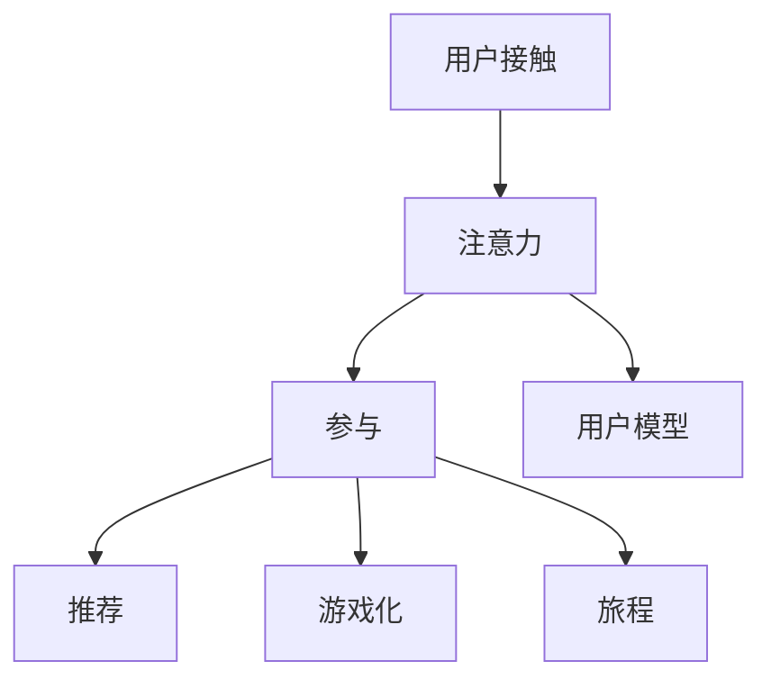

                 

# 注意力经济与用户参与：如何创建让人上瘾的产品

## 1. 背景介绍

### 1.1 问题由来

在信息爆炸的时代，如何吸引和留住用户的注意力，成为产品设计者最关心的问题之一。用户的注意力是有限的，如何利用这些有限资源，创造出让用户欲罢不能的体验，是当今数字产品设计者的首要任务。

### 1.2 问题核心关键点

在数字产品设计中，注意力是一种稀缺资源，需要通过精心的设计来获取和保持。产品设计师需要理解用户注意力流动的心理机制，把握用户的真实需求，从而创建出能够引发用户强烈情感反应，满足用户需求的产品。

### 1.3 问题研究意义

深入理解注意力经济和用户参与机制，对于提升数字产品的用户体验，扩大用户覆盖面，增强用户粘性，提升商业价值具有重要意义。通过对注意力机制的探索，可以设计出更具吸引力、更具个性化的产品，在竞争激烈的市场中获得优势。

## 2. 核心概念与联系

### 2.1 核心概念概述

为更好地理解注意力经济和用户参与机制，本节将介绍几个密切相关的核心概念：

- 注意力经济(Attention Economy)：指在信息过载的环境中，吸引用户注意力的重要性。注意力经济的核心在于如何设计产品和交互方式，最大化地吸引和利用用户注意力。

- 用户参与(User Engagement)：指用户在使用产品过程中的积极互动和参与程度。高参与度意味着用户对产品产生了强烈的情感依赖，形成了良好的使用习惯。

- 个性化推荐(Personalization Recommendation)：通过分析用户行为数据，预测用户需求，为用户提供个性化的内容推荐，提升用户满意度，增加产品粘性。

- 游戏化设计(Game-ified Design)：将游戏元素引入产品设计中，增强用户参与度，创造愉悦的用户体验。

- 用户旅程(User Journey)：描述用户在使用产品过程中，从接触产品到完成操作的路径和情感体验，通过优化用户旅程，提高用户满意度和忠诚度。

- 用户模型(User Model)：通过数据分析和建模，构建用户画像，更好地理解用户需求和行为，从而设计更加贴合用户的产品。

这些核心概念之间相互联系，共同构成了一个完整的数字产品设计框架。理解这些概念及其联系，可以更好地把握用户注意力的吸引和保持策略。

### 2.2 核心概念原理和架构的 Mermaid 流程图



这个流程图展示了注意力经济和用户参与机制的主要环节：

1. 用户接触：产品首先吸引用户的注意。
2. 注意力：用户通过视觉、听觉等多感官渠道接收产品信息。
3. 参与：用户通过交互行为对产品产生反应，形成情感体验。
4. 推荐：系统根据用户行为数据，提供个性化的内容推荐。
5. 游戏化：通过引入游戏元素，提升用户参与度。
6. 旅程：描述用户从接触产品到完成操作的路径。
7. 用户模型：通过数据分析构建用户画像。

这些环节相互依赖，通过合理的交互设计，可以最大化地利用用户注意力，提升产品粘性和用户满意度。

## 3. 核心算法原理 & 具体操作步骤

### 3.1 算法原理概述

注意力经济和用户参与的核心在于如何最大化地吸引和利用用户的注意力。注意力获取是产品设计中的关键环节，通过合理的用户界面设计和交互方式，可以吸引用户的注意力，并维持其长时间的关注。用户参与则是指用户在使用产品过程中的积极互动，通过个性化的推荐、游戏化元素、良好的用户旅程等，增加用户对产品的粘性和忠诚度。

在算法层面，注意力获取和用户参与主要通过以下几种方式实现：

- 推荐算法：基于用户行为数据，通过协同过滤、内容推荐、深度学习等方法，为每个用户提供个性化的内容推荐，提升用户参与度。
- 游戏化算法：设计规则化、结构化的游戏元素，如积分、排名、成就等，增加用户的互动乐趣和竞争性。
- 用户行为分析：通过数据分析和建模，识别用户行为特征，构建用户模型，从而设计更加贴合用户的产品。

### 3.2 算法步骤详解

#### 3.2.1 注意力获取

**步骤1：设计引人注目的界面**  
用户界面是注意力获取的第一关。界面设计需要简洁明了，避免过于复杂的信息堆叠，使用高对比度的颜色和明确的视觉层次结构，确保用户在短时间内获得重要信息。

**步骤2：使用动态元素吸引注意力**  
动态元素（如动画、闪烁效果、可交互按钮）可以吸引用户的注意力。但是需要注意不要过度使用，以免分散用户注意力。

**步骤3：引入刺激性的视觉元素**  
使用鲜明的颜色、突出的文字、吸引人的图标等视觉元素，可以迅速抓住用户的眼球，吸引注意力。

#### 3.2.2 用户参与

**步骤1：设计易用的交互方式**  
良好的交互方式可以提高用户参与度。例如，使用简单的拖拽操作、滑块、按钮等，减少用户操作步骤，提升操作便捷性。

**步骤2：提供及时的反馈**  
用户操作后，系统需要提供及时的反馈，如声音、振动、视觉变化等，以确认操作结果。这可以提高用户对系统的信心和参与感。

**步骤3：设计个性化推荐**  
基于用户行为数据，提供个性化的内容推荐。例如，根据用户的浏览记录，推荐相关的商品或文章，增加用户粘性。

**步骤4：引入游戏化元素**  
设计积分、徽章、排行榜等游戏化元素，激发用户竞争心理，增加用户参与度。例如，用户在完成特定操作后获得积分，积分可以兑换虚拟奖励或实物奖励。

**步骤5：优化用户旅程**  
设计清晰、流畅的用户旅程，使用户能够顺利地完成从接触产品到最终操作的每个步骤，减少用户流失。例如，提供明确的下一步指引，减少用户操作步骤，减少用户流失。

#### 3.2.3 算法优缺点

**优点**：

1. 个性化推荐可以提升用户满意度，增加用户粘性。
2. 游戏化元素可以提升用户参与度，增加用户互动。
3. 用户模型可以更好地理解用户需求，设计更加贴合用户的产品。

**缺点**：

1. 个性化推荐和游戏化元素需要大量数据支撑，对于数据不足的产品，效果可能有限。
2. 用户行为分析需要复杂的算法和数据处理，对于小规模产品可能不适用。
3. 过度使用游戏化元素可能适得其反，增加用户疲劳感。

### 3.3 算法应用领域

基于注意力经济和用户参与机制的算法，广泛应用于以下领域：

- 电商：通过个性化推荐和游戏化元素，增加用户购买行为，提升用户满意度。
- 社交媒体：通过个性化的内容推荐和游戏化元素，增加用户互动，提升用户粘性。
- 在线教育：通过个性化的学习推荐和游戏化元素，提升用户学习效果，增加用户参与度。
- 健康管理：通过健康数据监测和游戏化元素，提升用户健康意识，增加用户粘性。
- 旅游应用：通过个性化推荐和游戏化元素，增加用户旅游体验，提升用户满意度。

## 4. 数学模型和公式 & 详细讲解 & 举例说明

### 4.1 数学模型构建

假设用户在使用产品过程中，有 $n$ 个行为数据 $D=\{(x_i,y_i)\}_{i=1}^N$，其中 $x_i$ 为行为特征，$y_i$ 为行为标签（如点击、购买等）。目标是设计推荐算法 $F$，使得 $F(x)$ 能预测用户 $x_i$ 的行为 $y_i$。

推荐算法的目标函数为：

$$
\min_{F} \frac{1}{N} \sum_{i=1}^N \ell(F(x_i), y_i)
$$

其中 $\ell$ 为损失函数，通常采用交叉熵损失。

### 4.2 公式推导过程

假设推荐算法为线性模型 $F(x) = \theta^T \varphi(x)$，其中 $\theta$ 为模型参数，$\varphi(x)$ 为特征映射函数。损失函数为交叉熵损失：

$$
\ell(F(x_i), y_i) = -y_i \log F(x_i) - (1-y_i) \log (1-F(x_i))
$$

将 $F(x_i) = \theta^T \varphi(x_i)$ 代入上式，得：

$$
\ell(\theta, x_i, y_i) = -y_i \log (\theta^T \varphi(x_i)) - (1-y_i) \log (1-\theta^T \varphi(x_i))
$$

目标函数变为：

$$
\min_{\theta} \frac{1}{N} \sum_{i=1}^N \ell(\theta, x_i, y_i)
$$

通过求解上述最优化问题，得到最优参数 $\theta$，即推荐算法 $F(x) = \theta^T \varphi(x)$。

### 4.3 案例分析与讲解

**案例：电商个性化推荐**

电商应用中，用户浏览商品、加入购物车、完成购买等行为都可以作为训练数据。目标是设计推荐算法 $F$，预测用户对于某个商品的购买意愿。

- **数据准备**：收集用户的浏览记录、加入购物车行为、购买记录等，作为训练数据 $D=\{(x_i,y_i)\}_{i=1}^N$。
- **特征工程**：选择与用户购买意愿相关的特征，如用户年龄、浏览时长、商品类别等。
- **模型训练**：使用线性回归、决策树、深度学习等模型，在训练集上进行拟合，得到推荐算法 $F(x)$。
- **评估与优化**：在验证集上评估模型性能，调整模型参数，提升推荐准确率。
- **上线部署**：将训练好的模型集成到电商系统中，实时推荐商品给用户，提升用户购买率。

## 5. 项目实践：代码实例和详细解释说明

### 5.1 开发环境搭建

在进行个性化推荐实践前，我们需要准备好开发环境。以下是使用Python进行TensorFlow开发的环境配置流程：

1. 安装Anaconda：从官网下载并安装Anaconda，用于创建独立的Python环境。

2. 创建并激活虚拟环境：
```bash
conda create -n tf-env python=3.8 
conda activate tf-env
```

3. 安装TensorFlow：根据CUDA版本，从官网获取对应的安装命令。例如：
```bash
conda install tensorflow=2.6 -c conda-forge -c pytorch
```

4. 安装Keras：
```bash
pip install keras
```

5. 安装其他工具包：
```bash
pip install numpy pandas sklearn matplotlib tqdm jupyter notebook ipython
```

完成上述步骤后，即可在`tf-env`环境中开始推荐系统开发。

### 5.2 源代码详细实现

我们使用Keras框架实现一个简单的个性化推荐系统，对用户的浏览记录进行推荐。以下是代码实现：

```python
import numpy as np
from tensorflow.keras.layers import Input, Dense, Embedding, Flatten, concatenate
from tensorflow.keras.models import Model

# 定义用户特征和商品特征
user_features = np.array([[1, 2, 3], [4, 5, 6], [7, 8, 9]])
item_features = np.array([[10, 20, 30], [40, 50, 60], [70, 80, 90]])

# 定义用户ID和商品ID映射
user_id_to_index = {1: 0, 2: 1, 3: 2, 4: 3, 5: 4, 6: 5, 7: 6, 8: 7, 9: 8}
item_id_to_index = {10: 0, 20: 1, 30: 2, 40: 3, 50: 4, 60: 5, 70: 6, 80: 7, 90: 8}

# 定义用户特征向量和商品特征向量
user_vector = Embedding(input_dim=9, output_dim=10)(user_features)
item_vector = Embedding(input_dim=9, output_dim=10)(item_features)

# 定义用户行为特征向量
user_behavior_vector = Flatten()(Flatten()(user_vector))

# 定义用户行为与商品行为之间的交互特征向量
interaction_vector = concatenate([user_behavior_vector, item_vector])

# 定义模型
input_user_behavior = Input(shape=(3,), name='user_behavior')
input_item = Input(shape=(3,), name='item')
user_vector = Embedding(input_dim=9, output_dim=10)(input_user_behavior)
item_vector = Embedding(input_dim=9, output_dim=10)(input_item)
user_behavior_vector = Flatten()(user_vector)
item_vector = Flatten()(item_vector)
interaction_vector = concatenate([user_behavior_vector, item_vector])
output = Dense(1, activation='sigmoid')(interaction_vector)
model = Model(inputs=[input_user_behavior, input_item], outputs=output)

# 编译模型
model.compile(optimizer='adam', loss='binary_crossentropy', metrics=['accuracy'])

# 训练模型
model.fit([user_features, item_features], [1, 1, 1, 0, 0, 1, 1, 0, 0], epochs=100, batch_size=2, verbose=1)

# 预测用户行为
user_id = 2
item_id = 6
user_vector = Embedding(input_dim=9, output_dim=10)(user_features[user_id_to_index[user_id]])
item_vector = Embedding(input_dim=9, output_dim=10)(item_features[item_id_to_index[item_id]])
user_behavior_vector = Flatten()(user_vector)
item_vector = Flatten()(item_vector)
interaction_vector = concatenate([user_behavior_vector, item_vector])
prediction = model.predict([user_vector, item_vector])
print(prediction)
```

在这个代码中，我们使用Keras实现了基于用户行为和商品行为的双塔结构模型，用于预测用户是否会购买某个商品。具体步骤如下：

- 定义用户特征和商品特征，使用Embedding层将特征向量嵌入到低维空间。
- 定义用户行为特征向量，通过Flatten层将用户特征向量展平。
- 定义用户行为与商品行为之间的交互特征向量，通过concatenate层将用户行为特征向量和商品特征向量拼接。
- 定义模型，使用Dense层对交互特征向量进行二分类预测。
- 编译模型，设置损失函数为交叉熵损失，优化器为Adam优化器，评估指标为准确率。
- 训练模型，使用用户特征、商品特征和用户行为数据进行训练。
- 预测用户行为，使用模型对特定用户和商品进行预测。

### 5.3 代码解读与分析

让我们再详细解读一下关键代码的实现细节：

- **Embedding层**：将用户行为和商品行为映射到低维空间，通过Embedding层实现。

- **Flatten层**：将用户行为特征向量展开成一维向量，方便后续操作。

- **Dense层**：用于二分类预测，输出一个概率值表示用户是否会购买商品。

- **compile方法**：设置模型的编译参数，包括优化器、损失函数和评估指标。

- **fit方法**：使用训练数据训练模型，设置训练轮数和批次大小。

- **predict方法**：使用模型进行预测，返回预测结果。

## 6. 实际应用场景

### 6.1 电商推荐

电商推荐系统是基于用户行为数据的个性化推荐系统。通过分析用户浏览、购买、评价等行为数据，为用户提供个性化的商品推荐，提升用户购买率和满意度。

在实际操作中，电商推荐系统通常会采用以下几种技术：

- 协同过滤：根据用户行为相似性，推荐用户可能感兴趣的商品。
- 基于内容的推荐：根据商品特征，推荐与用户已购买商品相似的商品。
- 深度学习推荐：使用神经网络模型，学习用户行为和商品特征之间的复杂关系，提升推荐效果。

电商推荐系统可以有效提升用户的购物体验，增加电商平台的销售额和用户粘性。

### 6.2 社交媒体内容推荐

社交媒体内容推荐系统根据用户的行为数据（如浏览、点赞、分享等），推荐可能感兴趣的内容。通过分析用户的互动行为，增加用户的参与度和互动性，提升用户对平台的粘性。

在实际操作中，社交媒体推荐系统通常会采用以下几种技术：

- 基于图模型的推荐：通过构建用户-内容交互图，预测用户对内容的兴趣。
- 基于深度学习的推荐：使用神经网络模型，学习用户行为和内容特征之间的关系。
- 实时推荐：通过实时分析用户行为数据，动态更新推荐内容，提升推荐效果。

社交媒体推荐系统可以极大地提升用户的社交体验，增加用户的平台粘性和互动性。

## 7. 工具和资源推荐

### 7.1 学习资源推荐

为了帮助开发者系统掌握个性化推荐和用户参与的原理和实践，这里推荐一些优质的学习资源：

1. 《深度学习》：Ian Goodfellow等著，全面介绍了深度学习的原理和应用，包括个性化推荐等前沿话题。

2. 《推荐系统》：Zoubin Ghahramani著，介绍了推荐系统的基本原理和常用算法。

3. 《Python机器学习》：Sebastian Raschka著，介绍了机器学习的基本概念和实践技巧，包括个性化推荐。

4. Kaggle竞赛：参加Kaggle的个性化推荐竞赛，实践推荐算法，积累经验。

5. Coursera课程：Coursera的“Machine Learning by Andrew Ng”课程，介绍机器学习的基本原理和算法，适合初学者入门。

通过对这些资源的学习实践，相信你一定能够快速掌握个性化推荐和用户参与的精髓，并用于解决实际的业务问题。

### 7.2 开发工具推荐

高效的开发离不开优秀的工具支持。以下是几款用于个性化推荐和用户参与开发的常用工具：

1. TensorFlow：由Google主导开发的开源深度学习框架，生产部署方便，适合大规模工程应用。

2. Keras：Keras是一个高层次的深度学习框架，支持多种模型构建，可以快速实现个性化推荐算法。

3. PyTorch：基于Python的开源深度学习框架，灵活动态的计算图，适合快速迭代研究。

4. Weights & Biases：模型训练的实验跟踪工具，可以记录和可视化模型训练过程中的各项指标，方便对比和调优。

5. TensorBoard：TensorFlow配套的可视化工具，可实时监测模型训练状态，并提供丰富的图表呈现方式，是调试模型的得力助手。

6. Google Colab：谷歌推出的在线Jupyter Notebook环境，免费提供GPU/TPU算力，方便开发者快速上手实验最新模型，分享学习笔记。

合理利用这些工具，可以显著提升个性化推荐和用户参与任务的开发效率，加快创新迭代的步伐。

### 7.3 相关论文推荐

个性化推荐和用户参与技术的发展源于学界的持续研究。以下是几篇奠基性的相关论文，推荐阅读：

1. item-based collaborative filtering for recommender systems：提出了基于协同过滤的推荐算法，通过用户行为相似性进行推荐。

2. factorization machines for recommender systems：提出因子分解机模型，通过用户行为数据和商品特征进行推荐。

3. collaborative filtering for implicit feedback datasets：提出了基于隐式反馈的协同过滤算法，处理用户未明确反馈的情况。

4. neural collaborative filtering：提出基于神经网络的推荐模型，学习用户行为和商品特征之间的复杂关系。

5. deep tensor factorization for recommendation systems：提出深度张量分解模型，提升推荐效果和模型可解释性。

这些论文代表了个性化推荐技术的发展脉络。通过学习这些前沿成果，可以帮助研究者把握学科前进方向，激发更多的创新灵感。

## 8. 总结：未来发展趋势与挑战

### 8.1 总结

本文对基于个性化推荐和用户参与的产品设计进行了全面系统的介绍。首先阐述了个性化推荐和用户参与的重要性，明确了如何在设计中最大化利用用户的注意力。其次，从原理到实践，详细讲解了个性化推荐和用户参与的数学模型和关键步骤，给出了推荐系统开发的完整代码实例。同时，本文还广泛探讨了个性化推荐和用户参与在电商、社交媒体等众多领域的应用前景，展示了个性化推荐技术的巨大潜力。最后，本文精选了个性化推荐和用户参与技术的各类学习资源，力求为读者提供全方位的技术指引。

通过本文的系统梳理，可以看到，个性化推荐和用户参与技术在数字产品设计中具有广泛的应用前景，极大地提升了用户体验和产品粘性，带来了显著的商业价值。未来，伴随技术的不断演进，个性化推荐和用户参与技术必将进一步成熟和完善，为数字产品设计带来更多的创新和突破。

### 8.2 未来发展趋势

展望未来，个性化推荐和用户参与技术将呈现以下几个发展趋势：

1. 推荐算法将更加复杂和多样化。未来的推荐算法将结合深度学习、协同过滤、图模型等多种方法，提升推荐精度和效果。

2. 用户行为分析将更加精细。通过多维度的数据分析，构建更全面、更精准的用户模型，实现更加个性化的推荐。

3. 实时推荐将更加普遍。通过实时分析用户行为数据，动态更新推荐内容，提升推荐效果。

4. 推荐系统将更加智能化。未来的推荐系统将结合自然语言处理、计算机视觉等技术，实现跨领域的知识整合和内容推荐。

5. 推荐系统将更加个性化。通过个性化推荐，提升用户满意度，增加用户粘性。

6. 推荐系统将更加透明和可解释。未来的推荐系统将具备更好的可解释性，让用户理解推荐逻辑和决策过程。

以上趋势凸显了个性化推荐和用户参与技术的广阔前景。这些方向的探索发展，必将进一步提升数字产品的性能和用户体验，为产品设计者带来更多的创新灵感。

### 8.3 面临的挑战

尽管个性化推荐和用户参与技术已经取得了瞩目成就，但在迈向更加智能化、普适化应用的过程中，它仍面临着诸多挑战：

1. 数据隐私问题。个性化推荐需要收集和分析大量用户数据，如何在保护用户隐私的同时，提升推荐效果，是一个重要难题。

2. 冷启动问题。对于新用户或新商品，推荐算法往往缺乏足够的参考数据，如何处理冷启动问题，是一个难点。

3. 多样性问题。用户需求和兴趣多样化，如何设计多层次、多维度的推荐系统，满足不同用户的需求，是一个重要课题。

4. 实时性问题。实时推荐系统需要处理海量数据，如何提高系统实时性，是一个技术挑战。

5. 可解释性问题。推荐系统往往是"黑盒"系统，难以解释其内部工作机制和决策逻辑，如何增强推荐系统的可解释性，是一个重要研究方向。

6. 公平性问题。个性化推荐算法可能存在偏见，如何保证推荐系统的公平性，避免歧视性推荐，是一个重要课题。

正视个性化推荐和用户参与面临的这些挑战，积极应对并寻求突破，将是个性化推荐技术走向成熟的必由之路。相信随着学界和产业界的共同努力，这些挑战终将一一被克服，个性化推荐技术必将在构建人机协同的智能时代中扮演越来越重要的角色。

### 8.4 未来突破

面对个性化推荐和用户参与技术所面临的种种挑战，未来的研究需要在以下几个方面寻求新的突破：

1. 探索无监督和半监督推荐方法。摆脱对大量标注数据的依赖，利用自监督学习、主动学习等方法，最大化利用非结构化数据，实现更加灵活高效的推荐。

2. 研究参数高效和计算高效的推荐范式。开发更加参数高效的推荐方法，在固定大部分模型参数的情况下，只更新极少量的推荐参数。同时优化推荐系统的计算图，减少前向传播和反向传播的资源消耗，实现更加轻量级、实时性的部署。

3. 融合因果和对比学习范式。通过引入因果推断和对比学习思想，增强推荐系统建立稳定因果关系的能力，学习更加普适、鲁棒的用户行为模型。

4. 引入更多先验知识。将符号化的先验知识，如知识图谱、逻辑规则等，与推荐系统进行巧妙融合，引导推荐过程学习更准确、合理的用户行为模型。同时加强不同模态数据的整合，实现视觉、语音等多模态信息与文本信息的协同建模。

5. 结合因果分析和博弈论工具。将因果分析方法引入推荐系统，识别出推荐决策的关键特征，增强推荐系统决策的因果性和逻辑性。借助博弈论工具刻画用户与推荐系统的交互过程，主动探索并规避推荐系统的脆弱点，提高系统稳定性。

6. 纳入伦理道德约束。在推荐系统训练目标中引入伦理导向的评估指标，过滤和惩罚有偏见、有害的推荐结果，确保推荐系统的公平性和公正性。

这些研究方向的探索，必将引领个性化推荐和用户参与技术迈向更高的台阶，为构建安全、可靠、可解释、可控的智能系统铺平道路。面向未来，个性化推荐和用户参与技术还需要与其他人工智能技术进行更深入的融合，如知识表示、因果推理、强化学习等，多路径协同发力，共同推动推荐系统的进步。只有勇于创新、敢于突破，才能不断拓展推荐系统的边界，让智能技术更好地造福人类社会。

## 9. 附录：常见问题与解答

**Q1：如何设计一个有效的个性化推荐系统？**

A: 设计一个有效的个性化推荐系统，需要从以下几个方面进行考虑：

1. 数据准备：收集用户行为数据，如浏览、点击、购买等，构建推荐数据集。
2. 特征工程：选择与用户行为相关的特征，构建用户和商品特征向量。
3. 模型选择：选择合适的推荐算法，如协同过滤、内容推荐、深度学习等。
4. 模型训练：使用训练数据对推荐模型进行拟合，调整模型参数，提升推荐效果。
5. 评估与优化：在验证集上评估模型性能，优化模型参数，提升推荐精度。
6. 上线部署：将训练好的模型集成到推荐系统中，实时推荐商品给用户。

**Q2：如何提升推荐系统的实时性？**

A: 提升推荐系统的实时性，可以从以下几个方面进行考虑：

1. 数据存储：使用高效的存储方式，如内存数据库、分布式存储等，降低数据访问延迟。
2. 模型优化：使用轻量级模型，如线性模型、因子分解机等，降低模型计算开销。
3. 分布式计算：使用分布式计算框架，如Hadoop、Spark等，并行处理推荐数据。
4. 缓存技术：使用缓存技术，如Redis、Memcached等，缓存热门商品推荐结果，减少计算时间。
5. 流式计算：使用流式计算框架，如Apache Kafka、Apache Flink等，实时处理推荐数据。

**Q3：如何处理推荐系统的冷启动问题？**

A: 推荐系统的冷启动问题可以通过以下几种方式进行解决：

1. 用户画像：通过分析用户历史行为，构建用户画像，预测用户行为。
2. 商品特征：通过分析商品属性、类别等特征，推荐与用户历史行为相似的商品。
3. 协同过滤：通过分析用户相似性，推荐用户可能感兴趣的商品。
4. 深度学习：使用神经网络模型，学习用户行为和商品特征之间的关系。

这些方法可以帮助推荐系统更好地处理冷启动问题，提升推荐效果。

**Q4：如何提高推荐系统的公平性？**

A: 提高推荐系统的公平性，可以从以下几个方面进行考虑：

1. 数据采样：在数据采样过程中，避免数据偏见，确保数据多样性。
2. 算法优化：优化推荐算法，避免算法偏见，确保推荐公平性。
3. 人工干预：在推荐过程中，引入人工干预，纠正不公平推荐。
4. 用户反馈：通过用户反馈，识别和纠正不公平推荐，提升推荐系统公平性。

这些方法可以帮助推荐系统更好地处理公平性问题，提升推荐效果。

**Q5：如何增强推荐系统的可解释性？**

A: 增强推荐系统的可解释性，可以从以下几个方面进行考虑：

1. 特征选择：选择有意义的特征，解释推荐逻辑。
2. 算法透明：使用透明的推荐算法，便于理解推荐过程。
3. 解释模型：使用解释性模型，如决策树、线性模型等，解释推荐结果。
4. 用户反馈：通过用户反馈，识别和纠正不合理的推荐结果，提升推荐系统可解释性。

这些方法可以帮助推荐系统更好地处理可解释性问题，提升推荐效果。

---

作者：禅与计算机程序设计艺术 / Zen and the Art of Computer Programming

