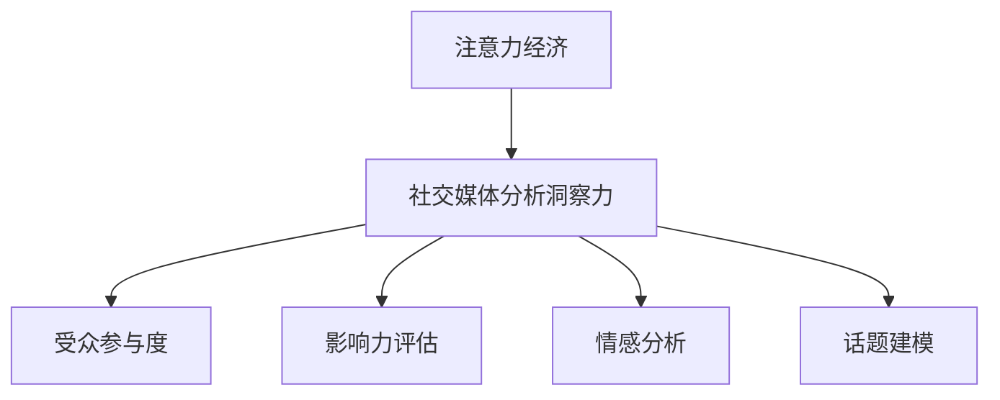

                 

# 注意力经济与社交媒体分析洞察力：了解受众参与度和影响力的秘密

## 1. 背景介绍

### 1.1 问题由来
在数字经济时代，信息爆炸和技术进步极大地改变了人们的消费行为和沟通方式。社交媒体平台作为信息获取、分享和交流的重要渠道，其对人们行为的影响日益显著。然而，随着社交媒体内容的无限增长，如何在海量数据中提取有价值的信息，理解受众行为和影响，成为了一个亟待解决的问题。

注意力经济（Attention Economy）这一概念应运而生，强调了信息时代下注意力资源的稀缺性及其对经济活动的影响。社交媒体分析洞察力（Social Media Analysis Insight）则是指利用数据分析技术，深入挖掘社交媒体数据中蕴含的受众参与度和影响力信息，帮助企业和组织做出更精准的决策。

### 1.2 问题核心关键点
社交媒体分析洞察力研究的核心在于：
1. **数据收集与处理**：社交媒体数据规模庞大，格式多样，需要有效的方法进行收集、清洗和预处理。
2. **特征提取与建模**：从数据中提取有意义的特征，并用合适的模型对受众参与度和影响力进行建模。
3. **影响评估与预测**：评估社交媒体活动的影响效果，并预测未来的趋势和影响。
4. **可视化与报告**：将分析结果通过图表、报告等形式呈现，便于决策者理解和应用。

### 1.3 问题研究意义
社交媒体分析洞察力研究对于理解社交媒体时代的信息流动、用户行为和市场趋势具有重要意义：
1. **市场预测与决策支持**：基于社交媒体数据的分析可以帮助企业更好地预测市场趋势，制定更有效的市场策略。
2. **用户行为分析**：深入分析用户参与行为，帮助品牌更好地理解用户需求和偏好，提升用户体验。
3. **舆情监测与危机管理**：实时监测社交媒体舆情，及时发现并应对负面事件，维护品牌声誉。
4. **内容优化与创新**：利用社交媒体分析结果指导内容创作和优化，提升内容的吸引力和传播效果。

## 2. 核心概念与联系

### 2.1 核心概念概述

为更好地理解注意力经济和社交媒体分析洞察力，本节将介绍几个关键概念：

- **注意力经济**：信息时代下，人们注意力资源的稀缺性和其对经济活动的决定性影响。
- **社交媒体分析洞察力**：通过数据分析技术，深入挖掘社交媒体数据中用户行为、参与度和影响力的信息，提供决策支持。
- **受众参与度**：衡量用户对社交媒体内容的互动程度，包括点赞、评论、分享等行为。
- **影响力评估**：测量个体或品牌在社交媒体上的影响力，关注其内容的传播范围和影响力。
- **情感分析**：分析文本中的情感倾向，理解用户的情绪状态和反馈。
- **话题建模**：从社交媒体数据中自动识别和分类热门话题，揭示用户关注的核心议题。

这些概念之间的逻辑关系可以通过以下Mermaid流程图来展示：



这个流程图展示了几大核心概念及其之间的关系：

1. 注意力经济强调了信息时代下注意力资源的稀缺性。
2. 社交媒体分析洞察力利用数据技术挖掘社交媒体中的有价值信息，为决策提供支持。
3. 受众参与度、影响力评估、情感分析和话题建模是具体的应用场景，均属于社交媒体分析洞察力的范畴。

## 3. 核心算法原理 & 具体操作步骤
### 3.1 算法原理概述

社交媒体分析洞察力的实现主要依赖于文本挖掘和机器学习技术。其核心思想是：利用算法模型从社交媒体数据中提取和分析受众参与度和影响力的特征，以数据驱动的方式理解用户行为和市场趋势。

形式化地，设社交媒体数据集为 $D=\{(x_i,y_i)\}_{i=1}^N$，其中 $x_i$ 为文本数据，$y_i$ 为标签（如参与度、影响力等）。模型的目标是通过训练找到最优的参数 $\theta$，使得模型能够准确预测新数据点 $(x,y)$ 的标签 $y$，即：

$$
\hat{y} = M_{\theta}(x)
$$

其中 $M_{\theta}$ 为社交媒体分析洞察力模型，$\theta$ 为模型的可学习参数。

社交媒体分析洞察力模型通常基于深度学习算法，包括卷积神经网络（CNN）、循环神经网络（RNN）、长短期记忆网络（LSTM）、注意力机制（Attention）等。这些模型能够自动学习输入数据的特征，并通过多层次的抽象和融合，输出有意义的结果。

### 3.2 算法步骤详解

社交媒体分析洞察力的算法步骤通常包括以下几个关键步骤：

**Step 1: 数据预处理与特征提取**
- 收集社交媒体数据，包括文本、图片、视频等多模态数据。
- 进行数据清洗和预处理，如去除噪声、处理缺失值、分词、去除停用词等。
- 提取有意义的特征，如文本的TF-IDF特征、情感倾向、话题标签等。

**Step 2: 模型训练与评估**
- 选择合适的深度学习模型，如卷积神经网络（CNN）、循环神经网络（RNN）、长短期记忆网络（LSTM）、注意力机制（Attention）等。
- 将预处理后的数据划分为训练集、验证集和测试集，进行模型训练。
- 使用验证集对模型进行调参和优化，确保模型泛化性能。
- 在测试集上评估模型性能，计算准确率、召回率、F1值等指标。

**Step 3: 结果分析与报告**
- 将分析结果通过图表、报告等形式呈现，便于决策者理解和应用。
- 可视化结果，如受众参与度分布、影响力排行榜、情感分析结果等。
- 生成详细报告，涵盖用户行为分析、话题趋势、影响效果等。

### 3.3 算法优缺点

社交媒体分析洞察力算法具有以下优点：
1. 数据来源广泛。社交媒体数据量大、更新快，适合实时监测和分析。
2. 模型灵活性强。深度学习模型能够自动学习数据特征，适应性广。
3. 应用场景丰富。适用于品牌监测、用户行为分析、舆情管理、内容优化等多个场景。
4. 结果可视化效果好。通过图表和报告等形式呈现结果，易于理解。

同时，该算法也存在一定的局限性：
1. 数据质量依赖。社交媒体数据的噪音和偏见较大，影响分析结果的准确性。
2. 模型复杂度高。深度学习模型需要较长的训练时间和较高的计算资源。
3. 解释性不足。黑盒模型的决策过程难以解释，影响信任度。
4. 隐私问题。社交媒体数据的隐私保护问题不容忽视，需要严格的数据使用和隐私保护措施。

尽管存在这些局限性，但就目前而言，社交媒体分析洞察力算法仍是最主流的方法，能够有效帮助企业理解社交媒体中的用户行为和市场趋势。

### 3.4 算法应用领域

社交媒体分析洞察力技术已经在多个领域得到了广泛的应用，例如：

- **品牌监测与分析**：实时监测品牌提及和讨论，评估品牌影响力。
- **用户行为分析**：分析用户在社交媒体上的互动行为，理解用户需求和偏好。
- **舆情管理与危机应对**：监测和分析舆情动态，及时应对负面事件。
- **内容优化与创新**：利用分析结果指导内容创作和优化，提升内容的吸引力和传播效果。
- **市场预测与决策支持**：预测市场趋势，制定更有效的市场策略。

除了上述这些经典应用外，社交媒体分析洞察力还被创新性地应用到更多场景中，如社交媒体影响力评估、社交网络分析、社交媒体广告投放优化等，为企业的市场决策和运营提供了新的数据支持。

## 4. 数学模型和公式 & 详细讲解 & 举例说明
### 4.1 数学模型构建

社交媒体分析洞察力算法通常基于深度学习模型，利用分类、回归、聚类等算法进行数据建模。

假设社交媒体数据为文本形式，设文本数据 $x_i$ 的特征向量为 $\textbf{x}_i \in \mathbb{R}^d$，模型参数为 $\theta$。设社交媒体数据的标签为 $y_i \in \{0,1\}$，表示是否参与某活动。则模型的损失函数为：

$$
\mathcal{L}(\theta) = \frac{1}{N} \sum_{i=1}^N \ell(M_{\theta}(\textbf{x}_i), y_i)
$$

其中 $\ell$ 为损失函数，通常为交叉熵损失函数：

$$
\ell(y,\hat{y}) = -y\log \hat{y} - (1-y)\log (1-\hat{y})
$$

模型的优化目标是找到最优参数 $\theta^*$，使得损失函数最小化：

$$
\theta^* = \mathop{\arg\min}_{\theta} \mathcal{L}(\theta)
$$

### 4.2 公式推导过程

以下我们以情感分析为例，推导情感分析模型的损失函数及其梯度的计算公式。

假设模型 $M_{\theta}$ 在输入 $x$ 上的输出为 $\hat{y}=M_{\theta}(x)$，表示样本为正类的概率。真实标签 $y \in \{0,1\}$。则二分类交叉熵损失函数定义为：

$$
\ell(M_{\theta}(x),y) = -[y\log \hat{y} + (1-y)\log (1-\hat{y})]
$$

将其代入经验风险公式，得：

$$
\mathcal{L}(\theta) = -\frac{1}{N}\sum_{i=1}^N [y_i\log M_{\theta}(x_i)+(1-y_i)\log(1-M_{\theta}(x_i))]
$$

根据链式法则，损失函数对参数 $\theta_k$ 的梯度为：

$$
\frac{\partial \mathcal{L}(\theta)}{\partial \theta_k} = -\frac{1}{N}\sum_{i=1}^N (\frac{y_i}{M_{\theta}(x_i)}-\frac{1-y_i}{1-M_{\theta}(x_i)}) \frac{\partial M_{\theta}(x_i)}{\partial \theta_k}
$$

其中 $\frac{\partial M_{\theta}(x_i)}{\partial \theta_k}$ 可进一步递归展开，利用自动微分技术完成计算。

在得到损失函数的梯度后，即可带入参数更新公式，完成模型的迭代优化。重复上述过程直至收敛，最终得到适应社交媒体分析洞察力的最优模型参数 $\theta^*$。

## 5. 项目实践：代码实例和详细解释说明
### 5.1 开发环境搭建

在进行社交媒体分析洞察力实践前，我们需要准备好开发环境。以下是使用Python进行PyTorch开发的环境配置流程：

1. 安装Anaconda：从官网下载并安装Anaconda，用于创建独立的Python环境。

2. 创建并激活虚拟环境：
```bash
conda create -n pytorch-env python=3.8 
conda activate pytorch-env
```

3. 安装PyTorch：根据CUDA版本，从官网获取对应的安装命令。例如：
```bash
conda install pytorch torchvision torchaudio cudatoolkit=11.1 -c pytorch -c conda-forge
```

4. 安装各类工具包：
```bash
pip install numpy pandas scikit-learn matplotlib tqdm jupyter notebook ipython
```

完成上述步骤后，即可在`pytorch-env`环境中开始社交媒体分析洞察力的开发。

### 5.2 源代码详细实现

下面我以情感分析任务为例，给出使用Transformers库对BERT模型进行情感分析的PyTorch代码实现。

首先，定义情感分析任务的数据处理函数：

```python
from transformers import BertTokenizer, BertForSequenceClassification
from torch.utils.data import Dataset, DataLoader
import torch

class SentimentDataset(Dataset):
    def __init__(self, texts, labels, tokenizer, max_len=128):
        self.texts = texts
        self.labels = labels
        self.tokenizer = tokenizer
        self.max_len = max_len
        
    def __len__(self):
        return len(self.texts)
    
    def __getitem__(self, item):
        text = self.texts[item]
        label = self.labels[item]
        
        encoding = self.tokenizer(text, return_tensors='pt', max_length=self.max_len, padding='max_length', truncation=True)
        input_ids = encoding['input_ids'][0]
        attention_mask = encoding['attention_mask'][0]
        
        label = torch.tensor(label, dtype=torch.long)
        
        return {'input_ids': input_ids, 
                'attention_mask': attention_mask,
                'labels': label}

# 标签与id的映射
label2id = {'negative': 0, 'positive': 1}
id2label = {v: k for k, v in label2id.items()}

# 创建dataset
tokenizer = BertTokenizer.from_pretrained('bert-base-cased')

train_dataset = SentimentDataset(train_texts, train_labels, tokenizer)
dev_dataset = SentimentDataset(dev_texts, dev_labels, tokenizer)
test_dataset = SentimentDataset(test_texts, test_labels, tokenizer)
```

然后，定义模型和优化器：

```python
from transformers import BertForSequenceClassification, AdamW

model = BertForSequenceClassification.from_pretrained('bert-base-cased', num_labels=2)

optimizer = AdamW(model.parameters(), lr=2e-5)
```

接着，定义训练和评估函数：

```python
from tqdm import tqdm
from sklearn.metrics import classification_report

device = torch.device('cuda') if torch.cuda.is_available() else torch.device('cpu')
model.to(device)

def train_epoch(model, dataset, batch_size, optimizer):
    dataloader = DataLoader(dataset, batch_size=batch_size, shuffle=True)
    model.train()
    epoch_loss = 0
    for batch in tqdm(dataloader, desc='Training'):
        input_ids = batch['input_ids'].to(device)
        attention_mask = batch['attention_mask'].to(device)
        labels = batch['labels'].to(device)
        model.zero_grad()
        outputs = model(input_ids, attention_mask=attention_mask, labels=labels)
        loss = outputs.loss
        epoch_loss += loss.item()
        loss.backward()
        optimizer.step()
    return epoch_loss / len(dataloader)

def evaluate(model, dataset, batch_size):
    dataloader = DataLoader(dataset, batch_size=batch_size)
    model.eval()
    preds, labels = [], []
    with torch.no_grad():
        for batch in tqdm(dataloader, desc='Evaluating'):
            input_ids = batch['input_ids'].to(device)
            attention_mask = batch['attention_mask'].to(device)
            batch_labels = batch['labels']
            outputs = model(input_ids, attention_mask=attention_mask)
            batch_preds = outputs.logits.argmax(dim=2).to('cpu').tolist()
            batch_labels = batch_labels.to('cpu').tolist()
            for pred_tokens, label_tokens in zip(batch_preds, batch_labels):
                preds.append(pred_tokens[:len(label_tokens)])
                labels.append(label_tokens)
                
    print(classification_report(labels, preds))
```

最后，启动训练流程并在测试集上评估：

```python
epochs = 5
batch_size = 16

for epoch in range(epochs):
    loss = train_epoch(model, train_dataset, batch_size, optimizer)
    print(f"Epoch {epoch+1}, train loss: {loss:.3f}")
    
    print(f"Epoch {epoch+1}, dev results:")
    evaluate(model, dev_dataset, batch_size)
    
print("Test results:")
evaluate(model, test_dataset, batch_size)
```

以上就是使用PyTorch对BERT进行情感分析任务开发的完整代码实现。可以看到，得益于Transformers库的强大封装，我们可以用相对简洁的代码完成BERT模型的加载和情感分析任务的微调。

### 5.3 代码解读与分析

让我们再详细解读一下关键代码的实现细节：

**SentimentDataset类**：
- `__init__`方法：初始化文本、标签、分词器等关键组件。
- `__len__`方法：返回数据集的样本数量。
- `__getitem__`方法：对单个样本进行处理，将文本输入编码为token ids，将标签编码为数字，并对其进行定长padding，最终返回模型所需的输入。

**label2id和id2label字典**：
- 定义了标签与数字id之间的映射关系，用于将模型预测结果解码回真实的标签。

**训练和评估函数**：
- 使用PyTorch的DataLoader对数据集进行批次化加载，供模型训练和推理使用。
- 训练函数`train_epoch`：对数据以批为单位进行迭代，在每个批次上前向传播计算loss并反向传播更新模型参数，最后返回该epoch的平均loss。
- 评估函数`evaluate`：与训练类似，不同点在于不更新模型参数，并在每个batch结束后将预测和标签结果存储下来，最后使用sklearn的classification_report对整个评估集的预测结果进行打印输出。

**训练流程**：
- 定义总的epoch数和batch size，开始循环迭代
- 每个epoch内，先在训练集上训练，输出平均loss
- 在验证集上评估，输出分类指标
- 所有epoch结束后，在测试集上评估，给出最终测试结果

可以看到，PyTorch配合Transformers库使得BERT情感分析任务的代码实现变得简洁高效。开发者可以将更多精力放在数据处理、模型改进等高层逻辑上，而不必过多关注底层的实现细节。

当然，工业级的系统实现还需考虑更多因素，如模型的保存和部署、超参数的自动搜索、更灵活的任务适配层等。但核心的情感分析范式基本与此类似。

## 6. 实际应用场景
### 6.1 智能客服系统

社交媒体分析洞察力技术可以广泛应用于智能客服系统的构建。传统客服往往需要配备大量人力，高峰期响应缓慢，且一致性和专业性难以保证。而利用社交媒体分析洞察力技术，可以实时监测和分析社交媒体上用户的咨询和反馈，指导客服系统提供个性化的服务。

在技术实现上，可以收集社交媒体上的用户咨询记录和反馈，通过情感分析模型判断用户情绪，将消极情绪的用户及时转接至人工客服处理。同时，利用情感分析和话题建模技术，分析用户最关心的问题和需求，动态优化客服知识库和问答系统，提升服务效率和质量。

### 6.2 金融舆情监测

金融机构需要实时监测市场舆论动向，以便及时应对负面信息传播，规避金融风险。传统的人工监测方式成本高、效率低，难以应对网络时代海量信息爆发的挑战。利用社交媒体分析洞察力技术，可以实时监测金融领域相关的舆情信息，评估市场情绪，预测市场趋势，帮助决策者及时做出调整。

具体而言，可以收集金融领域相关的新闻、评论、报告等文本数据，进行情感分析和话题建模。利用分析结果判断市场情绪变化，分析热点话题，识别潜在的风险和机会，提供预警和建议。

### 6.3 个性化推荐系统

当前的推荐系统往往只依赖用户的历史行为数据进行物品推荐，难以深入理解用户的真实兴趣偏好。利用社交媒体分析洞察力技术，可以结合社交媒体上的行为数据和内容互动数据，更好地挖掘用户的兴趣和偏好，提升推荐系统的精准度和个性化水平。

在实践中，可以收集用户浏览、评论、分享等行为数据，提取和用户交互的物品标题、描述、标签等文本内容。将文本内容作为模型输入，用户的后续行为（如是否点击、购买等）作为监督信号，在此基础上微调预训练语言模型。微调后的模型能够从文本内容中准确把握用户的兴趣点。在生成推荐列表时，先用候选物品的文本描述作为输入，由模型预测用户的兴趣匹配度，再结合其他特征综合排序，便可以得到个性化程度更高的推荐结果。

### 6.4 未来应用展望

随着社交媒体分析洞察力技术的不断发展，其在多个领域的应用前景将更加广阔。

在智慧医疗领域，利用社交媒体分析洞察力技术，可以实时监测和分析患者的舆情和情绪，为医生提供更全面的诊疗信息，提升医疗服务的质量。

在智能教育领域，通过分析学生的社交媒体互动数据，了解其学习状态和心理变化，为教师提供针对性的教学指导，提升教育效果。

在智慧城市治理中，利用社交媒体分析洞察力技术，实时监测和分析城市事件，提高城市管理的自动化和智能化水平，构建更安全、高效的未来城市。

此外，在企业生产、社会治理、文娱传媒等众多领域，社交媒体分析洞察力技术也将不断涌现，为传统行业带来变革性影响。相信随着技术的日益成熟，社交媒体分析洞察力技术将成为人工智能落地应用的重要范式，推动人工智能技术在更广阔的领域深入应用。

## 7. 工具和资源推荐
### 7.1 学习资源推荐

为了帮助开发者系统掌握社交媒体分析洞察力的理论基础和实践技巧，这里推荐一些优质的学习资源：

1. 《深度学习基础》系列课程：斯坦福大学开设的深度学习入门课程，适合初学者快速上手深度学习。

2. 《Python自然语言处理》书籍：介绍自然语言处理的基本概念和常用技术，适合掌握自然语言处理基础。

3. 《自然语言处理综述》论文：综述性论文，涵盖了自然语言处理的主要技术和应用，适合理解NLP领域的整体架构。

4. 《社交媒体分析：理论与实践》书籍：介绍社交媒体数据分析的理论和方法，适合理解社交媒体分析的基础和实践。

5. 《社交媒体舆情分析》课程：由某知名在线教育平台开设的社交媒体舆情分析课程，深入浅出地讲解了社交媒体数据分析的实际应用。

通过对这些资源的学习实践，相信你一定能够快速掌握社交媒体分析洞察力的精髓，并用于解决实际的社交媒体问题。
###  7.2 开发工具推荐

高效的开发离不开优秀的工具支持。以下是几款用于社交媒体分析洞察力开发的常用工具：

1. PyTorch：基于Python的开源深度学习框架，灵活动态的计算图，适合快速迭代研究。

2. TensorFlow：由Google主导开发的开源深度学习框架，生产部署方便，适合大规模工程应用。

3. Transformers库：HuggingFace开发的NLP工具库，集成了众多SOTA语言模型，支持PyTorch和TensorFlow，是进行社交媒体分析洞察力开发的利器。

4. Weights & Biases：模型训练的实验跟踪工具，可以记录和可视化模型训练过程中的各项指标，方便对比和调优。

5. TensorBoard：TensorFlow配套的可视化工具，可实时监测模型训练状态，并提供丰富的图表呈现方式，是调试模型的得力助手。

6. Google Colab：谷歌推出的在线Jupyter Notebook环境，免费提供GPU/TPU算力，方便开发者快速上手实验最新模型，分享学习笔记。

合理利用这些工具，可以显著提升社交媒体分析洞察力任务的开发效率，加快创新迭代的步伐。

### 7.3 相关论文推荐

社交媒体分析洞察力研究源于学界的持续研究。以下是几篇奠基性的相关论文，推荐阅读：

1. Sentiment Analysis with Deep Learning：介绍使用深度学习进行情感分析的初步方法和应用。

2. Topic Modeling and Information Extraction from Social Media：介绍社交媒体话题建模的基本原理和算法。

3. Attention Is All You Need：提出Transformer结构，开启了NLP领域的预训练大模型时代，为社交媒体分析洞察力提供了基础技术。

4. Transfer Learning for Modeling Social Media Sentiment with Non-Expert-Labeled Data：介绍利用非标注数据进行社交媒体情感分析的技术。

5. Sentiment Analysis with Twitter and Transformer-based Models：利用Twitter数据集进行情感分析的案例分析。

这些论文代表了大语言模型微调技术的发展脉络。通过学习这些前沿成果，可以帮助研究者把握学科前进方向，激发更多的创新灵感。

## 8. 总结：未来发展趋势与挑战

### 8.1 总结

本文对社交媒体分析洞察力的实现原理和操作步骤进行了全面系统的介绍。首先阐述了社交媒体分析洞察力的研究背景和意义，明确了其在理解社交媒体时代用户行为和市场趋势方面的独特价值。其次，从原理到实践，详细讲解了社交媒体分析洞察力的数学模型和关键步骤，给出了社交媒体分析洞察力的完整代码实例。同时，本文还广泛探讨了社交媒体分析洞察力在多个行业领域的应用前景，展示了其广阔的想象空间。

通过本文的系统梳理，可以看到，社交媒体分析洞察力技术正在成为社交媒体数据挖掘和分析的重要手段，极大地拓展了社交媒体数据的价值应用。未来，随着深度学习、自然语言处理、计算机视觉等技术的进一步融合，社交媒体分析洞察力技术必将迎来新的发展突破，推动人工智能技术在更多领域落地应用。

### 8.2 未来发展趋势

社交媒体分析洞察力技术的未来发展趋势包括：

1. **多模态数据融合**：未来社交媒体分析将不仅限于文本数据，还会融合图片、视频等多模态数据，提升分析的深度和广度。

2. **实时性提升**：随着技术的发展，社交媒体分析的实时性将进一步提升，能够实时监测和分析用户的互动行为和情绪变化，为决策提供更及时的支撑。

3. **用户隐私保护**：社交媒体数据隐私问题愈发重要，未来社交媒体分析需要更加注重数据隐私保护，确保分析过程合规合法。

4. **模型解释性增强**：社交媒体分析模型的解释性将逐渐增强，帮助用户理解和信任分析结果，促进实际应用。

5. **跨领域应用扩展**：社交媒体分析将逐渐扩展到更多领域，如医疗、教育、金融等，带来更多的应用场景和价值。

6. **知识图谱整合**：未来社交媒体分析将更好地整合外部知识图谱和规则库，提升分析的准确性和全面性。

以上趋势凸显了社交媒体分析洞察力技术的广阔前景。这些方向的探索发展，必将进一步提升社交媒体数据分析的精度和实时性，推动人工智能技术在更多领域的应用和落地。

### 8.3 面临的挑战

尽管社交媒体分析洞察力技术已经取得了显著进展，但在迈向更加智能化、普适化应用的过程中，仍面临诸多挑战：

1. **数据质量问题**：社交媒体数据存在噪音、偏见等问题，影响分析结果的准确性。如何提升数据质量，消除偏差，是未来的一大挑战。

2. **模型复杂度**：深度学习模型复杂度高，需要较长的训练时间和较高的计算资源。如何降低模型复杂度，提高训练效率，是未来需要解决的重要问题。

3. **解释性不足**：黑盒模型的决策过程难以解释，影响用户信任度。如何增强模型的解释性，提供更透明、可理解的分析结果，是未来需要重点关注的方向。

4. **隐私保护问题**：社交媒体数据的隐私保护问题不容忽视，如何确保数据使用合规，保护用户隐私，是未来需要严格对待的课题。

5. **跨领域应用挑战**：不同领域的社交媒体数据特征不同，如何构建通用的分析模型，适应不同领域的应用需求，是未来需要深入研究的挑战。

6. **实时性要求高**：社交媒体数据分析需要实时性，如何构建高效、实时的分析系统，满足高实时性要求，是未来需要优化的方向。

解决这些挑战，需要学界和产业界的共同努力，推动技术不断迭代和完善。只有不断突破技术瓶颈，才能真正实现社交媒体分析洞察力技术在实际应用中的价值。

### 8.4 研究展望

未来，社交媒体分析洞察力技术的研究方向可能包括：

1. **多模态数据分析**：将社交媒体数据与图片、视频等多模态数据结合，进行深度融合分析。

2. **实时分析系统**：构建高效的实时分析系统，实现社交媒体数据的实时监测和分析，提升决策的及时性。

3. **增强模型解释性**：引入因果推断、博弈论等工具，增强模型的解释性和可理解性，提高用户信任度。

4. **跨领域应用扩展**：将社交媒体分析技术应用于更多领域，如医疗、教育、金融等，拓展应用场景。

5. **隐私保护研究**：加强数据隐私保护研究，制定合规合法的隐私保护措施，确保数据使用的合规性。

6. **知识图谱整合**：将社交媒体分析技术与知识图谱、规则库等外部知识结合，提升分析的全面性和准确性。

以上研究方向的探索，将进一步推动社交媒体分析洞察力技术的成熟，为更多行业带来智能化和高效化的数据分析能力。相信随着技术的不断进步，社交媒体分析洞察力技术将在更多领域发挥重要作用，推动社会数字化、智能化转型。

## 9. 附录：常见问题与解答

**Q1：社交媒体分析洞察力算法是否适用于所有社交媒体平台？**

A: 社交媒体分析洞察力算法可以适用于多种社交媒体平台，包括微博、微信、Twitter、Facebook等。但不同平台的数据格式、用户行为特征不同，需要针对性地进行数据处理和模型优化。

**Q2：如何提升社交媒体分析洞察力算法的准确性？**

A: 提升社交媒体分析洞察力算法的准确性可以从以下几个方面入手：
1. 数据预处理：清洗和处理数据，去除噪声和无用信息。
2. 特征工程：提取有意义的特征，如情感倾向、话题标签等。
3. 模型优化：选择合适的模型和算法，并进行超参数调优。
4. 多模型集成：利用多个模型进行集成，提高预测准确性。
5. 实时监测：实时监测和分析数据，及时调整模型参数。

**Q3：社交媒体分析洞察力算法在应用中需要注意哪些问题？**

A: 社交媒体分析洞察力算法在应用中需要注意以下问题：
1. 数据隐私：确保数据使用合规，保护用户隐私。
2. 数据质量：提升数据质量，消除噪音和偏见。
3. 实时性：构建高效的实时分析系统，满足高实时性要求。
4. 模型解释性：增强模型的解释性，提高用户信任度。
5. 跨领域应用：适应不同领域的应用需求，构建通用的分析模型。

通过合理应对这些问题，可以最大限度发挥社交媒体分析洞察力算法在实际应用中的价值。

---

作者：禅与计算机程序设计艺术 / Zen and the Art of Computer Programming

