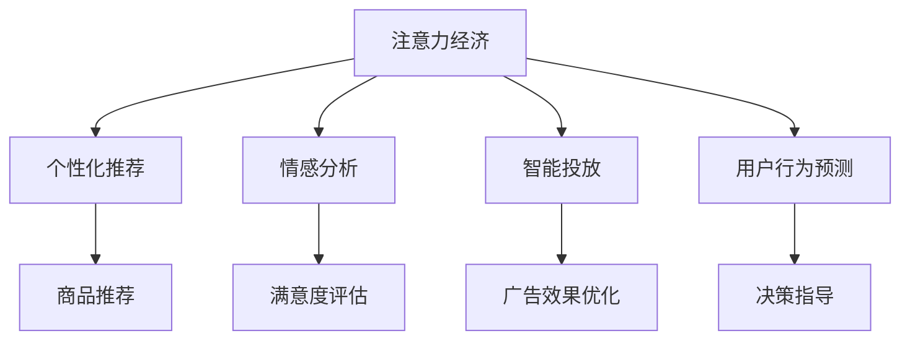

                 

# 注意力经济对传统节日营销的影响

## 1. 背景介绍

### 1.1 问题由来
在数字化转型浪潮的推动下，注意力经济（Attention Economy）已成为当今市场竞争的核心要素之一。尤其在传统节日期间，商家纷纷通过线上线下渠道进行市场营销，争夺消费者的注意力资源。传统的广告和宣传手段已经难以满足需求，因此企业越来越依赖于通过社交媒体、内容平台等新兴渠道获取并利用消费者的注意力。而技术手段，尤其是基于人工智能和大数据的应用，为商家提供了更多的工具和策略，从而在注意力经济中占据优势。

### 1.2 问题核心关键点
本研究聚焦于人工智能和大数据技术在传统节日营销中的应用，特别是个性化推荐、情感分析、智能投放和用户行为预测等方向，旨在揭示这些技术如何帮助商家更有效地获取、分配和利用消费者的注意力，从而提升营销效果和用户体验。

### 1.3 问题研究意义
注意力经济背景下，传统节日营销面临全新的挑战和机遇。通过人工智能和大数据技术，商家可以更精准地定位目标客户，个性化推荐商品和服务，提升营销活动的ROI。同时，通过分析消费者情感和行为，商家可以更好地理解市场需求，优化产品设计，提升品牌忠诚度。这些技术手段的应用，不仅能够提高营销效率，还能增强用户体验，促进市场的可持续发展。

## 2. 核心概念与联系

### 2.1 核心概念概述

本研究涉及以下几个核心概念：

- 注意力经济（Attention Economy）：指在信息爆炸时代，消费者注意力资源稀缺，企业需要通过创新的营销手段争夺并合理利用这一稀缺资源，以实现商业目标。
- 个性化推荐（Personalized Recommendation）：基于用户行为和偏好，通过机器学习算法为用户推荐其感兴趣的商品或内容。
- 情感分析（Sentiment Analysis）：通过自然语言处理技术，分析用户对商品或服务的情感倾向，用于评估用户满意度和改进产品。
- 智能投放（Intelligent Ad Placement）：利用大数据和机器学习算法，优化广告投放的策略和渠道，提升广告效果和ROI。
- 用户行为预测（User Behavior Prediction）：通过分析用户的历史数据，预测其未来的购买行为和偏好，用于指导库存管理、定价策略等决策。

这些概念之间的关系可以通过以下Mermaid流程图来展示：



这个流程图展示了几类注意力经济手段之间的联系：注意力经济为个性化推荐、情感分析、智能投放和用户行为预测提供了需求基础。这些技术手段通过不同的途径优化了商家对消费者注意力的获取和利用，从而提升营销效果和用户体验。

## 3. 核心算法原理 & 具体操作步骤
### 3.1 算法原理概述

注意力经济背景下的营销活动，主要依赖于以下几个核心算法原理：

- 协同过滤（Collaborative Filtering）：基于用户和商品的协同行为，推荐系统可以预测用户对商品的兴趣，提供个性化推荐。
- 深度学习模型（Deep Learning Models）：通过神经网络模型，情感分析可以准确捕捉用户情感倾向，情感计算在用户满意度和产品改进中扮演重要角色。
- 强化学习（Reinforcement Learning）：智能投放可以通过强化学习算法，优化广告投放策略，最大化ROI。
- 时间序列模型（Time Series Models）：用户行为预测通常通过时间序列模型，利用历史数据预测未来行为，指导库存管理和定价策略。

### 3.2 算法步骤详解

以下是一个典型的基于注意力经济的营销活动流程：

**Step 1: 数据采集与预处理**
- 收集用户行为数据（如浏览历史、购买记录、评分反馈）
- 进行数据清洗和预处理（如缺失值填补、异常值检测等）

**Step 2: 模型训练与优化**
- 使用协同过滤、深度学习模型、强化学习和时间序列模型，分别训练个性化推荐、情感分析、智能投放和用户行为预测模型
- 利用交叉验证和超参数调优，提升模型性能

**Step 3: 模型应用与监控**
- 在营销活动中实时应用模型，推荐个性化商品、评估广告效果、优化投放策略和预测用户行为
- 定期监测模型效果，根据业务反馈进行模型更新和优化

**Step 4: 用户反馈与迭代改进**
- 收集用户反馈（如满意度评分、投诉反馈）
- 分析用户行为数据，优化推荐算法和投放策略
- 迭代更新模型，不断提升营销效果

### 3.3 算法优缺点

基于注意力经济的营销算法具有以下优点：
- 高效精准：通过个性化推荐和智能投放，能够精准定位目标用户，提升广告和商品推荐的效果。
- 提升用户体验：情感分析和用户行为预测可以提升用户的满意度和忠诚度。
- 优化资源分配：智能投放算法可以优化广告预算分配，提升投资回报率。

同时，这些算法也存在一些缺点：
- 依赖高质量数据：算法效果高度依赖于数据质量和多样性，数据偏差可能导致推荐和投放策略失效。
- 复杂度高：深度学习模型和大数据处理需要高计算资源，对技术要求较高。
- 隐私风险：用户数据收集和处理可能涉及隐私问题，需要严格遵守法律法规。

### 3.4 算法应用领域

注意力经济的应用领域非常广泛，主要涵盖以下几个方面：

- 零售电商：通过个性化推荐和智能投放，提升电商平台的销售额和用户满意度。
- 旅游行业：通过情感分析和用户行为预测，优化旅游产品和服务的个性化推荐，提升用户体验。
- 媒体娱乐：通过智能投放和用户行为预测，优化内容推荐策略，提高用户粘性和消费转化率。
- 金融服务：通过情感分析和用户行为预测，评估客户满意度和风险，优化产品设计和定价策略。
- 健康医疗：通过个性化推荐和情感分析，提供健康咨询和产品推荐，提升用户体验。

## 4. 数学模型和公式 & 详细讲解 & 举例说明

### 4.1 数学模型构建

本研究使用数学模型来描述注意力经济中各关键技术的应用。

- **协同过滤模型**：基于用户和商品间的共现矩阵，推荐系统通过相似度计算预测用户对商品的兴趣。
- **深度学习情感分析模型**：使用卷积神经网络（CNN）或长短时记忆网络（LSTM），提取文本特征，并通过全连接层进行情感分类。
- **强化学习智能投放模型**：通过马尔可夫决策过程（MDP），优化广告投放策略，最大化ROI。
- **时间序列用户行为预测模型**：使用ARIMA、LSTM等时间序列模型，基于历史数据预测用户未来行为。

### 4.2 公式推导过程

以下是一个简单的协同过滤推荐算法公式推导过程：

设用户集合为$U$，商品集合为$I$，共现矩阵为$R$。协同过滤推荐算法通过用户和商品的相似度矩阵$A$，预测用户$u$对商品$i$的兴趣评分$r_{ui}$。公式如下：

$$
r_{ui} = \frac{\sum_{j \in I} A_{uj} R_{ji}}{\sqrt{\sum_{j \in I} A_{uj}^2}} \times \frac{\sum_{k \in U} A_{ik} R_{ku}}{\sqrt{\sum_{k \in U} A_{ik}^2}}
$$

其中，$A$为相似度矩阵，$R$为共现矩阵。该公式通过用户和商品的相似度，加权平均预测评分，提升了推荐的相关性和个性化程度。

### 4.3 案例分析与讲解

以电商平台的个性化推荐为例，可以使用协同过滤算法推荐用户感兴趣的商品。算法步骤如下：

1. 收集用户的历史购买和浏览数据，构建共现矩阵$R$。
2. 使用SVD或矩阵分解方法，对共现矩阵$R$进行分解，得到用户和商品的潜在表示矩阵。
3. 基于用户和商品的相似度矩阵$A$，预测用户对商品的评分$r_{ui}$。
4. 根据评分$r_{ui}$，推荐用户可能感兴趣的商品。

通过以上步骤，电商平台可以为用户提供个性化的商品推荐，提升用户体验和销售额。

## 5. 项目实践：代码实例和详细解释说明

### 5.1 开发环境搭建

在进行项目实践前，需要搭建以下开发环境：

1. 安装Python和相关库：如numpy、pandas、scikit-learn、TensorFlow、Keras等。
2. 准备数据集：收集用户行为数据、商品信息数据和广告数据。
3. 搭建计算环境：如使用Google Cloud、AWS等云平台，或本地高性能计算设备。

### 5.2 源代码详细实现

以下是一个基于TensorFlow的协同过滤推荐系统代码实现：

```python
import tensorflow as tf
import pandas as pd
import numpy as np

# 加载数据集
data = pd.read_csv('user_item_matrix.csv')

# 数据预处理
user_ids = data['user_id'].unique()
item_ids = data['item_id'].unique()
R = data.pivot_table(index='user_id', columns='item_id', values='rating').fillna(0)

# 矩阵分解
latent_factors = 10
user_factors = np.random.normal(scale=0.1, size=(len(user_ids), latent_factors))
item_factors = np.random.normal(scale=0.1, size=(len(item_ids), latent_factors))

# 定义协同过滤模型
class CollaborativeFiltering(tf.keras.Model):
    def __init__(self, latent_factors):
        super(CollaborativeFiltering, self).__init__()
        self.user_factors = tf.Variable(user_factors)
        self.item_factors = tf.Variable(item_factors)
        self.user_bias = tf.Variable(tf.zeros(len(user_ids)))
        self.item_bias = tf.Variable(tf.zeros(len(item_ids)))
        self.factor_matrix = tf.matmul(self.user_factors, tf.transpose(self.item_factors))
    
    def call(self, user_ids, item_ids):
        user_bias = tf.nn.embedding_lookup(self.user_bias, user_ids)
        item_bias = tf.nn.embedding_lookup(self.item_bias, item_ids)
        scores = tf.matmul(user_bias + item_bias, self.factor_matrix)
        return scores
    
# 训练模型
model = CollaborativeFiltering(latent_factors)
optimizer = tf.keras.optimizers.Adam(learning_rate=0.01)
train_data = data[data['rating'].notna()]
train_user_ids = train_data['user_id'].values
train_item_ids = train_data['item_id'].values
train_ratings = train_data['rating'].values

def train_step(user_ids, item_ids, ratings):
    with tf.GradientTape() as tape:
        predictions = model(user_ids, item_ids)
        loss = tf.losses.mean_squared_error(ratings, predictions)
    gradients = tape.gradient(loss, model.trainable_variables)
    optimizer.apply_gradients(zip(gradients, model.trainable_variables))
    return loss.numpy()

# 训练模型
for epoch in range(100):
    epoch_loss = 0
    for i in range(len(train_data)):
        loss = train_step(train_user_ids[i], train_item_ids[i], train_ratings[i])
        epoch_loss += loss
    print(f'Epoch {epoch+1}, Loss: {epoch_loss / len(train_data)}')
```

### 5.3 代码解读与分析

该代码实现了一个基于矩阵分解的协同过滤推荐系统。其中，`CollaborativeFiltering`类定义了协同过滤模型的结构，`train_step`函数实现了单个样本的训练过程。代码的主要步骤如下：

1. 加载并预处理数据集，构建共现矩阵$R$。
2. 随机初始化用户和商品潜在表示矩阵，以及用户和商品的偏置项。
3. 定义协同过滤模型的前向传播过程，计算用户和商品的潜在表示乘积，加上偏置项。
4. 定义损失函数，使用均方误差损失，计算模型预测评分与实际评分之间的差距。
5. 反向传播，更新模型参数。
6. 通过多个epoch的训练，不断优化模型性能。

## 6. 实际应用场景

### 6.1 电商平台的个性化推荐

电商平台可以通过协同过滤、深度学习和情感分析等技术，实现精准的个性化推荐。例如，京东、淘宝等电商巨头已经在这些技术上取得了显著成效，通过推荐系统，提升了用户体验和销售额。具体应用场景如下：

1. 用户浏览历史推荐：电商平台根据用户浏览历史数据，推荐相关商品。
2. 基于用户评价的推荐：根据用户对商品评价的情感倾向，推荐相似商品。
3. 限时促销活动推荐：在特定节日期间，根据用户行为和偏好，推荐限时促销商品。

### 6.2 旅游行业的个性化旅游路线推荐

旅游行业可以通过用户行为预测和情感分析技术，提升个性化旅游路线推荐的效果。例如，携程、去哪儿等旅游平台，已经应用这些技术，实现了旅游路线的个性化推荐。具体应用场景如下：

1. 基于用户历史行为推荐路线：根据用户历史旅游记录，推荐类似旅游路线。
2. 基于情感分析推荐目的地：通过情感分析，评估用户对目的地的偏好，推荐适合的旅游路线。
3. 基于用户评价推荐酒店：根据用户对酒店的评价，推荐优质酒店。

### 6.3 媒体娱乐的内容推荐

媒体娱乐平台可以通过智能投放和用户行为预测技术，提升内容推荐的效果。例如，Netflix、YouTube等平台，已经应用这些技术，实现了内容的个性化推荐。具体应用场景如下：

1. 基于观看历史推荐视频：根据用户观看历史数据，推荐相关视频。
2. 基于情感分析推荐电影：通过情感分析，评估用户对电影的喜好，推荐适合的电影。
3. 基于用户评价推荐视频：根据用户对视频的评价，推荐优质视频。

## 7. 工具和资源推荐

### 7.1 学习资源推荐

为了帮助开发者系统掌握注意力经济中的技术手段，这里推荐一些优质的学习资源：

1. Coursera上的《Machine Learning》课程：由斯坦福大学的Andrew Ng教授主讲，全面介绍了机器学习和深度学习的基础知识。
2. Kaggle上的机器学习竞赛：通过实践竞赛，积累数据处理和模型调优经验。
3. Udacity上的《Artificial Intelligence for Trading》课程：介绍机器学习在金融领域的应用，特别是情感分析和用户行为预测。
4. GitHub上的开源项目：如TensorFlow推荐系统、scikit-learn协同过滤等，提供了丰富的案例和代码示例。
5. 专业书籍：如《Python机器学习》、《深度学习》等，系统学习机器学习算法和实践。

### 7.2 开发工具推荐

高效的开发离不开优秀的工具支持。以下是几款用于注意力经济开发常用的工具：

1. Jupyter Notebook：用于编写和运行Python代码，支持数据可视化。
2. TensorFlow和PyTorch：主流深度学习框架，提供强大的模型训练和推理能力。
3. Scikit-learn：经典的机器学习库，提供丰富的算法和工具。
4. Elasticsearch和Apache Kafka：大数据处理和流式数据处理工具，支持实时数据处理。
5. Visual Studio Code：轻量级开发工具，支持代码编辑、调试和版本控制。

### 7.3 相关论文推荐

注意力经济相关的研究论文众多，以下是几篇具有代表性的论文：

1. BERT: Pre-training of Deep Bidirectional Transformers for Language Understanding：提出BERT模型，通过掩码语言模型和下一句预测任务，预训练语言模型。
2. Attention Is All You Need：提出Transformer模型，引入自注意力机制，显著提升语言模型的表现。
3. Generative Adversarial Nets：提出GAN模型，通过对抗生成网络训练深度生成模型。
4. Adversarial Machine Learning：研究对抗生成网络和对抗训练技术，提升模型的鲁棒性和泛化能力。
5. Reinforcement Learning for Online Ad Allocation：提出强化学习算法，优化在线广告投放策略。

## 8. 总结：未来发展趋势与挑战

### 8.1 研究成果总结

本研究通过分析注意力经济下各关键技术的应用，揭示了人工智能和大数据在传统节日营销中的重要作用。通过个性化推荐、情感分析和智能投放等技术，商家可以更精准地定位目标用户，提升营销效果和用户体验。这些技术手段的应用，不仅提高了营销活动的ROI，还增强了用户的满意度和忠诚度。

### 8.2 未来发展趋势

未来，随着技术的不断进步，注意力经济将迎来以下几个发展趋势：

1. 深度学习和大数据技术的持续进步：模型性能和计算效率将进一步提升，应用场景将更加广泛。
2. 跨领域应用的拓展：人工智能技术将与其他行业深度融合，实现多领域的多元化应用。
3. 用户行为预测的精度提升：通过更复杂的算法和更丰富的大数据，用户行为预测的准确性将大幅提升。
4. 强化学习在智能投放中的应用：通过强化学习算法，优化广告投放策略，提升ROI。
5. 情感计算的深入发展：通过更先进的自然语言处理技术，情感分析将更加准确，提升用户满意度。

### 8.3 面临的挑战

尽管注意力经济带来了诸多机遇，但技术应用过程中仍面临一些挑战：

1. 数据质量和多样性问题：高质量数据获取和处理难度大，数据偏差可能导致算法失效。
2. 计算资源需求高：深度学习和大数据处理需要高性能计算资源，技术要求高。
3. 隐私和安全问题：用户数据收集和处理涉及隐私和安全问题，需要严格遵守法律法规。
4. 技术落地难度：将技术手段转化为实际应用，需要综合考虑业务需求、技术实现和用户体验。

### 8.4 研究展望

未来，需要在以下几个方面进一步研究和探索：

1. 无监督学习和半监督学习：通过无监督学习和半监督学习，降低对标注数据的需求，提高模型泛化能力。
2. 联邦学习：通过分布式计算技术，保护用户隐私，同时提升模型性能。
3. 模型可解释性：开发可解释性强的模型，提高用户信任度和算法透明度。
4. 跨领域知识融合：将跨领域的知识和规则与模型结合，提升模型的适应性和鲁棒性。
5. 道德和伦理问题：在模型设计和应用过程中，注重道德和伦理问题，避免偏见和歧视。

## 9. 附录：常见问题与解答

**Q1：个性化推荐和智能投放如何确保效果和公平性？**

A: 个性化推荐和智能投放的效果和公平性取决于数据质量和算法设计。数据方面，需要确保数据的多样性和代表性，避免数据偏差。算法方面，需要设计公平性和透明性的评估指标，定期监控和优化算法。此外，通过多模型集成和对抗样本生成技术，可以提高推荐的公平性和鲁棒性。

**Q2：如何处理数据隐私和安全问题？**

A: 数据隐私和安全是注意力经济中必须重视的问题。处理数据隐私和安全问题的方法包括：
1. 数据匿名化：对数据进行脱敏处理，保护用户隐私。
2. 数据加密：对数据进行加密存储和传输，防止数据泄露。
3. 访问控制：对数据访问进行严格控制，确保数据安全。
4. 合规审查：遵守相关法律法规，如GDPR、CCPA等，保护用户隐私。

**Q3：如何提升用户行为的预测精度？**

A: 提升用户行为预测精度的方法包括：
1. 数据预处理：对数据进行清洗、归一化等预处理，提高数据质量。
2. 特征工程：设计有效的特征，提取对预测有用的信息。
3. 模型选择：选择适合的数据和任务，选择性能最优的模型。
4. 超参数调优：通过交叉验证和网格搜索，优化模型参数。
5. 模型集成：通过多模型集成和融合技术，提高预测精度和鲁棒性。

**Q4：如何优化广告投放策略？**

A: 优化广告投放策略的方法包括：
1. 数据分析：通过数据分析，了解用户行为和偏好。
2. 目标定位：通过用户画像和行为预测，精准定位目标用户。
3. 广告创意设计：设计吸引用户的广告创意和内容。
4. 预算分配：根据不同用户群体的转化率，合理分配广告预算。
5. 效果监控：通过A/B测试和效果评估，持续优化广告投放策略。

通过本研究，我们可以深刻理解注意力经济下各关键技术的应用，从而更好地应用于传统节日营销中，提升商家营销效果和用户体验。希望未来的研究能够进一步推动注意力经济的发展，为经济社会发展提供新的动力。

---

作者：禅与计算机程序设计艺术 / Zen and the Art of Computer Programming

