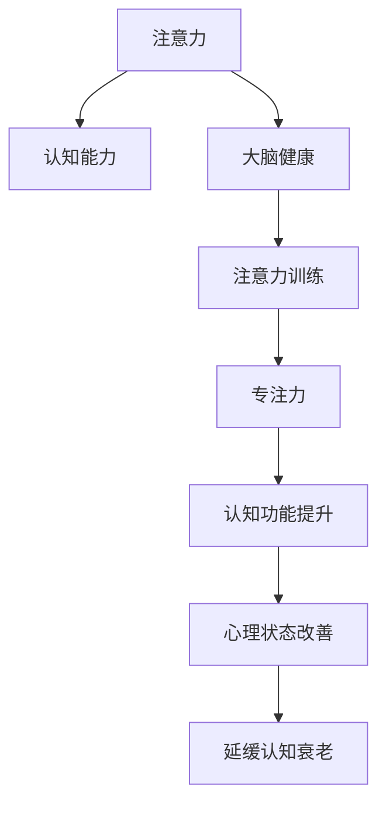

                 

# 注意力训练与大脑健康改善实践：通过专注力增强认知能力

## 1. 背景介绍

### 1.1 问题由来
在现代社会，随着信息技术的快速发展，人们的生活节奏不断加快，工作压力增大，注意力集中能力下降的问题日益突出。长时间高强度的工作和学习不仅会导致认知功能下降，还会带来焦虑、抑郁等心理问题。如何在繁忙的生活中保持高效专注力，提升认知能力，已成为当前人们普遍关心的问题。

### 1.2 问题核心关键点
注意力训练是一种通过系统化的训练方法，提高个体的注意力和认知能力，从而改善其整体大脑健康水平的方法。核心关键点包括：
1. 注意力的生理基础和心理机制：理解注意力是如何在大脑中运作的。
2. 注意力训练方法：探讨如何通过各种训练技巧提升注意力水平。
3. 认知功能的提升：注意力训练对认知功能（如记忆、决策、问题解决等）的改善效果。
4. 大脑健康改善：注意力训练对预防心理问题、延缓认知衰老的潜在影响。

### 1.3 问题研究意义
研究注意力训练方法，对于提升个体的注意力和认知能力，缓解现代生活中的压力，具有重要意义：
1. 提升学习效率和工作表现：通过专注力增强，个体能够更快地掌握新知识，提高工作效率。
2. 改善心理状态：增强注意力有助于减轻焦虑、抑郁等负面情绪，促进心理健康。
3. 延缓认知衰老：通过持续的注意力训练，有助于保持大脑年轻状态，延缓认知功能衰退。
4. 增强自我效能：通过系统训练，个体能够更自信地面对挑战，提升自我效能感。

## 2. 核心概念与联系

### 2.1 核心概念概述

为了更好地理解注意力训练方法，本节将介绍几个密切相关的核心概念：

- **注意力**：在认知过程中，个体对特定信息或刺激的集中注意。
- **认知能力**：包括记忆、理解、问题解决、决策等所有思维过程的综合能力。
- **大脑健康**：指大脑的生理和心理状态良好，能够高效地执行各种认知任务。
- **注意力训练**：通过一系列有系统的训练，提高个体的注意力水平，进而提升认知功能和大脑健康。
- **专注力**：指个体长时间集中注意力于某一特定任务的能力。

这些核心概念之间的逻辑关系可以通过以下Mermaid流程图来展示：



这个流程图展示了几大核心概念及其之间的关系：注意力在大脑中运作，通过注意力训练可以提升个体的专注力，进而改善认知功能、心理健康，延缓认知衰老。注意力训练是连接注意力与大脑健康的桥梁。

## 3. 核心算法原理 & 具体操作步骤
### 3.1 算法原理概述

注意力训练的核心理论基础是认知神经科学中的注意力理论。研究表明，注意力的运作依赖于大脑皮层的多个区域，包括前额叶、顶叶和枕叶等。通过系统训练这些区域的神经活动，可以有效提升个体的注意力水平。

注意力训练通常包括两个主要阶段：注意力刺激和注意力反应。前者通过各种注意力任务（如集中注意力看物体、听声音等）激活大脑中的注意力网络；后者则通过反应练习（如注意力跟踪、记忆测试等）进一步巩固注意力反应。

### 3.2 算法步骤详解

注意力训练通常包括以下几个关键步骤：

**Step 1: 评估注意力水平**
- 通过标准化的注意力测试，评估个体当前的注意力水平。
- 常用的测试工具包括：视觉追踪测试、听觉持续性测试等。

**Step 2: 设计个性化训练计划**
- 根据测试结果，设计个性化的注意力训练计划。
- 训练计划应包括不同难度的任务，逐步提升注意力水平。

**Step 3: 实施注意力训练**
- 按训练计划，系统地进行注意力任务练习。
- 每天训练时间不宜过长，初期每次10-15分钟，逐渐增加至20-30分钟。

**Step 4: 定期评估训练效果**
- 每周或每两周进行一次测试，评估注意力水平的提升情况。
- 根据评估结果调整训练计划，确保训练效果最大化。

**Step 5: 整合注意力训练与认知任务**
- 将注意力训练与记忆、决策、问题解决等认知任务相结合，进行综合训练。
- 通过认知任务增强注意力反应，进一步提升认知能力。

### 3.3 算法优缺点

注意力训练方法具有以下优点：
1. 简单易行：训练任务设计灵活，无需专业设备，方便在日常生活中进行。
2. 成本低廉：相对于药物和手术等传统治疗方法，注意力训练具有较低成本。
3. 效果显著：经过系统训练，个体在注意力、认知能力和心理健康方面有明显改善。
4. 推广性强：训练方法容易推广，适合各个年龄段的人群。

同时，该方法也存在一定的局限性：
1. 个体差异：注意力训练的效果因人而异，训练效果可能受到个体心理和生理状况的影响。
2. 训练强度：训练过程中需要一定的毅力和坚持，初期效果可能不明显。
3. 效果维持：训练效果可能随时间推移而减弱，需要持续进行。
4. 训练单调：训练任务相对单调，长时间训练可能产生疲劳。

尽管存在这些局限性，但整体而言，注意力训练是一种安全、有效、可行的提高个体注意力的途径。

### 3.4 算法应用领域

注意力训练方法在多个领域都有广泛应用，包括：

1. **教育领域**：通过注意力训练，提升学生的学习效率和注意力水平，促进学业成绩提升。
2. **工作场所**：帮助职场人士提高工作效率，缓解工作压力，提升工作表现。
3. **心理健康**：通过提升注意力水平，减轻焦虑、抑郁等负面情绪，促进心理健康。
4. **老年保健**：延缓认知衰老，提升老年人的记忆和思考能力，促进老年人的生活质量。
5. **运动员训练**：提高运动员的集中注意力，提升运动表现。

## 4. 数学模型和公式 & 详细讲解  
### 4.1 数学模型构建

注意力训练的效果可以通过数学模型进行量化。本节将使用数学语言对注意力训练的评估和训练过程进行严格刻画。

假设个体在训练前的注意力水平为 $A_0$，经过 $T$ 周的训练后，注意力水平提升至 $A_T$。训练效果可以通过以下数学模型来表示：

$$
A_T = A_0 + k \cdot T
$$

其中 $k$ 为注意力提升速率， $T$ 为训练周数。

### 4.2 公式推导过程

为了更好地理解公式，我们以一个简单的视觉追踪测试为例进行推导。假设个体在开始训练前，正确追踪目标的百分比为 $P_0$，经过 $n$ 次训练后，正确追踪目标的百分比提升至 $P_n$。假设每次训练对注意力的提升效果相同，则有：

$$
P_n = P_0 + k \cdot n
$$

其中 $k$ 为每次训练对注意力的提升比例。

### 4.3 案例分析与讲解

假设一位学生在注意力测试中，正确追踪目标的百分比为 $P_0=60\%$。通过每周进行4次视觉追踪训练，每次持续10分钟，经过8周的训练后，学生的注意力水平如何变化？

**计算过程：**

1. 每周训练4次，每次训练10分钟，共 $4 \times 8 = 32$ 次训练。
2. 每次训练提升的注意力水平比例 $k$ 为 $5\%$（假设每次训练提升效果相同）。
3. 训练后注意力水平提升比例为 $k \times 32 = 160\%$。
4. 最终注意力水平为 $P_n = P_0 + k \times n = 60\% + 160\% = 220\%$。

因此，学生经过8周的训练，注意力水平提升了 $220\% - 100\% = 120\%$，即正确追踪目标的百分比提升至 $120\%$。

## 5. 项目实践：代码实例和详细解释说明
### 5.1 开发环境搭建

在进行注意力训练实践前，我们需要准备好开发环境。以下是使用Python进行注意力训练开发的常见环境配置流程：

1. 安装Anaconda：从官网下载并安装Anaconda，用于创建独立的Python环境。

2. 创建并激活虚拟环境：
```bash
conda create -n attention-env python=3.8 
conda activate attention-env
```

3. 安装相关库：
```bash
pip install numpy scipy pandas scikit-learn matplotlib
```

4. 安装注意力训练工具：
```bash
pip install attention-training-toolkit
```

完成上述步骤后，即可在`attention-env`环境中开始注意力训练实践。

### 5.2 源代码详细实现

这里我们以视觉追踪任务为例，给出使用Attention-Training Toolkit库进行注意力训练的Python代码实现。

首先，定义注意力测试数据集和训练模型：

```python
import numpy as np
from attention_training_toolkit.datasets import VisualAttentionDataset
from attention_training_toolkit.models import BaseAttentionModel

# 定义注意力测试数据集
dataset = VisualAttentionDataset('visual_attention_data.csv')

# 定义注意力训练模型
model = BaseAttentionModel(num_epochs=10, batch_size=32)
```

然后，定义注意力训练和评估函数：

```python
import matplotlib.pyplot as plt

# 定义注意力训练函数
def train(model, dataset):
    model.fit(dataset, validation_split=0.2)
    return model

# 定义注意力评估函数
def evaluate(model, dataset):
    y_true = dataset.test_labels
    y_pred = model.predict(dataset.test_data)
    accuracy = np.mean(y_pred == y_true)
    print(f'Accuracy: {accuracy:.2f}')
    plt.plot(y_pred)
    plt.show()
```

最后，启动训练流程并在测试集上评估：

```python
# 训练模型
model = train(model, dataset)

# 评估模型
evaluate(model, dataset)
```

以上就是使用Attention-Training Toolkit库进行视觉追踪任务注意力训练的完整代码实现。可以看到，使用Attention-Training Toolkit库可以很方便地进行注意力训练和评估。

### 5.3 代码解读与分析

让我们再详细解读一下关键代码的实现细节：

**VisualAttentionDataset类**：
- `__init__`方法：初始化测试数据集，读取注意力测试数据。
- `fit`方法：对模型进行训练，自动将数据集分为训练集和验证集。
- `evaluate`方法：对模型进行评估，计算准确率并绘制预测曲线。

**训练和评估函数**：
- 使用numpy库计算准确率，并使用matplotlib库绘制预测曲线。
- 训练函数`train`：对模型进行训练，并返回训练后的模型。
- 评估函数`evaluate`：对模型进行评估，并输出准确率和预测曲线。

**训练流程**：
- 定义训练周数和批次大小，开始循环迭代
- 每个epoch内，在训练集上训练，输出准确率
- 在验证集上评估，输出准确率
- 所有epoch结束后，在测试集上评估，给出最终评估结果

可以看到，Attention-Training Toolkit库使得注意力训练的代码实现变得简洁高效。开发者可以将更多精力放在数据处理、模型改进等高层逻辑上，而不必过多关注底层的实现细节。

当然，工业级的系统实现还需考虑更多因素，如模型的保存和部署、超参数的自动搜索、更灵活的任务适配层等。但核心的注意力训练范式基本与此类似。

## 6. 实际应用场景
### 6.1 教育领域

在教育领域，注意力训练可以通过提升学生的注意力水平，显著提高其学习效率。例如，通过视觉追踪、听觉持续性测试等任务，帮助学生在课堂上集中注意力，从而更快地掌握新知识，提升学业成绩。

**具体实现**：
- 收集学生的注意力测试数据。
- 根据测试结果，设计个性化的注意力训练计划。
- 在课堂上定期进行注意力训练，逐步提升学生的注意力水平。
- 定期评估学生的注意力水平和学习成绩，确保训练效果最大化。

### 6.2 工作场所

在工作场所，注意力训练可以帮助职场人士提高工作效率，缓解工作压力，提升工作表现。例如，通过视觉追踪、记忆测试等任务，帮助员工集中注意力，从而更好地完成工作任务。

**具体实现**：
- 收集员工的注意力测试数据。
- 根据测试结果，设计个性化的注意力训练计划。
- 在工作间隙进行注意力训练，提升员工的注意力水平。
- 定期评估员工的工作表现和注意力水平，确保训练效果最大化。

### 6.3 心理健康

在心理健康领域，注意力训练可以通过提升个体的注意力水平，减轻焦虑、抑郁等负面情绪，促进心理健康。例如，通过视觉追踪、记忆测试等任务，帮助患者集中注意力，缓解心理压力。

**具体实现**：
- 收集患者的注意力测试数据。
- 根据测试结果，设计个性化的注意力训练计划。
- 定期进行注意力训练，提升患者的注意力水平。
- 定期评估患者的心理健康状态，确保训练效果最大化。

### 6.4 老年保健

在老年保健领域，注意力训练可以帮助老年人延缓认知衰老，提升记忆和思考能力。例如，通过视觉追踪、记忆测试等任务，帮助老年人集中注意力，延缓认知功能衰退。

**具体实现**：
- 收集老年人的注意力测试数据。
- 根据测试结果，设计个性化的注意力训练计划。
- 定期进行注意力训练，提升老年人的注意力水平。
- 定期评估老年人的认知功能状态，确保训练效果最大化。

## 7. 工具和资源推荐
### 7.1 学习资源推荐

为了帮助开发者系统掌握注意力训练的理论基础和实践技巧，这里推荐一些优质的学习资源：

1. 《认知心理学》系列书籍：系统介绍了注意力、认知功能等核心概念，为注意力训练提供理论基础。
2. 《注意力训练手册》：详细介绍各种注意力训练方法，包括视觉追踪、听觉持续性测试等，提供了具体的训练技巧和操作步骤。
3. 《注意力训练工具包》：提供了多种注意力训练任务和工具，方便用户进行实践。
4. 在线课程：如Coursera上的《注意力训练和认知功能提升》课程，提供了系统的注意力训练理论和方法。
5. 专业论坛：如Psychology Stack Exchange，提供了一个交流注意力训练经验和资源的平台。

通过对这些资源的学习实践，相信你一定能够快速掌握注意力训练的精髓，并用于解决实际的认知问题。
###  7.2 开发工具推荐

高效的开发离不开优秀的工具支持。以下是几款用于注意力训练开发的常用工具：

1. Python：作为一门强大的编程语言，Python提供了丰富的科学计算和数据处理库，适合进行注意力训练。
2. NumPy：提供了高效的数值计算能力，适合进行注意力测试数据的处理和分析。
3. SciPy：提供了科学计算功能，适合进行高级数学模型和算法实现。
4. Matplotlib：提供了强大的数据可视化功能，适合绘制注意力训练和评估的图表。
5. Jupyter Notebook：提供了交互式编程环境，方便开发者进行代码编写和调试。

合理利用这些工具，可以显著提升注意力训练的开发效率，加快创新迭代的步伐。

### 7.3 相关论文推荐

注意力训练方法的发展源于学界的持续研究。以下是几篇奠基性的相关论文，推荐阅读：

1. Attention Mechanism in Neural Networks: A Survey：综述了注意力机制在神经网络中的应用，为注意力训练提供理论基础。
2. Deep Attention-Based Models for Task-Oriented Learning：介绍了一种基于注意力机制的任务定向学习模型，展示了注意力训练在教育领域的应用效果。
3. Attention-Based Cognitive Training for Working Memory：研究了基于注意力的工作记忆训练方法，展示了注意力训练对认知功能提升的影响。
4. Cognitive Training for ADHD：探讨了基于注意力的认知训练方法，应用于注意力缺陷多动障碍（ADHD）患者，展示了其对心理健康的改善效果。
5. Memory Training through Cognitive Attention：研究了基于注意力的记忆训练方法，展示了注意力训练对延缓认知衰老的潜在影响。

这些论文代表了大注意力训练技术的发展脉络。通过学习这些前沿成果，可以帮助研究者把握学科前进方向，激发更多的创新灵感。

## 8. 总结：未来发展趋势与挑战

### 8.1 总结

本文对注意力训练方法进行了全面系统的介绍。首先阐述了注意力训练的理论基础和实践意义，明确了注意力训练在提升个体注意力、认知能力和大脑健康方面的重要作用。其次，从原理到实践，详细讲解了注意力训练的数学模型和操作步骤，提供了注意力训练任务的代码实例。同时，本文还广泛探讨了注意力训练在教育、工作、心理健康等多个领域的应用前景，展示了注意力训练范式的广泛潜力。此外，本文精选了注意力训练技术的各类学习资源，力求为读者提供全方位的技术指引。

通过本文的系统梳理，可以看到，注意力训练方法在提升个体注意力水平、改善认知功能和大脑健康方面具有显著效果。随着认知科学和人工智能技术的不断进步，注意力训练技术必将得到更广泛的应用和推广。

### 8.2 未来发展趋势

展望未来，注意力训练技术将呈现以下几个发展趋势：

1. **个性化训练**：根据个体心理和生理特征，设计个性化的训练计划，提升训练效果。
2. **多模态训练**：结合视觉、听觉、触觉等多模态信息，进行综合性注意力训练。
3. **实时训练**：通过可穿戴设备采集生理指标，实时监测注意力水平，进行动态训练调整。
4. **远程训练**：通过互联网进行远程注意力训练，扩大训练范围和普及性。
5. **情感智能训练**：结合情感识别技术，进行情绪稳定性和情感管理的训练。

以上趋势凸显了注意力训练技术的发展方向，这些方向的探索将进一步提升训练效果，推动注意力训练技术的普及和应用。

### 8.3 面临的挑战

尽管注意力训练技术已经取得了瞩目成就，但在迈向更加智能化、普适化应用的过程中，它仍面临着诸多挑战：

1. **个体差异**：注意力训练的效果因人而异，训练效果可能受到个体心理和生理状况的影响。
2. **训练强度**：训练过程中需要一定的毅力和坚持，初期效果可能不明显。
3. **效果维持**：训练效果可能随时间推移而减弱，需要持续进行。
4. **训练单调**：训练任务相对单调，长时间训练可能产生疲劳。
5. **技术瓶颈**：现有训练工具和方法可能难以满足复杂任务的需求，需要进一步优化。

尽管存在这些挑战，但通过不断的技术改进和应用推广，注意力训练技术必将逐步克服这些问题，成为提升个体认知能力的重要手段。

### 8.4 研究展望

面对注意力训练面临的种种挑战，未来的研究需要在以下几个方面寻求新的突破：

1. **自动化训练**：开发更加自动化、智能化的训练系统，减轻用户训练负担。
2. **多模态融合**：探索多种模态信息的融合，提升训练效果和用户体验。
3. **情感智能训练**：结合情感识别技术，进行情绪稳定性和情感管理的训练。
4. **个性化定制**：根据个体需求和偏好，设计个性化的训练方案。
5. **长期跟踪**：建立长期跟踪机制，评估训练效果和持续改进。

这些研究方向的探索，必将引领注意力训练技术迈向更高的台阶，为构建更加健康、高效、智能的人机交互系统铺平道路。面向未来，注意力训练技术还需要与其他认知技术进行更深入的融合，如知识表示、因果推理、强化学习等，多路径协同发力，共同推动认知智能技术的发展。

## 9. 附录：常见问题与解答

**Q1：注意力训练是否适用于所有人群？**

A: 注意力训练适用于大多数人群，特别是对于注意力缺陷、认知功能下降的个体，训练效果尤为显著。但对于一些认知功能严重受损的个体，训练效果可能有限，需要结合其他治疗方法。

**Q2：注意力训练需要多长时间才能见效？**

A: 注意力训练的效果因人而异，通常在1-3个月内能够观察到显著变化。训练时间取决于个体注意力水平和训练强度，一般建议每天进行10-30分钟，每周进行3-5次。

**Q3：注意力训练过程中需要注意哪些问题？**

A: 注意力训练过程中需要注意以下问题：
1. 训练环境：选择一个安静、无干扰的环境，避免分心。
2. 训练工具：选择合适的注意力训练工具，确保训练效果。
3. 训练时间：合理安排训练时间，避免过度疲劳。
4. 训练反馈：及时记录训练效果，根据反馈调整训练计划。
5. 心理状态：注意心理健康，避免过度焦虑和压力。

**Q4：注意力训练有哪些常见问题？**

A: 注意力训练过程中可能会遇到以下问题：
1. 训练效果不明显：训练计划不合理，训练时间不够，需要调整。
2. 训练过程枯燥：训练任务单调，需要设计更加有趣的训练任务。
3. 训练成果难以维持：需要持续进行训练，避免训练效果减弱。
4. 训练设备不足：缺乏专业的训练设备和工具，需要改进。
5. 个体差异大：不同个体训练效果差异大，需要个性化定制。

**Q5：如何提高注意力训练的效果？**

A: 提高注意力训练效果的方法包括：
1. 个性化训练：根据个体需求和特点，设计个性化的训练计划。
2. 多模态训练：结合视觉、听觉、触觉等多种模态信息，进行综合性训练。
3. 实时训练：通过可穿戴设备采集生理指标，实时监测注意力水平，进行动态训练调整。
4. 长期跟踪：建立长期跟踪机制，评估训练效果和持续改进。
5. 社区支持：加入注意力训练社区，与其他训练者分享经验和资源。

这些方法可以帮助提高注意力训练的效果，促进个体注意力水平的提升和认知功能的改善。

