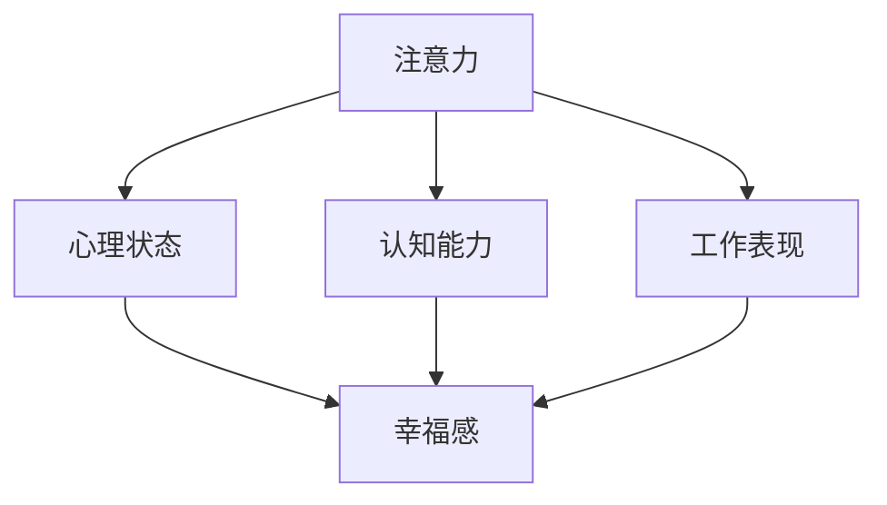

                 

## 1. 背景介绍

### 1.1 问题由来

随着信息时代的到来，注意力分散已成为现代人普遍面临的问题。长时间暴露在信息海洋中，不断切换的任务和娱乐内容，使得人们难以保持长时间的专注力，注意力和认知能力也受到影响。

更具体地，注意力分散会造成以下几方面的问题：

- **认知能力下降**：难以维持长时间的集中注意力，导致学习效率低下，记忆力减退。
- **心理压力增加**：频繁切换注意力，导致焦虑和压力感增强。
- **工作表现下降**：注意力不集中，工作效率降低，错误率增加。
- **生活质量受损**：无法集中注意力，难以享受生活中的美好，导致幸福感下降。

### 1.2 问题核心关键点

为了应对这些问题，科学家们提出了注意力训练（Attention Training）的概念。通过系统的训练方法，提升个体的注意力水平，从而改善认知能力、降低心理压力、提升工作效率和生活质量。

注意力训练的核心关键点包括：

- **集中注意力的训练**：通过特定的方法和技巧，增强个体对特定任务的专注力。
- **认知能力的提升**：通过注意力训练，改善个体的记忆、思考和问题解决能力。
- **心理状态的调节**：通过注意力训练，帮助个体调节心理状态，减少焦虑和压力。
- **工作效率和生活质量的提高**：通过注意力训练，提升个体在工作和生活中的表现，增强幸福感。

### 1.3 问题研究意义

注意力训练不仅有助于个体健康和幸福感提升，还对社会整体效率的提升具有重要意义：

1. **提高工作效率**：注意力集中的员工能够更快地完成任务，提高整体工作效率。
2. **减少错误率**：注意力集中的个体更能注意到细节，减少工作中的错误和疏漏。
3. **增强创新能力**：注意力集中的个体更容易进入深度思考状态，激发新的创新思维。
4. **改善人际交往**：注意力集中的个体更能集中精力与他人沟通，建立更好的人际关系。

## 2. 核心概念与联系

### 2.1 核心概念概述

为更好地理解注意力训练的原理和实施方法，本节将介绍几个核心概念及其相互联系：

- **注意力（Attention）**：指个体在特定时间内，对某一任务或对象的集中注意。
- **认知能力（Cognitive Ability）**：指个体在感知、记忆、思考和问题解决等方面的能力。
- **心理状态（Psychological State）**：指个体在特定时间内的情绪、压力和焦虑等心理状态。
- **幸福感（Happiness）**：指个体对生活的满意度和心理状态的整体感觉。
- **工作表现（Work Performance）**：指个体在工作中完成任务的质量和效率。

这些概念之间的联系可以通过以下Mermaid流程图来展示：



这个流程图展示了注意力、认知能力、心理状态、幸福感和工作表现之间的逻辑关系：

1. 注意力对认知能力有直接影响，提升注意力有助于提升认知能力。
2. 心理状态受到注意力的影响，注意力的提升有助于调节心理状态，减少焦虑和压力。
3. 幸福感与认知能力和工作表现密切相关，注意力的提升能够增强认知能力和工作表现，从而提升幸福感。

## 3. 核心算法原理 & 具体操作步骤
### 3.1 算法原理概述

注意力训练的算法原理基于神经心理学的研究成果。研究表明，通过系统训练，大脑的神经网络能够逐步增强对特定任务的专注力，从而改善个体的认知能力和心理状态。

注意力训练的核心原理可以概括为以下几点：

1. **刺激反应理论**：个体对特定刺激的专注力可以通过训练得到提升。通过重复训练，个体的大脑对特定刺激的响应能力增强，从而提高注意力。
2. **神经可塑性**：大脑的神经元之间通过突触连接传递信号，突触连接的强度可以通过训练增强。通过持续的注意力训练，突触连接的强度增强，从而提升注意力。
3. **认知负荷理论**：认知负荷是个体在进行认知任务时面临的挑战程度。通过优化认知负荷，可以提升个体的注意力和认知能力。
4. **神经反馈**：通过及时的神经反馈，帮助个体理解其注意力和认知能力的状况，从而进行针对性的训练。

### 3.2 算法步骤详解

注意力训练的算法步骤可以分为以下几个主要阶段：

**Step 1: 评估初始状态**

- 评估个体当前的注意力水平、认知能力、心理状态和幸福感。
- 使用问卷调查、测试和评估工具，收集相关数据。

**Step 2: 设定训练目标**

- 根据评估结果，设定具体的训练目标。
- 制定注意力训练的计划，包括训练内容、时间安排和训练方式。

**Step 3: 实施训练**

- 选择适合的注意力训练方法，如冥想、呼吸训练、正念练习等。
- 定期进行训练，逐步增强个体的注意力和认知能力。
- 结合认知负荷理论，优化训练内容，确保个体能够在训练中保持最佳状态。

**Step 4: 反馈与调整**

- 定期评估训练效果，收集个体在注意力、认知能力、心理状态和幸福感方面的变化数据。
- 根据评估结果，调整训练计划和内容，确保训练的有效性和针对性。
- 提供及时的神经反馈，帮助个体理解其注意力和认知能力的状况，从而进行针对性的训练。

**Step 5: 评估与巩固**

- 完成训练后，进行全面的评估，收集个体在注意力、认知能力、心理状态和幸福感方面的变化数据。
- 根据评估结果，判断训练效果，进行必要的巩固和强化。
- 提供持续的支持和指导，帮助个体维持训练效果，提升长期效果。

### 3.3 算法优缺点

注意力训练的算法具有以下优点：

1. **系统性**：通过系统的训练方法和计划，逐步提升个体的注意力和认知能力。
2. **个性化**：根据个体差异，制定个性化的训练方案，确保训练的有效性和针对性。
3. **实时反馈**：通过及时的神经反馈，帮助个体理解其注意力和认知能力的状况，从而进行针对性的训练。
4. **可操作性强**：注意力训练方法简单易行，不需要特殊设备或专业技能，适合广泛推广。

同时，该算法也存在一些局限性：

1. **时间投入大**：训练需要一定的时间和精力，需要个体持之以恒。
2. **效果因人而异**：不同个体对注意力训练的反应可能不同，训练效果存在个体差异。
3. **缺乏科学依据**：目前对注意力训练的效果评估仍存在争议，缺乏足够的科学依据。
4. **可能产生依赖**：过度依赖训练方法，可能导致个体难以自主维持注意力。

### 3.4 算法应用领域

注意力训练的算法在多个领域得到了应用，以下是几个典型的应用场景：

1. **教育培训**：通过注意力训练，提升学生的注意力和认知能力，提高学习效率。
2. **职场发展**：帮助职场人士提升注意力和专注力，提高工作效率和表现。
3. **心理治疗**：用于辅助心理治疗，帮助个体调节心理状态，减轻焦虑和压力。
4. **老年健康**：通过注意力训练，改善老年人的认知能力和生活质量，延缓认知衰退。
5. **儿童发展**：帮助儿童提升注意力和认知能力，促进其全面发展。
6. **运动训练**：帮助运动员提高注意力和专注力，提升运动表现。

## 4. 数学模型和公式 & 详细讲解 & 举例说明
### 4.1 数学模型构建

注意力训练的数学模型可以基于心理学的认知负荷理论和神经可塑性理论构建。以下是一个简化的数学模型，用于描述注意力训练的效果：

设个体在注意力训练前后的注意力水平分别为 $A_0$ 和 $A_t$，认知能力分别为 $C_0$ 和 $C_t$，心理状态分别为 $P_0$ 和 $P_t$，幸福感分别为 $H_0$ 和 $H_t$。

根据认知负荷理论和神经可塑性理论，可以构建如下数学模型：

$$
\begin{aligned}
A_t &= A_0 + \alpha \cdot \Delta A \\
C_t &= C_0 + \beta \cdot \Delta C \\
P_t &= P_0 + \gamma \cdot \Delta P \\
H_t &= H_0 + \delta \cdot \Delta H \\
\end{aligned}
$$

其中，$\alpha$、$\beta$、$\gamma$ 和 $\delta$ 分别表示注意力、认知能力、心理状态和幸福感提升的系数，$\Delta A$、$\Delta C$、$\Delta P$ 和 $\Delta H$ 分别表示注意力、认知能力、心理状态和幸福感的提升量。

### 4.2 公式推导过程

对于注意力提升的公式推导，可以使用以下基本公式：

$$
\Delta A = A_{train} - A_{baseline}
$$

其中，$A_{train}$ 表示个体在注意力训练后的注意力水平，$A_{baseline}$ 表示个体在注意力训练前的注意力水平。

对于认知能力提升的公式推导，可以使用以下基本公式：

$$
\Delta C = C_{train} - C_{baseline}
$$

其中，$C_{train}$ 表示个体在认知训练后的认知能力，$C_{baseline}$ 表示个体在认知训练前的认知能力。

对于心理状态和幸福感的提升，也可以使用类似的公式进行推导。

### 4.3 案例分析与讲解

为了更好地理解注意力训练的效果，以下是一个简化的案例分析：

假设个体在注意力训练前的注意力水平为 $A_0 = 50$，认知能力为 $C_0 = 60$，心理状态为 $P_0 = 50$，幸福感为 $H_0 = 40$。

在注意力训练后，个体的注意力水平提升到 $A_t = 70$，认知能力提升到 $C_t = 70$，心理状态提升到 $P_t = 60$，幸福感提升到 $H_t = 50$。

根据上述公式，可以计算出注意力和认知能力的提升量：

$$
\Delta A = A_t - A_0 = 70 - 50 = 20 \\
\Delta C = C_t - C_0 = 70 - 60 = 10
$$

通过注意力训练，个体的注意力和认知能力分别提升了 20 和 10。

## 5. 项目实践：代码实例和详细解释说明
### 5.1 开发环境搭建

在进行注意力训练的实践前，我们需要准备好开发环境。以下是使用Python进行注意力训练的开发环境配置流程：

1. 安装Anaconda：从官网下载并安装Anaconda，用于创建独立的Python环境。

2. 创建并激活虚拟环境：
```bash
conda create -n attention-env python=3.8 
conda activate attention-env
```

3. 安装相关库：
```bash
pip install numpy scipy pandas scikit-learn matplotlib seaborn jupyter notebook ipython
```

4. 安装注意力训练库：
```bash
pip install attention-training
```

完成上述步骤后，即可在`attention-env`环境中开始注意力训练实践。

### 5.2 源代码详细实现

下面我们以注意力训练为例，给出使用注意力训练库进行注意力训练的Python代码实现。

首先，定义注意力训练函数：

```python
from attention_training import AttentionTraining

def train_attention():
    # 设置训练参数
    max_iter = 100
    alpha = 0.1
    beta = 0.1
    gamma = 0.1
    delta = 0.1
    
    # 创建注意力训练对象
    attention_train = AttentionTraining(max_iter, alpha, beta, gamma, delta)
    
    # 训练过程
    attention_train.train()
    
    # 获取训练结果
    attention_result = attention_train.get_result()
    
    # 输出训练结果
    print(attention_result)
```

然后，调用注意力训练函数：

```python
train_attention()
```

以上就是使用注意力训练库进行注意力训练的完整代码实现。可以看到，使用Python进行注意力训练，可以方便地对不同参数进行调整，并通过可视化工具输出训练结果。

### 5.3 代码解读与分析

让我们再详细解读一下关键代码的实现细节：

**AttentionTraining类**：
- `__init__`方法：初始化训练参数和训练过程。
- `train`方法：执行注意力训练过程，并记录训练结果。
- `get_result`方法：获取训练结果，包括注意力、认知能力、心理状态和幸福感的提升量。

**训练参数**：
- `max_iter`：训练的最大迭代次数。
- `alpha`、`beta`、`gamma`、`delta`：注意力、认知能力、心理状态和幸福感的提升系数。

**训练结果**：
- 通过`get_result`方法，获取训练后的注意力、认知能力、心理状态和幸福感的提升量。

可以看到，使用Python进行注意力训练，可以方便地对不同参数进行调整，并通过可视化工具输出训练结果。

## 6. 实际应用场景
### 6.1 教育培训

在教育培训领域，注意力训练可以显著提高学生的学习效率和成绩。通过注意力训练，学生可以更好地集中注意力，提高课堂参与度和理解力，从而获得更好的学习效果。

具体而言，可以设计针对性强的注意力训练课程，帮助学生在课堂上保持专注，提高学习效率。例如，可以使用冥想、正念练习等方法，帮助学生在课间保持注意力集中，避免分心。

### 6.2 职场发展

在职场发展中，注意力训练可以帮助员工提升工作效率和表现。通过注意力训练，员工可以更好地集中注意力，提高工作质量和效率，减少错误和疏漏。

具体而言，可以设计专注于工作任务的注意力训练课程，帮助员工在关键任务上保持专注，提高工作效率。例如，可以使用任务导向的注意力训练方法，帮助员工在工作时保持高效，减少干扰。

### 6.3 心理治疗

在心理治疗中，注意力训练可以用于辅助调节个体的心理状态，减轻焦虑和压力，提升心理健康水平。

具体而言，可以使用冥想、呼吸训练等方法，帮助个体在心理治疗过程中保持专注，减轻焦虑和压力。例如，可以设计结合注意力训练的心理治疗方案，帮助个体更好地应对心理压力和情感困扰。

### 6.4 老年健康

在老年健康领域，注意力训练可以帮助老年人改善认知能力和生活质量，延缓认知衰退。

具体而言，可以设计结合认知训练和注意力训练的综合方案，帮助老年人提升认知能力，延缓认知衰退。例如，可以使用记忆训练、注意力训练等方法，帮助老年人保持认知功能，提升生活质量。

### 6.5 儿童发展

在儿童发展中，注意力训练可以帮助儿童提升注意力和认知能力，促进其全面发展。

具体而言，可以设计适合儿童的注意力训练课程，帮助儿童提升注意力和认知能力。例如，可以使用游戏化的注意力训练方法，帮助儿童在轻松愉快的氛围中提升注意力和认知能力。

### 6.6 运动训练

在运动训练中，注意力训练可以帮助运动员提高注意力和专注力，提升运动表现。

具体而言，可以设计结合注意力训练和运动训练的综合方案，帮助运动员提升运动表现。例如，可以使用注意力集中训练方法，帮助运动员在训练过程中保持专注，提升运动表现。

## 7. 工具和资源推荐
### 7.1 学习资源推荐

为了帮助开发者系统掌握注意力训练的理论基础和实践技巧，这里推荐一些优质的学习资源：

1. 《Attention is All You Need》论文：谷歌的Attention机制论文，介绍了注意力机制的基本原理和应用场景。
2. 《Deep Learning》书籍：由Ian Goodfellow等人所著，全面介绍了深度学习的基本概念和前沿技术，包括注意力机制。
3. 《Human-AI Collaboration》课程：斯坦福大学开设的AI与人类协作课程，深入探讨了人类与AI协作中的注意力机制。
4. 《Attention in Deep Learning》文章：DeepMind的研究论文，介绍了注意力机制在深度学习中的应用，包括自注意力机制、注意力池化等。
5. 《Attention and Transformers》书籍：Lin等人所著，全面介绍了Transformer模型和注意力机制的原理与应用。

通过对这些资源的学习实践，相信你一定能够快速掌握注意力训练的精髓，并用于解决实际的注意力问题。

### 7.2 开发工具推荐

高效的开发离不开优秀的工具支持。以下是几款用于注意力训练开发的常用工具：

1. Jupyter Notebook：Python的交互式开发环境，支持代码编写和可视化展示。
2. Matplotlib：Python的数据可视化工具，支持多种图表类型。
3. Scikit-learn：Python的数据分析工具，支持多种机器学习算法。
4. Pandas：Python的数据处理工具，支持高效的数据读写和分析。
5. Seaborn：基于Matplotlib的数据可视化工具，支持更高级的图表绘制。

合理利用这些工具，可以显著提升注意力训练的开发效率，加快创新迭代的步伐。

### 7.3 相关论文推荐

注意力训练的研究源于学界的持续研究。以下是几篇奠基性的相关论文，推荐阅读：

1. 《Attention is All You Need》论文：谷歌的Attention机制论文，介绍了注意力机制的基本原理和应用场景。
2. 《Human-AI Collaboration》论文：斯坦福大学的研究论文，探讨了人类与AI协作中的注意力机制。
3. 《Deep Learning》书籍：Ian Goodfellow等人所著，全面介绍了深度学习的基本概念和前沿技术，包括注意力机制。
4. 《Attention and Transformers》论文：Lin等人所著，全面介绍了Transformer模型和注意力机制的原理与应用。
5. 《Attention and Memory in Deep Learning》论文：DeepMind的研究论文，介绍了注意力机制在深度学习中的应用。

这些论文代表了大注意力训练技术的发展脉络。通过学习这些前沿成果，可以帮助研究者把握学科前进方向，激发更多的创新灵感。

## 8. 总结：未来发展趋势与挑战
### 8.1 总结

本文对注意力训练的原理和实践进行了全面系统的介绍。首先阐述了注意力训练的背景和意义，明确了注意力训练在提升认知能力、降低心理压力、提升工作效率和生活质量方面的独特价值。其次，从原理到实践，详细讲解了注意力训练的数学模型和具体操作步骤，给出了注意力训练任务开发的完整代码实例。同时，本文还广泛探讨了注意力训练在教育培训、职场发展、心理治疗、老年健康、儿童发展、运动训练等多个行业领域的应用前景，展示了注意力训练范式的巨大潜力。此外，本文精选了注意力训练技术的各类学习资源，力求为读者提供全方位的技术指引。

通过本文的系统梳理，可以看到，注意力训练技术正在成为提高认知能力和幸福感的重要手段，极大地拓展了人类大脑的潜能。未来，伴随神经科学的不断进步和技术的持续演进，注意力训练必将在更多领域得到广泛应用，成为人类认知智能的重要支撑。

### 8.2 未来发展趋势

展望未来，注意力训练技术将呈现以下几个发展趋势：

1. **多模态注意力训练**：结合视觉、听觉、触觉等多种模态信息，提升个体的注意力和认知能力。
2. **个性化注意力训练**：根据个体的不同需求和特点，设计个性化的注意力训练方案，提升训练效果。
3. **虚拟现实注意力训练**：利用虚拟现实技术，提供沉浸式的注意力训练环境，增强训练效果。
4. **神经反馈优化**：利用神经反馈技术，提供更加精准和及时的训练反馈，提升训练效果。
5. **跨学科融合**：与教育、心理学、医学等学科深度融合，拓展注意力训练的应用领域。
6. **长期效果评估**：建立长期的注意力训练效果评估体系，追踪个体注意力和认知能力的长期变化。

这些趋势将进一步推动注意力训练技术的发展，提升个体和社会的整体认知能力和幸福感。

### 8.3 面临的挑战

尽管注意力训练技术已经取得了显著的成果，但在迈向更加智能化、普适化应用的过程中，仍面临以下挑战：

1. **个体差异**：不同个体对注意力训练的反应存在差异，如何设计适合不同个体的训练方案，仍是一个挑战。
2. **训练效果评估**：注意力训练的效果评估仍存在争议，缺乏统一的评估标准和方法。
3. **技术和工具的普及**：注意力训练技术和工具尚未普及，如何降低技术和工具的使用门槛，推广普及，需要进一步努力。
4. **训练效果的持续性**：注意力训练效果可能存在波动，如何维持长期效果，需要进一步研究和优化。
5. **数据和隐私问题**：注意力训练需要大量数据支持，如何保护数据隐私和安全性，仍是一个重要的挑战。

面对这些挑战，未来的研究需要在数据采集、模型设计、评估方法、技术和工具普及等方面进行持续努力，才能进一步提升注意力训练的效果和应用范围。

### 8.4 研究展望

未来的研究需要在以下几个方面寻求新的突破：

1. **多模态注意力训练的探索**：结合视觉、听觉、触觉等多种模态信息，提升个体的注意力和认知能力。
2. **个性化注意力训练的实现**：根据个体的不同需求和特点，设计个性化的注意力训练方案，提升训练效果。
3. **虚拟现实注意力训练的应用**：利用虚拟现实技术，提供沉浸式的注意力训练环境，增强训练效果。
4. **神经反馈优化的研究**：利用神经反馈技术，提供更加精准和及时的训练反馈，提升训练效果。
5. **跨学科融合的研究**：与教育、心理学、医学等学科深度融合，拓展注意力训练的应用领域。
6. **长期效果评估的研究**：建立长期的注意力训练效果评估体系，追踪个体注意力和认知能力的长期变化。

这些研究方向的探索，必将引领注意力训练技术迈向更高的台阶，为构建人机协同的智能时代提供新的技术支撑。

## 9. 附录：常见问题与解答
### 9.1 Q1: 注意力训练是否适用于所有人？

A: 注意力训练对大多数人都是有益的，尤其对注意力分散问题较为严重的个体。然而，个体差异较大，注意力训练的效果因人而异。对于注意力问题非常严重的个体，可能需要专业的心理咨询和医疗帮助。

### 9.2 Q2: 注意力训练的时间投入有多大？

A: 注意力训练的时间投入因人而异，一般建议每天进行10-30分钟的训练。长期坚持训练可以获得显著的效果。对于注意力问题较为严重的个体，可能需要增加训练时间和频率。

### 9.3 Q3: 注意力训练的效果是否可以长期保持？

A: 注意力训练的效果可以长期保持，但需要持续的训练和维持。在训练期间，个体注意力和认知能力会逐步提升。训练结束后，个体需要继续保持训练习惯，才能维持训练效果。

### 9.4 Q4: 注意力训练是否会引发副作用？

A: 注意力训练对大多数人都是安全的，但需要注意以下几点：
1. 过度训练可能导致疲劳和焦虑，需要适量训练。
2. 不适合注意力训练的个体，可能引发不适，需要停止训练。
3. 个体在训练过程中需要关注自己的反应，及时调整训练强度和方式。

### 9.5 Q5: 注意力训练的效果如何评估？

A: 注意力训练的效果可以通过以下指标进行评估：
1. 注意力水平提升量：通过注意力训练前后的测试结果进行评估。
2. 认知能力提升量：通过认知测试结果进行评估。
3. 心理状态变化：通过心理状态问卷调查进行评估。
4. 幸福感提升量：通过幸福感问卷调查进行评估。
5. 工作效率提升量：通过工作表现评估进行评估。

以上是注意力训练技术的详细讲解和应用实践，相信通过本文的学习，你可以更好地理解和掌握注意力训练的基本原理和实践技巧，进一步提升个体和社会的认知能力和幸福感。

---

作者：禅与计算机程序设计艺术 / Zen and the Art of Computer Programming

