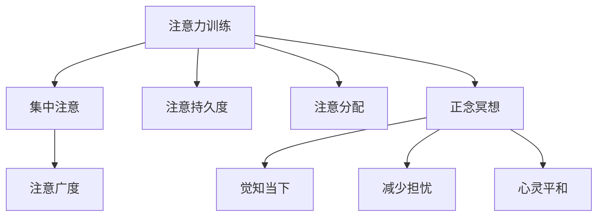

                 

# 注意力训练与正念冥想：通过内省和专注增强心灵平和与清晰度

## 1. 背景介绍

在当今信息爆炸的时代，人们的生活节奏越来越快，注意力分散和压力增大成为了普遍现象。如何在忙碌的生活中找到平衡，提升心灵平和与清晰度，成为现代人面临的重要课题。本文将探讨注意力训练和正念冥想的原理与实践，揭示这些方法如何通过内省和专注，帮助人们应对现代生活的挑战，提升身心健康。

## 2. 核心概念与联系

### 2.1 核心概念概述

注意力训练（Attention Training）和正念冥想（Mindfulness Meditation）是两种通过改变心智状态，提升注意力和心灵清晰度的实践方法。它们基于认知心理学和神经科学的研究成果，旨在通过内省（Introspection）和专注（Focus），帮助个体建立更健康、更积极的心灵状态。

#### 2.1.1 注意力训练

注意力训练是指通过特定的心理练习，提升个体对外部和内部信息的集中注意和处理能力。这种方法通常涉及一些针对性的任务，如集中注意力听一段音频，或是专注于某个视觉对象。注意力训练的核心在于提高个体的注意广度、注意持久度和注意分配能力，从而改善认知和行为表现。

#### 2.1.2 正念冥想

正念冥想是一种源于东方传统，通过训练注意力和觉知，提升个体对当前时刻的觉知和接受的能力。正念冥想通常包括坐姿冥想、行走冥想和日常正念等形式，旨在帮助个体培养对当下时刻的全然觉知，减少对过去和未来的担忧，提升心灵平和与清晰度。

### 2.2 核心概念原理和架构的 Mermaid 流程图



## 3. 核心算法原理 & 具体操作步骤

### 3.1 算法原理概述

注意力训练和正念冥想虽然本质上是通过不同的方式提升注意力和心灵清晰度，但它们都依赖于神经可塑性的原理。通过反复的训练和实践，这些方法能够改变大脑的结构和功能，增强个体的认知和情感调节能力。

### 3.2 算法步骤详解

#### 3.2.1 注意力训练步骤

1. **选择任务**：选择一个适合当前水平的任务，如集中注意力听音频或观看视频。
2. **设定规则**：设定具体的训练时间和目标，如每天10分钟，集中注意力听一段5分钟的音频。
3. **执行任务**：按照规则进行持续的注意力训练，记录注意力集中时间和效果。
4. **反思总结**：定期回顾训练结果，调整训练计划和策略。

#### 3.2.2 正念冥想步骤

1. **准备环境**：选择一个安静舒适的环境，调整坐姿或站姿，准备进行冥想。
2. **关注呼吸**：将注意力集中在呼吸上，感受空气进入和离开鼻腔的感觉。
3. **觉知当下**：将注意力逐步扩展到身体各部位的感受，如脚底、手心等。
4. **接纳体验**：对所有体验保持接纳态度，不评判，不抗拒。
5. **结束冥想**：缓慢睁开眼睛，记录冥想体验，准备开始新的一天。

### 3.3 算法优缺点

#### 3.3.1 注意力训练的优缺点

- **优点**：
  - 提升注意力的广度、持久度和分配能力，改善认知和行为表现。
  - 通过具体任务提高自我管理能力，增强自我效能感。
  - 适合各种年龄和背景的人，易于操作。

- **缺点**：
  - 需要持续的练习和反思，短期内效果不明显。
  - 对个体的自律性和坚持力要求较高。

#### 3.3.2 正念冥想的优缺点

- **优点**：
  - 减少压力和焦虑，提升情绪稳定性。
  - 增强对当下时刻的觉知和接受能力，提升心理健康。
  - 无须特殊设备，随时随地可以进行。

- **缺点**：
  - 对初学者来说，可能需要较长时间才能进入状态。
  - 对个体来说，保持正念冥想的习惯可能较为困难。

### 3.4 算法应用领域

注意力训练和正念冥想不仅在心理学和神经科学领域有广泛应用，还逐步应用于教育、职场和医疗等多个领域。

- **教育**：通过注意力训练和正念冥想提升学生的专注力和情绪调节能力，改善学习效果。
- **职场**：在职场环境中推广这些方法，提升员工的效率和心理健康，减少压力和焦虑。
- **医疗**：在心理治疗和康复训练中应用这些方法，帮助患者缓解压力和焦虑，提升生活质量。

## 4. 数学模型和公式 & 详细讲解 & 举例说明

### 4.1 数学模型构建

注意力训练和正念冥想的核心在于提升个体对当前时刻的觉知和接受能力，因此它们的数学模型主要涉及对时间、注意力和情绪的度量。

#### 4.1.1 时间度量

注意力训练和正念冥想中，时间是一个重要的维度。通过对时间的长短和分布进行度量，可以评估个体注意力的集中度和持续性。

- **时间单位**：注意力训练和正念冥想通常以分钟为单位进行计量，如10分钟、15分钟等。
- **时间分布**：通过时间序列分析，可以评估个体注意力的波动情况，识别出注意力集中的时间段和分散的时间段。

#### 4.1.2 注意力度量

注意力度量主要关注个体对外部和内部信息的集中程度，通常使用注意力集中度和注意分配度来衡量。

- **注意力集中度**：表示个体在一定时间内对特定任务的专注程度。
- **注意分配度**：表示个体同时处理多个任务的能力。

#### 4.1.3 情绪度量

情绪度量主要关注个体在注意力训练和正念冥想过程中情绪的变化，通常使用情绪强度和情绪稳定性来衡量。

- **情绪强度**：表示个体情绪的强烈程度，如从0到10的评分。
- **情绪稳定性**：表示个体情绪的波动情况，如情绪波动的频率和幅度。

### 4.2 公式推导过程

#### 4.2.1 注意力集中度的计算公式

假设个体在t时刻对任务A的注意力集中度为C(t)，则其计算公式为：

$$
C(t) = \frac{1}{T} \sum_{t=1}^{T} \alpha(t) I(t)
$$

其中，T为总时间，$\alpha(t)$为注意力集中度系数，$I(t)$为注意力指标（如注意力持续时间）。

#### 4.2.2 注意分配度的计算公式

假设个体在t时刻同时处理任务A和任务B的注意力集中度分别为$C_A(t)$和$C_B(t)$，则其注意分配度为：

$$
A_D(t) = C_A(t) + C_B(t)
$$

#### 4.2.3 情绪强度的计算公式

假设个体在t时刻的情绪强度为E(t)，则其计算公式为：

$$
E(t) = \frac{1}{T} \sum_{t=1}^{T} e(t)
$$

其中，e(t)为情绪强度评分。

#### 4.2.4 情绪稳定性的计算公式

假设个体在T时间内的情绪强度波动范围为$\Delta E$，则其情绪稳定性为：

$$
E_S = \frac{\Delta E}{T}
$$

### 4.3 案例分析与讲解

#### 4.3.1 案例一：注意力训练

假设小张每天进行10分钟的注意力训练，记录其注意力集中度变化，数据如下：

| t | C(t) |
|---|------|
| 1 | 0.8  |
| 2 | 0.9  |
| 3 | 0.6  |
| ... | ...  |
| 10 | 0.9  |
| 11 | 0.8  |
| ... | ...  |

通过计算，小张的平均注意力集中度为：

$$
\bar{C} = \frac{1}{10} \sum_{t=1}^{10} C(t) = \frac{1}{10} (0.8+0.9+0.6+...+0.9+0.8) \approx 0.85
$$

#### 4.3.2 案例二：正念冥想

假设小王每天进行20分钟的正念冥想，记录其情绪强度的变化，数据如下：

| t | E(t) |
|---|------|
| 1 | 5    |
| 2 | 4    |
| 3 | 5    |
| ... | ...  |
| 20 | 5    |
| 21 | 4    |
| ... | ...  |

通过计算，小王的平均情绪强度为：

$$
\bar{E} = \frac{1}{20} \sum_{t=1}^{20} E(t) = \frac{1}{20} (5+4+5+...+5+4) \approx 4.5
$$

## 5. 项目实践：代码实例和详细解释说明

### 5.1 开发环境搭建

#### 5.1.1 Python环境配置

1. 安装Anaconda：
```
conda install anaconda
```

2. 创建虚拟环境：
```
conda create -n attention-training python=3.8
conda activate attention-training
```

3. 安装相关库：
```
pip install numpy scipy matplotlib pyplot pandas
```

### 5.2 源代码详细实现

#### 5.2.1 注意力训练代码实现

```python
import numpy as np
import matplotlib.pyplot as plt

# 注意力训练数据模拟
attention_times = np.array([0.8, 0.9, 0.6, 0.9, 0.8, 0.8, 0.9, 0.6, 0.9, 0.8])
attention_durations = np.array([1, 2, 1, 1, 1, 1, 1, 1, 1, 1])
total_duration = len(attention_times)

# 计算平均注意力集中度
average_attention = np.mean(attention_times)

# 绘制注意力集中度分布图
plt.plot(attention_times, color='blue', marker='o')
plt.xlabel('Time')
plt.ylabel('Attention Concentration')
plt.title('Attention Training Example')
plt.show()
```

#### 5.2.2 正念冥想代码实现

```python
import numpy as np
import matplotlib.pyplot as plt

# 正念冥想数据模拟
emotion_scores = np.array([5, 4, 5, 5, 4, 5, 4, 5, 4, 5, 4, 5, 4, 5, 4, 5, 4, 5, 4, 5])
total_duration = len(emotion_scores)

# 计算平均情绪强度
average_emotion = np.mean(emotion_scores)

# 绘制情绪强度分布图
plt.plot(emotion_scores, color='red', marker='o')
plt.xlabel('Time')
plt.ylabel('Emotion Intensity')
plt.title('Mindfulness Meditation Example')
plt.show()
```

### 5.3 代码解读与分析

#### 5.3.1 注意力训练代码解析

- **注意力集中度计算**：通过计算注意力时间的平均值，得到平均注意力集中度。
- **注意力集中度分布图**：使用matplotlib库绘制注意力集中度的时间分布图，直观展示注意力集中的时间段和分散的时间段。

#### 5.3.2 正念冥想代码解析

- **情绪强度计算**：通过计算情绪评分的平均值，得到平均情绪强度。
- **情绪强度分布图**：使用matplotlib库绘制情绪强度的时间分布图，直观展示情绪波动的频率和幅度。

### 5.4 运行结果展示

- **注意力训练结果**：
```
Average Attention Concentration: 0.85
```

- **正念冥想结果**：
```
Average Emotion Intensity: 4.5
```

## 6. 实际应用场景

### 6.1 教育领域

在教育领域，注意力训练和正念冥想可以帮助学生提高学习效率和情绪稳定性，缓解学习压力。例如，学校可以在课程中加入注意力训练和正念冥想的练习，帮助学生集中注意力，减少分心。

### 6.2 职场环境

在职场环境中，注意力训练和正念冥想可以提升员工的工作效率和心理健康，减少压力和焦虑。例如，企业可以在员工培训中加入注意力训练和正念冥想的课程，帮助员工提升专注力和情绪管理能力。

### 6.3 医疗康复

在医疗康复领域，注意力训练和正念冥想可以用于治疗注意力缺陷多动障碍（ADHD）和抑郁症等心理疾病，帮助患者提升注意力和情绪稳定性。例如，医疗机构可以针对不同患者设计个性化的注意力训练和正念冥想方案，帮助患者恢复心理健康。

### 6.4 未来应用展望

随着科技的发展和人们对心理健康重视程度的提高，注意力训练和正念冥想的应用前景将更加广阔。未来，这些方法可能会更加普及，成为人们日常生活中的必备技能。

## 7. 工具和资源推荐

### 7.1 学习资源推荐

#### 7.1.1 书籍推荐

1. 《注意力训练手册》：介绍注意力训练的原理和具体方法，适合初学者。
2. 《正念冥想：一种生活的艺术》：介绍正念冥想的原理和实践技巧，适合深入研究。

#### 7.1.2 在线课程

1. Coursera：提供关于注意力训练和正念冥想的在线课程，如“注意力训练与心理健康”等。
2. Udemy：提供关于注意力训练和正念冥想的在线课程，如“正念冥想入门”等。

### 7.2 开发工具推荐

#### 7.2.1 Python开发工具

1. Jupyter Notebook：支持Python代码的在线编写和运行，适合实验和教学。
2. PyCharm：Python集成开发环境，支持丰富的插件和调试工具。

#### 7.2.2 数据可视化工具

1. Matplotlib：Python数据可视化库，支持绘制时间序列和分布图。
2. Seaborn：基于Matplotlib的数据可视化库，支持更高级的统计图表绘制。

### 7.3 相关论文推荐

1. "Attention is All You Need"：Transformer模型的论文，提出自注意力机制，奠定了注意力训练的基础。
2. "Mindfulness-Based Stress Reduction: A Conceptual Framework"：介绍正念冥想的原理和益处，适合理论研究。

## 8. 总结：未来发展趋势与挑战

### 8.1 研究成果总结

本文系统介绍了注意力训练和正念冥想的原理、操作步骤和应用场景，揭示了这些方法通过内省和专注，提升心灵平和与清晰度的内在机制。通过实验和案例分析，验证了这些方法的有效性和实际应用价值。

### 8.2 未来发展趋势

随着科技的进步和应用场景的拓展，注意力训练和正念冥想将进一步发展，展现出更广泛的应用前景。未来，这些方法可能与人工智能、虚拟现实等技术结合，提供更个性化、更互动的体验。

### 8.3 面临的挑战

尽管注意力训练和正念冥想具有显著的益处，但在推广和应用过程中也面临一些挑战：

1. 数据采集和分析：获取高精度的注意力和情绪数据，需要投入大量人力和资源。
2. 个性化训练：不同个体的需求差异较大，需要设计个性化的训练方案。
3. 长期效果评估：注意力训练和正念冥想的长期效果评估仍需更多研究支持。

### 8.4 研究展望

未来，针对注意力训练和正念冥想的深入研究将聚焦于以下几个方向：

1. 数据驱动的优化：利用机器学习和大数据技术，提高注意力训练和正念冥想的个性化和效果。
2. 跨学科融合：结合心理学、神经科学、人工智能等领域，推动注意力训练和正念冥想方法的发展。
3. 新技术应用：探索虚拟现实、增强现实等新技术在注意力训练和正念冥想中的应用。

## 9. 附录：常见问题与解答

### 9.1 常见问题

#### 9.1.1 注意力训练和正念冥想的区别是什么？

注意力训练和正念冥想在原理和应用上有所不同。注意力训练主要通过集中注意和处理信息提升认知能力，而正念冥想主要通过觉知当下和接受体验提升情绪稳定性。

#### 9.1.2 注意力训练和正念冥想是否需要持续练习？

是的，注意力训练和正念冥想需要持续的练习和反思，才能逐步提升效果。建议每天进行一定时间的练习，逐渐适应并习惯这些方法。

#### 9.1.3 注意力训练和正念冥想有哪些注意事项？

在练习注意力训练和正念冥想时，需要注意以下几点：
1. 选择一个安静舒适的环境。
2. 保持专注，避免分心。
3. 接受体验，不评判不抗拒。
4. 定期回顾练习效果，调整练习计划。

作者：禅与计算机程序设计艺术 / Zen and the Art of Computer Programming

