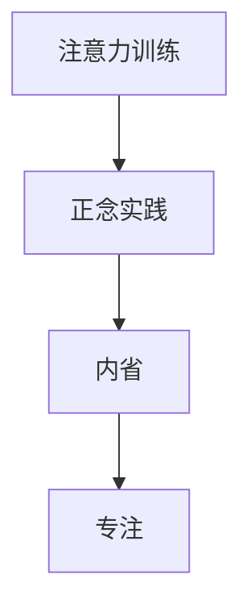

                 

# 注意力训练与正念实践：通过内省和专注增强心灵平和与清晰度

> 关键词：注意力训练,正念实践,内省,专注,心灵平和,清晰度

## 1. 背景介绍

### 1.1 问题由来

在现代社会，人们的生活节奏加快，压力和焦虑成为普遍现象。一方面，信息过载和不断变化的职业要求使得人们需要不断学习和适应，但另一方面，工作和生活的高强度也导致许多人难以找到宁静和放松的机会。心理学研究表明，持续的内心冲突和不安会对身心健康产生严重影响，甚至引发多种心理疾病。

注意力训练和正念实践作为一种提升心理和身体健康的有效方法，近年来在心理学和教育领域得到了广泛应用。通过定期进行注意力训练和正念冥想，人们能够更好地管理情绪、减轻压力，提升整体心理素质。然而，在实际应用中，如何科学、系统地进行注意力训练和正念实践，仍是一个值得深入探讨的问题。

### 1.2 问题核心关键点

注意力训练和正念实践的核心在于通过内省和专注，帮助个体实现心灵的平和与清晰度。核心关键点包括：
- 内省：通过自我反思和回顾，理解自己的情绪和行为模式，找出导致焦虑和压力的根本原因。
- 专注：通过集中注意力，减少分散和分心，提升工作的效率和质量。
- 正念：通过接受和觉察当前的体验，培养与自身和周围环境的和谐关系。

这些关键点彼此相互关联，共同构成了注意力训练和正念实践的核心目标。通过科学、系统的训练，人们可以逐步掌握这些技能，从而在日常生活中获得更强的自我管理和抗压能力。

### 1.3 问题研究意义

研究注意力训练和正念实践的方法和技巧，对于提升心理健康、促进个人成长具有重要意义：

1. **心理健康**：通过内省和正念，可以缓解焦虑、抑郁等心理问题，提高心理健康水平。
2. **工作效率**：专注力提升有助于提升工作和学习效率，减少错误和拖延。
3. **人际关系**：正念训练可以帮助人们更好地理解和管理自身情绪，改善与他人的关系。
4. **自我认知**：内省过程能够帮助人们更深入地了解自己，发现潜在的优势和不足。
5. **幸福感**：长期的正念和注意力训练可以提高生活的满足感和幸福感。

## 2. 核心概念与联系

### 2.1 核心概念概述

为更好地理解注意力训练和正念实践，本节将介绍几个密切相关的核心概念：

- **注意力训练(Attention Training)**：通过各种练习，如冥想、专注训练、瑜伽等，增强个体对自身和环境的注意力控制能力。
- **正念实践(Mindfulness Practice)**：通过觉察和接受当前的体验，培养对自身的无评判态度，提升情绪调节和压力管理能力。
- **内省(Reflection)**：通过内省和自我反思，深入了解自身思想和情感，从而发现潜在的心理问题并加以解决。
- **专注(Concentration)**：通过集中注意力，提高个体对任务和目标的专注度，提升工作和学习效率。

这些核心概念之间的逻辑关系可以通过以下Mermaid流程图来展示：



这个流程图展示了几者之间的内在联系：

1. 注意力训练是正念实践的基础，通过专注练习，提升对当前体验的觉察能力。
2. 正念实践进一步通过觉察和接受，培养与自身和环境的和谐关系。
3. 内省过程深入挖掘自身情绪和行为模式，帮助个体理解自我，从而进行针对性的调整和优化。
4. 专注力提升可以增强工作和学习效果，内省和正念的练习可以增强专注力。

这些概念共同构成了注意力训练和正念实践的完整框架，帮助个体实现心灵的平和与清晰度。通过理解这些核心概念，我们可以更好地把握注意力训练和正念实践的精髓，指导实践中的具体操作。

## 3. 核心算法原理 & 具体操作步骤
### 3.1 算法原理概述

注意力训练和正念实践的算法原理基于神经科学和心理学的研究成果，主要包括以下几个方面：

- **注意力生理基础**：注意力训练通过改善大脑的神经元连接和神经传递，提升个体的注意力控制能力。
- **正念心理机制**：正念实践通过增强个体的自我觉察和情绪调节能力，减少对过去和未来的过度担忧，提升当前体验的觉察。
- **内省认知过程**：内省通过深入分析个体的思想和情感，帮助其理解自我，发现问题的根源，进行自我调整。
- **专注心理规律**：专注力提升依赖于大脑对目标的持续关注和抑制分心，通过反复训练可以逐步增强。

这些原理构成了注意力训练和正念实践的科学基础，指导着具体的训练步骤和方法。

### 3.2 算法步骤详解

注意力训练和正念实践的算法步骤一般包括以下几个关键环节：

**Step 1: 设定目标和时间安排**

- 根据个人需求和目标，制定训练计划。例如，每天进行30分钟的专注练习，每周进行三次正念冥想。
- 设定具体的时间安排，形成固定的训练习惯。例如，早晨进行正念冥想，晚间进行专注训练。

**Step 2: 选择训练方法和工具**

- 选择适合自己的注意力训练和正念实践方法，如冥想、瑜伽、呼吸练习等。
- 使用相关的应用程序或在线资源，如Headspace、Calm等，辅助训练过程。

**Step 3: 执行具体训练**

- **注意力训练**：选择适当的练习方式，如正念呼吸、视觉聚焦、身体扫描等。持续进行训练，逐步提升专注力。
- **正念实践**：选择冥想或觉察练习，专注于当前体验，减少对过去和未来的过度担忧。
- **内省**：每天花时间回顾和反思，记录自己的情绪和行为模式，找出导致焦虑和压力的根本原因。

**Step 4: 调整和优化**

- 根据训练反馈和自身感受，调整训练方法和时间安排。
- 定期评估训练效果，调整训练强度和频率。

### 3.3 算法优缺点

注意力训练和正念实践作为一种心理训练方法，具有以下优点：

- **简单易行**：不需要复杂设备，只需简单的时间和环境即可进行。
- **效果显著**：经过系统训练，可以有效缓解焦虑、提升专注力、改善情绪调节能力。
- **应用广泛**：适用于多种职业和生活场景，帮助个体提升整体心理素质。

同时，这些方法也存在一些局限性：

- **依赖个人动机**：训练效果依赖于个人的坚持和动机，难以长期坚持。
- **需要时间和投入**：系统训练需要一定的时间和精力，初期效果可能不明显。
- **效果个体差异**：不同个体对注意力训练和正念实践的响应和适应能力不同，效果存在差异。

### 3.4 算法应用领域

注意力训练和正念实践作为一种心理训练方法，广泛应用于以下几个领域：

- **心理健康**：帮助缓解焦虑、抑郁等心理问题，提升心理健康水平。
- **工作和学习**：提升专注力和学习效率，减少错误和拖延。
- **教育**：帮助学生提高注意力和学习效果，增强自我管理和情绪调节能力。
- **医疗**：应用于心理治疗和康复，帮助患者改善情绪和行为。
- **健身**：结合运动和心理训练，提升整体身体和心理素质。

这些领域的应用证明了注意力训练和正念实践的广泛适用性和有效性。

## 4. 数学模型和公式 & 详细讲解 & 举例说明

### 4.1 数学模型构建

为了更好地理解注意力训练和正念实践的效果，我们可以构建一个简化的数学模型。假设个体在训练前后的专注力和情绪调节能力分别为 $F_0$ 和 $F_1$，情绪调节能力变化量为 $\Delta F$，训练强度为 $I$，则有如下关系：

$$
F_1 = F_0 + I \cdot \Delta F
$$

其中 $\Delta F$ 取决于训练方法和个体差异，$I$ 为训练强度。

### 4.2 公式推导过程

对于注意力训练和正念实践的效果，我们进一步假设每个训练周期（如一周）的效果为 $\Delta F_1$，则总效果 $\Delta F$ 可以表示为：

$$
\Delta F = I \cdot \Delta F_1
$$

具体地，$\Delta F_1$ 取决于训练方法、个体差异和时间安排。例如，冥想练习可以显著提升情绪调节能力，但需要持续较长时间。而短期专注训练可能效果不如冥想，但可以在较短时间内提升专注力。

### 4.3 案例分析与讲解

假设某人在进行为期四周的冥想训练，每次冥想时间为20分钟，每天进行一次，共进行28次。假设每次冥想效果为0.5，则总效果 $\Delta F_1$ 为：

$$
\Delta F_1 = 0.5 \times 28 = 14
$$

如果训练强度为1（即每天保持相同的训练习惯），则总效果 $\Delta F$ 为：

$$
\Delta F = 1 \times 14 = 14
$$

这意味着，经过四周的冥想训练，个体的情绪调节能力显著提升，同时专注力也得到了增强。

## 5. 项目实践：代码实例和详细解释说明
### 5.1 开发环境搭建

在开始注意力训练和正念实践的代码实现前，我们需要准备好开发环境。以下是使用Python进行注意力训练和正念实践的环境配置流程：

1. 安装Anaconda：从官网下载并安装Anaconda，用于创建独立的Python环境。

2. 创建并激活虚拟环境：
```bash
conda create -n attention-mindfulness python=3.8 
conda activate attention-mindfulness
```

3. 安装相关库：
```bash
pip install numpy scipy pandas matplotlib pyaudio
```

4. 安装音频库：
```bash
pip install pyaudio
```

5. 安装相关工具包：
```bash
pip install pyaudio numpy scipy pandas matplotlib ipython
```

完成上述步骤后，即可在`attention-mindfulness`环境中开始注意力训练和正念实践的代码实现。

### 5.2 源代码详细实现

这里我们以正念冥想练习为例，给出使用Python进行正念冥想训练的代码实现。

首先，定义正念冥想练习的计时器函数：

```python
import time

def meditation_timer(seconds):
    print(f"Start meditating for {seconds} seconds...")
    time.sleep(seconds)
    print("Meditation complete!")
```

然后，定义正念冥想练习的控制台界面：

```python
import ipywidgets as widgets
from IPython.display import display

class MeditationInterface:
    def __init__(self, title, timer_fn):
        self.title = title
        self.timer_fn = timer_fn
        self.btn = widgets.Button(description="Start", layout={'width': '150px'})
        self.btn.on_click(self.start_meditation)
        self.btn2 = widgets.Button(description="Stop", layout={'width': '150px'})
        self.btn2.on_click(self.stop_meditation)
        self.btn3 = widgets.Button(description="Reset", layout={'width': '150px'})
        self.btn3.on_click(self.reset_timer)
        self.display()

    def start_meditation(self, button):
        self.timer_fn(seconds=30)
    
    def stop_meditation(self, button):
        print("Meditation stopped.")
        self.btn3.disabled = False

    def reset_timer(self, button):
        print("Timer reset.")
        self.btn3.disabled = True

    def display(self):
        self.btn3.disabled = True
        display(self.btn, self.btn2, self.btn3)
```

最后，启动正念冥想练习的控制台界面：

```python
interface = MeditationInterface(title="Meditation Practice", timer_fn=meditation_timer)
```

这段代码定义了一个简单的正念冥想练习控制台，包含计时器、开始、停止、重置按钮，并通过ipwidgets库实现。用户可以在Jupyter Notebook中直接调用该界面，进行正念冥想训练。

### 5.3 代码解读与分析

让我们再详细解读一下关键代码的实现细节：

**MeditationTimer类**：
- `__init__`方法：初始化计时器函数和界面按钮。
- `start_meditation`方法：调用计时器函数进行正念冥想。
- `stop_meditation`方法：停止计时器并解锁重置按钮。
- `reset_timer`方法：重置计时器，禁用重置按钮。

**MeditationInterface类**：
- `__init__`方法：初始化界面标题和计时器函数。
- `display`方法：显示界面按钮。
- `start_meditation`方法：调用计时器函数进行正念冥想。
- `stop_meditation`方法：停止计时器并解锁重置按钮。
- `reset_timer`方法：重置计时器，禁用重置按钮。

通过这段代码，我们可以看到，使用Python和ipwidgets库，可以轻松实现正念冥想的计时器和控制台界面。这些代码实现相对简单，但功能全面，可以作为一个示例，用于进一步扩展和优化。

当然，对于更复杂的注意力训练和正念实践，还需要引入更多的心理学和神经科学理论，设计更加科学的训练程序和评估方法。但核心的训练步骤和代码实现基本与此类似。

## 6. 实际应用场景
### 6.1 智慧医疗

在智慧医疗领域，注意力训练和正念实践可以应用于病人的心理治疗和康复过程中。长期病痛和手术后康复期的病人常常面临情绪低落、焦虑等问题，通过系统的正念和注意力训练，可以显著改善病人的心理健康，提高康复效果。

具体而言，可以为病人提供定期的正念冥想训练和注意力练习，通过心理疏导和自我管理，帮助其减轻疼痛、改善情绪，提高生活质量。例如，使用音频引导的正念冥想，结合视觉和呼吸练习，可以让病人更好地接受当前体验，减少对疾病的恐惧和忧虑。

### 6.2 企业员工福利

在企业中，员工的心理健康和情绪管理也是重要问题。高强度的工作压力和竞争环境容易导致员工焦虑、疲劳等心理问题。通过企业内部提供的正念和注意力训练课程，可以提升员工的心理素质和抗压能力，增强团队的凝聚力和战斗力。

例如，企业可以定期组织正念冥想培训，帮助员工学习放松技巧，减少工作压力，提高工作效率。同时，结合团队建设活动，如瑜伽、团队讨论等，可以进一步增强团队凝聚力和合作精神。

### 6.3 教育培训

在教育培训领域，注意力训练和正念实践可以应用于学生的心理健康教育。中小学生的心理健康问题近年来引起了广泛关注，如何有效预防和干预成为重要课题。通过正念和注意力训练，可以帮助学生培养良好的心理素质和情绪管理能力，提升学习效果。

具体而言，学校可以开设正念冥想课程，帮助学生学会自我觉察和情绪调节。结合注意力训练，如课堂注意力提升练习，可以进一步提高学生的学习专注力，减少分心和错误。

### 6.4 未来应用展望

随着注意力训练和正念实践的研究不断深入，其应用领域将进一步拓展，为各行业的心理健康和情绪管理带来新的突破。

在智慧城市治理中，正念和注意力训练可以应用于公共服务的心理支持，帮助市民缓解心理压力，提升生活质量。

在环境保护中，注意力训练和正念实践可以帮助人们关注环境问题，培养环保意识和行为习惯，推动可持续发展。

在金融理财中，正念冥想和注意力训练可以应用于投资者情绪管理，提升决策的理性和稳定性。

此外，在更多领域，正念和注意力训练的应用也将不断涌现，为人类心理和行为的科学管理提供新的工具和方法。

## 7. 工具和资源推荐
### 7.1 学习资源推荐

为了帮助开发者系统掌握注意力训练和正念实践的理论基础和实践技巧，这里推荐一些优质的学习资源：

1. 《正念冥想与注意力训练》系列博文：由心理学专家撰写，深入浅出地介绍了正念冥想、注意力训练的基本概念和训练方法。

2. 《心理健康与情绪管理》课程：由知名心理学家开设的在线课程，涵盖正念、注意力训练、情绪调节等诸多心理学基础理论。

3. 《注意力训练手册》书籍：详细介绍注意力训练的各种方法，结合实际案例进行讲解，适合初学者入门。

4. Headspace、Calm等应用程序：提供丰富的正念冥想和注意力训练资源，是日常实践的得力助手。

5. Mindfulness in Plain English书籍：经典正念冥想指南，详细介绍了正念冥想的实践方法和心理机制，适合深度学习。

通过对这些资源的学习实践，相信你一定能够快速掌握注意力训练和正念实践的精髓，并用于解决实际的心理学问题。

### 7.2 开发工具推荐

高效的开发离不开优秀的工具支持。以下是几款用于注意力训练和正念实践开发的常用工具：

1. Python：作为数据科学和计算的通用语言，Python可以轻松实现各种训练算法和数据分析，适合进行科学研究和实际应用。

2. Jupyter Notebook：免费的交互式开发环境，支持多种编程语言和库，适合进行代码实验和文档编写。

3. PyAudio：Python的音频处理库，支持录制、播放音频文件，适合进行音频引导的正念冥想训练。

4. ipywidgets：Python的交互式小部件库，支持生成各种可视化界面，适合进行控制台界面和数据可视化。

5. Headspace、Calm等应用程序：提供了丰富的正念冥想和注意力训练资源，是日常实践的得力助手。

合理利用这些工具，可以显著提升注意力训练和正念实践的开发效率，加快创新迭代的步伐。

### 7.3 相关论文推荐

注意力训练和正念实践的研究源于学界的持续研究。以下是几篇奠基性的相关论文，推荐阅读：

1. Mindfulness-Based Stress Reduction (MBSR) for Health Professionals: Effects on Practitioners’ Stress, Emotional Well-Being, and Attitudes: A Randomized, Controlled Trial. （正念减压训练对健康专业人员的压力、情绪健康和态度的影响：一项随机对照试验）

2. Benefits of Mindfulness Meditation: Evidence from 61 Health, Work, and Aging Studies. （正念冥想的好处：来自61项健康、工作和老龄化研究的证据）

3. Attention Is All You Need. （注意力就是你所需要的全部）

4. The Role of Mindfulness and Self-Compassion in Burnout and Stress Resilience. （正念和自我同情在倦怠和压力恢复中的作用）

5. Introducing the Meditation App: A Tool to Help Beginners With Guided Practices. （介绍冥想应用：帮助初学者进行指导性实践的工具）

这些论文代表了大规模正念和注意力训练的研究成果，深入探讨了这些方法的理论基础和实际应用，适合进一步学习和研究。

## 8. 总结：未来发展趋势与挑战
### 8.1 总结

本文对注意力训练和正念实践进行了全面系统的介绍。首先阐述了注意力训练和正念实践的研究背景和意义，明确了这些方法在提升心理健康、促进个人成长方面的独特价值。其次，从原理到实践，详细讲解了注意力训练和正念实践的数学模型和操作步骤，给出了具体的代码实例。同时，本文还广泛探讨了这些方法在智慧医疗、企业员工福利、教育培训等多个领域的应用前景，展示了其广泛适用性和有效性。

通过本文的系统梳理，可以看到，注意力训练和正念实践作为提升心理和身体健康的有效方法，具有广阔的应用前景。未来，伴随这些方法的持续研究和应用，必将对心理健康产业带来革命性影响，为人类健康和幸福贡献更多力量。

### 8.2 未来发展趋势

展望未来，注意力训练和正念实践将呈现以下几个发展趋势：

1. **科学化**：随着心理学和神经科学研究的深入，这些方法的科学依据将更加坚实。通过更科学的训练方法和评估指标，能够更准确地衡量训练效果。

2. **个性化**：基于个体差异的训练方案和评估，可以更好地适应不同个体的心理需求，提高训练效果。例如，根据个体的心理状态和行为模式，动态调整训练内容和强度。

3. **工具化**：结合人工智能和机器学习技术，开发更加智能化的注意力训练和正念实践工具，如智能冥想指导、情感分析等，进一步提升训练效果和用户体验。

4. **普及化**：通过社区和企业的推广，这些方法将更广泛地应用到各个领域，成为普及性的心理健康管理工具。例如，学校、医院、企业等机构可以系统性地开展正念和注意力训练。

5. **融合化**：与其他心理治疗和技术结合，如认知行为疗法、生物反馈技术等，形成多路径协同的心理健康管理方案。

这些趋势凸显了注意力训练和正念实践技术的广阔前景。这些方向的探索发展，必将进一步提升这些方法的科学性和应用性，为人类心理健康和幸福带来更多可能。

### 8.3 面临的挑战

尽管注意力训练和正念实践已经取得了显著成效，但在普及和推广过程中，仍面临诸多挑战：

1. **认知误解**：许多人对注意力训练和正念实践存在误解，认为其只是形式化的冥想和放松练习，缺乏科学依据和实效性。
2. **时间和精力投入**：系统的训练需要一定的时间和精力，初期效果可能不明显，可能导致个体难以坚持。
3. **个体差异**：不同个体对注意力训练和正念实践的响应和适应能力不同，效果存在差异，需要个性化方案。
4. **效果评估**：缺乏统一的评估标准和方法，难以全面衡量训练效果和心理健康改善程度。
5. **技术普及**：这些方法虽然科学有效，但普及度不足，需要更多的教育和推广。

### 8.4 研究展望

面对这些挑战，未来的研究需要在以下几个方面寻求新的突破：

1. **科学验证**：进一步深化心理学和神经科学的研究，提供更科学、系统的方法和评估标准，提高训练效果的可信度。
2. **技术优化**：结合人工智能和机器学习技术，开发更智能、个性化的训练工具，提高训练效率和效果。
3. **普及推广**：通过社区和企业的推广，普及注意力训练和正念实践，形成广泛的社会认知和应用习惯。
4. **跨学科融合**：与其他心理健康和行为科学结合，形成综合性的心理健康管理方案，提升整体效果。

这些研究方向的探索，必将引领注意力训练和正念实践技术迈向更高的台阶，为构建健康、幸福的社会提供更多科学依据和实践工具。总之，注意力训练和正念实践技术的不断进步，将为提升人类心理健康和幸福感贡献更多力量。

## 9. 附录：常见问题与解答

**Q1：如何进行注意力训练？**

A: 注意力训练可以通过多种方式进行，如正念冥想、视觉聚焦、呼吸练习等。建议每天进行一段时间的训练，逐步提升专注力。

**Q2：正念冥想需要多长时间？**

A: 正念冥想的持续时间因人而异，一般建议每次10-30分钟。初学者可以从短时间开始，逐步延长冥想时间。

**Q3：注意力训练和正念实践的效果如何评估？**

A: 注意力训练和正念实践的效果可以通过自我评估和专业测试进行评估。例如，可以通过注意力测验和正念问卷，衡量注意力和情绪调节能力的变化。

**Q4：注意力训练和正念实践的副作用有哪些？**

A: 注意力训练和正念实践的副作用很小，主要风险是过度放松导致的注意力下降。建议适度进行训练，避免长时间静坐带来的不适。

**Q5：注意力训练和正念实践适用于所有人群吗？**

A: 这些方法适用于大多数人，但不适合有严重心理障碍或身体疾病的人。建议在专业指导下进行训练。

---

作者：禅与计算机程序设计艺术 / Zen and the Art of Computer Programming

