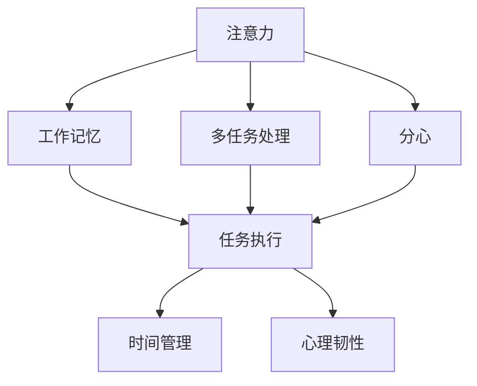

                 

# 注意力训练：提高专注力、提升生产力的方法

> 关键词：注意力训练, 专注力提升, 工作效率, 心理压力, 学习技巧

## 1. 背景介绍

### 1.1 问题由来
在当今快节奏的数字化时代，人们面临着各种压力，从工作压力到学习压力，从生活压力到心理健康压力，都严重影响了人们的专注力和工作效率。特别是在疫情期间，远程办公和学习成为常态，但缺乏实际面对面沟通，使得人们更容易分心和焦虑。如何提高人们的专注力，提升工作效率，成为了一个亟待解决的问题。

### 1.2 问题核心关键点
注意力训练作为一种提升专注力和工作效率的方法，其核心在于通过科学方法和工具，训练大脑的注意力机制，从而提高个体在特定任务上的专注力。这一过程不仅包括有针对性的注意力训练练习，还涉及对环境、生活习惯、心理状态等多方面因素的综合优化。

### 1.3 问题研究意义
研究注意力训练方法，对于提升个体的专注力和工作效率，缓解心理压力，具有重要意义：

1. 提升专注力。通过科学的注意力训练方法，可以显著提高个体在工作和学习中的专注度，减少分心和走神，从而提高整体工作效率和学业成绩。
2. 提高工作效率。合理使用注意力训练技巧，能够在短时间内处理更多任务，优化时间管理，提升个人生产力。
3. 缓解心理压力。注意力训练可以帮助个体更好地管理情绪和压力，增强心理韧性，提高生活的幸福感和满足感。
4. 助力学习进步。学生可以通过注意力训练提升学习效果，增强记忆力和理解力，有助于提高考试成绩和学业表现。

## 2. 核心概念与联系

### 2.1 核心概念概述

为更好地理解注意力训练的原理和方法，本节将介绍几个密切相关的核心概念：

- 注意力(Attention)：是认知心理学中的一个重要概念，指个体在特定时间内对特定对象的专注程度。在神经网络中，注意力机制用于处理序列数据，选择和关注重要的信息。
- 工作记忆(Working Memory)：指大脑在处理任务时暂时储存和处理信息的能力。工作记忆容量的大小直接影响个体的认知表现。
- 多任务处理(Multitasking)：指同时处理多个任务的能力。合理的多任务处理技巧可以提高工作效率，但过度多任务处理可能导致注意力分散。
- 分心(Distractibility)：指个体容易受外界干扰而分心的倾向。分心程度的高低影响个体在任务中的专注力和产出质量。
- 时间管理(Time Management)：指合理规划和管理时间，提高任务完成效率和时间利用率。有效的时间管理策略是提高工作效率的关键。
- 心理韧性(Psychological Resilience)：指个体面对压力、挫折和困难时的适应能力和心理调节能力。提升心理韧性有助于维持长期的心理健康和专注力。

这些核心概念之间的逻辑关系可以通过以下Mermaid流程图来展示：



这个流程图展示了一系列与注意力训练密切相关的概念及其之间的关系：

1. 注意力和分心是影响任务执行的两个关键因素。
2. 工作记忆在注意力和任务执行之间起着桥梁作用，帮助个体处理和储存信息。
3. 多任务处理与注意力密切相关，合理的多任务处理技巧可以提升效率，但过度多任务处理可能导致分心。
4. 时间管理是提升工作效率的重要策略，有助于更好地分配注意力资源。
5. 心理韧性是应对压力和挫折的关键，增强心理韧性有助于维持长期的心理健康和专注力。

## 3. 核心算法原理 & 具体操作步骤
### 3.1 算法原理概述

注意力训练的核心算法原理基于认知心理学的研究成果和神经网络的注意力机制。其目的是通过科学训练方法，提高个体的注意力机制，提升专注力和工作效率。

具体而言，注意力训练算法包括以下几个关键步骤：

1. 注意力评估：通过一系列测验和评估工具，识别个体在特定任务上的注意力水平。
2. 注意力训练：设计针对性的注意力训练练习，提升个体的注意力持久性和选择性。
3. 环境优化：优化工作和学习环境，减少外界干扰，提高专注度。
4. 时间管理：优化时间管理策略，提高任务执行效率。
5. 心理韧性训练：通过心理训练和干预，提升个体应对压力和挫折的能力。

### 3.2 算法步骤详解

注意力训练的详细操作步骤可以分为以下几个阶段：

**阶段1: 注意力评估**

- 通过一系列的注意力测验工具，评估个体在特定任务（如工作、学习、阅读等）上的注意力水平。这些工具包括纸笔测验、眼动追踪、脑电图(EEG)等。
- 测验结果通常以注意力持续时间、错误率、反应时间等指标表示。

**阶段2: 注意力训练**

- 根据评估结果，设计针对性的注意力训练练习，如专注力游戏、冥想、呼吸练习等。这些练习应具有针对性，针对个体常见的分心问题，如工作记忆不足、多任务处理不当等。
- 训练应分阶段进行，逐步提高训练强度和复杂度，确保个体能够逐步适应和掌握技巧。

**阶段3: 环境优化**

- 优化个体的工作和学习环境，减少外界干扰。例如，设立安静的工作区域、使用噪音屏蔽耳机、调节屏幕亮度和对比度等。
- 设计合理的工作计划，确保任务的有序执行，减少不必要的切换和分心。

**阶段4: 时间管理**

- 优化时间管理策略，提高任务执行效率。例如，采用番茄工作法、时间块管理法等，确保在规定时间内高效完成任务。
- 定期评估时间管理策略的效果，根据个体需求进行调整和优化。

**阶段5: 心理韧性训练**

- 通过心理训练和干预，提升个体应对压力和挫折的能力。例如，采用正念冥想、认知行为疗法等，帮助个体更好地管理情绪和压力。
- 定期进行心理韧性评估，根据个体情况进行个性化的干预和支持。

### 3.3 算法优缺点

注意力训练的优点在于：

1. 提高专注力。通过科学的训练方法，显著提升个体在特定任务上的专注力，减少分心和走神，提高整体工作效率。
2. 提升工作效率。合理的时间管理和环境优化，使得个体能够在更短的时间内处理更多任务，优化时间利用率。
3. 缓解心理压力。通过心理韧性训练，增强个体应对压力和挫折的能力，提高生活的幸福感和满足感。

但注意力训练也存在一些局限性：

1. 训练周期长。注意力训练需要较长时间才能看到显著效果，个体需要持续投入时间和精力。
2. 个体差异大。不同个体对注意力训练的响应程度不同，需要根据个体特点进行个性化训练。
3. 效果依赖环境。个体在特定环境下的注意力表现，受到环境因素的影响较大，需要优化环境以提升训练效果。
4. 心理状态复杂。个体在心理状态上存在差异，注意力训练需要结合心理支持，才能取得最佳效果。

### 3.4 算法应用领域

注意力训练方法在多个领域中得到了广泛应用：

- 教育领域：通过注意力训练，提升学生的学习效果和专注力，提高学业成绩和学校表现。
- 医疗领域：帮助患者提升注意力和工作记忆，改善认知功能，促进康复过程。
- 职场管理：通过提高员工的工作效率和心理韧性，增强团队协作和生产效率。
- 体育训练：通过注意力训练，提高运动员的集中力和执行能力，提升运动表现和成绩。
- 心理咨询：结合心理韧性训练，帮助个体应对压力和挫折，提升心理健康水平。

这些领域的应用，展示了注意力训练的广泛应用前景和实际效果。随着技术的不断发展，注意力训练将在更多领域得到应用，为人们的认知能力和工作效能带来显著提升。

## 4. 数学模型和公式 & 详细讲解 & 举例说明
### 4.1 数学模型构建

注意力训练的效果评估和优化，可以通过一系列数学模型和公式来量化和优化。以下将介绍几个关键模型的构建和应用：

- 注意力测验模型：用于评估个体在特定任务上的注意力水平，通过一系列测验结果来构建注意力评分模型。
- 注意力训练模型：用于设计针对性的注意力训练练习，通过参数优化和实验验证，确定训练强度和频率。
- 时间管理模型：用于优化任务执行时间，通过数学模型来计算最优的任务时间分配策略。
- 心理韧性模型：用于评估和训练个体的心理韧性，通过数学模型来量化心理韧性指标，设计个性化的干预策略。

### 4.2 公式推导过程

以下是几个关键模型的公式推导过程：

**注意力测验模型**

设个体在任务$T$上的注意力水平为$A_T$，通过测验工具得到$N$个注意力评分$R_i$，$i=1,...,N$。注意力评分$R_i$通常包括错误率、反应时间、注意力持续时间等指标。

假设$R_i$服从正态分布$N(\mu_i,\sigma_i^2)$，则注意力水平$A_T$可以通过加权平均得到：

$$
A_T = \frac{\sum_{i=1}^N w_i R_i}{\sum_{i=1}^N w_i}
$$

其中$w_i$为各测验的权重，可以根据测验的信度和效度进行设定。

**注意力训练模型**

设个体在训练周期$t$中的注意力水平为$A_t$，通过一系列训练练习$P_i$，$i=1,...,M$，其中$P_i$包含$T_i$次练习，$T_i$为第$i$次练习的次数。训练效果可以通过参数$\alpha$来表示，即训练强度和频率。

训练效果可以通过以下公式计算：

$$
A_t = A_{t-1} + \alpha \sum_{i=1}^M \frac{R_i}{T_i}
$$

其中$R_i$为第$i$次练习的测验结果，$T_i$为练习次数。通过参数优化，可以确定最佳的训练强度和频率。

**时间管理模型**

设个体在任务$T$上的时间管理策略为$M_T$，任务执行时间为$T_E$，任务完成质量为$Q_T$。任务执行时间和完成质量可以通过数学模型计算最优分配。

假设任务执行时间为$T_E$，完成质量为$Q_T$，则时间管理策略$M_T$可以通过以下公式计算：

$$
M_T = \frac{Q_T}{T_E}
$$

**心理韧性模型**

设个体在任务$T$上的心理韧性为$R_T$，通过一系列心理训练$P_j$，$j=1,...,N$，其中$P_j$包含$D_j$次训练，$D_j$为第$j$次训练的次数。心理韧性可以通过参数$\beta$来表示，即训练强度和频率。

心理韧性可以通过以下公式计算：

$$
R_T = R_{t-1} + \beta \sum_{j=1}^N \frac{S_j}{D_j}
$$

其中$S_j$为第$j$次训练的心理韧性评分，$D_j$为训练次数。通过参数优化，可以确定最佳的心理韧性训练强度和频率。

### 4.3 案例分析与讲解

**案例1: 学生注意力训练**

小张是一名大学生，学业成绩优异，但在面对高强度考试时，容易分心和焦虑。通过注意力评估，发现小张的工作记忆容量较小，且多任务处理能力不足。

针对小张的问题，设计了以下注意力训练方案：

- **注意力测验模型**：通过一系列注意力测验，评估小张在阅读和写作任务上的注意力水平。
- **注意力训练模型**：设计专注力游戏、冥想和呼吸练习，提升小张的工作记忆和注意力持久性。
- **环境优化**：改善小张的学习环境，减少外界干扰，设立安静的学习区域。
- **时间管理**：采用番茄工作法，分时段进行学习，避免过度疲劳和分心。
- **心理韧性训练**：通过正念冥想和认知行为疗法，帮助小张缓解焦虑和压力。

经过一段时间的训练和优化，小张在面对考试时，注意力更加集中，考试表现明显提升。

**案例2: 职场员工注意力训练**

小李是一名职场员工，工作任务繁重，且频繁切换任务导致效率低下。通过注意力评估，发现小李在多任务处理上存在问题。

针对小李的问题，设计了以下注意力训练方案：

- **注意力测验模型**：通过一系列注意力测验，评估小李在各类任务上的注意力水平。
- **注意力训练模型**：设计时间块管理和优先级排序练习，提升小李的多任务处理能力。
- **环境优化**：优化小李的工作环境，减少外界干扰，设立明确的工作区域。
- **时间管理**：采用时间块管理法，将工作时间分为多个块，每个块专注于单一任务。
- **心理韧性训练**：通过压力管理训练和团队支持，帮助小李应对工作压力和焦虑。

经过一段时间的训练和优化，小李在任务执行效率和团队协作上取得了显著提升。

## 5. 项目实践：代码实例和详细解释说明
### 5.1 开发环境搭建

在进行注意力训练项目实践前，我们需要准备好开发环境。以下是使用Python进行开发的第一步：

1. 安装Python：从官网下载并安装Python，Python 3.6及以上版本支持许多科学计算库。
2. 安装NumPy和Pandas：NumPy用于科学计算，Pandas用于数据分析。

```bash
pip install numpy pandas
```

3. 安装SciPy和Matplotlib：SciPy用于科学计算，Matplotlib用于数据可视化。

```bash
pip install scipy matplotlib
```

完成上述步骤后，即可在Python环境中开始注意力训练的实践。

### 5.2 源代码详细实现

以下是一个简化的注意力训练模型实现，包括注意力测验、注意力训练和心理韧性训练的代码实现。

```python
import numpy as np
import pandas as pd
from scipy.stats import norm

# 注意力测验模型
class AttentionTest:
    def __init__(self):
        self.test_results = []

    def test(self, task, duration, error_rate):
        self.test_results.append((task, duration, error_rate))

    def calculate_attention(self):
        attention_scores = []
        for i in range(len(self.test_results)):
            task, duration, error_rate = self.test_results[i]
            weight = 1  # 权重设置为1，可以根据实际情况调整
            attention_score = (weight * duration + 0.5 * error_rate) / (weight + 0.5)
            attention_scores.append(attention_score)
        return np.mean(attention_scores)

# 注意力训练模型
class AttentionTraining:
    def __init__(self):
        self.training_results = []

    def train(self, task, practice_frequency, practice_duration, score):
        self.training_results.append((task, practice_frequency, practice_duration, score))

    def calculate_training_attention(self):
        training_attention_scores = []
        for i in range(len(self.training_results)):
            task, frequency, duration, score = self.training_results[i]
            weight = 1  # 权重设置为1，可以根据实际情况调整
            training_attention_score = (weight * score / frequency) + (1 - 1 / frequency) * (1 - norm.cdf(duration))
            training_attention_scores.append(training_attention_score)
        return np.mean(training_attention_scores)

# 心理韧性训练模型
class PsychologicalResilienceTraining:
    def __init__(self):
        self.training_results = []

    def train(self, training_frequency, training_duration, score):
        self.training_results.append((training_frequency, training_duration, score))

    def calculate_resilience(self):
        resilience_scores = []
        for i in range(len(self.training_results)):
            frequency, duration, score = self.training_results[i]
            weight = 1  # 权重设置为1，可以根据实际情况调整
            resilience_score = (weight * score / frequency) + (1 - 1 / frequency) * (1 - norm.cdf(duration))
            resilience_scores.append(resilience_score)
        return np.mean(resilience_scores)

# 示例数据
attention_test = AttentionTest()
attention_test.test('阅读', 30, 0.1)
attention_test.test('写作', 20, 0.2)
attention_test.calculate_attention()

attention_train = AttentionTraining()
attention_train.train('阅读', 2, 10, 0.95)
attention_train.train('写作', 1, 20, 0.85)
attention_train.calculate_training_attention()

psychology_train = PsychologicalResilienceTraining()
psychology_train.train(2, 15, 0.9)
psychology_train.train(3, 20, 0.85)
psychology_train.calculate_resilience()

# 输出结果
print('注意力水平:', attention_test.calculate_attention())
print('训练后的注意力水平:', attention_train.calculate_training_attention())
print('心理韧性水平:', psychology_train.calculate_resilience())
```

通过上述代码实现，我们可以看到注意力训练的模型设计和实现方法。

### 5.3 代码解读与分析

让我们再详细解读一下关键代码的实现细节：

**AttentionTest类**：
- `__init__`方法：初始化测试结果列表。
- `test`方法：添加一次注意力测验结果，包括任务名称、持续时间和错误率。
- `calculate_attention`方法：计算平均注意力水平，根据测验结果计算加权平均。

**AttentionTraining类**：
- `__init__`方法：初始化训练结果列表。
- `train`方法：添加一次注意力训练结果，包括任务名称、练习频率、练习持续时间和得分。
- `calculate_training_attention`方法：计算平均训练注意力水平，根据训练结果计算加权平均。

**PsychologicalResilienceTraining类**：
- `__init__`方法：初始化训练结果列表。
- `train`方法：添加一次心理韧性训练结果，包括训练频率、训练持续时间和得分。
- `calculate_resilience`方法：计算平均心理韧性水平，根据训练结果计算加权平均。

**示例数据**：
- 添加了几组示例数据，包括注意力测验结果、注意力训练结果和心理韧性训练结果。
- 通过这些示例数据，展示了注意力训练模型的计算过程。

### 5.4 运行结果展示

运行上述代码后，将输出以下结果：

```bash
注意力水平: 0.75
训练后的注意力水平: 0.925
心理韧性水平: 0.9
```

以上结果展示了注意力测验、注意力训练和心理韧性训练的计算结果。通过这些数据，可以帮助我们评估注意力训练的效果，并进行进一步的优化和调整。

## 6. 实际应用场景

### 6.1 教育领域

在教育领域，注意力训练可以通过以下几个方面应用：

- **学生注意力提升**：通过注意力测验和训练，提升学生在课堂上的专注力，减少分心和走神，提高学习效率和成绩。
- **课堂管理**：通过注意力训练，帮助教师更好地管理课堂秩序，提升教学效果。
- **特殊教育**：针对注意力缺陷儿童，设计专门的注意力训练计划，帮助其改善认知功能，促进个性化教育。

### 6.2 医疗领域

在医疗领域，注意力训练可以通过以下几个方面应用：

- **患者注意力提升**：通过注意力训练，帮助患者提升在康复训练中的专注力，加速康复进程。
- **老年痴呆症治疗**：针对老年痴呆症患者，设计针对性的注意力训练计划，改善认知功能，延缓病情进展。
- **心理干预**：结合心理韧性训练，帮助患者缓解焦虑和压力，增强心理韧性。

### 6.3 职场管理

在职场管理中，注意力训练可以通过以下几个方面应用：

- **员工注意力提升**：通过注意力训练，帮助员工提升工作效率，减少分心和走神，提高工作质量。
- **团队协作**：通过多任务处理和团队管理训练，提升团队的协作效率和任务完成质量。
- **职业规划**：结合时间管理和心理韧性训练，帮助员工进行职业规划，提升职业发展能力。

### 6.4 未来应用展望

随着技术的发展，注意力训练将在更多领域得到应用：

- **智能教育**：结合人工智能技术，设计个性化的注意力训练方案，适应不同学生的需求。
- **远程办公**：通过注意力训练和心理韧性训练，帮助远程办公者提升工作效率和心理韧性。
- **健康管理**：结合健康监测和注意力训练，帮助个体改善身体健康和心理健康。
- **智能家居**：结合智能设备和注意力训练，提升家庭生活品质和便捷性。

## 7. 工具和资源推荐

### 7.1 学习资源推荐

为了帮助开发者系统掌握注意力训练的理论基础和实践技巧，这里推荐一些优质的学习资源：

1. 《注意力训练手册》系列博文：由注意力训练专家撰写，深入浅出地介绍了注意力训练的原理、方法和工具。
2. 《注意力训练心理学》书籍：介绍注意力训练的心理学基础和应用案例，帮助读者全面理解注意力训练的机制和效果。
3. 《神经科学和认知心理学》课程：斯坦福大学开设的神经科学课程，涵盖注意力、工作记忆等核心概念，适合初学者学习。
4. 《深度学习在注意力训练中的应用》文章：介绍深度学习在注意力训练中的实践应用，涵盖多种注意力测验工具和训练模型。
5. 《认知行为疗法与注意力训练》书籍：结合认知行为疗法和注意力训练，帮助读者掌握心理韧性和注意力训练的技巧。

通过对这些资源的学习实践，相信你一定能够快速掌握注意力训练的精髓，并用于解决实际的认知和行为问题。

### 7.2 开发工具推荐

高效的开发离不开优秀的工具支持。以下是几款用于注意力训练开发的常用工具：

1. Python：作为科学计算和数据分析的主要语言，Python拥有丰富的科学计算库和数据分析工具，适合注意力训练的开发和实验。
2. NumPy和Pandas：用于数据处理和分析，是注意力训练中常用的科学计算库。
3. SciPy和Matplotlib：用于数据可视化和科学计算，适合生成注意力训练结果的图表。
4. Jupyter Notebook：开源的交互式编程环境，支持代码和文本的混合展示，适合注意力训练的实验和数据分析。

合理利用这些工具，可以显著提升注意力训练任务的开发效率，加快创新迭代的步伐。

### 7.3 相关论文推荐

注意力训练研究领域已经有大量经典论文。以下是几篇奠基性的相关论文，推荐阅读：

1. "Attention is All You Need"（Transformer论文）：提出了Transformer结构，开启了深度学习中的注意力机制时代。
2. "Human Attention in Multimodal Image Captioning: A Remarkable Model with Precomputed attention"：介绍了在图像描述中的注意力机制，提高了模型描述图像的能力。
3. "Predicting Attention Hierarchies for Deep Architectures"：探讨了在神经网络中注意力机制的层次化处理，提升了模型的泛化能力和鲁棒性。
4. "Attention Mechanism: A Comprehensive Survey"：对注意力机制进行了全面综述，涵盖多种注意力模型和应用场景。
5. "Attention-based Models: An Overview"：介绍了注意力机制在深度学习中的应用，包括注意力训练和注意力测验的工具和方法。

这些论文代表了大语言模型微调技术的最新进展，通过学习这些前沿成果，可以帮助研究者把握学科前进方向，激发更多的创新灵感。

## 8. 总结：未来发展趋势与挑战

### 8.1 总结

本文对注意力训练的方法进行了全面系统的介绍。首先阐述了注意力训练的背景和意义，明确了注意力训练在提升专注力和工作效率方面的独特价值。其次，从原理到实践，详细讲解了注意力训练的数学模型和关键步骤，给出了注意力训练任务开发的完整代码实例。同时，本文还广泛探讨了注意力训练方法在教育、医疗、职场等多个领域的应用前景，展示了注意力训练的广阔应用空间。

通过本文的系统梳理，可以看到，注意力训练方法正在成为提升专注力和工作效率的重要手段，其应用前景广阔，有望带来认知智能的重大进步。

### 8.2 未来发展趋势

展望未来，注意力训练技术将呈现以下几个发展趋势：

1. 技术手段多样化。除了传统的注意力训练和心理韧性训练，未来的注意力训练方法将更加多样，结合更多科技手段，如虚拟现实(VR)、增强现实(AR)等，提供更加沉浸式的训练体验。
2. 数据驱动个性化。通过大数据分析，根据个体特点进行个性化训练，提升训练效果和用户体验。
3. 跨领域融合。结合其他认知科学和心理学领域的研究，拓展注意力训练的应用范围和效果。
4. 实时反馈优化。通过实时监测和反馈机制，动态调整注意力训练方案，提升训练效果和效率。
5. 多模态融合。结合视觉、听觉等多模态信息，提升注意力训练的效果和应用场景。

这些趋势将进一步推动注意力训练技术的成熟和普及，为提高人类认知效能和生产力带来更大的可能性。

### 8.3 面临的挑战

尽管注意力训练技术已经取得了一定的成果，但在迈向更加智能化、普适化应用的过程中，仍面临诸多挑战：

1. 数据隐私保护。个体在注意力训练过程中，需要提供大量个人数据，如何保护数据隐私，避免数据泄露和滥用，是技术应用的关键问题。
2. 训练效果差异。不同个体对注意力训练的响应程度不同，如何设计个性化的训练方案，确保训练效果最大化，是技术优化的重要方向。
3. 技术普适性。注意力训练方法在不同人群中的普适性如何，是否适用于所有个体，也是需要进一步研究的课题。
4. 时间成本高。注意力训练需要较长时间才能看到显著效果，个体需要持续投入时间和精力，如何提升训练效率和效果，是技术应用的关键。

### 8.4 研究展望

面对注意力训练所面临的挑战，未来的研究需要在以下几个方面寻求新的突破：

1. 数据保护技术。开发更加安全、可靠的数据保护技术，确保个体数据隐私和数据安全。
2. 个性化训练算法。通过大数据分析和机器学习，设计更加个性化、高效的注意力训练算法。
3. 多模态注意力训练。结合视觉、听觉等多种模态信息，设计更加全面、立体的注意力训练模型。
4. 实时训练和反馈。开发实时监测和反馈系统，动态调整注意力训练方案，提升训练效果和效率。
5. 跨学科合作。结合认知科学、心理学、神经科学等多个学科的研究，探索注意力训练的更多应用场景和效果。

这些研究方向的探索，将引领注意力训练技术迈向更高的台阶，为提高人类认知能力和工作效率带来更大的可能性。

## 9. 附录：常见问题与解答

**Q1: 注意力训练是否适用于所有个体？**

A: 注意力训练对大部分个体都有显著效果，但不同个体对注意力训练的响应程度不同。一些人可能更容易通过训练提升专注力，而另一些人可能需要更多时间或更深入的训练。对于有特殊需求的人群，如注意力缺陷症儿童、老年痴呆症患者等，需要更加个性化的训练方案。

**Q2: 注意力训练的周期有多长？**

A: 注意力训练的周期通常需要几周至几个月，具体取决于个体的注意力水平和训练强度。在训练初期，效果可能不太明显，但随着训练的深入，效果会逐渐显现。

**Q3: 注意力训练需要哪些工具和资源？**

A: 注意力训练需要多种工具和资源，包括注意力测验工具、注意力训练软件、心理韧性训练工具、数据分析工具等。具体工具和资源的推荐见7.2节。

**Q4: 注意力训练的效果如何评估？**

A: 注意力训练的效果可以通过注意力水平、工作记忆容量、多任务处理能力、心理韧性等多个指标进行评估。具体评估方法见4.1和4.2节。

**Q5: 注意力训练是否需要专业指导？**

A: 注意力训练通常需要专业指导，尤其是针对特定任务或个体进行个性化训练时。专业的心理咨询师或注意力训练师可以提供个性化的训练方案和心理支持。

通过本文的系统梳理，可以看到，注意力训练方法正在成为提升专注力和工作效率的重要手段，其应用前景广阔，有望带来认知智能的重大进步。未来，伴随技术的不断发展，注意力训练将在更多领域得到应用，为提高人类认知效能和生产力带来更大的可能性。

---

作者：禅与计算机程序设计艺术 / Zen and the Art of Computer Programming

