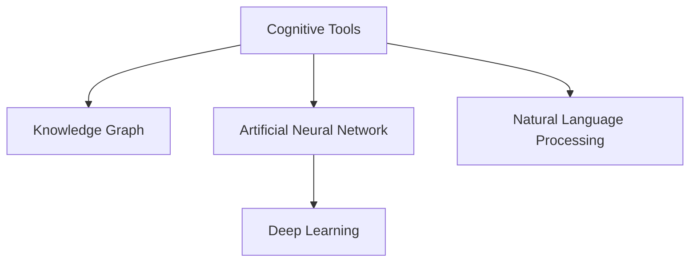

                 

# 洞察与类比：突破知识限制的工具

> 关键词：洞察,类比,知识突破,工具,思维模型,认知拓展

## 1. 背景介绍

### 1.1 问题由来
在现代社会，信息爆炸与知识碎片化已成常态，人类个体在有限的生命周期内，难以充分吸收和掌握所有相关知识。这种知识的局限性，极大地制约了人类的创新能力和解决问题的能力。

为突破这一限制，许多领域开始探索利用新技术手段，提升人类学习和认知能力。计算机科学通过算法和工具，逐步揭示了人类思维的潜在模式，并试图通过这些模式，扩大知识边界，提升认知效率。

### 1.2 问题核心关键点
要突破知识限制，核心在于构建有效的认知工具，使个体能够在有限的认知资源下，尽可能地拓展知识范围和提升认知深度。这些工具应具备以下特点：
- **可扩展性**：能不断学习新知识，适应知识动态更新。
- **灵活性**：适用于各种认知任务，灵活处理复杂问题。
- **可靠性**：能保证输出的正确性和一致性。
- **可解释性**：能清晰解释其决策过程，便于理解和调试。
- **普适性**：在各种应用场景中都有效，能被广泛使用。

## 2. 核心概念与联系

### 2.1 核心概念概述

为更好地理解突破知识限制的工具，本节将介绍几个密切相关的核心概念：

- **认知工具(Cognitive Tools)**：通过算法和模型构建的辅助个体认知的软硬件系统。例如，搜索引擎、文本编辑器、数据分析工具等。
- **知识图谱(Knowledge Graph)**：以图结构组织知识，展示知识实体、属性和关系，用于知识查询、推理和整合。
- **人工神经网络(ANN)**：受生物神经网络启发，由大量神经元组成的网络结构，用于模拟复杂系统的学习和决策。
- **深度学习(Deep Learning)**：一种基于神经网络的机器学习方法，能够自动从大量数据中学习特征，并应用于复杂模式的识别与预测。
- **自然语言处理(NLP)**：使计算机能够理解、处理和生成人类语言的技术。NLP结合了语言学和计算机科学，推动了人工智能在自然交互领域的发展。

这些核心概念之间的逻辑关系可以通过以下Mermaid流程图来展示：



这个流程图展示了几大核心概念之间的关系：

1. 认知工具是实现知识突破的工具集，包含多种技术如知识图谱、神经网络、深度学习、NLP等。
2. 知识图谱和人工神经网络是认知工具中的关键组件，用于知识的表示与推理。
3. 深度学习在认知工具中起到核心作用，提供了强大的特征提取和模式识别能力。
4. NLP是认知工具在自然语言理解与生成方面的具体应用，推动了认知工具与人类语言的深度融合。

## 3. 核心算法原理 & 具体操作步骤

### 3.1 算法原理概述

突破知识限制的工具，本质上是基于认知科学的算法和模型，通过数据驱动的方式，构建知识的表示、推理、整合和应用系统。其核心思想是：利用数学和计算机科学的方法，模拟和拓展人类认知能力，构建可扩展、灵活、可靠的知识系统。

以深度学习算法为例，其核心原理是通过多层神经元构建复杂的特征提取与映射过程，自动从数据中学习到特征表示，并应用于各种认知任务。其典型流程包括：
- **数据准备**：收集、标注和预处理任务相关的数据集。
- **模型构建**：选择合适的神经网络架构和损失函数，构建深度学习模型。
- **训练优化**：通过反向传播算法，最小化损失函数，优化模型参数。
- **推理应用**：将训练好的模型应用于新的数据集，进行特征提取和模式识别。

### 3.2 算法步骤详解

以下我们以深度学习为例，详细讲解其核心步骤：

**Step 1: 数据准备**
- 收集与任务相关的数据集，确保数据多样性和代表性。
- 对数据进行清洗、标注和标准化处理，包括去除噪声、填充缺失值、归一化等。

**Step 2: 模型构建**
- 选择合适的神经网络架构，如卷积神经网络(CNN)、循环神经网络(RNN)、Transformer等。
- 设计合适的损失函数，如交叉熵损失、均方误差损失等，用于衡量模型预测与真实标签之间的差异。
- 设置网络超参数，如学习率、批大小、迭代轮数等，确定训练策略。

**Step 3: 训练优化**
- 将数据集分为训练集、验证集和测试集，以避免过拟合。
- 使用反向传播算法计算梯度，更新模型参数。
- 定期在验证集上评估模型性能，根据性能指标决定是否触发Early Stopping。
- 重复上述步骤直至满足预设的迭代轮数或Early Stopping条件。

**Step 4: 推理应用**
- 将训练好的模型应用于新的数据集，进行特征提取和模式识别。
- 根据任务需求，选择合适的输出方式，如分类、回归、生成等。
- 对输出结果进行后处理和解释，提高模型的实用性和可解释性。

### 3.3 算法优缺点

深度学习作为突破知识限制的工具，具有以下优点：
1. 强大的特征提取能力。自动从数据中学习到丰富的特征表示，适用于各种复杂的认知任务。
2. 广泛的适用性。可以应用于图像、语音、文本等多种类型的数据。
3. 高度的灵活性。通过不同的神经网络结构和损失函数，适应不同的任务需求。
4. 持续的改进能力。在新的数据集上不断迭代训练，逐步提升模型性能。

同时，该方法也存在一些局限性：
1. 对标注数据依赖性强。深度学习的性能很大程度上取决于标注数据的质量和数量。
2. 计算资源消耗大。深度学习模型往往具有大量的参数，需要高性能的计算设备支持。
3. 可解释性不足。深度学习模型的决策过程难以解释，不利于理解和调试。
4. 容易过拟合。特别是在标注数据不足的情况下，容易过拟合训练数据。
5. 迁移能力有限。在不同任务之间迁移深度学习模型时，往往需要重新训练。

尽管存在这些局限性，但深度学习作为一种突破知识限制的工具，已经广泛应用于图像识别、语音识别、自然语言处理等多个领域，为知识的突破与认知的拓展提供了强大助力。

### 3.4 算法应用领域

深度学习作为突破知识限制的工具，已经在诸多领域得到了广泛应用，包括但不限于：

- **计算机视觉**：如图像分类、目标检测、图像生成等。通过深度学习模型，计算机可以自动理解图像内容，并作出相应的判断和生成。
- **自然语言处理**：如文本分类、命名实体识别、机器翻译等。深度学习模型通过学习语言规律，自动实现复杂的自然语言处理任务。
- **语音识别**：如自动语音识别、语音合成等。深度学习模型能够自动分析语音信号，实现语音与文本之间的转换。
- **推荐系统**：如商品推荐、音乐推荐等。深度学习模型通过学习用户行为和物品特征，实现个性化推荐。
- **医疗影像分析**：如医学影像分类、病灶检测等。深度学习模型通过学习大量医疗影像数据，实现对疾病的诊断和预测。
- **金融分析**：如股票预测、信用评估等。深度学习模型通过学习市场数据，实现对金融市场的分析和预测。

除了这些传统应用外，深度学习还在无人驾驶、智能制造、智慧城市等多个新兴领域中发挥了重要作用，为人类社会的发展带来了深刻变革。

## 4. 数学模型和公式 & 详细讲解 & 举例说明

### 4.1 数学模型构建

本节将使用数学语言对深度学习模型的构建过程进行更加严格的刻画。

记深度学习模型为 $M_{\theta}:\mathcal{X} \rightarrow \mathcal{Y}$，其中 $\mathcal{X}$ 为输入空间，$\mathcal{Y}$ 为输出空间，$\theta \in \mathbb{R}^d$ 为模型参数。假设训练数据集为 $D=\{(x_i,y_i)\}_{i=1}^N, x_i \in \mathcal{X}, y_i \in \mathcal{Y}$。

定义模型 $M_{\theta}$ 在数据样本 $(x,y)$ 上的损失函数为 $\ell(M_{\theta}(x),y)$，则在数据集 $D$ 上的经验风险为：

$$
\mathcal{L}(\theta) = \frac{1}{N} \sum_{i=1}^N \ell(M_{\theta}(x_i),y_i)
$$

其中 $\ell$ 为适用于特定任务的损失函数，如交叉熵损失、均方误差损失等。

深度学习模型的优化目标是最小化经验风险，即找到最优参数：

$$
\theta^* = \mathop{\arg\min}_{\theta} \mathcal{L}(\theta)
$$

在实践中，我们通常使用基于梯度的优化算法（如SGD、Adam等）来近似求解上述最优化问题。设 $\eta$ 为学习率，$\lambda$ 为正则化系数，则参数的更新公式为：

$$
\theta \leftarrow \theta - \eta \nabla_{\theta}\mathcal{L}(\theta) - \eta\lambda\theta
$$

其中 $\nabla_{\theta}\mathcal{L}(\theta)$ 为损失函数对参数 $\theta$ 的梯度，可通过反向传播算法高效计算。

### 4.2 公式推导过程

以下我们以二分类任务为例，推导交叉熵损失函数及其梯度的计算公式。

假设模型 $M_{\theta}$ 在输入 $x$ 上的输出为 $\hat{y}=M_{\theta}(x) \in [0,1]$，表示样本属于正类的概率。真实标签 $y \in \{0,1\}$。则二分类交叉熵损失函数定义为：

$$
\ell(M_{\theta}(x),y) = -[y\log \hat{y} + (1-y)\log (1-\hat{y})]
$$

将其代入经验风险公式，得：

$$
\mathcal{L}(\theta) = -\frac{1}{N}\sum_{i=1}^N [y_i\log M_{\theta}(x_i)+(1-y_i)\log(1-M_{\theta}(x_i))]
$$

根据链式法则，损失函数对参数 $\theta_k$ 的梯度为：

$$
\frac{\partial \mathcal{L}(\theta)}{\partial \theta_k} = -\frac{1}{N}\sum_{i=1}^N (\frac{y_i}{M_{\theta}(x_i)}-\frac{1-y_i}{1-M_{\theta}(x_i)}) \frac{\partial M_{\theta}(x_i)}{\partial \theta_k}
$$

其中 $\frac{\partial M_{\theta}(x_i)}{\partial \theta_k}$ 可进一步递归展开，利用自动微分技术完成计算。

### 4.3 案例分析与讲解

为了更好地理解深度学习模型的构建和应用，让我们以图像分类任务为例，进行详细讲解。

**数据准备**：
- 收集一组图像数据集，如MNIST手写数字识别数据集。
- 将图像数据进行预处理，如缩放、归一化等，保证数据一致性。
- 将图像数据转换为张量形式，以便模型处理。

**模型构建**：
- 选择合适的神经网络架构，如卷积神经网络(CNN)。
- 设计合适的损失函数，如交叉熵损失。
- 设置网络超参数，如卷积核大小、步长、池化大小等，确定网络结构。

**训练优化**：
- 将数据集分为训练集、验证集和测试集，以避免过拟合。
- 使用反向传播算法计算梯度，更新模型参数。
- 定期在验证集上评估模型性能，根据性能指标决定是否触发Early Stopping。
- 重复上述步骤直至满足预设的迭代轮数或Early Stopping条件。

**推理应用**：
- 将训练好的模型应用于新的图像数据集，进行特征提取和模式识别。
- 对输出结果进行后处理和解释，提高模型的实用性和可解释性。
- 在实际应用中，将模型集成到图像识别系统中，完成图像分类任务。

通过这个案例，我们可以看到，深度学习模型通过数据驱动的方式，自动学习到图像的特征表示，并应用于分类任务，从而实现了对知识突破的追求。

## 5. 项目实践：代码实例和详细解释说明

### 5.1 开发环境搭建

在进行深度学习模型开发前，我们需要准备好开发环境。以下是使用Python进行TensorFlow开发的环境配置流程：

1. 安装Anaconda：从官网下载并安装Anaconda，用于创建独立的Python环境。

2. 创建并激活虚拟环境：
```bash
conda create -n tf-env python=3.8 
conda activate tf-env
```

3. 安装TensorFlow：根据CUDA版本，从官网获取对应的安装命令。例如：
```bash
conda install tensorflow tensorflow-gpu -c conda-forge
```

4. 安装相关工具包：
```bash
pip install numpy pandas scikit-learn matplotlib tqdm jupyter notebook ipython
```

完成上述步骤后，即可在`tf-env`环境中开始深度学习模型的开发。

### 5.2 源代码详细实现

下面我们以图像分类任务为例，给出使用TensorFlow对卷积神经网络进行训练的Python代码实现。

```python
import tensorflow as tf
from tensorflow.keras import datasets, layers, models

# 加载数据集
(train_images, train_labels), (test_images, test_labels) = datasets.cifar10.load_data()

# 预处理数据
train_images, test_images = train_images / 255.0, test_images / 255.0

# 定义模型
model = models.Sequential()
model.add(layers.Conv2D(32, (3, 3), activation='relu', input_shape=(32, 32, 3)))
model.add(layers.MaxPooling2D((2, 2)))
model.add(layers.Conv2D(64, (3, 3), activation='relu'))
model.add(layers.MaxPooling2D((2, 2)))
model.add(layers.Conv2D(64, (3, 3), activation='relu'))
model.add(layers.Flatten())
model.add(layers.Dense(64, activation='relu'))
model.add(layers.Dense(10, activation='softmax'))

# 编译模型
model.compile(optimizer='adam',
              loss=tf.keras.losses.SparseCategoricalCrossentropy(from_logits=True),
              metrics=['accuracy'])

# 训练模型
history = model.fit(train_images, train_labels, epochs=10, 
                    validation_data=(test_images, test_labels))

# 评估模型
test_loss, test_acc = model.evaluate(test_images,  test_labels, verbose=2)
print(test_acc)
```

在这个示例中，我们使用了TensorFlow的Keras API构建了一个简单的卷积神经网络模型，用于图像分类任务。通过数据准备、模型构建、训练优化和推理应用等步骤，实现了对图像分类任务的有效处理。

### 5.3 代码解读与分析

让我们再详细解读一下关键代码的实现细节：

**数据准备**：
- 使用`datasets.cifar10.load_data()`方法加载CIFAR-10数据集，并分为训练集和测试集。
- 对数据进行归一化处理，将像素值缩放到0-1之间。

**模型构建**：
- 使用`Sequential`模型构建多层神经网络。
- 添加卷积层、池化层、全连接层等，构建网络结构。

**训练优化**：
- 使用`model.compile()`方法编译模型，指定优化器、损失函数和评估指标。
- 使用`model.fit()`方法训练模型，在每个epoch结束时在验证集上评估模型性能。
- 使用`model.evaluate()`方法在测试集上评估模型性能。

**推理应用**：
- 对新的图像数据进行预测，获取分类结果。
- 根据任务需求，选择合适的输出方式，如概率分布、类别标签等。

可以看到，TensorFlow提供了简单易用的API，大大降低了深度学习模型的开发门槛。开发者可以通过组合不同的层和参数，快速构建和训练深度学习模型。

## 6. 实际应用场景

### 6.1 智能医疗影像分析

在医疗领域，深度学习模型被广泛应用于医学影像分析，辅助医生进行疾病的诊断和治疗。通过深度学习模型，可以从医学影像中自动提取特征，识别出病变区域，帮助医生快速作出诊断。

在实践中，可以收集大量的医学影像数据，并标注出病变区域的位置和类型。在此基础上对深度学习模型进行训练，使其能够自动识别出影像中的病变区域。将训练好的模型应用于新的医学影像数据，可以自动生成诊断报告，辅助医生作出诊断。

### 6.2 金融市场预测

金融市场预测是深度学习模型在金融领域的重要应用之一。深度学习模型通过学习历史金融数据，能够自动识别出市场趋势，预测未来的股票价格和市场动向。

在实践中，可以收集历史金融数据，包括股票价格、交易量、公司财报等，标注出市场走势和事件的影响。在此基础上对深度学习模型进行训练，使其能够自动预测未来的市场走势。将训练好的模型应用于实时市场数据，可以提供实时的市场预测报告，帮助投资者作出投资决策。

### 6.3 个性化推荐系统

在电商领域，深度学习模型被广泛应用于个性化推荐系统，帮助用户发现感兴趣的商品。通过深度学习模型，可以分析用户的历史行为数据，提取用户的兴趣偏好，推荐符合用户偏好的商品。

在实践中，可以收集用户的浏览、购买、评价等数据，并标注出用户的兴趣偏好。在此基础上对深度学习模型进行训练，使其能够自动推荐符合用户偏好的商品。将训练好的模型应用于新的用户数据，可以提供个性化的商品推荐，提高用户的购物体验。

### 6.4 未来应用展望

随着深度学习技术的不断发展，其在更多领域的应用前景将更加广阔。

在智慧城市治理中，深度学习模型可以应用于交通管理、环境监测、公共安全等领域，提升城市的智能化水平，构建更安全、高效的未来城市。

在自动驾驶中，深度学习模型可以应用于目标检测、路径规划、行为预测等环节，提高自动驾驶系统的可靠性和安全性。

在工业制造中，深度学习模型可以应用于质量检测、设备维护、故障诊断等领域，提高生产效率，降低生产成本。

在社交媒体分析中，深度学习模型可以应用于情感分析、舆情监测、内容生成等领域，提升社交媒体平台的互动体验，辅助平台管理。

## 7. 工具和资源推荐

### 7.1 学习资源推荐

为了帮助开发者系统掌握深度学习模型的理论和实践，这里推荐一些优质的学习资源：

1. **深度学习入门**：《深度学习》书籍，由斯坦福大学的Andrew Ng教授撰写，全面介绍了深度学习的理论和实践，适合初学者入门。

2. **Keras官方文档**：TensorFlow的Keras API官方文档，提供了丰富的API示例和教程，适合快速上手。

3. **TensorFlow官方教程**：TensorFlow官方提供的教程，包括深度学习模型构建、训练和推理等各个环节，适合实战演练。

4. **Coursera深度学习课程**：由DeepMind和斯坦福大学的专家共同开设的深度学习课程，内容全面系统，适合进阶学习。

5. **PyTorch官方文档**：PyTorch官方提供的文档和教程，介绍了PyTorch框架的使用方法和技巧，适合深度学习开发。

通过对这些资源的学习实践，相信你一定能够快速掌握深度学习模型的精髓，并用于解决实际的认知任务。

### 7.2 开发工具推荐

高效的开发离不开优秀的工具支持。以下是几款用于深度学习模型开发的工具：

1. **TensorFlow**：由Google主导开发的开源深度学习框架，生产部署方便，适合大规模工程应用。

2. **PyTorch**：由Facebook主导开发的深度学习框架，动态计算图设计，适合研究和快速迭代。

3. **Keras**：高层次的深度学习API，易于上手，适合快速原型设计和实验。

4. **MXNet**：多语言深度学习框架，支持多种编程语言，适合跨平台开发。

5. **Caffe**：由加州大学伯克利分校开发的深度学习框架，适用于图像处理任务。

6. **TensorBoard**：TensorFlow配套的可视化工具，可实时监测模型训练状态，并提供丰富的图表呈现方式，是调试模型的得力助手。

合理利用这些工具，可以显著提升深度学习模型的开发效率，加快创新迭代的步伐。

### 7.3 相关论文推荐

深度学习技术的发展源于学界的持续研究。以下是几篇奠基性的相关论文，推荐阅读：

1. **ImageNet Classification with Deep Convolutional Neural Networks**：AlexNet论文，提出了卷积神经网络，并应用于图像分类任务，取得了当时最先进的性能。

2. **LeNet-5: A Convolutional Neural Network for Handwritten Digit Recognition**：LeNet-5论文，提出了最早的卷积神经网络，用于手写数字识别任务。

3. **ResNet: Deep Residual Learning for Image Recognition**：ResNet论文，提出了残差网络，解决了深层神经网络的退化问题，大幅提升了网络深度。

4. **Inception-Net: Go Deeper with Convolutions**：Inception-Net论文，提出了多尺度卷积结构，显著提升了图像分类的精度。

5. **GoogleNet: All Local Connectivity for Vision Recognition**：GoogleNet论文，提出了GoogLeNet模型，在图像分类任务上取得了SOTA性能。

6. **BERT: Pre-training of Deep Bidirectional Transformers for Language Understanding**：BERT论文，提出了BERT模型，引入了掩码语言模型和下一句预测等自监督任务，显著提升了自然语言理解的效果。

这些论文代表了大深度学习模型的发展脉络。通过学习这些前沿成果，可以帮助研究者把握学科前进方向，激发更多的创新灵感。

## 8. 总结：未来发展趋势与挑战

### 8.1 总结

本文对深度学习模型作为突破知识限制的工具进行了全面系统的介绍。首先阐述了深度学习模型在认知任务中的应用背景和重要性，明确了深度学习在拓展知识边界、提升认知效率方面的独特价值。其次，从原理到实践，详细讲解了深度学习模型的构建过程，给出了代码实现示例。同时，本文还广泛探讨了深度学习模型在智能医疗、金融预测、个性化推荐等多个领域的应用前景，展示了深度学习模型的巨大潜力。此外，本文精选了深度学习模型的各类学习资源，力求为读者提供全方位的技术指引。

通过本文的系统梳理，可以看到，深度学习模型作为突破知识限制的工具，已经广泛应用于各种认知任务，为知识的拓展和认知的提升提供了强大助力。未来，伴随深度学习技术的不断发展，其在更多领域的应用前景将更加广阔。

### 8.2 未来发展趋势

展望未来，深度学习模型将呈现以下几个发展趋势：

1. **模型规模持续增大**：随着算力成本的下降和数据规模的扩张，深度学习模型的参数量还将持续增长。超大规模模型蕴含的丰富特征表示，有望支撑更加复杂多变的认知任务。

2. **模型架构不断优化**：新的网络架构不断涌现，如Transformer、ResNeXt、SqueezeNet等，进一步提升了深度学习模型的表达能力和计算效率。

3. **模型训练效率提升**：通过模型剪枝、量化加速、分布式训练等技术，提升深度学习模型的训练效率，实现更加轻量级、实时性的部署。

4. **知识增强与迁移学习**：通过引入外部知识库、规则库等专家知识，增强深度学习模型的知识表示能力，实现更全面、准确的认知任务。

5. **多模态融合与协同建模**：将视觉、语音、文本等多模态数据融合，实现更全面、精准的认知任务。

6. **联邦学习与分布式协作**：通过联邦学习、分布式训练等技术，实现模型参数的协同优化，提升深度学习模型的泛化能力和性能。

以上趋势凸显了深度学习模型的广阔前景。这些方向的探索发展，必将进一步提升深度学习模型的性能和应用范围，为认知任务的解决提供更加有效的工具。

### 8.3 面临的挑战

尽管深度学习模型在许多领域已取得显著成果，但在迈向更加智能化、普适化应用的过程中，仍面临诸多挑战：

1. **标注成本瓶颈**：深度学习模型的性能很大程度上取决于标注数据的质量和数量，获取高质量标注数据的成本较高。如何进一步降低深度学习模型对标注样本的依赖，将是一大难题。

2. **模型鲁棒性不足**：当前深度学习模型面对域外数据时，泛化性能往往大打折扣。对于测试样本的微小扰动，模型的预测也容易发生波动。如何提高深度学习模型的鲁棒性，避免过拟合，还需要更多理论和实践的积累。

3. **计算资源消耗大**：深度学习模型往往具有大量的参数，需要高性能的计算设备支持。如何在保持性能的同时，优化资源消耗，是未来研究的重要方向。

4. **可解释性不足**：深度学习模型的决策过程难以解释，不利于理解和调试。如何赋予深度学习模型更强的可解释性，将是亟待攻克的难题。

5. **安全性有待保障**：深度学习模型难免会学习到有偏见、有害的信息，通过迁移传递到下游任务，产生误导性、歧视性的输出，给实际应用带来安全隐患。如何从数据和算法层面消除模型偏见，避免恶意用途，确保输出安全，也将是重要的研究课题。

6. **知识整合能力不足**：现有的深度学习模型往往局限于任务内数据，难以灵活吸收和运用更广泛的先验知识。如何让深度学习模型更好地与外部知识库、规则库等专家知识结合，形成更加全面、准确的信息整合能力，还有很大的想象空间。

正视深度学习模型面临的这些挑战，积极应对并寻求突破，将是其迈向成熟的必由之路。相信随着学界和产业界的共同努力，这些挑战终将一一被克服，深度学习模型必将在构建智能系统、提升认知能力中扮演越来越重要的角色。

### 8.4 研究展望

面对深度学习模型所面临的种种挑战，未来的研究需要在以下几个方面寻求新的突破：

1. **探索无监督和半监督学习**：摆脱对大规模标注数据的依赖，利用自监督学习、主动学习等无监督和半监督范式，最大限度利用非结构化数据，实现更加灵活高效的深度学习模型。

2. **研究参数高效与计算高效方法**：开发更加参数高效的深度学习模型，在固定大部分参数的情况下，只更新极少量的任务相关参数。同时优化深度学习模型的计算图，减少前向传播和反向传播的资源消耗，实现更加轻量级、实时性的部署。

3. **引入因果推断与对比学习**：通过引入因果推断和对比学习思想，增强深度学习模型建立稳定因果关系的能力，学习更加普适、鲁棒的语言表征，从而提升模型泛化性和抗干扰能力。

4. **结合知识图谱与规则库**：将符号化的先验知识，如知识图谱、逻辑规则等，与神经网络模型进行巧妙融合，引导深度学习模型学习更准确、合理的知识表示。同时加强不同模态数据的整合，实现视觉、语音等多模态信息与文本信息的协同建模。

5. **纳入伦理道德约束**：在模型训练目标中引入伦理导向的评估指标，过滤和惩罚有偏见、有害的输出倾向。同时加强人工干预和审核，建立模型行为的监管机制，确保输出符合人类价值观和伦理道德。

这些研究方向的探索，必将引领深度学习模型迈向更高的台阶，为认知任务的解决提供更加有效的工具。面向未来，深度学习模型还需要与其他人工智能技术进行更深入的融合，如知识表示、因果推理、强化学习等，多路径协同发力，共同推动认知智能的进步。只有勇于创新、敢于突破，才能不断拓展深度学习模型的边界，让智能技术更好地造福人类社会。

## 9. 附录：常见问题与解答

**Q1：深度学习模型是否适用于所有认知任务？**

A: 深度学习模型在许多认知任务上已经取得了显著成果，但仍有一些领域，如哲学、心理学等，深度学习模型可能难以直接应用。对于这些领域，可能需要结合其他认知科学的研究方法，如符号逻辑、行为主义等，进行更深入的研究。

**Q2：如何提高深度学习模型的鲁棒性？**

A: 提高深度学习模型的鲁棒性，可以从以下几个方面进行：
1. 数据增强：通过数据扩充、扰动等方法，增加模型的泛化能力。
2. 对抗训练：引入对抗样本，提高模型的鲁棒性。
3. 正则化：使用L2正则、Dropout等方法，减少过拟合。
4. 模型融合：通过集成多个深度学习模型，提高鲁棒性。
5. 多模型学习：通过多任务学习、联合学习等方法，提升模型的鲁棒性。

**Q3：如何降低深度学习模型的计算资源消耗？**

A: 降低深度学习模型的计算资源消耗，可以从以下几个方面进行：
1. 模型剪枝：去除冗余参数，减小模型尺寸。
2. 量化加速：将浮点模型转为定点模型，压缩存储空间，提高计算效率。
3. 分布式训练：通过多机多核并行训练，提升训练效率。
4. 推理优化：通过模型压缩、推理加速等技术，提升推理速度。

**Q4：如何提高深度学习模型的可解释性？**

A: 提高深度学习模型的可解释性，可以从以下几个方面进行：
1. 可视化：通过可视化技术，展示模型内部的特征图和梯度图，帮助理解模型决策过程。
2. 特征解释：通过特征归因、局部解释等方法，解释模型的决策依据。
3. 模型简化：通过模型剪枝、层次化等方法，简化模型结构，增强可解释性。
4. 认知心理：结合认知心理学理论，解释模型的决策过程。

**Q5：深度学习模型在实际应用中需要注意哪些问题？**

A: 深度学习模型在实际应用中需要注意以下几个问题：
1. 数据准备：确保数据的质量和多样性，避免过拟合。
2. 模型选择：根据任务需求选择合适的模型，避免模型选择不当。
3. 训练优化：优化超参数设置，避免过拟合和欠拟合。
4. 推理部署：优化推理过程，提升模型的实时性和可用性。
5. 系统集成：将深度学习模型集成到实际系统中，实现有效的应用。

通过这些问题的解答，可以帮助开发者更好地理解深度学习模型的应用实践，提升其开发和部署效率。

---

作者：禅与计算机程序设计艺术 / Zen and the Art of Computer Programming

