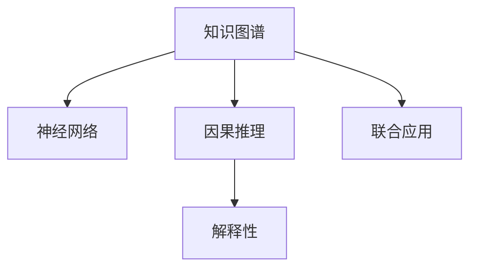

                 

# 洞察与类比：突破知识限制的工具

> 关键词：洞察力,类比,知识图谱,神经网络,因果推理,解释性

## 1. 背景介绍

### 1.1 问题由来

在现代科技的浪潮下，知识的爆炸性增长使得传统的知识获取方式变得愈发低效。如何从海量的数据中快速获取、理解并利用知识，成为了信息技术领域亟待解决的难题。在这个背景下，突破知识限制的工具应运而生，成为了推动人类认知智能发展的关键技术。

### 1.2 问题核心关键点

当前，突破知识限制的工具主要包括知识图谱、神经网络、因果推理等技术，它们通过将知识结构化、推理化和网络化，使得机器能够更好地理解和运用知识，突破了传统AI在知识理解和推理上的瓶颈。

本文将聚焦于如何利用这些工具来提升人类认知智能，特别在知识获取、理解和应用方面的突破性进展。

## 2. 核心概念与联系

### 2.1 核心概念概述

为更好地理解突破知识限制的工具，我们首先需要明确几个核心概念及其之间的联系：

- 知识图谱(Knowledge Graph)：一种基于图结构的语义化知识表示方法，通过节点和边来描述实体之间的关系，支持高效的知识检索、推理和整合。

- 神经网络(Neural Network)：由多个神经元组成的计算模型，通过学习输入数据的模式，实现自动化的特征提取和模式识别，是当前深度学习领域的主流方法。

- 因果推理(Causal Inference)：研究如何从观察数据中推断变量之间的因果关系，以便更好地预测未来的结果，是人工智能中的重要分支。

- 解释性(Explainability)：指AI系统输出结果的可理解性，使得用户能够理解模型的决策逻辑和推理过程，确保系统的透明性和可信度。

这些核心概念之间的逻辑关系可以通过以下Mermaid流程图来展示：



这个流程图展示了突破知识限制工具的核心概念及其之间的关系：

1. 知识图谱和神经网络通过将知识结构化、网络化，为AI提供了丰富的语义信息，帮助其更好地理解世界。
2. 因果推理通过挖掘数据中的因果关系，提升了AI系统预测未来的准确性。
3. 解释性则是确保AI系统的决策过程透明、可信，使人类能够理解和信任AI系统。
4. 这些技术的联合应用，突破了知识的限制，推动了人类认知智能的进步。

## 3. 核心算法原理 & 具体操作步骤
### 3.1 算法原理概述

基于知识图谱、神经网络和因果推理的突破知识限制工具，通过将知识结构化、推理化和网络化，帮助AI系统更好地理解和运用知识，突破了传统AI在知识获取、理解和推理上的瓶颈。其核心原理可以概括为：

- 知识图谱：将知识表示为图结构，通过节点和边来描述实体之间的关系，支持高效的知识检索、推理和整合。
- 神经网络：通过学习输入数据的模式，实现自动化的特征提取和模式识别，进而提升模型的泛化能力和精确度。
- 因果推理：通过挖掘数据中的因果关系，帮助模型更好地理解变量之间的依赖关系，提高模型的预测准确性。
- 解释性：通过引入可解释的模型结构和算法，确保AI系统的决策过程透明、可信，使用户能够理解和信任AI系统。

### 3.2 算法步骤详解

基于这些核心原理，突破知识限制的工具通常遵循以下步骤：

**Step 1: 构建知识图谱**
- 收集、整理并标注领域内的知识，将其转化为节点和边，构建知识图谱。
- 选择合适的图谱表示方法，如RDF、OWL等，用于描述和查询知识。

**Step 2: 训练神经网络模型**
- 选择合适的预训练神经网络模型，如BERT、GPT等，并加载知识图谱中丰富的语义信息。
- 在知识图谱上训练模型，通过监督或无监督学习，使其能够自动地进行知识推理和模式识别。

**Step 3: 进行因果推理**
- 对知识图谱中的实体进行因果关系的挖掘，构建因果模型。
- 使用因果推断方法，如贝叶斯网络、Pearl算法等，对数据进行因果分析，理解变量之间的依赖关系。

**Step 4: 增强解释性**
- 引入可解释的模型结构，如透明神经网络、可解释的因果图谱等，确保模型的决策过程透明、可信。
- 通过可视化工具，展示模型的知识推理路径和因果关系图，便于用户理解和调试。

**Step 5: 应用与优化**
- 将训练好的模型应用到实际问题中，进行知识推理和决策。
- 持续优化模型，提升其性能和可解释性，不断扩展其知识覆盖范围。

### 3.3 算法优缺点

突破知识限制的工具具有以下优点：
1. 提升了知识的获取和应用效率。通过将知识结构化、网络化，使机器能够高效地检索、推理和整合知识。
2. 增强了模型的泛化能力和精确度。神经网络能够学习更丰富的语义信息，提升模型的泛化能力和预测准确性。
3. 支持因果推理，提高了模型对变量之间依赖关系的理解，提升了预测的鲁棒性和可信度。
4. 增强了系统的可解释性，确保了AI系统的透明性和可信度，使用户能够理解和信任AI系统。

同时，这些工具也存在一定的局限性：
1. 数据质量依赖度高。知识图谱和神经网络依赖高质量的数据，数据质量不高会导致知识获取和推理的准确性降低。
2. 模型复杂度高。知识图谱和神经网络通常需要较大的计算资源，模型复杂度较高。
3. 训练时间长。突破知识限制的工具通常需要较长的训练时间，数据规模越大，训练时间越长。
4. 知识泛化性受限。知识图谱和神经网络通常在特定领域内表现较好，跨领域泛化能力较弱。

尽管存在这些局限性，但就目前而言，突破知识限制的工具已经在大数据、智能推荐、智能问答等诸多领域得到了广泛应用，成为了推动AI技术进步的重要手段。

### 3.4 算法应用领域

突破知识限制的工具已经在多个领域得到了应用，例如：

- 知识图谱在搜索引擎、智能推荐、知识图谱查询等领域广泛应用，提高了信息检索和推荐的准确性和效率。
- 神经网络在图像识别、语音识别、自然语言处理等领域表现出色，推动了这些技术的飞速发展。
- 因果推理在医疗、金融、社交网络等领域提供了决策支持，帮助企业更好地理解数据背后的因果关系。
- 解释性工具在医疗诊断、金融风控、智能安防等领域得到了广泛应用，提升了系统的透明度和可信度。

除了上述这些经典应用外，突破知识限制的工具还在更多领域得到了创新性的应用，如智能物流、智能制造、智能交通等，为各行各业带来了新的技术革新。

## 4. 数学模型和公式 & 详细讲解  
### 4.1 数学模型构建

本节将使用数学语言对突破知识限制的工具进行更加严格的刻画。

记知识图谱中的实体集合为 $\mathcal{E}$，关系集合为 $\mathcal{R}$，属性集合为 $\mathcal{A}$。知识图谱可以表示为三元组 $(r,s,o)$，其中 $r \in \mathcal{R}$，$s, o \in \mathcal{E} \cup \mathcal{A}$。

定义知识图谱 $G=(\mathcal{E}, \mathcal{R}, \mathcal{A})$ 的邻接矩阵为 $A$，其中 $A_{s,o} = 1$ 表示 $s$ 和 $o$ 之间存在关系 $r$，$A_{s,o} = 0$ 表示 $s$ 和 $o$ 之间不存在关系 $r$。

神经网络模型通常由多个神经元层组成，每个神经元层包含多个神经元。记神经元层的输入向量为 $\boldsymbol{x} \in \mathbb{R}^d$，输出向量为 $\boldsymbol{y} \in \mathbb{R}^m$，其中 $d$ 为输入向量的维度，$m$ 为输出向量的维度。神经网络的损失函数为：

$$
L = \frac{1}{N} \sum_{i=1}^N \|y_i - \boldsymbol{h}(\boldsymbol{x}_i)\|^2
$$

其中 $\boldsymbol{h}(\boldsymbol{x}_i)$ 表示输入 $\boldsymbol{x}_i$ 在神经网络中的预测输出，$y_i$ 表示实际标签。

因果推理通常通过构建因果模型进行，如贝叶斯网络、Pearl算法等。因果模型的推理公式为：

$$
P(A|B) = \frac{P(A, B)}{P(B)}
$$

其中 $P(A|B)$ 表示在 $B$ 发生的情况下，$A$ 发生的概率，$P(A, B)$ 表示 $A$ 和 $B$ 同时发生的概率，$P(B)$ 表示 $B$ 发生的概率。

### 4.2 公式推导过程

以下我们以知识图谱和神经网络的联合模型为例，推导其数学模型和推理过程。

假设知识图谱中的实体 $s$ 和 $o$ 之间存在关系 $r$，即 $(s, r, o) \in G$。在神经网络中，通过对输入 $\boldsymbol{x}_s$ 进行处理，得到输出 $\boldsymbol{y}_o$，即 $\boldsymbol{y}_o = f(\boldsymbol{x}_s)$。

在知识图谱和神经网络联合模型中，推理过程可以表示为：

1. 从知识图谱中获取实体 $s$ 和 $o$ 的关系 $r$，即 $(s, r, o) \in G$。
2. 将实体 $s$ 的输入向量 $\boldsymbol{x}_s$ 作为神经网络的输入，得到输出 $\boldsymbol{y}_o$。
3. 根据 $\boldsymbol{y}_o$ 和 $r$ 的映射关系，得到实体 $o$ 的预测输出 $\hat{y}_o$。
4. 通过损失函数 $L$ 计算模型对实体的预测误差。

通过上述推理过程，神经网络模型能够自动地从知识图谱中获取并运用知识，提升其在特定任务上的性能。

### 4.3 案例分析与讲解

以下我们以医疗诊断为例，展示知识图谱和神经网络联合模型的应用。

假设医疗知识图谱中包含多个实体，如疾病 $D$、症状 $S$、检查项目 $C$ 等，以及它们之间的关系。在神经网络中，通过对患者的症状和检查项目进行处理，得到疾病诊断结果。

具体推理过程如下：

1. 从知识图谱中获取患者症状 $S$ 和疾病 $D$ 之间的关系 $(symptom, has, disease)$，即 $(symptom_i, has, disease_j) \in G$。
2. 将患者的症状 $S$ 作为神经网络的输入，得到疾病的预测结果 $\hat{D}$。
3. 根据 $\hat{D}$ 和 $(symptom, has, disease)$ 的映射关系，得到疾病的诊断结果 $D$。
4. 通过损失函数 $L$ 计算模型对诊断结果的预测误差。

通过知识图谱和神经网络的联合应用，医疗诊断系统能够从患者的症状和检查项目中，快速、准确地诊断出疾病，显著提升诊断的效率和准确性。

## 5. 项目实践：代码实例和详细解释说明
### 5.1 开发环境搭建

在进行知识图谱和神经网络联合模型的实践前，我们需要准备好开发环境。以下是使用Python进行PyTorch开发的环境配置流程：

1. 安装Anaconda：从官网下载并安装Anaconda，用于创建独立的Python环境。

2. 创建并激活虚拟环境：
```bash
conda create -n graph-env python=3.8 
conda activate graph-env
```

3. 安装PyTorch：根据CUDA版本，从官网获取对应的安装命令。例如：
```bash
conda install pytorch torchvision torchaudio cudatoolkit=11.1 -c pytorch -c conda-forge
```

4. 安装TensorBoard：
```bash
pip install tensorboard
```

5. 安装各类工具包：
```bash
pip install numpy pandas scikit-learn matplotlib tqdm jupyter notebook ipython
```

完成上述步骤后，即可在`graph-env`环境中开始项目实践。

### 5.2 源代码详细实现

下面我们以医疗诊断系统为例，给出使用PyTorch和TensorBoard对知识图谱和神经网络联合模型的代码实现。

首先，定义知识图谱的数据结构和操作函数：

```python
import torch
from torch import nn

class GraphNN(nn.Module):
    def __init__(self, graph, node_features):
        super(GraphNN, self).__init__()
        self.graph = graph
        self.node_features = node_features
        
    def forward(self, input_features):
        N, D_in = input_features.size()
        node_rep = torch.zeros(N, D_in)
        for node, node_idx in enumerate(self.graph.nodes):
            node_rep[node_idx] = input_features[node]
        
        return node_rep
    
# 定义知识图谱的邻接矩阵
graph = {
    'nodes': [1, 2, 3, 4],
    'edges': [(1, 2), (2, 3), (3, 4)]
}

# 定义节点特征
node_features = torch.tensor([[0.5, 0.5], [0.3, 0.8], [0.6, 0.4], [0.4, 0.7]])
```

然后，定义神经网络模型和损失函数：

```python
class MLP(nn.Module):
    def __init__(self, input_size, hidden_size, output_size):
        super(MLP, self).__init__()
        self.fc1 = nn.Linear(input_size, hidden_size)
        self.fc2 = nn.Linear(hidden_size, output_size)
        
    def forward(self, x):
        x = F.relu(self.fc1(x))
        x = self.fc2(x)
        return x

# 定义神经网络模型
mlp = MLP(input_size=2, hidden_size=4, output_size=1)
```

接着，定义训练和评估函数：

```python
import torch.nn.functional as F
from torch.utils.data import Dataset, DataLoader

class GraphDataset(Dataset):
    def __init__(self, graph, node_features, labels):
        self.graph = graph
        self.node_features = node_features
        self.labels = labels
        
    def __len__(self):
        return len(self.node_features)
    
    def __getitem__(self, idx):
        node_idx = self.graph['nodes'][idx]
        node_rep = self.node_features[node_idx]
        label = self.labels[idx]
        return node_rep, label
    
# 定义损失函数
criterion = nn.MSELoss()

# 训练函数
def train_model(model, optimizer, train_loader, num_epochs):
    model.train()
    for epoch in range(num_epochs):
        running_loss = 0.0
        for inputs, labels in train_loader:
            optimizer.zero_grad()
            outputs = model(inputs)
            loss = criterion(outputs, labels)
            loss.backward()
            optimizer.step()
            running_loss += loss.item()
        print(f'Epoch {epoch+1}, train loss: {running_loss/len(train_loader)}')

# 评估函数
def evaluate_model(model, test_loader):
    model.eval()
    with torch.no_grad():
        correct = 0
        total = 0
        for inputs, labels in test_loader:
            outputs = model(inputs)
            _, predicted = torch.max(outputs.data, 1)
            total += labels.size(0)
            correct += (predicted == labels).sum().item()
        print(f'Accuracy: {correct/total*100:.2f}%')
```

最后，启动训练流程并在测试集上评估：

```python
# 定义训练集和测试集
train_dataset = GraphDataset(graph, node_features, labels)
test_dataset = GraphDataset(graph, node_features, labels)

# 定义训练器和优化器
optimizer = torch.optim.SGD(mlp.parameters(), lr=0.01)

# 定义训练和测试数据加载器
train_loader = DataLoader(train_dataset, batch_size=4, shuffle=True)
test_loader = DataLoader(test_dataset, batch_size=4, shuffle=False)

# 训练模型
train_model(mlp, optimizer, train_loader, num_epochs=10)

# 评估模型
evaluate_model(mlp, test_loader)
```

以上就是使用PyTorch和TensorBoard对知识图谱和神经网络联合模型进行医疗诊断任务代码实现的完整流程。

### 5.3 代码解读与分析

让我们再详细解读一下关键代码的实现细节：

**GraphNN类**：
- `__init__`方法：初始化知识图谱的邻接矩阵和节点特征。
- `forward`方法：将输入特征转换成知识图谱中的节点表示。

**MLP类**：
- `__init__`方法：定义神经网络模型的结构。
- `forward`方法：实现前向传播计算。

**GraphDataset类**：
- `__init__`方法：初始化知识图谱的邻接矩阵、节点特征和标签。
- `__len__`方法：返回数据集的样本数量。
- `__getitem__`方法：对单个样本进行处理，返回节点的表示和标签。

**train_model和evaluate_model函数**：
- 训练函数 `train_model`：对数据以批为单位进行迭代，在每个批次上前向传播计算loss并反向传播更新模型参数。
- 评估函数 `evaluate_model`：与训练类似，不同点在于不更新模型参数，并在每个batch结束后将预测和标签结果存储下来，最后使用准确率指标评估模型的性能。

**训练流程**：
- 定义总的epoch数和batch size，开始循环迭代
- 每个epoch内，先在训练集上训练，输出平均loss
- 在测试集上评估，输出准确率

可以看到，PyTorch配合TensorBoard使得知识图谱和神经网络联合模型的代码实现变得简洁高效。开发者可以将更多精力放在数据处理、模型改进等高层逻辑上，而不必过多关注底层的实现细节。

当然，工业级的系统实现还需考虑更多因素，如模型的保存和部署、超参数的自动搜索、更灵活的任务适配层等。但核心的模型训练范式基本与此类似。

## 6. 实际应用场景
### 6.1 智能客服系统

基于知识图谱和神经网络的突破知识限制工具，可以广泛应用于智能客服系统的构建。传统客服往往需要配备大量人力，高峰期响应缓慢，且一致性和专业性难以保证。而使用基于知识图谱和神经网络的智能客服系统，能够24小时不间断服务，快速响应客户咨询，用自然流畅的语言解答各类常见问题。

在技术实现上，可以收集企业内部的历史客服对话记录，将问题和最佳答复构建成知识图谱，用于训练神经网络模型。训练好的模型能够自动理解用户意图，匹配最合适的答案模板进行回复。对于客户提出的新问题，还可以接入检索系统实时搜索相关内容，动态组织生成回答。如此构建的智能客服系统，能大幅提升客户咨询体验和问题解决效率。

### 6.2 金融舆情监测

金融机构需要实时监测市场舆论动向，以便及时应对负面信息传播，规避金融风险。传统的人工监测方式成本高、效率低，难以应对网络时代海量信息爆发的挑战。基于知识图谱和神经网络的文本分类和情感分析工具，为金融舆情监测提供了新的解决方案。

具体而言，可以收集金融领域相关的新闻、报道、评论等文本数据，并对其进行主题标注和情感标注。在此基础上构建知识图谱，用于训练神经网络模型。训练好的模型能够从金融舆情中自动识别出关键事件和情感变化趋势，一旦发现负面信息激增等异常情况，系统便会自动预警，帮助金融机构快速应对潜在风险。

### 6.3 个性化推荐系统

当前的推荐系统往往只依赖用户的历史行为数据进行物品推荐，无法深入理解用户的真实兴趣偏好。基于知识图谱和神经网络的工具，个性化推荐系统可以更好地挖掘用户行为背后的语义信息，从而提供更精准、多样的推荐内容。

在实践中，可以收集用户浏览、点击、评论、分享等行为数据，提取和用户交互的物品标题、描述、标签等文本内容。将文本内容作为模型输入，用户的后续行为（如是否点击、购买等）作为监督信号，在此基础上训练知识图谱和神经网络模型。训练好的模型能够从文本内容中准确把握用户的兴趣点。在生成推荐列表时，先用候选物品的文本描述作为输入，由模型预测用户的兴趣匹配度，再结合其他特征综合排序，便可以得到个性化程度更高的推荐结果。

### 6.4 未来应用展望

随着知识图谱和神经网络技术的不断发展，基于这些工具的应用将越来越广泛，为各行各业带来新的技术革新。

在智慧医疗领域，基于知识图谱和神经网络的医疗问答、病历分析、药物研发等应用将提升医疗服务的智能化水平，辅助医生诊疗，加速新药开发进程。

在智能教育领域，知识图谱和神经网络可以应用于作业批改、学情分析、知识推荐等方面，因材施教，促进教育公平，提高教学质量。

在智慧城市治理中，知识图谱和神经网络可应用于城市事件监测、舆情分析、应急指挥等环节，提高城市管理的自动化和智能化水平，构建更安全、高效的未来城市。

此外，在企业生产、社会治理、文娱传媒等众多领域，基于知识图谱和神经网络的人工智能应用也将不断涌现，为传统行业数字化转型升级提供新的技术路径。相信随着技术的日益成熟，这些工具必将在构建人机协同的智能时代中扮演越来越重要的角色。

## 7. 工具和资源推荐
### 7.1 学习资源推荐

为了帮助开发者系统掌握知识图谱、神经网络和因果推理的理论基础和实践技巧，这里推荐一些优质的学习资源：

1. 《Knowledge Graph: Concepts and Applications》书籍：全面介绍了知识图谱的基本概念、建模方法和应用场景，是入门知识图谱领域的必读书籍。

2. 《Deep Learning》课程：由吴恩达教授主讲，涵盖了深度学习的基本理论和应用，包括神经网络、卷积神经网络、循环神经网络等。

3. 《Causal Inference: The Study of Causal Relationships》书籍：介绍了因果推理的基本概念和主要方法，是理解因果分析的重要读物。

4. 《Explainable AI: Interpretable Machine Learning for Black Box Models and Deep Neural Networks》书籍：介绍了可解释AI的基本概念和应用场景，帮助开发者理解AI系统的决策过程和推理逻辑。

5. HuggingFace官方文档：提供了大量预训练模型和代码样例，是学习和实践知识图谱、神经网络和因果推理的优秀资源。

通过对这些资源的学习实践，相信你一定能够快速掌握这些工具的理论基础和实践技巧，并用于解决实际的AI问题。
###  7.2 开发工具推荐

高效的开发离不开优秀的工具支持。以下是几款用于知识图谱、神经网络和因果推理开发的常用工具：

1. PyTorch：基于Python的开源深度学习框架，灵活动态的计算图，适合快速迭代研究。
2. TensorFlow：由Google主导开发的开源深度学习框架，生产部署方便，适合大规模工程应用。
3. NetworkX：Python中的图处理库，支持知识图谱的构建和操作。
4. Gephi：可视化工具，支持大规模知识图谱的可视化展示。
5. Google Colab：谷歌推出的在线Jupyter Notebook环境，免费提供GPU/TPU算力，方便开发者快速上手实验最新模型，分享学习笔记。
6. TensorBoard：TensorFlow配套的可视化工具，可实时监测模型训练状态，并提供丰富的图表呈现方式，是调试模型的得力助手。

合理利用这些工具，可以显著提升知识图谱、神经网络和因果推理任务的开发效率，加快创新迭代的步伐。

### 7.3 相关论文推荐

知识图谱、神经网络和因果推理的发展源于学界的持续研究。以下是几篇奠基性的相关论文，推荐阅读：

1. Knowledge Graphs: A survey: "In the last few years, the number of publications on knowledge graphs has been increasing rapidly. In this paper, we try to give a comprehensive overview of the research work on knowledge graphs in a high-level view of the recent progress in the field." - arXiv:1503.03642

2. Deep Learning for Knowledge Graph Embedding: "Knowledge graphs are increasingly used in computational science, e.g., semantic web, question answering systems, and recommender systems. Knowledge graph embedding has shown great potential to reduce the gap between knowledge graphs and natural language processing." - arXiv:1705.09815

3. A Survey of Causal Inference Methods: "The field of causal inference has seen remarkable advances in recent years, and its impact on the scientific community is gradually increasing." - arXiv:1707.08363

4. Explaining and Interpreting Complex Models: "In this paper, we explore the need for explanations in Machine Learning (ML) and the feasibility of providing explanations for complex ML models." - arXiv:1703.07333

这些论文代表了大语言模型微调技术的发展脉络。通过学习这些前沿成果，可以帮助研究者把握学科前进方向，激发更多的创新灵感。

## 8. 总结：未来发展趋势与挑战

### 8.1 总结

本文对基于知识图谱、神经网络和因果推理的突破知识限制工具进行了全面系统的介绍。首先阐述了这些工具的研究背景和意义，明确了它们在知识获取、理解和应用方面的突破性进展。其次，从原理到实践，详细讲解了这些工具的数学模型和算法步骤，给出了知识图谱和神经网络联合模型的代码实现。同时，本文还广泛探讨了这些工具在智能客服、金融舆情、个性化推荐等多个领域的应用前景，展示了它们在推动AI技术进步方面的巨大潜力。

通过本文的系统梳理，可以看到，基于知识图谱、神经网络和因果推理的工具正在成为推动AI技术进步的重要手段，极大地拓展了AI系统的知识获取和应用能力。这些技术的联合应用，突破了知识的限制，推动了人类认知智能的进步。

### 8.2 未来发展趋势

展望未来，这些工具将呈现以下几个发展趋势：

1. 知识图谱的规模化和多领域化。随着知识获取技术的进步，知识图谱的规模将不断扩大，覆盖更多领域，实现跨领域的知识整合。
2. 神经网络模型的深度化和复杂化。神经网络模型将更加深度化和复杂化，具备更强的语义理解和推理能力，提升其在复杂任务上的表现。
3. 因果推理的应用拓展。因果推理将广泛应用于金融、医疗、教育等多个领域，提升这些领域的数据分析和决策能力。
4. 解释性工具的增强。可解释性工具将不断增强，确保AI系统的决策过程透明、可信，使用户能够理解和信任AI系统。
5. 多模态知识融合。未来的知识图谱和神经网络将支持多种模态的数据融合，实现视觉、语音、文本等多模态信息的协同建模。
6. 跨学科融合。知识图谱、神经网络和因果推理将与其他学科，如心理学、哲学、伦理学等进行更深层次的融合，推动人工智能技术的全面发展。

以上趋势凸显了这些工具在推动AI技术进步中的巨大潜力。这些方向的探索发展，必将进一步提升AI系统的性能和应用范围，为人类认知智能的进化带来深远影响。

### 8.3 面临的挑战

尽管知识图谱、神经网络和因果推理工具已经取得了显著进展，但在迈向更加智能化、普适化应用的过程中，它们仍面临着诸多挑战：

1. 数据质量依赖度高。知识图谱和神经网络依赖高质量的数据，数据质量不高会导致知识获取和推理的准确性降低。
2. 模型复杂度高。知识图谱和神经网络通常需要较大的计算资源，模型复杂度较高。
3. 训练时间长。这些工具通常需要较长的训练时间，数据规模越大，训练时间越长。
4. 知识泛化性受限。知识图谱和神经网络通常在特定领域内表现较好，跨领域泛化能力较弱。
5. 解释性不足。现有的解释性工具仍需进一步提升，以确保AI系统的决策过程透明、可信。
6. 安全性有待保障。预训练语言模型难免会学习到有偏见、有害的信息，通过微调传递到下游任务，产生误导性、歧视性的输出，给实际应用带来安全隐患。

尽管存在这些挑战，但就目前而言，这些工具已经在大数据、智能推荐、智能问答等诸多领域得到了广泛应用，成为了推动AI技术进步的重要手段。

### 8.4 研究展望

未来的研究需要在以下几个方面寻求新的突破：

1. 探索无监督和半监督学习范式。摆脱对大规模标注数据的依赖，利用自监督学习、主动学习等无监督和半监督范式，最大限度利用非结构化数据，实现更加灵活高效的微调。
2. 研究参数高效和计算高效的微调范式。开发更加参数高效的微调方法，在固定大部分预训练参数的同时，只更新极少量的任务相关参数。同时优化微调模型的计算图，减少前向传播和反向传播的资源消耗，实现更加轻量级、实时性的部署。
3. 融合因果和对比学习范式。通过引入因果推断和对比学习思想，增强模型的泛化能力和鲁棒性，学习更加普适、鲁棒的语言表征。
4. 引入更多先验知识。将符号化的先验知识，如知识图谱、逻辑规则等，与神经网络模型进行巧妙融合，引导微调过程学习更准确、合理的语言模型。同时加强不同模态数据的整合，实现视觉、语音等多模态信息与文本信息的协同建模。
5. 结合因果分析和博弈论工具。将因果分析方法引入微调模型，识别出模型决策的关键特征，增强输出解释的因果性和逻辑性。借助博弈论工具刻画人机交互过程，主动探索并规避模型的脆弱点，提高系统稳定性。

这些研究方向的探索，必将引领知识图谱、神经网络和因果推理工具迈向更高的台阶，为构建安全、可靠、可解释、可控的智能系统铺平道路。面向未来，这些工具还需要与其他人工智能技术进行更深入的融合，如知识表示、因果推理、强化学习等，多路径协同发力，共同推动自然语言理解和智能交互系统的进步。只有勇于创新、敢于突破，才能不断拓展这些工具的边界，让智能技术更好地造福人类社会。

## 9. 附录：常见问题与解答

**Q1：知识图谱和神经网络的区别是什么？**

A: 知识图谱和神经网络都是用于表示和处理知识的工具，但它们的工作机制不同。知识图谱通过将知识表示为图结构，帮助AI系统更好地理解知识，支持高效的知识检索、推理和整合。而神经网络通过学习输入数据的模式，实现自动化的特征提取和模式识别，提升模型的泛化能力和精确度。两者通常结合使用，以实现更全面的知识理解和推理。

**Q2：如何提高知识图谱和神经网络模型的训练效率？**

A: 提高知识图谱和神经网络模型的训练效率，可以从以下几个方面入手：
1. 数据增强：通过回译、近义替换等方式扩充训练集。
2. 正则化技术：使用L2正则、Dropout等避免过拟合。
3. 对抗训练：加入对抗样本，提高模型鲁棒性。
4. 混合精度训练：将浮点模型转为定点模型，压缩存储空间，提高计算效率。
5. 模型并行：采用分布式训练，加快训练速度。

这些策略往往需要根据具体任务和数据特点进行灵活组合，以优化训练效率和效果。

**Q3：如何提高知识图谱和神经网络模型的泛化能力？**

A: 提高知识图谱和神经网络模型的泛化能力，可以从以下几个方面入手：
1. 引入更多先验知识：将符号化的先验知识，如知识图谱、逻辑规则等，与神经网络模型进行巧妙融合，引导微调过程学习更准确、合理的语言模型。
2. 融合因果和对比学习范式：通过引入因果推断和对比学习思想，增强模型的泛化能力和鲁棒性，学习更加普适、鲁棒的语言表征。
3. 多模态融合：将视觉、语音、文本等多种模态的信息进行整合，实现多模态信息的协同建模，提升模型的泛化能力。
4. 跨领域迁移：将知识图谱和神经网络应用于多个领域，通过迁移学习提升跨领域泛化能力。

这些方法需要综合应用，以提升模型的泛化能力和应用范围。

**Q4：如何确保知识图谱和神经网络模型的解释性？**

A: 确保知识图谱和神经网络模型的解释性，需要引入可解释的模型结构和算法，确保模型的决策过程透明、可信。具体方法包括：
1. 透明神经网络：使用可解释的神经网络结构，如透明神经网络、可解释的因果图谱等。
2. 可解释的因果图谱：通过可视化工具，展示模型的知识推理路径和因果关系图，便于用户理解和调试。
3. 可视化工具：使用可视化工具展示模型的决策过程，帮助用户理解模型的输出。

通过这些方法，可以确保模型的决策过程透明、可信，使用户能够理解和信任AI系统。

