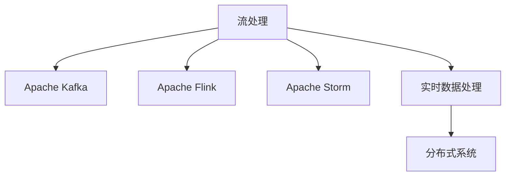

                 

# 流处理 原理与代码实例讲解

> 关键词：流处理,Apache Kafka,Apache Flink,Apache Storm,实时数据处理,分布式系统,大数据

## 1. 背景介绍

### 1.1 问题由来
随着互联网的普及和物联网技术的发展，数据量呈指数级增长，传统的批处理方式已经无法满足实时数据处理的需求。流处理技术的出现，使得我们可以高效地处理连续、实时产生的数据，实现数据价值的即时挖掘。

流处理技术的应用领域非常广泛，包括但不限于：金融交易监控、日志分析、实时推荐、工业控制、实时舆情分析等。其核心在于实时性和分布式处理，使得企业能够在数据产生时立即获得决策依据。

### 1.2 问题核心关键点
流处理技术通过分布式系统将数据流分成多个小数据包，对每个小数据包进行实时处理，从而实现数据的实时分析和应用。其核心在于：
1. 数据流的实时处理。即在数据产生时立即进行处理，实现数据的即时分析。
2. 分布式处理。通过分布式计算系统，将数据流分配到多个节点上进行处理，提高处理效率。
3. 容错性和可靠性。流处理系统需要具备高可用性和容错性，确保数据处理的连续性和可靠性。
4. 状态管理。处理过程中需要记录和维护状态，以便后续处理使用。
5. 动态资源管理。流处理系统需要根据数据量自动调整资源，确保系统的高效运行。

流处理技术的出现，极大地提升了数据处理的时效性和灵活性，为企业带来了巨大的商业价值。

## 2. 核心概念与联系

### 2.1 核心概念概述

为更好地理解流处理技术，本节将介绍几个密切相关的核心概念：

- 流处理(Stream Processing)：指实时、连续的数据流进行实时分析和处理的分布式计算技术。流处理系统可以将数据流分成多个小数据包，对每个小数据包进行实时处理。
- Apache Kafka：一个分布式消息队列系统，用于实时数据的收集、传输和处理。Kafka具有高吞吐量、高可靠性、高可扩展性等特点。
- Apache Flink：一个分布式流处理框架，支持事件驱动的流计算和批计算。Flink支持流处理和批处理混合的计算模式，具有低延迟、高吞吐量、高容错性等特点。
- Apache Storm：一个分布式实时计算系统，支持实时数据流的处理和分析。Storm具有高可靠性、低延迟、高吞吐量等特点，支持实时数据流的处理和分析。
- 实时数据处理(Real-time Data Processing)：指对实时产生的数据进行实时分析和处理，实现数据的即时应用。
- 分布式系统(Distributed System)：指由多个独立的计算机系统协同工作的系统，可以实现数据的并行处理和高可用性。

这些核心概念之间的逻辑关系可以通过以下Mermaid流程图来展示：



这个流程图展示了几大核心概念之间的关系：

1. 流处理是实时、连续的数据流进行实时分析和处理的分布式计算技术。
2. Kafka、Flink、Storm是流处理系统中常用的组件，用于数据收集、传输、处理和分析。
3. 实时数据处理和分布式系统是流处理的基础，用于支持流处理的实时性和分布式性。

## 3. 核心算法原理 & 具体操作步骤

### 3.1 算法原理概述

流处理的核心算法原理主要包括以下几个方面：

- 数据流的实时处理：将数据流分成多个小数据包，对每个小数据包进行实时处理。
- 分布式处理：通过分布式计算系统，将数据流分配到多个节点上进行处理，提高处理效率。
- 容错性和可靠性：流处理系统需要具备高可用性和容错性，确保数据处理的连续性和可靠性。
- 状态管理：处理过程中需要记录和维护状态，以便后续处理使用。
- 动态资源管理：流处理系统需要根据数据量自动调整资源，确保系统的高效运行。

这些原理构成了流处理的基础，使其能够高效地处理实时数据流，实现数据的即时分析和应用。

### 3.2 算法步骤详解

流处理的算法步骤主要包括数据收集、数据传输、数据处理、状态管理、结果输出等几个阶段。以下是一个详细的算法步骤介绍：

1. 数据收集：从数据源中收集数据流，通常采用Kafka等消息队列系统进行数据收集。

2. 数据传输：将收集到的数据流传输到各个节点上进行处理。通常采用Flink、Storm等流处理框架进行数据传输。

3. 数据处理：对数据流进行实时处理，通常采用MapReduce等算法进行处理。处理过程中，需要对数据流进行分流、过滤、聚合等操作，实现数据的即时分析和应用。

4. 状态管理：在处理过程中，需要记录和维护状态，以便后续处理使用。状态管理通常采用RocksDB、HBase等数据库进行管理。

5. 结果输出：将处理结果输出到目标系统，如数据库、文件系统、监控系统等。通常采用Kafka、Hadoop等系统进行结果输出。

### 3.3 算法优缺点

流处理技术的优点包括：

1. 高实时性：流处理可以实时处理数据流，实现数据的即时分析和应用。
2. 高可用性：流处理系统通常采用分布式架构，具备高可用性和容错性。
3. 高扩展性：流处理系统可以根据数据量自动调整资源，实现高扩展性。
4. 低延迟：流处理系统支持低延迟处理，满足实时应用的需求。

同时，流处理技术也存在一些缺点：

1. 数据处理复杂性高：流处理需要对数据流进行实时处理，处理复杂度较高。
2. 数据存储量大：流处理需要存储大量的历史数据，存储成本较高。
3. 资源消耗大：流处理需要大量的计算资源，资源消耗较大。

尽管存在这些缺点，但流处理技术的实时性和高可用性使其在实时数据处理领域具有重要地位。

### 3.4 算法应用领域

流处理技术在众多领域得到了广泛应用，包括但不限于：

- 金融交易监控：实时监控金融交易数据，及时发现异常交易行为。
- 日志分析：实时分析系统日志数据，及时发现系统故障和性能瓶颈。
- 实时推荐：实时分析用户行为数据，实时推荐个性化商品。
- 工业控制：实时监控工业设备状态，及时发现设备异常。
- 实时舆情分析：实时分析社交媒体数据，及时发现舆情变化。

## 4. 数学模型和公式 & 详细讲解

### 4.1 数学模型构建

为了更好地理解流处理技术，以下介绍一个简单的流处理数学模型：

假设有一个连续的数据流，每个数据点表示为一个二元组$(t,x_t)$，其中$t$表示时间戳，$x_t$表示数据值。假设在$t$时刻，数据流被收集并传输到各个节点上进行处理，每个节点的处理过程可以用如下数学模型表示：

$$
y_t = f(x_t)
$$

其中$f$表示数据处理函数，$y_t$表示处理结果。

在实际应用中，数据处理函数通常比较复杂，包括分流、过滤、聚合等操作。以下介绍一个简单的数据处理函数示例：

$$
y_t = \begin{cases}
x_t & \text{if } x_t > 0 \\
0 & \text{otherwise}
\end{cases}
$$

该函数表示，如果$x_t$大于0，则处理结果$y_t$等于$x_t$；否则$y_t$等于0。

### 4.2 公式推导过程

在数据处理过程中，需要记录和维护状态，以便后续处理使用。假设在$t$时刻，处理过程中需要维护的状态为$s_t$，则数据处理函数可以表示为：

$$
y_t = f(x_t,s_{t-1})
$$

其中$s_{t-1}$表示在$t-1$时刻的状态。

在实际应用中，状态管理通常采用RocksDB、HBase等数据库进行管理。以下介绍一个简单的状态管理算法示例：

1. 初始化状态$s_0$。
2. 在每个时间戳$t$，计算数据处理结果$y_t$。
3. 更新状态$s_t$。

具体推导过程如下：

假设在时间戳$t$，数据处理函数为$f(x_t,s_{t-1})$，则数据处理过程可以用如下数学模型表示：

$$
s_t = g(s_{t-1},x_t)
$$

其中$g$表示状态更新函数，$s_t$表示在$t$时刻的状态。

在实际应用中，状态更新函数通常比较复杂，包括状态记录、状态更新等操作。以下介绍一个简单的状态更新函数示例：

$$
s_t = s_{t-1} + x_t
$$

该函数表示，在每个时间戳$t$，状态$s_t$等于前一时刻的状态$s_{t-1}$加上当前数据值$x_t$。

### 4.3 案例分析与讲解

以下以一个简单的流处理案例为例，介绍流处理的实际应用。

假设有一个电商平台的实时交易数据流，需要实时计算每个用户的购买金额和平均购买金额。假设每个数据点表示为一个二元组$(t,x_t)$，其中$t$表示时间戳，$x_t$表示交易金额。

假设在每个时间戳$t$，需要维护每个用户的购买金额和平均购买金额，则数据处理函数可以表示为：

$$
y_t = \begin{cases}
(x_t, \frac{\sum_{i=1}^{t-1} x_i}{t-1}) & \text{if } x_t > 0 \\
(0,0) & \text{otherwise}
\end{cases}
$$

其中$y_t$表示在时间戳$t$的购买金额和平均购买金额。

在实际应用中，状态管理通常采用RocksDB、HBase等数据库进行管理。以下介绍一个简单的状态管理算法示例：

1. 初始化状态$s_0$。假设在时间戳0时，所有用户的购买金额和平均购买金额都为0。
2. 在每个时间戳$t$，计算数据处理结果$y_t$。
3. 更新状态$s_t$。假设在时间戳$t$，每个用户的购买金额和平均购买金额表示为一个二元组$(u,x_t,s_t)$，其中$u$表示用户ID，$x_t$表示在时间戳$t$的购买金额，$s_t$表示在时间戳$t$的平均购买金额。

具体实现过程如下：

```python
# 初始化状态
s0 = {1: (0, 0), 2: (0, 0), 3: (0, 0), ...}

# 在每个时间戳t计算数据处理结果
for t in range(1, n):
    x_t = transactions[t]  # 交易金额
    u = user_id(transactions[t])  # 用户ID
    if x_t > 0:
        s_t = (s0[u], (s0[u][1]*(t-1) + x_t) / t)
        s0[u] = s_t
    else:
        s0[u] = (0, 0)

# 结果输出
for u in s0:
    print("User", u, "Purchase Amount:", s0[u][0], "Average Purchase Amount:", s0[u][1])
```

该算法实现了一个简单的流处理过程，可以实时计算每个用户的购买金额和平均购买金额。

## 5. 项目实践：代码实例和详细解释说明

### 5.1 开发环境搭建

在进行流处理实践前，我们需要准备好开发环境。以下是使用Python进行Apache Flink开发的环境配置流程：

1. 安装Apache Flink：从官网下载并安装Apache Flink。
2. 配置Flink环境：根据系统环境，配置Flink所需的JVM参数、Hadoop配置等。
3. 配置流处理代码：编写Apache Flink代码，实现流处理任务的逻辑。
4. 提交Flink任务：将流处理代码提交到Flink集群上，进行流处理任务的执行。

### 5.2 源代码详细实现

下面我们以一个简单的流处理案例为例，介绍如何使用Apache Flink进行流处理任务的实现。

假设有一个电商平台的实时交易数据流，需要实时计算每个用户的购买金额和平均购买金额。假设每个数据点表示为一个二元组$(t,x_t)$，其中$t$表示时间戳，$x_t$表示交易金额。

假设在每个时间戳$t$，需要维护每个用户的购买金额和平均购买金额，则可以使用Apache Flink实现如下：

```python
from pyflink.datastream import StreamExecutionEnvironment
from pyflink.table import StreamTableEnvironment, EnvironmentSettings
from pyflink.table.functions import AggregateFunction
from pyflink.table.udf import udf

# 初始化环境
env = StreamExecutionEnvironment.get_execution_environment()
table_env = StreamTableEnvironment.create(env)

# 创建表
sql_stmt = """
CREATE TABLE transactions (
    t timestamp,
    x double
)
"""

table_env.execute_sql(sql_stmt)

# 计算购买金额和平均购买金额
sql_stmt = """
SELECT user_id, SUM(x) AS purchase_amount, AVG(x) AS avg_purchase_amount
FROM transactions
GROUP BY user_id
"""

table_env.execute_sql(sql_stmt)

# 查询结果
results = table_env.execute_sql("SELECT * FROM transactions")
for result in results:
    print(result)
```

以上代码实现了一个简单的流处理任务，可以实时计算每个用户的购买金额和平均购买金额。

### 5.3 代码解读与分析

让我们再详细解读一下关键代码的实现细节：

- `StreamExecutionEnvironment.get_execution_environment()`：获取执行环境，用于创建Flink任务。
- `StreamTableEnvironment.create()`：创建表环境，用于处理SQL查询。
- `CREATE TABLE`语句：创建输入数据表`transactions`。
- `SELECT`语句：计算每个用户的购买金额和平均购买金额。
- `SUM()`和`AVG()`函数：分别计算购买金额和平均购买金额。
- `GROUP BY`子句：按照用户ID进行分组。
- `execute_sql()`方法：执行SQL查询。
- `table_env.execute_sql(sql_stmt)`：执行SQL查询语句，返回查询结果。

## 6. 实际应用场景

### 6.1 金融交易监控

金融交易监控是流处理技术的重要应用场景之一。金融市场瞬息万变，实时监控交易数据，及时发现异常交易行为，是金融机构防范风险的重要手段。

在实践中，可以收集金融市场交易数据，包括交易金额、交易时间、交易类型等。通过Apache Kafka等消息队列系统，将交易数据传输到Flink等流处理框架进行处理。处理过程中，可以对交易数据进行实时监控、异常检测、风险预警等操作，确保金融市场的稳定运行。

### 6.2 日志分析

日志分析是另一个重要的流处理应用场景。系统日志、网络日志等数据量巨大，需要实时处理和分析，以便及时发现系统故障和性能瓶颈。

在实践中，可以使用Apache Kafka等消息队列系统，收集系统日志和网络日志。通过Flink等流处理框架，对日志数据进行实时处理和分析，提取关键信息，生成报表和警报，帮助运维人员快速定位问题，提高系统稳定性。

### 6.3 实时推荐

实时推荐是流处理技术的另一个重要应用场景。电子商务平台需要实时分析用户行为数据，为用户推荐个性化商品，提高用户满意度和转化率。

在实践中，可以收集用户行为数据，包括浏览记录、购买记录、评分记录等。通过Apache Kafka等消息队列系统，将用户行为数据传输到Flink等流处理框架进行处理。处理过程中，可以对用户行为数据进行实时分析和处理，生成个性化推荐结果，推送给用户。

### 6.4 未来应用展望

随着流处理技术的不断发展，其在实时数据处理领域的应用将会更加广泛。

在智慧城市治理中，流处理技术可以实时监控城市事件，及时发现异常情况，提高城市治理效率。在智能交通系统中，流处理技术可以实时分析交通数据，优化交通管理，提高交通效率。在工业控制领域，流处理技术可以实时监控设备状态，及时发现设备异常，提高设备运行效率。

未来，流处理技术将与其他人工智能技术进行更深入的融合，如知识表示、因果推理、强化学习等，形成更加全面、高效的数据处理系统。

## 7. 工具和资源推荐

### 7.1 学习资源推荐

为了帮助开发者系统掌握流处理技术，以下推荐一些优质的学习资源：

1. Apache Flink官方文档：Apache Flink的官方文档，提供了详细的API接口、代码示例和最佳实践，是学习Flink的重要资源。
2. Apache Kafka官方文档：Apache Kafka的官方文档，提供了详细的API接口、代码示例和最佳实践，是学习Kafka的重要资源。
3. Apache Storm官方文档：Apache Storm的官方文档，提供了详细的API接口、代码示例和最佳实践，是学习Storm的重要资源。
4. 《流处理实战》书籍：国内著名流处理专家编写的书籍，介绍了Flink、Kafka、Storm等流处理框架的原理和实践。
5. 《流处理与大数据》课程：斯坦福大学开设的流处理课程，涵盖了流处理和分布式计算的基本概念和实现方法。

通过对这些资源的学习实践，相信你一定能够快速掌握流处理技术的精髓，并用于解决实际的流处理问题。

### 7.2 开发工具推荐

高效的流处理开发离不开优秀的工具支持。以下是几款用于流处理开发的常用工具：

1. Apache Flink：一个分布式流处理框架，支持事件驱动的流计算和批计算。Flink具有低延迟、高吞吐量、高容错性等特点。
2. Apache Kafka：一个分布式消息队列系统，用于实时数据的收集、传输和处理。Kafka具有高吞吐量、高可靠性、高可扩展性等特点。
3. Apache Storm：一个分布式实时计算系统，支持实时数据流的处理和分析。Storm具有高可靠性、低延迟、高吞吐量等特点。
4. Weights & Biases：模型训练的实验跟踪工具，可以记录和可视化模型训练过程中的各项指标，方便对比和调优。
5. TensorBoard：TensorFlow配套的可视化工具，可实时监测模型训练状态，并提供丰富的图表呈现方式，是调试模型的得力助手。

合理利用这些工具，可以显著提升流处理开发的效率，加快创新迭代的步伐。

### 7.3 相关论文推荐

流处理技术的发展源于学界的持续研究。以下是几篇奠基性的相关论文，推荐阅读：

1. "Bridging the Gap Between Stream and Batch Processing"：介绍了流处理和批处理的异同，以及流处理和批处理的混合计算方法。
2. "Streaming Controlled Window Aggregation in Apache Flink"：介绍了Apache Flink的流处理窗口聚合算法，以及窗口聚合的优化方法。
3. "Towards Dynamic In-Memory Stream Processing"：介绍了流处理中的内存管理技术，以及如何实现高效的动态内存管理。
4. "Stream Processing with Apache Kafka"：介绍了Apache Kafka在流处理中的应用，以及Kafka的分布式特性和可靠性保证。
5. "Flink-based Streaming Real-time Analytics"：介绍了Apache Flink在流处理中的应用，以及Flink的流处理算法和架构设计。

这些论文代表了大数据流处理技术的发展脉络。通过学习这些前沿成果，可以帮助研究者把握学科前进方向，激发更多的创新灵感。

## 8. 总结：未来发展趋势与挑战

### 8.1 总结

本文对流处理技术进行了全面系统的介绍。首先阐述了流处理技术的研究背景和意义，明确了流处理在实时数据处理领域的重要地位。其次，从原理到实践，详细讲解了流处理技术的核心算法和操作步骤，给出了流处理任务开发的完整代码实例。同时，本文还广泛探讨了流处理技术在金融交易监控、日志分析、实时推荐等多个领域的应用前景，展示了流处理技术的巨大潜力。

通过本文的系统梳理，可以看到，流处理技术正在成为实时数据处理的重要范式，极大地提升了数据处理的时效性和灵活性，为企业带来了巨大的商业价值。

### 8.2 未来发展趋势

展望未来，流处理技术将呈现以下几个发展趋势：

1. 高可扩展性：流处理系统将具备更高的可扩展性，支持更大规模的数据处理需求。
2. 低延迟处理：流处理系统将支持更低的延迟处理，满足实时应用的需求。
3. 动态资源管理：流处理系统将具备更灵活的资源管理能力，支持动态资源调整。
4. 大数据处理：流处理系统将支持更大规模的数据处理需求，支持大数据处理。
5. 实时分析：流处理系统将支持更复杂的实时分析需求，支持多维数据分析和实时计算。

以上趋势凸显了流处理技术的广阔前景。这些方向的探索发展，必将进一步提升流处理系统的性能和应用范围，为实时数据处理带来更多的可能性。

### 8.3 面临的挑战

尽管流处理技术已经取得了瞩目成就，但在迈向更加智能化、普适化应用的过程中，它仍面临着诸多挑战：

1. 数据处理复杂性高：流处理需要对数据流进行实时处理，处理复杂度较高。
2. 数据存储量大：流处理需要存储大量的历史数据，存储成本较高。
3. 资源消耗大：流处理需要大量的计算资源，资源消耗较大。
4. 状态管理复杂：流处理需要记录和维护状态，状态管理复杂。

尽管存在这些挑战，但流处理技术的实时性和高可用性使其在实时数据处理领域具有重要地位。

### 8.4 研究展望

未来，流处理技术需要在以下几个方面进行更深入的研究和优化：

1. 数据处理算法：优化流处理算法，支持更大规模的数据处理需求。
2. 实时分析算法：优化实时分析算法，支持更复杂的实时分析需求。
3. 分布式系统架构：优化分布式系统架构，提高系统的可扩展性和容错性。
4. 动态资源管理：优化动态资源管理算法，支持动态资源调整。
5. 大数据处理技术：优化大数据处理技术，支持更大规模的数据处理需求。

这些研究方向的探索发展，必将进一步提升流处理技术的性能和应用范围，为实时数据处理带来更多的可能性。

## 9. 附录：常见问题与解答

**Q1：流处理技术有哪些优点和缺点？**

A: 流处理技术的优点包括：
1. 高实时性：流处理可以实时处理数据流，实现数据的即时分析和应用。
2. 高可用性：流处理系统通常采用分布式架构，具备高可用性和容错性。
3. 高扩展性：流处理系统可以根据数据量自动调整资源，实现高扩展性。
4. 低延迟：流处理系统支持低延迟处理，满足实时应用的需求。

流处理技术的缺点包括：
1. 数据处理复杂性高：流处理需要对数据流进行实时处理，处理复杂度较高。
2. 数据存储量大：流处理需要存储大量的历史数据，存储成本较高。
3. 资源消耗大：流处理需要大量的计算资源，资源消耗较大。

尽管存在这些缺点，但流处理技术的实时性和高可用性使其在实时数据处理领域具有重要地位。

**Q2：如何选择合适的流处理框架？**

A: 选择合适的流处理框架需要考虑以下几个方面：
1. 数据处理需求：根据数据处理需求，选择适合的流处理框架。例如，对于实时性要求较高的场景，可以选择Apache Storm或Apache Kafka；对于大批量数据处理的场景，可以选择Apache Flink。
2. 系统可扩展性：根据系统可扩展性需求，选择适合的流处理框架。例如，对于高可扩展性需求，可以选择Apache Kafka或Apache Flink。
3. 系统可靠性：根据系统可靠性需求，选择适合的流处理框架。例如，对于高可靠性和容错性需求，可以选择Apache Flink或Apache Kafka。

合理选择流处理框架，可以更好地满足数据处理需求，提高系统的性能和可靠性。

**Q3：流处理系统如何实现高可用性和容错性？**

A: 流处理系统通常采用分布式架构，具备高可用性和容错性。

1. 分布式架构：流处理系统通常采用分布式架构，将数据流分配到多个节点上进行处理，提高系统的可用性和容错性。
2. 消息队列：流处理系统通常使用消息队列系统，如Apache Kafka，实现数据的可靠传输和处理。消息队列系统可以自动重传丢失的消息，确保数据处理的连续性和可靠性。
3. 容错机制：流处理系统通常具备容错机制，如检查点机制，定期记录状态，确保数据处理的连续性和可靠性。
4. 动态资源管理：流处理系统通常具备动态资源管理能力，根据数据量自动调整资源，提高系统的可用性和容错性。

通过以上措施，流处理系统可以实现高可用性和容错性，确保数据处理的连续性和可靠性。

**Q4：流处理系统如何进行状态管理？**

A: 流处理系统通常使用数据库或内存管理技术进行状态管理。

1. 数据库管理：流处理系统可以使用数据库进行状态管理，如HBase、RocksDB等。状态数据可以存储在数据库中，通过SQL查询或API接口进行管理和访问。
2. 内存管理：流处理系统可以使用内存管理技术进行状态管理，如Apache Flink的分布式内存管理系统。状态数据可以存储在内存中，通过API接口进行管理和访问。
3. 状态分区：流处理系统可以将状态数据进行分区管理，每个分区存储一部分状态数据。分区管理可以加快状态访问速度，提高系统性能。

通过以上措施，流处理系统可以实现高效的状态管理，确保数据处理的连续性和可靠性。

**Q5：流处理系统如何进行动态资源管理？**

A: 流处理系统通常使用动态资源管理技术，根据数据量自动调整资源，确保系统的高效运行。

1. 资源管理策略：流处理系统可以使用动态资源管理策略，根据数据量自动调整资源。例如，Apache Flink可以使用基于流量的资源管理策略，根据数据流量自动调整资源。
2. 容器化部署：流处理系统可以使用容器化部署技术，方便资源管理和调度。例如，Apache Flink可以使用Kubernetes进行容器化部署，方便资源管理和调度。
3. 资源监控：流处理系统可以使用资源监控技术，实时监控系统资源使用情况，自动调整资源。例如，Apache Flink可以使用Ganglia进行资源监控，实时调整资源。

通过以上措施，流处理系统可以实现动态资源管理，确保系统的高效运行。

