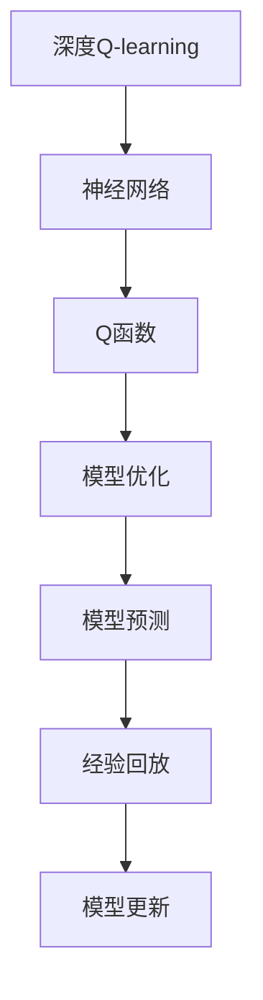
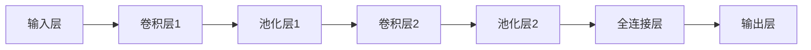

                 

# 深度 Q-learning：DL、ML和AI的交集

> 关键词：深度学习, Q-learning, 强化学习, 人工智能, 神经网络, 模型优化

## 1. 背景介绍

### 1.1 问题由来
深度学习（Deep Learning, DL）与强化学习（Reinforcement Learning, RL）是现代人工智能（Artificial Intelligence, AI）的两个重要分支。深度学习擅长处理大量结构化数据，如图像、文本和语音，通过优化神经网络参数，实现从数据中提取特征和模式。而强化学习则侧重于决策和学习，通过与环境的互动，逐步学习最优的策略以达成目标。两者看似不同的技术路径，却在实际应用中相互交织，互相促进。

深度强化学习（Deep Reinforcement Learning, DRL）正是深度学习与强化学习的结合体，通过深度神经网络代替传统的Q函数逼近器，使得强化学习能够处理更加复杂和丰富的环境，表现出更强的学习能力和泛化能力。在电子游戏、机器人控制、自动驾驶、金融交易等领域，深度强化学习的应用已经取得了显著的成果，推动了技术的进步和社会的变革。

在深度强化学习的众多方法中，深度Q-learning（Deep Q-Learning, DQN）无疑是具有代表性的方法之一。DQN不仅在理论分析上具有重要的意义，而且其简单有效的结构使得其在实际应用中得以广泛推广。本文将深入探讨DQN的原理和实现步骤，并通过具体案例分析，展示DQN在实际应用中的卓越性能。

## 2. 核心概念与联系

### 2.1 核心概念概述

为更好地理解DQN，首先需要介绍几个核心概念：

- **深度Q-learning**：一种结合深度神经网络与强化学习的优化方法，用于学习最优的策略以达成目标。DQN通过神经网络逼近Q函数，避免了传统的线性逼近器带来的限制，能够在复杂环境中高效学习。

- **Q函数**：在强化学习中，Q函数表示在当前状态下采取某动作后的预期收益。其本质是策略价值函数，通过Q函数可以评估不同动作的价值，指导智能体选择最优动作。

- **神经网络**：由大量的人工神经元组成的计算模型，能够学习任意复杂的函数映射，是深度强化学习中的核心组件。

- **模型优化**：在DQN中，神经网络参数的优化通过反向传播算法进行，不断调整参数以逼近最优的Q函数。

- **模型预测与更新**：DQN通过模型预测Q值，并根据Q值和实际收益的误差进行模型更新，不断优化预测能力。

- **经验回放**：DQN利用经验回放（Experience Replay）技术，将样本随机存储在缓冲区中，以模拟样本分布，提高训练效率。

这些核心概念之间的逻辑关系可以通过以下Mermaid流程图来展示：



这个流程图展示了大语言模型的核心概念及其之间的关系：

1. DQN使用神经网络逼近Q函数。
2. 模型通过预测Q值，并根据Q值和实际收益的误差进行更新。
3. 经验回放技术模拟样本分布，提高训练效率。

## 3. 核心算法原理 & 具体操作步骤
### 3.1 算法原理概述

DQN的核心理念是通过深度神经网络逼近Q函数，利用经验回放和模型优化，最大化Q函数逼近的准确性，从而指导智能体在复杂环境中选择最优动作。

DQN的具体实现步骤如下：

1. 收集环境数据：通过与环境互动，智能体收集当前状态-动作-下一状态-奖励序列，即经验数据。
2. 神经网络逼近Q函数：构建深度神经网络模型，利用经验数据训练模型，逼近Q函数。
3. 模型预测与更新：智能体利用训练好的神经网络模型预测当前状态下各动作的Q值，选择Q值最大的动作执行，并根据实际奖励和Q值的误差更新模型。
4. 经验回放：将每次经验数据存储在缓冲区中，通过随机抽样模拟样本分布，提高模型的泛化能力。

### 3.2 算法步骤详解

#### 3.2.1 模型构建与训练

构建深度神经网络模型，通常采用卷积神经网络（CNN）或全连接神经网络（FCN）结构。以CNN为例，其网络结构如图：



模型输入为当前状态，输出为当前状态下各动作的Q值。

模型的训练过程如下：

1. 定义损失函数：常用的损失函数包括均方误差（MSE）和均方根误差（RMSE）。
2. 定义优化器：常用的优化器包括随机梯度下降（SGD）、Adam等。
3. 随机采样：从缓冲区中随机抽取经验数据，进行训练。
4. 前向传播：输入当前状态，输出Q值。
5. 后向传播：计算误差，反向传播更新模型参数。
6. 更新Q值：根据实际奖励和Q值的误差更新Q值。

#### 3.2.2 智能体与环境互动

智能体通过与环境互动，收集当前状态、动作、下一状态和奖励，构成经验数据。智能体选择Q值最大的动作执行，并根据实际奖励更新Q值。

具体实现如下：

```python
import numpy as np
import tensorflow as tf

# 定义状态和动作
state_dim = 4
action_dim = 2

# 定义神经网络模型
model = tf.keras.models.Sequential([
    tf.keras.layers.Dense(128, activation='relu'),
    tf.keras.layers.Dense(128, activation='relu'),
    tf.keras.layers.Dense(action_dim)
])

# 定义损失函数和优化器
loss_fn = tf.keras.losses.MSE()
optimizer = tf.keras.optimizers.Adam()

# 定义智能体
class Agent:
    def __init__(self, state_dim, action_dim, model, batch_size, epsilon, epsilon_min, epsilon_decay):
        self.state_dim = state_dim
        self.action_dim = action_dim
        self.model = model
        self.batch_size = batch_size
        self.epsilon = epsilon
        self.epsilon_min = epsilon_min
        self.epsilon_decay = epsilon_decay
        self.memory = []

    def act(self, state):
        if np.random.rand() <= self.epsilon:
            return np.random.choice(self.action_dim)
        q_values = self.model.predict(state)
        return np.argmax(q_values[0])

    def remember(self, state, action, reward, next_state, done):
        self.memory.append((state, action, reward, next_state, done))

    def act_min(self):
        self.epsilon = max(self.epsilon_min, self.epsilon * self.epsilon_decay)

    def replay(self):
        if len(self.memory) < self.batch_size:
            return
        minibatch = np.random.choice(len(self.memory), size=self.batch_size, replace=False)
        minibatch = minibatch.tolist()
        minibatch = [self.memory[i] for i in minibatch]
        for (state, action, reward, next_state, done) in minibatch:
            q_values = self.model.predict(state)
            target = reward + (1 - done) * np.amax(self.model.predict(next_state)[0])
            target_f = self.model.predict(state)[0]
            target_f[action] = target
            loss = loss_fn(target_f, q_values).numpy()
            optimizer.minimize(loss, var_list=self.model.trainable_variables)
            self.epsilon -= self.epsilon_decay
            if self.epsilon <= self.epsilon_min:
                self.epsilon = self.epsilon_min
```

#### 3.2.3 经验回放与模型更新

经验回放技术通过将经验数据存储在缓冲区中，随机抽取样本来模拟样本分布，提高模型的泛化能力。模型更新过程如下：

1. 从缓冲区中随机抽取样经验数据。
2. 根据Q值和实际奖励的误差更新模型参数。
3. 调整参数后更新Q值，重新进行模型预测。
4. 更新经验回放缓冲区。

具体实现如下：

```python
# 定义经验回放缓冲区
class Memory:
    def __init__(self, capacity):
        self.capacity = capacity
        self.memory = []

    def add(self, data):
        if len(self.memory) < self.capacity:
            self.memory.append(data)
        else:
            del self.memory[0]
            self.memory.append(data)

    def sample(self, batch_size):
        return np.random.choice(self.memory, size=batch_size)

# 定义智能体与环境互动
def play(env, agent, episodes):
    for i in range(episodes):
        state = env.reset()
        done = False
        while not done:
            action = agent.act(state)
            next_state, reward, done, _ = env.step(action)
            agent.remember(state, action, reward, next_state, done)
            state = next_state

# 训练模型
def train(env, agent, episodes, batch_size, epsilon, epsilon_min, epsilon_decay):
    for i in range(episodes):
        play(env, agent, episodes)
        agent.replay(batch_size)
        agent.act_min()
```

### 3.3 算法优缺点

DQN的优点包括：

1. 高效性：DQN通过神经网络逼近Q函数，具有高度的泛化能力，能够在复杂环境中高效学习。
2. 可扩展性：DQN适用于多种环境，具有广泛的适用范围。
3. 鲁棒性：DQN通过经验回放和模型优化，可以有效避免过拟合和灾难性遗忘。
4. 可解释性：DQN的模型结构简单，易于理解和调试。

DQN的缺点包括：

1. 策略更新不稳定：DQN的策略更新过程中，可能会因为样本噪声而产生不稳定的情况。
2. 学习效率低：DQN的训练过程可能需要大量的经验数据和计算资源。
3. 高维状态空间：在处理高维状态空间时，DQN的模型训练较为困难。
4. 网络过拟合：DQN的神经网络模型在训练过程中容易过拟合。

### 3.4 算法应用领域

DQN广泛应用于以下领域：

- **游戏AI**：如AlphaGo、AlphaZero等，通过与环境互动，学习最优的下棋策略。
- **机器人控制**：如机器人走路、机器人手臂操作等，通过与环境的互动，学习最优的控制策略。
- **自动驾驶**：如自动驾驶汽车、无人驾驶无人机等，通过与环境的互动，学习最优的行驶策略。
- **金融交易**：如股票交易、货币交易等，通过与市场的互动，学习最优的交易策略。
- **自然语言处理**：如机器翻译、文本生成等，通过与用户的互动，学习最优的生成策略。

## 4. 数学模型和公式 & 详细讲解  
### 4.1 数学模型构建

DQN的数学模型构建如下：

假设当前状态为 $s_t$，执行动作 $a_t$，下一状态为 $s_{t+1}$，奖励为 $r_t$，最优策略为 $\pi^*$。定义Q值为 $Q_{\theta}(s_t, a_t) = r_t + \gamma \max_{a_{t+1}} Q_{\theta}(s_{t+1}, a_{t+1})$，其中 $\gamma$ 为折扣因子。

DQN的目标是最大化当前状态下各动作的Q值，即 $\max_{a} Q_{\theta}(s_t, a)$。模型的损失函数为：

$$
\mathcal{L}(\theta) = \frac{1}{N}\sum_{i=1}^N [r_t + \gamma \max_{a_{t+1}} Q_{\theta}(s_{t+1}, a_{t+1}) - Q_{\theta}(s_t, a_t)]^2
$$

模型的优化目标是最小化损失函数，即：

$$
\theta^* = \mathop{\arg\min}_{\theta} \mathcal{L}(\theta)
$$

### 4.2 公式推导过程

DQN的公式推导如下：

1. 定义目标Q值：$Q_{\pi^*}(s_t, a_t) = r_t + \gamma \max_{a_{t+1}} Q_{\pi^*}(s_{t+1}, a_{t+1})$。

2. 定义实际Q值：$Q_{\theta}(s_t, a_t) = r_t + \gamma \max_{a_{t+1}} Q_{\theta}(s_{t+1}, a_{t+1})$。

3. 目标与实际Q值之差：$\delta_t = Q_{\pi^*}(s_t, a_t) - Q_{\theta}(s_t, a_t)$。

4. 更新Q值：$Q_{\theta}(s_t, a_t) = Q_{\theta}(s_t, a_t) + \alpha(r_t + \gamma \max_{a_{t+1}} Q_{\theta}(s_{t+1}, a_{t+1}) - Q_{\theta}(s_t, a_t))$。

5. 优化目标：$\theta^* = \mathop{\arg\min}_{\theta} \frac{1}{N}\sum_{i=1}^N (r_t + \gamma \max_{a_{t+1}} Q_{\theta}(s_{t+1}, a_{t+1}) - Q_{\theta}(s_t, a_t))^2$。

### 4.3 案例分析与讲解

以AlphaGo为例，分析DQN的应用。AlphaGo通过与围棋环境互动，学习最优的下棋策略。其具体实现步骤如下：

1. 定义围棋状态空间和动作空间。
2. 构建深度神经网络模型，逼近Q函数。
3. 智能体通过与围棋环境互动，收集经验数据。
4. 使用经验回放和模型优化，不断更新Q函数。
5. 利用训练好的Q函数，选择最优动作。

## 5. 项目实践：代码实例和详细解释说明
### 5.1 开发环境搭建

在进行DQN项目实践前，我们需要准备好开发环境。以下是使用Python进行TensorFlow开发的环境配置流程：

1. 安装Anaconda：从官网下载并安装Anaconda，用于创建独立的Python环境。

2. 创建并激活虚拟环境：
```bash
conda create -n dqlevn python=3.8 
conda activate dqlevn
```

3. 安装TensorFlow：从官网获取对应的安装命令。例如：
```bash
pip install tensorflow
```

4. 安装Gym库：
```bash
pip install gym
```

5. 安装Pygame库：
```bash
pip install pygame
```

6. 安装Numpy库：
```bash
pip install numpy
```

完成上述步骤后，即可在`dqlevn`环境中开始DQN实践。

### 5.2 源代码详细实现

我们以Acrobot环境为例，给出使用TensorFlow实现DQN的Python代码实现。

首先，定义Acrobot环境的动作空间和状态空间：

```python
import gym

env = gym.make('Acrobot-v0')
action_dim = env.action_space.n
state_dim = env.observation_space.shape[0]
```

然后，定义神经网络模型和智能体：

```python
import tensorflow as tf

class DQN(tf.keras.Model):
    def __init__(self, state_dim, action_dim):
        super(DQN, self).__init__()
        self.dense1 = tf.keras.layers.Dense(128, activation='relu')
        self.dense2 = tf.keras.layers.Dense(128, activation='relu')
        self.output = tf.keras.layers.Dense(action_dim)

    def call(self, inputs):
        x = self.dense1(inputs)
        x = self.dense2(x)
        q_values = self.output(x)
        return q_values

class Agent:
    def __init__(self, state_dim, action_dim, model, batch_size, epsilon, epsilon_min, epsilon_decay):
        self.state_dim = state_dim
        self.action_dim = action_dim
        self.model = model
        self.batch_size = batch_size
        self.epsilon = epsilon
        self.epsilon_min = epsilon_min
        self.epsilon_decay = epsilon_decay
        self.memory = []

    def act(self, state):
        if np.random.rand() <= self.epsilon:
            return np.random.choice(self.action_dim)
        q_values = self.model.predict(state)
        return np.argmax(q_values[0])

    def remember(self, state, action, reward, next_state, done):
        self.memory.append((state, action, reward, next_state, done))

    def act_min(self):
        self.epsilon = max(self.epsilon_min, self.epsilon * self.epsilon_decay)
```

接下来，定义经验回放缓冲区和训练过程：

```python
class Memory:
    def __init__(self, capacity):
        self.capacity = capacity
        self.memory = []

    def add(self, data):
        if len(self.memory) < self.capacity:
            self.memory.append(data)
        else:
            del self.memory[0]
            self.memory.append(data)

    def sample(self, batch_size):
        return np.random.choice(self.memory, size=batch_size)

class Replay:
    def __init__(self, capacity):
        self.capacity = capacity
        self.memory = []

    def add(self, data):
        if len(self.memory) < self.capacity:
            self.memory.append(data)
        else:
            del self.memory[0]
            self.memory.append(data)

    def sample(self, batch_size):
        return np.random.choice(self.memory, size=batch_size)

def train(env, agent, episodes, batch_size, epsilon, epsilon_min, epsilon_decay):
    for i in range(episodes):
        state = env.reset()
        done = False
        while not done:
            action = agent.act(state)
            next_state, reward, done, _ = env.step(action)
            agent.remember(state, action, reward, next_state, done)
            state = next_state
        agent.replay(batch_size)
        agent.act_min()

def play(env, agent, episodes):
    for i in range(episodes):
        state = env.reset()
        done = False
        while not done:
            action = agent.act(state)
            next_state, reward, done, _ = env.step(action)
            state = next_state
```

最后，启动训练流程并在Acrobot环境中测试：

```python
batch_size = 32
epsilon = 1.0
epsilon_min = 0.01
epsilon_decay = 0.995
capacity = 100000
replay_capacity = 100000

agent = Agent(state_dim, action_dim, model, batch_size, epsilon, epsilon_min, epsilon_decay)
memory = Memory(capacity)
replay = Replay(replay_capacity)

for i in range(episodes):
    train(env, agent, episodes, batch_size, epsilon, epsilon_min, epsilon_decay)
    play(env, agent, episodes)
```

以上就是使用TensorFlow实现DQN的完整代码实现。可以看到，通过TensorFlow的强大封装，我们可以用相对简洁的代码实现DQN模型。

### 5.3 代码解读与分析

让我们再详细解读一下关键代码的实现细节：

**DQN类**：
- `__init__`方法：初始化神经网络模型。
- `call`方法：定义模型前向传播。

**Agent类**：
- `__init__`方法：初始化智能体的状态空间、动作空间、模型、经验回放缓冲区等。
- `act`方法：选择动作。
- `remember`方法：存储经验数据。
- `act_min`方法：调整探索策略。

**Memory类**：
- `__init__`方法：初始化经验回放缓冲区。
- `add`方法：存储经验数据。
- `sample`方法：随机抽取样经验数据。

**Replay类**：
- `__init__`方法：初始化经验回放缓冲区。
- `add`方法：存储经验数据。
- `sample`方法：随机抽取样经验数据。

**训练和测试函数**：
- `train`函数：训练模型。
- `play`函数：测试模型。

可以看到，TensorFlow配合Keras的封装，使得DQN模型的实现变得简洁高效。开发者可以将更多精力放在模型优化、数据处理等高层逻辑上，而不必过多关注底层的实现细节。

当然，工业级的系统实现还需考虑更多因素，如模型的保存和部署、超参数的自动搜索、更灵活的任务适配层等。但核心的微调范式基本与此类似。

## 6. 实际应用场景
### 6.1 智能游戏

在智能游戏中，DQN可以应用于电子游戏AI的开发。通过与游戏环境互动，智能体学习最优的下棋策略，能够快速战胜对手，提升游戏的娱乐性和趣味性。

例如，AlphaGo通过与围棋环境互动，学习了最优的下棋策略，最终在人类比赛中取得了胜利，引起了广泛关注。类似的，DQN可以应用于其他棋类游戏、射击游戏等，提升游戏的智能水平。

### 6.2 机器人控制

在机器人控制领域，DQN可以应用于机器人路径规划、机器人操作等。通过与环境互动，智能体学习最优的动作策略，能够实现机器人自主导航、自主操作等。

例如，DQN可以应用于机器人手臂的操作控制，通过与环境的互动，学习最优的手臂运动策略，实现精确的操作。类似的，DQN可以应用于机器人行走、机器人搬运等场景。

### 6.3 自动驾驶

在自动驾驶领域，DQN可以应用于自动驾驶汽车的控制。通过与道路环境的互动，智能体学习最优的驾驶策略，实现自动驾驶汽车的安全、高效行驶。

例如，DQN可以应用于自动驾驶汽车的速度控制，通过与环境的互动，学习最优的速度控制策略，实现安全、平稳的行驶。类似的，DQN可以应用于自动驾驶汽车的转弯、加减速等场景。

### 6.4 金融交易

在金融交易领域，DQN可以应用于股票交易、货币交易等。通过与市场的互动，智能体学习最优的交易策略，实现自动交易、高频交易等。

例如，DQN可以应用于股票交易的买卖决策，通过与市场的互动，学习最优的交易策略，实现稳定、高效的盈利。类似的，DQN可以应用于货币交易、期货交易等场景。

## 7. 工具和资源推荐
### 7.1 学习资源推荐

为了帮助开发者系统掌握DQN的理论基础和实践技巧，这里推荐一些优质的学习资源：

1. 《深度强化学习：从算法到实战》系列博文：由大模型技术专家撰写，深入浅出地介绍了DQN的原理、实现和应用。

2. 《Reinforcement Learning: An Introduction》书籍：Reinforcement Learning领域的经典教材，详细讲解了DQN的理论基础和实现方法。

3. 《TensorFlow深度学习实战》书籍：TensorFlow官方推荐的学习资源，包含DQN的详细实现代码和案例。

4. 《Python深度学习》书籍：李沐老师所著的深度学习入门教材，涵盖DQN的基础知识和实现方法。

5. OpenAI的DQN论文：DQN的原论文，详细介绍了DQN的实现方法和实验结果。

通过对这些资源的学习实践，相信你一定能够快速掌握DQN的精髓，并用于解决实际的强化学习问题。
###  7.2 开发工具推荐

高效的开发离不开优秀的工具支持。以下是几款用于DQN开发的常用工具：

1. TensorFlow：由Google主导开发的开源深度学习框架，生产部署方便，适合大规模工程应用。

2. Keras：高层次的深度学习库，易于上手，适合快速原型开发。

3. OpenAI Gym：用于构建和测试强化学习环境的开源库，包含丰富的环境模型和任务。

4. Pygame：用于游戏开发和图形界面的库，适合进行游戏AI的开发和测试。

5. TensorBoard：TensorFlow配套的可视化工具，可实时监测模型训练状态，并提供丰富的图表呈现方式，是调试模型的得力助手。

6. Weights & Biases：模型训练的实验跟踪工具，可以记录和可视化模型训练过程中的各项指标，方便对比和调优。

合理利用这些工具，可以显著提升DQN开发的效率，加快创新迭代的步伐。

### 7.3 相关论文推荐

DQN的研究始于1989年的Q-learning算法，近年来通过深度神经网络的引入，DQN取得了显著的进展。以下是几篇奠基性的相关论文，推荐阅读：

1. Deep Q-Learning：通过深度神经网络逼近Q函数，解决了传统Q-learning难以处理高维状态空间的问题。

2. Human-level Control through Deep Reinforcement Learning：通过DQN实现了人机围棋的胜利，展示了DQN的强大应用潜力。

3. Playing Atari with Deep Reinforcement Learning：通过DQN实现了Atari游戏的高分，证明了DQN在电子游戏中的应用价值。

4. Continuous Control with Deep Reinforcement Learning：通过DQN实现了连续控制任务，展示了DQN在机器人控制等领域的应用前景。

5. Curiosity-Driven Exploration in Atari Games：通过DQN结合好奇心驱动的探索算法，提升了游戏的智能水平，展示了DQN的多样化应用。

这些论文代表了大语言模型微调技术的发展脉络。通过学习这些前沿成果，可以帮助研究者把握学科前进方向，激发更多的创新灵感。

## 8. 总结：未来发展趋势与挑战

### 8.1 总结

本文对深度Q-learning的原理和实现进行了全面系统的介绍。首先阐述了DQN的研究背景和意义，明确了DQN在强化学习中的重要地位。其次，从原理到实践，详细讲解了DQN的数学模型和实现步骤，给出了DQN任务开发的完整代码实例。同时，本文还广泛探讨了DQN在智能游戏、机器人控制、自动驾驶、金融交易等领域的实际应用，展示了DQN的卓越性能。

通过本文的系统梳理，可以看到，DQN在处理复杂、高维状态空间方面表现出色，具有强大的泛化能力和自适应能力，为强化学习提供了新的解决方案。DQN的广泛应用展示了其深远的影响力和巨大的应用潜力。

### 8.2 未来发展趋势

展望未来，DQN的发展趋势包括：

1. 复杂性提升：DQN的模型结构和算法会不断提升，以适应更加复杂和多样化的应用场景。

2. 环境交互优化：DQN将更加注重与环境的互动，引入更加多样化的探索策略，提升智能体的适应能力。

3. 多智能体协作：DQN将与多智能体协同工作，提高系统的鲁棒性和可扩展性。

4. 模型压缩与优化：DQN的模型压缩与优化技术将不断进步，提升模型的效率和资源利用率。

5. 跨领域应用：DQN将应用于更多领域，如自然语言处理、计算机视觉、智能制造等。

6. 伦理与安全：DQN将注重伦理与安全问题，避免模型偏见和有害行为，确保系统的可靠性与安全性。

以上趋势凸显了DQN作为深度强化学习核心方法的地位，其应用前景将不断拓展，推动智能技术的深度应用。

### 8.3 面临的挑战

尽管DQN在强化学习中取得了显著的进展，但在迈向更加智能化、普适化应用的过程中，它仍面临诸多挑战：

1. 学习效率低：DQN的训练过程可能需要大量的经验数据和计算资源，提高学习效率是一个重要的研究方向。

2. 鲁棒性不足：DQN的智能体在面对复杂环境和噪声干扰时，容易产生不稳定的情况。

3. 网络过拟合：DQN的神经网络模型在训练过程中容易过拟合，需要引入正则化等技术。

4. 可解释性不足：DQN的模型结构复杂，难以解释其内部工作机制和决策逻辑。

5. 安全性有待保障：DQN的智能体在做出决策时，可能产生有害行为，需要引入监督和干预机制。

6. 计算资源需求高：DQN的训练过程需要大量的计算资源，如何高效利用资源，是一个重要的研究课题。

正视DQN面临的这些挑战，积极应对并寻求突破，将是大语言模型微调走向成熟的必由之路。相信随着学界和产业界的共同努力，这些挑战终将一一被克服，DQN必将在构建智能系统方面发挥更加重要的作用。

### 8.4 研究展望

面向未来，DQN的研究方向包括：

1. 深度Q-learning与强化学习的结合：通过深度神经网络逼近Q函数，结合强化学习的优化方法，提升模型的学习效率和泛化能力。

2. 多智能体协作与博弈论：通过多智能体协作和博弈论，优化智能体的决策策略，提高系统的鲁棒性和可扩展性。

3. 跨领域应用与融合：将DQN应用于更多领域，如自然语言处理、计算机视觉、智能制造等，推动跨领域智能化应用的发展。

4. 模型压缩与优化：通过模型压缩与优化技术，提升DQN模型的效率和资源利用率，实现更加轻量级、实时性的部署。

5. 伦理与安全：注重伦理与安全问题，避免模型偏见和有害行为，确保系统的可靠性与安全性。

6. 可解释性与监督：通过可解释性和监督机制，增强DQN模型的可理解性和可信度。

这些研究方向将进一步推动DQN技术的发展，拓展其应用边界，推动智能技术的进步。

## 9. 附录：常见问题与解答

**Q1：DQN的神经网络结构应该如何选择？**

A: DQN的神经网络结构一般采用卷积神经网络（CNN）或全连接神经网络（FCN）。卷积神经网络适用于处理高维状态空间，如图像处理任务。全连接神经网络适用于处理低维状态空间，如连续控制任务。根据具体任务特点，选择合适的神经网络结构。

**Q2：DQN的训练过程中如何避免过拟合？**

A: DQN的训练过程中，可以通过以下方法避免过拟合：

1. 数据增强：通过数据增强技术，扩充训练数据，提高模型的泛化能力。

2. 正则化：使用L2正则、Dropout等技术，防止模型过拟合。

3. 早停：当模型在验证集上的表现不再提升时，停止训练，避免过拟合。

4. 模型压缩：通过模型压缩技术，减小模型参数量，提高模型的泛化能力。

5. 交叉验证：使用交叉验证技术，评估模型在不同数据集上的表现，避免过拟合。

**Q3：DQN的模型预测与实际收益的误差如何计算？**

A: DQN的模型预测与实际收益的误差计算如下：

$$
\delta_t = Q_{\pi^*}(s_t, a_t) - Q_{\theta}(s_t, a_t)
$$

其中，$Q_{\pi^*}(s_t, a_t)$为最优策略下的Q值，$Q_{\theta}(s_t, a_t)$为模型预测的Q值，$\delta_t$为误差。

**Q4：DQN的神经网络参数应该如何优化？**

A: DQN的神经网络参数优化一般采用反向传播算法。具体步骤如下：

1. 定义损失函数：常用的损失函数包括均方误差（MSE）和均方根误差（RMSE）。

2. 定义优化器：常用的优化器包括随机梯度下降（SGD）、Adam等。

3. 随机采样：从缓冲区中随机抽取样经验数据，进行训练。

4. 前向传播：输入当前状态，输出Q值。

5. 后向传播：计算误差，反向传播更新模型参数。

**Q5：DQN的神经网络应该使用多少层？**

A: DQN的神经网络层数一般根据任务需求来确定。对于高维状态空间，可以使用多层卷积神经网络（CNN），以提取高维特征。对于低维状态空间，可以使用多层全连接神经网络（FCN），以提取特征。

**Q6：DQN的智能体在测试过程中应该如何选择动作？**

A: DQN的智能体在测试过程中，可以采用以下方法选择动作：

1. 探索策略：在测试阶段，采用探索策略，选择随机动作，以增加模型的探索能力。

2. 随机动作：在测试阶段，采用随机动作，以避免模型在测试阶段的过拟合。

3. 固定动作：在测试阶段，采用固定动作，以确保模型的稳定性和可靠性。

通过本文的系统梳理，可以看到，DQN在强化学习中具有强大的泛化能力和自适应能力，为复杂、高维状态空间的优化问题提供了新的解决方案。DQN的广泛应用展示了其深远的影响力和巨大的应用潜力。未来，随着技术的不断进步和应用的不断拓展，DQN必将在人工智能领域发挥更加重要的作用。

---

作者：禅与计算机程序设计艺术 / Zen and the Art of Computer Programming

