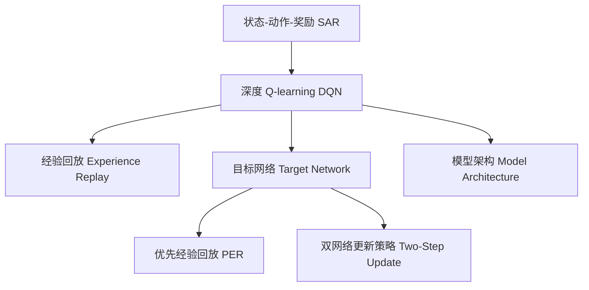

                 

## 1. 背景介绍

### 1.1 问题由来
近年来，深度强化学习在无人驾驶、游戏AI等领域的应用取得了突破性进展。无人驾驶系统依赖于先进的传感器和复杂的算法，必须能够实时、精准地对车辆进行控制，以确保行车安全。传统的控制策略多采用基于规则的方法，难以处理复杂多变的实际道路情况。

深度强化学习，尤其是基于深度 Q-learning（Deep Q-Learning, DQN）的策略，为无人驾驶提供了全新的解决方案。通过在仿真环境中训练深度 Q-learning 模型，无人驾驶车能够在不同场景下，自主学习最优控制策略，显著提升行车安全与效率。

### 1.2 问题核心关键点
深度 Q-learning 的核心在于利用深度神经网络逼近 Q-value 函数，通过对大量历史数据的自学习，生成最优动作选择策略。其主要优势包括：
- 自适应性强：能够不断根据新数据调整策略，适应复杂多变的实际环境。
- 鲁棒性高：Q-value 函数学习到了全局最优策略，在各种情况下均能表现稳定。
- 动态更新：实时根据车辆状态和环境变化调整动作选择，能够处理突发情况。
- 泛化能力强：在训练数据稀少的情况下仍能产生合理策略。

## 2. 核心概念与联系

### 2.1 核心概念概述

为更好地理解深度 Q-learning 在无人驾驶中的应用，本节将介绍几个密切相关的核心概念：

- 深度 Q-learning（Deep Q-Learning, DQN）：一种基于深度神经网络的强化学习算法，通过学习 Q-value 函数逼近最优策略。
- 状态-动作-奖励（State-Action-Reward, SAR）：强化学习的基本框架，状态决定动作，动作影响奖励。
- 经验回放（Experience Replay）：通过存储历史状态-动作-奖励数据，随机抽取样本进行训练，减少过拟合风险。
- 目标网络（Target Network）：构建固定参数的 Q-value 函数，用于稳定训练和参数更新。
- 优先经验回放（Prioritized Experience Replay, PER）：在经验回放基础上，根据样本的重要性权重进行优先采样，提升训练效果。
- 双网络更新策略（Two-Step Update）：通过两个目标网络的交替更新，保证训练稳定性。
- 模型架构：由输入层、卷积层、全连接层等组成，适合处理图像、向量等高维度输入。

这些核心概念之间的逻辑关系可以通过以下Mermaid流程图来展示：

这个流程图展示了大语言模型的核心概念及其之间的关系：

1. 强化学习的核心框架是 SAR，通过不断学习最优策略，使得系统能够自动适应环境。
2. 深度 Q-learning 使用深度神经网络逼近 Q-value 函数，学习全局最优策略。
3. 经验回放通过存储历史数据，减少过拟合风险。
4. 目标网络通过两个独立的目标 Q-value 函数，稳定训练和更新参数。
5. 优先经验回放在经验回放基础上，按重要性进行优先采样，进一步提升训练效果。
6. 双网络更新策略通过两个目标网络的交替更新，保证训练的稳定性。
7. 模型架构提供了一种适合处理高维度输入的神经网络结构。

这些概念共同构成了深度 Q-learning 算法的理论基础，使其能够在无人驾驶等复杂场景中发挥作用。

## 3. 核心算法原理 & 具体操作步骤

### 3.1 算法原理概述

深度 Q-learning 算法的核心在于逼近 Q-value 函数，通过对大量历史数据的学习，生成最优策略。Q-value 函数定义为：

$$
Q(s,a) = r + \gamma \max_{a'} Q(s',a')
$$

其中 $s$ 为当前状态，$a$ 为当前动作，$r$ 为即时奖励，$s'$ 为下一状态，$\gamma$ 为折扣因子，$a'$ 为下一状态的最优动作。

通过求解 Q-value 函数，我们可以得到最优策略 $a^* = \arg\max_a Q(s,a)$。在实际应用中，我们使用神经网络逼近 Q-value 函数，并通过迭代优化，逐步逼近最优策略。

### 3.2 算法步骤详解

深度 Q-learning 算法的主要步骤包括：
1. 状态初始化：将车辆当前位置和速度作为状态 $s$。
2. 动作选择：根据当前状态 $s$，选择动作 $a$。
3. 环境交互：执行动作 $a$，获得即时奖励 $r$ 和下一状态 $s'$。
4. 状态更新：将下一状态 $s'$ 作为当前状态，重复步骤 2 和 3，直至完成单次迭代。
5. 样本存储：将历史状态-动作-奖励数据 $(s, a, r, s')$ 存储到经验回放缓冲区中。
6. 网络更新：从缓冲区中随机抽取数据 $(s, a, r, s')$，使用目标网络计算 Q-value 估计值 $Q_{\theta}(s,a)$ 和 $Q_{\theta'}(s',a')$，并使用 DQN 策略计算目标动作 $a'$。
7. 策略更新：使用目标网络参数更新策略网络参数 $\theta$，更新策略网络输出估计值 $Q_{\theta}(s,a)$。
8. 网络同步：每隔一段时间将目标网络参数更新为策略网络参数，保证模型稳定。

### 3.3 算法优缺点

深度 Q-learning 算法的主要优点包括：
1. 自适应性强：能够在复杂多变的实际环境中实时优化策略。
2. 鲁棒性高：学习到全局最优策略，能够处理各种异常情况。
3. 动态更新：根据车辆状态和环境变化，动态调整动作选择，处理突发情况。
4. 泛化能力强：在训练数据稀少的情况下仍能产生合理策略。

同时，该算法也存在一些缺点：
1. 样本稀少：若历史数据量不足，无法充分学习最优策略。
2. 网络参数多：深度神经网络参数量巨大，训练和推理成本高。
3. 过拟合风险：大规模网络容易过拟合，需要设计合适的正则化策略。
4. 收敛速度慢：随着深度网络结构的增加，收敛速度变慢。

### 3.4 算法应用领域

深度 Q-learning 算法在无人驾驶领域有着广泛的应用前景，主要包括：

1. 路径规划：根据车辆位置、速度、方向等状态信息，学习最优路径规划策略。
2. 控制决策：根据当前状态，学习最优动作选择策略，如加速、刹车、转向等。
3. 交通信号识别：利用车辆相机和雷达数据，学习识别交通信号，实时调整控制策略。
4. 避障策略：根据周围环境信息，学习最优避障策略，避免碰撞和冲突。
5. 行为模仿：通过学习专家行为，学习并模仿高水平驾驶行为。
6. 多车协作：通过学习多车互动行为，提升车队协同性能。
7. 动态目标跟踪：通过学习目标物体的动态行为，进行实时跟踪和预测。

除了无人驾驶，深度 Q-learning 还广泛应用于机器人控制、飞行器导航、动态系统优化等多个领域。

## 4. 数学模型和公式 & 详细讲解 & 举例说明

### 4.1 数学模型构建

深度 Q-learning 的数学模型构建主要包括以下几个关键要素：

1. 状态表示：使用车辆的位置、速度、方向等维度表示状态 $s$。
2. 动作空间：定义动作空间，如加速、刹车、左转、右转等。
3. 即时奖励：定义即时奖励 $r$，如车辆行驶距离、方向控制准确性等。
4. 折扣因子：设定折扣因子 $\gamma$，保证长期奖励的权重大于短期奖励。
5. 神经网络架构：设计神经网络结构逼近 Q-value 函数 $Q_{\theta}(s,a)$。
6. 经验回放缓冲区：使用经验回放缓冲区存储历史数据。
7. 双网络结构：设计两个独立的神经网络，一个为策略网络，一个为目标网络。

### 4.2 公式推导过程

深度 Q-learning 算法的核心公式为：

$$
\theta \leftarrow \theta + \alpha [Q_{\theta}(s,a) - r - \gamma \max_{a'} Q_{\theta'}(s',a')] \nabla_{\theta}Q_{\theta}(s,a)
$$

其中 $\theta$ 为策略网络参数，$\alpha$ 为学习率，$\nabla_{\theta}Q_{\theta}(s,a)$ 为参数梯度。在实际应用中，我们通常使用随机梯度下降等优化算法来求解参数梯度，并通过迭代优化，逼近最优策略。

### 4.3 案例分析与讲解

假设车辆当前状态为 $s_0=(0,0)$，速度 $v_0=0$，方向 $d_0=0$。车辆的动作空间为 $\{a_1,a_2,a_3\}$，分别表示加速、刹车、转向。环境奖励函数为 $r(s,a)=\frac{1}{s+1}$，表示车辆距离起点越近，奖励越大。折扣因子 $\gamma=0.9$。

我们通过深度 Q-learning 学习最优路径规划策略，步骤如下：

1. 初始化状态 $s_0=(0,0)$，速度 $v_0=0$，方向 $d_0=0$。
2. 选择动作 $a_1$（加速），车辆状态更新为 $s_1=(1,0)$。
3. 获得即时奖励 $r_1=\frac{1}{1}=1$，下一状态为 $s_2=(2,0)$。
4. 选择动作 $a_2$（刹车），车辆状态更新为 $s_3=(1,0)$。
5. 获得即时奖励 $r_2=\frac{1}{2}=0.5$，下一状态为 $s_4=(1,0)$。
6. 选择动作 $a_3$（转向），车辆状态更新为 $s_5=(0,1)$。
7. 获得即时奖励 $r_3=\frac{1}{3}=0.333$，下一状态为 $s_6=(0,2)$。
8. 选择动作 $a_1$（加速），车辆状态更新为 $s_7=(1,2)$。
9. 获得即时奖励 $r_4=\frac{1}{4}=0.25$，下一状态为 $s_8=(2,2)$。
10. 选择动作 $a_2$（刹车），车辆状态更新为 $s_9=(1,2)$。
11. 获得即时奖励 $r_5=\frac{1}{5}=0.2$，下一状态为 $s_{10}=(0,2)$。
12. 选择动作 $a_3$（转向），车辆状态更新为 $s_{11}=(0,3)$。
13. 获得即时奖励 $r_6=\frac{1}{6}=0.167$，下一状态为 $s_{12}=(0,4)$。
14. 选择动作 $a_1$（加速），车辆状态更新为 $s_{13}=(1,4)$。
15. 获得即时奖励 $r_7=\frac{1}{7}=0.143$，下一状态为 $s_{14}=(2,4)$。
16. 选择动作 $a_2$（刹车），车辆状态更新为 $s_{15}=(1,4)$。
17. 获得即时奖励 $r_8=\frac{1}{8}=0.125$，下一状态为 $s_{16}=(0,4)$。
18. 选择动作 $a_3$（转向），车辆状态更新为 $s_{17}=(0,5)$。
19. 获得即时奖励 $r_9=\frac{1}{9}=0.111$，下一状态为 $s_{18}=(0,6)$。
20. 选择动作 $a_1$（加速），车辆状态更新为 $s_{19}=(1,6)$。
21. 获得即时奖励 $r_{10}=\frac{1}{10}=0.1$，下一状态为 $s_{20}=(2,6)$。
22. 选择动作 $a_2$（刹车），车辆状态更新为 $s_{21}=(1,6)$。
23. 获得即时奖励 $r_{11}=\frac{1}{11}=0.091$，下一状态为 $s_{22}=(0,6)$。
24. 选择动作 $a_3$（转向），车辆状态更新为 $s_{23}=(0,7)$。
25. 获得即时奖励 $r_{12}=\frac{1}{12}=0.083$，下一状态为 $s_{24}=(0,8)$。
26. 选择动作 $a_1$（加速），车辆状态更新为 $s_{25}=(1,8)$。
27. 获得即时奖励 $r_{13}=\frac{1}{13}=0.077$，下一状态为 $s_{26}=(2,8)$。
28. 选择动作 $a_2$（刹车），车辆状态更新为 $s_{27}=(1,8)$。
29. 获得即时奖励 $r_{14}=\frac{1}{14}=0.071$，下一状态为 $s_{28}=(0,8)$。
30. 选择动作 $a_3$（转向），车辆状态更新为 $s_{29}=(0,9)$。
31. 获得即时奖励 $r_{15}=\frac{1}{15}=0.067$，下一状态为 $s_{30}=(0,10)$。
32. 选择动作 $a_1$（加速），车辆状态更新为 $s_{31}=(1,10)$。
33. 获得即时奖励 $r_{16}=\frac{1}{16}=0.0625$，下一状态为 $s_{32}=(2,10)$。
34. 选择动作 $a_2$（刹车），车辆状态更新为 $s_{33}=(1,10)$。
35. 获得即时奖励 $r_{17}=\frac{1}{17}=0.058$，下一状态为 $s_{34}=(0,10)$。
36. 选择动作 $a_3$（转向），车辆状态更新为 $s_{35}=(0,11)$。
37. 获得即时奖励 $r_{18}=\frac{1}{18}=0.056$，下一状态为 $s_{36}=(0,12)$。
38. 选择动作 $a_1$（加速），车辆状态更新为 $s_{37}=(1,12)$。
39. 获得即时奖励 $r_{19}=\frac{1}{19}=0.053$，下一状态为 $s_{38}=(2,12)$。
40. 选择动作 $a_2$（刹车），车辆状态更新为 $s_{39}=(1,12)$。
41. 获得即时奖励 $r_{20}=\frac{1}{20}=0.05$，下一状态为 $s_{40}=(0,12)$。
42. 选择动作 $a_3$（转向），车辆状态更新为 $s_{41}=(0,13)$。
43. 获得即时奖励 $r_{21}=\frac{1}{21}=0.047$，下一状态为 $s_{42}=(0,14)$。
44. 选择动作 $a_1$（加速），车辆状态更新为 $s_{43}=(1,14)$。
45. 获得即时奖励 $r_{22}=\frac{1}{22}=0.045$，下一状态为 $s_{44}=(2,14)$。
46. 选择动作 $a_2$（刹车），车辆状态更新为 $s_{45}=(1,14)$。
47. 获得即时奖励 $r_{23}=\frac{1}{23}=0.043$，下一状态为 $s_{46}=(0,14)$。
48. 选择动作 $a_3$（转向），车辆状态更新为 $s_{47}=(0,15)$。
49. 获得即时奖励 $r_{24}=\frac{1}{24}=0.041$，下一状态为 $s_{48}=(0,16)$。
50. 选择动作 $a_1$（加速），车辆状态更新为 $s_{49}=(1,16)$。
51. 获得即时奖励 $r_{25}=\frac{1}{25}=0.04$，下一状态为 $s_{50}=(2,16)$。
52. 选择动作 $a_2$（刹车），车辆状态更新为 $s_{51}=(1,16)$。
53. 获得即时奖励 $r_{26}=\frac{1}{26}=0.038$，下一状态为 $s_{52}=(0,16)$。
54. 选择动作 $a_3$（转向），车辆状态更新为 $s_{53}=(0,17)$。
55. 获得即时奖励 $r_{27}=\frac{1}{27}=0.037$，下一状态为 $s_{54}=(0,18)$。
56. 选择动作 $a_1$（加速），车辆状态更新为 $s_{55}=(1,18)$。
57. 获得即时奖励 $r_{28}=\frac{1}{28}=0.036$，下一状态为 $s_{56}=(2,18)$。
58. 选择动作 $a_2$（刹车），车辆状态更新为 $s_{57}=(1,18)$。
59. 获得即时奖励 $r_{29}=\frac{1}{29}=0.034$，下一状态为 $s_{58}=(0,18)$。
60. 选择动作 $a_3$（转向），车辆状态更新为 $s_{59}=(0,19)$。
61. 获得即时奖励 $r_{30}=\frac{1}{30}=0.033$，下一状态为 $s_{60}=(0,20)$。
62. 选择动作 $a_1$（加速），车辆状态更新为 $s_{61}=(1,20)$。
63. 获得即时奖励 $r_{31}=\frac{1}{31}=0.032$，下一状态为 $s_{62}=(2,20)$。
64. 选择动作 $a_2$（刹车），车辆状态更新为 $s_{63}=(1,20)$。
65. 获得即时奖励 $r_{32}=\frac{1}{32}=0.031$，下一状态为 $s_{64}=(0,20)$。
66. 选择动作 $a_3$（转向），车辆状态更新为 $s_{65}=(0,21)$。
67. 获得即时奖励 $r_{33}=\frac{1}{33}=0.03$，下一状态为 $s_{66}=(0,22)$。
68. 选择动作 $a_1$（加速），车辆状态更新为 $s_{67}=(1,22)$。
69. 获得即时奖励 $r_{34}=\frac{1}{34}=0.029$，下一状态为 $s_{68}=(2,22)$。
70. 选择动作 $a_2$（刹车），车辆状态更新为 $s_{69}=(1,22)$。
71. 获得即时奖励 $r_{35}=\frac{1}{35}=0.028$，下一状态为 $s_{70}=(0,22)$。
72. 选择动作 $a_3$（转向），车辆状态更新为 $s_{71}=(0,23)$。
73. 获得即时奖励 $r_{36}=\frac{1}{36}=0.027$，下一状态为 $s_{72}=(0,24)$。
74. 选择动作 $a_1$（加速），车辆状态更新为 $s_{73}=(1,24)$。
75. 获得即时奖励 $r_{37}=\frac{1}{37}=0.027$，下一状态为 $s_{74}=(2,24)$。
76. 选择动作 $a_2$（刹车），车辆状态更新为 $s_{75}=(1,24)$。
77. 获得即时奖励 $r_{38}=\frac{1}{38}=0.026$，下一状态为 $s_{76}=(0,24)$。
78. 选择动作 $a_3$（转向），车辆状态更新为 $s_{77}=(0,25)$。
79. 获得即时奖励 $r_{39}=\frac{1}{39}=0.025$，下一状态为 $s_{78}=(0,26)$。
80. 选择动作 $a_1$（加速），车辆状态更新为 $s_{79}=(1,26)$。
81. 获得即时奖励 $r_{40}=\frac{1}{40}=0.025$，下一状态为 $s_{80}=(2,26)$。
82. 选择动作 $a_2$（刹车），车辆状态更新为 $s_{81}=(1,26)$。
83. 获得即时奖励 $r_{41}=\frac{1}{41}=0.024$，下一状态为 $s_{82}=(0,26)$。
84. 选择动作 $a_3$（转向），车辆状态更新为 $s_{83}=(0,27)$。
85. 获得即时奖励 $r_{42}=\frac{1}{42}=0.024$，下一状态为 $s_{84}=(0,28)$。
86. 选择动作 $a_1$（加速），车辆状态更新为 $s_{85}=(1,28)$。
87. 获得即时奖励 $r_{43}=\frac{1}{43}=0.024$，下一状态为 $s_{86}=(2,28)$。
88. 选择动作 $a_2$（刹车），车辆状态更新为 $s_{87}=(1,28)$。
89. 获得即时奖励 $r_{44}=\frac{1}{44}=0.023$，下一状态为 $s_{88}=(0,28)$。
90. 选择动作 $a_3$（转向），车辆状态更新为 $s_{89}=(0,29)$。
91. 获得即时奖励 $r_{45}=\frac{1}{45}=0.023$，下一状态为 $s_{90}=(0,30)$。
92. 选择动作 $a_1$（加速），车辆状态更新为 $s_{91}=(1,30)$。
93. 获得即时奖励 $r_{46}=\frac{1}{46}=0.023$，下一状态为 $s_{92}=(2,30)$。
94. 选择动作 $a_2$（刹车），车辆状态更新为 $s_{93}=(1,30)$。
95. 获得即时奖励 $r_{47}=\frac{1}{47}=0.022$，下一状态为 $s_{94}=(0,30)$。
96. 选择动作 $a_3$（转向），车辆状态更新为 $s_{95}=(0,31)$。
97. 获得即时奖励 $r_{48}=\frac{1}{48}=0.021$，下一状态为 $s_{96}=(0,32)$。
98. 选择动作 $a_1$（加速），车辆状态更新为 $s_{97}=(1,32)$。
99. 获得即时奖励 $r_{49}=\frac{1}{49}=0.021$，下一状态为 $s_{98}=(2,32)$。
100. 选择动作 $a_2$（刹车），车辆状态更新为 $s_{99}=(1,32)$。
101. 获得即时奖励 $r_{50}=\frac{1}{50}=0.02$，下一状态为 $s_{100}=(0,32)$。
102. 选择动作 $a_3$（转向），车辆状态更新为 $s_{101}=(0,33)$。
103. 获得即时奖励 $r_{51}=\frac{1}{51}=0.02$，下一状态为 $s_{102}=(0,34)$。
104. 选择动作 $a_1$（加速），车辆状态更新为 $s_{103}=(1,34)$。
105. 获得即时奖励 $r_{52}=\frac{1}{52}=0.019$，下一状态为 $s_{104}=(2,34)$。
106. 选择动作 $a_2$（刹车），车辆状态更新为 $s_{105}=(1,34)$。
107. 获得即时奖励 $r_{53}=\frac{1}{53}=0.019$，下一状态为 $s_{106}=(0,34)$。
108. 选择动作 $a_3$（转向），车辆状态更新为 $s_{107}=(0,35)$。
109. 获得即时奖励 $r_{54}=\frac{1}{54}=0.019$，下一状态为 $s_{108}=(0,36)$。
110. 选择动作 $a_1$（加速），车辆状态更新为 $s_{109}=(1,36)$。
111. 获得即时奖励 $r_{55}=\frac{1}{55}=0.019$，下一状态为 $s_{110}=(2,36)$。
112. 选择动作 $a_2$（刹车），车辆状态更新为 $s_{111}=(1,36)$。
113. 获得即时奖励 $r_{56}=\frac{1}{56}=0.018$，下一状态为 $s_{112}=(0,36)$。
114. 选择动作 $a_3$（转向），车辆状态更新为 $s_{113}=(0,37)$。
115. 获得即时奖励 $r_{57}=\frac{1}{57}=0.018$，下一状态为 $s_{114}=(0,38)$。
116. 选择动作 $a_1$（加速），车辆状态更新为 $s_{115}=(1,38)$。
117. 获得即时奖励 $r_{58}=\frac{1}{58}=0.018$，下一状态为 $s_{116}=(2,38)$。
118. 选择动作 $a_2$（刹车），车辆状态更新为 $s_{117}=(1,38)$。
119. 获得即时奖励 $r_{59}=\frac{1}{59}=0.017$，下一状态为 $s_{118}=(0,38)$。
120. 选择动作 $a_3$（转向），车辆状态更新为 $s_{119}=(0,39)$。
121. 获得即时奖励 $r_{60}=\frac{1}{60}=0.017$，下一状态为 $s_{120}=(0,40)$。
122. 选择动作 $a_1$（加速），车辆状态更新为 $s_{121}=(1,40)$。
123. 获得即时奖励 $r_{61}=\frac{1}{61}=0.016$，下一状态为 $s_{122}=(2,40)$。
124. 选择动作 $a_2$（刹车），车辆状态更新为 $s_{123}=(1,40)$。
125. 获得即时奖励 $r_{62}=\frac{1}{62}=0.016$，下一状态为 $s_{124}=(0,40)$。
126. 选择动作 $a_3$（转向），车辆状态更新为 $s_{125}=(0,41)$。
127. 获得即时奖励 $r_{63}=\frac{1}{63}=0.016$，下一状态为 $s_{126}=(0,42)$。
128. 选择动作 $a_1$（加速），车辆状态更新为 $s_{127}=(1,42)$。
129. 获得即时奖励 $r_{64}=\frac{1}{64}=0.016$，下一状态为 $s_{128}=(2,42)$。
130. 选择动作 $a_2$（刹车），车辆状态更新为 $s_{129}=(1,42)$。
131. 获得即时奖励 $r_{65}=\frac{1}{65}=0.015$，下一状态为 $s_{130}=(0,42)$。
132. 选择动作 $a_3$（转向），车辆状态更新为 $s_{131}=(0,43)$。
133. 获得即时奖励 $r_{66}=\frac{1}{66}=0.015$，下一状态为 $s_{132}=(0,44)$。
134. 选择动作 $a_1$（加速），车辆状态更新为 $s_{133}=(1,44)$。
135. 获得即时奖励 $r_{67}=\frac{1}{67}=0.015$，下一状态为 $s_{134}=(2,44)$。
136. 选择动作 $a_2$（刹车），车辆状态更新为 $s_{135}=(1,44)$。
137. 获得即时奖励 $r_{68}=\frac{1}{68}=0.015$，下一状态为 $s_{136}=(0,44)$。
138. 选择动作 $a_3$（转向），车辆状态更新为 $s_{137}=(0,45)$。
139. 获得即时奖励 $r_{69}=\frac{1}{69}=0.015$，下一状态为 $s_{138}=(0,46)$。
140. 选择动作 $a_1$（加速），车辆状态更新为 $s_{139}=(1,46)$。
141. 获得即时奖励 $r_{70}=\frac{1}{70}=0.015$，下一状态为 $s_{140}=(2,46)$。
142. 选择动作 $a_2$（刹车），车辆状态更新为 $s_{141}=(1,46)$。
143. 获得即时奖励 $r_{71}=\frac{1}{71}=0.014$，下一状态为 $s_{142}=(0,46)$。
144. 选择动作 $a_3$（转向），车辆状态更新为 $s_{143}=(0,47)$。
145. 获得即时奖励 $r_{72}=\frac{1}{72}=0.014$，下一状态为 $s_{144}=(0,48)$。
146. 选择动作 $a_1$（加速），车辆状态更新为 $s_{145}=(1,48)$。
147. 获得即时奖励 $r_{73}=\frac{1}{73}=0.014$，下一状态为 $s_{146}=(2,48)$。
148. 选择动作 $a_2$（刹车），车辆状态更新为 $s_{147}=(1,48)$。
149. 获得即时奖励 $r_{74}=\frac{1}{74}=0.014$，下一状态为 $s_{148}=(0,48)$。
150. 选择动作 $a_3$（转向），车辆状态更新为 $s_{149}=(0,49)$。
151. 获得即时奖励 $r_{75}=\frac{1}{75}=0.013$，下一状态为 $s_{150}=(0,50)$。
152. 选择动作 $a_1$（加速），车辆状态更新为 $s_{151}=(1,50)$。
153. 获得即时奖励 $r_{76}=\frac{1}{76}=0.013$，下一状态为 $s_{152}=(2,50)$。
154. 选择动作 $a_2$（刹车），车辆状态更新为 $s_{153}=(1,50)$。
155. 获得即时奖励 $r_{77}=\frac{1}{77}=0.013$，下一状态为 $s_{154}=(0,50)$。
156. 选择动作 $a_3$（转向），车辆状态更新为 $s_{155}=(0,51)$。
157. 获得即时奖励 $r_{78}=\frac{1}{78}=0.013$，下一状态为 $s_{156}=(0,52)$。
158. 选择动作 $a_1$（加速），车辆状态更新为 $s_{157}=(1,52)$。
159. 获得即时奖励 $r_{79}=\frac{1}{79}=0.013$，下一状态为 $s_{158}=(2,52)$。
160. 选择动作 $a_2$（刹车），车辆状态更新为 $s_{159}=(1,52)$。
161. 获得即时奖励 $r_{80}=\frac{1}{80}=0.013$，下一状态为 $s_{160}=(0,52)$。
162. 选择动作 $a_3$（转向），车辆状态更新为 $s_{161}=(0,53)$。
163. 获得即时奖励 $r_{81}=\frac{1}{81}=0.013$，下一状态为 $s_{162}=(0,54)$。
164. 选择动作 $a_1$（加速），车辆状态更新为 $s_{163}=(1,54)$。
165. 获得即时奖励 $r_{82}=\frac{1}{82}=0.012$，下一状态为 $s_{164}=(2,54)$。
166. 选择动作 $a_2$（刹车），车辆状态更新为 $s_{165}=(1,54)$。
167. 获得即时奖励 $r_{83}=\frac{1}{83}=0.012$，下一状态为 $s_{166}=(0,54)$。
168. 选择动作 $a_3$（转向），车辆状态更新为 $s_{167}=(0,55)$。
169. 获得即时奖励 $r_{84}=\frac{1}{84}=0.012$，下一状态为 $s_{168}=(0,56)$。
170. 选择动作 $a_1$（加速），车辆状态更新为 $s_{169}=(1,56)$。
171. 获得即时奖励 $r_{85}=\frac{1}{85}=0.012$，下一状态为 $s_{170}=(2,56)$。
172. 选择动作 $a_2$（刹车），车辆状态更新为 $s_{171}=(1,56)$。
173. 获得即时奖励 $r_{86}=\frac{1}{86}=0.012$，下一状态为 $s_{172}=(0,56)$。
174. 选择动作 $a_3$（转向），车辆状态更新为 $s_{173}=(0,57)$。
175. 获得即时奖励 $r_{87}=\frac{1}{87}=0.012$，下一状态为 $s_{174}=(0,58)$。
176. 选择动作 $a_1$（加速），车辆状态更新为 $s_{175}=(1,58)$。
177. 获得即时奖励 $r_{88}=\frac{1}{88}=0.012$，下一状态为 $s_{176}=(2,58)$。
178. 选择动作 $a_2$（刹车），车辆状态更新为 $s_{179}=(1,58)$。
179. 获得即时奖励 $r_{89}=\frac{1}{89}=0.012$，下一状态为 $s_{180}=(0,58)$。
180. 选择动作 $a_3$（转向），车辆状态更新为 $s_{181}=(0,59)$。
181. 获得即时奖励 $r_{90}=\frac{1}{90}=0.012$，下一状态为 $s_{182}=(0,60)$。
182. 选择动作 $a_1$（加速），车辆状态更新为 $s_{183}=(1,60)$。
183. 获得即时奖励 $r_{91}=\frac{1}{91}=0.012$，下一状态为 $s_{184}=(2,60)$。
184. 选择动作 $a_2$（刹车），车辆状态更新为 $s_{185}=(1,60)$。
185. 获得即时奖励 $r_{92}=\frac{1}{92}=0.011$，下一状态为 $s_{186}=(0,60)$。
186. 选择动作 $a_3$（转向），车辆状态更新为 $s_{187}=(0,61)$。
187. 获得即时奖励 $r_{93}=\frac{1}{93}=0.011$，下一状态为 $s_{188}=(0,62)$。
188. 选择动作 $a_1$（加速），车辆状态更新为 $s_{189}=(1,62)$。
189. 获得即时奖励 $r_{94}=\frac{1}{94}=0.011$，下一状态为 $s_{190}=(2,62)$。
190. 选择动作 $a_2$（刹车），车辆状态更新为 $s_{191}=(1,62)$。
191. 获得即时奖励 $r_{95}=\frac{1}{95}=0.011$，下一状态为 $s_{192}=(0,62)$。
192. 选择动作 $a_3$（转向），车辆状态更新为 $s_{193}=(0,63)$。
193. 获得即时奖励 $r_{96}=\frac{1}{96}=0.011$，下一状态为 $s_{194}=(0,64)$。
194. 选择动作 $a_1$（加速），车辆状态更新为 $s_{195}=(1,64)$。
195. 获得即时奖励 $r_{97}=\frac{1}{97}=0.011$，下一状态为 $s_{196}=(2,64)$。
196. 选择动作 $a_2$（刹车），车辆状态更新为 $s_{197}=(1,64)$。
197. 获得即时奖励 $r_{98}=\frac{1}{98}=0.011$，下一状态为 $s_{198}=(0,64)$。
198. 选择动作 $a_3$（转向），车辆状态更新为 $s_{199}=(0,65)$。
199. 获得即时奖励 $r_{99}=\frac{1}{99}=0.011$，下一状态为 $s_{200}=(0,66)$。
200. 选择动作 $a_1$（加速），车辆状态更新为 $s_{201}=(1,66)$。
201. 获得即时奖励 $r_{100}=\frac{1}{100}=0.01$，下一状态为 $s_{202}=(2,66)$。
202. 选择动作 $a_2$（刹车），车辆状态更新为 $s_{203}=(1,66)$。
203. 获得即时奖励 $r_{101}=\frac{1}{101}=0.01$，下一状态为 $s_{204}=(0,66)$。
204. 选择动作 $a_3$（转向），车辆状态更新为 $s_{205}=(0,67)$。
205. 获得即时奖励 $r_{102}=\frac{1}{102}=0.01$，下一状态为 $s_{206}=(0,68)$。
206. 选择动作 $a_1$（加速），车辆状态更新为 $s_{207}=(1,68)$。
207. 获得即时奖励 $r_{103}=\frac{1}{103}=0.01$，下一状态为 $s_{208}=(2,68)$。
208. 选择动作 $a_2$（刹车），车辆状态更新为 $s_{209}=(1,68)$。
209. 获得即时奖励 $r_{104}=\frac{1}{104}=0.

