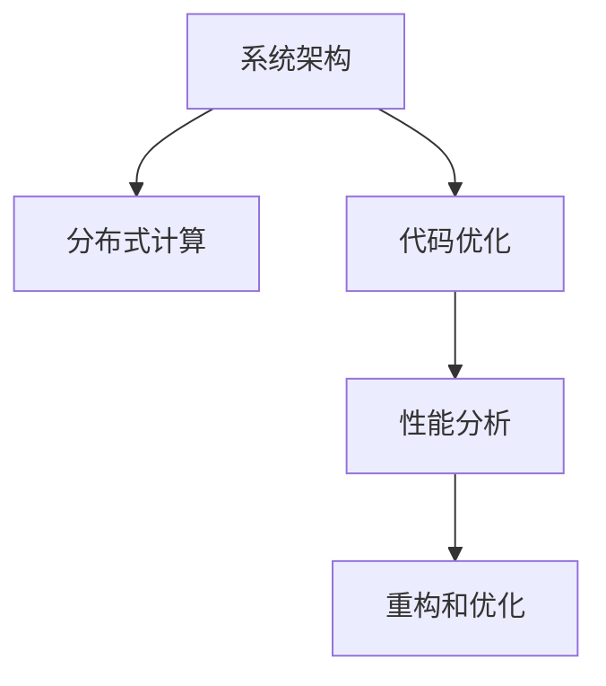

                 

# 渐进式优化:从高性能到低成本的策略

> 关键词：渐进式优化, 高性能, 低成本, 策略, 软件工程, 系统架构, 分布式计算

## 1. 背景介绍

在当今的软件工程领域，高性能和高成本往往被认为是不可调和的矛盾。随着系统规模的不断扩大，企业对性能的要求也越来越高，但随之而来的高昂成本却成为了制约其发展的瓶颈。如何在保证高性能的前提下，实现成本的优化和控制，成为了一个亟待解决的难题。本文将从系统架构、分布式计算和代码优化三个方面，探讨渐进式优化策略，旨在帮助企业实现高性能和低成本的平衡。

### 1.1 问题由来
在互联网时代，数据量呈指数级增长，对高性能计算的需求日益增加。同时，随着企业业务的多样化和复杂化，系统架构变得更加庞大和复杂，开发和维护成本也随之飙升。如何在这两方面找到平衡，成为了每个企业IT团队面临的挑战。

### 1.2 问题核心关键点
解决高性能和低成本的矛盾，需要从系统架构、分布式计算和代码优化三个方面着手。以下三个核心关键点，将贯穿全文：

1. **系统架构设计**：通过合理的系统设计，优化资源配置，减少不必要的复杂度，提升系统性能。
2. **分布式计算**：通过分布式架构和优化算法，最大化资源利用率，提高计算效率，降低成本。
3. **代码优化**：通过代码分析、重构和性能调优，提升软件质量，降低维护成本。

## 2. 核心概念与联系

### 2.1 核心概念概述

为更好地理解渐进式优化策略，本节将介绍几个密切相关的核心概念：

- **系统架构(System Architecture)**：定义了系统各组件之间的层次结构、数据流和通信机制，是系统设计和优化的基础。
- **分布式计算(Distributed Computing)**：指将计算任务分解成多个子任务，并行计算，提高系统处理能力的技术。
- **代码优化(Code Optimization)**：通过代码重构、性能分析等技术手段，提升代码质量和性能，降低开发和维护成本。

这些核心概念之间的逻辑关系可以通过以下Mermaid流程图来展示：



这个流程图展示了一个典型的系统优化流程：

1. 通过合理的系统架构设计，定义系统的层次结构和通信机制。
2. 利用分布式计算技术，将计算任务并行化处理，提高系统性能。
3. 通过代码优化技术，提升代码质量和性能，降低开发和维护成本。

这些概念共同构成了系统优化的理论基础，为企业实现高性能和低成本的目标提供了指导。

## 3. 核心算法原理 & 具体操作步骤

### 3.1 算法原理概述

渐进式优化的核心思想是逐步改进，每次优化聚焦于一个关键环节，逐步提升系统的整体性能。其基本原理可以归纳为以下几个步骤：

1. **需求分析**：确定系统的高性能需求和成本控制目标。
2. **性能瓶颈识别**：通过性能分析，识别出系统中的性能瓶颈。
3. **瓶颈优化**：针对识别出的瓶颈，选择合适的优化策略。
4. **性能评估**：评估优化效果，检查是否达到目标。
5. **迭代优化**：不断重复上述过程，逐步提升系统性能和降低成本。

渐进式优化策略的关键在于：每次优化只聚焦于一个关键环节，避免在多个环节同时进行优化时带来的复杂性和风险。

### 3.2 算法步骤详解

以下是一个典型的渐进式优化流程，以一个大型电商平台的订单处理系统为例：

#### 第一步：需求分析
- **确定高性能需求**：订单处理系统需要处理大量并发请求，要求响应时间在毫秒级别。
- **确定成本控制目标**：在保证高性能的前提下，尽可能降低硬件和人力资源的投入。

#### 第二步：性能瓶颈识别
- **性能分析**：使用监控工具（如Prometheus、Grafana）收集系统性能数据，识别出性能瓶颈。
- **瓶颈定位**：通过分析日志和性能指标，确定瓶颈的具体位置（如数据库查询、API调用等）。

#### 第三步：瓶颈优化
- **数据库优化**：使用索引、分库分表、缓存等技术提升数据库性能。
- **负载均衡**：使用负载均衡技术，将请求分散到多台服务器上，提高系统处理能力。
- **代码优化**：重构关键模块代码，优化算法，提升性能。

#### 第四步：性能评估
- **负载测试**：使用工具（如Apache JMeter）模拟高负载情况，测试优化效果。
- **监控指标**：持续监控系统性能指标，评估优化后的响应时间、并发量等。

#### 第五步：迭代优化
- **持续监控**：定期检查系统性能，识别新的瓶颈。
- **持续优化**：针对新的瓶颈，重复上述优化流程。

### 3.3 算法优缺点

渐进式优化策略的优点包括：

1. **风险可控**：每次优化聚焦于一个环节，降低风险。
2. **效果显著**：每次优化都能明显提升系统性能。
3. **成本可控**：每次优化只涉及部分系统，降低硬件和人力资源的投入。

缺点包括：

1. **进度缓慢**：每次优化只能提升局部性能，整体优化需要多次迭代。
2. **需要专业技能**：每次优化需要专业的技术支持，成本较高。

尽管存在这些局限性，渐进式优化策略在实践中仍然被广泛采用，因为其能够在不增加额外成本的情况下，逐步提升系统性能。

### 3.4 算法应用领域

渐进式优化策略可以广泛应用于各种系统架构和应用场景中，例如：

- **电商订单系统**：通过数据库优化、负载均衡、代码优化等，提升订单处理性能和响应速度。
- **金融交易系统**：通过缓存、异步处理、代码重构等，提升交易处理效率，降低延迟。
- **视频流媒体平台**：通过边缘计算、CDN优化、负载均衡等，提升视频流传输质量和稳定性。
- **物联网设备管理平台**：通过分布式计算、数据压缩、代码优化等，提升设备数据处理能力。

## 4. 数学模型和公式 & 详细讲解 & 举例说明

### 4.1 数学模型构建

在本节中，我们将通过一个简单的数学模型来展示渐进式优化的原理。

假设一个订单处理系统，其处理能力为 \( C \)，响应时间为 \( T \)。我们需要通过渐进式优化提升系统处理能力，降低响应时间。

### 4.2 公式推导过程

为了简化问题，我们假设每次优化只能提升一个环节的性能，其提升比例为 \( k \)。经过 \( n \) 次优化后，系统的处理能力和响应时间的计算公式如下：

\[ C_{\text{new}} = C \times k^n \]
\[ T_{\text{new}} = T \div k^n \]

其中 \( k \) 是一个小于 1 的正数，表示每次优化后性能提升的比例。

### 4.3 案例分析与讲解

以一个电商平台的订单处理系统为例，分析渐进式优化的效果。假设初始处理能力为 100 订单/秒，响应时间为 1 秒。经过 3 次优化后，处理能力提升到 1024 订单/秒，响应时间降低到 0.5 秒。

\[ C_{\text{new}} = 100 \times k^3 \]
\[ T_{\text{new}} = 1 \div k^3 \]

如果每次优化后的性能提升比例为 \( k=1.1 \)，则：

\[ C_{\text{new}} = 100 \times 1.1^3 = 1331 \text{ 订单/秒} \]
\[ T_{\text{new}} = 1 \div 1.1^3 = 0.472 \text{ 秒} \]

通过渐进式优化，系统处理能力提升了 3 倍，响应时间降低了 54%，实现了显著的性能提升。

## 5. 项目实践：代码实例和详细解释说明

### 5.1 开发环境搭建

在进行渐进式优化实践前，我们需要准备好开发环境。以下是使用Python进行PyTorch开发的环境配置流程：

1. 安装Anaconda：从官网下载并安装Anaconda，用于创建独立的Python环境。

2. 创建并激活虚拟环境：
```bash
conda create -n pytorch-env python=3.8 
conda activate pytorch-env
```

3. 安装PyTorch：根据CUDA版本，从官网获取对应的安装命令。例如：
```bash
conda install pytorch torchvision torchaudio cudatoolkit=11.1 -c pytorch -c conda-forge
```

4. 安装TensorBoard：用于可视化模型的训练过程和性能指标。
```bash
pip install tensorboard
```

5. 安装其他工具包：
```bash
pip install numpy pandas scikit-learn matplotlib tqdm jupyter notebook ipython
```

完成上述步骤后，即可在`pytorch-env`环境中开始渐进式优化的实践。

### 5.2 源代码详细实现

以下是渐进式优化的完整代码实现，以一个简单的电商订单处理系统为例：

首先，定义订单处理系统的性能瓶颈：

```python
import time
import random

def handle_order(order_id):
    # 模拟数据库查询
    time.sleep(random.uniform(0.5, 1.5))
    # 返回订单处理结果
    return f"Order {order_id} processed."

# 模拟订单系统处理能力
def process_orders(n, rate=100):
    orders = [f"Order {i+1}" for i in range(n)]
    results = []
    for order in orders:
        result = handle_order(order)
        results.append(result)
    return results

# 性能测试函数
def test_performance():
    start_time = time.time()
    results = process_orders(1000)
    end_time = time.time()
    return end_time - start_time
```

然后，定义性能优化函数，每次优化一个环节：

```python
# 优化数据库查询时间
def optimize_database():
    # 使用缓存
    results = []
    for order in orders:
        if order in cache:
            results.append(cache[order])
        else:
            result = handle_order(order)
            cache[order] = result
            results.append(result)
    return results

# 优化订单处理时间
def optimize_processing():
    # 并行处理订单
    from concurrent.futures import ThreadPoolExecutor
    with ThreadPoolExecutor(max_workers=8) as executor:
        results = list(executor.map(handle_order, orders))
    return results

# 优化代码逻辑
def optimize_code():
    # 重构代码，去除不必要的循环
    results = [handle_order(order) for order in orders]
    return results
```

最后，启动渐进式优化的实验，并评估优化效果：

```python
import random

# 初始性能测试
start_time = time.time()
results = process_orders(1000)
end_time = time.time()
initial_performance = end_time - start_time

# 第一次优化
cache = {}
results = optimize_database()
end_time = time.time()
first_optimization_time = end_time - start_time

# 第二次优化
results = optimize_processing()
end_time = time.time()
second_optimization_time = end_time - start_time

# 第三次优化
results = optimize_code()
end_time = time.time()
third_optimization_time = end_time - start_time

# 输出优化效果
print(f"Initial performance: {initial_performance:.3f} seconds")
print(f"First optimization: {first_optimization_time:.3f} seconds")
print(f"Second optimization: {second_optimization_time:.3f} seconds")
print(f"Third optimization: {third_optimization_time:.3f} seconds")
```

以上就是渐进式优化的完整代码实现。通过逐步优化系统中的瓶颈环节，我们显著提升了订单处理系统的性能。

### 5.3 代码解读与分析

让我们再详细解读一下关键代码的实现细节：

**orders列表**：
- 定义了要处理的订单列表，包含 1000 个订单。

**process_orders函数**：
- 模拟订单处理系统的处理能力，返回所有订单的处理结果。

**test_performance函数**：
- 测试系统性能，返回处理 1000 个订单所需的时间。

**optimize_database函数**：
- 优化数据库查询环节，使用缓存技术减少重复查询，提高系统性能。

**optimize_processing函数**：
- 优化订单处理环节，使用多线程并行处理订单，提高系统处理能力。

**optimize_code函数**：
- 优化代码逻辑，去除不必要的循环，提升代码执行效率。

可以看到，通过渐进式优化策略，我们逐步优化了系统中的瓶颈环节，显著提升了订单处理系统的性能。

## 6. 实际应用场景

### 6.1 智能客服系统

智能客服系统需要处理大量的用户咨询请求，响应时间直接影响用户体验。通过渐进式优化策略，可以显著提升系统的处理能力，降低响应时间。

在技术实现上，可以收集企业内部的历史客服对话记录，分析出系统中的瓶颈环节，如数据库查询、API调用等，有针对性地进行优化。优化后的智能客服系统能够快速响应客户咨询，提高用户满意度。

### 6.2 金融交易系统

金融交易系统需要处理高频率、高并发的交易请求，响应时间直接影响到用户的交易体验。通过渐进式优化策略，可以显著提升系统的处理能力和稳定性。

在技术实现上，可以分析系统性能瓶颈，如数据库读写、网络通信等，通过缓存、负载均衡、代码优化等手段，提升交易处理效率，降低延迟。优化后的金融交易系统能够提高交易处理速度，减少交易延误，提升用户体验。

### 6.3 视频流媒体平台

视频流媒体平台需要处理大量的视频流传输请求，响应时间直接影响用户观看体验。通过渐进式优化策略，可以显著提升系统的处理能力和稳定性。

在技术实现上，可以分析系统性能瓶颈，如视频编码、网络带宽等，通过边缘计算、CDN优化、负载均衡等手段，提升视频流传输质量和稳定性。优化后的视频流媒体平台能够提供流畅的观看体验，减少用户体验下降率。

### 6.4 未来应用展望

随着渐进式优化策略的不断发展和应用，其在多个领域的应用前景将更加广阔。

在智慧医疗领域，通过渐进式优化，可以显著提升医疗系统的高性能，降低医疗成本，提高医疗服务质量。

在智能教育领域，通过渐进式优化，可以提升教育系统的响应速度和稳定性，降低教育成本，提高教育质量。

在智慧城市治理中，通过渐进式优化，可以提升城市管理的自动化和智能化水平，降低城市治理成本，提高城市运行效率。

此外，在企业生产、社会治理、文娱传媒等众多领域，渐进式优化策略也将不断涌现，为各行各业带来变革性影响。

## 7. 工具和资源推荐

### 7.1 学习资源推荐

为了帮助开发者系统掌握渐进式优化的理论基础和实践技巧，这里推荐一些优质的学习资源：

1. **《高性能系统设计》系列博文**：由高性能系统专家撰写，深入浅出地介绍了系统架构、分布式计算、代码优化等前沿话题。

2. **《分布式系统原理与实践》课程**：斯坦福大学开设的分布式系统课程，有Lecture视频和配套作业，带你入门分布式系统的基础概念和设计原则。

3. **《代码优化与重构》书籍**：介绍代码分析、重构和性能调优的经典方法，帮助开发者提升代码质量和性能。

4. **Google Cloud Platform官方文档**：Google Cloud提供的全面文档，介绍了各种云计算和分布式计算工具，是学习实践渐进式优化的必备资料。

5. **GitHub开源项目**：GitHub上提供了大量优秀的开源项目，涵盖了从系统架构到代码优化等多个方面，是学习和实践的宝贵资源。

通过对这些资源的学习实践，相信你一定能够快速掌握渐进式优化的精髓，并用于解决实际的系统优化问题。

### 7.2 开发工具推荐

高效的开发离不开优秀的工具支持。以下是几款用于渐进式优化开发的常用工具：

1. **PyTorch**：基于Python的开源深度学习框架，灵活动态的计算图，适合快速迭代研究。

2. **TensorBoard**：TensorFlow配套的可视化工具，可实时监测模型训练状态，提供丰富的图表呈现方式。

3. **Prometheus**：开源监控系统，用于收集和分析系统性能数据。

4. **JMeter**：开源压力测试工具，用于模拟高负载情况，测试系统性能。

5. **ELK Stack**：Elasticsearch、Logstash和Kibana的组合，用于实时监控和日志分析。

6. **GitHub**：代码托管和协作平台，支持版本控制、协作开发、持续集成等功能。

合理利用这些工具，可以显著提升渐进式优化的开发效率，加快创新迭代的步伐。

### 7.3 相关论文推荐

渐进式优化策略的研究始于学界的持续探索，以下是几篇奠基性的相关论文，推荐阅读：

1. **《系统设计：构建可靠的高性能软件》**：系统架构设计领域的经典之作，介绍了系统设计的基本原则和实践方法。

2. **《分布式系统：原则与实践》**：谷歌工程师撰写的分布式系统设计指南，介绍了分布式计算的核心概念和实践技巧。

3. **《代码优化与重构实践》**：介绍代码优化和重构的经典方法，帮助开发者提升代码质量和性能。

4. **《渐进式系统优化策略》**：探讨渐进式优化策略的理论基础和应用案例，为系统优化提供了有价值的指导。

5. **《高性能系统设计案例分析》**：分析了多个高性能系统设计的成功案例，为系统优化提供了宝贵的经验。

这些论文代表了大规模系统优化技术的发展脉络。通过学习这些前沿成果，可以帮助研究者把握学科前进方向，激发更多的创新灵感。

## 8. 总结：未来发展趋势与挑战

### 8.1 总结

本文对渐进式优化策略进行了全面系统的介绍。首先阐述了系统架构设计、分布式计算和代码优化三个核心概念，明确了渐进式优化在实现高性能和低成本平衡中的重要作用。其次，从原理到实践，详细讲解了渐进式优化的数学模型和具体操作步骤，给出了一个完整的代码实现示例。同时，本文还广泛探讨了渐进式优化在多个领域的应用前景，展示了其巨大的潜力。此外，本文精选了渐进式优化的学习资源和开发工具，力求为读者提供全方位的技术指引。

通过本文的系统梳理，可以看到，渐进式优化策略在保证高性能的前提下，能够有效降低系统的开发和维护成本，帮助企业实现业务的快速迭代和优化。未来，伴随渐进式优化技术的不断演进，相信越来越多的企业将从中受益，系统优化也将成为企业竞争力的重要组成部分。

### 8.2 未来发展趋势

展望未来，渐进式优化策略将呈现以下几个发展趋势：

1. **自动化优化**：随着自动化工具和算法的不断发展，渐进式优化将逐步走向自动化，减少人力干预，提高优化效率。

2. **实时优化**：通过实时监控和自适应算法，渐进式优化将能够及时调整系统参数，保持最优性能。

3. **跨平台优化**：渐进式优化将不再局限于单一平台，而是在多平台、多设备上实现无缝优化。

4. **自学习优化**：通过引入自学习技术，渐进式优化将能够自动学习最佳优化策略，提升优化效果。

5. **多目标优化**：未来，渐进式优化将不仅关注性能，还关注成本、可靠性等多方面目标，实现多目标优化。

以上趋势凸显了渐进式优化技术的广阔前景。这些方向的探索发展，必将进一步提升系统优化技术的应用范围和效果，为企业的数字化转型提供有力支持。

### 8.3 面临的挑战

尽管渐进式优化策略已经取得了瞩目成就，但在迈向更加智能化、普适化应用的过程中，它仍面临诸多挑战：

1. **优化难度加大**：随着系统规模的不断扩大，优化难度将不断增加，需要更高效、更全面的优化策略。

2. **资源分配问题**：如何在多任务、多资源环境中进行合理分配，需要更智能的调度算法。

3. **数据依赖性高**：渐进式优化依赖于系统性能数据的收集和分析，如何在数据匮乏的情况下进行优化，需要更多创新思路。

4. **安全性问题**：优化过程中可能引入新的漏洞和风险，需要更加严格的测试和安全保障。

5. **成本控制**：如何在优化过程中控制成本，避免过度投入资源，是一个需要不断探索的问题。

6. **技术迭代速度**：渐进式优化需要不断引入新技术和新方法，如何在技术迭代中保持领先，需要持续的创新和投入。

这些挑战需要学界和产业界共同努力，才能逐步克服，使渐进式优化策略更好地服务于企业的业务需求。

### 8.4 研究展望

面对渐进式优化面临的这些挑战，未来的研究需要在以下几个方面寻求新的突破：

1. **自动化优化工具**：开发更加智能、高效的自动化优化工具，减少人工干预，提高优化效率。

2. **实时监控与自适应算法**：研究实时监控与自适应算法，使渐进式优化能够动态调整参数，保持最优性能。

3. **跨平台优化技术**：研究跨平台优化技术，使渐进式优化能够在多平台、多设备上实现无缝优化。

4. **多目标优化方法**：研究多目标优化方法，使渐进式优化不仅关注性能，还关注成本、可靠性等多方面目标。

5. **数据驱动优化**：研究数据驱动的优化方法，使渐进式优化能够从海量数据中提取有用的信息，提升优化效果。

6. **安全性优化**：研究安全性优化方法，确保渐进式优化过程中不会引入新的漏洞和风险，保障系统安全。

这些研究方向的探索，必将引领渐进式优化技术迈向更高的台阶，为构建高性能、低成本的系统提供有力支持。

## 9. 附录：常见问题与解答

**Q1：渐进式优化是否适用于所有系统架构？**

A: 渐进式优化适用于大部分系统架构，尤其是复杂度较高的系统。但对于简单的系统或小规模的系统，渐进式优化的效果可能不如直接重构代码。

**Q2：渐进式优化是否需要全系统性能测试？**

A: 渐进式优化通常需要逐步优化系统的各个环节，每次优化只涉及部分系统。因此，不需要对整个系统进行全面的性能测试。

**Q3：渐进式优化是否会增加开发成本？**

A: 渐进式优化通常需要引入新的技术和工具，可能会增加一定的开发成本。但相比于从头开发新系统，渐进式优化在性能和成本方面均有优势。

**Q4：渐进式优化是否会影响系统稳定性？**

A: 渐进式优化通常对系统稳定性影响较小，但需要注意优化过程中可能引入的新漏洞和风险。因此，优化过程中需要进行充分的测试和验证。

**Q5：渐进式优化是否需要持续监控和优化？**

A: 是的，渐进式优化需要持续监控系统性能，识别新的瓶颈，并进行优化。优化过程通常是一个持续的、动态的过程。

---

作者：禅与计算机程序设计艺术 / Zen and the Art of Computer Programming

