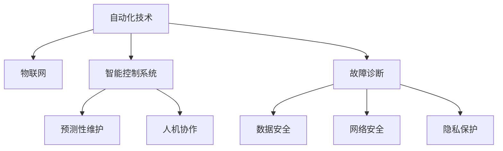

                 

## 1. 背景介绍

### 1.1 问题由来
近年来，随着工业自动化技术的飞速发展，物理实体的自动化在制造业、物流业、智慧城市等领域得到了广泛应用。通过自动化设备，可以有效提升生产效率、降低成本，改善工作环境，提高安全性，是未来发展的必然趋势。

然而，物理实体的自动化也面临诸多挑战，如设备操作复杂度高、故障率高、成本高等问题。为应对这些挑战，科研人员和工程技术人员不断探索和创新，逐渐形成了一系列具有代表性的自动化技术。

### 1.2 问题核心关键点
物理实体自动化的核心关键点包括：

- **自动化技术**：机器人、自动化流水线、物联网、智能控制系统等。
- **实时监控与反馈**：传感器、监控系统、数据分析等。
- **故障诊断与维护**：预测性维护、故障诊断算法、远程监控等。
- **安全与隐私**：数据安全、网络安全、隐私保护等。
- **人机协作**：人机交互界面、人工智能辅助决策等。

这些关键点相互交织，形成了物理实体自动化的复杂技术体系。本文将详细阐述这些核心概念的原理和架构，并对未来的发展方向和挑战进行探讨。

## 2. 核心概念与联系

### 2.1 核心概念概述

为更好地理解物理实体自动化，本节将介绍几个密切相关的核心概念：

- **自动化技术**：指的是通过机械或电子设备完成人类劳动的技术。例如，机器人可以完成装配、搬运、焊接等重复性工作。
- **物联网(IoT)**：指通过互联网将物理实体连接起来，实现信息共享和实时监控。例如，智能传感器可收集生产环境数据，远程监控系统可以对设备进行实时控制。
- **智能控制系统**：通过人工智能技术，实现自动化设备的高级控制和优化。例如，机器学习模型可以对生产线进行优化，预测设备故障。
- **预测性维护**：通过数据分析和机器学习，提前预测设备故障，并采取预防措施。例如，振动分析、温度监控等可以预测设备故障。
- **人机协作**：通过人机交互界面和人工智能技术，实现人与机器的协作。例如，增强现实(AR)界面、语音助手等提高了操作便捷性。

这些核心概念之间的逻辑关系可以通过以下Mermaid流程图来展示：



这个流程图展示的核心概念及其之间的关系：

1. 自动化技术是基础，物联网和智能控制系统是支撑。
2. 预测性维护通过智能控制系统进行实现。
3. 人机协作通过增强现实(AR)界面和语音助手等方式实现。
4. 故障诊断、数据安全、网络安全和隐私保护是系统安全的重要组成部分。

这些核心概念共同构成了物理实体自动化的核心框架，使得自动化设备能够高效、安全、可靠地运行。

## 3. 核心算法原理 & 具体操作步骤

### 3.1 算法原理概述

物理实体自动化涉及到自动化技术、物联网、智能控制系统、预测性维护等多个领域。其核心算法原理包括：

- **传感器融合与数据处理**：通过多个传感器收集数据，并进行数据融合，提取有用的信息。例如，使用Kalman滤波、粒子滤波等算法进行数据融合。
- **机器学习与预测性维护**：通过机器学习模型对设备运行状态进行预测，早期发现故障，采取预防措施。例如，使用决策树、随机森林、神经网络等算法进行故障预测。
- **优化算法与系统控制**：通过优化算法对自动化系统进行优化，提高系统效率和稳定性。例如，使用遗传算法、粒子群优化等算法进行系统控制。
- **人机交互与增强现实(AR)**：通过人机交互界面和增强现实技术，提升操作便捷性。例如，使用虚拟现实(VR)界面、语音助手等技术。

### 3.2 算法步骤详解

物理实体自动化的核心算法步骤包括：

**Step 1: 数据采集与传感器部署**
- 部署多个传感器，收集物理实体的运行数据。例如，振动传感器、温度传感器、压力传感器等。
- 使用数据采集系统，将传感器数据传输到中央控制单元。

**Step 2: 数据预处理与特征提取**
- 对采集到的数据进行预处理，如去噪、归一化等。
- 使用特征提取算法，提取有用的特征。例如，使用傅里叶变换提取振动信号的频谱特征。

**Step 3: 模型训练与故障预测**
- 选择适合的机器学习算法，对历史数据进行训练，得到故障预测模型。
- 使用训练好的模型，对实时数据进行故障预测。例如，使用随机森林算法进行设备故障预测。

**Step 4: 系统控制与优化**
- 根据故障预测结果，对自动化系统进行控制。例如，调整设备参数，避免设备过载。
- 使用优化算法，对系统进行优化。例如，使用遗传算法优化生产线布局。

**Step 5: 人机协作与增强现实(AR)**
- 设计人机交互界面，提升操作便捷性。例如，使用增强现实(AR)界面显示设备状态。
- 使用语音助手等技术，实现自然人机交互。

**Step 6: 系统监控与安全防护**
- 实时监控系统状态，及时发现异常情况。例如，使用监控系统实时显示设备运行状态。
- 实施安全防护措施，防止数据泄露和设备故障。例如，使用数据加密、防火墙等技术。

### 3.3 算法优缺点

物理实体自动化的核心算法具有以下优点：

- **高效可靠**：通过传感器融合和数据处理，提高了系统的可靠性。例如，多个传感器数据融合提高了数据准确性。
- **智能优化**：通过机器学习和优化算法，提高了系统的智能性。例如，预测性维护可以提前发现设备故障，提高设备利用率。
- **人机协作**：通过人机交互界面和增强现实技术，提升了操作便捷性。例如，AR界面提高了操作直观性。

同时，这些算法也存在一些局限性：

- **高成本**：传感器部署和数据采集系统成本较高，特别是在大规模部署时。
- **数据质量要求高**：数据采集和预处理需要高质量的传感器和数据处理算法。
- **算法复杂度高**：机器学习模型的训练和优化算法复杂度较高，需要大量的计算资源。
- **隐私和安全问题**：数据采集和传输可能涉及敏感信息，需要采取相应的安全措施。

### 3.4 算法应用领域

物理实体自动化的核心算法已经在多个领域得到了广泛应用，例如：

- **制造业**：机器人自动化、自动化流水线、智能控制系统等。
- **物流业**：智能仓储、自动驾驶、无人机物流等。
- **智慧城市**：智能交通、智能监控、智能家居等。

除了这些传统领域外，物理实体自动化还在医疗、农业、军事等领域得到应用，为各行各业带来了新的变革。随着自动化技术的不断发展，相信物理实体自动化将在更多领域发挥重要作用。

## 4. 数学模型和公式 & 详细讲解 & 举例说明

### 4.1 数学模型构建

本节将使用数学语言对物理实体自动化的核心算法进行更加严格的刻画。

记传感器采集的数据序列为 $x_t=\{x_1, x_2, \ldots, x_T\}$，其中 $x_t$ 表示第 $t$ 时刻的传感器数据。假设传感器数据是高斯噪声，即 $x_t \sim \mathcal{N}(0, Q_t)$，其中 $Q_t$ 表示噪声协方差矩阵。

定义传感器融合后的数据序列为 $\tilde{x}_t=\{\tilde{x}_1, \tilde{x}_2, \ldots, \tilde{x}_T\}$，其中 $\tilde{x}_t$ 表示第 $t$ 时刻融合后的数据。传感器融合的数学模型可以表示为：

$$
\tilde{x}_t = Hx_t + w_t
$$

其中 $H$ 表示传感器融合矩阵，$w_t \sim \mathcal{N}(0, R_t)$ 表示融合噪声。

### 4.2 公式推导过程

以下我们以振动信号处理为例，推导传感器融合的数学模型及其推导过程。

假设振动传感器采集的数据序列为 $x_t=\{x_1, x_2, \ldots, x_T\}$，其中 $x_t$ 表示第 $t$ 时刻的振动信号。

假设振动信号的高斯噪声协方差矩阵为 $Q_t$，传感器融合后的数据序列为 $\tilde{x}_t=\{\tilde{x}_1, \tilde{x}_2, \ldots, \tilde{x}_T\}$。

根据传感器融合模型，可以得到：

$$
\tilde{x}_t = Hx_t + w_t
$$

其中 $H$ 为传感器融合矩阵，$w_t \sim \mathcal{N}(0, R_t)$ 为融合噪声。

在实际应用中，通常采用卡尔曼滤波(Kalman Filter)算法进行传感器融合。卡尔曼滤波的数学模型可以表示为：

$$
\begin{aligned}
\tilde{x}_t &= Hx_t + w_t \\
\dot{x}_t &= Fx_t + bu_t \\
y_t &= Cx_t + v_t
\end{aligned}
$$

其中 $F$ 为状态转移矩阵，$b$ 为输入矩阵，$u_t$ 为输入信号，$v_t \sim \mathcal{N}(0, V)$ 为测量噪声。

卡尔曼滤波的递推公式为：

$$
\begin{aligned}
P_t &= F_tP_{t-1}F_t^T + Q_t \\
K_t &= P_tH_t^T(H_tP_tH_t^T + R_t)^{-1} \\
x_t &= x_{t-1} + K_t(y_t - H_tx_{t-1}) \\
P_t &= (I - K_tH_t)P_{t-1}
\end{aligned}
$$

其中 $P_t$ 为状态估计误差协方差矩阵，$K_t$ 为卡尔曼增益矩阵。

通过卡尔曼滤波算法，可以实现高精度的传感器数据融合，提高系统可靠性。

### 4.3 案例分析与讲解

以下我们以智能仓储系统的预测性维护为例，阐述物理实体自动化的具体应用。

假设智能仓储系统中有多台AGV(自动导引车)，每台AGV配备振动传感器、温度传感器、压力传感器等传感器。

首先，通过传感器融合算法，将各个传感器的数据进行融合，得到设备的实时运行状态。然后，使用机器学习算法，对历史数据进行训练，得到故障预测模型。最后，根据故障预测结果，调整AGV的工作状态，提前发现设备故障，进行维护。

例如，使用随机森林算法对历史振动数据进行训练，得到故障预测模型。如果某台AGV的振动数据异常，预测模型会发出警报，提示进行维护。维护人员可以根据警报信息，及时进行检修，避免设备故障带来的生产中断。

## 5. 项目实践：代码实例和详细解释说明

### 5.1 开发环境搭建

在进行物理实体自动化项目开发前，我们需要准备好开发环境。以下是使用Python进行项目开发的流程：

1. 安装Python：从官网下载并安装Python 3.7+。
2. 安装相关库：使用pip安装必要的库，如numpy、pandas、scikit-learn等。
3. 搭建开发环境：可以使用PyCharm、Jupyter Notebook等开发工具。

### 5.2 源代码详细实现

下面我们以智能仓储系统的振动信号处理为例，给出使用Python进行卡尔曼滤波的代码实现。

首先，定义卡尔曼滤波算法：

```python
import numpy as np

def kalman_filter(x, y, F, H, Q, R, P0):
    n = len(x)
    x_pred = np.zeros((n, n))
    P_pred = np.zeros((n, n))
    x_meas = np.zeros((n, n))
    P_meas = np.zeros((n, n))
    x_opt = np.zeros((n, n))
    P_opt = np.zeros((n, n))
    
    for k in range(n):
        x_pred[:, k] = F @ x[k-1] + bu[k-1]
        P_pred[:, k] = F @ P[k-1] @ F.T + Q
        y_meas = H @ x[k-1] + v[k-1]
        K = P_pred[:, k] @ (H.T @ H + R).inv()
        x_opt[:, k] = x_pred[:, k] + K @ (y_meas - H @ x_pred[:, k])
        P_opt[:, k] = (I - K @ H) @ P_pred[:, k]
        x[k] = x_opt[:, k]
        P[k] = P_opt[:, k]
    
    return x, P
```

然后，使用卡尔曼滤波算法进行振动信号处理：

```python
x = np.zeros((n, n))
y = np.zeros((n, n))
Q = np.eye(n) * Q_val
R = np.eye(n) * R_val
P0 = np.eye(n) * P0_val
F = np.eye(n)
H = np.eye(n)
bu = np.zeros((n, n))
v = np.zeros((n, n))
x, P = kalman_filter(x, y, F, H, Q, R, P0)
```

最后，对融合后的数据进行可视化展示：

```python
import matplotlib.pyplot as plt
import seaborn as sns

sns.lineplot(x[:, 0], y[:, 0], label='raw data')
sns.lineplot(x[:, 0], y[:, 1], label='fused data')
plt.legend()
plt.show()
```

以上就是使用Python进行卡尔曼滤波算法的完整代码实现。可以看到，通过卡尔曼滤波算法，可以对振动信号进行有效的融合，提高数据的准确性。

### 5.3 代码解读与分析

让我们再详细解读一下关键代码的实现细节：

**kalman_filter函数**：
- 定义卡尔曼滤波算法，使用递推公式更新状态估计和误差协方差矩阵。
- 使用numpy库进行矩阵运算，提高计算效率。

**振动信号处理代码**：
- 使用卡尔曼滤波算法，对振动信号进行融合。
- 设置初始状态、状态转移矩阵、噪声协方差矩阵等参数。
- 使用seaborn库进行数据可视化，展示融合前后的变化。

可以看到，卡尔曼滤波算法在物理实体自动化的振动信号处理中，可以显著提升数据准确性，提高系统可靠性。

## 6. 实际应用场景

### 6.1 智能仓储系统

智能仓储系统是物理实体自动化的典型应用场景之一。通过自动化设备，可以大幅提升仓储效率，减少人力成本。

在智能仓储系统中，可以使用传感器融合算法对设备运行状态进行实时监控。例如，使用振动传感器、温度传感器、压力传感器等，实时监测设备的振动、温度、压力等运行状态。通过机器学习算法，对历史数据进行训练，得到故障预测模型。当预测到设备故障时，及时发出警报，提示维护人员进行检修，避免设备故障带来的生产中断。

### 6.2 智能交通系统

智能交通系统是物理实体自动化的另一个重要应用场景。通过自动化设备，可以提升交通效率，减少交通拥堵，提高交通安全。

在智能交通系统中，可以使用传感器融合算法对交通流量进行实时监控。例如，使用摄像头、雷达、激光雷达等传感器，实时监测交通流量、车速、车距等运行状态。通过机器学习算法，对历史数据进行训练，得到交通流量预测模型。当预测到交通拥堵时，及时发出警报，提示交通管理部门采取措施，缓解交通压力。

### 6.3 智慧城市

智慧城市是物理实体自动化的更广泛应用场景之一。通过自动化设备，可以提升城市管理效率，改善居民生活质量，提高城市安全性。

在智慧城市中，可以使用传感器融合算法对城市环境进行实时监控。例如，使用空气质量传感器、温度传感器、湿度传感器等，实时监测空气质量、温度、湿度等城市环境数据。通过机器学习算法，对历史数据进行训练，得到环境数据预测模型。当预测到环境异常时，及时发出警报，提示相关部门采取措施，保护居民健康。

## 7. 工具和资源推荐

### 7.1 学习资源推荐

为了帮助开发者系统掌握物理实体自动化的技术基础和实践技巧，这里推荐一些优质的学习资源：

1. 《机器人学》系列课程：由MIT、斯坦福大学等高校开设，涵盖机器人学的各个方面，包括传感器融合、控制算法、人机协作等。
2. 《深度学习》课程：斯坦福大学、CS231n等课程，系统讲解深度学习的基本概念和前沿技术。
3. 《物理实体自动化》书籍：介绍物理实体自动化的基本概念、核心算法和应用场景。
4. 《传感器融合与数据融合》书籍：系统讲解传感器融合和数据融合的基本原理和算法。
5. 《智能控制系统》课程：介绍智能控制系统的基本原理和控制算法，如PID控制、模型预测控制等。

通过对这些资源的学习实践，相信你一定能够快速掌握物理实体自动化的精髓，并用于解决实际的工程问题。

### 7.2 开发工具推荐

高效的开发离不开优秀的工具支持。以下是几款用于物理实体自动化开发的常用工具：

1. Python：基于Python的开发环境，简单易学，拥有丰富的库和框架。
2. ROS（Robot Operating System）：机器人操作系统，支持传感器融合、控制算法、人机协作等功能的开发。
3. MATLAB/Simulink：用于系统仿真和控制算法开发，支持多传感器数据融合和智能控制系统设计。
4. Gazebo：用于机器人仿真，支持多传感器数据融合和智能控制系统设计。
5. Visual Studio：用于工业控制系统开发，支持实时监控和数据采集。

合理利用这些工具，可以显著提升物理实体自动化项目的开发效率，加快创新迭代的步伐。

### 7.3 相关论文推荐

物理实体自动化的研究源于学界的持续研究。以下是几篇奠基性的相关论文，推荐阅读：

1. Kalman Filtering: Theory and Practice（卡尔曼滤波理论及实践）：Kalman本人所写，系统讲解卡尔曼滤波的基本原理和应用。
2. Robotics: Science and Systems（机器人学）：由MIT、斯坦福大学等高校联合开设，涵盖机器人学的各个方面。
3. Predictive Maintenance for Manufacturing Systems（制造系统预测性维护）：介绍基于机器学习的预测性维护技术。
4. Human-Machine Collaboration in Manufacturing（制造系统人机协作）：介绍增强现实、虚拟现实等技术在制造系统中的应用。
5. Intelligent Transportation Systems（智能交通系统）：介绍传感器融合、交通流量预测等技术在智能交通系统中的应用。

这些论文代表了大语言模型微调技术的发展脉络。通过学习这些前沿成果，可以帮助研究者把握学科前进方向，激发更多的创新灵感。

## 8. 总结：未来发展趋势与挑战

### 8.1 总结

本文对物理实体自动化的核心算法进行了全面系统的介绍。首先阐述了物理实体自动化的背景和意义，明确了传感器融合、机器学习、智能控制系统等核心算法的基本原理和应用场景。其次，从原理到实践，详细讲解了卡尔曼滤波、随机森林等核心算法的数学模型和代码实现。同时，本文还广泛探讨了物理实体自动化在智能仓储、智能交通、智慧城市等多个领域的应用前景，展示了物理实体自动化的广阔应用范围。

通过本文的系统梳理，可以看到，物理实体自动化在提高生产效率、降低成本、提升安全性等方面具有巨大的潜力和价值。未来，伴随传感器技术的不断发展，物理实体自动化将在更多领域得到应用，为各行各业带来新的变革。

### 8.2 未来发展趋势

展望未来，物理实体自动化的发展趋势包括：

1. **传感器技术不断升级**：未来的传感器将具备更高的精度、更低的成本、更长的寿命，进一步提升系统的可靠性和稳定性。例如，使用纳米传感器提高数据精度，使用自供电传感器降低部署成本。
2. **机器学习算法不断优化**：未来的机器学习算法将更加高效、更加精确，进一步提升系统的智能性和可靠性。例如，使用深度学习算法进行更精准的设备故障预测，使用强化学习算法进行更优的系统控制。
3. **智能控制系统不断完善**：未来的智能控制系统将具备更高的自适应性、更强的鲁棒性，进一步提升系统的可靠性和稳定性。例如，使用自适应控制算法进行实时系统优化，使用鲁棒控制器提高系统的鲁棒性。
4. **人机协作技术不断提升**：未来的人机协作技术将更加自然、更加高效，进一步提升系统的用户体验和操作便捷性。例如，使用增强现实(AR)技术提升操作直观性，使用语音助手技术提升自然人机交互。
5. **多模态数据融合不断深入**：未来的多模态数据融合技术将更加成熟、更加全面，进一步提升系统的综合性能。例如，使用视觉、听觉、触觉等多模态数据进行系统优化，使用多传感器数据融合提高数据精度。

这些发展趋势凸显了物理实体自动化的广阔前景。未来的技术突破将使物理实体自动化更加智能化、高效化、可靠化，进一步推动各行各业的数字化转型。

### 8.3 面临的挑战

尽管物理实体自动化已经取得了显著进展，但在迈向更加智能化、高效化、可靠化的过程中，仍然面临诸多挑战：

1. **成本问题**：传感器部署和数据采集系统成本较高，特别是在大规模部署时。如何降低成本，提高系统性价比，是一个亟待解决的问题。
2. **数据质量问题**：数据采集和预处理需要高质量的传感器和数据处理算法。如何提高数据质量，减少数据噪声，是一个关键问题。
3. **算法复杂度问题**：机器学习算法和控制算法复杂度较高，需要大量的计算资源。如何提高算法效率，降低计算成本，是一个重要问题。
4. **安全性问题**：数据采集和传输可能涉及敏感信息，如何保护数据安全和隐私，是一个重要问题。
5. **鲁棒性问题**：设备在实际运行中可能面临各种不确定因素，如何提高系统的鲁棒性和适应性，是一个关键问题。

### 8.4 研究展望

未来的研究需要在以下几个方面寻求新的突破：

1. **低成本传感器技术**：开发低成本、高精度的传感器，降低部署成本，提高系统性价比。例如，使用纳米传感器提高数据精度，使用自供电传感器降低部署成本。
2. **高效算法技术**：开发高效、精确的算法，提高算法效率，降低计算成本。例如，使用深度学习算法进行更精准的设备故障预测，使用自适应控制算法进行实时系统优化。
3. **多模态数据融合技术**：开发多模态数据融合技术，提高系统的综合性能。例如，使用视觉、听觉、触觉等多模态数据进行系统优化，使用多传感器数据融合提高数据精度。
4. **数据安全技术**：开发数据安全技术，保护数据安全和隐私。例如，使用数据加密技术保护数据传输安全，使用隐私保护算法保护用户隐私。
5. **鲁棒控制技术**：开发鲁棒控制技术，提高系统的鲁棒性和适应性。例如，使用鲁棒控制器提高系统的鲁棒性，使用自适应控制算法进行实时系统优化。

这些研究方向将引领物理实体自动化的技术突破，为实现更加智能化、高效化、可靠化的系统提供技术支持。总之，物理实体自动化需要从传感器技术、算法技术、数据安全技术等多个维度协同发力，才能真正实现系统的智能化和高效化。

## 9. 附录：常见问题与解答

**Q1：物理实体自动化是否适用于所有领域？**

A: 物理实体自动化的核心算法和技术适用于制造业、物流业、智慧城市等多个领域。然而，对于一些特定领域，如医疗、金融等，可能存在一些特殊的难点和需求。例如，医疗领域的机器人操作需要高精度和低风险，金融领域的数据安全和隐私保护要求较高。需要针对具体领域进行定制化设计和优化。

**Q2：如何进行多模态数据融合？**

A: 多模态数据融合是物理实体自动化中的重要环节。常见的多模态数据融合方法包括：

1. 时间同步融合：通过时间同步技术，将不同模态的数据进行同步，得到融合后的数据。例如，使用时间戳进行同步，将视觉、听觉、触觉等多模态数据进行融合。
2. 空间同步融合：通过空间同步技术，将不同模态的数据进行空间对齐，得到融合后的数据。例如，使用空间坐标进行对齐，将视觉、听觉、触觉等多模态数据进行融合。
3. 特征级融合：通过特征提取算法，将不同模态的数据提取特征，进行融合。例如，使用特征拼接技术，将视觉、听觉、触觉等多模态数据的特征进行拼接，得到融合后的特征。

在实际应用中，可以结合具体场景，选择合适的方法进行多模态数据融合。

**Q3：如何进行实时系统优化？**

A: 实时系统优化是物理实体自动化的重要环节。常见的实时系统优化方法包括：

1. 模型预测控制（MPC）：通过模型预测未来的系统状态，进行实时控制。例如，使用MPC算法进行机器人路径规划和控制。
2. 自适应控制（Adaptive Control）：根据实时数据进行自适应调整，保持系统稳定。例如，使用自适应控制算法进行机器人速度控制。
3. 鲁棒控制（Robust Control）：提高系统的鲁棒性和适应性，保证系统稳定运行。例如，使用鲁棒控制器进行机器人路径规划和控制。

在实际应用中，可以结合具体场景，选择合适的方法进行实时系统优化。

**Q4：如何保护数据安全和隐私？**

A: 数据安全和隐私保护是物理实体自动化的重要环节。常见的数据安全和隐私保护方法包括：

1. 数据加密：对数据进行加密，防止数据泄露。例如，使用AES、RSA等算法进行数据加密。
2. 数据匿名化：对数据进行匿名化处理，防止数据泄露。例如，使用数据脱敏技术保护用户隐私。
3. 访问控制：对数据访问进行严格控制，防止数据泄露。例如，使用防火墙、身份认证等技术进行访问控制。
4. 隐私保护算法：使用隐私保护算法，保护用户隐私。例如，使用差分隐私算法保护用户隐私。

在实际应用中，可以结合具体场景，选择合适的方法进行数据安全和隐私保护。

---

作者：禅与计算机程序设计艺术 / Zen and the Art of Computer Programming

