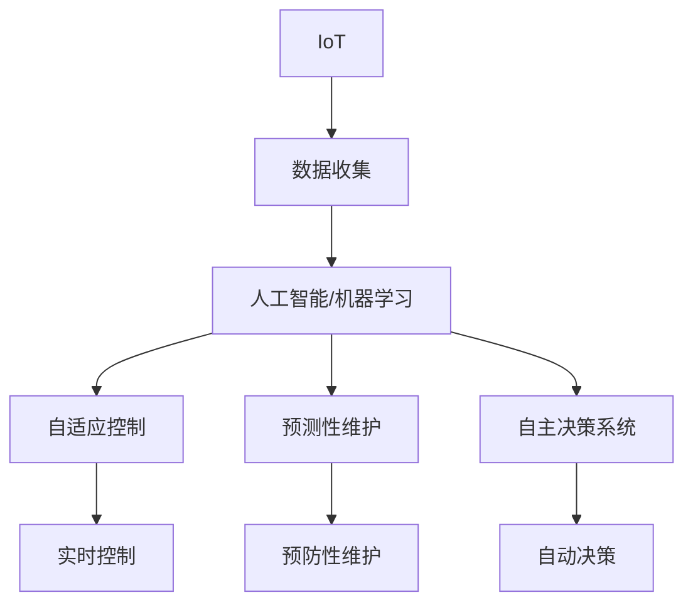

                 

## 1. 背景介绍

物理实体的自动化，通常指的是通过计算机科学、人工智能、物联网（IoT）等技术的集成应用，实现对物理实体的智能管理和控制。这一领域在过去几十年中迅速发展，涵盖了从制造业的自动化生产线到智能家居的各种应用场景。随着技术的不断进步，物理实体的自动化正从简单的自动化控制向更为智能化的方向发展，旨在提升效率、降低成本、提高安全性和可持续性。

### 1.1 问题由来

传统的物理实体自动化解决方案通常依赖于严格的编程和传感器监控，但这种方法在面对复杂的实时环境变化时显得有些力不从心。随着人工智能（AI）和机器学习（ML）技术的成熟，新的趋势开始兴起，如自适应控制、预测性维护和自主决策系统等。这些技术使得物理实体自动化更加智能和灵活，能够更好地适应变化的环境。

### 1.2 问题核心关键点

物理实体自动化的关键问题包括：

1. **数据收集与处理**：如何高效、准确地从各种物理实体中收集数据，并对这些数据进行处理以获得有用的信息。
2. **模型训练与优化**：使用哪些算法和模型对数据进行训练，以及如何在训练过程中进行优化，以提高模型性能。
3. **系统集成与协同**：如何将不同系统、设备和传感器有效地集成在一起，实现协同工作。
4. **安全性与隐私**：如何确保自动化系统在数据收集和处理过程中的安全性与隐私保护。
5. **可扩展性与可维护性**：系统如何能够在实际应用中灵活扩展和维护。

### 1.3 问题研究意义

物理实体自动化的最新趋势对于提高生产效率、降低运营成本、提升安全性和环境可持续性具有重要意义。通过智能化的物理实体自动化，企业能够更好地应对市场变化，提高竞争力。此外，智能化的物理实体自动化也为消费者带来了更加便捷、安全的智能家居体验。

## 2. 核心概念与联系

### 2.1 核心概念概述

物理实体自动化的核心概念包括：

- **物联网（IoT）**：通过互联网将各种传感器、设备和系统连接起来，实现数据的收集和传输。
- **人工智能（AI）与机器学习（ML）**：利用算法和模型对收集的数据进行分析，实现自主决策和智能控制。
- **自适应控制**：系统能够根据环境变化自动调整控制策略。
- **预测性维护**：通过数据分析预测设备故障，提前进行维护。
- **自主决策系统**：系统能够根据当前环境和目标自主做出决策。

这些概念之间的联系可以通过以下Mermaid流程图来展示：



这个流程图展示了大规模物理实体自动化系统的核心组件和它们之间的逻辑关系：

1. 物联网负责数据的收集。
2. 人工智能和机器学习对数据进行处理和分析。
3. 自适应控制和预测性维护根据分析结果进行实时控制和预防性维护。
4. 自主决策系统基于当前环境和目标做出自动决策。

## 3. 核心算法原理 & 具体操作步骤

### 3.1 算法原理概述

物理实体自动化的核心算法包括：

- **强化学习（RL）**：通过试错学习，优化系统的控制策略。
- **深度学习（DL）**：使用深度神经网络对数据进行复杂特征的提取和模式识别。
- **迁移学习**：将一个领域的知识迁移到另一个领域，提高模型在新领域的表现。
- **自适应控制**：根据当前环境和目标自动调整控制策略。
- **预测性维护**：使用时间序列分析等技术预测设备故障，提前进行维护。

### 3.2 算法步骤详解

物理实体自动化的典型算法步骤包括：

1. **数据采集**：使用传感器等设备收集物理实体的各种数据，如温度、湿度、压力等。
2. **数据预处理**：清洗、标准化和归一化数据，以便于后续分析和建模。
3. **模型训练**：选择合适的算法和模型，对处理后的数据进行训练。
4. **模型优化**：使用验证集评估模型性能，并调整模型参数以提高性能。
5. **部署应用**：将训练好的模型部署到物理实体自动化系统中，实现实时控制和决策。

### 3.3 算法优缺点

物理实体自动化的算法优缺点如下：

#### 优点：

- **高精度**：深度学习和强化学习等算法能够处理复杂的数据和环境，提供高精度的预测和控制。
- **灵活性**：自适应控制和自主决策系统可以根据环境变化动态调整策略，提高系统的适应性。
- **预测性**：预测性维护通过分析历史数据，预测未来可能的问题，提高系统的可靠性。

#### 缺点：

- **数据需求高**：算法需要大量高质量的数据进行训练，数据采集和处理的成本较高。
- **计算资源要求高**：深度学习和强化学习算法对计算资源的需求较高，可能面临算力不足的问题。
- **模型复杂**：模型结构复杂，难以理解和调试，需要专业的知识和工具。

### 3.4 算法应用领域

物理实体自动化的算法主要应用于以下领域：

- **制造业**：通过自动化生产线提高生产效率和产品质量。
- **智能家居**：实现家庭设备的智能控制和自动化管理。
- **智能交通**：优化交通流量，提高交通安全和效率。
- **能源管理**：优化能源使用，提高能效和可持续发展性。
- **农业**：实现精准农业，提高农作物产量和质量。

## 4. 数学模型和公式 & 详细讲解

### 4.1 数学模型构建

物理实体自动化的数学模型通常包括：

- **线性回归模型**：用于预测物理参数之间的关系。
- **时间序列模型**：用于预测设备的使用和维护周期。
- **马尔可夫决策过程（MDP）**：用于描述系统的状态转移和决策过程。
- **深度神经网络**：用于复杂数据和非线性关系的建模。

### 4.2 公式推导过程

以线性回归模型为例，其公式推导过程如下：

$$
y = \beta_0 + \beta_1 x_1 + \beta_2 x_2 + \cdots + \beta_n x_n + \epsilon
$$

其中，$y$ 为预测值，$\beta_0$ 为截距，$\beta_i$ 为自变量 $x_i$ 的系数，$\epsilon$ 为误差项。线性回归模型的目标是最小化预测值与实际值之间的平方误差：

$$
\min_{\beta} \sum_{i=1}^n (y_i - \hat{y}_i)^2
$$

通过求解上述优化问题，可以得到最优的模型参数 $\beta$。

### 4.3 案例分析与讲解

以预测设备故障为例，使用时间序列模型进行分析：

假设有一组历史数据 $(t_i, y_i)$，其中 $t_i$ 为时间戳，$y_i$ 为设备状态，如1表示正常，0表示故障。可以使用ARIMA模型（自回归积分滑动平均模型）进行预测，模型如下：

$$
y_t = \alpha_0 + \alpha_1 y_{t-1} + \cdots + \alpha_p y_{t-p} + \epsilon_t
$$

其中，$\alpha_i$ 为模型参数，$y_{t-p}$ 为滞后 $p$ 期的设备状态，$\epsilon_t$ 为误差项。模型可以用于预测未来的设备状态，及时进行维护，避免故障发生。

## 5. 项目实践：代码实例和详细解释说明

### 5.1 开发环境搭建

物理实体自动化的项目开发需要以下环境：

1. **Python**：安装Anaconda或Miniconda，创建虚拟环境。
2. **深度学习框架**：安装TensorFlow或PyTorch，用于深度学习和模型训练。
3. **物联网平台**：安装MQTT或Modbus，用于数据采集和通信。
4. **可视化工具**：安装Matplotlib或Bokeh，用于数据可视化。

### 5.2 源代码详细实现

以下是一个使用TensorFlow进行线性回归模型训练的代码实现：

```python
import tensorflow as tf
import numpy as np
import matplotlib.pyplot as plt

# 准备数据
x = np.array([1, 2, 3, 4, 5])
y = np.array([2, 4, 5, 4, 5])
x_train = x.reshape(-1, 1)
y_train = y.reshape(-1, 1)

# 构建模型
model = tf.keras.Sequential([
    tf.keras.layers.Dense(1, input_shape=(1,))
])

# 编译模型
model.compile(optimizer=tf.keras.optimizers.Adam(learning_rate=0.01),
              loss=tf.keras.losses.MeanSquaredError(),
              metrics=[tf.keras.metrics.MeanAbsoluteError()])

# 训练模型
model.fit(x_train, y_train, epochs=100, verbose=0)

# 预测数据
x_test = np.array([6, 7, 8])
y_pred = model.predict(x_test)

# 可视化结果
plt.scatter(x, y, color='blue')
plt.plot(x_test, y_pred, color='red')
plt.show()
```

### 5.3 代码解读与分析

上述代码实现了线性回归模型的训练和预测。具体步骤包括：

1. **数据准备**：创建训练数据集，其中 $x$ 为自变量，$y$ 为因变量。
2. **模型构建**：使用Sequential模型，添加Dense层进行线性回归。
3. **模型编译**：指定优化器、损失函数和评价指标。
4. **模型训练**：使用fit函数对模型进行训练，指定训练轮数和可视化开关。
5. **模型预测**：使用predict函数对测试数据进行预测。
6. **可视化结果**：使用Matplotlib对训练数据和预测结果进行可视化。

## 6. 实际应用场景

### 6.1 智能工厂

在智能工厂中，物理实体自动化通过传感器监测生产线的各个环节，实时调整设备参数，优化生产过程，提高生产效率和产品质量。通过机器学习算法，可以对生产线上的异常情况进行预测和诊断，提前进行维护，减少停机时间。

### 6.2 智能家居

智能家居系统通过物联网设备收集家庭环境数据，如温度、湿度、光照等，使用深度学习算法进行分析，提供个性化推荐和智能控制。例如，根据家庭成员的作息习惯自动调节室内温度，或根据天气预测推荐出行装备。

### 6.3 智能交通

智能交通系统通过传感器监测道路和交通状况，使用强化学习算法进行交通流量优化，提高交通安全和通行效率。例如，根据实时数据调整红绿灯时间，减少拥堵。

### 6.4 未来应用展望

物理实体自动化的未来发展方向包括：

1. **边缘计算**：将计算和存储任务从云端转移到边缘设备，提高实时性和降低延迟。
2. **联邦学习**：通过分布式数据训练，保护用户隐私和数据安全。
3. **自适应控制**：根据环境和目标动态调整控制策略，提高系统的适应性和鲁棒性。
4. **混合智能**：将人工智能与人类智能相结合，提高决策的透明度和可解释性。
5. **可持续发展**：通过优化能源使用和减少浪费，实现环境可持续性。

## 7. 工具和资源推荐

### 7.1 学习资源推荐

- **《深度学习》（Ian Goodfellow）**：深入浅出地介绍了深度学习的原理和应用，适合入门和进阶学习。
- **Coursera《机器学习》课程**：由斯坦福大学教授Andrew Ng主讲，涵盖了机器学习的基础和高级内容。
- **Kaggle竞赛平台**：提供大量数据集和竞赛，锻炼数据处理和建模能力。
- **PyTorch官方文档**：详细介绍了PyTorch的使用和API，适合深度学习和模型训练。
- **TensorFlow官方文档**：介绍了TensorFlow的使用和API，适合深度学习和模型训练。

### 7.2 开发工具推荐

- **Jupyter Notebook**：提供交互式编程环境，便于代码调试和数据可视化。
- **MATLAB**：强大的科学计算和数据分析工具，适合复杂模型的实现和优化。
- **R语言**：数据分析和统计建模的重要工具，适合数据处理和分析。
- **OpenCV**：计算机视觉库，提供图像处理和分析功能。
- **MATLAB与OpenCV结合使用**：通过Matlab与OpenCV结合，可以实现图像的实时处理和分析。

### 7.3 相关论文推荐

- **《深度强化学习》（Richard S. Sutton、Andrew G. Barto）**：介绍了深度强化学习的原理和应用，适合深度学习和强化学习的研究。
- **《机器学习实战》（Peter Harrington）**：通过实际案例介绍机器学习的应用，适合入门和实践。
- **《自动驾驶技术》（李宝栋）**：介绍了自动驾驶技术的原理和应用，适合自动驾驶领域的研究。
- **《物联网安全技术》（陈光复）**：介绍了物联网安全技术的原理和应用，适合物联网领域的研究。

## 8. 总结：未来发展趋势与挑战

### 8.1 研究成果总结

物理实体自动化的最新研究包括：

- **智能制造**：通过物联网和机器学习优化生产过程。
- **智能家居**：通过深度学习实现智能设备和环境控制。
- **智能交通**：通过强化学习优化交通流量。
- **智慧能源**：通过时间序列分析和预测性维护优化能源使用。
- **精准农业**：通过数据分析和机器学习提高农业生产效率。

### 8.2 未来发展趋势

物理实体自动化的未来发展趋势包括：

1. **边缘计算**：将计算和存储任务从云端转移到边缘设备，提高实时性和降低延迟。
2. **联邦学习**：通过分布式数据训练，保护用户隐私和数据安全。
3. **自适应控制**：根据环境和目标动态调整控制策略，提高系统的适应性和鲁棒性。
4. **混合智能**：将人工智能与人类智能相结合，提高决策的透明度和可解释性。
5. **可持续发展**：通过优化能源使用和减少浪费，实现环境可持续性。

### 8.3 面临的挑战

物理实体自动化的挑战包括：

1. **数据质量**：数据采集和处理的质量直接影响模型的性能。
2. **计算资源**：深度学习和强化学习算法对计算资源的需求较高，可能面临算力不足的问题。
3. **模型复杂性**：模型结构复杂，难以理解和调试。
4. **隐私和安全**：数据收集和处理过程中需要保护用户隐私和数据安全。
5. **互操作性**：不同设备和系统之间的互操作性需要解决。

### 8.4 研究展望

未来的研究需要关注：

1. **数据增强**：通过数据增强技术提高模型的泛化能力。
2. **模型压缩**：通过模型压缩技术降低计算资源需求。
3. **模型可解释性**：提高模型的可解释性和透明性。
4. **隐私保护**：研究隐私保护和数据安全的技术。
5. **跨领域应用**：将物理实体自动化技术应用于更多领域，如医疗、物流等。

## 9. 附录：常见问题与解答

**Q1：什么是物理实体自动化？**

A: 物理实体自动化是指通过计算机科学、人工智能和物联网等技术，实现对物理实体的智能管理和控制。

**Q2：物理实体自动化的核心算法有哪些？**

A: 物理实体自动化的核心算法包括强化学习、深度学习、迁移学习、自适应控制和预测性维护等。

**Q3：物理实体自动化在实际应用中面临哪些挑战？**

A: 物理实体自动化在实际应用中面临数据质量、计算资源、模型复杂性、隐私安全、互操作性等挑战。

**Q4：未来的物理实体自动化技术发展趋势是什么？**

A: 未来的物理实体自动化技术发展趋势包括边缘计算、联邦学习、自适应控制、混合智能和可持续发展等。

**Q5：如何提高物理实体自动化系统的数据采集和处理能力？**

A: 通过使用更先进的传感器和数据采集设备，以及对数据进行清洗、标准化和归一化等预处理操作，可以提高数据采集和处理能力。

**Q6：如何保护物理实体自动化系统中的数据隐私？**

A: 通过数据匿名化、加密和访问控制等手段，可以保护物理实体自动化系统中的数据隐私。

**Q7：如何在物理实体自动化系统中实现智能决策？**

A: 通过使用强化学习和深度学习等算法，可以对收集到的数据进行分析，实现智能决策。

---

作者：禅与计算机程序设计艺术 / Zen and the Art of Computer Programming

