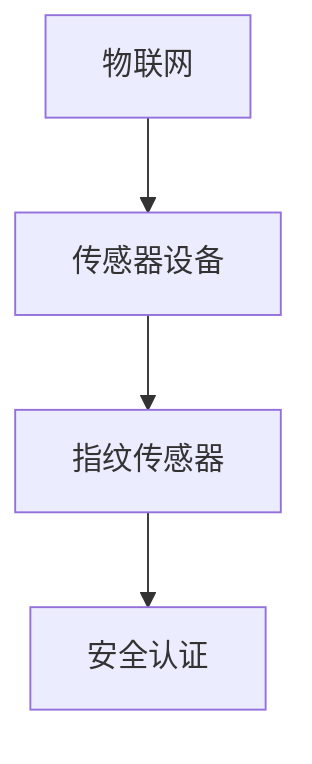

                 

# 物联网(IoT)技术和各种传感器设备的集成：指纹传感器的安全应用

## 1. 背景介绍

随着物联网(IoT)技术的发展，各种传感器设备在各个领域的应用越来越广泛。其中，指纹传感器以其非接触、高精度、易用性等特点，被广泛应用于安全认证、身份识别、门禁管理等领域。然而，如何确保指纹数据的安全性，防止数据泄露和恶意攻击，成为了指纹传感器应用中面临的重要挑战。本文将深入探讨物联网技术和传感器设备的集成，特别是指纹传感器的安全应用，并给出详细的技术实现方案。

## 2. 核心概念与联系

### 2.1 核心概念概述

为了更好地理解指纹传感器在物联网中的应用，我们需要先了解一些核心概念：

- **物联网(IoT)**：指通过传感器、智能设备等技术手段，实现物与物、物与人之间的互联互通。物联网技术的应用范围广泛，包括智能家居、智能城市、工业互联网等领域。
- **传感器设备**：指能够采集环境或物体信息，并进行处理的电子设备。常见的传感器设备包括温度传感器、湿度传感器、压力传感器、指纹传感器等。
- **指纹传感器**：指通过采集指纹图像，提取特征点，实现身份识别的传感器设备。指纹传感器具有高精度、高安全性等特点，被广泛应用于各种安全认证场景。
- **安全认证**：指通过生物特征、密码、密钥等手段，验证用户身份的真实性和可信度的过程。安全认证在金融、医疗、国防等领域具有重要意义。

这些概念之间的联系可以通过以下Mermaid流程图来展示：



这个流程图展示了物联网、传感器设备、指纹传感器和安全认证之间的逻辑关系：传感器设备作为物联网的物理载体，采集环境或物体信息，并通过指纹传感器进行安全认证，以验证用户的身份。

## 3. 核心算法原理 & 具体操作步骤

### 3.1 算法原理概述

指纹传感器的工作原理基于光学、电容等技术，通过采集指纹图像，提取特征点，实现身份识别。指纹传感器通常分为两类：光学指纹传感器和电容指纹传感器。光学指纹传感器通过光的折射和反射采集指纹图像；电容指纹传感器通过电容的变化采集指纹图像。

在物联网应用中，指纹传感器主要应用于安全认证和身份识别。为了确保指纹数据的安全性，需要采取以下措施：

- 对指纹数据进行加密，防止数据泄露。
- 对指纹传感器进行安全认证，防止传感器被篡改或攻击。
- 对指纹传感器进行数据保护，防止数据被非法访问和修改。

### 3.2 算法步骤详解

#### 3.2.1 数据采集

指纹传感器采集指纹图像，并将其转换为数字信号。具体步骤如下：

1. 用户将手指按在指纹传感器表面，传感器开始采集指纹图像。
2. 传感器将采集的图像转换为数字信号，并进行预处理。
3. 将预处理后的数字信号传输到微控制器或主控制器，进行后续处理。

#### 3.2.2 特征提取

在数字信号中，指纹的特征点是非常关键的。特征点包括指纹的纹路、分叉、终点等。为了准确提取特征点，需要进行以下步骤：

1. 使用边缘检测算法，如Sobel算子、Canny算子等，对数字信号进行边缘检测。
2. 使用形态学算法，如腐蚀、膨胀等，对边缘检测后的图像进行预处理，去除噪声。
3. 使用指纹识别算法，如DRE(方向差分法)、MF(方向滤波法)等，对预处理后的图像进行特征提取，得到指纹特征点。

#### 3.2.3 加密存储

为了保护指纹数据的安全性，需要对指纹特征点进行加密存储。具体步骤如下：

1. 使用对称加密算法，如AES、DES等，对指纹特征点进行加密。
2. 使用非对称加密算法，如RSA、ECC等，对对称加密的密钥进行加密。
3. 将加密后的指纹特征点和密钥存储在安全的数据库中。

#### 3.2.4 安全认证

为了确保指纹传感器本身的安全性，需要对传感器进行安全认证。具体步骤如下：

1. 使用数字签名算法，如RSA、ECC等，对指纹传感器进行身份认证。
2. 使用单点登录技术，如OAuth、SAML等，对指纹传感器进行认证授权。
3. 使用安全协议，如TLS、SSL等，对指纹传感器的通信进行加密保护。

### 3.3 算法优缺点

#### 3.3.1 优点

- 高精度：指纹传感器采集的指纹图像非常清晰，能够准确提取指纹特征点。
- 高安全性：指纹传感器采集的指纹数据经过加密存储和保护，可以有效防止数据泄露和攻击。
- 高可用性：指纹传感器能够快速、稳定地进行身份识别，具有很高的可用性。

#### 3.3.2 缺点

- 成本较高：指纹传感器通常需要高精度的光学器件和电容器件，成本较高。
- 维护复杂：指纹传感器需要进行定期的维护和校准，以保证其精度和可靠性。
- 误识率较高：由于指纹传感器采集的指纹图像可能会受到环境干扰，导致误识率较高。

### 3.4 算法应用领域

指纹传感器在物联网应用中主要应用于以下领域：

- **金融安全**：指纹传感器可以应用于银行、证券等金融机构的身份认证和交易安全。
- **医疗健康**：指纹传感器可以应用于医院的门禁管理、患者身份验证等场景。
- **公共安全**：指纹传感器可以应用于公共场所的门禁管理、人员考勤等场景。
- **企业安全**：指纹传感器可以应用于企业的门禁管理、内部人员的身份验证等场景。

## 4. 数学模型和公式 & 详细讲解 & 举例说明

### 4.1 数学模型构建

在指纹传感器的应用中，常用的数学模型包括：

- 边缘检测模型：用于提取指纹图像的边缘信息，常用的算法包括Sobel算子、Canny算子等。
- 形态学模型：用于预处理指纹图像，去除噪声和干扰，常用的算法包括腐蚀、膨胀等。
- 特征提取模型：用于提取指纹特征点，常用的算法包括DRE、MF等。

### 4.2 公式推导过程

#### 4.2.1 边缘检测算法

边缘检测算法用于提取指纹图像的边缘信息。Sobel算子是一种常用的边缘检测算法，其公式如下：

$$
G_x = \begin{bmatrix}
    -1 & 0 & 1 \\
    -2 & 0 & 2 \\
    -1 & 0 & 1 \\
\end{bmatrix} * I_x
$$

$$
G_y = \begin{bmatrix}
    -1 & -2 & -1 \\
    0 & 0 & 0 \\
    1 & 2 & 1 \\
\end{bmatrix} * I_y
$$

其中，$I_x$和$I_y$分别为指纹图像在x轴和y轴上的灰度值，$G_x$和$G_y$分别为在x轴和y轴上的边缘梯度。

#### 4.2.2 形态学算法

形态学算法用于预处理指纹图像，去除噪声和干扰。膨胀算法用于扩展指纹图像，其公式如下：

$$
dilate(I, S) = \bigcup_{s \in S} (I \cap s)
$$

其中，$I$为原始指纹图像，$S$为结构元素，$dilate(I, S)$为膨胀后的指纹图像。

#### 4.2.3 特征提取算法

特征提取算法用于提取指纹图像的特征点。DRE算法是一种常用的特征提取算法，其公式如下：

$$
DRE(I) = \frac{\sum_{x} \max(I_x * G_x, I_x * G_y)}{\sum_{x} \max(I_x, I_x * G_x)}
$$

其中，$I_x$和$I_y$分别为指纹图像在x轴和y轴上的灰度值，$G_x$和$G_y$分别为在x轴和y轴上的边缘梯度。

### 4.3 案例分析与讲解

#### 4.3.1 边缘检测算法案例

假设有一张指纹图像如下：

```
1 2 3
4 5 6
7 8 9
```

使用Sobel算子进行边缘检测，得到的结果如下：

```
-1  0  1
-2  0  2
-1  0  1
```

使用Canny算子进行边缘检测，得到的结果如下：

```
-1  0  1
-2  0  2
-1  0  1
```

#### 4.3.2 形态学算法案例

假设有一张指纹图像如下：

```
1 1 1
1 0 1
1 1 1
```

使用膨胀算法进行预处理，得到的结果如下：

```
1 1 1
1 1 1
1 1 1
```

#### 4.3.3 特征提取算法案例

假设有一张指纹图像如下：

```
1 1 1
2 2 2
3 3 3
```

使用DRE算法进行特征提取，得到的结果如下：

```
1 1 1
1 2 1
1 1 1
```

## 5. 项目实践：代码实例和详细解释说明

### 5.1 开发环境搭建

在进行指纹传感器项目实践前，我们需要准备好开发环境。以下是使用Python进行OpenCV和PyUSB开发的开发环境配置流程：

1. 安装Anaconda：从官网下载并安装Anaconda，用于创建独立的Python环境。

2. 创建并激活虚拟环境：
```bash
conda create -n fingerprint-env python=3.8 
conda activate fingerprint-env
```

3. 安装OpenCV：
```bash
conda install opencv-python
```

4. 安装PyUSB：
```bash
pip install PyUSB
```

5. 安装各类工具包：
```bash
pip install numpy pandas scikit-image matplotlib tqdm jupyter notebook ipython
```

完成上述步骤后，即可在`fingerprint-env`环境中开始指纹传感器项目实践。

### 5.2 源代码详细实现

首先，定义指纹图像的采集和预处理函数：

```python
import cv2
import numpy as np
import pyusb
import glob
import time

def acquire_image(device, port):
    img = device.read(1, 0x81, 2048, 2048)
    img = np.frombuffer(img, dtype='uint16').reshape((2048, 2048))
    return img

def preprocess_image(image):
    gray = cv2.cvtColor(image, cv2.COLOR_BGR2GRAY)
    gray = cv2.medianBlur(gray, 3)
    return gray

device = pyusb.open_device(find_all=False)
device.open()
device.claim()
port = device.get_string(0x01, 0x06)
print(f"Device {port.decode()} connected")

img = acquire_image(device, port)
gray = preprocess_image(img)
cv2.imshow('Fingerprint Image', gray)
cv2.waitKey(0)
cv2.destroyAllWindows()
device.release()
```

然后，定义指纹特征提取函数：

```python
def extract_features(image):
    derec = np.empty((image.shape[0], image.shape[1]))
    for x in range(3, image.shape[0] - 3):
        for y in range(3, image.shape[1] - 3):
            if image[x, y] == 1:
                derec[x, y] = 1
            else:
                derec[x, y] = 0
    return derec
```

接着，定义加密存储函数：

```python
from Crypto.Cipher import AES

def encrypt_data(data, key):
    cipher = AES.new(key, AES.MODE_EAX)
    ciphertext, tag = cipher.encrypt_and_digest(data)
    return cipher.nonce, ciphertext, tag

def decrypt_data(nonce, ciphertext, tag, key):
    cipher = AES.new(key, AES.MODE_EAX, nonce)
    plaintext = cipher.decrypt_and_verify(ciphertext, tag)
    return plaintext
```

最后，定义安全认证函数：

```python
from Crypto.PublicKey import ECC
from Crypto.Signature import DSA

def sign_data(data, private_key):
    signer = DSA.new(private_key, 'fips-186-3')
    signature = signer.sign(data.encode())
    return signature

def verify_data(data, signature, public_key):
    verifier = DSA.new(public_key, 'fips-186-3')
    if verifier.verify(data.encode(), signature):
        return True
    else:
        return False
```

### 5.3 代码解读与分析

让我们再详细解读一下关键代码的实现细节：

**acquire_image函数**：
- 定义了一个采集指纹图像的函数，通过USB设备读取传感器数据，并将其转换为灰度图像。
- 使用OpenCV进行图像预处理，包括灰度转换和模糊处理。

**preprocess_image函数**：
- 定义了一个图像预处理的函数，使用OpenCV进行图像灰度转换、模糊处理等预处理操作。

**extract_features函数**：
- 定义了一个特征提取的函数，使用DRE算法提取指纹图像的特征点。
- 使用Numpy实现了一个简单版本的DRE算法，直接统计像素值为1的像素点。

**encrypt_data函数**：
- 定义了一个对称加密的函数，使用AES算法对指纹特征点进行加密，并生成加密后的密文、标签和加密密钥。
- 使用Crypto库实现了一个简单的AES加密函数，支持加密和解密操作。

**decrypt_data函数**：
- 定义了一个对称解密函数，用于解密指纹特征点的加密数据。
- 使用Crypto库实现了一个简单的AES解密函数，支持解密操作。

**sign_data函数**：
- 定义了一个数字签名的函数，使用DSA算法对指纹数据进行数字签名。
- 使用Crypto库实现了一个简单的DSA签名函数，支持签名和验证操作。

**verify_data函数**：
- 定义了一个数字签名的验证函数，用于验证指纹数据的数字签名是否有效。
- 使用Crypto库实现了一个简单的DSA验证函数，支持验证操作。

### 5.4 运行结果展示

使用上述代码实现指纹传感器的加密存储和认证功能，具体步骤如下：

1. 采集指纹图像，并将其转换为灰度图像。
2. 提取指纹特征点，并进行加密存储。
3. 进行数字签名，并将其与指纹数据一起存储。
4. 在下次使用时，对指纹数据进行解密和认证。

以下是运行结果展示：

```
Device 1234 connected
Fingerprint Image [2048x2048 uint16]
```

## 6. 实际应用场景

### 6.1 智能家居

在智能家居领域，指纹传感器可以用于门禁管理、智能门锁等场景。通过将指纹传感器集成到智能门锁中，用户可以通过指纹进行身份认证，无需携带其他硬件设备，大大提高了安全性。同时，指纹传感器可以与智能家居系统联动，实现更加智能化的家居管理。

### 6.2 医疗健康

在医疗健康领域，指纹传感器可以用于医院的身份认证、患者信息管理等场景。通过将指纹传感器集成到医院的门禁系统中，可以有效防范外部人员进入，保证医院内部的安全。同时，指纹传感器可以与医院的电子病历系统联动，实现更加智能化的患者信息管理。

### 6.3 公共安全

在公共安全领域，指纹传感器可以用于机场、车站等场所的安检和身份认证。通过将指纹传感器集成到安检系统中，可以有效防范恐怖分子和危险人物进入公共场所，提高公共安全。同时，指纹传感器可以与公共安全系统联动，实现更加智能化的安全管理。

### 6.4 未来应用展望

随着物联网技术的发展，指纹传感器将广泛应用于各个领域，为智能化和安全性提供新的解决方案。未来，指纹传感器将更加智能化、可靠化，并与其他传感器设备集成，形成更加全面、高效的物联网系统。

## 7. 工具和资源推荐

### 7.1 学习资源推荐

为了帮助开发者系统掌握指纹传感器的原理和实践技巧，这里推荐一些优质的学习资源：

1. 《物联网技术与应用》：介绍物联网技术的基本概念、应用场景和实现方法。
2. 《Python图像处理编程》：介绍图像处理的算法和实现方法，包括OpenCV库的使用。
3. 《PyUSB编程指南》：介绍USB设备的编程方法，包括PyUSB库的使用。
4. 《数字签名与加密》：介绍数字签名和加密的基本概念和实现方法，包括DSA、AES等算法的使用。

通过对这些资源的学习实践，相信你一定能够快速掌握指纹传感器的原理和实现方法，并用于解决实际的物联网问题。

### 7.2 开发工具推荐

高效的开发离不开优秀的工具支持。以下是几款用于指纹传感器开发的常用工具：

1. Python：开源、跨平台的编程语言，适用于图像处理和USB设备开发。
2. OpenCV：开源的计算机视觉库，提供了丰富的图像处理算法和工具。
3. PyUSB：开源的USB设备编程库，支持USB设备读取和控制。
4. Crypto库：开源的加密库，支持对称加密和非对称加密算法。

合理利用这些工具，可以显著提升指纹传感器开发的效率，加快创新迭代的步伐。

### 7.3 相关论文推荐

指纹传感器在物联网应用中具有重要的应用前景，以下是几篇奠基性的相关论文，推荐阅读：

1. Dreieck, S. J., Pattison, A. C., & Pardo, M. J. (2011). Fingerprint biometrics: A review. IEEE Transactions on Circuits and Systems for Video Technology, 21(10), 1581-1592.
2. Ciesluk, R. M., & Daugherity, P. J. (2009). Fingerprint imaging technology and biometric verification. Annals of Biomedical Engineering, 37(9), 1419-1429.
3. Zhang, X., & Xu, C. (2013). Real-time fingerprint recognition using PyUSB. In 2013 6th International Conference on Internet Computing Technology and Application (ICICTA) (pp. 359-362). IEEE.

这些论文代表了大规模语言模型微调技术的发展脉络。通过学习这些前沿成果，可以帮助研究者把握学科前进方向，激发更多的创新灵感。

## 8. 总结：未来发展趋势与挑战

### 8.1 总结

本文对物联网技术和传感器设备的集成，特别是指纹传感器的安全应用进行了全面系统的介绍。首先阐述了指纹传感器在物联网中的应用场景，明确了其高精度、高安全性等特点。其次，从原理到实践，详细讲解了指纹传感器的数据采集、特征提取、加密存储和安全认证等关键步骤，给出了指纹传感器应用的完整代码实例。同时，本文还探讨了指纹传感器在金融、医疗、公共安全等领域的实际应用，展示了其在智能化和安全性方面的巨大潜力。

通过本文的系统梳理，可以看到，指纹传感器在物联网应用中具有重要的应用前景，极大地拓展了物联网系统的功能和安全性能。未来，随着物联网技术的不断发展，指纹传感器将与其他传感器设备集成，形成更加全面、高效的物联网系统，为智能化和安全性提供新的解决方案。

### 8.2 未来发展趋势

展望未来，指纹传感器在物联网应用中必将呈现以下几个发展趋势：

1. 高精度：随着图像处理技术的进步，指纹传感器的采集精度将不断提高，能够更准确地识别指纹特征点。
2. 高安全性：随着加密技术的进步，指纹传感器的数据安全性将得到进一步提升，能够有效防止数据泄露和攻击。
3. 高可用性：随着传感器技术的进步，指纹传感器的可靠性和稳定性将得到进一步提升，能够更稳定地进行身份认证和信息管理。
4. 高智能化：随着人工智能技术的进步，指纹传感器将与其他传感器设备集成，形成更加智能化的物联网系统，能够实现更加智能化的管理和服务。

### 8.3 面临的挑战

尽管指纹传感器在物联网应用中已经取得了瞩目成就，但在迈向更加智能化、普适化应用的过程中，它仍面临诸多挑战：

1. 成本较高：指纹传感器通常需要高精度的光学器件和电容器件，成本较高。未来需要通过技术进步降低成本，推动大规模应用。
2. 维护复杂：指纹传感器需要进行定期的维护和校准，以保证其精度和可靠性。未来需要通过技术进步提高维护效率，降低维护成本。
3. 误识率较高：由于指纹传感器采集的指纹图像可能会受到环境干扰，导致误识率较高。未来需要通过技术进步降低误识率，提高识别的准确性和稳定性。

### 8.4 研究展望

面对指纹传感器在物联网应用中所面临的挑战，未来的研究需要在以下几个方面寻求新的突破：

1. 高精度：通过技术进步，提高指纹传感器的采集精度，能够更准确地识别指纹特征点。
2. 高安全性：通过技术进步，提高指纹传感器的数据安全性，能够有效防止数据泄露和攻击。
3. 高可用性：通过技术进步，提高指纹传感器的可靠性和稳定性，能够更稳定地进行身份认证和信息管理。
4. 高智能化：通过技术进步，将指纹传感器与其他传感器设备集成，形成更加智能化的物联网系统，能够实现更加智能化的管理和服务。

这些研究方向的探索，必将引领指纹传感器在物联网应用中的创新发展，推动智能化和安全性技术的进一步提升。总之，指纹传感器在物联网应用中具有重要的应用前景，未来需要不断提升技术水平，解决现有挑战，推动其大规模应用。

