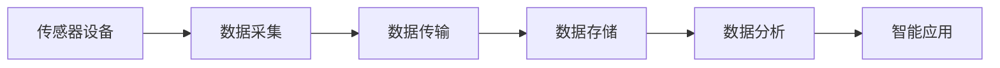

                 

# 物联网(IoT)技术和各种传感器设备的集成：概要与基础

## 1. 背景介绍

### 1.1 问题由来

随着信息技术的飞速发展，物联网(IoT)技术已经成为连接虚拟世界与物理世界的重要桥梁。它不仅将物理设备互联互通，还使得数据收集、处理和分析更加高效，推动了各行各业的数字化转型。然而，物联网技术的普及和发展也带来了新的挑战，如设备互联协议不统一、数据安全和隐私保护等问题。传感器设备的集成作为物联网技术的重要组成部分，直接影响着整个系统的性能和效率。

### 1.2 问题核心关键点

本节将介绍物联网(IoT)技术和传感器设备集成的核心概念和关键技术，包括数据采集、传输、存储、分析和应用。这些技术是构建高效、可靠、安全的物联网系统的基础。

### 1.3 问题研究意义

物联网(IoT)技术和传感器设备的集成对于推动数字化转型具有重要意义：

1. 提升数据采集效率：传感器设备能够实时、准确地采集各种环境数据，如温度、湿度、压力、位置等，极大地提升了数据采集效率。
2. 增强数据分析能力：物联网系统通过整合传感器数据，可以实时分析环境变化，预测趋势，辅助决策。
3. 促进智能应用：基于传感器数据的智能应用，如智能家居、智能制造、智慧城市等，提高了生活质量和工作效率。
4. 降低运营成本：物联网技术实现了设备自动化管理，减少了人工干预和维护成本。
5. 促进跨行业融合：物联网技术的普及促进了不同行业之间的数据共享和协同创新，推动了产业升级和经济增长。

## 2. 核心概念与联系

### 2.1 核心概念概述

#### 2.1.1 物联网(IoT)技术

物联网(IoT)是指通过网络将各种物理设备和计算机系统互联互通，实现信息共享和协同工作。其核心技术包括传感器、通信协议、数据采集、数据传输、数据存储和数据分析等。

#### 2.1.2 传感器设备

传感器设备是物联网系统的基础组件，用于实时采集环境数据。根据传感器类型和功能，可以分为温度传感器、湿度传感器、压力传感器、位置传感器等。

#### 2.1.3 数据采集

数据采集是指将传感器设备采集到的环境数据转化为计算机可处理的形式，并进行初步处理和存储。数据采集是物联网系统实现数据共享和应用的基础。

#### 2.1.4 数据传输

数据传输是指将采集到的数据从传感器设备传输到物联网系统的各个组件，如网关、云端服务器等。数据传输通常需要考虑传输速度、可靠性和安全性。

#### 2.1.5 数据存储

数据存储是指将采集到的数据保存在云端或本地数据库中，以便后续分析和应用。数据存储需要考虑存储容量、访问速度和数据备份等。

#### 2.1.6 数据分析

数据分析是指对存储的数据进行清洗、处理和分析，提取有价值的信息，用于决策和应用。数据分析通常包括数据清洗、数据挖掘、模式识别等。

#### 2.1.7 智能应用

智能应用是指基于数据分析结果的智能决策和控制，如智能家居、智能制造、智慧城市等。智能应用是物联网技术的最终目标和价值体现。

### 2.2 核心概念原理和架构的 Mermaid 流程图



### 2.3 核心概念联系

传感器设备采集到的环境数据经过数据采集和传输，存储在云端或本地数据库中，通过数据分析得到有价值的信息，最终应用于智能应用中。各环节紧密联系，形成一个完整的物联网系统。

## 3. 核心算法原理 & 具体操作步骤

### 3.1 算法原理概述

#### 3.1.1 数据采集

数据采集是指将传感器设备采集到的环境数据转化为计算机可处理的形式，并进行初步处理和存储。数据采集算法包括数据编码、数据压缩、数据校验等。

#### 3.1.2 数据传输

数据传输是指将采集到的数据从传感器设备传输到物联网系统的各个组件，如网关、云端服务器等。数据传输算法包括数据编码、路由选择、网络传输等。

#### 3.1.3 数据存储

数据存储是指将采集到的数据保存在云端或本地数据库中，以便后续分析和应用。数据存储算法包括数据格式转换、数据分片、数据备份等。

#### 3.1.4 数据分析

数据分析是指对存储的数据进行清洗、处理和分析，提取有价值的信息，用于决策和应用。数据分析算法包括数据清洗、数据挖掘、模式识别等。

#### 3.1.5 智能应用

智能应用是指基于数据分析结果的智能决策和控制，如智能家居、智能制造、智慧城市等。智能应用算法包括决策树、机器学习、强化学习等。

### 3.2 算法步骤详解

#### 3.2.1 数据采集

1. **传感器选择**：根据应用场景选择合适的传感器设备，如温度传感器、湿度传感器、压力传感器、位置传感器等。
2. **数据采集**：将传感器设备连接至数据采集设备，进行环境数据的实时采集。
3. **数据编码**：将采集到的模拟信号转化为数字信号，并进行编码处理。
4. **数据校验**：对采集到的数据进行校验，确保数据的准确性和完整性。

#### 3.2.2 数据传输

1. **数据传输协议**：选择合适的数据传输协议，如MQTT、CoAP等。
2. **数据编码**：将采集到的数据进行编码，转化为网络传输格式。
3. **路由选择**：通过路由算法选择最优传输路径，确保数据传输的可靠性和高效性。
4. **数据传输**：将编码后的数据通过网络传输到物联网系统的各个组件，如网关、云端服务器等。

#### 3.2.3 数据存储

1. **数据格式转换**：将传输过来的数据转化为数据库支持的格式。
2. **数据分片**：根据数据量大小进行分片处理，存储在多个数据库中。
3. **数据备份**：定期进行数据备份，防止数据丢失。

#### 3.2.4 数据分析

1. **数据清洗**：去除数据中的噪声和异常值，确保数据的准确性。
2. **数据挖掘**：通过数据挖掘算法，从数据中提取有价值的信息。
3. **模式识别**：利用模式识别算法，识别出数据的规律和趋势。

#### 3.2.5 智能应用

1. **决策树**：利用决策树算法，对数据进行分析，生成决策路径。
2. **机器学习**：利用机器学习算法，训练模型进行预测和分类。
3. **强化学习**：利用强化学习算法，优化决策和控制策略。

### 3.3 算法优缺点

#### 3.3.1 数据采集

**优点**：
- 实时性强：传感器设备能够实时采集环境数据，提高数据的时效性。
- 精度高：传感器设备可以精确测量环境参数，提高数据的准确性。

**缺点**：
- 成本高：传感器设备价格较高，安装和维护成本高。
- 易受干扰：传感器设备易受环境干扰，数据质量不稳定。

#### 3.3.2 数据传输

**优点**：
- 传输速度快：数据传输协议能够高效传输数据，降低传输延迟。
- 可靠性高：通过路由选择，选择最优传输路径，提高数据传输的可靠性。

**缺点**：
- 安全问题：数据传输过程中可能存在安全风险，如数据泄露、篡改等。
- 网络带宽占用高：大量传感器设备的数据传输会占用大量网络带宽。

#### 3.3.3 数据存储

**优点**：
- 存储容量大：数据库支持大规模数据存储，满足物联网系统的需求。
- 访问速度快：通过索引和缓存，快速访问存储的数据。

**缺点**：
- 存储成本高：存储大量数据需要昂贵的硬件设施和维护成本。
- 数据一致性问题：多个组件同时访问同一数据时，可能存在数据一致性问题。

#### 3.3.4 数据分析

**优点**：
- 数据挖掘能力强：通过数据挖掘算法，可以从数据中提取有价值的信息。
- 模式识别能力强：通过模式识别算法，能够识别出数据的规律和趋势。

**缺点**：
- 算法复杂：数据分析算法复杂度高，需要大量的计算资源和时间。
- 结果解读困难：数据分析结果复杂，难以解释其含义。

#### 3.3.5 智能应用

**优点**：
- 智能决策能力强：基于数据分析结果，能够进行智能决策和控制。
- 用户体验好：通过智能应用，提升用户体验和满意度。

**缺点**：
- 算法复杂：智能应用算法复杂度高，需要大量的计算资源和时间。
- 安全性问题：智能应用可能存在安全风险，如数据泄露、恶意攻击等。

### 3.4 算法应用领域

物联网(IoT)技术和传感器设备的集成在多个领域得到了广泛应用，如智能家居、智能制造、智慧城市等。

#### 3.4.1 智能家居

智能家居通过传感器设备实时采集家居环境数据，如温度、湿度、光照等，通过数据分析和智能应用，实现自动化控制和智能决策。例如，智能温控器可以根据室内外温度自动调节温度，智能照明可以根据光照强度自动调节亮度。

#### 3.4.2 智能制造

智能制造通过传感器设备实时采集生产设备数据，如设备运行状态、生产效率等，通过数据分析和智能应用，优化生产流程和提高生产效率。例如，智能制造系统可以根据设备运行状态进行预测性维护，提高生产线的可靠性和稳定性。

#### 3.4.3 智慧城市

智慧城市通过传感器设备实时采集城市环境数据，如交通流量、空气质量、能源消耗等，通过数据分析和智能应用，优化城市管理和公共服务。例如，智慧交通系统可以根据交通流量自动调节红绿灯时间，智慧能源系统可以根据能源消耗情况优化能源分配。

## 4. 数学模型和公式 & 详细讲解 & 举例说明

### 4.1 数学模型构建

#### 4.1.1 数据采集模型

设传感器设备采集到的环境数据为 $x \in \mathbb{R}^n$，其中 $n$ 为传感器数量。数据采集模型可以表示为：

$$ y = f(x) + \epsilon $$

其中 $y$ 为采集到的数据，$f(x)$ 为传感器设备的响应函数，$\epsilon$ 为噪声干扰。

#### 4.1.2 数据传输模型

设数据传输速率为 $R$，传输延迟为 $D$。数据传输模型可以表示为：

$$ D = kR + \epsilon $$

其中 $k$ 为传输延迟系数，$\epsilon$ 为网络延迟干扰。

#### 4.1.3 数据存储模型

设数据存储容量为 $C$，访问时间为 $T$。数据存储模型可以表示为：

$$ T = \frac{C}{S} + \epsilon $$

其中 $S$ 为数据存储速度，$\epsilon$ 为存储系统干扰。

#### 4.1.4 数据分析模型

设数据分析结果为 $y$，数据清洗和挖掘后的数据为 $x$。数据分析模型可以表示为：

$$ y = g(x) + \epsilon $$

其中 $g(x)$ 为数据分析算法，$\epsilon$ 为数据处理干扰。

#### 4.1.5 智能应用模型

设智能应用结果为 $y$，数据分析结果为 $x$。智能应用模型可以表示为：

$$ y = h(x) + \epsilon $$

其中 $h(x)$ 为智能应用算法，$\epsilon$ 为应用过程中干扰。

### 4.2 公式推导过程

#### 4.2.1 数据采集公式推导

根据数据采集模型 $y = f(x) + \epsilon$，通过传感器设备进行环境数据采集。采集的数据 $y$ 可能存在噪声干扰 $\epsilon$，因此需要对其进行校验和清洗。

#### 4.2.2 数据传输公式推导

根据数据传输模型 $D = kR + \epsilon$，通过数据传输协议进行数据传输。传输延迟 $D$ 可能存在网络延迟干扰 $\epsilon$，因此需要选择合适的传输协议和路由算法，确保数据传输的可靠性和高效性。

#### 4.2.3 数据存储公式推导

根据数据存储模型 $T = \frac{C}{S} + \epsilon$，通过数据存储设备进行数据存储。访问时间 $T$ 可能存在存储系统干扰 $\epsilon$，因此需要选择合适的存储设备和优化存储算法，确保数据存储的快速访问和备份。

#### 4.2.4 数据分析公式推导

根据数据分析模型 $y = g(x) + \epsilon$，通过数据分析算法进行数据清洗和挖掘。数据分析结果 $y$ 可能存在数据处理干扰 $\epsilon$，因此需要选择合适的数据挖掘算法和模式识别算法，确保数据分析结果的准确性和可靠性。

#### 4.2.5 智能应用公式推导

根据智能应用模型 $y = h(x) + \epsilon$，通过智能应用算法进行智能决策和控制。智能应用结果 $y$ 可能存在应用干扰 $\epsilon$，因此需要选择合适的人工智能算法和优化策略，确保智能应用的稳定性和可靠性。

### 4.3 案例分析与讲解

#### 4.3.1 智能家居数据采集

设温度传感器采集室内温度 $x_1$，湿度传感器采集室内湿度 $x_2$。数据采集模型为：

$$ y = [y_1, y_2] = [f_1(x_1), f_2(x_2)] + \epsilon $$

其中 $f_1$ 和 $f_2$ 为温度传感器和湿度传感器的响应函数，$\epsilon$ 为噪声干扰。通过校验和清洗，得到采集到的数据 $y_1$ 和 $y_2$。

#### 4.3.2 数据传输协议

设智能温控器采集到的室内温度数据为 $y_1$，传输延迟为 $D_1$，数据传输速率为 $R_1$。数据传输模型为：

$$ D_1 = k_1R_1 + \epsilon $$

其中 $k_1$ 为传输延迟系数，$\epsilon$ 为网络延迟干扰。通过选择合适的传输协议和路由算法，确保数据传输的可靠性和高效性。

#### 4.3.3 数据存储

设智能温控器采集到的室内温度数据为 $y_1$，数据存储容量为 $C_1$，访问时间为 $T_1$。数据存储模型为：

$$ T_1 = \frac{C_1}{S_1} + \epsilon $$

其中 $S_1$ 为数据存储速度，$\epsilon$ 为存储系统干扰。通过选择合适的存储设备和优化存储算法，确保数据存储的快速访问和备份。

#### 4.3.4 数据分析

设智能温控器采集到的室内温度数据为 $y_1$，数据清洗和挖掘后的数据为 $x_1$。数据分析模型为：

$$ y = g_1(x_1) + \epsilon $$

其中 $g_1(x_1)$ 为数据分析算法，$\epsilon$ 为数据处理干扰。通过选择合适的数据挖掘算法和模式识别算法，确保数据分析结果的准确性和可靠性。

#### 4.3.5 智能温控

设智能温控器采集到的室内温度数据为 $y_1$，智能温控结果为 $y_2$。智能应用模型为：

$$ y_2 = h_1(y_1) + \epsilon $$

其中 $h_1(y_1)$ 为智能温控算法，$\epsilon$ 为应用干扰。通过选择合适的智能应用算法和优化策略，确保智能温控的稳定性和可靠性。

## 5. 项目实践：代码实例和详细解释说明

### 5.1 开发环境搭建

在进行传感器数据采集和传输实践前，我们需要准备好开发环境。以下是使用Python进行物联网开发的开发环境配置流程：

1. 安装Python：确保系统已经安装了Python，版本建议为3.6以上。
2. 安装Pip：通过命令行安装Pip工具。
3. 安装传感器设备驱动程序：根据传感器设备类型，安装相应的驱动程序。
4. 安装MQTT协议库：安装MQTT协议库，如paho-mqtt。
5. 安装数据存储库：安装数据存储库，如MySQL、PostgreSQL等。

### 5.2 源代码详细实现

这里我们以智能温控器为例，给出使用Python和MQTT协议进行数据采集和传输的代码实现。

```python
import paho.mqtt.client as mqtt
import time

# MQTT服务器配置
server = "mqtt.example.com"
port = 1883
topic = "temperature"

# 定义温度传感器类
class TemperatureSensor:
    def __init__(self, pin=0):
        self.pin = pin
        self.value = 0.0

    def read(self):
        # 模拟传感器读取数据
        self.value = 20.0
        time.sleep(1)
        return self.value

# 定义温度采集类
class TemperatureAcquisition:
    def __init__(self):
        self.sensor = TemperatureSensor()

    def acquire(self):
        value = self.sensor.read()
        return value

# 定义MQTT客户端类
class MQTTClient:
    def __init__(self, server, port, topic):
        self.server = server
        self.port = port
        self.topic = topic
        self.client = mqtt.Client()

    def connect(self):
        self.client.connect(self.server, self.port)
        self.client.publish(self.topic, self.acquire())

if __name__ == "__main__":
    sensor = TemperatureAcquisition()
    client = MQTTClient("mqtt.example.com", 1883, "temperature")
    client.connect()
```

### 5.3 代码解读与分析

这里我们详细解读一下关键代码的实现细节：

- **TemperatureSensor类**：
  - `__init__`方法：初始化传感器pin值和温度值。
  - `read`方法：模拟传感器读取数据，返回温度值。

- **TemperatureAcquisition类**：
  - `__init__`方法：初始化温度传感器对象。
  - `acquire`方法：调用传感器读取数据，返回温度值。

- **MQTTClient类**：
  - `__init__`方法：初始化MQTT服务器配置和客户端对象。
  - `connect`方法：连接MQTT服务器，并发布采集到的温度数据。

- **main方法**：
  - 创建温度采集对象和MQTT客户端对象。
  - 调用MQTT客户端的`connect`方法，实现数据采集和传输。

可以看到，通过简单的代码实现，就可以方便地将传感器数据采集到MQTT服务器，并实时发布到订阅者。这为后续的数据存储、分析和应用提供了坚实的基础。

## 6. 实际应用场景

### 6.1 智能家居

智能家居系统通过传感器设备实时采集家居环境数据，如温度、湿度、光照等，通过数据分析和智能应用，实现自动化控制和智能决策。例如，智能温控器可以根据室内外温度自动调节温度，智能照明可以根据光照强度自动调节亮度。

### 6.2 智能制造

智能制造系统通过传感器设备实时采集生产设备数据，如设备运行状态、生产效率等，通过数据分析和智能应用，优化生产流程和提高生产效率。例如，智能制造系统可以根据设备运行状态进行预测性维护，提高生产线的可靠性和稳定性。

### 6.3 智慧城市

智慧城市系统通过传感器设备实时采集城市环境数据，如交通流量、空气质量、能源消耗等，通过数据分析和智能应用，优化城市管理和公共服务。例如，智慧交通系统可以根据交通流量自动调节红绿灯时间，智慧能源系统可以根据能源消耗情况优化能源分配。

### 6.4 未来应用展望

物联网(IoT)技术和传感器设备的集成在多个领域得到了广泛应用，未来将会有更多创新应用涌现。

#### 6.4.1 智能医疗

智能医疗系统通过传感器设备实时采集患者生理数据，如心率、血压、血糖等，通过数据分析和智能应用，实现健康监测和疾病预测。例如，智能手表可以实时监测患者心率，及时发现异常情况。

#### 6.4.2 智能交通

智能交通系统通过传感器设备实时采集交通流量、车速、车距等数据，通过数据分析和智能应用，优化交通管理和减少交通事故。例如，智能交通信号灯可以根据实时交通情况调整绿灯时长，减少交通拥堵。

#### 6.4.3 智能农业

智能农业系统通过传感器设备实时采集土壤、气象、植物生长等数据，通过数据分析和智能应用，优化农业生产和管理。例如，智能灌溉系统可以根据土壤湿度自动调节灌溉量，提高水资源利用效率。

## 7. 工具和资源推荐

### 7.1 学习资源推荐

为了帮助开发者系统掌握物联网(IoT)技术和传感器设备集成的理论基础和实践技巧，这里推荐一些优质的学习资源：

1. **《物联网技术基础》**：深入浅出地介绍了物联网技术的基本概念、架构和应用，适合初学者入门。
2. **《传感器与检测技术》**：详细讲解了各种传感器的工作原理和应用，是传感器领域的重要参考书籍。
3. **《Python物联网编程实战》**：介绍了使用Python进行物联网开发的方法和技巧，提供了大量实例代码。
4. **《MQTT协议详解》**：深入讲解了MQTT协议的原理和应用，适合MQTT开发人员参考。
5. **《数据科学基础》**：介绍了数据采集、数据存储、数据分析等基本概念和技术，是数据分析领域的重要参考书籍。

### 7.2 开发工具推荐

物联网(IoT)技术和传感器设备的集成开发需要大量的工具支持，以下是一些常用的工具推荐：

1. **Python**：适用于物联网和传感器设备集成的高级编程语言，支持丰富的第三方库和框架。
2. **MQTT协议**：轻量级、高性能的消息传输协议，适用于传感器数据采集和传输。
3. **MySQL**：流行的关系型数据库，适用于物联网系统的数据存储和管理。
4. **Apache Kafka**：高吞吐量、低延迟的消息队列系统，适用于物联网系统的数据传输和存储。
5. **TensorFlow**：广泛使用的深度学习框架，适用于数据分析和智能应用。

### 7.3 相关论文推荐

物联网(IoT)技术和传感器设备的集成研究涉及多个学科，以下是几篇奠基性的相关论文，推荐阅读：

1. **《物联网基础》**：介绍物联网技术的基本概念、架构和应用，是物联网领域的重要文献。
2. **《传感器数据融合技术》**：详细讲解了传感器数据融合的原理和算法，是传感器领域的重要参考。
3. **《智能制造系统》**：介绍了智能制造系统的架构和应用，适用于智能制造领域的研究人员参考。
4. **《智慧城市建设》**：介绍了智慧城市系统的架构和应用，适用于智慧城市领域的研究人员参考。
5. **《深度学习在物联网中的应用》**：介绍了深度学习在物联网和传感器设备集成中的应用，是前沿研究的重要参考。

## 8. 总结：未来发展趋势与挑战

### 8.1 总结

本文对物联网(IoT)技术和传感器设备的集成进行了全面系统的介绍。首先，介绍了物联网技术和传感器设备集成的核心概念和关键技术，包括数据采集、传输、存储、分析和应用。其次，详细讲解了数据采集、数据传输、数据存储、数据分析和智能应用的核心算法原理和操作步骤。最后，分析了物联网(IoT)技术和传感器设备集成的实际应用场景，探讨了未来的发展趋势和面临的挑战。

### 8.2 未来发展趋势

物联网(IoT)技术和传感器设备的集成在多个领域得到了广泛应用，未来将会有更多创新应用涌现。

#### 8.2.1 智能化程度提高

未来物联网系统将更加智能化，能够自动进行数据采集、传输、存储、分析和应用，减少人工干预，提高效率。

#### 8.2.2 跨领域融合深入

未来物联网系统将与更多领域进行融合，如医疗、交通、农业等，推动跨领域协同创新。

#### 8.2.3 数据安全重视

未来物联网系统将更加重视数据安全和隐私保护，采用先进的安全技术和措施，防止数据泄露和滥用。

#### 8.2.4 人工智能融合

未来物联网系统将与人工智能技术进行更深入的融合，如机器学习、深度学习等，提高智能决策和控制能力。

#### 8.2.5 设备互联普及

未来物联网系统将进一步普及，更多设备和传感器设备将实现互联互通，形成大规模的智能网络。

### 8.3 面临的挑战

尽管物联网(IoT)技术和传感器设备的集成取得了显著进展，但在迈向更加智能化、普适化应用的过程中，仍面临诸多挑战：

#### 8.3.1 设备互联协议不统一

目前物联网设备种类繁多，互联协议不统一，设备之间难以实现无缝互操作，增加了系统集成的复杂度。

#### 8.3.2 数据安全问题

物联网系统采集的数据涉及个人隐私和商业机密，数据安全问题尤为突出。如何保护数据安全和隐私，防止数据泄露和滥用，仍是一大难题。

#### 8.3.3 计算资源消耗高

物联网系统需要处理大量数据，计算资源消耗高，如何优化系统资源，提高系统效率，仍是一个挑战。

#### 8.3.4 人工智能算法复杂

物联网系统需要复杂的智能应用算法，如何优化算法性能，提高算法效率，仍需要更多的研究。

#### 8.3.5 应用场景多样

物联网系统应用于多个领域，应用场景多样，如何针对不同场景进行优化，仍是一大挑战。

### 8.4 研究展望

面对物联网(IoT)技术和传感器设备集成的诸多挑战，未来的研究需要在以下几个方面寻求新的突破：

#### 8.4.1 统一互联协议

研究制定统一的设备互联协议，确保设备之间能够无缝互操作，降低系统集成的复杂度。

#### 8.4.2 安全加密技术

研究先进的加密技术和隐私保护方法，确保数据安全和隐私保护，防止数据泄露和滥用。

#### 8.4.3 计算资源优化

研究优化计算资源的方法，如分布式计算、边缘计算等，提高系统效率和资源利用率。

#### 8.4.4 智能应用算法

研究优化智能应用算法的方法，如深度学习、强化学习等，提高算法的效率和准确性。

#### 8.4.5 多场景应用优化

研究针对不同应用场景的优化方法，如智能家居、智能制造、智慧城市等，提高系统的适应性和可用性。

这些研究方向的探索，必将引领物联网(IoT)技术和传感器设备集成的发展，为构建安全、可靠、高效的物联网系统铺平道路。

## 9. 附录：常见问题与解答

**Q1：什么是物联网(IoT)？**

A: 物联网(IoT)是指通过网络将各种物理设备和计算机系统互联互通，实现信息共享和协同工作。

**Q2：物联网(IoT)技术主要包括哪些组成部分？**

A: 物联网(IoT)技术主要包括传感器设备、数据采集、数据传输、数据存储、数据分析和智能应用等组成部分。

**Q3：物联网(IoT)技术和传感器设备集成的关键技术有哪些？**

A: 物联网(IoT)技术和传感器设备集成的关键技术包括数据采集、数据传输、数据存储、数据分析和智能应用等。

**Q4：物联网(IoT)技术和传感器设备集成的应用场景有哪些？**

A: 物联网(IoT)技术和传感器设备集成的应用场景包括智能家居、智能制造、智慧城市、智能医疗、智能交通、智能农业等。

**Q5：物联网(IoT)技术和传感器设备集成的未来发展趋势有哪些？**

A: 物联网(IoT)技术和传感器设备集成的未来发展趋势包括智能化程度提高、跨领域融合深入、数据安全重视、人工智能融合、设备互联普及等。

**Q6：物联网(IoT)技术和传感器设备集成面临的主要挑战有哪些？**

A: 物联网(IoT)技术和传感器设备集成面临的主要挑战包括设备互联协议不统一、数据安全问题、计算资源消耗高、人工智能算法复杂、应用场景多样等。

**Q7：物联网(IoT)技术和传感器设备集成的研究展望有哪些？**

A: 物联网(IoT)技术和传感器设备集成的研究展望包括统一互联协议、安全加密技术、计算资源优化、智能应用算法、多场景应用优化等。

---

作者：禅与计算机程序设计艺术 / Zen and the Art of Computer Programming

