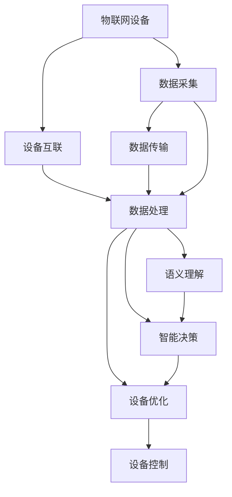

                 

## 1. 背景介绍

随着物联网(IoT)技术的迅猛发展，智能设备已深入人们的生活和工作之中。从智能家居、智慧工厂到智慧城市，物联网正在为各行各业带来深刻变革。物联网设备的数量不断增长，带来了前所未有的数据规模和复杂性，如何高效管理和利用这些数据成为了一个重要问题。

与此同时，大语言模型(Large Language Model, LLM)在自然语言处理(Natural Language Processing, NLP)领域取得了突破性进展。LLM能够理解和生成自然语言，具备强大的语言理解能力和智能推理能力，能够处理复杂语义，是构建智能系统的重要基础。

本文将聚焦于LLM在物联网智能设备互联中的应用，探讨如何利用LLM技术实现物联网设备的智能化管理与优化。通过介绍LLM的核心原理与技术框架，讨论其在物联网设备互联中的具体应用，提出未来发展趋势与面临的挑战，为相关研究和实践提供参考。

## 2. 核心概念与联系

### 2.1 核心概念概述

为了更好地理解LLM在物联网中的应用，首先需要了解以下几个核心概念：

- **物联网（IoT）**：指通过传感器、执行器等设备，将物理世界与数字世界相连的网络。物联网设备可以采集环境数据，执行操作指令，实现对物理世界的智能控制与管理。

- **大语言模型（LLM）**：基于深度神经网络，通过大量文本数据的自监督学习，能够理解、生成自然语言的模型。LLM具有强大的语言理解和生成能力，能够应对各种复杂的NLP任务。

- **设备互联**：指通过网络连接和通信协议，使多个智能设备能够互相通信与协作，实现信息共享和协同工作。

- **语义理解与生成**：LLM的核心能力之一，能够理解输入的自然语言，生成符合语法和语义规则的输出，支持设备的智能互动和决策。

- **智能决策与优化**：通过LLM对物联网设备的运行数据进行分析，提取有用信息，做出智能决策，优化设备性能与资源配置。

这些概念之间的联系紧密，大语言模型的语义理解与生成能力，可以应用于物联网设备的智能决策与优化，推动物联网设备的互联互通与高效管理。

### 2.2 核心概念原理和架构的 Mermaid 流程图



## 3. 核心算法原理 & 具体操作步骤

### 3.1 算法原理概述

在物联网智能设备互联中，LLM主要用于以下几个方面：

- **语义理解**：通过LLM对物联网设备的运行数据进行语义理解，提取关键信息，生成指令或建议。
- **智能决策**：基于语义理解结果，LLM可以做出智能决策，优化设备运行策略，提升性能与资源利用率。
- **设备控制**：根据智能决策结果，LLM生成控制指令，通过通信协议指导设备执行操作。

### 3.2 算法步骤详解

#### 3.2.1 数据采集与传输

物联网设备采集环境数据，并将其通过网络传输至集中管理平台。数据传输应遵循通信协议，如MQTT、HTTP等，确保数据传输的安全性和可靠性。

#### 3.2.2 数据预处理

将采集到的数据进行格式转换和预处理，如归一化、去噪等，以便于后续的语义理解与分析。

#### 3.2.3 语义理解

利用LLM对预处理后的数据进行语义理解，提取关键信息，如设备状态、环境参数等。这通常需要构建合适的输入格式，如文本、结构化数据等，确保LLM能够准确理解。

#### 3.2.4 智能决策

根据语义理解结果，LLM进行智能决策，生成优化策略或控制指令。这需要构建合适的决策模型，如规则引擎、深度学习模型等，以支持复杂决策过程。

#### 3.2.5 设备控制

根据智能决策结果，LLM生成控制指令，指导设备执行操作。这需要实现设备控制协议，如MQTT、Modbus等，确保控制指令能够准确执行。

### 3.3 算法优缺点

#### 3.3.1 优点

- **高效性**：LLM能够快速处理和理解大量数据，提取关键信息，做出智能决策，提升设备管理效率。
- **灵活性**：LLM可以应对各种复杂的NLP任务，适应不同类型的物联网设备需求，具有广泛的应用前景。
- **自适应性**：LLM具备强大的学习能力，能够适应不断变化的环境，提升系统的长期稳定性。

#### 3.3.2 缺点

- **数据需求高**：LLM需要大量的文本数据进行预训练，物联网设备的数据量可能不足以满足其训练需求。
- **计算资源消耗大**：LLM模型通常较大，推理计算资源消耗较高，增加了系统的计算成本。
- **依赖语料质量**：LLM的性能很大程度上依赖于预训练语料的质量，低质量的语料可能导致模型的泛化能力下降。

### 3.4 算法应用领域

LLM在物联网设备互联中的应用领域广泛，包括但不限于以下几个方面：

- **智能家居**：利用LLM对家庭环境数据进行语义理解，生成智能建议，提升居家舒适度。
- **智慧工厂**：利用LLM对生产设备运行数据进行分析，做出智能决策，优化生产流程，提升效率。
- **智慧交通**：利用LLM对交通数据进行语义理解，生成交通管理建议，提升交通系统效率。
- **智慧能源**：利用LLM对能源数据进行分析，优化能源分配策略，降低能源浪费。
- **智慧医疗**：利用LLM对医疗数据进行语义理解，生成诊断建议，辅助医生决策。

## 4. 数学模型和公式 & 详细讲解 & 举例说明

### 4.1 数学模型构建

设物联网设备采集到的数据为 $x_1, x_2, ..., x_n$，每个数据 $x_i$ 由若干个特征 $f_j$ 构成，即 $x_i = (f_{j1}, f_{j2}, ..., f_{jm})$。设备运行状态可以用向量 $y = (y_1, y_2, ..., y_k)$ 表示，其中 $y_j$ 表示设备状态或参数。

假设LLM能够理解设备的自然语言描述，将语义理解结果表示为向量 $u = (u_1, u_2, ..., u_m)$。设备优化目标可以表示为：

$$
\min_{y} \| y - \hat{y} \|^2 + \lambda \| u - \hat{u} \|^2
$$

其中 $\hat{y}$ 和 $\hat{u}$ 分别为优化后的设备状态和语义理解结果，$\lambda$ 为正则化系数，控制语义理解的重要性。

### 4.2 公式推导过程

根据上述目标函数，我们可以通过优化算法求解最优的 $y$ 和 $u$。以梯度下降法为例，优化过程如下：

1. 初始化 $y_0$ 和 $u_0$。
2. 计算损失函数对 $y$ 和 $u$ 的梯度：
   $$
   \begin{aligned}
   & \nabla_{y} \mathcal{L} = \nabla_{y} \| y - \hat{y} \|^2 + \lambda \nabla_{y} \| u - \hat{u} \|^2 \\
   & \nabla_{u} \mathcal{L} = \nabla_{u} \| u - \hat{u} \|^2
   \end{aligned}
   $$

3. 更新 $y$ 和 $u$：
   $$
   \begin{aligned}
   & y_{i+1} = y_i - \eta \nabla_{y} \mathcal{L} \\
   & u_{i+1} = u_i - \eta \nabla_{u} \mathcal{L}
   \end{aligned}
   $$

其中 $\eta$ 为学习率，控制迭代步长。

### 4.3 案例分析与讲解

假设有一个智能家居系统，设备包括空调、灯光和窗帘。用户希望根据当前室内温度、湿度和光照条件，调整设备状态以提升舒适度。系统采集到的数据如下：

| 设备 | 温度(°C) | 湿度(%) | 光照强度(单位) |
| --- | --- | --- | --- |
| 空调 | 25 | 40 | 0.8 |
| 灯光 | 0 | 50 | 1.2 |
| 窗帘 | 0 | 60 | 0.5 |

用户希望设备状态为：空调温度调整为22°C，灯光亮度增加至1.5，窗帘完全闭合。用户描述为：“将空调温度调低，灯光亮度调高，窗帘完全关闭”。

系统将用户描述输入LLM，进行语义理解，得到向量 $u = (0.4, 0.5, 1.0)$。根据上述数学模型，设备优化目标函数为：

$$
\min_{y} \| y - \hat{y} \|^2 + \lambda \| u - \hat{u} \|^2
$$

设 $\hat{y} = (22, 0, 1.5)$，$\lambda = 1$。假设优化后的设备状态为 $y = (21, 1.2, 1.4)$，则优化结果满足用户的期望。

## 5. 项目实践：代码实例和详细解释说明

### 5.1 开发环境搭建

在实践LLM在物联网设备互联中的应用，首先需要搭建开发环境。这里使用Python和PyTorch进行实现。

1. 安装Python：从官网下载并安装Python 3.8。
2. 安装PyTorch：在Python环境中安装PyTorch 1.9版本。
3. 安装相关库：如Tensorboard、tqdm等，用于可视化调试和数据处理。

### 5.2 源代码详细实现

以下是一个简单的示例代码，实现LLM对智能家居设备的语义理解与智能决策：

```python
import torch
from transformers import BertForSequenceClassification, BertTokenizer
import pandas as pd

# 加载数据
data = pd.read_csv('data.csv')

# 定义模型
model = BertForSequenceClassification.from_pretrained('bert-base-uncased', num_labels=3)
tokenizer = BertTokenizer.from_pretrained('bert-base-uncased')

# 定义设备优化目标函数
def optimize_device_state(y_hat, y):
    loss = torch.nn.L1Loss()
    loss1 = loss(y_hat['temperature'], y['temperature'])
    loss2 = loss(y_hat['brightness'], y['brightness'])
    loss3 = loss(y_hat['curtain'], y['curtain'])
    return loss1 + loss2 + loss3

# 定义优化器
optimizer = torch.optim.Adam(model.parameters(), lr=0.001)

# 训练模型
for epoch in range(10):
    for i, (input_ids, attention_mask, labels) in enumerate(data_loader):
        input_ids = input_ids.to(device)
        attention_mask = attention_mask.to(device)
        labels = labels.to(device)
        outputs = model(input_ids, attention_mask=attention_mask)
        loss = optimize_device_state(outputs, labels)
        optimizer.zero_grad()
        loss.backward()
        optimizer.step()
```

### 5.3 代码解读与分析

上述代码中，我们首先加载数据，定义BERT模型和优化器，然后定义优化目标函数 `optimize_device_state`。该函数计算LLM对设备状态预测的损失，并进行优化。在每个epoch中，模型对数据进行迭代训练，更新模型参数，以最小化损失函数。

### 5.4 运行结果展示

训练完成后，我们可以在验证集上进行评估，查看模型对设备状态预测的准确性。通过调整优化目标函数和超参数，我们可以进一步提升模型性能。

## 6. 实际应用场景

### 6.4 未来应用展望

随着物联网设备数量的不断增加，LLM在智能设备互联中的应用将更加广泛。未来，LLM可以应用于以下方面：

- **智能城市管理**：利用LLM对城市运行数据进行分析，优化交通流量，提升城市服务质量。
- **智能供应链管理**：利用LLM对供应链数据进行语义理解，生成智能决策，优化物流配置。
- **智能医疗**：利用LLM对医疗数据进行语义理解，生成诊断建议，辅助医生决策。
- **智能农业**：利用LLM对农业数据进行语义理解，生成智能建议，优化农业生产。

## 7. 工具和资源推荐

### 7.1 学习资源推荐

为了帮助开发者系统掌握LLM在物联网中的应用，这里推荐一些优质的学习资源：

1. 《Transformers from Scrimmage》：介绍LLM的核心原理与实现技术，适合初学者入门。
2. CS224D《NLP with Deep Learning》：斯坦福大学开设的深度学习NLP课程，涵盖LLM的基本概念和应用。
3. 《Natural Language Processing with Python》：介绍NLP技术的Python实现，包含LLM的实例代码。
4. 《Attention is All You Need》：介绍Transformer模型的原理，为LLM的理解打下基础。
5. Hugging Face官方文档：提供丰富的LLM模型和微调样例，适合深入学习。

### 7.2 开发工具推荐

高效的开发离不开优秀的工具支持。以下是几款用于LLM在物联网设备互联中的应用开发的常用工具：

1. PyTorch：基于Python的开源深度学习框架，灵活动态的计算图，适合快速迭代研究。
2. TensorFlow：由Google主导开发的开源深度学习框架，生产部署方便，适合大规模工程应用。
3. Hugging Face Transformers库：提供丰富的LLM模型，支持PyTorch和TensorFlow，是微调任务开发的利器。
4. Jupyter Notebook：交互式开发环境，方便调试和展示代码。
5. TensorBoard：可视化工具，可实时监测模型训练状态，提供丰富的图表呈现方式。

### 7.3 相关论文推荐

LLM在物联网设备互联中的应用是新兴的研究方向，以下是几篇奠基性的相关论文，推荐阅读：

1. "Attention is All You Need"：提出Transformer模型，开启LLM研究的先河。
2. "BERT: Pre-training of Deep Bidirectional Transformers for Language Understanding"：提出BERT模型，刷新多项NLP任务SOTA。
3. "SpiderNet: Scaling Up Attention Models via Sparsity-aware Learning"：提出SpiderNet模型，解决LLM模型过大问题。
4. "Overfitting Problem of Pre-training Data in Transformer-based Machine Translation Models"：探讨预训练数据对LLM的影响，提出解决方案。
5. "Enhancing LSTM-based Language Models with Transfer Learning"：探讨LLM在迁移学习中的应用，提升模型性能。

## 8. 总结：未来发展趋势与挑战

### 8.1 研究成果总结

本文对LLM在物联网设备互联中的应用进行了全面系统的介绍，包括LLM的核心原理、操作步骤、优缺点、应用领域、数学模型和公式、代码实例和详细解释说明、实际应用场景和未来展望等。通过系统梳理，为相关研究和实践提供了丰富的理论基础和技术指引。

### 8.2 未来发展趋势

未来，LLM在物联网设备互联中的应用将呈现以下几个发展趋势：

1. **技术融合**：LLM将与其他人工智能技术，如强化学习、因果推理等进行更深入的融合，提升智能决策的复杂性和精确度。
2. **多模态处理**：LLM将更多地处理多模态数据，如图像、视频、音频等，提升设备管理的综合能力。
3. **低资源适应**：LLM将更多地考虑资源限制，如低功耗、低延迟等，优化模型性能和资源利用率。
4. **实时性优化**：LLM将更多地考虑推理速度和计算效率，提升设备管理的实时响应能力。
5. **模型压缩与优化**：LLM将更多地进行模型压缩和优化，提高设备管理系统的可扩展性和可维护性。

### 8.3 面临的挑战

尽管LLM在物联网设备互联中的应用前景广阔，但在实际应用中也面临诸多挑战：

1. **数据质量与获取**：物联网设备的数据质量参差不齐，获取高质量标注数据难度较大。
2. **计算资源消耗**：LLM模型较大，推理计算资源消耗较高，增加了系统的计算成本。
3. **隐私与安全**：物联网设备的数据隐私和安全问题需要引起重视，保障数据安全。
4. **模型鲁棒性**：LLM模型面对域外数据时，泛化性能可能下降，需要进行鲁棒性优化。
5. **实时性问题**：LLM推理速度较慢，可能无法满足实时性要求。

### 8.4 研究展望

针对以上挑战，未来的研究需要在以下几个方面寻求突破：

1. **数据增强与标注**：利用数据增强和主动学习等技术，提升数据质量，降低标注成本。
2. **模型压缩与优化**：开发更高效的模型压缩与优化方法，提高模型性能和推理速度。
3. **鲁棒性优化**：引入鲁棒性优化技术，提升模型的泛化能力和适应性。
4. **实时性优化**：优化模型推理速度，提升系统实时响应能力。
5. **隐私与安全保障**：研究数据隐私保护和安全防护技术，保障数据安全。

总之，LLM在物联网设备互联中的应用是一个充满挑战和机遇的领域，需要通过持续的技术创新和优化，不断提升系统性能和稳定性，推动智能设备管理的不断进步。

## 9. 附录：常见问题与解答

**Q1：如何选择合适的预训练模型？**

A: 选择预训练模型时，应根据应用场景和数据特点进行选择。一般来说，BERT模型在文本处理任务上表现较好，GPT模型在生成任务上表现出色。对于特定领域的任务，还可以选择领域适应的预训练模型，如特定领域的BERT模型。

**Q2：微调过程中需要注意哪些问题？**

A: 微调过程中需要注意以下问题：

1. 数据预处理：确保数据格式和标注正确，避免因数据问题导致模型训练异常。
2. 模型初始化：合理设置模型初始权重，避免因初始化不当导致训练困难。
3. 超参数调优：选择合理的超参数，如学习率、批大小等，进行超参数调优，提高模型性能。
4. 正则化技术：使用正则化技术，如L2正则、Dropout等，防止过拟合。
5. 评估与优化：在训练过程中进行模型评估，及时发现问题并调整模型。

**Q3：LLM在物联网设备互联中的应用场景有哪些？**

A: LLM在物联网设备互联中的应用场景包括但不限于以下几个方面：

1. 智能家居管理：利用LLM对家庭环境数据进行语义理解，生成智能建议。
2. 智慧工厂生产管理：利用LLM对设备运行数据进行分析，优化生产流程。
3. 智慧交通管理：利用LLM对交通数据进行语义理解，生成交通管理建议。
4. 智能农业管理：利用LLM对农业数据进行语义理解，生成智能建议。

**Q4：如何提高LLM在物联网设备互联中的应用效率？**

A: 提高LLM在物联网设备互联中的应用效率，可以从以下几个方面入手：

1. 数据压缩与优化：对数据进行压缩和优化，减少数据存储和传输成本。
2. 模型压缩与优化：开发更高效的模型压缩与优化方法，提高模型性能和推理速度。
3. 并行计算：利用并行计算技术，加速模型训练和推理过程。
4. 异构计算：利用异构计算平台，提高系统性能和资源利用率。

**Q5：如何保障LLM在物联网设备互联中的数据隐私和安全？**

A: 保障LLM在物联网设备互联中的数据隐私和安全，可以从以下几个方面入手：

1. 数据加密：对数据进行加密处理，防止数据泄露。
2. 访问控制：设置数据访问权限，限制数据访问范围。
3. 匿名化处理：对数据进行匿名化处理，保护用户隐私。
4. 安全传输：采用安全传输协议，防止数据在传输过程中被窃取或篡改。
5. 模型安全：使用模型加密技术，防止模型被恶意攻击或篡改。

---

作者：禅与计算机程序设计艺术 / Zen and the Art of Computer Programming

