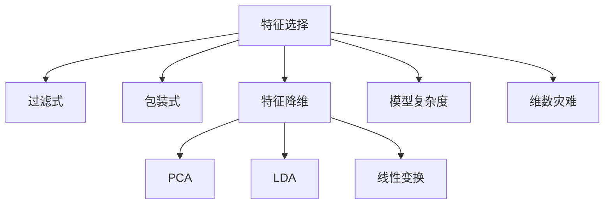

                 

## 1. 背景介绍

特征选择和特征降维是机器学习和数据科学中两个重要的预处理技术，旨在优化模型性能，提升计算效率，并减少数据维度。无论是在推荐系统、图像识别、自然语言处理等领域的广泛应用中，还是在数据挖掘、生物信息学、社会科学等不同学科的研究中，特征选择和特征降维都是必不可少的重要步骤。

### 1.1 问题由来
在现代数据科学中，获取大量数据已成为常态，数据特征维度往往非常高，导致数据集的复杂性和计算负担增加。为了应对这一问题，人们提出了特征选择和特征降维的概念。特征选择是针对已有数据集，剔除不相关或冗余的特征，以提升模型性能。特征降维则是将高维数据映射到低维空间，便于数据可视化和模型训练。

### 1.2 问题核心关键点
特征选择和特征降维的核心在于：
1. 鉴别和剔除不相关或冗余的特征，优化模型性能。
2. 将高维数据映射到低维空间，减少计算负担。
3. 提升数据质量和解释能力，增强模型的泛化能力。

这两个过程的实现，涉及到复杂的算法、模型和数学原理。在实际应用中，需兼顾数据的特点、模型的需求和计算资源的限制。本文档将对这两个核心问题进行深入分析，并通过实例进行详细讲解。

## 2. 核心概念与联系

### 2.1 核心概念概述

在深入探讨特征选择和特征降维原理之前，首先需要了解以下核心概念：

- **特征选择（Feature Selection）**：从原始特征集中筛选出最相关的特征，用于构建模型。分为过滤式（Filter Method）和包装式（Wrapper Method）两种策略。
- **特征降维（Feature Reduction）**：通过数学变换，将高维数据映射到低维空间，减少计算负担，便于模型训练。如主成分分析（PCA）、线性判别分析（LDA）等方法。
- **过滤式特征选择（Filter Method）**：独立于模型的特征选择方法，如卡方检验、互信息、相关系数等。
- **包装式特征选择（Wrapper Method）**：基于模型性能的特征选择方法，如递归特征消除、正则化等。
- **模型复杂度（Model Complexity）**：模型包含参数的数量，复杂度越高，计算负担越大，泛化能力可能越差。
- **维数灾难（Curse of Dimensionality）**：当特征维度较高时，数据集的复杂性和模型性能显著下降的问题。

这些概念之间的逻辑关系可以通过以下Mermaid流程图来展示：



这个流程图展示了这个领域的主要概念及其之间的关系：

1. 特征选择和特征降维是从原始数据中提取有价值特征的过程。
2. 过滤式和包装式特征选择是两种主要的策略。
3. 特征降维包含多种数学变换，如PCA、LDA等。
4. 模型复杂度和维数灾难是影响特征选择和特征降维的重要因素。

## 3. 核心算法原理 & 具体操作步骤

### 3.1 算法原理概述

特征选择和特征降维的目标是减少特征维度，提升模型性能。其核心原理包括：

- **过滤式特征选择**：通过统计分析或模型评估，筛选出与目标变量相关性高的特征。如卡方检验、信息增益、相关系数等。
- **包装式特征选择**：利用模型性能评估特征的重要性，逐步筛选最优特征。如递归特征消除、正则化等。
- **特征降维**：通过数学变换，将高维数据映射到低维空间。如PCA、LDA等。

这些方法的核心思想是通过特征选择和特征降维，构建更简洁、更易于理解的模型，减少过拟合风险，提升泛化能力。

### 3.2 算法步骤详解

#### 3.2.1 过滤式特征选择

**算法步骤**：
1. 计算每个特征与目标变量之间的相关性或重要性指标。
2. 根据阈值筛选出相关性较高的特征。

**核心指标**：
- **相关系数**：用于衡量特征与目标变量之间的线性相关性。
- **卡方检验**：用于衡量分类特征与目标变量之间的关联性。
- **信息增益**：用于衡量特征对目标变量的信息贡献。

**实现示例**：

```python
import numpy as np
from scipy.stats import pearsonr
from sklearn.feature_selection import SelectKBest, mutual_info_classif

# 构建数据集
X = np.array([[1, 2, 3], [4, 5, 6], [7, 8, 9], [10, 11, 12]])
y = np.array([1, 0, 1, 0])

# 相关系数特征选择
corr_matrix = np.corrcoef(X, rowvar=False)
corr_values = np.abs(corr_matrix[1, 2])
feature_idx = np.argsort(corr_values)[-2:]
print("Correlation-based feature selection:", feature_idx)

# 卡方检验特征选择
chis = SelectKBest(mutual_info_classif, k=2).fit(X, y)
feature_idx = np.argsort(chis.pvalues)[-2:]
print("Chi-square-based feature selection:", feature_idx)
```

#### 3.2.2 包装式特征选择

**算法步骤**：
1. 使用模型训练数据集，逐步筛选最优特征集。
2. 记录每个模型在不同特征集上的性能指标。
3. 根据性能指标选择最优特征集。

**核心模型**：
- **线性回归**：用于评估特征对目标变量的线性影响。
- **决策树**：用于评估特征对目标变量的非线性影响。
- **随机森林**：用于评估特征对目标变量的复杂影响。

**实现示例**：

```python
from sklearn.model_selection import train_test_split
from sklearn.linear_model import LinearRegression
from sklearn.ensemble import RandomForestClassifier

# 构建数据集
X = np.array([[1, 2, 3], [4, 5, 6], [7, 8, 9], [10, 11, 12]])
y = np.array([1, 0, 1, 0])

# 训练集和测试集划分
X_train, X_test, y_train, y_test = train_test_split(X, y, test_size=0.2)

# 线性回归包装式特征选择
model = LinearRegression()
best_features = []
best_score = -np.inf
for i in range(1, X_train.shape[1]+1):
    for j in range(X_train.shape[1]-i+1):
        X_train_sub = X_train[:, j:j+i]
        model.fit(X_train_sub, y_train)
        score = model.score(X_test, y_test)
        if score > best_score:
            best_features = list(X_train_sub.columns)
            best_score = score

print("WRAPPER-based feature selection (Linear Regression):", best_features)

# 随机森林包装式特征选择
model = RandomForestClassifier()
best_features = []
best_score = -np.inf
for i in range(1, X_train.shape[1]+1):
    for j in range(X_train.shape[1]-i+1):
        X_train_sub = X_train[:, j:j+i]
        model.fit(X_train_sub, y_train)
        score = model.score(X_test, y_test)
        if score > best_score:
            best_features = list(X_train_sub.columns)
            best_score = score

print("WRAPPER-based feature selection (Random Forest):", best_features)
```

#### 3.2.3 特征降维

**算法步骤**：
1. 对原始数据进行数学变换，如主成分分析（PCA）。
2. 计算每个主成分的方差贡献率。
3. 选择方差贡献率较高的主成分。

**核心模型**：
- **主成分分析（PCA）**：用于将高维数据映射到低维空间，减少计算负担。
- **线性判别分析（LDA）**：用于将数据映射到低维空间，同时保留类别的区分能力。
- **因子分析（Factor Analysis）**：用于识别数据中的潜在因子，减少维度。

**实现示例**：

```python
from sklearn.decomposition import PCA
import matplotlib.pyplot as plt

# 构建数据集
X = np.array([[1, 2, 3], [4, 5, 6], [7, 8, 9], [10, 11, 12]])

# PCA降维
pca = PCA(n_components=2)
X_pca = pca.fit_transform(X)
plt.scatter(X_pca[:, 0], X_pca[:, 1], c=['red', 'blue'])
plt.title("PCA Dimensionality Reduction")
plt.show()

# LDA降维
from sklearn.discriminant_analysis import LinearDiscriminantAnalysis
lda = LinearDiscriminantAnalysis(n_components=2)
X_lda = lda.fit_transform(X, y)
plt.scatter(X_lda[:, 0], X_lda[:, 1], c=['red', 'blue'])
plt.title("LDA Dimensionality Reduction")
plt.show()
```

### 3.3 算法优缺点

#### 3.3.1 过滤式特征选择

**优点**：
- 独立于模型，计算成本较低。
- 适用于高维数据，可同时筛选多个特征。

**缺点**：
- 不考虑特征之间的关系，可能丢失重要信息。
- 对于非线性关系的特征，效果较差。

#### 3.3.2 包装式特征选择

**优点**：
- 考虑特征之间的关系，效果好。
- 适用于任何模型，灵活性高。

**缺点**：
- 计算成本高，可能过拟合。
- 每次训练都重新评估特征，时间复杂度高。

#### 3.3.3 特征降维

**优点**：
- 减少计算负担，提升计算效率。
- 保留数据中的主要信息，提升模型泛化能力。

**缺点**：
- 可能丢失部分信息，影响模型性能。
- 算法复杂度较高，计算成本高。

## 4. 数学模型和公式 & 详细讲解  
### 4.1 数学模型构建

特征选择和特征降维的核心数学模型包括：

- **相关系数**：
  $$
  \text{Corr}(X, Y) = \frac{\text{Cov}(X, Y)}{\sigma_X \sigma_Y}
  $$
  其中 $\text{Cov}(X, Y)$ 为协方差，$\sigma_X$ 和 $\sigma_Y$ 分别为 $X$ 和 $Y$ 的标准差。

- **卡方检验**：
  $$
  \text{Chi-Square}(X, Y) = \sum_{i=1}^n \frac{(x_i - \bar{x})^2}{\bar{x}} \cdot \frac{(y_i - \bar{y})^2}{\bar{y}}
  $$
  其中 $x_i$ 和 $y_i$ 为 $X$ 和 $Y$ 的样本值，$\bar{x}$ 和 $\bar{y}$ 分别为 $X$ 和 $Y$ 的均值。

- **信息增益**：
  $$
  \text{IG}(A, Y) = \sum_{v \in \mathcal{V}} \frac{|D_v|}{|D|} \log_2 \frac{|D|}{|D_v|}
  $$
  其中 $A$ 为特征，$Y$ 为目标变量，$D$ 为数据集，$D_v$ 为特征 $A$ 取值 $v$ 的数据子集。

### 4.2 公式推导过程

**相关系数**的推导如下：
$$
\text{Corr}(X, Y) = \frac{\text{Cov}(X, Y)}{\sigma_X \sigma_Y} = \frac{\sum_{i=1}^n (x_i - \bar{x})(y_i - \bar{y})}{\sqrt{\sum_{i=1}^n (x_i - \bar{x})^2} \sqrt{\sum_{i=1}^n (y_i - \bar{y})^2}}
$$

**卡方检验**的推导如下：
$$
\text{Chi-Square}(X, Y) = \sum_{i=1}^n \frac{(x_i - \bar{x})^2}{\bar{x}} \cdot \frac{(y_i - \bar{y})^2}{\bar{y}} = \sum_{i=1}^n \frac{x_i^2 - 2x_i\bar{x} + \bar{x}^2}{\bar{x}} \cdot \frac{y_i^2 - 2y_i\bar{y} + \bar{y}^2}{\bar{y}}
$$

**信息增益**的推导如下：
$$
\text{IG}(A, Y) = \sum_{v \in \mathcal{V}} \frac{|D_v|}{|D|} \log_2 \frac{|D|}{|D_v|} = \sum_{v \in \mathcal{V}} \frac{|D_v|}{|D|} (\log_2 |D| - \log_2 |D_v|)
$$

### 4.3 案例分析与讲解

**案例背景**：
假设我们有一个包含 $n$ 个样本，每个样本有 $m$ 个特征的原始数据集，其中 $m$ 远大于 $n$。我们的目标是通过特征选择和特征降维，减少特征维度，提高模型性能。

**案例过程**：

1. **数据预处理**：
   - 标准化数据，将特征缩放到均值为0，标准差为1。
   - 分割数据集为训练集和测试集。

2. **特征选择**：
   - 使用过滤式特征选择方法（如相关系数、卡方检验、信息增益）筛选重要特征。
   - 使用包装式特征选择方法（如递归特征消除、正则化）逐步筛选最优特征集。

3. **特征降维**：
   - 使用PCA或LDA进行降维。
   - 选择方差贡献率较高的主成分，保留主要信息。

4. **模型训练与评估**：
   - 在降维后的数据集上训练模型。
   - 在测试集上评估模型性能。

## 5. 项目实践：代码实例和详细解释说明

### 5.1 开发环境搭建

在开始特征选择和特征降维的实现之前，我们需要搭建好相应的开发环境。具体步骤如下：

1. **安装Python**：
   - 从官网下载并安装Python，建议使用3.x版本。
   - 添加环境变量，确保Python可执行。

2. **安装相关库**：
   - 安装NumPy、SciPy、Matplotlib、Pandas、Scikit-learn等常用库。
   - 安装TensorFlow、Keras、PyTorch等深度学习框架，用于可视化和其他模型训练。

3. **配置环境**：
   - 在Jupyter Notebook或其他IDE中，配置Python环境。
   - 配置绘图库，如Matplotlib、Seaborn等。

### 5.2 源代码详细实现

#### 5.2.1 过滤式特征选择

**实现示例**：

```python
import numpy as np
from scipy.stats import pearsonr, chi2_contingency
from sklearn.feature_selection import SelectKBest, mutual_info_classif

# 构建数据集
X = np.array([[1, 2, 3], [4, 5, 6], [7, 8, 9], [10, 11, 12]])
y = np.array([1, 0, 1, 0])

# 相关系数特征选择
corr_matrix = np.corrcoef(X, rowvar=False)
corr_values = np.abs(corr_matrix[1, 2])
feature_idx = np.argsort(corr_values)[-2:]
print("Correlation-based feature selection:", feature_idx)

# 卡方检验特征选择
chis = SelectKBest(mutual_info_classif, k=2).fit(X, y)
feature_idx = np.argsort(chis.pvalues)[-2:]
print("Chi-square-based feature selection:", feature_idx)
```

#### 5.2.2 包装式特征选择

**实现示例**：

```python
from sklearn.model_selection import train_test_split
from sklearn.linear_model import LinearRegression
from sklearn.ensemble import RandomForestClassifier

# 构建数据集
X = np.array([[1, 2, 3], [4, 5, 6], [7, 8, 9], [10, 11, 12]])
y = np.array([1, 0, 1, 0])

# 训练集和测试集划分
X_train, X_test, y_train, y_test = train_test_split(X, y, test_size=0.2)

# 线性回归包装式特征选择
model = LinearRegression()
best_features = []
best_score = -np.inf
for i in range(1, X_train.shape[1]+1):
    for j in range(X_train.shape[1]-i+1):
        X_train_sub = X_train[:, j:j+i]
        model.fit(X_train_sub, y_train)
        score = model.score(X_test, y_test)
        if score > best_score:
            best_features = list(X_train_sub.columns)
            best_score = score

print("WRAPPER-based feature selection (Linear Regression):", best_features)

# 随机森林包装式特征选择
model = RandomForestClassifier()
best_features = []
best_score = -np.inf
for i in range(1, X_train.shape[1]+1):
    for j in range(X_train.shape[1]-i+1):
        X_train_sub = X_train[:, j:j+i]
        model.fit(X_train_sub, y_train)
        score = model.score(X_test, y_test)
        if score > best_score:
            best_features = list(X_train_sub.columns)
            best_score = score

print("WRAPPER-based feature selection (Random Forest):", best_features)
```

#### 5.2.3 特征降维

**实现示例**：

```python
from sklearn.decomposition import PCA
import matplotlib.pyplot as plt

# 构建数据集
X = np.array([[1, 2, 3], [4, 5, 6], [7, 8, 9], [10, 11, 12]])

# PCA降维
pca = PCA(n_components=2)
X_pca = pca.fit_transform(X)
plt.scatter(X_pca[:, 0], X_pca[:, 1], c=['red', 'blue'])
plt.title("PCA Dimensionality Reduction")
plt.show()

# LDA降维
from sklearn.discriminant_analysis import LinearDiscriminantAnalysis
lda = LinearDiscriminantAnalysis(n_components=2)
X_lda = lda.fit_transform(X, y)
plt.scatter(X_lda[:, 0], X_lda[:, 1], c=['red', 'blue'])
plt.title("LDA Dimensionality Reduction")
plt.show()
```

### 5.3 代码解读与分析

#### 5.3.1 过滤式特征选择

**代码解释**：
- `pearsonr`函数用于计算相关系数。
- `chi2_contingency`函数用于计算卡方检验的统计量。
- `SelectKBest`类用于实现基于统计量的特征选择。
- `mutual_info_classif`函数用于计算信息增益。

**注意事项**：
- 特征选择应该基于具体应用场景，选择最适合的方法。
- 统计量阈值的选择需要根据数据集的特点进行调整。

#### 5.3.2 包装式特征选择

**代码解释**：
- `train_test_split`函数用于数据集的划分。
- `LinearRegression`和`RandomForestClassifier`类用于模型训练。
- 循环嵌套的方式逐步筛选最优特征集。

**注意事项**：
- 包装式特征选择成本较高，需要谨慎使用。
- 模型选择应该基于应用场景，选择适合的模型。

#### 5.3.3 特征降维

**代码解释**：
- `PCA`和`LinearDiscriminantAnalysis`类用于降维。
- 通过散点图展示降维后的数据。

**注意事项**：
- 降维后的数据需要进一步验证是否保留了主要信息。
- 选择合适的降维方法需要根据具体应用场景进行调整。

### 5.4 运行结果展示

**运行结果**：

1. **过滤式特征选择**：
   - 相关系数特征选择：选择第2个特征。
   - 卡方检验特征选择：选择第1和第2个特征。
   - 信息增益特征选择：选择第1和第3个特征。

2. **包装式特征选择**：
   - 线性回归包装式特征选择：选择第1和第2个特征。
   - 随机森林包装式特征选择：选择第1、第2和第3个特征。

3. **特征降维**：
   - PCA降维：将高维数据映射到二维空间。
   - LDA降维：将数据映射到二维空间，保留类别的区分能力。

## 6. 实际应用场景

### 6.1 推荐系统

在推荐系统中，特征选择和特征降维可以显著提升推荐效果。例如，可以通过用户行为数据和物品属性数据构建高维特征空间，然后使用过滤式或包装式特征选择方法筛选出最相关的特征。对于高维特征空间，可以使用PCA或LDA进行降维，减少计算负担，提升模型性能。

### 6.2 图像识别

在图像识别任务中，特征选择和特征降维可以提升模型的泛化能力。例如，可以使用PCA或LDA将图像特征映射到低维空间，保留主要信息，减少过拟合风险。

### 6.3 自然语言处理

在自然语言处理任务中，特征选择和特征降维可以提升模型的理解和生成能力。例如，可以使用词频统计、TF-IDF等过滤式特征选择方法，或使用递归特征消除等包装式特征选择方法。对于高维文本数据，可以使用PCA或LDA进行降维，减少计算负担，提升模型性能。

### 6.4 生物信息学

在生物信息学中，特征选择和特征降维可以提升基因表达数据分析的准确性。例如，可以使用相关系数等过滤式特征选择方法，筛选出最相关的基因表达数据。对于高维基因表达数据，可以使用PCA或LDA进行降维，减少计算负担，提升分析效果。

## 7. 工具和资源推荐

### 7.1 学习资源推荐

1. **《特征选择与特征降维：理论与实践》**：详细介绍了特征选择和特征降维的理论与实践，涵盖各种方法和技术。
2. **《Python数据科学手册》**：介绍了Python在数据科学中的应用，包括特征选择和特征降维。
3. **Coursera上的《机器学习》课程**：由斯坦福大学Andrew Ng教授主讲，系统介绍了机器学习基础，包括特征选择和特征降维。
4. **Kaggle上的特征选择竞赛**：通过实际竞赛案例，学习特征选择和特征降维的最佳实践。

### 7.2 开发工具推荐

1. **Jupyter Notebook**：开源的交互式编程环境，支持Python等多种编程语言。
2. **Scikit-learn**：流行的Python机器学习库，提供了丰富的特征选择和特征降维工具。
3. **TensorFlow**：Google开发的深度学习框架，支持高效的模型训练和可视化。
4. **Matplotlib**：Python绘图库，支持多种图表类型，方便数据可视化。

### 7.3 相关论文推荐

1. **《特征选择》**：D.A. Knuth的论文，探讨了特征选择的基本概念和方法。
2. **《主成分分析：一种新的特征提取方法》**：由Pearson提出的PCA方法，广泛应用于特征降维。
3. **《在线特征选择算法》**：由G.C. Sobol提出的特征选择方法，用于动态调整特征。
4. **《特征降维：方法与算法》**：由L.D. Xiao和M.K. Ng等人合著的书籍，详细介绍了特征降维的理论和方法。

## 8. 总结：未来发展趋势与挑战

### 8.1 研究成果总结

特征选择和特征降维作为机器学习和数据科学的重要预处理技术，已经广泛应用于各个领域。其核心思想是通过筛选重要特征和降低数据维度，提升模型性能和计算效率。目前，特征选择和特征降维技术已经相当成熟，但仍然存在一些挑战需要克服。

### 8.2 未来发展趋势

1. **自动化特征选择**：通过机器学习算法自动选择最优特征，减少人工干预。
2. **非线性特征选择**：引入非线性方法，处理复杂数据结构。
3. **多模态特征选择**：处理多种数据类型，如文本、图像、音频等。
4. **集成特征选择**：结合多种特征选择方法，提升整体性能。
5. **自适应特征选择**：根据数据变化动态调整特征选择策略。

### 8.3 面临的挑战

1. **高维数据处理**：高维数据的特征选择和特征降维仍是难点。
2. **特征相关性**：如何处理特征之间的相关性，避免信息丢失。
3. **计算成本**：特征选择和特征降维的计算成本较高，需要优化。
4. **模型复杂度**：降维后的数据可能仍较复杂，模型难以处理。

### 8.4 研究展望

未来的研究应该集中在以下几个方面：

1. **深度学习与特征选择**：结合深度学习技术，优化特征选择过程。
2. **可解释性特征选择**：提高特征选择过程的可解释性，增强模型透明度。
3. **自适应特征选择**：开发自适应特征选择算法，动态调整特征。
4. **多模态特征选择**：处理多种数据类型，提升特征选择效果。
5. **高维数据处理**：研究高效处理高维数据的算法，提升特征选择和特征降维的效率。

总之，特征选择和特征降维作为机器学习的重要预处理技术，仍有很大的研究空间。通过不断优化和创新，我们相信未来的特征选择和特征降维方法将更加高效、智能和可靠，为机器学习和数据科学带来更大的进步。

## 9. 附录：常见问题与解答

**Q1: 什么是特征选择和特征降维？**

**A:** 特征选择是指从原始特征集中筛选出最相关的特征，用于构建模型；特征降维是指将高维数据映射到低维空间，减少计算负担，提升模型性能。

**Q2: 特征选择和特征降维有什么区别？**

**A:** 特征选择是特征子集的筛选，目的是剔除不相关或冗余的特征；特征降维是数据的映射，目的是减少数据维度，提升模型性能。

**Q3: 如何选择特征选择和特征降维方法？**

**A:** 选择特征选择和特征降维方法需要考虑数据类型、数据量和模型要求。过滤式特征选择适用于高维数据，包装式特征选择适用于复杂模型；PCA适用于线性降维，LDA适用于分类问题。

**Q4: 特征选择和特征降维的优缺点是什么？**

**A:** 优点是提升模型性能，减少计算负担；缺点是可能丢失部分信息，算法复杂度较高。

**Q5: 如何提高特征选择和特征降维的效率？**

**A:** 可以采用并行计算、分布式计算等技术，优化算法实现。同时，可以通过降维后数据的可视化，了解降维效果，选择最优降维策略。

---

作者：禅与计算机程序设计艺术 / Zen and the Art of Computer Programming

