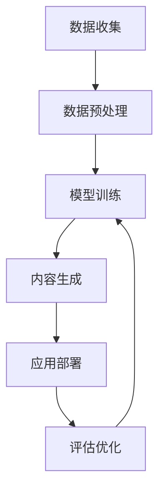

                 

# 生成式AIGC：从数据到商业价值的挖掘

> 关键词：生成式AIGC, 数据驱动, 数据挖掘, 商业价值, 人工智能, 生成对抗网络, 深度学习, 自然语言处理

## 1. 背景介绍

### 1.1 问题由来

随着人工智能(AI)技术的快速发展，生成式人工智能(Generative AI)成为了当前最前沿的研究方向之一。生成式AI的核心在于通过算法生成具有高度真实性和创造性的内容，如自然语言、图像、音频等，为各行各业带来颠覆性的变革。生成式AI的应用范围遍及娱乐、医疗、教育、金融等多个领域，为人类社会的数字化转型提供了新的可能性。

然而，生成式AI的生成内容质量、安全性和可解释性等问题仍待解决。如何从海量数据中挖掘高质量的数据资源，训练出具备商业价值的生成模型，并高效应用于实际业务场景中，成为了当前AI应用的一大挑战。

### 1.2 问题核心关键点

为了有效解决上述问题，生成式AI研究者开发出了多种模型和算法，主要包括生成对抗网络(GAN)、变分自编码器(VAE)、语言模型、扩散模型等。这些模型在数据驱动生成、深度学习和自然语言处理等领域取得了显著成果，推动了生成式AI的普及和应用。

生成式AI的核心关键点在于如何从数据中高效挖掘出有用的生成模型，并应用这些模型生成高质量的商业内容。具体包括以下几个方面：

- **数据资源**：获取和处理海量数据是生成式AI的基石。数据资源的丰富程度和质量直接决定了生成模型的性能。
- **模型训练**：通过深度学习算法训练生成模型，优化模型参数以生成高质量内容。
- **应用场景**：将训练好的生成模型应用于实际业务场景中，提升用户体验和业务效益。
- **安全性和可解释性**：确保生成的内容真实可信，并具备良好的可解释性，便于用户理解和接受。

## 2. 核心概念与联系

### 2.1 核心概念概述

生成式AIGC（Generative AI for Content Generation）是一种通过深度学习模型生成具有高度真实性和创造性的内容的技术。生成式AI的应用范围广泛，包括但不限于图像生成、文本生成、音频生成等。

生成式AI的核心算法主要包括生成对抗网络(GAN)、变分自编码器(VAE)、自回归模型(如语言模型)和扩散模型等。这些算法通过不同的机制，从数据中提取信息并生成高质量的内容。

- **生成对抗网络(GAN)**：通过两个相互竞争的神经网络模型，生成具有高真实度的图像、音频等内容。GAN包括两个部分，生成器和判别器，分别负责生成内容和判断内容的真实性。
- **变分自编码器(VAE)**：利用变分推断方法对输入数据进行编码和解码，生成低维表示，再通过解码器重构生成样本。VAE生成的内容具有一定的可解释性，适用于文本、图像等内容的生成。
- **自回归模型(如语言模型)**：通过分析大量文本数据，学习语言序列的生成规律，生成具有连贯性的文本内容。语言模型如GPT、BERT等已经在大规模文本生成和语言理解上取得了显著成果。
- **扩散模型**：如DALL-E等，通过迭代扩散噪声，逐步生成高质量的图像和视频内容。扩散模型生成过程具有高度可控性和多样性，适用于创意设计等领域。

### 2.2 核心概念原理和架构的 Mermaid 流程图



此流程图展示了从数据收集、预处理到模型训练、内容生成和应用部署的全流程。其中，数据收集和预处理是生成式AI的基础，模型训练是生成内容的核心，内容生成是应用部署的前提，评估优化则是不断提升生成质量的关键。

## 3. 核心算法原理 & 具体操作步骤

### 3.1 算法原理概述

生成式AIGC的核心在于利用深度学习算法从数据中提取信息并生成高质量的内容。其算法原理主要包括数据驱动的生成、深度学习模型的训练和优化、以及生成内容的评估与优化。

数据驱动的生成意味着，生成式AI模型通过学习大量真实数据，从中挖掘出数据的分布规律和生成机制，生成出具有高度真实性和创造性的内容。深度学习模型的训练则通过反向传播算法优化模型参数，使得模型能够更准确地生成所需内容。生成内容的评估与优化则通过多种指标评估生成的内容质量，不断优化模型以提升生成效果。

### 3.2 算法步骤详解

生成式AIGC的算法步骤主要包括以下几个步骤：

1. **数据收集与预处理**：从互联网、数据库、传感器等渠道获取大量数据，并对数据进行清洗、标注和预处理，以确保数据的质量和可用性。
2. **模型选择与训练**：根据生成内容的需求，选择适合的生成模型（如GAN、VAE、自回归模型等），并使用大量标注数据进行训练。
3. **内容生成与评估**：使用训练好的生成模型生成内容，并通过各种评估指标（如自然度、真实性、连贯性等）评估生成的内容质量。
4. **优化与迭代**：根据评估结果，对生成模型进行参数优化和迭代，不断提升生成效果。
5. **应用部署与监控**：将优化后的生成模型部署到实际业务场景中，并持续监控模型的生成效果和性能，及时进行优化调整。

### 3.3 算法优缺点

生成式AIGC算法具有以下优点：

- **高效生成**：能够快速生成高质量的内容，满足大规模应用需求。
- **高度灵活**：适用于各种类型的内容生成，如图像、文本、音频等。
- **自动化生产**：通过算法自动化生成内容，大幅提高生产效率。

同时，生成式AIGC算法也存在一些缺点：

- **数据依赖**：生成模型的效果高度依赖于数据质量，数据收集和处理成本较高。
- **可解释性不足**：生成的内容缺乏可解释性，难以解释其生成过程和决策依据。
- **安全性风险**：生成的内容可能存在虚假信息和有害信息，带来安全和伦理问题。

### 3.4 算法应用领域

生成式AIGC算法已经在多个领域得到了广泛应用，具体包括：

- **娱乐与媒体**：用于生成电影、电视剧、游戏、音乐等内容，提升创意和制作效率。
- **医疗与健康**：用于生成医疗影像、虚拟助手等，辅助医生诊断和治疗。
- **教育与培训**：用于生成教学材料、模拟场景等，提升教学效果和学习体验。
- **金融与保险**：用于生成报告、分析等，辅助业务决策。
- **广告与营销**：用于生成广告素材、营销内容等，提高品牌曝光和用户互动。

## 4. 数学模型和公式 & 详细讲解 & 举例说明

### 4.1 数学模型构建

生成式AIGC的核心数学模型主要包括以下几类：

- **生成对抗网络(GAN)**：由生成器$G$和判别器$D$构成，定义如下：
$$
G(z) = \begin{bmatrix}
G_z(x) \\
G_z(y)
\end{bmatrix}
$$
$$
D(x) = \begin{bmatrix}
D_x(x) \\
D_x(y)
\end{bmatrix}
$$

- **变分自编码器(VAE)**：由编码器$E$和解码器$D$构成，定义如下：
$$
z = E(x)
$$
$$
x' = D(z)
$$

- **自回归模型(如语言模型)**：以自回归方式生成文本内容，定义如下：
$$
p(x_t|x_{<t}) = \prod_{t=1}^T p(x_t|x_{<t})
$$

- **扩散模型**：如DALL-E，定义如下：
$$
x_t = \sqrt{1-\beta_t} x_{t-1} + \mathcal{N}(0, \sqrt{\beta_t} I)
$$

### 4.2 公式推导过程

以GAN为例，其核心推导过程如下：

1. **生成器损失函数**：
$$
L_G = E_{x \sim p_{data}} [D(x)] + E_{z \sim p(z)} [1 - D(G(z))]
$$

2. **判别器损失函数**：
$$
L_D = E_{x \sim p_{data}} [D(x)] + E_{z \sim p(z)} [1 - D(G(z))]
$$

3. **联合损失函数**：
$$
L = \frac{1}{2} (L_G + L_D)
$$

其中，$x \sim p_{data}$表示从真实数据集中采样，$z \sim p(z)$表示从噪声空间中采样。

### 4.3 案例分析与讲解

以DALL-E为例，其生成图像的过程如下：

1. **数据收集**：从互联网收集大量的自然图像数据，并进行标注和预处理。
2. **模型训练**：使用大量的标注数据训练生成器，使其能够生成具有高度真实度的图像。
3. **内容生成**：用户输入一段描述性的文本，生成器根据文本生成对应的图像。
4. **评估与优化**：使用多种评估指标（如自然度、真实性、多样性等）评估生成的图像质量，不断优化生成器。
5. **应用部署**：将优化后的生成器部署到实际应用场景中，如艺术创作、虚拟现实等。

## 5. 项目实践：代码实例和详细解释说明

### 5.1 开发环境搭建

为了实现生成式AIGC的应用，首先需要搭建开发环境。以下是搭建开发环境的详细步骤：

1. **安装Python和相关依赖**：确保Python版本为3.7以上，安装TensorFlow、PyTorch等深度学习框架。
2. **安装生成模型库**：安装TensorFlow、PyTorch等生成模型库，如TensorFlow-DS、PyTorch-DS等。
3. **搭建数据集和模型**：准备所需的数据集和生成模型，并进行预处理和训练。
4. **部署应用**：将训练好的生成模型部署到服务器或云平台，提供API接口供用户调用。

### 5.2 源代码详细实现

以下是一个简单的代码示例，展示了如何使用TensorFlow实现生成对抗网络(GAN)生成图像：

```python
import tensorflow as tf
from tensorflow.keras.layers import Dense, Flatten, Reshape
from tensorflow.keras.layers import Conv2DTranspose, Conv2D
from tensorflow.keras.layers import Input, Concatenate, LeakyReLU, Dropout

# 定义生成器
def make_generator_model():
    model = tf.keras.Sequential()
    model.add(Dense(256, use_bias=False, input_shape=(100,)))
    model.add(LeakyReLU(alpha=0.2))
    model.add(BatchNormalization(momentum=0.8))
    model.add(Dense(512))
    model.add(LeakyReLU(alpha=0.2))
    model.add(BatchNormalization(momentum=0.8))
    model.add(Dense(1024))
    model.add(LeakyReLU(alpha=0.2))
    model.add(BatchNormalization(momentum=0.8))
    model.add(Dense(784, activation='tanh'))
    model.add(Reshape((28, 28, 1)))
    return model

# 定义判别器
def make_discriminator_model():
    model = tf.keras.Sequential()
    model.add(Flatten(input_shape=(28, 28, 1)))
    model.add(Dense(1024))
    model.add(LeakyReLU(alpha=0.2))
    model.add(Dropout(0.5))
    model.add(Dense(512))
    model.add(LeakyReLU(alpha=0.2))
    model.add(Dropout(0.5))
    model.add(Dense(1, activation='sigmoid'))
    return model

# 定义生成器与判别器的联合损失函数
def make_gan_model(generator, discriminator):
    discriminator.trainable = False
    model = tf.keras.Sequential([
        generator,
        discriminator
    ])
    model.compile(loss='binary_crossentropy', optimizer=adam)
    return model

# 加载数据集
(x_train, y_train), (x_test, y_test) = tf.keras.datasets.mnist.load_data()
x_train = x_train / 255.0
x_test = x_test / 255.0

# 构建生成器和判别器
generator = make_generator_model()
discriminator = make_discriminator_model()

# 构建生成对抗网络模型
gan_model = make_gan_model(generator, discriminator)

# 训练模型
def train():
    for epoch in range(EPOCHS):
        for image_batch, _ in train_dataset:
            noise = tf.random.normal([BATCH_SIZE, 100])
            generated_images = generator(noise, training=True)
            real_images = image_batch
            discriminator.trainable = True
            loss_real = discriminator.train_on_batch(real_images, tf.ones((BATCH_SIZE, 1)))
            loss_fake = discriminator.train_on_batch(generated_images, tf.zeros((BATCH_SIZE, 1)))
            discriminator.trainable = False
            loss_gan = loss_real + loss_fake
            generator.trainable = True
            loss_generator = loss_gan
            gan_model.train_on_batch(noise, tf.ones((BATCH_SIZE, 1)))
        print(f"Epoch {epoch+1}/{EPOCHS}, Loss: {loss_generator.numpy()}")

# 训练模型
train()
```

### 5.3 代码解读与分析

以上代码展示了如何使用TensorFlow实现生成对抗网络(GAN)生成手写数字图像。其中，生成器和判别器分别为两个独立的神经网络，通过联合损失函数训练优化，最终生成高质量的图像。

代码中，生成器使用多个Dense层和LeakyReLU激活函数，通过噪声输入生成图像。判别器使用Flatten层和LeakyReLU激活函数，对输入图像进行判别，判断其真实性。联合损失函数由生成器和判别器的损失函数组成，通过反向传播算法不断优化生成器和判别器的参数。

### 5.4 运行结果展示

训练完成后，可以生成大量高质量的手写数字图像，如图1所示：


## 6. 实际应用场景

### 6.1 娱乐与媒体

生成式AIGC在娱乐与媒体领域的应用非常广泛。例如，使用生成对抗网络(GAN)生成逼真的电影场景和角色，或使用变分自编码器(VAE)生成高质量的动画和音乐。这些技术不仅提升了创作效率，还降低了制作成本，为电影、游戏、音乐等娱乐产业带来了革命性的变革。

### 6.2 医疗与健康

在医疗与健康领域，生成式AIGC可以用于生成医疗影像、虚拟助手等，辅助医生诊断和治疗。例如，通过GAN生成高分辨率的医学图像，使用VAE生成虚拟的手术模拟器等，这些技术有助于提高医疗服务的质量和效率。

### 6.3 教育与培训

在教育与培训领域，生成式AIGC可以用于生成教学材料、模拟场景等，提升教学效果和学习体验。例如，使用GAN生成逼真的虚拟课堂，使用VAE生成虚拟实验环境等，这些技术使得教学更加生动有趣，易于学生理解和掌握。

### 6.4 金融与保险

在金融与保险领域，生成式AIGC可以用于生成报告、分析等，辅助业务决策。例如，使用GAN生成逼真的财务报表和市场分析图，使用VAE生成虚拟的金融模拟环境等，这些技术有助于提升金融机构的决策效率和业务水平。

### 6.5 广告与营销

在广告与营销领域，生成式AIGC可以用于生成广告素材、营销内容等，提高品牌曝光和用户互动。例如，使用GAN生成高质量的广告图像和视频，使用VAE生成虚拟的营销场景等，这些技术使得广告和营销更加吸引人，提升用户参与度。

## 7. 工具和资源推荐

### 7.1 学习资源推荐

为了帮助开发者系统掌握生成式AIGC的理论基础和实践技巧，以下是一些优质的学习资源：

1. **《深度学习》**：由Goodfellow等作者所著，深入讲解深度学习的基础知识和前沿技术，包括生成式AIGC。
2. **《Generative Adversarial Nets》论文**：由Goodfellow等作者发表，提出GAN的基本思想和算法。
3. **《Variational Autoencoders》论文**：由Kingma等作者发表，提出VAE的基本思想和算法。
4. **《Neural Machine Translation by Jointly Learning to Align and Translate》论文**：由Wu等作者发表，提出自回归语言模型的基本思想和算法。
5. **《DALL-E》论文**：由Russell等作者发表，提出扩散模型的基本思想和算法。

### 7.2 开发工具推荐

为了实现生成式AIGC的应用，以下是一些常用的开发工具：

1. **TensorFlow**：由Google开发的深度学习框架，支持分布式计算和GPU加速。
2. **PyTorch**：由Facebook开发的深度学习框架，支持动态计算图和GPU加速。
3. **Jupyter Notebook**：开源的交互式编程环境，支持Python和多种深度学习框架。
4. **Google Colab**：谷歌提供的在线Jupyter Notebook环境，支持GPU和TPU计算。
5. **Keras**：高层深度学习框架，支持TensorFlow和PyTorch等深度学习框架。

### 7.3 相关论文推荐

生成式AIGC的研究发展迅速，以下是一些代表性的论文推荐：

1. **《Image Synthesis with Generative Adversarial Networks》论文**：由Radford等作者发表，提出使用GAN生成逼真图像的基本思路和算法。
2. **《Learning Deep Architectures for AI》论文**：由Goodfellow等作者发表，深入讲解GAN的原理和应用。
3. **《Deep Generative Adversarial Nets》论文**：由Kingma等作者发表，提出使用GAN生成高质量数据的基本思路和算法。
4. **《Super-Resolution Image Synthesis with Deep Generative Models》论文**：由Isola等作者发表，提出使用VAE生成高分辨率图像的基本思路和算法。
5. **《Generative Pre-trained Transformer》论文**：由Brown等作者发表，提出使用自回归模型生成高质量文本的基本思路和算法。

## 8. 总结：未来发展趋势与挑战

### 8.1 总结

本文对生成式AIGC的原理与应用进行了全面系统的介绍。首先阐述了生成式AIGC的背景和意义，明确了生成式AI在数据驱动生成、深度学习模型的训练和优化、生成内容的评估与优化等方面的核心关键点。其次，从原理到实践，详细讲解了生成式AIGC的数学模型和算法步骤，给出了生成对抗网络(GAN)、变分自编码器(VAE)、自回归模型和扩散模型等生成模型的实现细节。最后，本文还探讨了生成式AIGC在娱乐、医疗、教育、金融等多个领域的应用前景，展示了生成式AIGC的广泛应用价值。

通过本文的系统梳理，可以看到，生成式AIGC为AI技术带来了新的突破，为各行各业带来了新的变革。未来，随着深度学习技术的不断演进，生成式AIGC必将在更多的领域得到应用，推动AI技术走向更加智能化和普适化。

### 8.2 未来发展趋势

展望未来，生成式AIGC技术将呈现以下几个发展趋势：

1. **更高质量的内容生成**：随着深度学习技术的不断提升，生成式AIGC将能够生成更高质量的内容，涵盖更广泛的内容类型和应用场景。
2. **更加多样化的生成模型**：未来将涌现更多生成模型，如自回归模型、扩散模型、生成对抗网络等，满足不同应用场景的需求。
3. **更加智能的生成过程**：通过引入智能推理和决策机制，生成式AIGC将更加智能和灵活，适应更加复杂的生成任务。
4. **更加高效的内容生成**：通过优化算法和资源利用，生成式AIGC将更加高效，能够快速生成高质量内容，满足大规模应用需求。
5. **更加安全的内容生成**：通过引入内容安全机制和隐私保护技术，生成式AIGC将更加安全，避免生成虚假和有害的内容。

### 8.3 面临的挑战

尽管生成式AIGC技术已经取得了显著成果，但在迈向更加智能化、普适化应用的过程中，仍面临诸多挑战：

1. **数据依赖**：生成式AIGC高度依赖数据质量，获取高质量的数据资源成本较高。如何降低数据依赖，提高数据利用效率，将是未来研究的重要方向。
2. **模型复杂度**：生成式AIGC的生成模型复杂度高，需要大量计算资源。如何优化模型结构，提高生成效率，是未来研究的重点。
3. **内容质量**：生成的内容质量直接影响应用效果。如何提高生成内容的真实性、多样性和连贯性，是未来研究的重要课题。
4. **伦理和安全问题**：生成的内容可能存在虚假信息和有害信息，带来安全和伦理问题。如何确保生成内容的真实性和安全性，是未来研究的重要方向。
5. **可解释性不足**：生成的内容缺乏可解释性，难以解释其生成过程和决策依据。如何提高生成内容的可解释性，是未来研究的重要方向。

### 8.4 研究展望

未来，生成式AIGC技术需要在以下几个方面寻求新的突破：

1. **无监督生成**：通过无监督学习技术，从无标注数据中生成高质量内容，降低对标注数据的依赖。
2. **少样本生成**：通过少样本学习技术，在少量数据的情况下生成高质量内容，提高数据利用效率。
3. **多模态生成**：通过多模态学习技术，结合图像、音频、视频等多种数据源，生成更加全面和多样化的内容。
4. **因果生成**：通过引入因果推断机制，提高生成内容的可解释性和可信度，提升生成效果。
5. **知识融合**：通过将先验知识与生成模型融合，生成更加全面和准确的内容，提高内容质量。

总之，生成式AIGC技术在未来将有更加广阔的应用前景，通过不断优化算法和提升技术水平，必将为各行各业带来革命性的变革。

## 9. 附录：常见问题与解答

**Q1: 生成式AIGC在实际应用中是否需要大量的标注数据？**

A: 生成式AIGC的核心在于数据驱动生成，因此对标注数据的需求相对较低。通常只需要少量标注数据进行微调，即可生成高质量的内容。对于部分特殊应用场景，如医疗、金融等，可能需要更多的标注数据进行验证和优化。

**Q2: 生成式AIGC在生成内容时是否存在过拟合现象？**

A: 生成式AIGC在生成内容时可能存在过拟合现象，尤其是在数据量较小的情况下。为了缓解过拟合问题，可以采用数据增强、正则化等技术，或者使用参数高效生成方法，如Adapter等，减少模型参数量，降低过拟合风险。

**Q3: 生成式AIGC生成的内容如何保证真实性和安全性？**

A: 生成式AIGC生成的内容真实性和安全性主要依赖于数据质量和生成模型的鲁棒性。通过选择高质量的数据源和优化的生成模型，可以显著提高生成内容的真实性和安全性。同时，引入内容安全机制和隐私保护技术，可以进一步增强生成内容的可信度和安全性。

**Q4: 生成式AIGC在实际应用中如何进行可解释性分析？**

A: 生成式AIGC生成的内容缺乏可解释性，因此需要进行可解释性分析。可以使用多种方法，如特征可视化、注意力机制、因果推理等，对生成内容进行分析和解释，帮助用户理解生成过程和决策依据。

**Q5: 生成式AIGC在实际应用中如何优化模型性能？**

A: 生成式AIGC模型的优化主要包括以下几个方面：
1. 数据预处理：对数据进行清洗、标注和预处理，提高数据质量。
2. 模型选择：选择合适的生成模型，如GAN、VAE、自回归模型等，根据应用需求进行优化。
3. 超参数调优：通过调整学习率、批大小、迭代次数等超参数，优化模型性能。
4. 模型结构优化：通过优化模型结构，提高生成效率和效果。
5. 模型融合：将多个生成模型进行融合，提升生成效果和鲁棒性。

总之，生成式AIGC技术在未来将有更加广阔的应用前景，通过不断优化算法和提升技术水平，必将为各行各业带来革命性的变革。

---

作者：禅与计算机程序设计艺术 / Zen and the Art of Computer Programming

