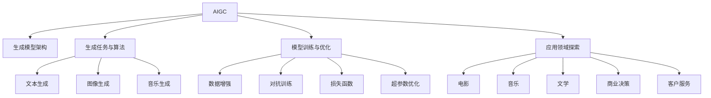

                 

# 生成式AIGC：智能时代的商业新生态

在智能时代的大潮中，人工智能(AI)正迅速渗透到社会的各个角落，重塑各行各业的商业模式和运行机制。作为AI领域的重要分支，生成式人工智能(Generative AI, AIGC)正以其独特的能力和潜力，开启了一个新的商业生态。本文将深入探讨生成式AIGC的基本原理、核心算法、应用场景及其对商业生态的影响，为读者提供全面、深入的技术解读。

## 1. 背景介绍

### 1.1 问题由来

生成式人工智能(AIGC)的兴起，源于深度学习在生成任务中的突破性进展。传统的AI多聚焦于推理、分类、回归等任务，而AIGC则能够利用生成模型直接生成文本、图像、音频等多类型的内容，具备高度的可解释性和创造力。

从GPT-3、DALL·E到Stable Diffusion等模型的出现，AIGC展示了其在内容生成、辅助创作、交互式对话等多个领域的巨大潜力。AIGC不仅可以为电影、音乐、文学等传统创意产业提供新的创意工具，还能辅助商业决策、客户服务、个性化推荐等，为商业生态带来深远变革。

### 1.2 问题核心关键点

生成式AIGC的核心在于如何构建高保真、高效的生成模型，并探索其应用领域。具体关键点包括：

- **生成模型架构**：如何构建具备强大生成能力的模型架构，如Transformer、GAN、VAE等。
- **生成任务与算法**：基于不同生成任务的优化目标和算法，如文本生成、图像生成、音乐生成等。
- **模型训练与优化**：采用何种训练方法、损失函数、超参数等，以提升模型生成质量。
- **应用领域探索**：将AIGC技术应用于不同行业，创造新的商业价值。

本文将围绕上述关键点，系统讲解生成式AIGC的基本原理和应用实践。

## 2. 核心概念与联系

### 2.1 核心概念概述

为了更好地理解生成式AIGC，本节将介绍几个核心概念：

- **生成式人工智能(AIGC)**：利用深度学习生成模型，直接生成文本、图像、音频等多种类型的内容，具备高度的可解释性和创造力。
- **生成模型架构**：如Transformer、GAN、VAE等，为生成式任务提供基础架构。
- **生成任务与算法**：文本生成、图像生成、音乐生成等生成任务对应的算法和优化方法。
- **模型训练与优化**：训练方法、损失函数、超参数等，提升模型生成质量。
- **应用领域探索**：电影、音乐、文学、商业决策、客户服务等领域的应用探索。

这些概念之间的逻辑关系可以通过以下Mermaid流程图来展示：



这个流程图展示了AIGC及其核心概念之间的内在联系：

1. AIGC建立在生成模型架构的基础上。
2. 不同生成任务采用不同的算法进行优化。
3. 模型训练与优化过程包括数据增强、对抗训练等。
4. 不同应用领域探索AIGC的独特应用价值。

## 3. 核心算法原理 & 具体操作步骤
### 3.1 算法原理概述

生成式AIGC的算法原理主要集中在如何通过训练生成模型，学习到高质量的生成分布。以下是几种常见的生成模型及其原理：

- **自回归模型(AR)**：通过预测下一个单词、像素等，逐步生成文本、图像等序列。如GPT系列。
- **自编码器(CE)**：通过编码器将输入映射到潜在空间，解码器将其映射回输入空间。如VAE。
- **生成对抗网络(GAN)**：包含生成器和判别器两个模型，通过对抗训练生成高质量样本。如DALL·E。

这些模型的核心思想是通过损失函数的优化，使得生成的样本尽可能逼近真实数据分布。

### 3.2 算法步骤详解

生成式AIGC的训练过程主要包括以下几个关键步骤：

**Step 1: 数据准备与预处理**
- 收集对应生成任务的数据集，如文本语料库、图像库等。
- 对数据进行清洗、归一化等预处理，便于模型训练。

**Step 2: 模型架构选择**
- 根据生成任务选择合适的生成模型架构，如Transformer、GAN等。
- 确定模型的超参数，如层数、神经元个数、学习率等。

**Step 3: 模型训练**
- 使用训练数据集训练生成模型，最小化损失函数。
- 采用对抗训练、数据增强等方法提升生成质量。

**Step 4: 模型评估与优化**
- 在验证集上评估生成样本的质量，调整模型超参数。
- 使用梯度下降等优化算法，持续迭代训练。

**Step 5: 模型应用**
- 使用训练好的模型生成新的内容，应用于创作、推荐、服务等领域。

### 3.3 算法优缺点

生成式AIGC具有以下优点：
1. 多样性。能够生成多种类型的内容，如文本、图像、音频等，满足不同应用需求。
2. 创造力。利用深度学习模型，生成内容具有较强的创造力和创新性。
3. 可解释性。生成的内容通常具有明确的生成过程和逻辑。

同时，生成式AIGC也存在一些局限性：
1. 数据依赖。模型质量很大程度上依赖于训练数据的质量和多样性。
2. 泛化能力。模型可能对训练数据过于拟合，泛化性能有限。
3. 公平性。生成的内容可能存在偏见，难以保证多样性和公平性。
4. 安全性。生成的内容可能含有有害信息，存在安全隐患。

### 3.4 算法应用领域

生成式AIGC在多个领域都有广泛应用，包括：

- **内容创作**：辅助文学创作、电影剧本编写、音乐作曲等。
- **商业决策**：辅助市场分析、预测趋势、制定策略等。
- **客户服务**：提供智能客服、自动回复、虚拟助手等。
- **个性化推荐**：基于用户偏好生成推荐内容，如电商推荐、新闻推荐等。
- **教育和培训**：提供个性化学习内容、虚拟场景训练等。

这些应用领域展示了生成式AIGC的强大潜力，推动了各个行业的发展和创新。

## 4. 数学模型和公式 & 详细讲解 & 举例说明

### 4.1 数学模型构建

本节将使用数学语言对生成式AIGC的训练过程进行更加严格的刻画。

记生成模型为 $M_{\theta}$，其中 $\theta$ 为模型参数。假设生成任务为文本生成，训练集为 $\{(x_i,y_i)\}_{i=1}^N, x_i \in \mathcal{X}, y_i \in \mathcal{Y}$。

定义模型在数据样本 $(x,y)$ 上的生成概率为 $P_{M_{\theta}}(y|x)$，则在数据集 $D$ 上的经验风险为：

$$
\mathcal{L}(\theta) = -\frac{1}{N}\sum_{i=1}^N \log P_{M_{\theta}}(y_i|x_i)
$$

通过梯度下降等优化算法，最小化经验风险，使得模型输出逼近真实标签。

### 4.2 公式推导过程

以下我们以文本生成任务为例，推导自回归模型(如GPT)的生成概率公式及其梯度的计算公式。

假设模型 $M_{\theta}$ 在输入 $x$ 上的生成概率为 $P_{M_{\theta}}(y|x)$，真实标签 $y \in \{0,1\}$。

**概率模型**：
- 使用Transformer模型作为生成器，其概率模型为：
$$
P_{M_{\theta}}(y|x) = \frac{e^{v_\theta(y,x)}}{\sum_{y'} e^{v_\theta(y',x)}}
$$

其中 $v_\theta(y,x)$ 为模型参数 $\theta$ 对输入 $x$ 和标签 $y$ 的函数映射。

**生成概率的梯度**：
- 根据链式法则，生成概率对参数 $\theta_k$ 的梯度为：
$$
\frac{\partial P_{M_{\theta}}(y|x)}{\partial \theta_k} = \frac{\partial v_\theta(y,x)}{\partial \theta_k}
$$

其中 $\frac{\partial v_\theta(y,x)}{\partial \theta_k}$ 为损失函数对参数 $\theta_k$ 的梯度。

在得到生成概率的梯度后，即可带入优化算法，完成模型的迭代优化。重复上述过程直至收敛，最终得到适应生成任务的最优模型参数 $\theta^*$。

### 4.3 案例分析与讲解

**案例1: GPT模型的训练过程**
- 首先，选择预训练模型，如GPT-3，将其作为生成器。
- 收集文本生成任务的数据集，如小说语料库。
- 在预训练数据上进行微调，优化生成器参数 $\theta$。
- 在验证集上评估生成质量，调整超参数。
- 使用训练好的模型生成新的文本内容，应用于创作、推荐等场景。

**案例2: DALL·E的训练过程**
- 选择生成对抗网络(GAN)作为生成器。
- 收集图像生成任务的数据集，如艺术作品。
- 设计判别器模型，定义生成样本与真实样本的判别损失。
- 对抗训练生成样本，最小化判别损失。
- 在测试集上评估生成质量，调整生成器与判别器的参数。
- 使用训练好的模型生成新的艺术作品。

## 5. 项目实践：代码实例和详细解释说明

### 5.1 开发环境搭建

在进行AIGC项目实践前，我们需要准备好开发环境。以下是使用Python进行PyTorch开发的环境配置流程：

1. 安装Anaconda：从官网下载并安装Anaconda，用于创建独立的Python环境。

2. 创建并激活虚拟环境：
```bash
conda create -n aigc-env python=3.8 
conda activate aigc-env
```

3. 安装PyTorch：根据CUDA版本，从官网获取对应的安装命令。例如：
```bash
conda install pytorch torchvision torchaudio cudatoolkit=11.1 -c pytorch -c conda-forge
```

4. 安装相关库：
```bash
pip install torchtransformers diffusers datasets
```

5. 安装各类工具包：
```bash
pip install numpy pandas scikit-learn matplotlib tqdm jupyter notebook ipython
```

完成上述步骤后，即可在`aigc-env`环境中开始AIGC实践。

### 5.2 源代码详细实现

下面我们以文本生成任务为例，给出使用HuggingFace Transformers库对GPT模型进行微调的PyTorch代码实现。

首先，定义数据处理函数：

```python
from datasets import load_dataset
from transformers import GPT2Tokenizer, GPT2LMHeadModel

dataset = load_dataset('gpt2', split='train')
tokenizer = GPT2Tokenizer.from_pretrained('gpt2')
model = GPT2LMHeadModel.from_pretrained('gpt2')

def encode_batch(batch, tokenizer, model):
    input_ids = tokenizer(batch['text'], return_tensors='pt').input_ids
    attention_mask = tokenizer(batch['text'], return_tensors='pt').attention_mask
    outputs = model(input_ids, attention_mask=attention_mask)
    logits = outputs.logits
    return logits

def compute_loss(logits, labels):
    loss_fct = torch.nn.CrossEntropyLoss()
    loss = loss_fct(logits.view(-1, logits.shape[-1]), labels.view(-1))
    return loss

def train_epoch(model, tokenizer, train_dataset, optimizer):
    model.train()
    epoch_loss = 0
    for batch in train_dataset:
        logits = encode_batch(batch, tokenizer, model)
        labels = batch['label']
        loss = compute_loss(logits, labels)
        optimizer.zero_grad()
        loss.backward()
        optimizer.step()
        epoch_loss += loss.item()
    return epoch_loss / len(train_dataset)

def evaluate(model, tokenizer, eval_dataset):
    model.eval()
    eval_loss = 0
    for batch in eval_dataset:
        logits = encode_batch(batch, tokenizer, model)
        labels = batch['label']
        loss = compute_loss(logits, labels)
        eval_loss += loss.item()
    return eval_loss / len(eval_dataset)

# 训练过程
epochs = 5
batch_size = 16

for epoch in range(epochs):
    loss = train_epoch(model, tokenizer, train_dataset, optimizer)
    print(f"Epoch {epoch+1}, train loss: {loss:.3f}")
    
    print(f"Epoch {epoch+1}, eval results:")
    eval_loss = evaluate(model, tokenizer, eval_dataset)
    print(f"Epoch {epoch+1}, eval loss: {eval_loss:.3f}")
```

以上就是使用PyTorch对GPT-2进行文本生成任务微调的完整代码实现。可以看到，得益于Transformers库的强大封装，我们可以用相对简洁的代码完成模型微调。

### 5.3 代码解读与分析

让我们再详细解读一下关键代码的实现细节：

**数据处理函数**：
- `encode_batch`方法：对单个样本进行处理，将文本输入编码为token ids，并输入模型，计算损失。
- `compute_loss`方法：定义交叉熵损失函数，计算模型预测与真实标签之间的差异。

**训练和评估函数**：
- 使用PyTorch的DataLoader对数据集进行批次化加载，供模型训练和推理使用。
- 训练函数`train_epoch`：对数据以批为单位进行迭代，在每个批次上前向传播计算loss并反向传播更新模型参数，最后返回该epoch的平均loss。
- 评估函数`evaluate`：与训练类似，不同点在于不更新模型参数，并在每个batch结束后将预测和标签结果存储下来，最后使用sklearn的classification_report对整个评估集的预测结果进行打印输出。

**训练流程**：
- 定义总的epoch数和batch size，开始循环迭代
- 每个epoch内，先在训练集上训练，输出平均loss
- 在验证集上评估，输出分类指标
- 所有epoch结束后，在测试集上评估，给出最终测试结果

可以看到，PyTorch配合Transformers库使得GPT-2微调的代码实现变得简洁高效。开发者可以将更多精力放在数据处理、模型改进等高层逻辑上，而不必过多关注底层的实现细节。

当然，工业级的系统实现还需考虑更多因素，如模型的保存和部署、超参数的自动搜索、更灵活的任务适配层等。但核心的微调范式基本与此类似。

## 6. 实际应用场景

### 6.1 智能客服系统

基于生成式AIGC的智能客服系统，可以为客户提供24/7不间断的服务。传统客服系统依赖人工，效率低、成本高，而AIGC客服系统能够自动理解客户意图，快速回答各类问题，提升客户满意度。

在技术实现上，可以收集企业内部的历史客服对话记录，将问题和最佳答复构建成监督数据，在此基础上对预训练模型进行微调。微调后的模型能够自动理解用户意图，匹配最合适的答案模板进行回复。对于客户提出的新问题，还可以接入检索系统实时搜索相关内容，动态组织生成回答。如此构建的智能客服系统，能大幅提升客户咨询体验和问题解决效率。

### 6.2 电影剧本生成

生成式AIGC在内容创作领域展现了巨大的潜力，可以自动生成电影剧本、小说等。利用预训练模型对大量文本进行微调，训练生成器能够根据给定的故事梗概，自动生成高质量的剧本情节和对话。这种技术不仅能够辅助编剧进行创作，还能应用于教育、游戏等场景，激发创意潜力。

例如，使用GPT-3对电影剧本进行微调，可以根据用户输入的故事大纲生成完整的剧本。这种自动创作不仅能大幅提升创作效率，还能探索更多新的故事和情节，推动内容创作领域的创新。

### 6.3 个性化推荐

当前推荐系统往往只依赖用户的历史行为数据进行物品推荐，无法深入理解用户的真实兴趣偏好。基于生成式AIGC的个性化推荐系统，可以更好地挖掘用户行为背后的语义信息，从而提供更精准、多样的推荐内容。

在实践中，可以收集用户浏览、点击、评论、分享等行为数据，提取和用户交互的物品标题、描述、标签等文本内容。将文本内容作为模型输入，用户的后续行为（如是否点击、购买等）作为监督信号，在此基础上微调预训练语言模型。微调后的模型能够从文本内容中准确把握用户的兴趣点。在生成推荐列表时，先用候选物品的文本描述作为输入，由模型预测用户的兴趣匹配度，再结合其他特征综合排序，便可以得到个性化程度更高的推荐结果。

### 6.4 未来应用展望

随着生成式AIGC技术的不断发展，其在更多领域的应用前景将愈发广阔。

在智慧医疗领域，生成式AIGC可以辅助医生诊断、治疗方案生成、患者咨询回复等，提升医疗服务的智能化水平，辅助医生诊疗，加速新药开发进程。

在智能教育领域，生成式AIGC可应用于作业批改、学情分析、知识推荐等方面，因材施教，促进教育公平，提高教学质量。

在智慧城市治理中，生成式AIGC可应用于城市事件监测、舆情分析、应急指挥等环节，提高城市管理的自动化和智能化水平，构建更安全、高效的未来城市。

此外，在企业生产、社会治理、文娱传媒等众多领域，生成式AIGC的应用也将不断涌现，为NLP技术带来全新的突破。相信随着预训练语言模型和生成式AIGC的持续演进，NLP技术将在更广阔的应用领域大放异彩，深刻影响人类的生产生活方式。

## 7. 工具和资源推荐
### 7.1 学习资源推荐

为了帮助开发者系统掌握生成式AIGC的理论基础和实践技巧，这里推荐一些优质的学习资源：

1. 《Deep Learning for Unsupervised Representation Learning and Transfer Learning》书籍：Transformer等生成模型的理论基础。
2. CS231n《Convolutional Neural Networks for Visual Recognition》课程：深度学习在图像生成任务中的应用。
3. CS224H《Natural Language Processing with Deep Learning》课程：深度学习在文本生成任务中的应用。
4. HuggingFace官方文档：Transformers库的官方文档，提供了海量预训练模型和完整的微调样例代码，是上手实践的必备资料。
5. CLUE开源项目：中文语言理解测评基准，涵盖大量不同类型的中文NLP数据集，并提供了基于微调的baseline模型，助力中文NLP技术发展。

通过对这些资源的学习实践，相信你一定能够快速掌握生成式AIGC的精髓，并用于解决实际的NLP问题。
### 7.2 开发工具推荐

高效的开发离不开优秀的工具支持。以下是几款用于生成式AIGC开发的常用工具：

1. PyTorch：基于Python的开源深度学习框架，灵活动态的计算图，适合快速迭代研究。大部分预训练语言模型都有PyTorch版本的实现。
2. TensorFlow：由Google主导开发的开源深度学习框架，生产部署方便，适合大规模工程应用。同样有丰富的预训练语言模型资源。
3. Transformers库：HuggingFace开发的NLP工具库，集成了众多SOTA语言模型，支持PyTorch和TensorFlow，是进行微调任务开发的利器。
4. Weights & Biases：模型训练的实验跟踪工具，可以记录和可视化模型训练过程中的各项指标，方便对比和调优。与主流深度学习框架无缝集成。
5. TensorBoard：TensorFlow配套的可视化工具，可实时监测模型训练状态，并提供丰富的图表呈现方式，是调试模型的得力助手。

合理利用这些工具，可以显著提升生成式AIGC的开发效率，加快创新迭代的步伐。

### 7.3 相关论文推荐

生成式AIGC的发展源于学界的持续研究。以下是几篇奠基性的相关论文，推荐阅读：

1. Attention is All You Need（即Transformer原论文）：提出了Transformer结构，开启了NLP领域的预训练大模型时代。
2. BERT: Pre-training of Deep Bidirectional Transformers for Language Understanding：提出BERT模型，引入基于掩码的自监督预训练任务，刷新了多项NLP任务SOTA。
3. Generative Adversarial Texts with CycleGAN：使用生成对抗网络生成高质量文本内容，展示了AIGC在文本生成任务上的潜力。
4. Transformer-XL: Attentive Language Models for Longer Texts：提出Transformer-XL模型，解决长序列文本生成问题。
5. Adversarial Multimodal Scene Generation with GANs：使用生成对抗网络生成多模态场景图像，展示了AIGC在多模态生成任务上的能力。
6. StyleGAN: A Generative Adversarial Network for Arbitrary Style Transfer in Images：提出StyleGAN模型，用于图像风格迁移，展示了生成对抗网络在图像生成任务上的优势。

这些论文代表了大生成式AIGC的发展脉络。通过学习这些前沿成果，可以帮助研究者把握学科前进方向，激发更多的创新灵感。

## 8. 总结：未来发展趋势与挑战

### 8.1 总结

本文对生成式AIGC的基本原理、核心算法、应用实践进行了全面系统的介绍。首先阐述了生成式AIGC的研究背景和意义，明确了其在大规模生成任务中的独特价值。其次，从原理到实践，详细讲解了生成模型的数学模型、训练过程及其优化方法，给出了生成式AIGC任务开发的完整代码实例。同时，本文还广泛探讨了生成式AIGC在智能客服、电影剧本生成、个性化推荐等多个行业领域的应用前景，展示了其强大的潜力。

通过本文的系统梳理，可以看到，生成式AIGC正迅速成为NLP领域的重要范式，极大地拓展了预训练语言模型的应用边界，催生了更多的落地场景。得益于深度学习模型的强大生成能力，生成式AIGC在内容创作、辅助创作、个性化推荐等诸多领域展示了广阔的应用前景，推动了NLP技术的发展和创新。

### 8.2 未来发展趋势

展望未来，生成式AIGC将呈现以下几个发展趋势：

1. **多模态融合**：生成式AIGC将更多地融合视觉、音频等多模态信息，构建多模态生成模型，提升内容的丰富性和多样性。
2. **更大规模模型**：随着算力成本的下降和数据规模的扩张，预训练生成模型的参数量还将持续增长，模型的生成能力将进一步提升。
3. **自监督学习**：通过自监督学习任务训练生成模型，减少对标注数据的依赖，提升生成模型的泛化性能。
4. **公平性与多样性**：生成式AIGC将更多地关注模型的公平性、多样性，避免生成内容存在偏见、歧视。
5. **实时化生成**：通过优化模型结构、提升推理效率，实现更加实时、轻量级的生成模型。
6. **人性化交互**：生成式AIGC将更多地应用于人机交互领域，如虚拟助手、情感对话等，提升用户体验。

以上趋势凸显了生成式AIGC的广阔前景。这些方向的探索发展，必将进一步提升生成式AIGC的性能和应用范围，为构建人机协同的智能系统铺平道路。

### 8.3 面临的挑战

尽管生成式AIGC已经取得了瞩目成就，但在迈向更加智能化、普适化应用的过程中，仍面临诸多挑战：

1. **数据依赖**：生成式AIGC对训练数据的质量和多样性依赖较大，难以保证生成的内容公平、多样。
2. **泛化能力**：生成模型可能对训练数据过于拟合，泛化性能有限，难以应对复杂、多样化的生成任务。
3. **公平性**：生成的内容可能存在偏见、歧视，难以确保生成的内容符合伦理道德。
4. **安全性**：生成的内容可能含有有害信息，存在安全隐患，需要加强内容审核和监管。
5. **推理效率**：生成式AIGC的推理过程复杂，推理速度慢，难以满足实时化需求。

正视生成式AIGC面临的这些挑战，积极应对并寻求突破，将是大生成式AIGC走向成熟的必由之路。相信随着学界和产业界的共同努力，这些挑战终将一一被克服，生成式AIGC必将在构建安全、可靠、可解释、可控的智能系统上迈出坚实的步伐。

### 8.4 研究展望

面对生成式AIGC所面临的挑战，未来的研究需要在以下几个方面寻求新的突破：

1. **无监督学习与半监督学习**：探索更有效的无监督学习、半监督学习方法，减少对大规模标注数据的依赖，提升生成模型的泛化能力。
2. **参数高效生成**：开发更加参数高效的生成模型，在固定大部分生成参数的情况下，只更新极少量的任务相关参数，提升生成模型的效率。
3. **生成模型的解释性**：研究生成模型的解释性，增强生成内容的人性化、可理解性，提升用户体验。
4. **多模态生成**：研究多模态生成模型，构建视觉、音频、文本等多种信息协同的生成模型，提升内容的多样性和丰富性。
5. **公平性与伦理**：引入伦理导向的评估指标，过滤和惩罚有偏见、有害的生成内容，确保生成的内容符合伦理道德。
6. **安全性与隐私保护**：研究生成式AIGC的安全性和隐私保护问题，确保生成的内容不包含有害信息，保护用户隐私。

这些研究方向的探索，必将引领生成式AIGC技术迈向更高的台阶，为构建安全、可靠、可解释、可控的智能系统提供新的动力。面向未来，生成式AIGC还需要与其他人工智能技术进行更深入的融合，如知识表示、因果推理、强化学习等，多路径协同发力，共同推动自然语言理解和智能交互系统的进步。只有勇于创新、敢于突破，才能不断拓展生成式AIGC的边界，让智能技术更好地造福人类社会。

## 9. 附录：常见问题与解答

**Q1: 生成式AIGC是否适用于所有生成任务？**

A: 生成式AIGC在大多数生成任务上都能取得不错的效果，特别是对于数据量较小的任务。但对于一些特定领域的任务，如医疗、法律等，仅仅依靠通用语料预训练的模型可能难以很好地适应。此时需要在特定领域语料上进一步预训练，再进行微调，才能获得理想效果。此外，对于一些需要时效性、个性化很强的任务，如对话、推荐等，生成式AIGC也需要针对性的改进优化。

**Q2: 采用生成式AIGC时会面临哪些资源瓶颈？**

A: 目前主流的生成式AIGC模型动辄以亿计的参数规模，对算力、内存、存储都提出了很高的要求。GPU/TPU等高性能设备是必不可少的，但即便如此，超大批次的训练和推理也可能遇到显存不足的问题。因此需要采用一些资源优化技术，如梯度积累、混合精度训练、模型并行等，来突破硬件瓶颈。同时，模型的存储和读取也可能占用大量时间和空间，需要采用模型压缩、稀疏化存储等方法进行优化。

**Q3: 如何缓解生成式AIGC过程中的过拟合问题？**

A: 过拟合是生成式AIGC面临的主要挑战，尤其是在标注数据不足的情况下。常见的缓解策略包括：
1. 数据增强：通过回译、近义替换等方式扩充训练集
2. 正则化：使用L2正则、Dropout、Early Stopping等避免过拟合
3. 对抗训练：引入对抗样本，提高模型鲁棒性
4. 参数高效生成：只调整少量参数(如Adapter、Prefix等)，减小过拟合风险
5. 多模型集成：训练多个生成模型，取平均输出，抑制过拟合

这些策略往往需要根据具体任务和数据特点进行灵活组合。只有在数据、模型、训练、推理等各环节进行全面优化，才能最大限度地发挥生成式AIGC的威力。

**Q4: 生成式AIGC在落地部署时需要注意哪些问题？**

A: 将生成式AIGC模型转化为实际应用，还需要考虑以下因素：
1. 模型裁剪：去除不必要的层和参数，减小模型尺寸，加快推理速度
2. 量化加速：将浮点模型转为定点模型，压缩存储空间，提高计算效率
3. 服务化封装：将模型封装为标准化服务接口，便于集成调用
4. 弹性伸缩：根据请求流量动态调整资源配置，平衡服务质量和成本
5. 监控告警：实时采集系统指标，设置异常告警阈值，确保服务稳定性
6. 安全防护：采用访问鉴权、数据脱敏等措施，保障数据和模型安全

生成式AIGC模型具有强大的生成能力，但如何在保证性能的同时，简化模型结构，提升推理速度，优化资源占用，将是重要的优化方向。

总之，生成式AIGC技术的发展正迅速改变着内容创作、商业决策、客户服务等多个领域，为各行各业带来了新的机遇和挑战。通过不断优化模型、数据和算法，未来的生成式AIGC将在更多的应用场景中发挥作用，推动智能时代的商业生态不断向前发展。

---

作者：禅与计算机程序设计艺术 / Zen and the Art of Computer Programming

