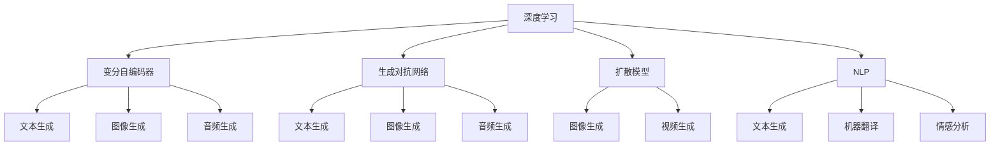

                 

# 生成式AIGC：未来商业的核心竞争力

> 关键词：生成式AIGC, AI驱动, 创意产业, 营销创新, 个性化体验, 高效运营

## 1. 背景介绍

### 1.1 问题由来

随着人工智能（AI）技术的不断进步，生成式人工智能（Generative AI, GAI）迅速崛起，成为推动各行各业数字化转型的关键力量。GAI通过深度学习模型，利用数据自动生成高质量的图像、文本、音频等内容，极大提升了内容创作的效率和质量，开启了内容生成的新纪元。

生成式AI主要包括生成对抗网络（GANs）、变分自编码器（VAEs）、扩散模型（Diffusion Models）等。这些模型在图像生成、自然语言处理（NLP）、音频生成等领域展现了卓越的性能，重新定义了内容创作的边界。

但生成式AI带来的不仅仅是技术革新，更带来了商业模式的转变。企业通过GAI技术，可以大幅降低内容创作成本，提升运营效率，实现个性化的营销与客户体验。尤其是在创意产业、品牌营销、客户服务等领域，GAI技术的应用前景广阔，逐步成为企业核心竞争力的重要组成部分。

### 1.2 问题核心关键点

生成式AIGC的核心在于其生成性和智能性，能够根据输入数据自动生成高质量、多样化的内容。这种能力不仅提升了内容创作的效率，还使得个性化体验成为可能。以下是GAI的核心关键点：

- 生成式模型：通过学习大量数据，生成全新的内容。
- 智能互动：结合自然语言处理技术，实现与用户的智能对话和互动。
- 个性化定制：根据用户偏好和行为数据，生成个性化的内容。
- 自动化创作：自动完成图像、文本、音频等的创作，减少人工干预。
- 跨模态生成：生成不同模态（如图像、文本、音频）的融合内容。

这些关键点共同构成了GAI技术的核心，并驱动其在创意产业、品牌营销、客户服务等领域的应用。

## 2. 核心概念与联系

### 2.1 核心概念概述

为了更好地理解生成式AIGC技术，本节将介绍几个密切相关的核心概念：

- **生成式AI（Generative AI, GAI）**：使用机器学习模型自动生成内容的技术，包括图像、文本、音频等。
- **深度学习（Deep Learning）**：一种基于神经网络模型，通过多层非线性变换学习数据特征的技术。
- **变分自编码器（Variational Autoencoder, VAE）**：一种生成模型，通过学习数据的潜在分布，生成与训练数据相似的新数据。
- **生成对抗网络（Generative Adversarial Network, GANs）**：由生成器和判别器组成的对抗网络，通过迭代生成逼真的数据。
- **扩散模型（Diffusion Models）**：通过连续的噪声注入和噪声反转，生成高质量的图像和视频。
- **自然语言处理（Natural Language Processing, NLP）**：使用机器学习技术处理和生成自然语言的技术，包括文本生成、机器翻译、情感分析等。

这些核心概念之间的逻辑关系可以通过以下Mermaid流程图来展示：



这个流程图展示了深度学习在生成式AI中的应用场景，以及不同生成模型对不同类型内容的生成能力。

## 3. 核心算法原理 & 具体操作步骤

### 3.1 算法原理概述

生成式AIGC的核心算法原理包括：

- **生成对抗网络（GANs）**：通过两个神经网络（生成器和判别器）的对抗训练，生成逼真的图像、视频等内容。
- **变分自编码器（VAEs）**：通过学习数据的潜在分布，生成与训练数据相似的新数据，常用于图像生成、数据压缩等任务。
- **扩散模型（Diffusion Models）**：通过连续的噪声注入和噪声反转，生成高质量的图像和视频，成为新一代图像生成的主流技术。
- **自然语言处理（NLP）**：结合生成模型，生成自然语言文本，如对话生成、文本摘要等。

### 3.2 算法步骤详解

以生成对抗网络（GANs）为例，其基本步骤如下：

1. **数据准备**：收集并准备用于训练的图像数据集。
2. **生成器训练**：使用生成器网络将随机噪声转换为逼真的图像。
3. **判别器训练**：使用判别器网络判断输入图像是否真实，优化判别器的目标是最大化区分真实与生成图像的能力。
4. **对抗训练**：生成器和判别器交替训练，使得生成器生成的图像越来越逼真，判别器越来越难以区分。
5. **生成与评估**：训练完成后，使用生成器网络生成新的图像，并通过判别器网络评估生成图像的真实性。

变分自编码器（VAEs）和扩散模型（Diffusion Models）也遵循类似的步骤，通过学习数据的潜在分布或连续噪声注入和噪声反转的机制，生成高质量的图像和视频。

自然语言处理（NLP）的生成模型包括基于序列的生成模型（如RNN、LSTM）和基于注意力机制的生成模型（如Transformer）。这些模型通过学习文本数据，生成连贯、自然的语言文本，广泛应用于对话生成、文本摘要、机器翻译等任务。

### 3.3 算法优缺点

生成式AIGC的优势在于：

- **高效性**：自动生成内容，大幅提升内容创作的效率。
- **多样性**：能够生成多种风格和形式的内容，满足不同需求。
- **个性化**：根据用户偏好和行为数据，生成个性化的内容。
- **成本低**：减少了人工创作和审核的成本。

然而，生成式AIGC也存在一些缺点：

- **内容真实性**：生成的内容可能与真实数据存在差异，需要额外验证。
- **鲁棒性**：面对多样化的数据，模型的泛化能力仍需提升。
- **伦理和法律问题**：生成的内容可能涉及版权、隐私等问题，需要严格监管。

### 3.4 算法应用领域

生成式AIGC在多个领域有着广泛的应用，以下是几个典型的应用场景：

- **创意产业**：影视制作、游戏设计、广告创意等领域，GAI能够自动生成高质量的图像、视频和文本内容。
- **品牌营销**：通过自动生成个性化广告和社交媒体内容，提升品牌曝光和用户互动。
- **客户服务**：智能客服系统、虚拟助手等，提供高效、个性化的客户体验。
- **个性化推荐**：根据用户行为数据，自动生成推荐内容，提升用户体验。
- **教育培训**：自动生成教学材料和测试题目，提升教育质量和效率。
- **医疗健康**：自动生成医学图像和诊断报告，辅助医疗决策。

## 4. 数学模型和公式 & 详细讲解 & 举例说明

### 4.1 数学模型构建

生成式AIGC的数学模型主要基于深度学习模型构建，包括生成对抗网络（GANs）、变分自编码器（VAEs）、扩散模型（Diffusion Models）等。

以生成对抗网络（GANs）为例，其数学模型包括生成器和判别器的网络结构，以及它们之间的对抗训练机制。

生成器的目标函数为：

$$
\min_{G} \mathbb{E}_{z \sim p_z} [D(G(z))] + \lambda \mathbb{E}_{x \sim p_x} ||x - G(z)||^2
$$

其中，$G(z)$ 为生成器网络，$p_z$ 为噪声分布，$D(G(z))$ 为判别器网络的输出，$\lambda$ 为生成器损失的权重。

判别器的目标函数为：

$$
\max_{D} \mathbb{E}_{x \sim p_x} [D(x)] + \mathbb{E}_{z \sim p_z} [D(G(z))]
$$

其中，$D(x)$ 为判别器网络对真实数据的预测，$p_x$ 为真实数据分布。

### 4.2 公式推导过程

以GANs为例，其训练过程的推导如下：

1. **生成器训练**：
   $$
   \min_{G} \mathbb{E}_{z \sim p_z} [D(G(z))]
   $$
2. **判别器训练**：
   $$
   \max_{D} \mathbb{E}_{x \sim p_x} [D(x)] + \mathbb{E}_{z \sim p_z} [D(G(z))]
   $$
3. **对抗训练**：生成器和判别器交替训练，生成器生成逼真的假图像，判别器识别并区分真实图像和假图像。

### 4.3 案例分析与讲解

以生成对抗网络（GANs）在图像生成中的应用为例，如图1所示：


在图像生成中，GANs通过学习大量真实图像的数据分布，生成高质量、多样化的图像。具体步骤如下：

1. **数据准备**：收集真实图像数据集。
2. **生成器网络**：使用卷积神经网络（CNN）作为生成器，将随机噪声$z$转换为图像$x$。
3. **判别器网络**：使用卷积神经网络（CNN）作为判别器，判断图像$x$是否真实。
4. **对抗训练**：生成器和判别器交替训练，生成器生成逼真的假图像，判别器识别并区分真实图像和假图像。
5. **生成与评估**：训练完成后，使用生成器网络生成新的图像，并通过判别器网络评估生成图像的真实性。


图1: GANs模型结构示意图

## 5. 项目实践：代码实例和详细解释说明

### 5.1 开发环境搭建

要进行生成式AIGC的实践，需要先准备好开发环境。以下是使用Python进行PyTorch开发的环境配置流程：

1. 安装Anaconda：从官网下载并安装Anaconda，用于创建独立的Python环境。

2. 创建并激活虚拟环境：
```bash
conda create -n pytorch-env python=3.8 
conda activate pytorch-env
```

3. 安装PyTorch：根据CUDA版本，从官网获取对应的安装命令。例如：
```bash
conda install pytorch torchvision torchaudio cudatoolkit=11.1 -c pytorch -c conda-forge
```

4. 安装相关库：
```bash
pip install numpy pandas scikit-learn torchvision torchtext tensorboard
```

5. 安装Transformer库：
```bash
pip install transformers
```

完成上述步骤后，即可在`pytorch-env`环境中开始实践。

### 5.2 源代码详细实现

这里以生成对抗网络（GANs）在图像生成中的应用为例，给出使用PyTorch实现的代码。

```python
import torch
import torch.nn as nn
import torch.optim as optim
from torchvision.utils import save_image

# 定义生成器和判别器网络
class Generator(nn.Module):
    def __init__(self):
        super(Generator, self).__init__()
        self.encoder = nn.Sequential(
            nn.Linear(100, 256),
            nn.LeakyReLU(0.2, inplace=True),
            nn.Linear(256, 512),
            nn.LeakyReLU(0.2, inplace=True),
            nn.Linear(512, 1024),
            nn.LeakyReLU(0.2, inplace=True),
            nn.Linear(1024, 784)
        )
        self.decoder = nn.Sequential(
            nn.Linear(784, 1024),
            nn.ReLU(),
            nn.Linear(1024, 512),
            nn.ReLU(),
            nn.Linear(512, 256),
            nn.ReLU(),
            nn.Linear(256, 3),
            nn.Tanh()
        )

    def forward(self, z):
        x = self.encoder(z)
        x = self.decoder(x)
        return x

class Discriminator(nn.Module):
    def __init__(self):
        super(Discriminator, self).__init__()
        self.encoder = nn.Sequential(
            nn.Linear(784, 1024),
            nn.LeakyReLU(0.2, inplace=True),
            nn.Linear(1024, 512),
            nn.LeakyReLU(0.2, inplace=True),
            nn.Linear(512, 256),
            nn.LeakyReLU(0.2, inplace=True),
            nn.Linear(256, 1)
        )

    def forward(self, x):
        x = self.encoder(x)
        return x

# 定义损失函数和优化器
criterion = nn.BCELoss()
generator_optimizer = optim.Adam(generator.parameters(), lr=0.0002)
discriminator_optimizer = optim.Adam(discriminator.parameters(), lr=0.0002)

# 定义训练函数
def train(dataloader, device):
    n_epochs = 100
    for epoch in range(n_epochs):
        for i, (images, _) in enumerate(dataloader):
            images = images.to(device)
            real_images = images
            batch_size = images.size(0)
            # 生成器和判别器的交替训练
            for _ in range(5):
                # 生成器训练
                generator_optimizer.zero_grad()
                z = torch.randn(batch_size, 100, device=device)
                fake_images = generator(z)
                g_loss = criterion(discriminator(fake_images), torch.ones(batch_size, 1, device=device))
                g_loss.backward()
                generator_optimizer.step()
                
                # 判别器训练
                discriminator_optimizer.zero_grad()
                real_loss = criterion(discriminator(real_images), torch.ones(batch_size, 1, device=device))
                fake_loss = criterion(discriminator(fake_images), torch.zeros(batch_size, 1, device=device))
                d_loss = (real_loss + fake_loss) / 2
                d_loss.backward()
                discriminator_optimizer.step()

# 加载数据集
data = datasets.MNIST(root='data', train=True, download=True, transform=transforms.ToTensor(), target_transform=None)
dataloader = torch.utils.data.DataLoader(data, batch_size=64, shuffle=True)

# 训练模型
device = torch.device('cuda' if torch.cuda.is_available() else 'cpu')
generator = Generator().to(device)
discriminator = Discriminator().to(device)
train(dataloader, device)
```

这段代码实现了使用GANs生成手写数字的示例。其中，`Generator`和`Discriminator`分别定义了生成器和判别器的网络结构，`train`函数实现了对抗训练的过程。

### 5.3 代码解读与分析

下面是代码中几个关键部分的解读和分析：

- **生成器和判别器网络结构**：使用卷积神经网络（CNN）作为生成器和判别器的基础结构，通过多层非线性变换学习数据特征。
- **训练函数**：通过对抗训练机制，交替训练生成器和判别器，优化目标函数，使得生成器生成的图像逼真，判别器能够准确区分真实图像和假图像。
- **损失函数**：使用二元交叉熵损失函数，衡量生成器和判别器的预测与真实值之间的差异。

## 6. 实际应用场景

### 6.1 智能创意产业

生成式AIGC在创意产业中的应用尤为广泛。例如，影视制作中的角色设计、场景渲染、特效制作等，能够大幅提升创作效率和作品质量。GAI技术能够自动生成高质量的图像、视频和音频，减少人工创作的时间和成本，提高生产效率。

在广告创意领域，GAI技术可以根据品牌风格和受众偏好，自动生成个性化的广告素材，提升广告效果。例如，通过文本描述和品牌标志，生成一系列广告图像，供设计师选择。

### 6.2 品牌营销

品牌营销是生成式AIGC的重要应用场景之一。GAI技术能够自动生成个性化广告和社交媒体内容，提升品牌曝光和用户互动。例如，通过分析用户行为数据，生成个性化的广告推荐，提升广告点击率和转化率。

在品牌活动策划中，GAI技术能够自动生成创意海报、视频广告等，提升活动效果。例如，通过文本描述和品牌色彩，生成一系列创意素材，供营销团队选择。

### 6.3 客户服务

智能客服系统是生成式AIGC的另一个重要应用场景。通过GAI技术，可以自动生成智能客服对话，提升客户服务效率和质量。例如，通过分析客户提问，自动生成智能回复，提升客户满意度。

在虚拟助手应用中，GAI技术能够自动生成对话内容，提供高效、个性化的客户服务。例如，通过用户输入的文本，自动生成智能回复，解决用户问题。

### 6.4 个性化推荐

生成式AIGC在个性化推荐中的应用，主要体现在推荐内容的生成上。通过分析用户行为数据，自动生成个性化的推荐内容，提升用户体验。例如，在电商平台，通过用户浏览和购买历史，自动生成个性化商品推荐。

在新闻平台，通过用户阅读和分享行为，自动生成个性化新闻推荐。例如，通过分析用户对新闻的兴趣，生成相关新闻推荐，提升用户黏性。

## 7. 工具和资源推荐

### 7.1 学习资源推荐

为了帮助开发者系统掌握生成式AIGC的理论基础和实践技巧，以下是几篇推荐的学习资源：

1. **《深度学习》（Ian Goodfellow著）**：深度学习领域的经典著作，系统介绍了深度学习的基本概念和核心算法，适合初学者的入门。
2. **《生成对抗网络》（Ian Goodfellow、Juan Pires、Aaron Csomorros著）**：生成对抗网络领域的经典著作，详细介绍了GANs的理论基础和实践技巧。
3. **《变分自编码器》（Diederik P. Kingma、Max Welling著）**：变分自编码器领域的经典著作，详细介绍了VAEs的理论基础和实践技巧。
4. **《扩散模型》（Jonathan Ho、Tomer Tamir、Alex Geiger著）**：扩散模型领域的经典著作，详细介绍了Diffusion Models的理论基础和实践技巧。
5. **《自然语言处理与深度学习》（Michael Collins、Philipp Koehn、Christopher D. Manning著）**：自然语言处理领域的经典著作，系统介绍了NLP的基本概念和核心算法。

### 7.2 开发工具推荐

为了提升生成式AIGC的开发效率，以下是几款推荐的工具：

1. **PyTorch**：基于Python的开源深度学习框架，灵活高效，支持动态图和静态图计算。
2. **TensorFlow**：由Google主导开发的开源深度学习框架，支持分布式计算和生产部署。
3. **Transformers库**：HuggingFace开发的NLP工具库，集成了多个SOTA语言模型，支持微调、迁移学习等功能。
4. **TensorBoard**：TensorFlow配套的可视化工具，可实时监测模型训练状态，提供丰富的图表呈现方式。
5. **Weights & Biases**：模型训练的实验跟踪工具，可以记录和可视化模型训练过程中的各项指标，方便对比和调优。
6. **HuggingFace Hub**：提供大量预训练语言模型和微调示例，方便快速上手实践。

### 7.3 相关论文推荐

生成式AIGC的不断发展离不开学界的持续研究。以下是几篇推荐的相关论文：

1. **《生成对抗网络》（Ian Goodfellow等）**：提出GANs的基本原理，推动了图像生成领域的进步。
2. **《变分自编码器》（Diederik P. Kingma、Max Welling）**：提出VAEs的基本原理，推动了数据压缩和生成领域的进步。
3. **《扩散模型》（Jonathan Ho等）**：提出Diffusion Models的基本原理，推动了高质量图像生成的进步。
4. **《自然语言处理与深度学习》（Michael Collins等）**：提出NLP的基本原理，推动了NLP领域的进步。

## 8. 总结：未来发展趋势与挑战

### 8.1 总结

生成式AIGC已经成为推动各行各业数字化转型的重要技术手段。通过深度学习模型，自动生成高质量、多样化的内容，极大提升了内容创作的效率和质量，开启了内容生成的新纪元。

生成式AIGC在创意产业、品牌营销、客户服务、个性化推荐等领域的应用前景广阔，逐步成为企业核心竞争力的重要组成部分。GAI技术不仅提升了企业运营效率，还带来了商业模式的创新，驱动了创意产业的变革。

### 8.2 未来发展趋势

生成式AIGC的未来发展趋势包括：

1. **模型规模和性能的提升**：随着算力成本的下降和数据规模的扩张，生成式模型的规模和性能将持续提升，生成更多高质量、多样化的内容。
2. **多模态生成技术的发展**：生成式模型将逐步拓展到多模态数据的生成，如图像、文本、音频等的融合，提升内容的丰富度和互动性。
3. **个性化和智能化的增强**：通过结合自然语言处理技术，生成式模型将具备更强的智能性和个性化能力，提升用户体验。
4. **跨领域应用的拓展**：生成式模型将在更多领域得到应用，如医疗、教育、金融等，带来新的业务模式和创新。
5. **伦理和法律问题的关注**：生成式模型在应用过程中，需要关注伦理和法律问题，确保内容的合法性和安全性。

### 8.3 面临的挑战

生成式AIGC在发展过程中，仍面临一些挑战：

1. **内容真实性和可信度**：生成的内容可能与真实数据存在差异，需要额外验证，确保内容的真实性和可信度。
2. **鲁棒性和泛化能力**：面对多样化的数据，生成式模型的泛化能力仍需提升，避免生成偏差和错误。
3. **伦理和法律问题**：生成的内容可能涉及版权、隐私等问题，需要严格监管，确保内容的合法性和安全性。
4. **资源和计算成本**：生成式模型需要大量计算资源和存储资源，如何降低成本，提高效率，是未来需要解决的问题。
5. **用户接受度和信任度**：用户对生成内容的接受度和信任度仍需提升，确保内容的质量和可靠性。

### 8.4 研究展望

未来，生成式AIGC需要从以下几个方面进行深入研究：

1. **数据驱动的生成模型**：利用大数据和智能算法，提升生成式模型的性能和效果，推动内容创作的自动化和智能化。
2. **跨领域知识融合**：结合符号化的先验知识，如知识图谱、逻辑规则等，增强生成式模型的知识融合能力，生成更加全面、准确的内容。
3. **用户个性化和定制化**：通过结合用户行为数据和偏好，生成个性化的内容，提升用户体验。
4. **多模态数据的生成**：拓展生成式模型到多模态数据的生成，提升内容的丰富度和互动性。
5. **跨领域应用的拓展**：将生成式模型应用于更多领域，如医疗、教育、金融等，推动相关领域的数字化转型。

## 9. 附录：常见问题与解答

### Q1: 生成式AIGC与传统的计算机图形学（CG）有什么区别？

A: 生成式AIGC和传统的计算机图形学（CG）虽然都是生成图像和视频，但本质上有很大的区别。CG是基于手工设计的3D模型和渲染管线，需要艺术家大量的手工劳动和时间。而生成式AIGC是基于深度学习模型，自动生成高质量的图像和视频，减少了人工干预和时间成本。

### Q2: 生成式AIGC如何保证生成内容的真实性和可信度？

A: 生成式AIGC通过对抗训练等技术，使得生成内容逼真可信。训练过程中，生成器和判别器交替优化，生成器不断生成逼真的假图像，判别器不断提升区分真实和假图像的能力。这样生成的内容就能够满足真实性和可信度的要求。

### Q3: 生成式AIGC有哪些潜在的应用场景？

A: 生成式AIGC在多个领域有着广泛的应用，包括创意产业、品牌营销、客户服务、个性化推荐、医疗健康等。例如，在影视制作中，自动生成角色设计和场景渲染；在广告创意中，自动生成个性化广告素材；在智能客服中，自动生成智能客服对话；在个性化推荐中，自动生成个性化推荐内容。

### Q4: 生成式AIGC有哪些未来发展的方向？

A: 生成式AIGC的未来发展方向包括模型规模和性能的提升、多模态生成技术的发展、个性化和智能化的增强、跨领域应用的拓展、伦理和法律问题的关注等。通过不断优化算法和技术，提升生成式模型的效果和泛化能力，拓展其应用场景，确保内容的合法性和安全性。

总之，生成式AIGC已经成为推动各行各业数字化转型的重要技术手段，其应用前景广阔，未来发展潜力巨大。只有不断创新、持续改进，才能让生成式AIGC更好地服务于人类社会。

---

作者：禅与计算机程序设计艺术 / Zen and the Art of Computer Programming

